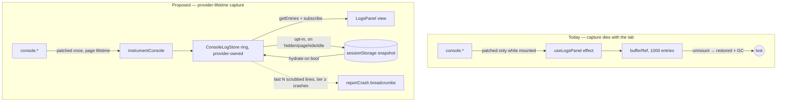
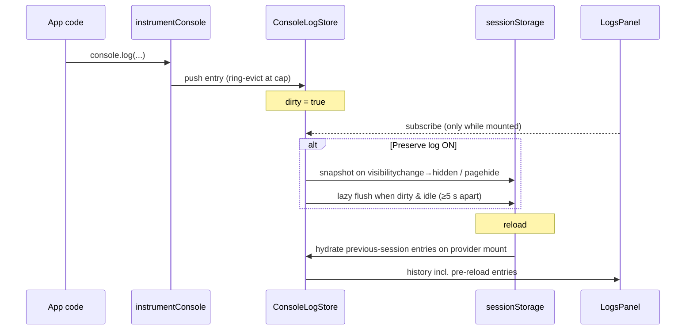
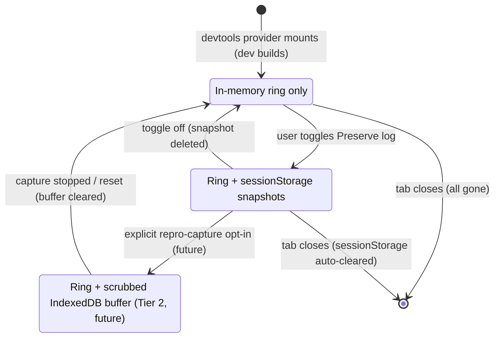

# DevTools Log Persistence — Capturing Logs When The Tab Isn't Looking

## Problem Statement

The DevTools **Logs** tab only captures console output while the tab is
mounted. Navigate to any other panel and the capture stops and the buffer is
destroyed; come back and you start from zero. Concretely:

1. Logs should keep accumulating while you're looking at another panel (or
   while the dock is closed entirely) — the interesting log lines are almost
   always emitted *before* you open the Logs tab to look for them.
2. Ideally logs survive **for a session** (including a reload), because the
   bugs worth debugging often involve a reload or a crash.
3. This must be **cheap** — no streaming logs into SQLite, no constant disk
   churn, no measurable cost to users who never open devtools.
4. This must be **secure** — logs are a classic PII/token sink, and anything
   persisted client-side is readable by any same-origin script.
5. It should clarify the relationship with **telemetry**: does the telemetry
   event stream persist, should it, and how do logs and telemetry records
   relate?

## Executive Summary

The bug is architectural, not a missing storage engine: the console tap lives
inside a **React hook on the panel component**
([useLogsPanel.ts:142-179](../../packages/devtools/src/panels/LogsPanel/useLogsPanel.ts)),
so unmounting the tab restores `console.*` and garbage-collects the buffer.
Meanwhile the devtools *already* owns a provider-lifetime, memory-bounded ring
buffer (`DevToolsEventBus`, 10 000 events) that every other panel replays
history from — the Logs panel is the only panel that doesn't use the pattern.

The recommendation is a three-tier ladder, matching the industry consensus
(Sentry breadcrumbs, Chrome's "Preserve log", Datadog's batch buffers):

- **Tier 0 (fix the bug, ship first):** lift the console tap into a
  provider-level `ConsoleLogStore` — a dedicated ring buffer owned by
  `XNetDevToolsProvider`, alive for the whole page lifetime. The panel becomes
  a pure view. Zero storage, zero I/O, ~200 KB of bounded memory. This alone
  resolves the complaint.
- **Tier 1 (session persistence, opt-in toggle):** a "Preserve log" toggle
  that snapshots the ring to **`sessionStorage`** on `visibilitychange` →
  hidden / `pagehide` plus a lazy dirty-flush. Survives reloads, dies with the
  tab — exactly the session scope requested, and the privacy-safe default
  scope per prior art. Cost: one ~100–300 KB string write every few seconds
  *at most*, only while the toggle is on.
- **Tier 2 (durable capture, deferred until a real need):** an
  IndexedDB-backed capped log buffer reusing the exact `TelemetryBufferStore`
  pattern that `@xnetjs/telemetry` already ships
  ([persistence.ts](../../packages/telemetry/src/collection/persistence.ts)) —
  batched single-transaction writes, pruning, PII scrubbing before write.
  Only worth building when a concrete "capture across reloads for bug repro"
  workflow demands it.

**SQLite is explicitly rejected** as a log sink: it would contend with the
worker's exclusive OPFS SyncAccessHandle, pollute the user's synced data
store, and buy durability nobody asked for. **localStorage is rejected for
log content** (synchronous writes, ~5 MB quota, indefinite retention of a
token-rich payload readable by any XSS).

**Telemetry stays a separate pipeline.** It already has durable, consent-gated
persistence (`IndexedDBTelemetryBuffer`, exploration 0187) with scrubbing and
pruning — logs should not be routed through it, and the devtools event mirror
of telemetry needs no persistence. The one worthwhile bridge is Sentry-style
**breadcrumbs**: at consent tier `crashes`+, attach the last N *scrubbed* log
lines to a crash report.

## Current State In The Repository

### The Logs panel — capture dies with the component

[packages/devtools/src/panels/LogsPanel/useLogsPanel.ts](../../packages/devtools/src/panels/LogsPanel/useLogsPanel.ts)
does two jobs:

1. **Debug-channel toggles** — flips the localStorage flags that packages
   check before logging (`xnet:sync:debug`, `xnet:sqlite:debug`,
   `xnet:query:debug`, `xnet:boot:debug`, `xnet:trace`). These are *config*,
   already persistent, and fine where they are.
2. **Console capture** — a `useEffect` patches `console.debug/log/info/warn/
   error`, pushes stringified entries into `bufferRef` (capped at
   `MAX_LOGS = 1000`), and batches UI updates every `FLUSH_MS = 300`. The
   effect's cleanup **restores the original console methods**, and the refs
   die with the component.

The Shell renders only the active panel
([Shell.tsx:190](../../packages/devtools/src/panels/Shell.tsx)), so switching
tabs unmounts `LogsPanel` → cleanup runs → capture stops, buffer gone. That is
the entire bug.

### The pattern every other panel uses

[packages/devtools/src/core/event-bus.ts](../../packages/devtools/src/core/event-bus.ts)
is a typed, memory-bounded ring buffer (`DEFAULTS.MAX_EVENTS = 10_000`,
[constants.ts](../../packages/devtools/src/core/constants.ts)) created once in
`XNetDevToolsProvider` (`busRef`,
[DevToolsProvider.tsx:374](../../packages/devtools/src/provider/DevToolsProvider.tsx))
and instrumented at provider level — `instrumentStore`, `instrumentTelemetry`,
`instrumentTracing`, `instrumentYDoc` all attach in provider `useEffect`s and
emit regardless of which panel is visible. Panels replay history with
`bus.getEvents()` and subscribe for live updates. **There is no `log:*` event
type** in [core/types.ts](../../packages/devtools/src/core/types.ts) — console
capture simply never joined this architecture.

### Telemetry already solved its version of this problem

`@xnetjs/telemetry` has a complete durable-buffer stack:

- [collection/persistence.ts](../../packages/telemetry/src/collection/persistence.ts)
  — `TelemetryBufferStore` interface (append / all / setStatus / remove /
  prune) with `MemoryTelemetryBuffer` and `IndexedDBTelemetryBuffer`
  implementations. The IndexedDB store (`xnet-telemetry` DB) indexes
  `(status, createdAt)` so pruning stays cheap, and hydrates the collector on
  startup.
- [collection/scrubbing.ts](../../packages/telemetry/src/collection/scrubbing.ts)
  — PII scrubbing (paths, emails, IPs, URL params; tokens/UUIDs/DIDs always).
- [consent/types.ts](../../packages/telemetry/src/consent/types.ts) —
  progressive tiers `off → local → crashes → anonymous → identified`.

The devtools **TelemetryPanel** doesn't read that durable buffer; it watches a
live mirror —
[instrumentation/telemetry.ts](../../packages/devtools/src/instrumentation/telemetry.ts)
wraps `report*` methods and emits `telemetry:*` events into the bus. So
telemetry *records* persist (consent-gated, scrubbed, pruned) while the
telemetry *devtools view* is ephemeral. That split is correct and should stay.

### Storage engines available in the app

- **OPFS SQLite** — the user's data store, worker-resident, holding an
  **exclusive** SyncAccessHandle lock. A second writer means another
  connection through the same worker and real write amplification on the
  hot path we spent explorations 0249→0266 making fast.
- **IndexedDB** — already used by telemetry; independent of the SQLite worker.
- **localStorage** — used only for tiny flags/prefs (debug channels, panel
  open/height keys in `DevToolsProvider.tsx:276-279`). Correct usage; keep it
  that way.

## External Research

Full details and URLs in [References](#references); the load-bearing findings:

1. **Prior art overwhelmingly keeps logs in memory, session-scoped.** Sentry
   breadcrumbs are a mandated in-memory ring (default 100) serialized into an
   event only when an error fires. Chrome DevTools' own "Preserve log"
   survives navigation but *not* tab close. `debug` and `loglevel` persist
   only filter config to localStorage, never content. Datadog/LogRocket batch
   and *upload* within seconds — no durable client store.
2. **IndexedDB cost is per-transaction, not per-record.** One transaction per
   write: ~2 s for 1 000 records; one batched transaction: ~26 ms for 100,
   ~344 % faster at 10 k. `durability: 'relaxed'` gives up to ~15× on Chrome.
   So *if* we ever go durable, batched flushes make it cheap.
3. **localStorage is the wrong shape**: synchronous main-thread disk writes,
   ~5 MiB origin quota, `QuotaExceededError` on overflow.
4. **sessionStorage matches the ask precisely**: per-tab, survives reload and
   restore, cleared on tab close, ~5 MiB class quota, synchronous (fine for
   one bounded snapshot write).
5. **OPFS sync-handle append** is the fastest durable primitive (3–4× IndexedDB
   for bulk I/O) but is worker-only with an exclusive file lock — leadership
   coordination we already know the cost of (exploration 0263). Overkill here.
6. **Flush triggers**: `visibilitychange → hidden` is "the last reliably
   observable event"; combined with `pagehide` ≈ 91 % delivery. Avoid
   `unload`/`beforeunload` (mobile-unreliable, breaks bfcache).
7. **CompressionStream** (gzip) is universal since Safari 16.4 and gets
   60–80 % on JSON logs — available if the snapshot ever presses the quota,
   not needed at 1 000 entries.
8. **Security**: OWASP treats everything in web storage as readable by any
   same-origin script — one XSS exfiltrates the store. Logs are a classic
   token/PII sink. Bounded size + session scope + scrub-before-persist *is*
   the mitigation stack; indefinite raw-log retention is the anti-pattern.

## Key Findings

1. **This is a lifecycle bug wearing a storage costume.** The user asks "can
   we store logs?" but tier 0 needs no storage at all — just moving the tap
   from panel scope to provider scope. 90 % of the value ships with 0 % of the
   storage risk.
2. **The repo already has both halves of the answer.** The ring-buffer-at-
   provider-level pattern (event bus) fixes capture-while-away; the
   `TelemetryBufferStore` pattern (telemetry) is the ready-made blueprint if
   durable capture is ever justified. No new architecture is required.
3. **A dedicated ring beats reusing the event bus.** Emitting `log:entry`
   events into the shared 10 k bus would let one chatty debug channel
   (`xnet:query:debug` can emit hundreds of lines/sec) evict store/sync/query
   events that other panels rely on. Logs need their own eviction domain.
4. **The performance fear is misplaced for tiers 0–1.** The tap costs
   microseconds per log line (stringify + array push); the ring is ~200 KB at
   1 000 entries; a sessionStorage snapshot is one bounded write on
   already-lossy lifecycle events. The *expensive* designs (SQLite streaming,
   per-line IndexedDB writes) are exactly the ones we reject.
5. **The security posture writes itself from prior art**: session scope by
   default, opt-in for anything durable, scrub with the existing telemetry
   scrubber before anything touches disk, hard caps everywhere, and wire the
   log stores into the existing "wipe local data" reset path
   (`onResetLocalData`, Reset panel).
6. **Telemetry needs nothing.** Its records already persist correctly
   (consent-gated IndexedDB with pruning); its devtools mirror is correctly
   ephemeral. The only enrichment worth taking is crash breadcrumbs.

## Options And Tradeoffs

### Where the capture lives

| Option | Captures while tab closed | Complexity | Verdict |
|---|---|---|---|
| A. Hook in panel (status quo) | ✗ | — | The bug |
| B. `log:entry` events on the shared `DevToolsEventBus` | ✓ | Low | ✗ — chatty channels evict other panels' events from the shared ring |
| C. **Dedicated `ConsoleLogStore` ring owned by the provider** | ✓ | Low | ✅ recommended — own capacity, own eviction, panel becomes a view |
| D. Capture in the data worker / SharedWorker | ✓ + multi-tab | High | ✗ — console patching is per-realm anyway; workers' own `console` calls don't cross realms. Not worth it |

### Where (and whether) entries persist

| Option | Survives tab switch | Survives reload | Survives restart | Write cost | Security exposure | Verdict |
|---|---|---|---|---|---|---|
| 0. In-memory ring (provider) | ✓ | ✗ | ✗ | none | none at rest | ✅ default, always on in dev |
| 1. **sessionStorage snapshot** | ✓ | ✓ | ✗ | 1 bounded sync write on hide/idle (~100–300 KB, ms-scale) | per-tab, auto-cleared on close | ✅ opt-in "Preserve log" toggle |
| 2. IndexedDB capped buffer | ✓ | ✓ | ✓ | ~26 ms per batched flush of 100s of rows | durable at rest → must scrub + prune + cap | ⏸ deferred; blueprint exists in telemetry |
| 3. localStorage log content | ✓ | ✓ | ✓ | sync main-thread writes, 5 MB ceiling | worst: durable, unscoped, forever | ✗ rejected |
| 4. OPFS log file (sync handle) | ✓ | ✓ | ✓ | fastest bulk I/O | worker + exclusive-lock coordination | ✗ overkill; revisit only for an Electron file-log story |
| 5. App SQLite (`debug.sql` / store) | ✓ | ✓ | ✓ | contends with the exclusive SAH worker on the hot path; write amplification on every log line | logs enter the user's (potentially synced) data domain | ✗ rejected — the user's instinct is right |

### Telemetry integration

| Option | Verdict |
|---|---|
| Route console logs through `TelemetryCollector` as records | ✗ — logs are unscrubbed free text at firehose rates; telemetry records are deliberate, bucketed, consent-gated. Merging poisons the clean pipeline |
| Persist the devtools `telemetry:*` event mirror | ✗ — the underlying records already persist in `IndexedDBTelemetryBuffer`; persisting the mirror duplicates data with less rigor |
| **Crash breadcrumbs**: `reportCrash` attaches last N scrubbed log lines at tier ≥ `crashes` | ✅ — Sentry-proven, bounded, consent-gated, reuses `scrubData` |
| Unified `DiagnosticSink` abstraction over logs + telemetry + traces | ⏸ interesting shape (tracing egress already exists in `telemetry/src/tracing/egress.ts`) but premature; revisit if a support-bundle feature lands |

### Architecture: current vs proposed



### Session-persistence lifecycle



### Capture-mode state machine



## Recommendation

Ship in two small phases; defer the third until a concrete need.

**Phase 1 — provider-level capture (the actual fix).**
Add `packages/devtools/src/core/log-store.ts` (`ConsoleLogStore`: ring buffer
+ subscribe, reusing the event-bus shape) and
`packages/devtools/src/instrumentation/console.ts` (`instrumentConsole`: the
tap currently in `useLogsPanel`, including `stringifyArgs` and
`classifyChannel`, returning a cleanup). Wire both in `XNetDevToolsProvider`
alongside the other `instrument*` calls; expose the store via
`DevToolsContext`. Rewrite `useLogsPanel` to be a view: filters, search, and
the debug-channel toggles stay; the tap and buffer go. Keep capacity at 1 000
entries initially (raise later if cheap); keep the pause/capture toggles,
now acting on the store. Recursion guard: the tap must not re-enter itself
via `console.error` in its own path (the bus listener-error logging pattern
already sets the precedent).

**Phase 2 — "Preserve log" session persistence.**
A toggle in the Logs panel header (default **off**, persisted as a flag like
the debug channels). While on: snapshot the ring to
`sessionStorage['xnet:devtools:logs:v1']` on `visibilitychange → hidden` and
`pagehide`, plus a dirty-flush at most every 5 s. Cap the serialized snapshot
(~1 MB / last 1 000 entries, truncate oldest). On provider mount, hydrate and
mark restored entries so the panel can render a session divider. Toggling off
deletes the key. Wipe the key in the Reset panel / `onResetLocalData` path.

**Phase 3 (deferred) — durable repro capture.**
Only when a real workflow needs capture across full restarts: a
`LogBufferStore` clone of `TelemetryBufferStore` over its own IndexedDB
database, batched single-transaction flushes with `durability: 'relaxed'`,
`scrubData` applied **before** write, hard cap (e.g. 5 000 entries / 5 MB)
with prune-on-open, and a loud "capturing to disk" indicator while active.

**Telemetry:** change nothing structurally. Optionally (can ride Phase 2 or
later): in `TelemetryCollector.reportCrash`, pull the last ~50 entries from
`ConsoleLogStore` (when devtools is mounted), scrub them, and attach as a
breadcrumb context field — consent tier ≥ `crashes` already gates sharing.

**Explicitly not doing:** streaming logs into the app's SQLite store or the
`changes` log; localStorage log content; always-on durable logging; any
upload of log content.

## Example Code

Phase 1 — the tap, extracted to instrumentation:

```ts
// packages/devtools/src/instrumentation/console.ts
import type { ConsoleLogStore } from '../core/log-store'
import { classifyChannel, stringifyArgs } from '../core/log-store'

const LEVELS = ['debug', 'log', 'info', 'warn', 'error'] as const

/** Patch console.* for the page lifetime; returns a restore function. */
export function instrumentConsole(store: ConsoleLogStore): () => void {
  if (typeof console === 'undefined') return () => {}
  const originals = {} as Record<(typeof LEVELS)[number], (...a: unknown[]) => void>
  let inTap = false // recursion guard: a listener logging must not re-enter

  for (const level of LEVELS) {
    originals[level] = console[level] as (...a: unknown[]) => void
    console[level] = (...args: unknown[]) => {
      originals[level](...args)
      if (inTap || store.paused) return
      inTap = true
      try {
        const message = stringifyArgs(args)
        store.push({ level, channel: classifyChannel(message), message, at: Date.now() })
      } finally {
        inTap = false
      }
    }
  }
  return () => {
    for (const level of LEVELS) console[level] = originals[level]
  }
}
```

Phase 2 — session snapshots, owned by the store:

```ts
// inside ConsoleLogStore (sketch)
private static KEY = 'xnet:devtools:logs:v1'
private static MAX_SNAPSHOT_BYTES = 1_000_000

attachSessionPersistence(): () => void {
  this.hydrate()
  const flush = () => this.snapshot()
  const onVisibility = () => {
    if (document.visibilityState === 'hidden') flush()
  }
  document.addEventListener('visibilitychange', onVisibility)
  window.addEventListener('pagehide', flush)
  const interval = setInterval(() => {
    if (this.dirty) flush()
  }, 5_000)
  return () => {
    document.removeEventListener('visibilitychange', onVisibility)
    window.removeEventListener('pagehide', flush)
    clearInterval(interval)
  }
}

private snapshot(): void {
  this.dirty = false
  let entries = this.getEntries()
  let json = JSON.stringify(entries)
  while (json.length > ConsoleLogStore.MAX_SNAPSHOT_BYTES && entries.length > 50) {
    entries = entries.slice(Math.ceil(entries.length / 4)) // drop oldest quarter
    json = JSON.stringify(entries)
  }
  try {
    sessionStorage.setItem(ConsoleLogStore.KEY, json)
  } catch {
    /* quota — session persistence is best-effort by design */
  }
}

private hydrate(): void {
  try {
    const raw = sessionStorage.getItem(ConsoleLogStore.KEY)
    if (!raw) return
    for (const e of JSON.parse(raw) as LogEntry[]) {
      this.push({ ...e, restored: true })
    }
  } catch {
    sessionStorage.removeItem(ConsoleLogStore.KEY)
  }
}
```

## Risks And Open Questions

- **Tap ownership collision.** The SQLite panel uses the same
  patch-console approach (per `useLogsPanel`'s header comment). Two live taps
  compose but restore in LIFO order; if the provider tap becomes permanent,
  the SQLite panel should read from `ConsoleLogStore` instead of patching a
  second time. Audit any other `console` patchers in devtools.
- **Worker logs are invisible.** `console.*` inside the data worker never
  crosses into the main realm, so worker-side lines (much of
  `xnet:sqlite:debug`) only appear via whatever the worker already relays.
  Out of scope here, worth a note in the panel UI ("main-thread console
  only").
- **Chatty channels vs capacity.** `xnet:query:debug` at high volume will
  wrap 1 000 entries in seconds. Mitigations if it bites: per-channel ring
  quotas, or raise capacity — memory at 10 000 entries is still only ~2 MB.
- **Secrets in preserved logs.** Even session-scoped, a preserved snapshot
  can hold tokens logged by debug channels. Phase 2 should run entries
  through the telemetry scrubber (or at minimum its token/DID patterns)
  **at snapshot time** — cheap, since snapshots are rare and bounded.
- **Multi-tab semantics.** sessionStorage is per-tab; two tabs preserve
  independently. That's a feature (no cross-tab lock coordination), but the
  UI shouldn't imply a global log.
- **Prod builds.** The devtools ships an `index.dev.ts` / `index.ts` split;
  the tap and any persistence must remain dev-only surface so production
  users never grow a console tap. Verify the no-op path stays no-op.
- Open: should "Preserve log" default **on** in dev builds? Chrome's
  equivalent defaults off; starting off matches least-surprise and the
  security posture. Revisit after use.
- Open: does the Electron shell eventually want a real file log
  (electron-log-style rotation)? If so, Tier 2 should be designed as a
  `LogSink` interface so the desktop shell can supply a file transport.

## Implementation Checklist

Phase 1 — provider-level capture:

- [ ] Add `packages/devtools/src/core/log-store.ts`: `ConsoleLogStore` ring
      (push/getEntries/subscribe/clear/pause, capacity option), moving
      `LogEntry`, `LogLevel`, `LogChannel`, `classifyChannel`, `stringifyArgs`
      out of the panel hook.
- [ ] Add `packages/devtools/src/instrumentation/console.ts`:
      `instrumentConsole(store)` with recursion guard and restore-on-cleanup.
- [ ] Wire both in `XNetDevToolsProvider` (create store in a ref, instrument in
      a `useEffect` alongside the other `instrument*` calls); expose
      `consoleLogs` via `DevToolsContext`.
- [ ] Rewrite `useLogsPanel` as a view over the store (filters/search/pause
      stay; tap and buffer removed); keep debug-channel toggles unchanged.
- [ ] Point the SQLite panel's console capture at `ConsoleLogStore` instead of
      its own patch (remove the duplicate tap).
- [ ] Unit tests: capture continues across panel unmount/remount; ring
      eviction; recursion guard; restore-on-provider-unmount.
- [ ] Changeset for `@xnetjs/devtools` (minor).

Phase 2 — "Preserve log" session persistence:

- [ ] Preserve-log toggle in the Logs panel header, flag persisted like the
      debug channels; default off.
- [ ] `attachSessionPersistence` on the store: hydrate on mount, snapshot on
      `visibilitychange → hidden` + `pagehide` + 5 s dirty-flush, byte-capped.
- [ ] Scrub snapshot entries with the telemetry scrubber's token/DID/email
      patterns before writing.
- [ ] Session-divider rendering for `restored` entries in `LogsPanel.tsx`.
- [ ] Clear the snapshot key from the Reset panel / `onResetLocalData` wipe
      path, and on toggle-off.
- [ ] Unit tests: hydrate/snapshot round-trip, cap truncation, quota-error
      swallow, key cleared on toggle-off.
- [ ] Changeset for `@xnetjs/devtools` (minor).

Optional rider — crash breadcrumbs:

- [ ] `reportCrash` context gains `recentLogs` (last ~50 entries, scrubbed)
      when a `ConsoleLogStore` is registered; gated at tier ≥ `crashes`.

Deferred (Phase 3, needs a driving use case):

- [ ] `LogBufferStore` over IndexedDB (clone of `TelemetryBufferStore`),
      batched relaxed-durability flushes, hard caps, prune-on-open, scrub
      before write, loud capture indicator.

## Validation Checklist

- [ ] Repro the original bug on `main` (logs vanish on tab switch), then
      verify on the branch: emit logs, switch to Data panel, switch back —
      entries still present and capture continued while away.
- [ ] Close the dock entirely, generate logs, reopen — entries present.
- [ ] With Preserve log ON: reload the page — pre-reload entries render behind
      a session divider; close the tab, reopen the app — entries gone
      (sessionStorage cleared by the browser).
- [ ] With Preserve log OFF (default): reload — buffer empty; sessionStorage
      key absent.
- [ ] Perf: with `xnet:query:debug` on and the app under load, main-thread
      profile shows no visible cost from the tap (< 1 ms/s aggregate), and no
      storage writes occur with the toggle off.
- [ ] Snapshot of a token-bearing log line shows `[TOKEN]`/`[REDACTED]` in
      sessionStorage, raw text still visible in the live panel.
- [ ] Reset panel wipe removes `xnet:devtools:logs:v1`.
- [ ] Production build: `console.*` identity-equal to the originals (no tap).

## References

- Repo: [useLogsPanel.ts](../../packages/devtools/src/panels/LogsPanel/useLogsPanel.ts),
  [event-bus.ts](../../packages/devtools/src/core/event-bus.ts),
  [DevToolsProvider.tsx](../../packages/devtools/src/provider/DevToolsProvider.tsx),
  [telemetry persistence.ts](../../packages/telemetry/src/collection/persistence.ts),
  [scrubbing.ts](../../packages/telemetry/src/collection/scrubbing.ts),
  [consent/types.ts](../../packages/telemetry/src/consent/types.ts);
  explorations 0187 (telemetry durable buffer), 0249/0263/0266 (SQLite worker
  hot-path), 0210 (consent spine).
- Sentry breadcrumbs spec (in-memory ring, default 100):
  <https://develop.sentry.dev/sdk/foundations/state-management/scopes/breadcrumbs/>
- Chrome DevTools console "Preserve log" (session-scoped):
  <https://developer.chrome.com/docs/devtools/console/reference>
- Nolan Lawson, IndexedDB read/write performance (batching, relaxed
  durability): <https://nolanlawson.com/2021/08/22/speeding-up-indexeddb-reads-and-writes/>
- RxDB storage comparisons and benchmarks:
  <https://rxdb.info/articles/localstorage-indexeddb-cookies-opfs-sqlite-wasm.html>,
  <https://rxdb.info/slow-indexeddb.html>, <https://rxdb.info/rx-storage-performance.html>
- OPFS `createSyncAccessHandle` (worker-only, exclusive lock):
  <https://developer.mozilla.org/en-US/docs/Web/API/FileSystemFileHandle/createSyncAccessHandle>
- Page Lifecycle API (`visibilitychange`/`pagehide` as flush triggers):
  <https://developer.chrome.com/docs/web-platform/page-lifecycle-api>
- Datadog browser-logs SDK (batching, `beforeSend` scrubbing):
  <https://docs.datadoghq.com/logs/log_collection/javascript/>
- electron-log file transport (rotation prior art for a desktop file sink):
  <https://github.com/megahertz/electron-log/blob/master/docs/transports/file.md>
- OWASP HTML5 security cheat sheet (web storage readable by same-origin JS):
  <https://cheatsheetseries.owasp.org/cheatsheets/HTML5_Security_Cheat_Sheet.html>
- `sessionStorage` semantics: <https://developer.mozilla.org/en-US/docs/Web/API/Window/sessionStorage>
- Compression Streams API: <https://web.dev/blog/compressionstreams>
