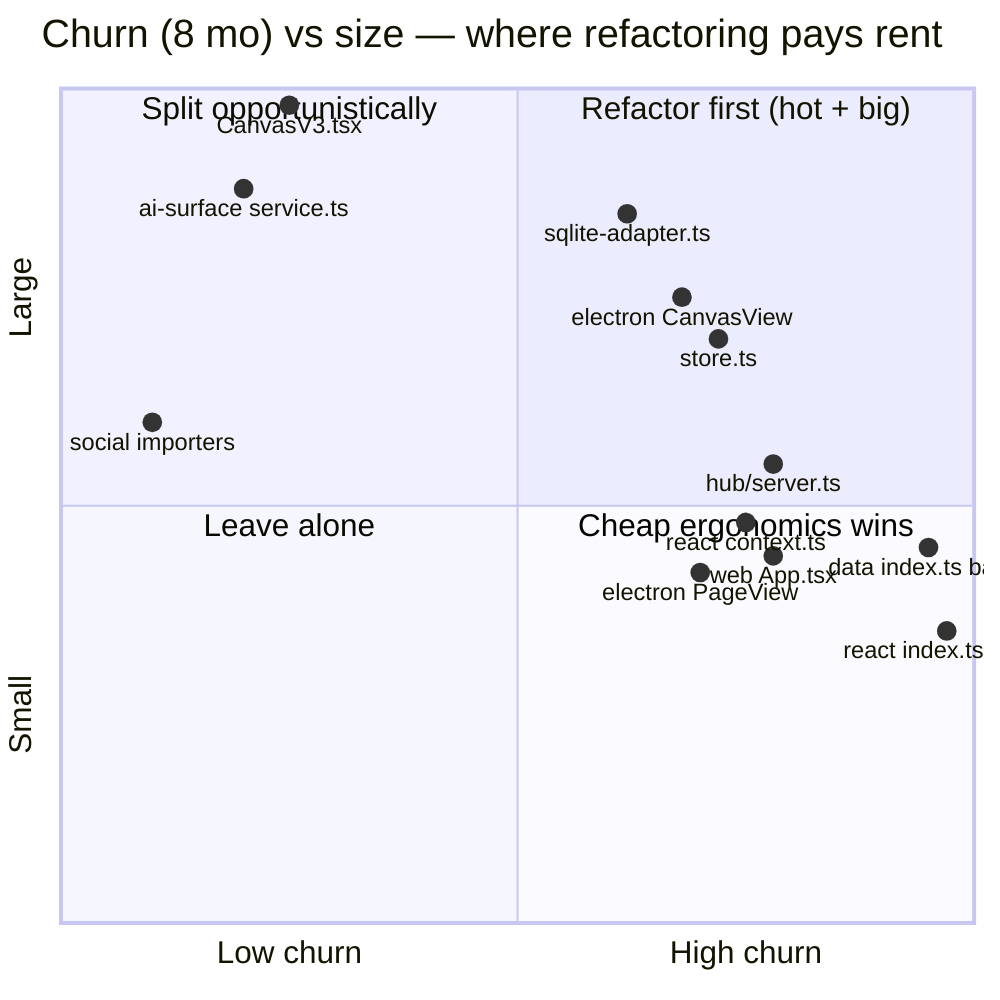
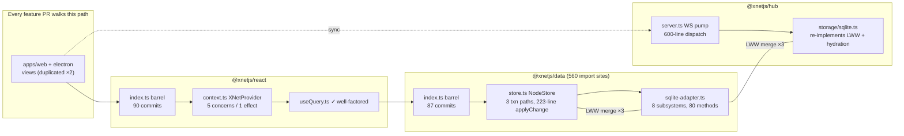
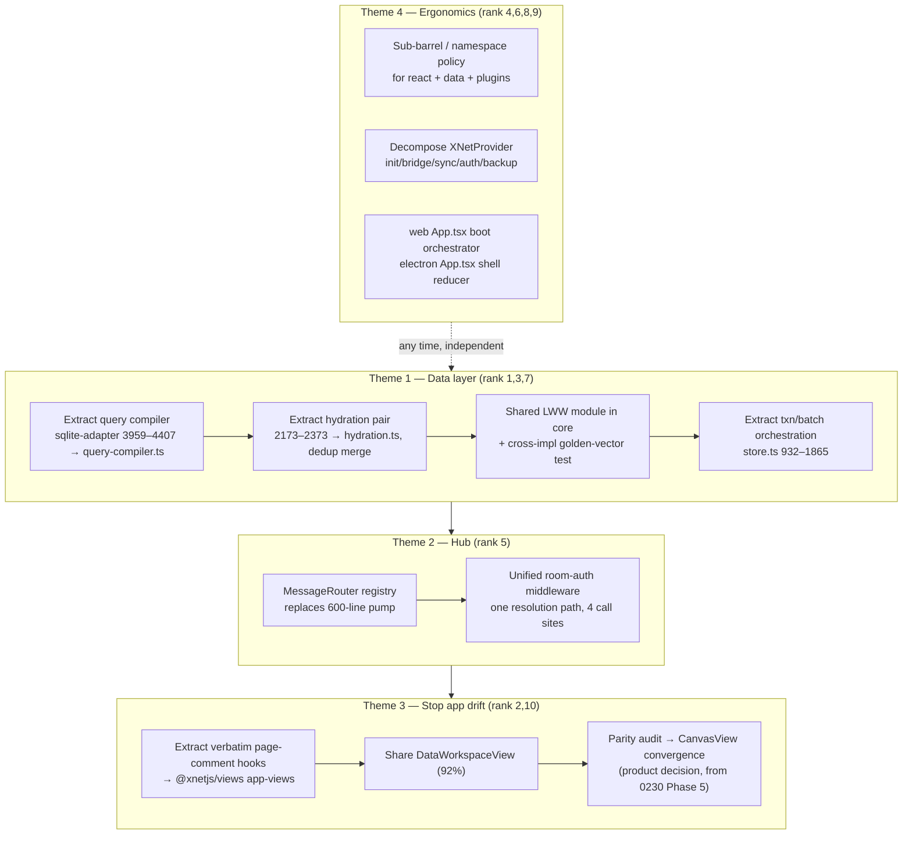

# Well-Traveled Code Paths: A Churn-Weighted Refactor Map

> Status: unimplemented (`[_]`). Numbers measured against the repo at
> `ae4c02fb` (2026-07-06); churn windows are the trailing 8 months of git
> history unless stated otherwise. Companion to exploration
> `0230_[_]_CODEBASE_REFACTORING_ATLAS_DEAD_CODE_GOD_FILES_AND_DEDUPLICATION.md`
> — 0230 ranked opportunities by _lines removable_; this doc ranks them by
> _traffic_: the files every feature PR has to walk through.

## Problem Statement

Where are the most impactful refactors in the codebase — specifically in the
code paths that are most well traveled, where cleaning up, simplifying, or
improving legibility pays back on every future change?

"Impactful" here is not "most lines deleted" (0230 covered that). It is: which
files do we _edit most often_, weighted by how _hard they are to edit_? A
7,700-line file nobody touches is sleeping debt; a 2,700-line file changed 47
times in 8 months taxes nearly every feature. The classic hotspot literature
(Tornhill's _Your Code as a Crime Scene_, CodeScene) formalizes this as
**churn × complexity**: the small fraction of code that is both complicated and
frequently changed accounts for 25–70% of defects.

## Executive Summary

Measuring `commits-touching-file × current LOC` over 8 months produces a clear,
somewhat surprising ranking. The **data layer** — not the canvas — is the
hottest ground in the repo, and it also happens to be the best test-protected
place to refactor. The giant `CanvasV3.tsx` (7,758 LOC) does not even crack the
top-40 churn list; its churn happens one layer up, in the app-level
`CanvasView` wrappers that are duplicated between web and electron.

| Rank | File                                                   | Changes |   LOC | Churn×LOC | What makes it hard to edit                                   |
| ---- | ------------------------------------------------------ | ------: | ----: | --------: | ------------------------------------------------------------ |
| 1    | `packages/data/src/store/sqlite-adapter.ts`            |      35 | 4,407 |      154k | 80-method god class: 8 subsystems in one file                |
| 2    | `apps/electron/src/renderer/components/CanvasView.tsx` |      42 | 3,195 |      134k | drifted 74%-larger fork of the web copy                      |
| 3    | `packages/data/src/store/store.ts`                     |      47 | 2,763 |      130k | 40+ public methods; dual fast/slow txn paths                 |
| 4    | `packages/data/src/index.ts`                           |      87 | 1,193 |      104k | pure barrel — API-surface ceremony + conflicts               |
| 5    | `packages/hub/src/server.ts`                           |      56 | 1,750 |       98k | 600-line WebSocket if/else message pump                      |
| 6    | `packages/react/src/index.ts`                          |      90 |   842 |       76k | pure barrel — highest raw churn in the repo                  |
| 7    | `packages/hub/src/storage/sqlite.ts`                   |      26 | 2,539 |       66k | reimplements LWW/hydration from #1                           |
| 8    | `packages/react/src/context.ts`                        |      49 | 1,213 |       59k | `XNetProvider` god-component (84-line useEffect, 5 concerns) |
| 9    | `apps/web/src/App.tsx`                                 |      56 | 1,009 |       57k | boot orchestration + state machine + telemetry interleaved   |
| 10   | `apps/electron/src/renderer/components/PageView.tsx`   |      44 |   993 |       44k | 93%-identical fork of web's PageView, **0 shared commits**   |

Four themes fall out, in recommended order:

1. **Data-layer decomposition** (ranks 1, 3, 7) — highest traffic, cleanest
   seams, and uniquely well protected: ~205 KB of adapter/store tests plus the
   0272 reliability lane. Extract the query compiler, the dual-mode hydration,
   and a single shared LWW-merge module (currently reimplemented **3×**).
2. **Hub message router** (rank 5) — the WebSocket pump is one 600-line
   dispatch chain where auth logic is copy-pasted across 4 handlers. A
   handler-registry refactor is mechanical and removes the single highest-churn
   editing chokepoint on the server.
3. **Stop the web/electron drift** (ranks 2, 10) — 6,574 duplicated lines
   across 10 component pairs; `PageView`'s ~800-line comment state machine is
   verbatim-identical yet the two copies have **zero commits in common**. 0230
   deferred whole-component convergence pending a parity audit — still right —
   but the _verbatim_ hooks can be extracted now with no parity question.
4. **Barrel + provider ergonomics** (ranks 4, 6, 8) — the two biggest barrels
   absorb 90 and 87 commits of pure re-export ceremony; `XNetProvider` bundles
   five initialization concerns into one effect. Cheap fixes, felt weekly.

`CanvasV3.tsx` and `ai-surface/service.ts` stay on the list (0230 Phase 4) but
are explicitly _down-weighted_: at current churn they should be split
opportunistically — when a feature already forces you in — not as standalone
projects.



## Current State In The Repository

### How the ranking was computed

```bash
git log --since="8 months ago" --pretty=format: --name-only \
  | grep -E '^(packages|apps)/.*\.(ts|tsx)$' \
  | grep -vE '\.(test|spec|stories|gen)\.' \
  | sort | uniq -c | sort -rn          # churn
# then score = churn × current wc -l   # hotspot rank
```

### Theme 1 — the data layer is the hottest and best-protected ground

Every one of the 560 `@xnetjs/data` import sites funnels through two files.

**`packages/data/src/store/sqlite-adapter.ts` (4,407 LOC, 35 changes).** One
class, 16 public + 64 private methods, spanning eight subsystems that are
separable today:

| Lines (approx) | Subsystem                                                                                                                                                                                               |
| -------------- | ------------------------------------------------------------------------------------------------------------------------------------------------------------------------------------------------------- |
| 536–803        | change-log operations (append/get/prune)                                                                                                                                                                |
| 804–1188       | node CRUD + three near-duplicate list/count SQL builders                                                                                                                                                |
| 1370–2170      | batch import — ~800 lines of duplicated operation builders                                                                                                                                              |
| 2173–2373      | **hydration, twice**: joined-row and JSON-aggregated modes share ~200 near-identical lines incl. the LWW property merge                                                                                 |
| 2374–2643      | materialized views (0182 Phase 7)                                                                                                                                                                       |
| 2644–3157      | three index families (scalar / FTS / spatial) with the same sync/rebuild/drop lifecycle each                                                                                                            |
| 3429–3550      | adaptive-index budget management (0264)                                                                                                                                                                 |
| 3959–4407      | **the query compiler**: `compileNodeQuery`/`compileSqlQuery` + fused candidate-and-hydrate CTE (0264 Wave 1), with feature flags (`adaptiveIndexing.enabled`, `queryVerification`) braided into codegen |

**`packages/data/src/store/store.ts` (2,763 LOC, 47 changes).** `NodeStore` has
40+ public methods and three parallel execution paths (single-write fast path,
transaction slow path at lines ~1608–1765, transaction fast path at
~1766–1865) that each re-implement conflict tracking and listener dispatch.
`applyChange` (~2265–2488) is a 223-line method mixing LWW merge, property
reconciliation, encryption hooks, telemetry, and listener emission.

**The LWW merge exists three times**: `store.ts` `applyChange`, the adapter's
hydration property merge (~line 2200), and `packages/hub/src/storage/sqlite.ts`
(~line 1200). This is the exact same drift class the SSRF-guard duplication in
0230 was — except this one guards _data convergence_, the protocol's core
invariant (exploration 0200 golden vectors; 0272 sim already caught one
lamport-only LWW guard bug that shipped).

**Why refactoring here is unusually safe:** `sqlite-adapter.test.ts` (125 KB)
and `store.test.ts` (80 KB) cover all eight subsystems and both transaction
paths; `query-ast.test.ts` covers the in-memory evaluator; and the 0272
reliability lane (`tests/reliability/` fault injection, restore drills,
adapter conformance) pins crash/recovery behavior. This is the rare god file
with characterization tests already written.

Also verified: `packages/data/src/store/query-ast.ts` (1,409 LOC) is **not**
the SQL compiler — it is the query _type system_ plus an in-memory evaluator
used for JS fallback filtering. SQL generation lives only in the adapter. The
seam between them is already clean; the extraction below just makes it a file
boundary.

### Theme 2 — hub `server.ts`: one function absorbs most server churn

`packages/hub/src/server.ts` (1,750 LOC, 56 changes — the highest churn of any
non-barrel file). The HTTP side is already modular (`app.route('/backup', …)`
etc. — 11 mounted route modules). The churn magnet is the **WebSocket message
pump** (lines ~1070–1600+): 12+ message types dispatched through a chain of
type-guard if/else branches, where each handler repeats the same
auth-check → service-call → send → metrics shape, and the room-authorization
logic (`authorizeRoomAction`, lines 327–451) is invoked in four subtly
different inline forms. Every new message type or auth tweak edits this one
600-line closure. There are unit tests for capabilities/auth/query but **no
end-to-end test of the pump itself** — a handler registry would make each
message type testable in isolation.

### Theme 3 — web/electron view duplication is drifting, measurably

Ten component pairs exist in both `apps/web/src/components/` and
`apps/electron/src/renderer/components/` — 6,574 lines total on the two sides:

| Pair                    | Web LOC | Electron LOC | Similarity                                                                                                   | Commits touching web / electron / both (6 mo) |
| ----------------------- | ------: | -----------: | ------------------------------------------------------------------------------------------------------------ | --------------------------------------------- |
| `PageView.tsx`          |   1,101 |          993 | ~93% — comment popover state machine, orphaned-thread assembly, and all comment action handlers are verbatim | 12 / 44 / **0**                               |
| `DataWorkspaceView.tsx` |   1,060 |        1,189 | ~92% — identical types and atlas/query logic                                                                 | 13 / 12 / 9                                   |
| `CanvasView.tsx`        |   1,843 |        3,195 | 60–70% — electron grew query frames + source references; web grew Desk + moderation gating                   | 23 / 42 / 11                                  |
| `DatabaseView.tsx`      |     849 |          726 | ~85%                                                                                                         | —                                             |
| `ShareButton.tsx`       |      40 |          320 | ~20% — effectively different components                                                                      | —                                             |
| (5 more small pairs)    |         |              | 95–100%                                                                                                      | —                                             |

The `PageView` numbers are the alarm: the copies are nearly identical _and_
share **zero commits** — fixes land on one side only, silently. Git history
shows the drift is passive (parallel evolution, never an intentional fork).
The blocker to full convergence is real: web views integrate with the
workbench/router (`useWorkbench`, `useContextPanel`, `useStatusBarItem`),
electron with the canvas shell and IPC bridge
(`apps/electron/src/renderer/lib/ipc-sync-manager.ts`). But the _verbatim_
logic — the comment state machine, thread assembly, action handlers, roughly
800 lines — has no platform dependency at all and can move to a shared package
today. 0230's "defer pending parity audit" stays correct for the component
shells; it should not keep hostage the hooks that are already identical.

### Theme 4 — barrels and the provider: small files, weekly tax

- `packages/react/src/index.ts` — **90 commits**, the most-churned file in the
  repo; pure re-exports. `packages/data/src/index.ts` — 87 commits, same.
  `packages/plugins/src/index.ts` — 47. Every new hook/schema/feature edits
  these, so they are standing merge-conflict magnets, and `export *`-style
  growth degrades tree-shaking and go-to-definition (see External Research).
- `packages/react/src/context.ts` (1,213 LOC, 49 changes) — `XNetProvider`
  runs node-storage init, runtime-bridge resolution, sync-manager creation,
  hub auth-token fetching, and backup orchestration; the central `useEffect`
  (~lines 637–720) alone interleaves five concerns with a shared cleanup. It
  has no direct tests and is very hard to simulate failure modes for.
- `apps/web/src/App.tsx` (1,009 LOC, 56 changes) — a 7-state boot state
  machine, ~280-line storage-init effect, storage-durability watchers spread
  over 3 effects, and PWA install handling, all inline. Its electron sibling
  (1,193 LOC) churns for a different reason: each new shell view
  (`social-import`, `data-workspace`, `stories`) edits a `ShellState` union
  plus 4+ switch sites.
- By contrast `packages/react/src/hooks/useQuery.ts` (33 changes) was audited
  and is **well-factored** — descriptor creation, subscription, transform, and
  telemetry are cleanly layered. High churn alone isn't a problem; churn ×
  entanglement is. It also serves as the house style to refactor toward.

### The sleeping giants (deliberately down-weighted)

`packages/canvas/src/renderer/CanvasV3.tsx` (7,758 LOC) and
`packages/plugins/src/ai-surface/service.ts` (4,496 LOC) are the two biggest
files but neither appears in the top-40 churn list. Their seams are mapped
(input-handler modules, viewport reducer, selection capabilities, mutation
dispatcher for CanvasV3; tool registry + URI router + mutation pipeline for
the AI surface — which currently requires editing **three places** to add one
tool and has **no test file at all**). These belong on the "split when you're
already in there" list, with the AI surface's missing tests being the one item
worth doing eagerly.



## External Research

- **Hotspot prioritization.** CodeScene/Tornhill's method — prioritize by
  churn × complexity, because change frequency from version control is the
  best available proxy for where defects and effort concentrate; top hotspots
  are typically a small slice of code responsible for 25–70% of defects
  ([CodeScene hotspots docs](https://docs.enterprise.codescene.io/versions/4.0.16/guides/technical/hotspots.html),
  [Understand Legacy Code — hotspot analysis](https://understandlegacycode.com/blog/focus-refactoring-with-hotspots-analysis/),
  [CodeScene — prioritize tech debt](https://codescene.com/blog/tech-debt-examples-prioritize-technical-debt-with-codescene)).
  This doc is exactly that method applied to xNet.
- **Barrel files.** Known costs: bigger module graphs and slower builds
  (Next.js measured 15–70% faster dev builds bypassing barrels), impaired
  tree-shaking with `export *`, circular-dependency hiding, and constant merge
  conflicts — with the standard mitigation being _scoped_ sub-barrels or
  generated barrels for a stable public API
  ([jsdev.space on replacing barrels](https://jsdev.space/howto/stop-using-barrel-files/),
  [webpack discussion #16863](https://github.com/orgs/webpack/discussions/16863),
  [barrel pros/cons](https://rahuulmiishra.medium.com/barrel-files-in-javascript-pros-cons-and-when-to-use-them-6efbeb22a8b6)).
  For a published SDK like `@xnetjs/*` the barrel _is_ the public API, so the
  right move is organization + generation, not deletion.
- **Decomposing god components/classes.** The consensus playbook: pin behavior
  with characterization tests, extract _pure_ logic first, extract hooks with
  interface-first design, and strangler-fig the rest — each phase shippable
  ([Extract React Hook refactoring](https://blog.rstankov.com/extract-react-hook-refactoring/),
  [CodeScene — refactoring React with custom hooks](https://codescene.com/blog/refactoring-components-in-react-with-custom-hooks),
  [incremental frontend modernization](https://altersquare.io/how-teams-incrementally-modernize-large-frontend-codebases/),
  [LogRocket — refactor to hooks](https://blog.logrocket.com/refactor-react-components-hooks/)).
  The delegate-wrapper variant (old method forwards to the new module) keeps
  every extraction diff review-sized.

## Key Findings

1. **Traffic and size point at different files.** The biggest file
   (`CanvasV3.tsx`) is cold; the hottest files are the data-layer core, the
   hub server, and the barrels. A refactor plan ranked purely by LOC (0230's
   lens) would over-invest in sleeping giants and under-invest in the write
   path everyone edits weekly.

2. **The single highest-leverage refactor in the repo is decomposing
   `sqlite-adapter.ts` + `store.ts` along their existing seams.** They are
   rank 1 and 3 by traffic, their subsystems are aggregated rather than
   tangled, and they are protected by ~205 KB of direct tests plus the
   reliability lane — the cheapest risk profile a refactor of this size can
   have.

3. **The LWW merge implemented 3× is a correctness time bomb, not a style
   issue.** Convergence is the product's core guarantee; 0272's simulation
   already caught one shipped LWW-guard bug. One shared, golden-vector-tested
   merge module eliminates the drift class.

4. **The hub WebSocket pump is the most mechanical high-ROI extraction.**
   Handler registry + one auth middleware turns a 600-line closure into ~15
   independently testable handlers; it also creates the seam where per-message
   metrics and consistent error shapes become free.

5. **`PageView`'s duplication has crossed from "debt" to "active hazard":**
   93% identical, 56 combined commits, zero shared ones. The verbatim comment
   subsystem (~800 lines) is extractable _now_ without the parity audit that
   rightly blocks whole-component convergence.

6. **Barrel churn is a self-inflicted tax with a cheap fix.** Group new
   surface into namespace/sub-barrel exports (and consider generating the
   schema barrel per 0230 Phase 2) rather than appending to two 1,000-line
   files on every feature.

7. **`useQuery.ts` proves the codebase already knows the target shape.** The
   goal is not new architecture; it is applying the layering that hook already
   has to the seven files that lack it.

## Options And Tradeoffs

### Which theme to lead with

| Option                                          | Pros                                                                                                                         | Cons                                                                                 |
| ----------------------------------------------- | ---------------------------------------------------------------------------------------------------------------------------- | ------------------------------------------------------------------------------------ |
| **A. Data layer first** (recommended)           | Highest traffic; best tests; kills the 3× LWW drift; unblocks 0266 query-perf endgame work by making the compiler standalone | Touches the most-depended-on package; needs careful changesets (fixed-core lockstep) |
| B. Hub router first                             | Most mechanical; smallest blast radius; server churn is highest per line                                                     | Doesn't help the 560 client-side import sites; auth unification needs care           |
| C. Cross-app dedup first                        | Stops active drift; user-visible bug class                                                                                   | Partially blocked by parity questions; touches both app shells at once               |
| D. Sleeping giants first (CanvasV3, ai-surface) | Biggest LOC optics                                                                                                           | Low traffic → low compounding payoff; highest characterization-test cost             |

A → B → C ordering maximizes payback-per-risk; D happens opportunistically.

### How to extract from the god files

| Option                                                                                                                                                 | Pros                                                                                          | Cons                                                                        |
| ------------------------------------------------------------------------------------------------------------------------------------------------------ | --------------------------------------------------------------------------------------------- | --------------------------------------------------------------------------- |
| **Delegate-wrapper extraction** (recommended): new module beside the old file; old method body becomes a one-line forward; tests migrate incrementally | Each PR is small and revertible; public API and test surface unchanged; blame stays navigable | Temporary indirection layer; a long tail of wrappers if never finished      |
| Big-bang split into N files                                                                                                                            | Done in one move                                                                              | Un-reviewable diff on rank-1 hotspots; conflicts with all in-flight work    |
| Freeze + rewrite (v2 adapter)                                                                                                                          | Clean slate                                                                                   | History says no (CanvasV2→V3 left a 2.4K-LOC corpse; 0230 had to delete it) |

### Where the shared LWW merge lives

| Option                                                      | Pros                                                                                                                | Cons                                                                    |
| ----------------------------------------------------------- | ------------------------------------------------------------------------------------------------------------------- | ----------------------------------------------------------------------- |
| **`packages/core` (e.g. `@xnetjs/core/lww`)** (recommended) | Already a dep of both `data` and `hub`; dependency-free; sits next to the 0200 protocol golden vectors conceptually | `core` is in the fixed-version release group — bump discipline needed   |
| Inside `@xnetjs/data`, hub imports it                       | No new surface in core                                                                                              | Hub currently doesn't depend on `data`; would create a heavyweight edge |
| Leave 3 copies, add cross-impl conformance test             | No refactor risk                                                                                                    | Drift remains possible between test runs; 3 places to fix bugs forever  |

Even if the module lands in core, the cross-implementation conformance test
(same golden vectors run against store/adapter/hub paths) is worth writing —
it converts convergence from "reviewed" to "enforced."

### Barrel strategy

| Option                                                                   | Pros                                                                          | Cons                                                                         |
| ------------------------------------------------------------------------ | ----------------------------------------------------------------------------- | ---------------------------------------------------------------------------- |
| **Scoped sub-barrels + namespace exports for new surface** (recommended) | Cuts conflict surface immediately; no build-step change; preserves public API | Existing 1,000-line files shrink only gradually                              |
| Generated barrels from a manifest                                        | Eliminates hand-editing entirely; aligns with 0230's schema-SSoT plan         | New codegen workflow + staleness CI check                                    |
| Deep imports only (`@xnetjs/data/store`)                                 | Best tree-shaking                                                             | Breaking change for SDK consumers; docs churn; not worth it pre-1.0 adoption |

## Recommendation

Work the four themes as **independent PR series**, highest traffic first.
Every extraction uses the delegate-wrapper pattern and ships behind the
existing public API. Full plan:



**Concrete first steps (each one PR):**

1. **`query-compiler.ts`** — move `compileNodeQuery`/`compileSqlQuery`/
   `tryFuseCandidateWithHydrate` + telemetry hooks out of
   [sqlite-adapter.ts](packages/data/src/store/sqlite-adapter.ts) behind a
   `QueryCompiler` taking `(descriptor, schemaContext, flags)`. Adapter methods
   become forwards. Move the relevant test blocks.
2. **`hydration.ts`** — `JoinedHydrator` + `AggregatedHydrator` sharing one
   property-merge function; delete the ~200-line near-duplicate.
3. **`@xnetjs/core` LWW module** — one comparator (lamport → updated_at →
   updated_by code-unit order, per the 0257 invariant), adopted by store,
   adapter hydration, and hub storage; golden-vector conformance test runs
   against all three call sites.
4. **Hub `MessageRouter`** — `router.on('node-sync-request', handler)` registry
   with an auth-context middleware; the pump body shrinks to guard-parse +
   dispatch; add the currently-missing pump-level tests handler-by-handler.
5. **`usePageComments` extraction** — the verbatim comment state machine,
   orphaned-thread assembly, and action handlers from both `PageView`s into
   `packages/views` (or `packages/react`); both apps' components become
   consumers. No behavior change, ends the zero-shared-commit drift for that
   logic.
6. **Barrel policy** — new exports land in scoped sub-barrels
   (`@xnetjs/react` already has `hooks/`; mirror that shape in the barrel with
   grouped `export * as` blocks); note the policy in `CLAUDE.md`.

Changesets: extractions that keep public APIs identical are
`pnpm changeset --empty` or `patch`; the LWW unification is a real `patch`
(behavior aligns to the strictest implementation); anything that removes or
renames an export from a published barrel is `major` — bump from the diff.

## Example Code

**Hub message router (Theme 2):**

```ts
// packages/hub/src/ws/message-router.ts
type Handler<T> = (msg: T, ctx: WsContext) => Promise<void>

export class MessageRouter {
  private handlers = new Map<string, { guard: (m: unknown) => boolean; run: Handler<any> }>()

  on<T>(type: string, guard: (m: unknown) => m is T, run: Handler<T>) {
    this.handlers.set(type, { guard, run })
    return this
  }

  async dispatch(raw: unknown, ctx: WsContext) {
    for (const [type, h] of this.handlers) {
      if (!h.guard(raw)) continue
      HUB_METRICS.WS_MESSAGES_RECEIVED.inc({ type })
      try {
        await h.run(raw, ctx) // auth lives in ctx.authorize(), one impl
      } catch (err) {
        ctx.sendError(type, err) // one error shape for every handler
      }
      return
    }
    ctx.sendError('unknown', new UnknownMessageError())
  }
}

// server.ts shrinks to registration:
router
  .on('client-handshake', isClientHandshake, handleHandshake)
  .on('query-request', isQueryRequest, handleQuery)
  .on('node-sync-request', isNodeSyncRequest, handleNodeSync)
// …each handler is a small, individually-tested module
```

**Shared LWW merge (Theme 1, step 3):**

```ts
// packages/core/src/lww/merge.ts
export interface LwwStamp {
  lamportTime: number
  updatedAt: number // tie-break 1
  updatedBy: string // tie-break 2 — compare by code units (see
} // fractional-sortKey collation invariant)

/** The ONE ordering used by store.applyChange, adapter hydration, and hub
 *  storage. Golden vectors from exploration 0200 run against all call sites. */
export function lwwWins(incoming: LwwStamp, existing: LwwStamp): boolean {
  if (incoming.lamportTime !== existing.lamportTime)
    return incoming.lamportTime > existing.lamportTime
  if (incoming.updatedAt !== existing.updatedAt) return incoming.updatedAt > existing.updatedAt
  return incoming.updatedBy > existing.updatedBy
}
```

**Delegate-wrapper extraction shape (Theme 1, steps 1–2):**

```ts
// packages/data/src/store/sqlite-adapter.ts — after extraction
import { QueryCompiler } from './query-compiler'

export class SQLiteAdapterNodeStorageAdapter {
  private compiler = new QueryCompiler(
    () => this.schemaContext(),
    () => this.flags()
  )

  /** @deprecated internal — logic lives in query-compiler.ts */
  private compileNodeQuery(d: NodeQueryDescriptor) {
    return this.compiler.compile(d) // public behavior byte-identical
  }
}
```

## Risks And Open Questions

- **These are the worst files to have long-lived branches in.** Rank-1 hotspots
  conflict with everything in flight; each extraction PR must land fast
  (small, delegate-wrapper, no API change) or not start.
- **Fixed-core release coupling.** `core`, `data`, `react` version in lockstep;
  the LWW module in core bumps the whole group. Coordinate with the standing
  release-PR cadence (0265 policy) so staged bumps don't rot.
- **LWW unification may surface latent divergence.** If the three
  implementations disagree today on some input, unifying _changes behavior_
  somewhere. That's the point — but the conformance test must run against old
  fixtures first, and any divergence found is a release-noted `patch` fix, not
  a silent change.
- **`fused` query paths and feature flags.** The compiler extraction must carry
  the adaptive-indexing and verification flags as explicit inputs, not ambient
  adapter state — otherwise the extraction just relocates the tangle.
- **Hook extraction from `PageView` can still hit subtle platform deltas**
  (web renders comments in a context panel, electron in a sibling sidebar).
  The extraction is scoped to _state + handlers_, not rendering; if a verbatim
  block turns out to differ semantically, that's a drift bug to fix, and it
  should be called out in the PR.
- **Where should the shared app-view hooks live?** `packages/views` currently
  means "database view renderers"; `packages/react` means "data hooks". A new
  `app-views/` subpath in `views` (agent recommendation) vs a `page/` area in
  `react` is a naming decision to settle in the first PR.
- **Parity audit for CanvasView remains a product decision** (query frames and
  peek on web? Desk on electron?) — inherited open question from 0230.
- **Barrel policy only helps if enforced.** Without a lint/convention note,
  the next 90 commits will keep appending to `react/index.ts`.

## Implementation Checklist

Theme 1 — data layer decomposition

- [x] Extract `packages/data/src/store/query-compiler.ts` (compile + count +
      fuse + telemetry hooks) with adapter delegating; move matching test
      blocks to `query-compiler.test.ts`.
- [x] Extract `packages/data/src/store/hydration.ts` (`JoinedHydrator`,
      `AggregatedHydrator`, shared property-merge); delete duplicated logic.
- [x] Add `@xnetjs/core` LWW module; adopt in `store.ts` `applyChange`,
      adapter hydration, `packages/hub/src/storage/sqlite.ts`.
- [x] Cross-implementation LWW conformance test using 0200 golden vectors.
- [x] Extract transaction/batch orchestration from `store.ts`
      (`transaction-executor.ts`, `batch-write-orchestrator.ts`); unify
      conflict tracking + listener dispatch between fast and slow paths.
- [ ] Split the three index families out of the adapter behind an
      `IndexingStrategy` interface (scalar / FTS / spatial).
- [ ] Run the full reliability lane (`tests/reliability/`) after each PR.

Theme 2 — hub server

- [x] Introduce `MessageRouter`; migrate the 12+ WS message types one handler
      per commit; delete the if/else pump.
- [x] Unify `authorizeRoomAction` / `checkRoomAuth` / inline checks into one
      auth middleware with a single resolution path.
- [x] Standardize the WS error response shape; add per-message-type metrics in
      the router (replacing scattered `HUB_METRICS` calls).
- [x] Add pump-level tests per handler (previously untested end-to-end).

Theme 3 — stop cross-app drift

- [ ] Extract the verbatim page-comment subsystem from both `PageView.tsx`
      files into a shared package; both apps consume it.
- [ ] Share `DataWorkspaceView` core (92% identical) with platform hooks for
      the canvas-insert (electron) and moderation-gate (web) deltas.
- [ ] Add a drift tripwire: CI check or review convention flagging edits to one
      side of a known-duplicated pair (list from this doc) without the other.
- [ ] Schedule the CanvasView feature-parity audit (product decision) — gate
      for full convergence, per 0230 Phase 5.

Theme 4 — ergonomics (any time)

- [x] Adopt sub-barrel/namespace export policy for `react`, `data`, `plugins`
      barrels; document in `CLAUDE.md`.
- [x] Decompose `XNetProvider` into init / bridge / sync / auth / backup
      units with tests for failure paths.
- [ ] Extract web `App.tsx` boot orchestrator (storage init + durability
      watchers + state machine) and electron `App.tsx` shell-state reducer.

Opportunistic (do when already in the file)

- [ ] CanvasV3: extract pure viewport math + the three duplicate
      `applyXxxUpdates` into a mutation dispatcher; input-handler modules per
      tool mode.
- [x] ai-surface: tool registry + URI router; **add the missing test file
      first** (mutation/rollback/audit logic currently has zero tests).

## Validation Checklist

- [ ] `pnpm -r build && pnpm -r typecheck && pnpm -r test` green after every
      PR; public exports of touched packages unchanged unless release-noted.
- [ ] Reliability lane green after each Theme-1 PR (fault injection, restore
      drill, adapter conformance).
- [ ] LWW conformance test passes identically against store, adapter, and hub
      implementations; any pre-existing divergence documented in the PR.
- [ ] Query results parity: `auditQueryParity` / query-verification flag shows
      no drift pre/post compiler extraction on the seeded workspace.
- [ ] Hub WS behavior pinned: new per-handler tests pass; staging hub
      (`cloud-staging.xnet.fyi`) smoke-tested after the router lands.
- [ ] Page comments work identically in web and electron after hook
      extraction (create/reply/resolve/reopen/delete/orphaned threads).
- [ ] Churn re-measured after 2–3 months: `server.ts` and the two barrels
      should drop out of the top-10 churn×LOC ranking; re-run the script in
      "How the ranking was computed".
- [ ] Changesets present and bumps justified from diffs for every touched
      publishable package (Stop hook green).

## References

- Companion: `docs/explorations/0230_[_]_CODEBASE_REFACTORING_ATLAS_DEAD_CODE_GOD_FILES_AND_DEDUPLICATION.md`
  (leverage-by-LOC ladder; Phases 0–1 partially shipped).
- Related explorations: 0264/0266 (query perf — motivates compiler extraction),
  0272 (reliability lane — the safety net), 0200 (protocol golden vectors —
  LWW source of truth), 0257 (LWW tie-break invariant), 0182 (materialized
  views), 0230 Phase 5 (parity audit precondition).
- Hotspot files: `packages/data/src/store/sqlite-adapter.ts`,
  `packages/data/src/store/store.ts`, `packages/data/src/store/query-ast.ts`,
  `packages/hub/src/server.ts`, `packages/hub/src/storage/sqlite.ts`,
  `packages/react/src/context.ts`, `apps/web/src/App.tsx`,
  `apps/electron/src/renderer/App.tsx`, and the ten duplicated
  `apps/{web,electron}` component pairs.
- [CodeScene — Hotspots documentation](https://docs.enterprise.codescene.io/versions/4.0.16/guides/technical/hotspots.html)
- [Understand Legacy Code — Focus refactoring with hotspot analysis](https://understandlegacycode.com/blog/focus-refactoring-with-hotspots-analysis/)
- [CodeScene — Prioritize technical debt](https://codescene.com/blog/tech-debt-examples-prioritize-technical-debt-with-codescene)
- [jsdev.space — Replace barrel files with better import strategies](https://jsdev.space/howto/stop-using-barrel-files/)
- [webpack discussion #16863 — barrels, tree-shaking, monorepos](https://github.com/orgs/webpack/discussions/16863)
- [Barrel files: pros, cons, when to use](https://rahuulmiishra.medium.com/barrel-files-in-javascript-pros-cons-and-when-to-use-them-6efbeb22a8b6)
- [Rado Stankov — Extract React Hook refactoring](https://blog.rstankov.com/extract-react-hook-refactoring/)
- [CodeScene — Refactoring React components with custom hooks](https://codescene.com/blog/refactoring-components-in-react-with-custom-hooks)
- [AlterSquare — Incrementally modernizing large frontend codebases](https://altersquare.io/how-teams-incrementally-modernize-large-frontend-codebases/)
- [LogRocket — Refactor React components to hooks](https://blog.logrocket.com/refactor-react-components-hooks/)
