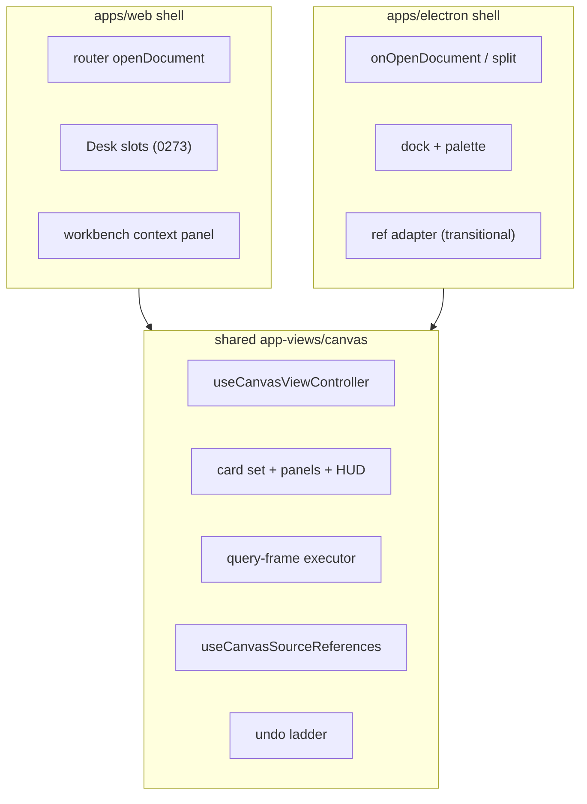

# CanvasView Feature-Parity Audit And Convergence Decisions

## Problem Statement

`apps/web/src/components/CanvasView.tsx` (1,843 LOC) and
`apps/electron/src/renderer/components/CanvasView.tsx` (3,195 LOC) are drifted
forks of the same view — roughly 60–70% similar, per exploration 0276
(Theme 3). Exploration 0230 Phase 5 deferred extracting a shared CanvasView
core "pending a parity audit": for every feature that exists on only one side,
someone has to decide whether it is (a) ported to the other platform,
(b) intentionally platform-specific, or (c) deprecated. Until that table
exists, any extraction PR is guessing at the target surface area.

This document **is** that audit. Both files were read in full, their unique
dependencies traced (`apps/electron/src/renderer/hooks/useCanvasSourceReferences.ts`,
`apps/electron/src/renderer/lib/canvas-shell.ts`, `apps/web/src/lib/desk.ts`,
`apps/web/src/workbench/*`), and the electron ref API's only consumer
(`apps/electron/src/renderer/App.tsx`) inspected. The decision table below is
the gate artifact for 0276 Theme 3 / 0230 Phase 5.

## Executive Summary

- **22 single-sided features were found** — 12 electron-only, 10 web-only.
  The verdicts: **13 port**, **8 intentionally platform-specific** (all of
  them shell/chrome integration, not canvas capability), **1 deprecate**
  (the imperative ref transport, replaced by the shared command registry
  after extraction — the _commands_ survive, the _transport_ does not).
- **Two premises from 0276 needed correction.** First, web's CanvasView does
  **not** gate media through `ModeratedMedia` — that component guards
  `apps/web/src/comms/MessageRow.tsx` and `DataWorkspaceView.tsx`; neither
  platform's canvas gates media today (new work item, both sides). Second,
  most electron-only selection operations (align, distribute, tidy, cluster,
  stack, lock, layer) are one-line delegations to the shared `CanvasHandle`
  engine in `@xnetjs/canvas` — the _capability_ already exists on both
  platforms; web merely exposes no UI for it. Porting is wiring, not engine
  work.
- **Two ports are sync-correctness fixes, not features.** Canvases replicate
  between platforms, and node types written by one side render degraded on
  the other: `widget` nodes (web's `DashboardRuntimeProvider` +
  `CanvasWidgetCard`) fall through to the engine default on electron, and
  media nodes lose the image preview / PDF page viewer / storage-policy badge
  that web renders. These two ports should land **before** the shared-core
  extraction, as ordinary feature PRs.
- **One live data-drift hazard**: the two sides write _different frame
  properties_ into the same synced doc — electron uses
  `createCanvasFrameVariantProperties('standard', …)` while web hand-rolls
  `{ containerRole: 'frame', memberIds: [], memberCount: 0 }`. Unify on the
  factory immediately (it is a one-line web change).
- Recommended extraction shape: a **headless controller hook plus shared card
  and panel components** in a new `app-views` area (the naming question 0276
  left open), with platform shells injecting navigation, chrome, and command
  transport. Desk (0273) stays web-only but must become a _slot_, not a
  branch, in the shared core.

## Current State In The Repository

### The two forks, structurally

| Aspect              | Web (`apps/web/src/components/CanvasView.tsx`)                                                 | Electron (`apps/electron/src/renderer/components/CanvasView.tsx`)                                                            |
| ------------------- | ---------------------------------------------------------------------------------------------- | ---------------------------------------------------------------------------------------------------------------------------- |
| Export shape        | Plain component `({ docId })`                                                                  | `forwardRef` with 30-method `CanvasViewHandle` + `onCommandStateChange`                                                      |
| Navigation          | `@tanstack/react-router` `navigate()`                                                          | `onOpenDocument` / `onOpenDatabaseSplit` callbacks into the shell                                                            |
| Command integration | `getCommandRegistry()` scope `surface:canvas` (undo/redo only)                                 | Ref methods driven by ~30 command-palette entries in `App.tsx` (lines 415–873)                                               |
| Undo                | Single scene `Y.UndoManager` (`createCanvasUndoManager`) claimed via registry + focus guard    | Four-domain ladder: scene / source-node / source-scope / source-document with boundary ordering (lines 1217–1243, 1803–1904) |
| Chrome              | Title input, `PresenceAvatars`, `ShareButton`, quick-actions toolbar, visible navigation tools | Read-only home badge, selection HUD, no nav tools (dock + palette instead)                                                   |
| Document context    | None (router resolves)                                                                         | `documents: LinkedDocumentItem[]` prop + `documentMap`, `pendingInsert` queue                                                |

### The verbatim middle (~40–50%)

These blocks are near-identical on both sides and platform-free — the
uncontested core of any extraction: selection snapshot state + single-node
resolution, `useCanvasObjectIngestion` wiring, drop/paste handlers, comment
composer (state, anchor encoding, `addCanvasComment` submit), alias editor
(state, transact write), media file input, `__xnetCanvasTestHarness`
registration, `hasNodes`/`sceneRevision` observation, loading/preparing
states, `getShapeLabel`, and the create-object dispatch. The main
diff-noise is `data-web-canvas-*` vs `data-canvas-*` test attributes and the
electron side threading `recordUndoBoundary('scene')` after each mutation.

### Behavioral drift found while diffing (bugs, not decisions)

- **Frame property divergence** — electron `createFrame` (line 2098) writes
  `createCanvasFrameVariantProperties('standard', …)`; web `handleCreateFrame`
  (line 955) writes a hand-rolled property bag. Same synced schema, two wire
  shapes.
- **Connector observation** — web observes both the objects _and_ connectors
  maps for scene revision (line 854–863) and can inspect a selected edge;
  electron observes only objects (line 1376) and ignores edges entirely.
- **Alias save semantics** — electron no-ops when the alias is unchanged and
  records an undo boundary on real writes (line 1940); web always writes.
- **Media ingestion undo** — electron records an undo boundary after
  successful file ingestion; web has no equivalent because it has no boundary
  ladder.

## Key Findings

1. The fork is **asymmetric in kind**: electron's extra ~1,350 lines are
   mostly _canvas capabilities_ (query frames, peek, references, undo
   domains); web's extra surface is mostly _workspace integration_ (Desk,
   workbench context panel, widget/dashboard runtime). Capabilities should
   converge; integrations should stay behind adapters.
2. The imperative ref API exists **only because electron's command palette
   lives outside the component**. Web already demonstrates the alternative:
   commands registered into the shared registry from inside the view. The
   extraction should register all 30 commands in the registry and let
   electron's `App.tsx` keep a thin ref adapter during transition.
3. Sync-parity is the forcing function. A canvas is one replicated document;
   every renderer branch that exists on one side only is a rendering gap the
   _user_ experiences as data loss when they switch devices.

## Feature-Parity Decision Table

Verdicts: **(a) port** to the other platform · **(b) platform-specific**
(intentional, documented why) · **(c) deprecate**.

### Electron-only features

| #   | Feature                                                                                                                                                                                         | Evidence (electron file unless noted)                                       | Verdict                                    | Rationale / destination                                                                                                                                                                                                                                     |
| --- | ----------------------------------------------------------------------------------------------------------------------------------------------------------------------------------------------- | --------------------------------------------------------------------------- | ------------------------------------------ | ----------------------------------------------------------------------------------------------------------------------------------------------------------------------------------------------------------------------------------------------------------- |
| E1  | **Query-frame execution** — saved-view lenses run on-canvas via `CanvasSavedViewQueryFrameExecutor`, refresh modes (manual/on-open/result-change), `createQueryFrameFromSavedView`, HUD Refresh | lines 295–509, 2120–2168, 3056–3064                                         | **(a) port**                               | Uses only portable pieces (`useSavedView` from `@xnetjs/react`, `socialSchemas`). Web's DataWorkspaceView already runs saved views; query-frame nodes synced from electron currently render as inert frames on web. Executor + helpers move to shared core. |
| E2  | **Pinned source-record cards** (`sourceCardRole: 'query-result' \| 'social-projection'`)                                                                                                        | lines 550–556, 768–818                                                      | **(a) port**                               | Travels with E1 — these nodes are created by query-frame flows and sync to web, where they currently render as generic link cards.                                                                                                                          |
| E3  | **Source references / "Copies" panel** — cross-canvas index of objects sharing a source node, reveal-in-canvas                                                                                  | `hooks/useCanvasSourceReferences.ts`; lines 1143–1200, 1984–2017, 2827–2896 | **(a) port**                               | Pure data-layer scan; nothing electron-specific in the hook. Move hook to shared package; panel becomes a shared component. Directly serves the "excerpt, never copy" model (0166).                                                                         |
| E4  | **Peek + inline edit surfaces** — modal peek and zoom-gated inline activation of `CanvasInlinePageSurface` / `CanvasDatabasePreviewSurface`                                                     | lines 895–937, 1273–1306, 2962–3038, 3134–3171                              | **(a) port**                               | Highest-value gap: web can only navigate away on double-click; electron edits in place. The two surface components are themselves web-tech React and belong in the shared package. Largest single port — schedule as its own phase.                         |
| E5  | **Multi-domain undo ladder** (scene / source-node / source-scope / source-document, boundary-ordered)                                                                                           | lines 192–208, 1217–1243, 1803–1904                                         | **(a) port**                               | Strictly more correct than web's single scene manager once inline editing (E4) exists on web. Becomes the shared core's undo model; web's registry-claimed `Mod-Z` (web lines 568–632) remains the web _binding_, dispatching into the ladder (see W8).     |
| E6  | **Selection HUD operations** — lock, align, distribute, tidy, cluster, stack, connect, layer shift, wrap-in-frame                                                                               | lines 2423–2681; all delegate to `CanvasHandle`                             | **(a) port**                               | Engine methods already exist on both platforms via `@xnetjs/canvas`. Web exposes none of them. Cheap wiring; the HUD itself becomes a shared component.                                                                                                     |
| E7  | **Planning templates** (`createPlanningTemplate`)                                                                                                                                               | lines 2188–2199                                                             | **(a) port**                               | One-line `CanvasHandle` delegation; expose as a web command/quick action.                                                                                                                                                                                   |
| E8  | **Shortcut help overlay**                                                                                                                                                                       | lines 2901–2960                                                             | **(a) port**                               | Static shared UI; keep per-platform key labels data-driven.                                                                                                                                                                                                 |
| E9  | **Static page preview card** — preview lines, Peek/Open card buttons, low-zoom mode                                                                                                             | lines 621–729                                                               | **(a) port**                               | Richer than web's generic document card; merges into the shared card set with W3.                                                                                                                                                                           |
| E10 | **Imperative `CanvasViewHandle` + `CanvasViewCommandState`**                                                                                                                                    | lines 210–265, 2288–2380; consumer `App.tsx:415–873`                        | **(c) deprecate transport, keep commands** | The 30 commands survive as shared command-registry registrations (web's existing pattern). Electron keeps a thin ref adapter only until its palette reads the registry. Do not port the ref API to web.                                                     |
| E11 | **Shell document context** — `documents`, `pendingInsert` queue, `onPendingInsertConsumed`                                                                                                      | lines 136–150, 983, 1442–1455                                               | **(b) platform-specific**                  | Electron's shell owns a linked-document list and insert requests; web resolves titles/types from the store via the router. In the shared core this becomes an optional `DocumentResolver` adapter, not a required prop.                                     |
| E12 | **Database split-open** (`openSelection('split')`, Alt+Enter)                                                                                                                                   | lines 1668–1680, 2503–2519                                                  | **(b) platform-specific**                  | Depends on electron's split-pane shell. Web's workbench has no equivalent pane today. Keep behind the navigation adapter; revisit if the web workbench grows splits.                                                                                        |

### Web-only features

| #   | Feature                                                                                                                                                                        | Evidence (web file unless noted)                                  | Verdict                                        | Rationale / destination                                                                                                                                                                                                                                                                                                                                                  |
| --- | ------------------------------------------------------------------------------------------------------------------------------------------------------------------------------ | ----------------------------------------------------------------- | ---------------------------------------------- | ------------------------------------------------------------------------------------------------------------------------------------------------------------------------------------------------------------------------------------------------------------------------------------------------------------------------------------------------------------------------ |
| W1  | **Desk integration** — deterministic Desk id, pin-queue drain, bounded viewport (`infinite: false`), starter chips, `DeskListProjection` (compact), `DeskRadialMenu` (flagged) | lines 68, 538–539, 659–676, 1311–1313, 1714–1763, 1776–1779, 1839 | **(b) platform-specific**                      | The Desk is the web quiet-shell experiment (0273), tied to web identity + workbench. Electron remains the power shell. **Constraint on extraction:** the shared core must expose these as slots/config (config override, empty-state slot, ingestion queue, overlay slot) — Desk composes on top, never branches inside the core. Revisit if 0273 graduates to electron. |
| W2  | **Widget cards** — `node.type === 'widget'` rendered via `DashboardRuntimeProvider` + `CanvasWidgetCard`, LOD-suspended queries                                                | lines 33, 72, 1817–1831                                           | **(a) port**                                   | **Sync-parity fix.** `@xnetjs/dashboard` is platform-neutral; widget nodes synced from web currently fall through to the engine default on electron. Port before extraction.                                                                                                                                                                                             |
| W3  | **Rich media card + PDF page viewer** — blob-URL image preview, object-fit, storage-policy badge, file size, PDF thumbnails + page selection (`CanvasPdfPageViewer`)           | lines 137–291, 293–451                                            | **(a) port**                                   | **Sync-parity fix.** Electron renders media as a generic text card (its `renderNodeCard` media branch, electron lines 847–892). All dependencies (`@xnetjs/canvas` PDF viewer, `useBlobService`) exist on electron. Port before extraction; becomes the shared media card.                                                                                               |
| W4  | **Context-panel selection inspector** (node + edge properties, comment count) via `useContextPanel`                                                                            | lines 775–845                                                     | **(b) platform-specific surface, shared data** | The workbench context panel is web chrome. Extract the _inspector model_ (resolved selection, source id, comment count, edge relationship) into the controller hook; web renders it in the context panel, electron in its HUD/panels.                                                                                                                                    |
| W5  | **Header: title editing, `PresenceAvatars`, `ShareButton`**                                                                                                                    | lines 1445–1481                                                   | **split**                                      | Title editing + presence avatars: **(a) port** — electron shows a read-only badge and drops `presence` from `useNode` despite having awareness wired; collaboration parity matters on desktop. Header layout itself and `ShareButton`: **(b)** — share flows are a separately-tracked divergent pair (0276 lists the `ShareButton` pair at ~20% similarity).             |
| W6  | **Frame present + JSON export** (`fitToRect` presentation, `createCanvasFrameExportDocument` download)                                                                         | lines 192–213, 1193–1227, 1545–1566                               | **(a) port**                                   | Pure engine + browser-API code; electron gains Present/Export on its frame selection HUD.                                                                                                                                                                                                                                                                                |
| W7  | **Quick-actions toolbar + visible navigation tools**                                                                                                                           | lines 1323–1428, 1780–1783                                        | **(b) platform-specific**                      | Deliberate chrome divergence: web is toolbar-first, electron is dock/palette-first (quiet shell). Both invoke the same shared commands after extraction.                                                                                                                                                                                                                 |
| W8  | **Registry-scoped canvas undo binding** (`surface:canvas` scope, focus guard, `Mod-Z`/`Mod-Y`)                                                                                 | lines 568–632                                                     | **(a) unify with E5**                          | Keep the registry claim as the web _binding_; its handler dispatches into the shared undo ladder instead of a lone scene manager. Not a separate capability after convergence.                                                                                                                                                                                           |
| W9  | **Edge/connector selection + observation**                                                                                                                                     | lines 696–711, 854–863                                            | **(a) port**                                   | Electron neither observes the connectors map nor inspects edges. Travels with E6's shared HUD/inspector.                                                                                                                                                                                                                                                                 |
| W10 | **Router-based open-on-double-click**                                                                                                                                          | lines 1084–1105                                                   | **(b) platform-specific**                      | Same action, different transport: web navigates via router, electron via `onOpenDocument`. Becomes the `openDocument(id, type)` navigation adapter every port above depends on.                                                                                                                                                                                          |

### Cross-cutting new work surfaced by the audit

| #   | Item                                                                                                                                                                                                                                                                    | Verdict                                                                                                                                                   |
| --- | ----------------------------------------------------------------------------------------------------------------------------------------------------------------------------------------------------------------------------------------------------------------------- | --------------------------------------------------------------------------------------------------------------------------------------------------------- |
| M1  | **Canvas media moderation gap** — neither platform routes canvas media through `ModeratedMedia` (`apps/web/src/components/ModeratedMedia.tsx` guards comms + data workspace only). 0276's "web grew moderation gating" referred to `DataWorkspaceView`, not CanvasView. | Add moderation gating to the shared media card (W3) so both platforms get it in one place. `ModeratedMedia` must move out of `apps/web` to be importable. |
| M2  | **Frame property divergence** (see drift bugs above)                                                                                                                                                                                                                    | Fix now: web adopts `createCanvasFrameVariantProperties`. One line.                                                                                       |
| M3  | **Test-attribute unification** (`data-web-canvas-*` vs `data-canvas-*`)                                                                                                                                                                                                 | Decide one namespace during extraction; update e2e selectors in the same PR.                                                                              |

## Options And Tradeoffs

| Option                                                                 | Shape                                                                                                                                                                                                                      | Pros                                                                                                                                     | Cons                                                                                                                                                      |
| ---------------------------------------------------------------------- | -------------------------------------------------------------------------------------------------------------------------------------------------------------------------------------------------------------------------- | ---------------------------------------------------------------------------------------------------------------------------------------- | --------------------------------------------------------------------------------------------------------------------------------------------------------- |
| A. **Headless controller + shared cards/panels** (recommended)         | `useCanvasViewController` hook (selection resolution, alias/comment, ingestion, undo ladder, query frames, references) + shared card components + shared panels; platform shells own chrome, navigation, command transport | Matches the house style (0276 cites `useQuery.ts` layering as the model); Desk/workbench stay composable; each piece lands as a small PR | More PRs; two shells persist (thin, but real)                                                                                                             |
| B. One shared `<CanvasView>` component with a `platform` config object | Single component, adapters for nav/chrome                                                                                                                                                                                  | Single file, maximal dedup                                                                                                               | The Desk, workbench panel, and electron shell props force a config object that recreates today's fork as prop-branches; violates the 0273 slot constraint |
| C. Keep forks, share only leaf cards                                   | Extract cards (W2/W3/E9) and stop                                                                                                                                                                                          | Cheapest; fixes sync parity                                                                                                              | Leaves the ~800-line verbatim middle duplicated; PageView's "0 shared commits" failure mode continues                                                     |
| D. Freeze web, rebase it on electron's fork                            | Port web deltas into electron's file, alias it                                                                                                                                                                             | One code path quickly                                                                                                                    | Electron's file is the _worse_ starting point (3,195 LOC, ref API to deprecate); history warns against big-bang rewrites (CanvasV2→V3 corpse, 0230)       |

## Recommendation

Adopt **Option A**, sequenced so every step is independently shippable and
the sync-parity fixes don't wait on the refactor:

```mermaid
flowchart LR
    subgraph P0["Phase 0 — parity bug fixes (no refactor)"]
        M2fix["M2 frame factory on web"]
        W2p["W2 widget cards → electron"]
        W3p["W3 media/PDF card → electron (+M1 moderation)"]
    end
    subgraph P1["Phase 1 — shared package"]
        CARDS["cards: media, page-preview, pinned-record, widget"]
        CTRL["useCanvasViewController<br/>selection + alias + comment + ingestion"]
    end
    subgraph P2["Phase 2 — capabilities"]
        QF["E1/E2 query frames → web"]
        REF["E3 references → web"]
        UNDO["E5/W8 unified undo ladder"]
        HUD["E6/E7/E8/W6/W9 shared HUD + commands"]
    end
    subgraph P3["Phase 3 — surfaces + transport"]
        PEEK["E4 peek/inline surfaces → web"]
        CMD["E10 registry commands; electron ref adapter retired"]
    end
    P0 --> P1 --> P2 --> P3
    DESK["W1 Desk stays web-only,<br/>composes via slots"] -.constrains.-> P1
```

Where the shared code lives: per 0276's open naming question, create an
**`app-views` area** (either `packages/views/src/app/canvas/` or a new
`packages/app-views`) rather than growing `packages/react` — settle in the
Phase 1 PR, consistent with whatever the PageView comment-subsystem
extraction (0276 Theme 3, first checklist item) chooses.

## Risks And Open Questions

- **The peek surfaces (E4) are the big unknown.** `CanvasInlinePageSurface`
  and `CanvasDatabasePreviewSurface` were not audited line-by-line here; they
  may have their own electron-shell tendrils (they accept plain callbacks, so
  likely portable, but size the Phase 3 work after reading them).
- **Web workbench vs peek modal.** Web may prefer opening a peek into the
  workbench's panel system rather than electron's centered modal — a product
  call to make at Phase 3, but the controller state (`peekState`) is
  identical either way.
- **Undo unification changes web behavior.** Today web's `Mod-Z` inside a
  focused canvas only ever undoes scene changes; after E5 it may undo an
  inline-edited source document. That is the _intended_ semantic, but it is a
  behavior change — release-note it.
- **Query frames assume the social schema registry** (`socialSchemas` cast to
  `SavedViewSchemaRegistry`, electron line 157). The shared executor should
  take the registry as a parameter so web can pass its own superset (e.g.
  `DASHBOARD_SCHEMA_REGISTRY` alignment).
- **Desk slot design is load-bearing.** If the shared core grows a single
  `isDesk` branch, the extraction has failed the 0273 constraint; the slots
  (config override, empty-state, overlay, pin-ingestion) must be genuinely
  generic.
- **This doc's line numbers rot.** They reference the files as of this audit
  (branch `claude/focused-nash-fdf617`, July 2026); the verdicts, not the
  line numbers, are the durable artifact.

## Implementation Checklist

Phase 0 — parity fixes (ordinary feature PRs, before any refactor)

- [x] M2: web `handleCreateFrame` adopts `createCanvasFrameVariantProperties('standard', …)`.
- [ ] W2: electron renders `widget` nodes via `DashboardRuntimeProvider` + `CanvasWidgetCard` (LOD suspension included); electron needs its dashboard schema registry equivalent.
- [ ] W3 + M1: extract web's `CanvasMediaCard` + PDF helpers into the shared package, add `ModeratedMedia` gating, consume from both apps.
- [ ] W9: electron observes the connectors map and gains edge selection state.

Phase 1 — shared package skeleton

- [ ] Settle the `app-views` location (align with the PageView comment-subsystem extraction from 0276).
- [ ] Extract the card set (media, page static preview E9, pinned record E2, widget) and shared panels (alias, comment, shortcut help E8).
- [ ] Extract `useCanvasViewController`: selection snapshot + resolution, alias/comment state and handlers, ingestion wiring, test-harness registration, `hasNodes`/`sceneRevision`.
- [ ] M3: unify `data-canvas-*` test attributes; update web + electron e2e selectors.

Phase 2 — capability convergence

- [ ] E1/E2: move query-frame executor + helpers into shared core (registry as parameter); web exposes create-from-saved-view + Refresh.
- [ ] E3: move `useCanvasSourceReferences` to the shared package; "Copies" panel on web.
- [ ] E5/W8: unified undo ladder in core; web `surface:canvas` registry binding dispatches into it (release-note the behavior change).
- [ ] E6/E7/W6: shared selection HUD (lock/align/distribute/tidy/cluster/stack/connect/layers/wrap + present/export frame + planning templates) rendered on both platforms.
- [ ] W5: electron header gains title editing + `PresenceAvatars` (pass `update`/`presence` from `useNode`).

Phase 3 — surfaces and command transport

- [ ] E4: audit + move `CanvasInlinePageSurface` / `CanvasDatabasePreviewSurface`; web gains peek (modal or workbench-panel — product call) and zoom-gated inline editing.
- [ ] E10: register all canvas commands in the shared command registry from the core; electron palette reads the registry; delete `CanvasViewHandle` and `onCommandStateChange`.
- [ ] W1: verify Desk integrates purely through slots (config override, empty-state, overlay, pin queue) — no `isDesk` branch inside shared core.
- [ ] Add the 0276 drift tripwire for this pair until both files are thin shells.

## Validation Checklist

- [ ] A canvas created on web with widget + media + PDF nodes renders identically (cards, previews, badges) when opened on electron, and vice versa for query-frame + pinned-record nodes — the sync-parity round-trip test.
- [ ] Frame nodes created on both platforms carry identical property shapes (golden-vector style assertion on the synced doc).
- [ ] Web: create page inline via peek, then `Mod-Z` — undoes the page edit, not the scene move (undo-ladder semantics).
- [ ] Electron command palette continues to pass its existing e2e flows after the registry migration, with `CanvasViewHandle` deleted.
- [ ] Desk e2e suite (0273) green with the shared core — proving the slot design.
- [ ] Line counts: both `CanvasView.tsx` files reduced to shell-glue (< ~400 LOC each); the shared package owns the rest.
- [ ] `git log` on the pair stops showing one-sided fixes (the PageView "0 shared commits" alarm from 0276 does not recur here).

## References

- `docs/explorations/0276_[_]_WELL_TRAVELED_CODE_PATHS_CHURN_WEIGHTED_REFACTOR_MAP.md` — Theme 3, similarity table, drift tripwire (on branch `claude/0276-well-traveled-code-paths-churn-weighted-refactor`).
- Exploration 0230 Phase 5 — original "defer pending parity audit" decision.
- Exploration 0273 — Desk / quiet-surface shell (the W1 constraint).
- Exploration 0166 — excerpt-never-copy model behind source references (E3).
- `apps/web/src/components/CanvasView.tsx`, `apps/electron/src/renderer/components/CanvasView.tsx` — the audited pair.
- `apps/electron/src/renderer/App.tsx:415–873` — the 30 palette commands driving the ref API (E10).
- `apps/electron/src/renderer/hooks/useCanvasSourceReferences.ts`, `apps/electron/src/renderer/lib/canvas-shell.ts` — electron-side dependencies to relocate.
- `apps/web/src/components/ModeratedMedia.tsx` — moderation component to relocate for M1.
