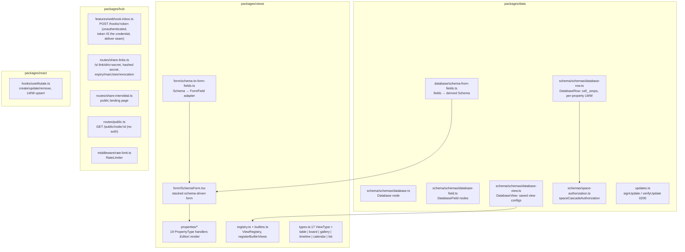
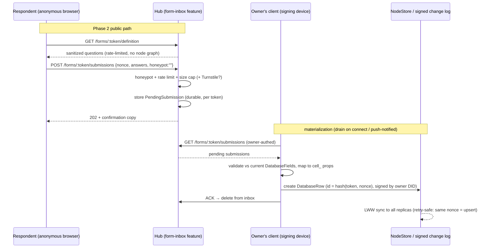
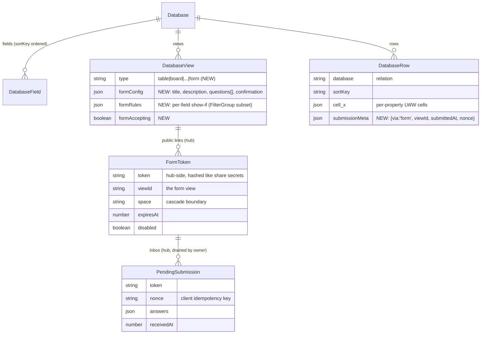
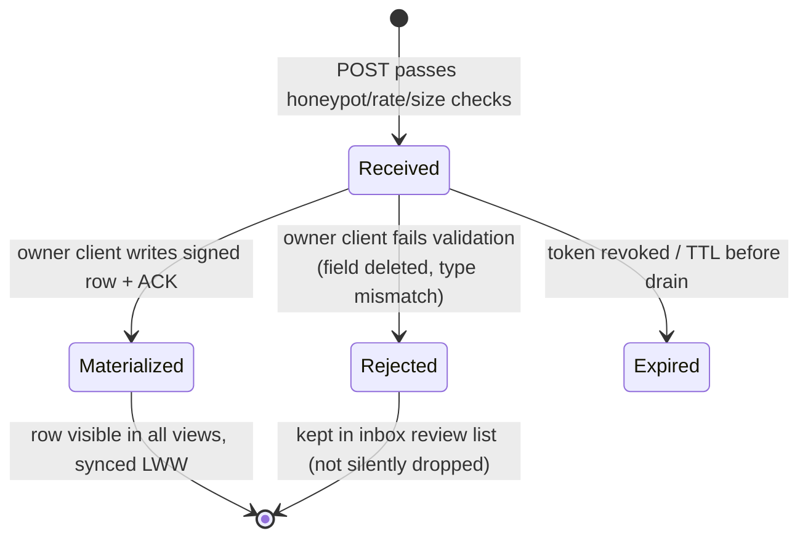

# Notion-Style Forms: A Form View Over Databases With Public, Anonymous Submission

## Problem Statement

Notion shipped Forms (2024) as a **view of a database**: you add a "Form"
view next to Table/Board/Calendar, arrange the database properties as
questions, share a public link, and every response lands as a new row.
Tally, Typeform, Airtable Forms, and Fillout show the same table-stakes
expectations: field types mapped to columns, required/optional toggles,
per-field conditional visibility, a public URL that needs no account, and
basic anti-spam.

xNet already has the Airtable-like **Database** content type
(`Database` + `DatabaseField` + `DatabaseRow` + `DatabaseView` nodes,
rendered by `apps/web/src/components/DatabaseView.tsx` over
`packages/views/src/grid/`), a schema-driven form renderer
(`packages/views/src/form/SchemaForm.tsx`), and share-link infrastructure
(`packages/hub/src/routes/share-links.ts`). What it does not have is:

1. A **form view type** — a way to present a database as a fill-in form
   inside the workspace.
2. A **form builder** — question ordering, labels/descriptions, required
   overrides, conditional visibility, confirmation copy.
3. **Public, anonymous submission** — the genuinely hard part in a
   local-first system where every change-log entry is signed by a DID
   (portable protocol, exploration 0200) and the hub deliberately does
   **not** perform server-authoritative node writes (the 0213 webhook
   features are mounted "without an apply callback … actions are reported
   but not yet materialized", `packages/hub/src/server.ts:484-489`).

This exploration asks: **how do we add Notion-grade forms without breaking
the signed-change-log invariant, and how much of the machinery already
exists?**

## Executive Summary

- **~70% of the in-workspace feature is assembly, not construction.**
  `SchemaForm` + `schemaToFormFields` (`packages/views/src/form/`) already
  render a stacked, grouped, validated form for any schema, with editors for
  all 19 property types via the property-handler registry. The Database
  content type already derives a `Schema` from its `DatabaseField` nodes
  (`packages/data/src/database/schema-from-fields.ts`), so a form view is
  "SchemaForm over the database's derived schema + a create-row submit".
- **Model forms exactly as Notion does: a new `'form'` view type on
  `DatabaseView`**, not a new content type. `DatabaseViewSchema`
  (`packages/data/src/schema/schemas/database-view.ts`) is the natural home
  for form config (question order/labels, required overrides, show-if
  rules, confirmation copy) — it inherits view-tab UX, per-view LWW config,
  and Space-cascade authorization for free.
- **The public-submission trust model is the real decision.** Three
  options: (A) hub stores raw submissions in a durable inbox and the **form
  owner's client materializes them as signed rows** when online; (B) the hub
  gets a service DID and writes rows server-side; (C) the public page mints
  an ephemeral guest DID and signs its own submission. **Recommend (A)**:
  it reuses the exact seam the webhook inbox already defines
  (`packages/hub/src/features/webhook-inbox.ts` — unauthenticated
  `POST /hooks/:token` where the token is the credential, with an injected
  `deliver` sink), keeps "only user devices sign changes" intact, and
  degrades gracefully (submissions queue while the owner is offline).
- **Public rendering:** a public app route (`/form/:token`) that fetches a
  sanitized form definition from a new unauthenticated hub endpoint and
  POSTs the response — the same split the share interstitial
  (`packages/hub/src/routes/share-interstitial.ts`) and public node reads
  (`packages/hub/src/routes/public.ts`) already use.
- **Build in-house; adopt nothing.** External research (below) says the
  open-source form platforms are AGPL-3.0 (HeyForm, Formbricks, OpnForm —
  license-contagious for an MIT monorepo) and the MIT libraries
  (TanStack Form, JSON Forms, RJSF) solve form _state_, which
  `SchemaForm` + property handlers already solve better for our schema
  system. Anti-spam is honeypot + hub rate limiting
  (`packages/hub/src/middleware/rate-limit.ts`) + optional Cloudflare
  Turnstile behind an env flag.
- **Phasing:** (1) in-workspace form view + builder — zero new trust
  decisions; (2) public link + hub submission inbox + owner-client
  materialization; (3) polish (conditional logic, prefill, notifications
  via the comms/status surfaces).

## Current State In The Repository

### What already exists



- **`SchemaForm`** (`packages/views/src/form/SchemaForm.tsx`) takes
  `{ schema, value, onChange, options?, readOnly?, onCreateOption?,
onUploadFile?, onResolveFileUrl? }` and renders grouped, ordered fields
  through `getPropertyHandler(field.type)`. `SchemaToFormOptions`
  (`packages/views/src/form/schema-to-form-fields.ts`) already supports
  `hidden`, `order`, `groups`, `highlights` — most of a form builder's
  output format.
- **Database content type**: rows are first-class nodes with `cell_`-prefixed
  dynamic properties and per-property LWW merge
  (`packages/data/src/schema/schemas/database-row.ts`), fields are
  `DatabaseField` nodes (`packages/data/src/database/field-types.ts`), and
  `createNodeDatabaseSchemaResolver`
  (`packages/data/src/database/schema-from-fields.ts:86`) derives a `Schema`
  from the fields — the bridge that lets `SchemaForm` render a database as
  a form with zero new field-rendering code.
- **`DatabaseView`** (`packages/data/src/schema/schemas/database-view.ts`)
  stores saved view configs as nodes: a `type` select
  (`table|board|list|gallery|calendar|timeline`), whole-tree-LWW `filters`,
  `sorts`, per-view `fieldOrder`/`hiddenFields`, and a fractional `sortKey`
  for tab order. The parallel client-side union is
  `ViewType`/`ViewConfig` (`packages/views/src/types.ts:17,78`), with
  registration through `ViewRegistry`
  (`packages/views/src/registry.ts`) and `registerBuiltinViews()`
  (`packages/views/src/builtins.ts:257`). Plugins can contribute view types
  via `ViewContribution` (`packages/plugins/src/contributions.ts:35`).
- **Webhook inbox** (`packages/hub/src/features/webhook-inbox.ts`): the
  0213 escape hatch — `POST /hooks/:token`, intentionally unauthenticated
  (high-entropy revocable token as credential), `resolveToken` → routing
  context (`{ space, schema?, label? }`) and a `deliver` seam the app wires.
  Crucially, the hub today **reports actions but does not materialize
  nodes** (`packages/hub/src/server.ts:484-489`) — server-authoritative
  writes are deliberately deferred.
- **Share links** (`packages/hub/src/routes/share-links.ts`): `linkId` +
  fragment secret (never hits server logs), SHA-256 hash stored with
  timing-safe compare, `expiresAt`/`maxUses`/`disabled`, idempotent grant
  claims, per-DID+IP rate limiting. `docType` currently covers
  `page|database|canvas|dashboard|view|space`.
- **Write path**: `useMutate().create(schema, data, id?)`
  (`packages/react/src/hooks/useMutate.ts`); deterministic-ID idempotency
  precedent in the devtools seed (`packages/devtools/src/seed/seed-ids.ts`)
  — re-running with the same ID is an LWW upsert, not a duplicate.
- **Authorization**: `DatabaseRow` inherits from its Space via
  `spaceCascadeAuthorization('database')`
  (`packages/data/src/schema/schemas/database-row.ts:53`); evaluator and
  role builders in `packages/data/src/auth/` (explorations 0181/0192).

### What does not exist

- No form builder, no survey/poll/intake code anywhere in the repo.
- No `'form'` view type in either the `DatabaseView` schema select or the
  `ViewType` union.
- No unauthenticated **write** endpoint that becomes workspace data (the
  webhook inbox defines the seam but nothing materializes deliveries).
- No respondent-facing public page for structured input.

## External Research

### Notion Forms (launched 2024; conditional logic March 2025)

- A form is a **view of a database**; each question maps to a property.
  Responses **create new pages/rows only — they cannot update existing
  rows** (Airtable Forms and Fillout can; a noted Notion weakness).
- Public sharing = "anyone with the link", automatically anonymous;
  workspace-only forms can capture identity via _Created by_.
- Conditional logic ("ask follow-up questions based on earlier answers") is
  gated to Business/Enterprise plans; single-page only; no default values,
  hidden fields, or URL prefill as of early 2025.
- Confirmation title/body and submit-button text are customizable.

### Competitive table stakes (Tally, Typeform, Google/Airtable Forms, Fillout)

| Capability                          | Consensus                                                 |
| ----------------------------------- | --------------------------------------------------------- |
| Field types mapped to columns       | Table stakes everywhere                                   |
| Required/optional per question      | Table stakes                                              |
| Conditional visibility              | Table stakes (Tally has it free)                          |
| Public anonymous link               | Table stakes                                              |
| Multi-page / branching graphs       | Differentiator (Typeform, Fillout)                        |
| Update-existing-row submissions     | Rare (Airtable, Fillout) — explicitly out of scope for v1 |
| Payments, e-signature, calculations | Delight tier, not v1                                      |

### Libraries and licensing

- Self-hostable form platforms — **HeyForm, Formbricks, OpnForm — are all
  AGPL-3.0**: viral, unusable inside this MIT-licensed monorepo.
- MIT-friendly libraries (TanStack Form, react-hook-form + Zod, JSON Forms;
  RJSF is Apache-2.0; SurveyJS core is MIT but its Creator is commercial)
  solve _form state and JSON-Schema rendering_ — a problem
  `SchemaForm` + the property-handler registry already solve natively
  against xNet's own schema system. Adopting one would add a second schema
  dialect for no capability gain. **Build in-house.**
- The JSON Schema + UI Schema _pattern_ (validation concerns vs
  presentation concerns) is worth keeping: xNet's analogue is
  "derived database schema" (validation) vs "form config on the
  DatabaseView node" (presentation) — same separation, already idiomatic.

### Conditional logic models

Two paradigms in the wild: **per-field show-if rules** (Tally, JSON Forms —
simple, composable, fine under ~15 questions) vs **branch graphs**
(Typeform, Google Forms sections — visual flow, multi-page, more UI
scaffolding). Notion itself ships the simple kind. Recommend per-field
show-if for v1; the config format below leaves room for pages/branches
later.

### Anti-spam for public forms (layered, 2026 standard practice)

1. **Honeypot field** — invisible input; reject silently if filled
   (catches ~50-70% of dumb bots, zero UX cost).
2. **Rate limiting** — per-IP/per-token caps at the endpoint (the hub's
   `RateLimiter` middleware already exists; share-link claims already do
   10/min).
3. **Cloudflare Turnstile** — free, invisible-by-default, no Google
   tracking; standard managed-challenge tier costs nothing. Optional,
   env-gated (`XNET_TURNSTILE_SECRET`), consistent with how webhook
   features 503 until their secret is configured.

### Local-first prior art

There is **no published standard** for anonymous submissions into a
signed/CRDT replicated log — the literature covers authenticated
collaborators. The patterns that do appear (quarantine table + later
promotion; server-side validation before merge) map directly onto
Option A below: the hub inbox is the quarantine; the owner's signing client
is the promotion step. xNet gets to set the precedent here.

## Key Findings

1. **The Notion model is also the cheapest model for xNet.** Making
   `'form'` a `DatabaseView` type reuses view tabs, per-view config
   persistence (whole-property LWW on the view node), Space-cascade authz,
   and the derived-schema bridge. A standalone "Form" content type would
   duplicate all of that and still need a database to write rows into.
2. **The signed-change-log invariant forces the interesting decision.**
   Anonymous respondents have no DID and no local replica. Someone must
   turn an HTTP POST into a signed `DatabaseRow` change. The repo has
   already twice deferred giving the hub write authority (GitHub webhook,
   0213 integrations) — forms should not casually reverse that; the
   owner-client materialization pattern keeps the invariant and matches
   how webhook deliveries were always intended to land.
3. **Idempotency is free if we want it.** A client-generated submission
   nonce hashed into a deterministic row ID (seed-ids precedent) makes
   double-POSTs and retries an LWW upsert instead of a duplicate row.
4. **The public page must not leak the workspace.** The respondent needs
   exactly: form title/description, ordered questions (labels, types,
   select options, required flags, show-if rules), and branding — never
   the node graph, other rows, or member identities. That means a
   dedicated sanitized `GET` endpoint, not `GET /public/node/:id`.
5. **Field-type coverage needs a public-safe subset.** `person`,
   `relation`, `rollup`, `formula`, `file`, and auto fields
   (`created`/`updatedBy`) either leak workspace data, require identity,
   or are computed — the builder must exclude or degrade them (Notion
   restricts relation/people questions to workspace-shared forms for the
   same reason). `text`, `number`, `select`, `multiSelect`, `date`,
   `checkbox`, `url`, `email`, `phone` are the safe v1 set.

## Options And Tradeoffs

### Decision 1 — Where does the form definition live?

| Option                                     | Description                                                                                                | Pros                                                                                                       | Cons                                                                                                                                                 |
| ------------------------------------------ | ---------------------------------------------------------------------------------------------------------- | ---------------------------------------------------------------------------------------------------------- | ---------------------------------------------------------------------------------------------------------------------------------------------------- |
| **A. New `'form'` `DatabaseView` type** ✅ | Add `form` to the view-type select + `ViewType` union; form config as new json properties on the view node | Notion parity; view tabs/rename/reorder free; LWW config persistence free; Space authz free; smallest diff | Form config rides a schema shared with grid views (a few nullable json props)                                                                        |
| B. Standalone `Form` content type          | New `FormSchema` node relating to a Database                                                               | Clean separation; forms could later target arbitrary schemas                                               | Duplicates view UX (listing, opening, tabs); new sidebar surface; more schema/authz/seed work; diverges from the mental model users have from Notion |
| C. Plugin-contributed view                 | Ship as a `ViewContribution` from `packages/plugins`                                                       | Dogfoods the plugin fabric                                                                                 | First-party table-stakes feature behind plugin indirection; public submission still needs core+hub work a plugin can't do                            |

**Choose A.** Revisit B only if forms ever need to exist without a backing
database (e.g. "contact form → chat message"), which is out of scope.

### Decision 2 — Who signs anonymous submissions? (the load-bearing choice)

| Option                                             | Mechanism                                                                                                                                                                                                                                            | Pros                                                                                                                                                                                                                                             | Cons                                                                                                                                                                                                                                                           |
| -------------------------------------------------- | ---------------------------------------------------------------------------------------------------------------------------------------------------------------------------------------------------------------------------------------------------- | ------------------------------------------------------------------------------------------------------------------------------------------------------------------------------------------------------------------------------------------------ | -------------------------------------------------------------------------------------------------------------------------------------------------------------------------------------------------------------------------------------------------------------- |
| **A. Hub inbox + owner-client materialization** ✅ | Hub stores raw submissions durably (per-form token table, like `ShareLinkRecord`); the form owner's online client drains the inbox, validates, and writes signed `DatabaseRow` nodes under the owner's DID with `cell_` values + submission metadata | Preserves "only user devices sign" (0200); reuses the exact `webhook-inbox` seam; hub stays content-dumb about the change log; spam never enters the replicated log unvetted; works with E2E-encrypted spaces (hub can't write into them anyway) | Rows appear only when an owner device is online (mitigate: hub lists pending count; any workspace member's client with write access can drain); inbox is plaintext on the hub until drained (same as webhook deliveries)                                       |
| B. Hub service DID (server-authoritative writes)   | Hub holds a keypair, signs rows itself                                                                                                                                                                                                               | Instant materialization; enables future server automations                                                                                                                                                                                       | Reverses a twice-made deliberate deferral; hub key becomes a workspace-write credential (big blast radius); breaks for E2E-encrypted spaces; authz model needs a "hub actor" concept                                                                           |
| C. Ephemeral guest DID in the respondent's browser | Public page mints a throwaway keypair, signs, syncs one change                                                                                                                                                                                       | Purest protocol story; no hub trust growth                                                                                                                                                                                                       | Ships the whole data/sync stack to an anonymous page (weight, attack surface); authorization must accept unknown DIDs writing rows (spam lands _in the log_, which is append-only and replicated — the worst place for spam); revocation/cleanup story is ugly |

**Choose A.** It is the same state machine as Notion's own architecture
(server receives, workspace materializes) translated to local-first
custody. Option B remains a compatible future upgrade — the inbox format
doesn't change, only who drains it.

### Decision 3 — How is the public form rendered?

| Option                                                                                                               | Pros                                                                                                                                   | Cons                                                                                                                        |
| -------------------------------------------------------------------------------------------------------------------- | -------------------------------------------------------------------------------------------------------------------------------------- | --------------------------------------------------------------------------------------------------------------------------- |
| **App public route `/form/:token`** ✅ (SPA route, no session required) fetching `GET <hub>/forms/:token/definition` | Reuses `SchemaForm` + property editors + theme; one form renderer to maintain; matches how the share interstitial hands off to the app | Needs a session-less code path in the app shell (precedent: share claim flow)                                               |
| Hub-rendered static/SSR page                                                                                         | Zero app-shell work; tiny payload                                                                                                      | Second form renderer to build and keep in parity — exactly the drift class 0277 just spent a convergence effort eliminating |

### Decision 4 — Conditional logic format

Per-field show-if rules, stored declaratively (not functions — the config
is a synced node property):

```ts
interface FormFieldRule {
  /** Show this question only when the condition holds. */
  when: { fieldId: string; op: 'eq' | 'neq' | 'in' | 'notEmpty'; value?: unknown }[]
  /** 'all' (AND) | 'any' (OR) */
  match: 'all' | 'any'
}
```

This is deliberately a subset of the existing `FilterGroup` grammar used by
`DatabaseView.filters` — same operators, same evaluation code path
(`packages/data/src/database/filter-engine.ts` can evaluate it against the
in-progress response object). Branch graphs / multi-page deferred.

## Recommendation

Implement in three phases, each independently shippable:

**Phase 1 — In-workspace form view (no new trust surface).**
Add `'form'` to `ViewType` and the `DatabaseViewSchema` type select; add
nullable form-config properties to the view schema; register a `FormView`
in `packages/views/src/form-view/` (builder = edit mode, preview = fill
mode) that renders `SchemaForm` over the database's derived schema and
submits via `useMutate().create(DatabaseRowSchema, …)` with `cell_`
properties. Workspace members can already use this for internal intake.

**Phase 2 — Public link + submission inbox.**
New hub feature `packages/hub/src/features/form-inbox.ts` modeled on
`webhook-inbox.ts`: mint/revoke high-entropy form tokens (owner-authed),
`GET /forms/:token/definition` (sanitized, unauthenticated, rate-limited),
`POST /forms/:token/submissions` (honeypot + rate limit + size caps +
optional Turnstile), durable pending-submission storage. App side: public
`/form/:token` route rendering the same `FormView` fill mode; a
`FormSubmissionAgent` in the owner's client that lists pending
submissions, validates against current fields, writes signed rows
(deterministic ID from submission nonce), and acks/deletes from the inbox.

**Phase 3 — Polish.**
Per-field show-if rules (Decision 4), confirmation-page customization,
"accepting responses" toggle + expiry (reuse share-link semantics),
pending-submission badge in the comms/status surface, CSV export already
free via existing database export, and seed coverage (Tier-1 seeder giving
the demo workspace a form view + a few submissions).

### Architecture (target state)



### Data model



### Submission lifecycle



## Example Code

New `DatabaseViewSchema` properties (additive → minor bump on the fixed
core):

```ts
// packages/data/src/schema/schemas/database-view.ts (additions)
/** Form view (0278): question config, keyed by fieldId. Whole-object LWW. */
formConfig: json<FormViewConfig>({}),
/** Form view: per-field show-if rules (FilterGroup-subset grammar). */
formRules: json<Record<string, FormFieldRule>>({}),
/** Form view: accepting responses toggle. */
formAccepting: checkbox({ default: true })

// packages/data/src/database/form-types.ts (new)
export interface FormViewConfig {
  title?: string            // defaults to database name
  description?: string
  questions: FormQuestion[] // ordered; omitted fields are not asked
  confirmation?: { title?: string; body?: string }
  submitLabel?: string
}
export interface FormQuestion {
  fieldId: string
  label?: string            // overrides field name
  description?: string
  required?: boolean        // overrides/ANDs with field required
}
```

View registration (Phase 1):

```ts
// packages/views/src/form-view/index.ts (new sub-barrel, per 0276 policy)
viewRegistry.register({
  type: 'form',
  name: 'Form',
  icon: 'clipboard-list',
  component: FormView, // builder + fill modes
  supportedSchemas: '*',
  platforms: ['web', 'electron'],
  description: 'Collect responses as new rows'
})
```

Owner-side materialization core (Phase 2):

```ts
// deterministic id: retry/double-drain safe (LWW upsert, seed-ids precedent)
const rowId = submissionRowId(form.token, submission.nonce)
await mutate.create(
  DatabaseRowSchema,
  {
    database: databaseId,
    sortKey: appendSortKey(lastRow?.sortKey),
    ...toCellProperties(validated.answers), // cell_<fieldId> props
    submissionMeta: {
      via: 'form',
      viewId: form.viewId,
      submittedAt: submission.receivedAt,
      nonce: submission.nonce
    }
  },
  rowId
)
await hub.ackFormSubmission(form.token, submission.nonce)
```

Hub endpoint sketch (Phase 2, mirrors `webhook-inbox.ts` shape):

```ts
// packages/hub/src/features/form-inbox.ts (new)
app.post('/forms/:token/submissions', rateLimit(20, 60_000), async (c) => {
  const route = await resolveFormToken(c.req.param('token'))
  if (!route || route.disabled) return c.notFound() // token is the credential
  const body = await readCapped(c, MAX_SUBMISSION_BYTES)
  if (body.website) return c.json({ ok: true }) // honeypot: lie politely
  if (!route.accepting) return c.json({ ok: false, reason: 'closed' }, 403)
  await storePending(route, body) // durable inbox
  return c.json({ ok: true, confirmation: route.confirmation }, 202)
})
```

## Risks And Open Questions

- **Drain latency.** Rows appear only when a writable client is online.
  Acceptable for v1 (the hub shows a pending count; respondents get their
  202 confirmation immediately), and any member with database write access
  can drain, not just the creator. If it bites, Option B (hub service DID)
  is a drop-in upgrade behind the same inbox format — but it should be its
  own exploration (it intersects 0270 capability work and E2E spaces).
- **Inbox privacy.** Pending submissions sit plaintext on the hub until
  drained — same exposure class as webhook deliveries and share
  interstitial metadata. Document it; for E2E-encrypted spaces consider
  encrypting pending payloads to the space key set
  (`computeRecipients()` precedent) in a follow-up.
- **Field drift between submit and drain.** A field deleted/retyped after
  a respondent submits → validation at drain time routes to the Rejected
  review list rather than silently dropping (state diagram above). Needs
  UX for "3 submissions couldn't be applied".
- **Select-option writes.** Should a public submission be able to create a
  new select option (`onCreateOption`)? No for v1 — public forms restrict
  to existing options; free-text belongs in a text field.
- **Wire-contract discipline.** New hub routes + any change to
  `ShareDocType` are consumer-visible: per changeset policy, bump from the
  diff (hub is periphery; `data`/`views`/`react` land in the fixed core as
  a minor).
- **Seed coverage.** New schema _properties_ don't trip
  `seed-coverage.test.ts`, but a Tier-1 form seeder makes the demo
  workspace demonstrate the feature (`packages/devtools/src/seed/`).
- **Turnstile dependency.** Keep it optional/env-gated so self-hosters
  aren't forced through Cloudflare; honeypot + rate limit are the
  always-on floor.

## Implementation Checklist

### Phase 1 — Form view in the workspace

- [x] Add `'form'` to `ViewType` (`packages/views/src/types.ts:17`) and to
      the `DatabaseViewSchema` `type` select options
      (`packages/data/src/schema/schemas/database-view.ts`)
- [x] Add `formConfig` / `formRules` / `formAccepting` properties to
      `DatabaseViewSchema`; new `packages/data/src/database/form-types.ts`
      with `FormViewConfig`, `FormQuestion`, `FormFieldRule`
- [x] Build `FormView` in `packages/views/src/form-view/` (new sub-barrel;
      ONE grouped re-export block from the root barrel per 0276 policy):
      fill mode = `SchemaForm` over the derived schema restricted to
      configured questions; builder mode = question list (reorder,
      include/exclude, label/description/required overrides)
- [x] Public-safe field-type gate: exclude `person`, `relation`, `rollup`,
      `formula`, `file`, auto fields from public forms (allow
      person/relation for workspace-internal forms only)
- [x] Register in `registerBuiltinViews()`
      (`packages/views/src/builtins.ts`); wire into
      `apps/web/src/components/DatabaseView.tsx` view-tab creation menu
- [x] Submit path: `useMutate().create(DatabaseRowSchema, …)` with
      `cell_` mapping + `sortKey` append + `submissionMeta`
- [x] Changesets: minor for `data`, `views`, `react` (fixed core)

### Phase 2 — Public forms

- [ ] `packages/hub/src/features/form-inbox.ts`: token mint/revoke
      (owner-authed), `GET /forms/:token/definition` (sanitized),
      `POST /forms/:token/submissions` (honeypot, `RateLimiter`, size cap,
      optional Turnstile via `XNET_TURNSTILE_SECRET`), durable pending
      store, owner-authed list/ACK endpoints
- [ ] Token storage hashed like share secrets
      (`hashShareSecret` pattern, `packages/hub/src/routes/share-links.ts`)
- [ ] Share-dialog integration: "Share form" surface on the form view mints
      a token and shows the public URL (`<app>/form/<token>`)
- [ ] App public route `/form/:token` (session-less; share-claim flow
      precedent) rendering `FormView` fill mode from the definition payload
- [ ] `FormSubmissionAgent` in the client: drain-on-connect + periodic;
      validate → materialize (deterministic ID from
      `hash(token, nonce)`) → ACK; Rejected review list
- [ ] Pending-submission badge via the comms/status surface
      (`apps/web/src/comms/StatusItems.tsx` precedent)
- [ ] Changesets: hub (periphery) minor; audit `ShareDocType`/wire changes

### Phase 3 — Polish

- [ ] Per-field show-if rules evaluated with the `filter-engine` grammar
- [ ] Confirmation customization + "accepting responses" toggle + expiry
- [ ] Tier-1 seeder: demo form view + sample submissions
      (`packages/devtools/src/seed/seeders/`, register in
      `seed-manifest.ts`)
- [ ] Docs page + `sidebar.mjs` entry; changelog fragment

## Validation Checklist

- [ ] Phase 1: create a form view on a seeded database, fill it in-app,
      row appears in the table view with correct `cell_` values and merges
      cleanly under concurrent edits (LWW per property)
- [ ] Required/hidden/order config round-trips through the view node and
      syncs between two clients
- [ ] Public definition endpoint leaks nothing beyond the configured
      questions (snapshot test on the payload; no DIDs, no row data, no
      unlisted fields)
- [ ] Double-POST with same nonce → exactly one row (deterministic-ID
      upsert test); double-drain by two owner clients → exactly one row
- [ ] Honeypot-filled and over-cap submissions rejected without inbox
      writes; rate limiter returns 429 under burst
- [ ] Submission against a deleted field lands in the Rejected review
      list, not silently dropped
- [ ] Form on an E2E-encrypted space: drain works (owner client decrypts,
      writes, recipients computed), hub never needs space keys
- [ ] `seed-coverage.test.ts` green; fallow gate green; parity guard green
      (web/electron both render the form view)

## References

- Notion Forms help & release notes — <https://www.notion.com/help/forms>,
  <https://www.notion.com/releases/2025-03-26>
- Fillout vs Notion Forms (update-row gap) —
  <https://www.fillout.com/vs/notion-forms>
- Tally feature/pricing model — <https://tally.so/help/compare>
- JSON Forms / RJSF schema+uischema pattern —
  <https://rjsf-team.github.io/react-jsonschema-form/docs/api-reference/uiSchema/>,
  <https://jsonforms.discourse.group/t/compare-to-react-jsonschema-form/553>
- TanStack Form (MIT, headless) — <https://tanstack.com/form/latest>
- AGPL form platforms (not adoptable): HeyForm
  <https://github.com/heyform/heyform>, Formbricks, OpnForm
- Cloudflare Turnstile plans (free standard tier) —
  <https://developers.cloudflare.com/turnstile/plans/>
- Honeypot vs CAPTCHA layering —
  <https://www.3zerodigital.com/blog/how-to-protect-your-forms-from-spam-bots-honeypot-vs-google-recaptcha-vs-cloudflare-turnstile-2025-comparison>
- In-repo: exploration 0200 (portable protocol / signed log), 0213
  (webhook integrations + inbox seam), 0181/0192 (authz cascade), 0188
  (extensible schemas), 0274 (Database/grid state of the world), 0276
  (barrel policy), 0277 (view-renderer convergence lesson)
