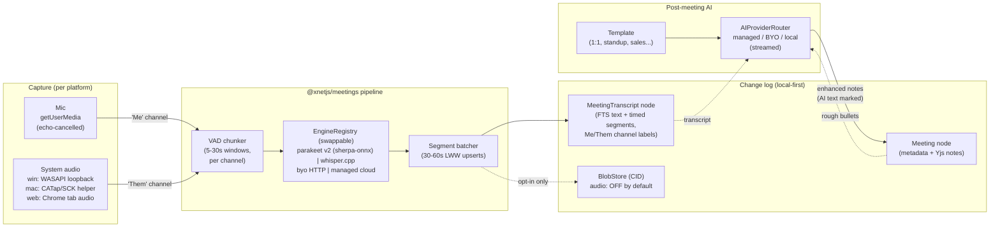
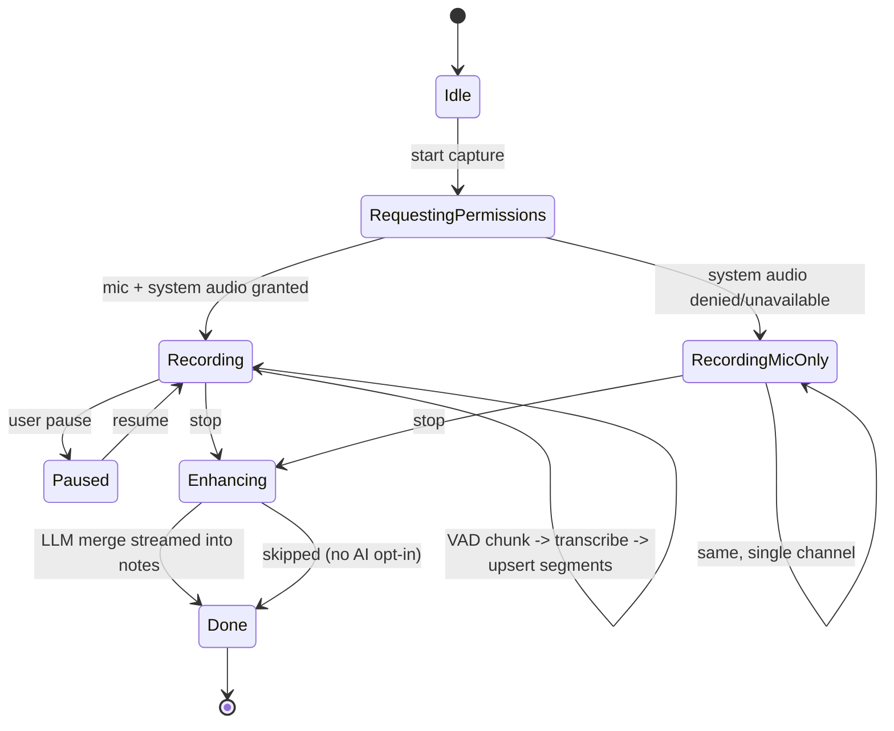
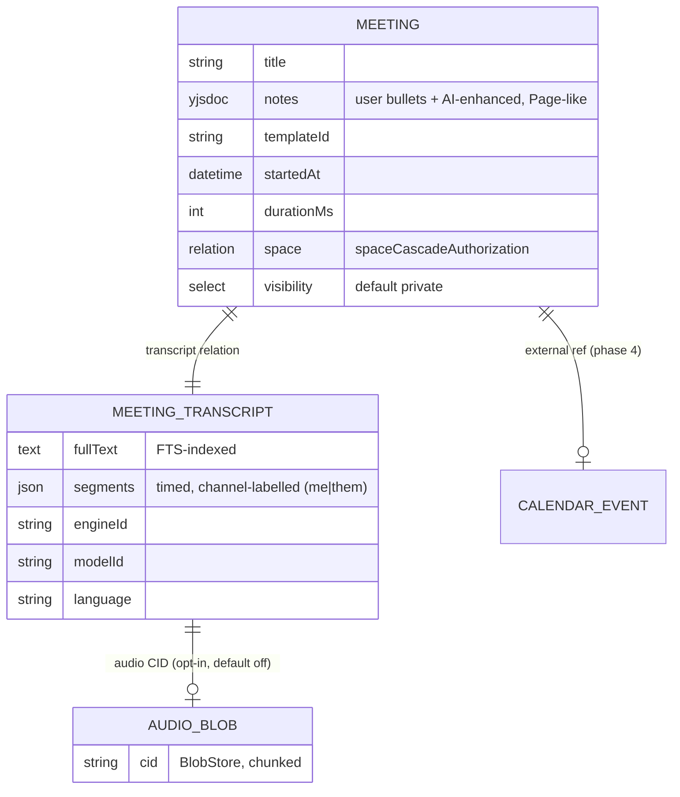
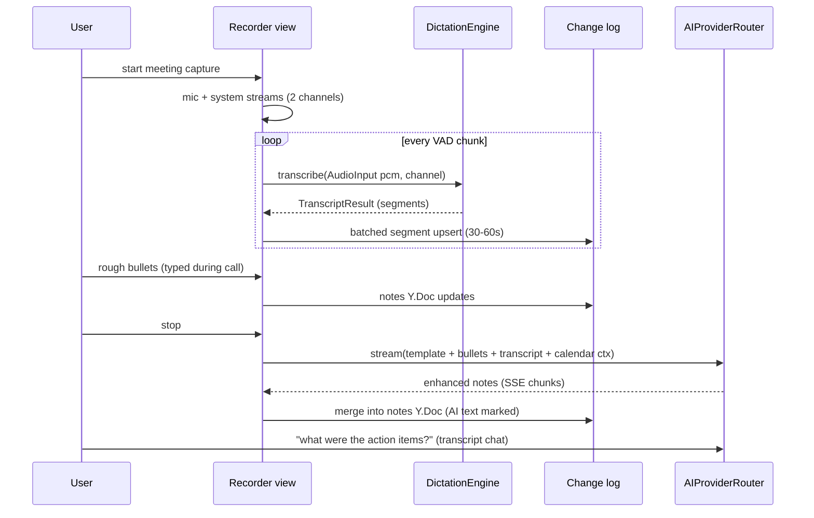

# Botless Meeting Transcription And AI Notes (Granola / Notion Style)

## Problem Statement

Granola and Notion AI Meeting Notes have defined a new product shape: open your
laptop for a meeting, the app captures **your microphone and the machine's
system audio directly** (no bot joins the call), transcribes it in real time,
and afterwards an LLM merges your rough bullets with the transcript into
polished, structured notes attached to the calendar event.

xNet should support this shape natively: a **Meeting** content node whose
transcript and AI-enhanced notes are first-class, local-first data — synced
through the change log, searchable via FTS, editable in the existing
collaborative editor, and private by default. The question is how to get there
given xNet's platform spread (web, Electron desktop, Capacitor mobile), its
local-first/privacy posture, and the seams that already exist in the repo.

## Executive Summary

- **This is more assembly than greenfield.** Exploration 0192 already landed
  `@xnetjs/dictation` (a `DictationEngine` port with pluggable STT backends)
  and a `Transcription@1.0.0` schema with privacy-default-off audio retention.
  The AI side (managed OpenRouter, BYO Anthropic, local models, streaming,
  budget metering) is fully built. Blob storage, the Yjs page editor, feature
  modules, and connectors all exist. **The genuinely new engineering is
  (a) per-platform audio capture and (b) a Meeting feature pack that wires the
  pieces together.**
- **Capture is forced into tiers by the platforms** — exactly the split Notion
  shipped: Electron desktop gets mic + true system audio (Windows: Chromium
  loopback is first-class; macOS: needs Chromium flags or a small native
  helper using ScreenCaptureKit / Core Audio taps); the web app gets mic +
  best-effort Chrome tab audio; mobile is mic-only for in-person meetings.
- **Copy Granola's channel trick for speaker attribution**: the mic stream is
  "Me", the system-audio stream is "Them". Two channels give 2-way attribution
  for free, in real time, with no diarization model. True multi-speaker
  splitting of "Them" is a later upgrade (pyannote or cloud diarization).
- **Local-first is a differentiator here.** Granola streams audio to Deepgram/
  AssemblyAI and transcripts to OpenAI/Anthropic — four cloud vendors touch
  your meeting. xNet can default to **on-device transcription** with cloud ASR
  as an opt-in accuracy tier through the existing BYO/managed plumbing, and
  **never persist audio by default** (the `Transcription` schema already
  encodes this norm).
- **Models are swappable by design — and the Electron default should be
  NVIDIA Parakeet-TDT-0.6B-v2.** The 0192 `EngineRegistry` already makes every
  STT backend a plug-in; we surface that as a user-facing engine/model picker
  with language-aware auto-selection. Parakeet v2 (6.05 % WER, #1 on the
  Hugging Face Open ASR leaderboard, built-in punctuation + word-level
  timestamps) runs in the Electron data process via the **sherpa-onnx Node
  addon** (int8 ONNX export, fast on CPU — no GPU required); whisper.cpp
  large-v3-turbo is the multilingual local fallback (Parakeet v2 is
  English-only; v3 adds 25 European languages), with browser Whisper, Apple
  SpeechAnalyzer, and BYO/managed cloud filling out the ladder.
- **Recommended path**: a `@xnetjs/meetings` feature module — `Meeting` schema
  (Yjs notes body, Page-like) + transcript segments persisted incrementally +
  a recorder surface with live transcript + post-meeting LLM enhancement via
  the existing `AIProviderRouter`/`ManagedProvider` — shipped in four phases,
  with the Electron system-audio capability built on the 0270 fs-capability
  pattern.

## Current State In The Repository

The repo is unusually well prepared for this feature. Load-bearing seams:

### Speech-to-text is already a port

- `packages/dictation/src/types.ts` — the `DictationEngine` interface every
  STT backend implements. `AudioInput` accepts raw PCM
  (`{ kind: 'pcm', samples: Float32Array, sampleRate }`) or encoded blobs;
  `TranscriptResult` already carries `segments?: TranscriptSegment[]` with
  `startMs`/`endMs` timings — exactly what a meeting timeline needs.
- `packages/dictation/src/engines/byo.ts` — `ByoEndpointEngine`, an HTTP
  client for any OpenAI-compatible `/v1/audio/transcriptions` endpoint
  (covers Groq, self-hosted faster-whisper, OpenAI itself).
- `packages/dictation/src/registry.ts` — `EngineRegistry` for runtime engine
  registration/selection; engines are cheap to construct and `ensureModel()`
  lazy-loads weights with progress callbacks.
- `packages/dictation/src/retention.ts` — retention/pruning policy for stored
  transcripts.
- **Gap**: today only `fake` and `byo` engines exist in-repo, and nothing in
  `apps/*` consumes the package yet — 0192 laid the port; meetings would be
  its first major consumer. Native engines (whisper.cpp, Parakeet, Apple
  SpeechAnalyzer) are named in the port's docs as intended implementations
  but are not yet built.

### A transcription schema already exists

- `packages/data/src/schema/schemas/transcription.ts` —
  `Transcription@1.0.0`: FTS-indexed `text`, `language`, `engineId`,
  `modelId`, `durationMs`, `source` (`inApp` | `pushToTalk`), optional
  `audio: file({})` blob (**off by default — privacy**), `starred` to pin
  against retention pruning, `visibility` defaulting to `private`. This is
  the dictation-history node; a meeting needs a bigger container but the
  privacy defaults and field vocabulary carry over directly.

### AI enhancement is fully plumbed

- `packages/plugins/src/ai/providers.ts` — `AIProvider` interface with
  `generate()`, `generateWithTools()`, and `stream()` (async-iterable
  `AIStreamChunk`s), plus `AIProviderRouter` for routing by request metadata.
- `ManagedProvider` (hub-metered OpenRouter, exploration 0208/0244) — posts to
  the hub's `/ai/chat`, SSE streaming via `/ai/chat/stream`, budget metering
  via `ManagedBudgetSnapshot` / `AiBudgetError`. Local models (transformers.js
  / WebLLM, exploration 0252) and BYO Anthropic (0192) round out the ladder.
  Note-enhancement is an ordinary streamed LLM call.

### Storage, editor, views, modules

- `packages/storage/src/blob-store.ts` + `chunk-manager.ts` — content-addressed
  (CID) blob storage with integrity verification and chunking. **Blobs do not
  ride the change log**; `file` properties store a CID reference. Important
  after the 0249 cold-open lesson (a 318k-row `changes` log): raw audio must
  never be change-log payload.
- `packages/data/src/schema/schemas/page.ts` — `PageSchema` with
  `document: 'yjs'` collaborative body and `spaceCascadeAuthorization()`; the
  template for a `Meeting` schema's notes body.
- `packages/editor/src/index.ts` — framework-agnostic TipTap/Yjs editor with
  the tiered extension system; the enhanced-notes surface reuses it as-is.
- `packages/views/src/registry.ts` — `ViewRegistry` contribution point;
  `packages/views/src/canvas-view` (0277) is the precedent for a shared view
  core consumed by both web and desktop.
- `packages/plugins/src/feature-module.ts` — `defineFeatureModule` +
  `ModuleCapabilities` (`secrets`, `schemaWrite`, `schemaRead`, `network`,
  `endowments`); exploration 0270 established the pattern for adding a native
  capability (`guardFs`) exposed over Electron IPC. System-audio capture is
  the next capability in that ladder.
- `packages/plugins/src/connectors/define-connector.ts` — `defineConnector`
  (0213), the template for a later calendar connector; `ExternalItem` /
  feed schemas normalize external events.
- `apps/electron/src/main/index.ts`, `data-process-manager.ts`,
  `service-ipc.ts` — main-process entry, background data process, and the IPC
  plumbing where a capture helper and long transcription jobs would live.
- `packages/devtools/src/seed/seed-manifest.ts` + `seeders/*` — a
  `meetingsSeeder` slots into the Tier-1 list; `seed-coverage.test.ts` will
  demand it (or auto-cover via Tier-2).

### What does not exist yet

- Any use of `getUserMedia` / `getDisplayMedia` / `MediaRecorder` /
  `desktopCapturer` — audio capture is entirely greenfield.
- Any calendar schema or calendar connector (Database views list a
  `'calendar'` view type, but there is no event source).
- Any streaming/incremental transcription path — `DictationEngine.transcribe`
  is one-clip-in, one-result-out.

## External Research

### How the incumbents work

**Granola** (the archetype): botless capture of mic + system audio at the OS
level on macOS/Windows — works with Zoom, Teams, Meet, huddles, FaceTime,
in-person, with zero per-platform integration. "Bot-free" ≠ "on-device":
audio streams to **Deepgram and AssemblyAI** for ASR, transcripts to
**OpenAI/Anthropic** (multi-model routing) for enhancement; audio is **never
stored** — only transcript + user notes persist. Speaker attribution is
**channel-based**: mic = "Me", system audio = "Them"; their docs state the
real-time desktop models don't do live diarization. Founder Chris Pedregal has
said **ASR, not LLM tokens, dominates their costs**, and echo cancellation
happens on-device. Calendar integration detects meetings; per-meeting-type
**templates** shape the enhanced notes; user text renders black, AI additions
grey.

**Notion AI Meeting Notes** (May 2025): a block type inside a page. Desktop
app ≥ 4.7.0 required for system audio (macOS 13+, i.e. ScreenCaptureKit-era;
needs system-audio + screen-recording permissions); **web is mic-only**.
16 transcription languages; speaker attribution English-only and heuristic
(change-point detection + calendar attendee names). Audio deleted after
processing or within 24 h. Enterprise controls: feature kill-switch, enforced
consent messages, transcript retention schedules. Business/Enterprise plans,
10 h/user/day cap.

**Landscape**: Otter/Fireflies send visible bots into calls; Fathom is
bot-based with botless moves; Zoom AI Companion is platform-native;
MacWhisper does fully local system-audio + mic transcription on macOS;
Google Meet began flagging third-party recording bots as "potential risk"
by default in March 2026 — a structural tailwind for the botless approach.

### System-audio capture per platform (the hard part)

| Platform                | Reality                                                                                                                                                                                                                                                                                                                                                                                                                                                                                                                                                                                                                                                                                                                                                                                        |
| ----------------------- | ---------------------------------------------------------------------------------------------------------------------------------------------------------------------------------------------------------------------------------------------------------------------------------------------------------------------------------------------------------------------------------------------------------------------------------------------------------------------------------------------------------------------------------------------------------------------------------------------------------------------------------------------------------------------------------------------------------------------------------------------------------------------------------------------- |
| **Windows (Electron)**  | The easy one. WASAPI loopback has worked forever with no permission prompt; Electron's `session.setDisplayMediaRequestHandler(..., { audio: 'loopback' })` exposes it first-class. Process-scoped loopback (capture only `zoom.exe`) exists since Win10 20H1.                                                                                                                                                                                                                                                                                                                                                                                                                                                                                                                                  |
| **macOS (Electron)**    | Historically no system audio via Chromium. Today: `audio: 'loopback'` works from ~macOS 13 with Chromium flags (`MacLoopbackAudioForScreenShare`, SCK-based variants on 14.2+; the `electron-audio-loopback` npm package wraps this driverlessly) but is flag-dependent with open breakage issues (electron#49607). Serious apps (Granola, Notion, Recall.ai's writeup) ship a **small native Swift helper** using ScreenCaptureKit (`SCStreamConfiguration.capturesAudio`, macOS 13+, Screen Recording TCC) or **Core Audio process taps** (`AudioHardwareCreateProcessTap`, macOS 14.2+/formalized 14.4, gated by `NSAudioCaptureUsageDescription` — no screen-recording prompt) and pipe PCM to the JS layer. Reference code: `insidegui/AudioCap`, AudioTee (Swift binary + Node wrapper). |
| **Pure web**            | `getDisplayMedia({ audio: true })`: Chrome gives **tab audio** on all OSes and whole-system audio **only on Windows/ChromeOS**, behind a non-default checkbox; Firefox ignores the audio constraint; Safari has none. So web capture = mic + best-effort Chrome tab audio (fine for Meet-in-a-tab, useless for the Zoom desktop client). This is why Notion's web tier is mic-only.                                                                                                                                                                                                                                                                                                                                                                                                            |
| **iOS (Capacitor)**     | No cross-app or call audio access, period (ReplayKit records only your own app's audio). Mic-only in-person mode — exactly Granola's iPhone shape (cache audio, post-hoc transcribe + diarize).                                                                                                                                                                                                                                                                                                                                                                                                                                                                                                                                                                                                |
| **Android (Capacitor)** | `AudioPlaybackCapture` (10+) can't capture `USAGE_VOICE_COMMUNICATION` streams — meeting apps are exempt. Practically mic-only too.                                                                                                                                                                                                                                                                                                                                                                                                                                                                                                                                                                                                                                                            |

**Recall.ai's botless-recorder writeup** (best implementation narrative):
Electron shell for orchestration/permissions + Swift helper running SCStream
for system audio (48 kHz stereo) and mic (44.1 kHz mono); **don't live-mix —
record both channels and align offline**; detect in-meeting mute state from
the meeting app's UI, not device state.

### ASR options

Local / on-device:

| Engine                               | Size                           | Speed                                                                         | Notes                                                                                                                                                                                                                                                                                                                                                   |
| ------------------------------------ | ------------------------------ | ----------------------------------------------------------------------------- | ------------------------------------------------------------------------------------------------------------------------------------------------------------------------------------------------------------------------------------------------------------------------------------------------------------------------------------------------------- |
| whisper.cpp large-v3-turbo           | 809 M                          | ~8× real-time on Apple Silicon (Metal/CoreML)                                 | Best local speed/quality point; WER ≈ large-v3 (13.4 vs 13.2 long-form)                                                                                                                                                                                                                                                                                 |
| whisper.cpp tiny→large-v3            | 39 M–1.55 B                    | RTF ~0.02 (tiny) → ~0.45 (large-v3) on M2                                     | The MacWhisper/Meetily default; Node bindings exist (`smart-whisper`)                                                                                                                                                                                                                                                                                   |
| Moonshine streaming (Useful Sensors) | 27–245 MB                      | true streaming encoder, edge-class                                            | ~6.65 % WER English; English-focused                                                                                                                                                                                                                                                                                                                    |
| NVIDIA Parakeet-TDT 0.6B v2/v3       | 600 M (int8 ONNX ≈ 0.6–0.7 GB) | RTFx ≈ 3386 on GPU; comfortably real-time on desktop CPU via sherpa-onnx int8 | 6.05 % WER — #1 Open ASR leaderboard; punctuation + word timestamps built in; v2 English-only, v3 adds 25 European languages. Runs in Node via the **sherpa-onnx addon** (`sherpa-onnx-nemo-parakeet-tdt-0.6b-v2-int8` has a shipped nodejs example) or on Apple ANE via FluidAudio (Swift/CoreML) — Meetily uses it for "4× faster" live transcription |
| transformers.js Whisper (browser)    | tiny/base, ~76 MB quantized    | ~5–8× real-time with WebGPU; WASM can be sub-real-time                        | The pure-web tier; already adjacent to 0252 local-models work                                                                                                                                                                                                                                                                                           |
| Apple SpeechAnalyzer (macOS 26)      | OS-bundled                     | ~2.2× faster than local large-v3-turbo                                        | Free, on-device; the obvious macOS-native engine once macOS 26 is a floor                                                                                                                                                                                                                                                                               |

Cloud / streaming:

| Provider                             | Price                                                      | Diarization                                                         |
| ------------------------------------ | ---------------------------------------------------------- | ------------------------------------------------------------------- |
| Deepgram Nova-3                      | $0.0077/min streaming EN ($0.46/h); batch from $0.0043/min | yes (~+$0.002/min)                                                  |
| AssemblyAI Universal-Streaming       | $0.15/h ($0.0025/min); streaming diarization +$0.06/h      | yes, incl. streaming                                                |
| OpenAI whisper-1 / gpt-4o-transcribe | $0.006/min; mini $0.003/min                                | no                                                                  |
| Groq whisper-large-v3-turbo          | **$0.04/h** (~$0.00067/min), 216× real-time                | no — ideal "re-transcribe at higher quality after the meeting" tier |

Diarization pragmatics: channel-based Me/Them costs nothing and covers 1:1
perfectly; splitting "Them" costs real money/complexity (pyannote locally
gets 95 %+ attribution on clean 2-speaker audio but 75–85 % on 3–4 speakers
sharing one channel — set expectations accordingly).

### The enhancement pattern

1. Inputs: user's rough timestamped bullets + channel-labelled transcript +
   calendar context (title, attendees) + a per-meeting-type **template**.
2. Prompt shape: "expand the user's notes using the transcript" — bullets act
   as a relevance filter and outline, so output reflects the user's
   priorities, not a generic summary. Render user text and AI additions
   visually distinct.
3. A 1-hour meeting is ~9–12k words (~15k tokens) — fits a single 200k-context
   call; chunking matters only for >2 h sessions, live partial summaries, and
   cost.
4. Post-meeting **chat over the transcript** ("what were the action items?")
   is the standard second feature and falls out of existing AI chat plumbing.

Open-source references: **Meetily** (Tauri/Rust, whisper.cpp/Parakeet local,
Ollama summaries), **Hyprnote** (local-first mic+system audio, on-device
Whisper, template-based blending), **screenpipe** (Rust continuous capture,
local whisper-large-v3-turbo, SQLite+FTS5), **AudioCap/AudioTee**
(macOS capture reference code), **electron-audio-loopback**.

## Key Findings

1. **~70 % of the stack already exists in-repo.** STT port, transcription
   schema with the right privacy defaults, AI ladder with streaming + budget
   metering, CID blob store, Yjs editor, feature modules, view registry,
   native-capability pattern (0270), seed/coverage machinery. The two real
   gaps: audio capture and the Meeting container/feature pack.
2. **Capture tiers are dictated by the platforms, not by us.** Desktop
   Electron = full botless capture; web = mic (+ Chrome tab audio); mobile =
   mic-only in-person. Every incumbent (Notion explicitly) shipped exactly
   this split. There is no way around a native macOS story for system audio.
3. **Channel-based Me/Them attribution is the 90 %-value, 1 %-cost move.**
   Granola ships this to a $1.5 B valuation without live diarization. It
   drops out of the capture architecture for free if we keep the two streams
   separate end-to-end.
4. **xNet can beat the incumbents on privacy, which is on-brand.** Granola
   routes meeting audio through four cloud vendors. xNet's default can be
   fully local: on-device ASR (whisper.cpp / transformers.js), notes stored
   E2E in the change log, audio never persisted (matching the existing
   `Transcription.audio` off-by-default norm and the humane-charter posture).
   Cloud ASR/LLM become explicit opt-in tiers through existing BYO/managed
   plumbing.
5. **Transcripts belong in the change log; audio does not.** A 1-h transcript
   is tens of KB of text (fine, FTS-searchable, syncable); audio is tens of
   MB (blob store or nowhere). The 0249 cold-open lesson makes this a hard
   rule. Incremental segment persistence must batch (e.g. one upsert per
   30–60 s of speech, LWW on a per-meeting segments node) rather than one
   change-log row per utterance.
6. **The `DictationEngine` port needs a streaming sibling, not a rewrite.**
   Meetings need continuous chunked transcription (VAD-split ~5–30 s windows
   fed to `transcribe()` works with every existing engine), with an optional
   `StreamingDictationEngine` capability for engines that support true
   streaming (Moonshine, Deepgram WebSocket) later.
7. **Permissions UX is a first-class feature**, not plumbing: macOS Screen
   Recording TCC vs audio-capture TCC (`NSAudioCaptureUsageDescription`,
   14.4+), signed binaries, restart-after-grant, and consent norms (Notion's
   enforced consent messages; recording-consent law varies by jurisdiction —
   an audible/visible indicator and easy consent messaging are table stakes).
8. **Parakeet-TDT-0.6B-v2 is viable inside Electron today, and the dictation
   port already anticipated it.** `packages/dictation/src/types.ts` names
   "NVIDIA Parakeet via sherpa-onnx/FluidAudio" as an intended engine. The
   sherpa-onnx project ships a Node addon (native, multi-threaded — prefer it
   over the WASM build, which has known issues with this model) plus an int8
   ONNX export of Parakeet v2 with a working nodejs example. Running it in
   the Electron **data process** keeps heavy inference off the renderer, and
   `ensureModel()` already models the one-time weights download. The engine
   descriptor + `EngineRegistry` make the model **swappable per device**:
   Parakeet v2 default for English on desktop, whisper.cpp turbo for other
   languages, byo/managed for low-end hardware.

## Options And Tradeoffs

### A. Capture strategy

| Option                                               | Pros                                                                                                                                     | Cons                                                                                                                                                 |
| ---------------------------------------------------- | ---------------------------------------------------------------------------------------------------------------------------------------- | ---------------------------------------------------------------------------------------------------------------------------------------------------- |
| **A1. Bot joins the call** (Recall.ai-style)         | Works from any device incl. web/mobile; per-speaker audio from the platform                                                              | Antithetical to local-first (server infra per meeting); bots increasingly blocked/flagged (Meet, 2026); per-platform integrations; creepy UX         |
| **A2. Pure-web capture only**                        | Zero native work                                                                                                                         | Mic-only on macOS/Safari/Firefox; can't hear the Zoom desktop client; unreliable checkbox UX — Notion/Granola both rejected this as the primary tier |
| **A3. Botless native capture, tiered** (recommended) | Works with every meeting surface; no bot; the Granola/Notion-proven shape; degrades gracefully (desktop full → web mic+tab → mobile mic) | Real native work on macOS; permissions UX; per-platform code                                                                                         |
| **A4. Manual upload/import only**                    | Trivial                                                                                                                                  | Not the product; useful as a supplementary path (Notion supports it)                                                                                 |

Within A3, the macOS system-audio sub-options:

| Sub-option                                                | Pros                                                                                                                                       | Cons                                                                                                                   |
| --------------------------------------------------------- | ------------------------------------------------------------------------------------------------------------------------------------------ | ---------------------------------------------------------------------------------------------------------------------- |
| **A3a. `electron-audio-loopback` / Chromium flags**       | Pure JS, no signing complexity, macOS 12.3+                                                                                                | Flag-dependent, open upstream breakage (electron#49607); screen-recording TCC prompt; fragile across Electron upgrades |
| **A3b. Native Swift helper (Core Audio tap, 14.2+/14.4)** | Audio-capture TCC only (no screen-recording scare prompt); robust; per-process capture possible; reference code exists (AudioCap/AudioTee) | Requires shipping+signing a helper binary; macOS 14.4+ floor for the clean TCC path                                    |
| **A3c. Native Swift helper (ScreenCaptureKit, 13+)**      | Broader OS support than taps; can also do per-app capture                                                                                  | Screen Recording permission (heavier prompt); more moving parts                                                        |

Recommendation: **start A3a behind the capability flag** (fastest to a working
end-to-end pipeline; Windows needs nothing extra), and **plan A3b as the
production macOS path** — the AudioTee approach (Swift binary spawned from the
Electron main process, PCM over stdout/IPC) fits `data-process-manager.ts`
patterns and the 0270 capability model cleanly. Fall back to A3a/A3c below
macOS 14.4.

### B. Transcription engine strategy

| Option                                                                                 | Pros                                                                                                                                                                                                                                                   | Cons                                                                                                                                                              |
| -------------------------------------------------------------------------------------- | ------------------------------------------------------------------------------------------------------------------------------------------------------------------------------------------------------------------------------------------------------ | ----------------------------------------------------------------------------------------------------------------------------------------------------------------- |
| **B1. Cloud-only (Deepgram/AssemblyAI)**                                               | Best streaming accuracy + diarization; least device load                                                                                                                                                                                               | Betrays local-first default; per-minute cost; audio leaves device — Granola's weakest flank                                                                       |
| **B2. Local-only, single hardcoded model**                                             | Fully private; free; offline                                                                                                                                                                                                                           | Model download; battery/CPU during meetings; weaker on low-end hardware; browsers need WebGPU; one model can't cover EN-accuracy + multilingual + low-end at once |
| **B3. Swappable-engine ladder: local default, BYO/managed cloud opt-in** (recommended) | Matches the existing AI-provider ladder (0208/0252) and `EngineRegistry` design exactly; privacy default; accuracy tier for those who want it; Groq batch re-transcription as a cheap "polish afterwards" tier; users/devices pick the model that fits | Two+ paths to maintain (the port already absorbs this)                                                                                                            |

Within B3, the **local engine choice per platform** — all behind the same
`DictationEngine` port, selectable in settings and auto-picked by language
and hardware:

| Engine (local)                                                                    | Where                 | Role                                                                                                                                                                                                                                              |
| --------------------------------------------------------------------------------- | --------------------- | ------------------------------------------------------------------------------------------------------------------------------------------------------------------------------------------------------------------------------------------------- |
| **Parakeet-TDT-0.6B-v2 via sherpa-onnx Node addon** (recommended desktop default) | Electron data process | Best English WER (6.05 %), real-time on CPU with int8, punctuation + word-level timestamps (feed segments directly); English-only — auto-fall-back when session language ≠ EN. Parakeet v3 (multilingual, 25 langs) is a drop-in model swap later |
| **whisper.cpp large-v3-turbo** (via `smart-whisper` or addon)                     | Electron data process | Multilingual local tier (~100 languages); Metal/CoreML acceleration on macOS                                                                                                                                                                      |
| **Apple SpeechAnalyzer**                                                          | macOS 26+ helper      | Free OS-bundled engine; zero download; add when macOS 26 share justifies it                                                                                                                                                                       |
| **transformers.js Whisper (WebGPU)**                                              | Web app worker        | Pure-web local tier (0252-adjacent); tiny/base quality — label as "draft quality"                                                                                                                                                                 |
| **Moonshine streaming**                                                           | any                   | Candidate for a true-streaming engine once a `StreamingDictationEngine` capability exists                                                                                                                                                         |

### C. Data model

| Option                                                                                                                       | Pros                                                                                                                                                                                                     | Cons                                                                                 |
| ---------------------------------------------------------------------------------------------------------------------------- | -------------------------------------------------------------------------------------------------------------------------------------------------------------------------------------------------------- | ------------------------------------------------------------------------------------ |
| **C1. Reuse `Transcription` nodes per utterance**                                                                            | No new schema                                                                                                                                                                                            | Thousands of nodes per meeting; change-log bloat (0249 lesson); no meeting container |
| **C2. One `Meeting` node holding everything (notes Y.Doc + transcript text + segments JSON)**                                | Single node; simple                                                                                                                                                                                      | Segment JSON grows unbounded in LWW payload; notes/transcript update cadences differ |
| **C3. `Meeting` node (metadata + Yjs notes) + one `MeetingTranscript` node (FTS text + segments) per meeting** (recommended) | Notes body is a normal Page-like Y.Doc; transcript updates batch into the sibling node without churning the meeting node; FTS on transcript text; optional audio CID follows the existing `file` pattern | Two schemas instead of one                                                           |

### D. Enhancement flow

| Option                                                            | Pros                                                                                                                                                          | Cons                                                    |
| ----------------------------------------------------------------- | ------------------------------------------------------------------------------------------------------------------------------------------------------------- | ------------------------------------------------------- |
| **D1. Live enhancement during the meeting**                       | Wow factor                                                                                                                                                    | Burns tokens continuously; distracting; Granola doesn't |
| **D2. One-shot post-meeting enhancement, streamed** (recommended) | Matches proven UX; single ~15k-token call per hour of meeting; streams into the editor; user bullets stay authoritative (rendered distinct from AI additions) | None significant                                        |
| **D3. Enhancement + transcript chat**                             | The expected fast-follow                                                                                                                                      | Needs D2 first; falls out of existing AI chat surface   |

## Recommendation

Build a **`@xnetjs/meetings` feature module** delivering the A3/B3/C3/D2
column, phased so each phase ships value alone:

- **Phase 1 — Capture + live transcript (desktop-first).** New
  `media`/system-audio `ModuleCapability` following the 0270 `guardFs`
  pattern; Electron main-process capture service (Windows `audio: 'loopback'`
  natively, macOS via `electron-audio-loopback` initially); renderer mic via
  `getUserMedia` with echo cancellation; VAD-chunked dual-channel feed into
  `EngineRegistry` engines (`byo` first to prove the pipeline, then
  **Parakeet-TDT-0.6B-v2 via the sherpa-onnx Node addon in the data process
  as the desktop default**, whisper.cpp large-v3-turbo as the multilingual
  local fallback) with a user-facing engine/model picker; `Meeting` +
  `MeetingTranscript` schemas; recorder view with live Me/Them transcript.
- **Phase 2 — AI-enhanced notes.** Template registry, post-meeting streamed
  enhancement through `AIProviderRouter` (managed/BYO/local), AI-vs-user text
  distinction in the editor, transcript chat.
- **Phase 3 — Production macOS capture + web tier.** Swift Core Audio tap
  helper (AudioTee-style) with the clean audio-capture TCC path; web-app
  mic + Chrome tab-audio capture; permissions/consent UX polish.
- **Phase 4 — Calendar + mobile + diarization upgrade.** Calendar connector
  via `defineConnector` (meeting detection, attendee names for attribution);
  Capacitor mic-only in-person mode with post-hoc transcription; optional
  "Them"-splitting via cloud diarization or pyannote.

### Architecture



### Capture session lifecycle



### Data model



### Enhancement sequence



## Example Code

Meeting schema (follows `page.ts` + `transcription.ts` patterns):

```ts
// packages/data/src/schema/schemas/meeting.ts
export const MEETING_SCHEMA_IRI = 'xnet://xnet.fyi/Meeting@1.0.0' as const

export const MeetingSchema = defineSchema({
  name: 'Meeting',
  namespace: 'xnet://xnet.fyi/',
  document: 'yjs', // the notes body — user bullets + AI-enhanced output
  properties: {
    title: text({ required: true, maxLength: 300 }),
    startedAt: number({ integer: true }), // epoch ms
    durationMs: number({ integer: true, min: 0 }),
    templateId: text({ maxLength: 120 }), // '1on1' | 'standup' | ...
    transcript: relation({ to: MEETING_TRANSCRIPT_SCHEMA_IRI }),
    space: relation({ to: SPACE_SCHEMA_IRI }),
    // meetings are sensitive by default, like Transcription and Metric
    visibility: select({
      options: [
        { id: 'private', name: 'Private' },
        { id: 'space', name: 'Space' }
      ] as const,
      default: 'private'
    })
  },
  authorization: spaceCascadeAuthorization()
})
```

VAD-chunked capture feeding the existing engine port (no port changes needed):

```ts
// packages/meetings/src/capture/session.ts
const CHANNELS = ['me', 'them'] as const

async function pumpChannel(
  channel: (typeof CHANNELS)[number],
  chunks: AsyncIterable<Float32Array>, // VAD-split mono 16 kHz windows
  engine: DictationEngine,
  sink: SegmentBatcher
) {
  for await (const samples of chunks) {
    const result = await engine.transcribe(
      { kind: 'pcm', samples, sampleRate: 16_000 },
      { language: sessionLanguageHint }
    )
    sink.push(channel, result) // batches LWW upserts every 30-60s of speech
  }
}
```

Swappable engines: a Parakeet engine behind the existing port, registered
alongside the others, with language/hardware-aware default selection
(model IDs are data, not code — v2 → v3 is a descriptor swap):

```ts
// apps/electron (data process): packages side sees only DictationEngine
import sherpa from 'sherpa-onnx-node'

export class ParakeetSherpaEngine implements DictationEngine {
  descriptor = {
    id: 'parakeet-sherpa',
    modelId: 'parakeet-tdt-0.6b-v2-int8', // swappable: v3 = multilingual
    languages: ['en'], // registry filters on this
    costClass: 'local-cpu',
    accepts: ['pcm']
  } as const

  async ensureModel(onProgress?: (p: number) => void) {
    /* one-time download of the int8 ONNX export, with progress */
  }

  async transcribe(input: AudioInput, opts?: TranscribeOptions) {
    const rec = this.recognizer // sherpa.OfflineRecognizer, cached
    const stream = rec.createStream()
    stream.acceptWaveform({ samples: input.samples, sampleRate: input.sampleRate })
    rec.decode(stream)
    const r = rec.getResult(stream) // text + word-level timestamps
    return toTranscriptResult(r, this.descriptor) // segments from timestamps
  }
}

// selection: settings override > language match > hardware cost class
registry.register(new ParakeetSherpaEngine()) // desktop EN default
registry.register(new WhisperCppEngine()) // multilingual fallback
registry.register(new ByoEndpointEngine(cfg)) // cloud opt-in
const engine = registry.select({ language, preference: userSetting })
```

Post-meeting enhancement, streamed through the existing provider ladder:

```ts
// packages/meetings/src/enhance/enhance-notes.ts
const stream = provider.stream({
  messages: [
    { role: 'system', content: template.systemPrompt },
    {
      role: 'user',
      content: buildEnhancePrompt({
        roughNotes, // user's bullets, timestamped
        transcript, // channel-labelled: [me]/[them]
        calendar: context // title + attendees, when available
      })
    }
  ]
})
for await (const chunk of stream) {
  if (chunk.type === 'text') appendAiMarkedText(notesDoc, chunk.text)
}
```

## Risks And Open Questions

- **macOS capture fragility.** The pure-Electron loopback path is
  flag-dependent with open upstream issues; the Swift-helper path adds
  signing/notarization and a macOS 14.4 floor for the clean TCC prompt.
  Mitigation: ship both, feature-detect, degrade to mic-only loudly (the
  state machine above treats mic-only as a first-class mode, not an error).
- **Echo cancellation / double capture.** The mic channel will pick up
  speaker output ("Them" bleeding into "Me") unless `getUserMedia` echo
  cancellation is on and works against the loopback stream. Granola does
  on-device echo cancellation; Recall.ai keeps channels separate and aligns
  offline. Needs an early spike — this determines transcript quality more
  than model choice.
- **Battery/CPU of local ASR during calls.** Parakeet int8 and whisper.cpp
  turbo leave headroom on modern hardware, but Intel Macs / low-end Windows
  may need the cloud tier or a smaller model by default. Engine descriptor
  should advertise a cost class; pick per-device — this is exactly what the
  swappable-engine picker is for.
- **Parakeet v2 is English-only.** The registry must auto-fall-back to
  whisper.cpp (or byo/managed) when the session language isn't English, and
  say so in the picker rather than silently producing garbage. Parakeet v3
  (25 European languages) is a model-descriptor swap when its sherpa-onnx
  export matures.
- **Native addon packaging in Electron.** sherpa-onnx's Node addon links
  native shared libraries (needs `DYLD_LIBRARY_PATH`/`LD_LIBRARY_PATH`
  wiring and per-platform prebuilds in electron-builder; its WASM build has
  known issues with the Parakeet model — use the addon). The repo has been
  bitten by native/runtime mismatches in Electron before (0198:
  `node:crypto` vs electron-vite); budget a packaging spike, and keep the
  engine in the **data process** so a bad addon can't take down the renderer.
- **Consent and law.** Recording-consent law varies by jurisdiction
  (all-party vs one-party). We are botless, so no notification is inherent —
  ship a visible recording indicator, an optional auto-consent message
  (Notion's enterprise pattern), and make audio retention opt-in-only.
  Aligns with the humane charter (0234); worth a short legal review note in
  the doc when implemented.
- **Transcript size in the change log.** ~60 KB/h of text is fine, but the
  segments JSON on one LWW property means each batch rewrite re-uploads the
  whole payload. If this bites, shard `MeetingTranscript` into per-N-minute
  segment nodes — decide from real numbers in Phase 1.
- **Web-tier expectations.** Mic + Chrome tab audio only; Safari/Firefox
  mic-only. The UI must set expectations per platform, or users will think
  transcription is broken when the Zoom desktop app is inaudible to the web
  build.
- **Does dictation (0192) UI land first?** Meetings would be the dictation
  package's first consumer; if a whisper.cpp engine gets built here, the
  push-to-talk dictation feature inherits it for free — sequencing worth
  exploiting deliberately.
- **Open question**: should enhanced notes live in the same Y.Doc as the
  user's bullets (with AI marks) or in a separate section/doc regenerable at
  will? Granola merges (black/grey); regeneration semantics are simpler with
  a separate section. Lean: same doc, AI spans marked, regenerate replaces
  only AI spans.

## Implementation Checklist

### Phase 1 — Capture + live transcript (desktop-first)

- [x] `Meeting@1.0.0` + `MeetingTranscript@1.0.0` schemas in
      `packages/data/src/schema/schemas/` (Page/Transcription patterns,
      `spaceCascadeAuthorization`, private-by-default), exported via the
      schemas sub-barrel; authz coverage test passes
- [x] New `packages/meetings` package: `defineFeatureModule({ id: 'meetings', ... })`
      declaring schema capabilities
- [x] `systemAudio` capability in `ModuleCapabilities`
      (`packages/plugins/src/feature-module.ts`) following the 0270 `guardFs`
      pattern; guarded Electron IPC in `apps/electron/src/main/`
- [ ] Electron capture service: Windows `setDisplayMediaRequestHandler`
      `audio: 'loopback'`; macOS via `electron-audio-loopback` (flagged);
      renderer mic via `getUserMedia` with `echoCancellation: true`
- [ ] Echo-cancellation spike: verify "Me" channel doesn't contain speaker
      bleed with loopback active (blocker for transcript quality)
- [x] VAD chunker (per channel) + `SegmentBatcher` with 30–60 s LWW upserts;
      **no per-utterance change-log rows**
- [ ] Wire `EngineRegistry`: `byo` engine end-to-end first to prove the
      pipeline
- [x] `ParakeetSherpaEngine` (sherpa-onnx Node addon, `parakeet-tdt-0.6b-v2`
      int8) in the Electron data process — desktop **default for English**;
      `ensureModel()` download with progress; packaging spike for the native
      addon in electron-builder (shared-lib paths, per-platform prebuilds)
- [x] `WhisperCppEngine` (large-v3-turbo) as the multilingual local fallback
- [ ] Engine/model picker in settings + language/hardware-aware auto-select
      (`descriptor.languages`, `costClass`); non-EN sessions auto-route away
      from Parakeet v2 with a visible notice
- [ ] Recorder view (shared core in `packages/views/src/`, 0277 pattern):
      start/pause/stop, live Me/Them transcript, visible recording indicator,
      mic-only degraded mode
- [x] `meetingsSeeder` in `packages/devtools/src/seed/seeders/meetings.ts`,
      registered in `seed-manifest.ts` (seed-coverage test green)
- [ ] Changesets for every publishable package touched (`data`, `plugins`,
      `views`, new `meetings` — fixed-core rules apply)

### Phase 2 — AI-enhanced notes

- [ ] Template registry (1:1, standup, sales, interview, generic) with
      system prompts
- [ ] Post-meeting enhancement via `AIProviderRouter.stream()` (managed /
      BYO / local ladder; respects `AiBudgetError`)
- [ ] AI-marked spans in the notes Y.Doc (editor extension); regenerate
      replaces only AI spans
- [ ] Transcript chat surface reusing existing AI chat plumbing
- [ ] Optional Groq/byo batch re-transcription pass ("polish transcript")

### Phase 3 — Production macOS capture + web tier

- [ ] Swift Core Audio tap helper (AudioTee-style) spawned from Electron
      main; `NSAudioCaptureUsageDescription`; signing/notarization in the
      electron-builder pipeline; fallback ladder (CATap 14.4+ → SCK 13+ →
      loopback flags → mic-only)
- [ ] Permissions UX: pre-flight checks, TCC prompt explainers,
      restart-after-grant handling
- [ ] Web tier: mic + Chrome `getDisplayMedia` tab-audio best-effort, with
      explicit per-platform capability messaging
- [ ] Optional consent auto-message + retention schedule settings
      (Notion-pattern enterprise controls)

### Phase 4 — Calendar, mobile, diarization

- [ ] Calendar connector via `defineConnector` (Google Calendar first):
      upcoming-meeting detection, "start notes" prompt, attendee names
- [ ] Capacitor in-person mode: mic-only record → post-hoc transcription
- [ ] Optional "Them" diarization upgrade (cloud diarization flag on byo/
      managed engines, or local pyannote), seeded with attendee names
- [ ] Audio retention opt-in: encoded audio → `BlobStore` CID on the
      transcript node (never the change log)

## Validation Checklist

- [ ] Windows Electron: Zoom desktop-client meeting fully transcribed with
      correct Me/Them attribution, no virtual driver installed
- [ ] macOS Electron: same, via loopback flags (Phase 1) and via Swift helper
      with only the audio-capture TCC prompt (Phase 3)
- [ ] Echo test: play far-end audio through speakers (no headphones); "Me"
      channel transcript contains no far-end speech
- [ ] Local-only run: network disabled, Parakeet (EN) and whisper.cpp
      (non-EN) engines — full capture → transcript → (local-model or
      skipped) enhancement works offline
- [ ] Engine swap: switching Parakeet ↔ whisper.cpp ↔ byo mid-product (not
      mid-meeting) requires no code change and is reflected in
      `MeetingTranscript.engineId`/`modelId`; a non-English session
      auto-falls back off Parakeet v2 with a visible notice
- [ ] Change-log hygiene: a 60-min meeting produces ≤ ~120 segment upserts
      and zero audio bytes in the change log; sync to a second device
      converges (LWW) with the transcript intact and FTS-searchable
- [ ] Privacy defaults: audio not persisted unless opted in; meeting
      `visibility` private; transcript excluded from public surfaces
- [ ] Enhancement: rough bullets + transcript → structured notes streamed
      into the editor; user text visually distinct from AI text; regenerate
      touches only AI spans; budget cap surfaces `AiBudgetError` gracefully
- [ ] Degraded modes: web build on Safari (mic-only) and Chrome (tab audio)
      state their capture scope in the UI; system-audio denial mid-setup
      lands in mic-only mode, not an error
- [ ] Seed coverage test green with `meetingsSeeder`; fallow gate green;
      changesets present for all publishable packages touched

## References

### In-repo

- `packages/dictation/src/` — `DictationEngine` port, `EngineRegistry`, byo engine, retention (exploration 0192)
- `packages/data/src/schema/schemas/transcription.ts`, `page.ts`, `media-asset.ts`
- `packages/plugins/src/ai/providers.ts`, `feature-module.ts`, `connectors/define-connector.ts`
- `packages/storage/src/blob-store.ts`, `chunk-manager.ts`
- `packages/editor/src/`, `packages/views/src/registry.ts`
- `apps/electron/src/main/index.ts`, `data-process-manager.ts`, `service-ipc.ts`
- `packages/devtools/src/seed/seed-manifest.ts`
- Explorations: 0192 (dictation), 0208/0244/0252 (AI ladder), 0213 (connectors), 0234 (humane charter), 0249 (change-log bloat lesson), 0270 (fs capability pattern), 0277 (shared view cores)

### External

- Granola: https://docs.granola.ai/article/transcription · https://www.granola.ai/security · https://shotcast.substack.com/p/ux-and-not-llm-chris-pedregal-granolas · https://creatoreconomy.so/p/the-hidden-rules-behind-successful-ai-products-chris-pedregal
- Notion AI Meeting Notes: https://www.notion.com/help/ai-meeting-notes · https://www.notion.com/releases/2025-05-13
- Botless recorder build narrative: https://www.recall.ai/blog/how-i-built-a-botless-meeting-recorder-from-scratch
- macOS capture: https://developer.apple.com/documentation/screencapturekit · https://developer.apple.com/documentation/CoreAudio/capturing-system-audio-with-core-audio-taps · https://github.com/insidegui/AudioCap · https://stronglytyped.uk/articles/audiotee-capture-system-audio-output-macos · https://stronglytyped.uk/articles/recording-system-audio-electron-macos-approaches
- Electron: https://www.electronjs.org/docs/latest/api/desktop-capturer · https://github.com/alectrocute/electron-audio-loopback · https://github.com/electron/electron/issues/47490
- Windows: https://learn.microsoft.com/en-us/windows/win32/coreaudio/loopback-recording · https://learn.microsoft.com/en-us/samples/microsoft/windows-classic-samples/applicationloopbackaudio-sample/
- Web/mobile limits: https://developer.mozilla.org/en-US/docs/Web/API/MediaDevices/getDisplayMedia · https://caniuse.com/mdn-api_mediadevices_getdisplaymedia_audio_capture_support · https://developer.apple.com/documentation/ReplayKit · https://developer.android.com/media/platform/av-capture
- ASR: https://getspeakup.app/blog/whisper-cpp-benchmark-mac/ · https://whispernotes.app/blog/introducing-whisper-large-v3-turbo · https://huggingface.co/UsefulSensors/moonshine-streaming-tiny · https://huggingface.co/nvidia/parakeet-tdt-0.6b-v2 · https://github.com/xenova/whisper-web · https://www.macstories.net/stories/hands-on-how-apples-new-speech-apis-outpace-whisper-for-lightning-fast-transcription/
- Parakeet in Node/Electron: https://github.com/k2-fsa/sherpa-onnx (Node addon + `sherpa-onnx-nemo-parakeet-tdt-0.6b-v2-int8` model) · https://github.com/k2-fsa/sherpa-onnx/blob/master/nodejs-addon-examples/README.md · https://www.npmjs.com/package/sherpa-onnx · https://github.com/k2-fsa/sherpa-onnx/issues/2200 (WASM/nodejs issues with this model — prefer the addon) · https://github.com/FluidInference/FluidAudio (Parakeet on Apple ANE/CoreML)
- Cloud ASR pricing: https://deepgram.com/pricing · https://www.assemblyai.com/pricing · https://platform.openai.com/docs/pricing/ · https://console.groq.com/docs/model/whisper-large-v3-turbo
- Diarization: https://www.pyannote.ai/ · https://huggingface.co/pyannote/speaker-diarization-community-1
- Open-source clones: https://github.com/Zackriya-Solutions/meetily · https://openalternative.co/hyprnote · https://github.com/screenpipe/screenpipe · https://github.com/thepersonalaicompany/amurex
