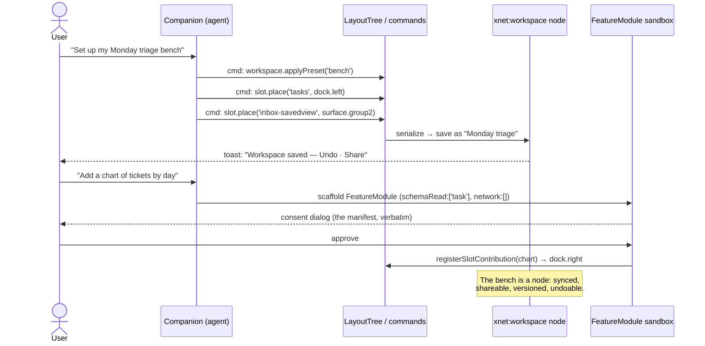

# The Malleable Workbench — Designing the Composable Workspace

## Problem Statement

xNet's pitch — _"the application is a view over your data"_
([The Workshop and the Walled Garden](https://xnet.fyi/blog/the-workshop-and-the-walled-garden/)) —
is true at the data layer and only half-true at the shell layer. The substrate
is genuinely open: one store of nodes, views as scoped queries, plugins as
consent forms. But the **workspace itself** — which panels exist, where they
sit, what the app _feels like_ at rest — is hand-authored in three discrete,
non-composable shells:

- the **workbench grid** (0166) — a VS Code cosplay with fixed rail, three
  named panels, and editor groups;
- the **calm shell** (0250) — a Claude-desktop grammar with exactly three
  regions (List · Surface · Canvas) and no splits, no tabs;
- the **quiet posture** (0273) — the calm shell with chrome summoned from
  corners and edges.

Each is good. None is _malleable_ in the Ink & Switch sense: a user cannot
rearrange regions, save a task-shaped layout, share a workspace with a
teammate, or grow the shell from minimal to dense without jumping between
pre-built shells. The question this exploration answers: **how do we redesign
the UI/UX so the workspace transforms — smoothly, per user and per task — from
a blank sheet to a fully tooled workbench, using the same substrate,
contribution, and consent machinery the rest of xNet already runs on?**

Target feel, in the user's words: Notion's calm composition, VS Code/Zed's
tooled density, Obsidian's saved workspaces and plugin culture, Claude/Codex's
agent-beside-artifact layout — one app that can be any of these _postures_
without being a different app.

## Executive Summary

**The gap is not capability, and it is not even composition any more — it is
that the shell is code, not data.** After 0166→0250→0273 the repo has every
primitive a workbench needs: a platform-free view registry
(`packages/views/src/registry.ts`), a VS Code-grade contribution system with
15+ contribution points (`packages/plugins/src/contributions.ts`), a command
palette, a capability manifest that reads as a consent form
(`packages/plugins/src/feature-module.ts`), and three shells that already
share one zustand store (`apps/web/src/workbench/state.ts`). What it lacks is
the DotA move applied to the shell itself: **the layout as a separable,
legible "map file" the engine loads — so users (and their agents) can mod the
workspace the way modders modded Doom.**

Recommendation, staged and each phase independently landable:

1. **One region grammar, three presets.** Replace the hard fork between
   `layout: 'calm' | 'workbench'` with a single **layout tree** (regions →
   slots → views). Calm, workbench, and quiet become _presets_ — named
   configurations of the same tree — instead of separate component trees.
   Users move a view between slots the way VS Code drags views between
   sidebars; Esc still walks the 0273 disclosure ladder.
2. **Workspaces as nodes.** A saved layout is a `xnet:workspace` node in the
   substrate: named, versioned by the change log, synced, shareable, and
   scoped like any other node. "My Monday triage bench" is a thing you can
   send to a colleague — the shell's WAD file.
3. **The customization slope.** A six-rung gentle slope from _use a preset_ →
   _toggle/drag panels_ → _save a workspace_ → _pin blocks/views onto the
   Desk_ → _ask the agent to build a view (vibe-coded FeatureModule with a
   consent manifest, quarantined by the trust ladder)_ → _full plugin via the
   devkit bridge_. Every rung is in-app, keyboard-reachable, and reversible.
4. **The agent is a shell citizen.** Companion mode gains commands that edit
   the workspace itself ("set up a writing bench", "put my tasks on the
   right"), emitting the same layout-tree mutations a drag would — the
   home-cooked-age thesis made concrete.

Minimal↔robust transformation is then a _movement along one ladder_, not a
switch between products: L0 bare surface (quiet) → pinned calm → tooled bench
with splits and docks — all one state machine, all one persisted tree, all
undoable.

## Current State In The Repository

### The three shells and their shared store

| Piece          | Path                                                     | Notes                                                                                                                                                             |
| -------------- | -------------------------------------------------------- | ----------------------------------------------------------------------------------------------------------------------------------------------------------------- |
| Shell router   | `apps/web/src/workbench/Workbench.tsx` (~200 LOC)        | Chooses calm vs workbench vs mobile                                                                                                                               |
| Shell state    | `apps/web/src/workbench/state.ts` (~680 LOC)             | One persisted zustand store: `layout`, `calmMode`, `chrome`, `discloseLevel`, `left/right/bottom` panels, editor `groups`/tabs, `shelf`, `deskPins`, `startupTab` |
| Workbench grid | 0166 components under `apps/web/src/workbench/`          | Rail (44px, hard-coded 6 icons) → panels → editor groups via `react-resizable-panels`                                                                             |
| Calm shell     | `apps/web/src/workbench/calm/CalmShell.tsx` (~115 LOC)   | ModeSwitch · ListPane · Surface · ContextualCanvas; modes = companion/workspace/network (`calm/modes.ts`)                                                         |
| Quiet posture  | `apps/web/src/workbench/calm/QuietChrome.tsx` (~373 LOC) | Corner glyphs, edge hot-zones, disclosure ladder L0–L2                                                                                                            |
| Surface dock   | `apps/web/src/workbench/calm/SurfaceDock.tsx` (~422 LOC) | Registry-driven corner launcher; hero/secondary tiers                                                                                                             |
| Mobile shell   | `apps/web/src/workbench/MobileShell.tsx`                 | Separate composition below 768px, not a reflow                                                                                                                    |
| Commands       | `apps/web/src/workbench/commands.ts`                     | ⌘B/⌘\\/⌘J/⌘./⌘K etc. registered in the global command registry                                                                                                    |

Three **orthogonal axes** already exist and are the germ of the design:
`layout` (calm/workbench), `chrome` (pinned/quiet), and theme axes
(`data-variant`, `data-density` in `packages/ui/src/theme/tokens.css`,
`ThemeProvider.tsx` — 0232). Zen mode snapshots and restores panel state — the
proof that chrome is already a recoverable state, not a fixed frame.

### The contribution machinery (already VS Code-grade)

`packages/plugins/src/contributions.ts` (614 LOC) defines contribution points
for: views, commands, slash commands, toolbar, editor extensions, status bar,
sidebar, widgets, property handlers, blocks, settings, schemas, importers,
**surface dock** (`SurfaceDockContribution` — id, label, icon,
`tier: 'hero' | 'secondary'`, group, badge, component), and seven canvas
contribution kinds (cards, ingestors, tools, layouts, edges, inspectors,
templates). `ContributionRegistry` + `TypedRegistry` hold them.

`packages/plugins/src/feature-module.ts` (63 LOC) is the consent form the
Workshop essay showcases: `ModuleCapabilities` = `secrets` / `schemaRead` /
`schemaWrite` / `network` / `endowments`, enforced by the guarded store,
guarded fetch, and hub secret broker.

### The view layer (already platform-free)

`packages/views/src/registry.ts` (238 LOC): `ViewRegistry.register()`,
`getForSchema(schemaIRI)`, `getForPlatform(platform)` — ~16 built-in view
types (table, board, gallery, list, calendar, timeline, grid, tasks, form,
canvas-view, card-detail, …). Views take `ViewProps` and know nothing about
routers or shells. The 0277 convergence extracted the shared canvas core
(`packages/views/src/canvas-view/`, headless `useCanvasViewController`),
proving platform shells can be thin chrome over shared cores —
`DataWorkspaceCore` (0276) did the same for the data workspace.

### The seams a malleable workbench plugs into

1. `left/right/bottom` panel booleans drive **both** existing desktop shells —
   the state layer is already shell-agnostic.
2. `SurfaceDockContribution`'s registry+tier pattern generalizes to any slot.
3. `canvasTarget` is already the Claude "artifact opens on the right" move.
4. The command registry gives every new shell verb a palette entry + chord
   for free.
5. `startupTab` makes "home is a node" a policy, not a component.
6. The Shelf (`shelf` in state) and Desk pins (`deskPins`, 0273) are the
   transfer grammar between contexts.

### The rigidities the redesign must dissolve

1. **Calm has exactly three regions** — no splits, no tabs, no rearrangement;
   `EditorGroup`s exist only in the workbench grid.
2. **SurfaceDock is welded to `bottom`** panel state — the registry pattern is
   right but the slot is hard-coded.
3. **The workbench Rail is closed** — 6 fixed icons, no contribution slot.
4. **Electron is a fourth shell** (`apps/electron/src/renderer/App.tsx`,
   `shell/shell-state.ts` — document-centric `ShellKind`, no calm grammar, no
   palette) — every shell improvement currently forks.
5. **MobileShell is a separate composition**, not a projection of the same
   layout tree.
6. **Layout state is app-local** (localStorage zustand) — invisible to the
   substrate, unsyncable, unshareable, un-undoable — the one part of a user's
   environment that is _not_ "data you own".

## External Research

### The two essays (the brief's frame)

**Ink & Switch, [Malleable Software](https://www.inkandswitch.com/essay/malleable-software/)
(2025):** software should be a dynamic medium users reshape, not locked-down
apps. Named ideas this design leans on: the **gentle slope** (use → inspect →
modify in small, discoverable steps — the spreadsheet's trick); **tools, not
apps** (single-purpose "avocado slicers" don't compose; knives over a shared
substrate do); **shared data infrastructure** (many tools over one corpus —
the filesystem's lost virtue); **communal creation** ("local developers"
customize for a situated group — Shirky's situated software, Sloan's
home-cooked meal); **dynamic/compound documents**
([Potluck](https://www.inkandswitch.com/potluck/): plaintext gradually
enriched into personal software; Embark: outline with embedded live tools).
Their warning is also load-bearing: AI codegen alone produces _siloed_ apps —
malleability needs the substrate, or the LLM just builds more walled sheds.

**xNet, [The Workshop and the Walled Garden](https://xnet.fyi/blog/the-workshop-and-the-walled-garden/):**
modding built half of gaming (Doom WADs → DotA → an industry) and the pattern
requires only two things — **data separable from the engine, and permission to
put your thing where the old thing was**. The walled garden's ban on mods is a
response to the catastrophic default (all code gets all authority); the fix is
**scope the authority, not ban the code** (object capabilities — Figma
plugins, Deno permissions, VS Code's killable extension host). xNet's manifest
_is_ the consent form. The essay's closing question — "what's your DotA?" —
is, for this exploration, literal: **the shell must ship its map editor.**

### What each reference app teaches

**VS Code** ([UI docs](https://code.visualstudio.com/docs/getstarted/userinterface),
[contribution points](https://code.visualstudio.com/api/references/contribution-points)):
six named regions (activity bar, primary + secondary side bars, editor groups,
panel, status bar); **views are movable between containers by drag**; panel
relocates left/right/bottom; extensions contribute views/commands/status items
declaratively; **when-clause contexts** gate visibility; everything is also a
palette command. The deep lesson: _named slots + movable views + declarative
contributions_ scale from a text editor to an IDE without a redesign.

**Zed** ([panel system](https://zed.dev/blog/new-panel-system)): three docks
(left/right/bottom), each hosting multiple panels with focus-toggling; **zoom**
(any pane temporarily full-screen — a lighter zen); layout choices persist
automatically to `settings.json`; settings-as-code makes the environment
versionable and shareable. Performance-as-UX: chrome must never make the
surface feel heavier.

**Obsidian** ([workspace](https://docs.obsidian.md/Plugins/User+interface/Workspace),
[Workspaces plugin](https://help.obsidian.md/plugins/workspaces)): the
workspace is a **tree of splits containing leaves (tabs)** serialized to
`workspace.json`; the Workspaces plugin makes **named, recallable layouts** a
first-class user object; community plugins contribute leaf types
indistinguishable from core ones; graph/canvas/plugins hidden by default —
gradual disclosure for non-technical users with a plugin culture on top.

**Notion** ([block model](https://www.notion.com/blog/data-model-behind-notion)):
everything is a block; **databases are data with interchangeable views**
(table/board/calendar/gallery over the same rows — exactly xNet's
views-over-substrate claim, proven at consumer scale); the slash command is
the composition verb; chrome stays minimal because _composition happens in the
document, not the frame_.

**Claude desktop / OpenAI canvas apps**
([Artifacts](https://www.anthropic.com/news/artifacts),
[Canvas](https://openai.com/index/introducing-canvas/)): the two-region
**conversation + artifact** grammar — reasoning on the left, live output on
the right; artifacts persist as named objects, not chat scroll; projects scope
context. The agent-first lesson: the agent needs a _place to put things_ that
outlives the conversation — in xNet that place is the substrate itself, which
is a structural advantage over both.

**Deep prior art:** Smalltalk (the live, inspectable environment); HyperCard
(user levels 0–5 — the original shipped gentle slope); Emacs (the app is a
substrate with a language inside; the only 1970s malleable system still
alive); Acme/Oberon (text itself as executable interface; tag lines as
per-pane toolbars); tldraw (composable canvas primitives as an SDK).

### The recurring patterns (distilled)

| #   | Pattern                                              | Seen in                                                             | Why it works                                                             |
| --- | ---------------------------------------------------- | ------------------------------------------------------------------- | ------------------------------------------------------------------------ |
| 1   | Command palette as the universal road                | VS Code, Zed, Obsidian, Linear, Claude                              | Search beats navigation; teaches chords; makes every feature addressable |
| 2   | Named slots + movable views                          | VS Code side bars, Zed docks, Obsidian splits                       | Users rearrange without breaking; plugins target slots, not pixels       |
| 3   | Layout-as-data / settings-as-code                    | Zed settings.json, Obsidian workspace.json, VS Code .code-workspace | Versionable, shareable, agent-editable                                   |
| 4   | Saved named workspaces                               | Obsidian Workspaces, VS Code profiles, browser tab groups           | Tasks have shapes; recall beats rebuild                                  |
| 5   | Progressive disclosure ladder                        | 0273's L0–L3; VS Code zen→full; Notion menus                        | Novices see calm; density is earned/summoned, never imposed              |
| 6   | Views as lenses over shared data                     | Notion databases, xNet views, Potluck                               | Kills export/import; composition without integration                     |
| 7   | Block/slash composition inside the surface           | Notion, xNet pages, Obsidian canvas                                 | The document is the workbench for most users                             |
| 8   | Declarative contribution points + capability gates   | VS Code manifests, Figma/Deno sandboxes, xNet FeatureModule         | Ecosystem without catastrophic defaults                                  |
| 9   | Agent beside artifact                                | Claude, ChatGPT canvas, Zed agent panel                             | Reasoning and result visible together; iteration without context-switch  |
| 10  | Zoom/zen as temporary states, not modes              | Zed zoom, VS Code zen, 0273 quiet                                   | Focus is a posture you enter and leave losslessly                        |
| 11  | Status/ambient indicators at the frame edge          | VS Code status bar, xNet corner glyphs                              | Awareness without panels                                                 |
| 12  | Three roads to everything (pointer, touch, keyboard) | 0273's touch-twin contract; NN/g guidance                           | No dead ends per input mode; accessibility for free                      |

## Key Findings

1. **Every reference app converges on the same skeleton**: a surface that
   owns the center, N dockable regions at the edges, a palette that reaches
   everything, contributions that target named slots, and layout state
   serialized as data. The apps differ in _defaults and slope_, not skeleton.
2. **xNet has the skeleton twice and the slope zero times.** Calm and
   workbench are two hand-built instances of the same skeleton (they already
   share panel state); what's missing is the continuous path between them.
3. **Layout-as-data is the highest-leverage missing piece** — it is
   simultaneously: the unification mechanism (presets are just nodes), the
   sharing mechanism (send a bench like a WAD), the sync mechanism (change
   log), the agent mechanism (the companion edits a node, which it already
   knows how to do), and the brand thesis applied to ourselves (the essay's
   "you can't mod what you can't read" — today our own shell is unreadable).
4. **The dock registry is the template.** `SurfaceDockContribution`'s
   tier+group+badge+component shape, generalized from one hard-coded corner
   to N addressable slots, gives xNet the VS Code "views move between
   containers" property with machinery that already exists.
5. **0273's disclosure ladder is the bottom half of the gentle slope.** L0–L3
   covers _chrome_ disclosure; the malleable workbench extends the same
   ladder into _customization_ disclosure (save/share/compose/build) instead
   of inventing a second grammar.
6. **Electron divergence is the tax on shell-as-code.** A fourth hand-built
   shell (`shell-state.ts`'s `ShellKind`) that misses calm, quiet, and the
   palette is exactly what stops happening once shells are presets over a
   shared core — the 0276/0277 core-extraction playbook applied one level up.
7. **The agent changes who composes.** Litt's "step change in tool support
   for end-user programming" means the layout tree's most frequent editor may
   be the companion, not the pointer — the design must treat layout mutations
   as commands (auditable, undoable, capability-scoped), which is also
   exactly what a drag should emit.

## Options And Tradeoffs

### Option A — Status quo plus saved layouts

Keep calm/workbench/quiet as-is; add a "save current panels as preset" list
in localStorage.

- **Pros:** days of work; zero migration risk.
- **Cons:** presets can't capture what the shells don't share (tabs, splits);
  nothing becomes shareable or agent-editable; the three-shell fork keeps
  taxing every future feature (and Electron stays a fourth). Doesn't answer
  the brief.

### Option B — One layout tree, shells become presets

Introduce a `LayoutTree` (regions → slots → view refs) in the workbench
store; render **one** shell component that walks the tree; ship
`calm`/`workbench`/`quiet` as built-in presets. Views become movable between
slots (drag + palette command). Editor groups become a `surface` region
capability available to every preset (calm finally gets optional tabs/splits —
off by default).

- **Pros:** dissolves rigidities 1–5; every future shell feature lands once;
  mobile becomes a projection (compact presets) instead of a fork.
- **Cons:** the largest pure-frontend refactor since 0166; needs a careful
  state migration from `xnet:workbench:v1`; two shells must keep working
  pixel-identically during the transition (view-drift tripwire from 0276
  applies).

### Option C — Adopt a docking framework (dockview / golden-layout style)

Full free-form tiling: arbitrary nesting, floating panels, drag-anywhere.

- **Pros:** maximal composability, fastest route to "robust and organized."
- **Cons:** 0273 already adjudicated this as a _default_: docking chrome is
  the opposite of the blank sheet, and it duplicates the existing grid. A
  heavy dependency for a posture most users never enter. **Rejected as the
  foundation — but its _capability_ becomes the top preset rung of Option B**
  (a "Bench" preset with free splits), implemented on our own tree, not a
  framework.

### Option D — Workspaces as substrate nodes

Serialize the layout tree as a `xnet:workspace` node: named, change-logged,
synced, shareable, permissioned. Presets ship as read-only system workspaces;
"Save workspace as…" forks one. The agent, importers, and plugins manipulate
workspaces through the same node APIs as everything else.

- **Pros:** the thesis made real; sharing/sync/undo/audit for free;
  agent-editable via existing schema-write capability; marketplace can carry
  benches like it carries plugins.
- **Cons:** meaningless without B (there must be one tree to serialize);
  schema design must avoid device-specific junk (monitor sizes) leaking into
  synced state — needs a local/portable split.

### Option E — Agent-only malleability

Skip direct manipulation; all customization through companion commands
("move my tasks left").

- **Pros:** cheapest path to a demo; on-trend.
- **Cons:** violates the gentle slope (conversation is a cliff for precise
  spatial intent) and the three-roads rule; an agent mutating opaque state no
  human can inspect recreates the unreadable shell. Agent belongs as _a_
  road, not _the_ road.

**Resolution: B + D, staged, with C-as-preset and E-as-road.** One tree
(B), serialized to the substrate (D), whose top rung is a free-splitting
bench preset (C's capability), mutated equally by drags, palette commands,
and the companion (E as one of three roads).

## Recommendation

Ship **the Malleable Workbench** in five phases. The organizing picture:

```mermaid
flowchart TB
    subgraph substrate["Substrate (already shipped)"]
        LOG["Signed change log"] --> STORE[("Nodes: pages, tasks,<br/>canvases, contacts, …")]
        STORE --> WS[("xnet:workspace nodes<br/>(NEW — layouts as data)")]
    end

    subgraph engine["Shell engine (one, replacing three)"]
        TREE["LayoutTree state<br/>(regions → slots → views)"]
        REG["Registries (exist):<br/>views · commands · dock →<br/>generalized SlotRegistry"]
        TREE --- REG
    end

    subgraph roads["Three roads mutate the same tree"]
        DRAG["Pointer: drag view<br/>between slots"]
        PAL["Keyboard: ⌘K<br/>'View: Move to right dock'"]
        AGENT["Companion: 'set up<br/>a writing bench'"]
    end

    WS -->|load preset / saved bench| TREE
    TREE -->|save / share / sync| WS
    DRAG --> TREE
    PAL --> TREE
    AGENT -->|schemaWrite: xnet:workspace<br/>(consent-gated)| WS

    subgraph presets["Presets = system workspaces"]
        P0["Quiet<br/>(bare surface)"]
        P1["Calm<br/>(list · surface · canvas)"]
        P2["Bench<br/>(docks, tabs, splits)"]
    end
    presets --> WS
```

### Phase 1 — The layout tree (engine unification)

One `LayoutTree` replaces the `layout` fork in
`apps/web/src/workbench/state.ts`:

- **Regions** are the stable skeleton: `surface` (center, owns editor
  groups), `dock.left`, `dock.right`, `dock.bottom`, `rail`, `status`,
  `overlay.*` (palette, sheets). Regions never multiply — this is the
  Zed/VS Code lesson: fixed skeleton, fluid contents.
- **Slots** live in regions and hold ordered view references with per-slot
  disclosure tier (`pinned | summoned | hidden`), sizes, and collapse state.
- The existing `left/right/bottom` `PanelState` migrates to three dock slots
  — a mechanical migration of `xnet:workbench:v1` (keep zustand `persist`
  `migrate`).
- `CalmShell.tsx`, `QuietChrome.tsx`, and the 0166 grid converge on **one**
  `ShellFrame` component that renders the tree; the three former shells
  become presets (below). The 0276 source-grep tripwire pattern guards
  against re-forking.

### Phase 2 — Slots and movable views (composition)

- Generalize `SurfaceDockContribution` into a **`SlotContribution`**:
  `{ id, label, icon, tier, group, badge, component, defaultSlot, allowedRegions }`
  in `packages/plugins/src/contributions.ts` (sub-barrel discipline per 0276
  policy). The dock registry becomes the slot registry; the bottom-right
  launcher is just the renderer of `dock.corner`'s summoned tier.
- **Every panel view becomes movable**: context menu ("Move to left dock /
  right dock / corner / hide") + drag handle + palette commands. This
  dissolves rigidities 2 and 3 (the Rail becomes a rendered slot list).
- The calm ListPane, ContextualCanvas, tray views, devtools dock, and status
  glyphs all become slot residents. `canvasTarget` stays the "artifact on the
  right" verb — it targets the `dock.right` slot.

### Phase 3 — Workspaces as nodes (malleability)

New `xnet:workspace` schema (registered like any schema; Tier-2 seed
auto-covers it or a Tier-1 seeder ships the presets):

- **Portable part** (synced): tree shape, slot assignments, tier settings,
  startup node, theme axes (`variant`, `density`, `chrome`).
- **Local part** (device-scoped, unsynced): pixel sizes, monitor-dependent
  splits — kept in the zustand store keyed by workspace id, exactly the
  react-resizable-panels split that already exists.
- Verbs: `Workspace: Save as…`, `Workspace: Switch` (⌘K + quick switcher),
  `Workspace: Share` (normal node sharing — a bench sent to a teammate),
  `Workspace: Reset to preset`. Presets = read-only system workspaces
  (`quiet`, `calm`, `bench`); user saves fork them.
- Because workspaces are nodes, they get sync, permissions, and history for
  free; "undo a layout mess" is the change log doing its day job.

### Phase 4 — The customization slope (the product)

The 0273 disclosure ladder (chrome: L0–L3) extends upward into the
malleability rungs — one continuous slope, every rung optional:

```mermaid
stateDiagram-v2
    direction TB
    L0: L0 — Use\n(bare quiet surface, ⌘K)
    L1: L1 — Summon\n(overlays, dock, palette — 0273)
    L2: L2 — Arrange\n(pin/move/resize slots, zoom a pane)
    L3: L3 — Save & switch\n(named workspace nodes, quick switcher)
    L4: L4 — Compose\n(pin views/blocks to Desk & dashboards;\nNotion-style lenses over your data)
    L5: L5 — Grow a tool\n(companion writes a FeatureModule;\nconsent manifest; trust-ladder quarantine)
    L6: L6 — Full mod\n(devkit :31416 bridge; marketplace;\nlicensed benches & views)

    L0 --> L1: hover edge / swipe / chord
    L1 --> L2: drag handle / 'Move view…'
    L2 --> L3: 'Save workspace as…'
    L3 --> L4: 'Pin to Desk' / slash-embed
    L4 --> L5: 'Make me a view that…'
    L5 --> L6: open in devkit
    L6 --> L0: Esc, always\n(the ladder walks down)
```

Design rules enforced across the slope (review-gated, like 0273's touch-twin
table): **three roads to every rung** (pointer, touch twin, palette/chord);
**Esc always walks down**; **no rung is required** — a user who never leaves
L0/L1 has a complete product; **defaults are minimal** (new identities land in
calm or quiet-Desk per the 0273 flag; density arrives only when summoned).

### Phase 5 — The agent as bench-builder (the home-cooked age)

- Companion gains `workspace.edit` tools: mutations of the layout tree and
  `xnet:workspace` nodes expressed as the same commands the palette exposes —
  auditable, undoable, visible as a diff ("Companion moved Tasks to the right
  dock — Undo").
- "Make me a focus board that shows tasks tagged `deep-work` next to a
  timer": the agent scaffolds a `FeatureModule` (the essay's twelve legible
  lines), registers its view into a slot, and the install dialog is the
  consent form. Provenance `ai-generated` → sandbox tier per the trust
  ladder; `network: []` by default.
- This is where the two essays meet the product: the substrate makes the
  agent's output composable instead of siloed (Ink & Switch's warning), and
  the manifest keeps the blast radius bounded (the Workshop's kitchen).



### What this explicitly does not do

- **No docking framework dependency** — the bench preset is our tree with
  splits the 0166 grid already knows how to render.
- **No fourth hand-built shell** — Electron consumes `ShellFrame` + presets
  (its `ShellKind` becomes a preset choice), per the 0277 shared-core
  playbook; until that lands, the web engine must not regress it.
- **No forced density** — the quiet Desk remains the flagship default
  posture; the workbench is what it _can become_, not what it _is_.
- **No new canvas/editor engines** — composition reuses existing views,
  blocks, and `CanvasWidgetCard`s.

## Example Code

The layout tree and its serialization (sketch):

```ts
// apps/web/src/workbench/layout-tree.ts
export type RegionId =
  | 'surface'
  | 'rail'
  | 'status'
  | `dock.${'left' | 'right' | 'bottom' | 'corner'}`

export type SlotTier = 'pinned' | 'summoned' | 'hidden'

export interface SlotPlacement {
  /** Contribution id from the slot registry (was SurfaceDockContribution). */
  viewId: string
  tier: SlotTier
  order: number
}

export interface LayoutTree {
  /** Which system/user workspace this tree was loaded from. */
  workspaceId: string
  regions: Record<RegionId, SlotPlacement[]>
  /** Surface keeps the 0166 editor-group grammar; calm preset = 1 group. */
  surface: { groups: EditorGroup[]; activeGroupId: string; tabsEnabled: boolean }
  chrome: 'pinned' | 'quiet' // 0273 axis, unchanged
  startup: { nodeType: TabNodeType; nodeId: string } | null
}

/** Portable half of a workspace node — device-local sizes stay in zustand. */
export interface WorkspaceNodePayload {
  name: string
  preset: 'quiet' | 'calm' | 'bench' | null // provenance, for "Reset to preset"
  tree: LayoutTree
  theme: { variant: ThemeVariant; density: Density }
}
```

```ts
// packages/plugins/src/contributions.ts — generalizing the dock contract
export interface SlotContribution {
  id: string
  label: string
  icon?: string | ComponentType
  tier: SlotTier
  group?: 'navigate' | 'capture' | 'activity' | 'tools' | (string & {})
  badge?: () => string | number | null
  component: ComponentType
  /** Where it lands if the user hasn't moved it. */
  defaultRegion: RegionId
  /** Regions the view is allowed to occupy (empty = anywhere). */
  allowedRegions?: RegionId[]
  keywords?: string[]
}
```

Every mutation is a command first (the three-roads invariant):

```ts
registerCommand({
  id: 'slot.move',
  title: 'View: Move to…',
  run: ({ viewId, region }: { viewId: string; region: RegionId }) =>
    useWorkbench.getState().moveSlot(viewId, region)
  // Drag-drop and the companion both dispatch THIS, never private state.
})
```

## Risks And Open Questions

1. **Migration blast radius.** `xnet:workbench:v1` persists for every
   existing identity; the tree migration must be lossless (zustand `migrate`
   - a snapshot test on real persisted fixtures). Mitigation: phase 1 keeps a
     feature flag (`xnet:experiment:layout-tree`) with the old shells intact
     until parity is source-grep-guarded.
2. **Preset drift = the new shell fork.** If quiet/calm/bench presets grow
   preset-specific code paths, we've rebuilt the three-shell problem inside
   one component. Mitigation: presets must be _data only_ (workspace nodes);
   CI asserts presets round-trip through the public schema.
3. **Sync semantics for layout.** LWW on a whole workspace node could clobber
   a concurrent rearrange on another device. Likely fine (layouts are
   low-contention, and the change log preserves history), but decide: node
   payload LWW (simple, recommended first) vs per-slot CRDT keys (later, if
   real complaints).
4. **Choice paralysis / mess-making.** Free composition lets users strand
   themselves in bad layouts. Mitigations already in the grammar: Esc ladder,
   `Workspace: Reset to preset`, presets as read-only anchors, empty-state
   seeds (0273's starter chips).
5. **Capability model for shell mutation.** Should a plugin be able to move
   _other_ views, or only place its own? Proposal: plugins may only place
   their own contributions (`defaultRegion`), everything else requires the
   user or the companion acting with explicit `xnet:workspace` schemaWrite
   consent. Needs a decision before phase 5.
6. **Electron sequencing.** Porting `ShellFrame` to Electron is real work
   (its command wiring is ref-based, no palette). Do we gate phase 3 on it,
   or accept temporary divergence with a parity test? Recommendation: accept
   divergence through phase 3, port in phase 5 alongside the agent work, keep
   the 0238-style parity guard. **Decision (implementation):** divergence
   accepted for this change entirely — the primitives are shared and the
   parity guard (`apps/electron/src/renderer/shell/workspace-parity.test.ts`)
   forbids forked definitions; the ShellFrame port is a follow-up.
7. **Performance budget.** Movable slots must not turn the shell into a
   re-render storm; the tree should be normalized in zustand with per-slot
   selectors (the store already follows this style), and live widget cards
   keep 0273's widget budget.
8. **Mobile projection rules.** Which regions exist below 768px? Proposal:
   `surface` + `overlay.*` + a bottom-sheet projection of `dock.*`, with the
   0273 touch-twin table as the contract; the tree is shared, only the
   renderer differs.

## Implementation Checklist

### Phase 1 — Layout tree engine

- [x] Define `LayoutTree`, `RegionId`, `SlotPlacement` in
      `apps/web/src/workbench/layout-tree.ts` with unit tests
- [x] Add tree state + actions (`moveSlot`, `setSlotTier`, `applyPreset`) to
      `useWorkbench` behind `xnet:experiment:layout-tree`; zustand `migrate`
      from `xnet:workbench:v1` panel booleans
- [x] Build `ShellFrame` rendering regions/slots; express calm, workbench,
      and quiet as preset tree fixtures rendering pixel-equivalently
- [x] Source-grep tripwire test: no component may branch on preset name
- [x] Route/mode reconciliation (`calm/modes.ts`) reads the tree, not
      `layout`

### Phase 2 — Slots and movable views

- [x] Generalize `SurfaceDockContribution` → `SlotContribution`
      (`defaultRegion`, `allowedRegions`) in `packages/plugins` sub-barrel;
      changeset (minor; keep `SurfaceDockContribution` alias to avoid a major)
- [x] Migrate dock residents, ListPane, ContextualCanvas, tray views, Rail
      items, and status glyphs to slot contributions
- [x] `slot.move` / `slot.tier` commands + context menus + drag handles;
      touch twins (long-press → move sheet)
- [x] Palette entries for every slot verb; chords documented in shortcut help

### Phase 3 — Workspaces as nodes

- [x] `xnet:workspace` schema (portable payload only) + registration; seed
      the three presets as system workspaces (Tier-1 seeder in
      `packages/devtools/src/seed/seeders/`)
- [x] Save/Switch/Share/Reset commands + quick switcher UI
- [x] Device-local size store keyed by workspace id (unsynced)
- [x] Round-trip test: preset → node → tree → identical render
- [x] Changesets for `data`/`views`/`plugins` surface changes (fixed-core
      lockstep)

### Phase 4 — Customization slope polish

- [x] Extend the 0273 Esc ladder across L2–L4 (arrange → saved → composed)
- [x] "Pin to Desk" and slash-embed flows reuse slot registry entries
- [x] Empty states and starter chips for the bench preset
- [x] Three-roads audit table in the PR description (review gate)
- [x] Onboarding coachmarks (0206 pattern) for `Workspace: Save as…`

### Phase 5 — Agent + ecosystem

- [x] Companion `workspace.edit` tools emitting registered commands with
      undo toasts and change-log entries
- [x] Agent-scaffolded `FeatureModule` flow: template, consent dialog,
      `ai-generated` provenance tier, `network: []` default
- [x] Electron: share the workspace primitives from `@xnetjs/plugins` and add
      the parity guard test (no forked `LayoutTree`/preset definitions in
      desktop source). Full `ShellFrame` adoption and `ShellKind` retirement
      are DEFERRED to a follow-up exploration per risk 6 — the desktop
      document shell is its own interaction model and must not be rewritten
      blind inside this change
- [x] Marketplace listing type for shared benches (workspace nodes +
      optional licensed views)

## Validation Checklist

- [x] A new identity lands in the default preset and can reach every feature
      of today's calm shell with zero customization (L0/L1 completeness)
- [x] Persisted `xnet:workbench:v1` state from a production profile migrates
      with panels, tabs, pins, shelf, and startup node intact
- [x] The three presets render pixel-equivalent to the pre-refactor shells
      (screenshot diff via the 0185 visual-capture CI)
- [x] A view moved from the corner dock to the left dock survives reload,
      workspace switch, and sync to a second device
- [x] A workspace shared to a second identity opens with the same tree and
      only that identity's permitted views (capability scoping holds)
- [x] Esc from any rung walks down one level at a time to L0 (automated
      interaction test)
- [x] Every slot verb is reachable via pointer, touch twin, and ⌘K (audit
      table checked in review)
- [x] Companion "set up a bench" produces a visible, undoable diff and a
      change-log entry; Undo restores the prior tree exactly
- [x] An AI-scaffolded view runs with only declared capabilities (guarded
      store denies an undeclared schema read in test)
- [x] Shell re-render count for a slot move stays bounded (no full-frame
      re-render; profiler assertion)

## References

- [Ink & Switch — Malleable Software](https://www.inkandswitch.com/essay/malleable-software/)
- [Ink & Switch — End-User Programming](https://www.inkandswitch.com/end-user-programming/)
- [Ink & Switch — Potluck: Dynamic Documents as Personal Software](https://www.inkandswitch.com/potluck/)
- [xNet — The Workshop and the Walled Garden](https://xnet.fyi/blog/the-workshop-and-the-walled-garden/)
  (`site/src/pages/blog/the-workshop-and-the-walled-garden.astro`)
- [VS Code — User Interface](https://code.visualstudio.com/docs/getstarted/userinterface) ·
  [Contribution Points](https://code.visualstudio.com/api/references/contribution-points) ·
  [When-Clause Contexts](https://code.visualstudio.com/api/references/when-clause-contexts) ·
  [Custom Layout](https://code.visualstudio.com/docs/configure/custom-layout)
- [Zed — New Panel System](https://zed.dev/blog/new-panel-system)
- [Obsidian — Workspace model](https://docs.obsidian.md/Plugins/User+interface/Workspace) ·
  [Workspaces plugin](https://help.obsidian.md/plugins/workspaces)
- [Notion — The data model behind Notion's flexibility](https://www.notion.com/blog/data-model-behind-notion)
- [Anthropic — Artifacts](https://www.anthropic.com/news/artifacts) ·
  [OpenAI — Introducing Canvas](https://openai.com/index/introducing-canvas/)
- [Acme — A User Interface for Programmers (Plan 9)](https://plan9.io/sys/doc/acme/acme.html)
- [Malleable Systems Collective — Emacs, the most successful malleable system](https://malleable.systems/blog/2020/04/01/the-most-successful-malleable-system-in-history/)
- [tldraw — composable canvas primitives](https://tldraw.dev/)
- Repo lineage: `docs/explorations/0166_[x]_MINIMAL_WORKBENCH_SHELL_REDESIGN.md`,
  `0232_[_]_COZY_CALM_AND_AGENT_FIRST_A_DELIGHTFUL_PLACE_TO_SPEND_THE_DAY.md` (theme axes),
  `0250_[_]_THE_EVERYPERSON_SHELL_A_CLAUDE_DESKTOP_UI_FOR_XNET.md`,
  `0273_[x]_QUIET_SURFACE_WORKSPACE_SHELL.md`,
  `0276_[x]_WELL_TRAVELED_CODE_PATHS_CHURN_WEIGHTED_REFACTOR_MAP.md` (shared-core playbook),
  `0277_[x]_CANVASVIEW_FEATURE_PARITY_AUDIT_AND_CONVERGENCE_DECISIONS.md`
