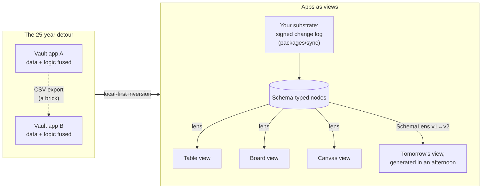
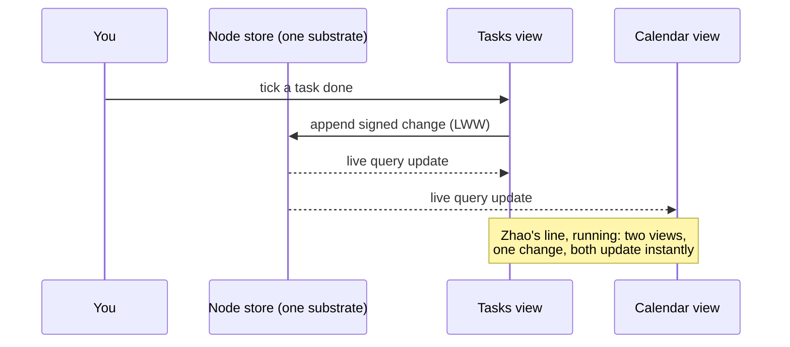

# Blog Post: Apps as Views Over User-Owned Data

> _"Apps become views."_ — Ruben Verborgh, 2017

## Problem Statement

The user wants **blog post #11** composed around a specific intellectual
lineage: the idea that **applications should be interchangeable views (lenses)
over a user-owned data substrate**, not vaults that couple your data to one
vendor's UI and hold both hostage. The seed material names the canon
explicitly:

- **Jacky Zhao, "Towards Data Neutrality"** (Reboot, Jul 2022) — "Apps in this
  new model are now just views on top of data," plus his **Rhizome** proposal
  (EAV tuples, UCAN, CRDTs).
- **Ruben Verborgh, "Paradigm shifts for the decentralized Web"** (Dec 2017) —
  "Apps become views… interchangeable views… over your personal data pod,"
  written from inside the Solid project.
- **Ink & Switch, "Local-first software"** (Kleppmann et al., 2019) — the
  seven ideals; the cloud holds secondary copies, you hold the primary.
- The slogan **"apps as views, not vaults"** from community-owned-data
  circles.

The challenge is that xNet's blog has _already grazed_ this idea once: essay
#10, **"The Workshop and the Walled Garden"**
([exploration 0267](0267_[x]_MODDABLE_SOFTWARE_AND_THE_APPLICATION_AS_A_VIEW_OVER_YOUR_DATA.md),
[site/src/pages/blog/the-workshop-and-the-walled-garden.astro](../../site/src/pages/blog/the-workshop-and-the-walled-garden.astro))
arrived at "the application is a view over your data" as the _precondition for
moddability_. This post must not re-tread that. The distinct job here is to
treat the inversion itself as the subject: where the idea comes from, **why
the data–app coupling happened in the first place** (it was not an accident),
why the pods-and-standards generation of the idea stalled, and what it takes
to actually ship it — with xNet as the working example rather than the pitch.

The failure mode to avoid: a link-roundup with reverence. The essay must add
an argument the sources don't already make.

## Executive Summary

- **The idea has a 50-year pedigree, not a 5-year one.** Unix made the file
  the unit of ownership and the program a view (`ed`, `vi`, and `cat` over the
  same bytes). The relational model (Codd, 1970) was explicitly a revolt
  against apps owning their data layout — "data independence" is
  apps-as-views stated in 1970s vocabulary. Desktop-era documents kept it:
  your `.doc` outlived WordPerfect. **The web application broke it** — for the
  first time, mainstream software's default was that the vendor holds the only
  copy and the only interface.
- **The coupling was not laziness; it is the business model.** A silo is a
  moat: switching costs and network effects are what venture-priced software
  is _for_ (see the earlier essays' surveillance-capitalism ground). But it is
  also genuine engineering convenience — a bespoke schema, one writer, no
  interop negotiation. An honest essay concedes both, then shows the price:
  every app rebuilds the same CRUD plumbing, users re-enter the same contacts
  five times, and when the app dies (Google Reader, Sunrise, countless
  others) the data's usefulness dies with it even when an export exists.
- **The pods generation proved the diagnosis and fumbled the mechanism.**
  Solid's decade of struggle localises the hard parts: (1) **the schema
  problem** — two apps agreeing on what a "task" is turns out to be the
  actual work, and RDF/SHACL negotiation pushed it onto app developers; (2)
  **sync and conflict** — pods were server-resident documents, so offline and
  multi-writer were bolted on; (3) **no killer substrate** — users won't run a
  pod for its own sake; the data layer has to arrive _inside_ software they
  already want. Local-first (CRDTs, sync as a separate layer) solved (2) and
  reframed (3); the schema problem remains the live frontier.
- **xNet's stack is a point-by-point answer, which is what makes the essay
  concrete.** One signed, hash-chained LWW change log
  ([packages/sync/src/change.ts](../../packages/sync/src/change.ts)) is the
  substrate; the protocol spec _normatively refuses_ to specify storage or
  rendering ([docs/specs/protocol/00-overview.md](../../docs/specs/protocol/00-overview.md):
  "It deliberately does **not** specify how an implementation stores, indexes,
  queries, or renders that data") — apps-as-views is written into the
  conformance boundary. The schema problem gets a working answer: published
  schemas plus **read-time lenses, overlays, and sidecars**
  ([packages/data/src/schema/lens.ts](../../packages/data/src/schema/lens.ts),
  [extension.ts](../../packages/data/src/schema/extension.ts),
  [sidecar.ts](../../packages/data/src/schema/sidecar.ts)) so two views can
  disagree about shape without forking the data. And the view layer is
  literally plural: table/board/calendar/gallery/list/timeline/form/canvas
  registered over the same nodes
  ([packages/views/src/builtins.ts](../../packages/views/src/builtins.ts),
  [registry.ts](../../packages/views/src/registry.ts)), with the CanvasView
  convergence (exploration 0277) demonstrating one view core rendered by two
  platform shells.
- **The AI-age argument is the essay's fresh contribution:** when generating
  a bespoke view costs an afternoon of prompting, views become _disposable_
  and data becomes the _heirloom_. The moat inverts — vendors can no longer
  charge rent on the lens, only on custody of the data; so custody must move
  to the user or the rent becomes pure hostage-taking. Essay #10 made the
  adjacent point about mods; this one makes it about **where value settles**.
- **Recommendation:** ship blog post #11 at
  `site/src/pages/blog/`, provisional title **"The Vault and the View"**,
  tags `['essay', 'philosophy', 'decentralization', 'protocol']`, authors
  `['crs48', 'claude']`, cold-opening on a dead app taking a living dataset
  with it, closing on the heirloom inversion.

## Current State In The Repository

### The blog machinery (post #11 slots in mechanically)

- [site/src/data/blog.ts](../../site/src/data/blog.ts) — single source of
  truth: `posts[]` metadata, `AUTHORS` (crs48 + Claude with vendored avatars,
  exploration 0269), `BlogTag` union, `seriesOrder()`/`seriesNeighbors()` for
  the front-to-back reading order. A new post = one `posts[]` entry + one
  hand-authored `.astro` page (no MDX/content collections).
- [site/src/pages/blog/the-workshop-and-the-walled-garden.astro](../../site/src/pages/blog/the-workshop-and-the-walled-garden.astro)
  — the freshest template for conventions: `Byline`, `Mermaid`, `CodeFigure`,
  `SeriesNav`, a bespoke hero component, `tok-*` syntax-highlighting helpers,
  `prose` article body. Post #11 follows the same grain with its own hero.
- RSS ([site/src/pages/blog/rss.xml.ts](../../site/src/pages/blog/rss.xml.ts))
  and the index page derive from `posts[]` — no extra wiring.
- Gotchas already learned (explorations 0239–0269): blog pages are `.astro`
  not MDX; avatars/heroes are vendored, never hotlinked (several essays
  promise "this page loads nothing third-party"); commit headers ≤72 chars;
  changelog fragment via `scripts/changelog/new.mjs` (don't hand-write a
  duplicate); site content needs no changeset (site is not a publishable
  package).

### The claim the essay makes, and the code that backs it

The essay's spine is "xNet is an existence proof, not a proposal." Each beat
maps to a seam:

- **One substrate.** [packages/sync/src/change.ts](../../packages/sync/src/change.ts)
  — Ed25519-signed, hash-chained, Lamport-ordered LWW change log; the golden-
  vector protocol spec ([docs/specs/protocol/](../../docs/specs/protocol/))
  makes the data format the contract and explicitly leaves storage/rendering
  to implementations. The data outlives any app that renders it.
- **Many views, one store.** [packages/views/src/](../../packages/views/src/)
  registers table, board, calendar, gallery, list, timeline, form, and canvas
  views over the same schema-typed nodes; `ViewRenderer.tsx` +
  `registry.ts` make "which lens" a runtime choice. App-level surfaces —
  [apps/web/src/components/DataWorkspaceView.tsx](../../apps/web/src/components/DataWorkspaceView.tsx),
  `TasksView.tsx`, the CRM pack ([packages/crm/](../../packages/crm/)), the
  ledger ([packages/ledger/](../../packages/ledger/)) — are all consumers of
  the same node store via
  [packages/react/src/hooks/useQuery.ts](../../packages/react/src/hooks/useQuery.ts).
  Zhao's "any change to the underlying data will instantly update both apps"
  is literally `useQuery`'s live subscription semantics.
- **Cross-platform proof.** Exploration 0277 / PR #403 converged the web and
  desktop CanvasViews on one shared core
  ([packages/views/src/canvas-view/](../../packages/views/src/canvas-view/)) —
  the "app" shrank to a thin platform shell around a shared view over shared
  data. That's the thesis enacted at the code-review level.
- **The schema problem, answered in mechanism.**
  [packages/data/src/schema/lens.ts](../../packages/data/src/schema/lens.ts)
  (bidirectional read-time version lenses), `extension.ts` (on-record `ext:`
  overlays), `sidecar.ts` (private sidecar attributes) — users and plugins
  extend or reinterpret shape without forking the data or begging a vendor.
- **Views are scoped, not trusted.**
  [packages/plugins/src/feature-module.ts](../../packages/plugins/src/feature-module.ts)
  capability manifests + `guardStore`/`guardedFetch` — a view sees the slice
  it declares. (Essay #10's territory; #11 references it in one paragraph
  rather than re-arguing it.)
- **Leaving is a feature.** The Right-to-Leave work (exploration 0234,
  [the-right-to-say-no](../../site/src/pages/blog/the-right-to-say-no.astro))
  and the portable protocol give the essay its receipts when it claims the
  vault door is open.

### Overlap audit against the existing series

| Existing essay                      | Its claim                                    | #11's distinct claim                                                                          |
| ----------------------------------- | -------------------------------------------- | --------------------------------------------------------------------------------------------- |
| #10 Workshop/Walled Garden          | Views-over-data enables safe **moddability** | The **data–app decoupling itself**: lineage, economics, why pods stalled, where value settles |
| #9 Hand on the Tiller               | Steering/cybernetics                         | —                                                                                             |
| #7 The Loom You Can Read            | How the substrate works internally           | #11 cites it instead of re-explaining the log                                                 |
| #5/#6 economics/permaculture essays | Extraction vs regeneration framing           | #11 reuses the moat framing in one paragraph, credits it                                      |

The seam is clean: #10 was "what you can build **on top** once apps are
views"; #11 is "why apps should be views **at all**, who said so first, and
why it hasn't happened yet."

## External Research

All quotes below were verified verbatim against live fetches of the sources
(fact-check discipline from exploration 0247). One attribution in the prompt
was corrected: the "two apps… instantly update both" line is from Zhao's
**Rhizome Proposal**, not the Reboot essay.

### The canon (verified, with exact quotes)

- **Ruben Verborgh, "Paradigm shifts for the decentralized Web" (20 Dec 2017)** — <https://ruben.verborgh.org/blog/2017/12/20/paradigm-shifts-for-the-decentralized-web/>.
  Three shifts: end users become data controllers; **apps become views**;
  **interfaces become queries**. Exact: _"Applications as interchangeable
  views, wherein each Web app provides consistent visualizations,
  interactions, and processing over your personal data pod."_ · _"Applications
  ask rather than store, and they are able to reuse data created by other
  apps, avoiding vendor lock-in."_ · _"Decentralization is about choice: we
  will choose where we store our data, who we give access to which parts of
  that data, which services we want on it, and how we pay for those."_ ·
  Concedes: _"The main challenge with full decentralization of data is
  scalability"_ and _"Not everything is going to be 'free'"_ (unbundling
  breaks the ad subsidy). Likely the earliest crisp statement of the thesis
  in this lineage — five years before Zhao.
- **Jacky Zhao, "Towards Data Neutrality" (Reboot, 14 Jul 2022)** —
  <https://jzhao.xyz/posts/towards-data-neutrality/> (canonical mirror;
  Reboot original at <https://joinreboot.org/p/rhizome>). Exact: _"Apps in
  this new model are now just views on top of data rather than a tight
  coupling of data and logic."_ · _"Apps and platforms in this model follow
  the Unix philosophy: expect the output of every program to become the input
  to another, as yet unknown, program."_ · _"The competitive advantage of the
  vast majority of today's centralized platforms are in their data moats and
  network effects."_ · His "Decentralization is about **agency**…" line
  deliberately remixes Verborgh's "choice" line — the lineage is
  self-acknowledged. Quotes Moxie: "People do not want to run their own
  servers."
- **Jacky Zhao, Rhizome Proposal** —
  <https://jzhao.xyz/thoughts/Rhizome-Proposal>. The mechanism sketch behind
  the essay: **Root** (personal data pod) + **Trunk** (P2P app framework);
  fully-replicated **EAV tuple store**, **DIDs + UCANs**, **BFT CRDTs**,
  always-on "cloud peer" (_"not a hosting provider… a different type of a
  personal device"_). Exact: _"If two apps are views on the same data, any
  change to the underlying data will instantly update both apps"_ ·
  _"Companies of the future should derive value from the intelligence they
  provide on top of existing data rather than have the value be just the
  data."_ Strikingly close to xNet's actual choices (typed nodes /
  capability manifests / signed LWW log + hub as "just another peer") —
  worth a convergence nod in the essay.
- **Ink & Switch, "Local-first software: You own your data, in spite of the
  cloud" (Kleppmann, Wiggins, van Hardenberg, McGranaghan, 2019)** —
  <https://www.inkandswitch.com/essay/local-first/> (note: the bare
  `/local-first/` URL serves empty — link the `/essay/` path). Seven ideals,
  headings verbatim: no spinners; your work is not trapped on one device; the
  network is optional; seamless collaboration; the Long Now; security and
  privacy by default; you retain ultimate ownership and control. Exact: _"If
  the service shuts down, even though you might be able to export your data,
  without the servers there is normally no way for you to continue running
  your own copy of that software."_ (the cold-open's thesis, in the canon) ·
  the "There is no cloud, it's just someone else's computer" bumper sticker.
  Caveat for the essay: local-first is **ownership-first, not view-first** —
  data is still typically per-app CRDT documents; it doesn't solve cross-app
  schema sharing. That gap is precisely where xNet's contribution sits.
- **"Apps as Views, Not Vaults"** — **confirmed** as Guido X Jansen's named
  series on gui.do (AT Protocol explainers, 2026; his project **Barazo** is
  the application — community forums where members own their data). Exact:
  _"Part of 'Apps as Views, Not Vaults': the things you make are yours; apps
  are just the viewers."_ Credit Jansen by name, not "circulating phrase."

### The critique file (what the essay must answer, not dodge)

- **The schema problem is the whole problem.** Two apps sharing data must
  agree on _meaning_, not just storage. Leigh Dodds, "Confused by SOLID"
  (Mar 2024): Solid has _"no built in understanding of any specific schemas
  or formats. Or recommended ways to structure data"_ — and _"It still all
  feels very much like an idea trying to find a solution."_ SolidLab's own
  **"What's in a Pod?"** (Verborgh et al.) concedes current Solid apps fail
  at API-independent data reuse because each app encodes _implicit layout
  knowledge_; their proposed fix (pod as knowledge graph + per-app
  materialized views) admits "apps read the same files" doesn't work. Every
  real answer reintroduces a coordinating authority — AT Protocol lexicons
  put the schema back in the app developer's hands; Rhizome's EAV triples
  defer semantics rather than solve them. xNet's position: published,
  versioned schemas + read-time lenses/overlays/sidecars — **make
  disagreement cheap** rather than mandate agreement.
- **Apps and their data models co-evolve.** The best products iterate schema
  and UI together; freezing the data model to share it can slow the product
  (Moxie's "protocols move slower than platforms"). Tight coupling isn't
  only rent-seeking — the essay must concede it's often what makes an app
  good, then answer with lenses (schema evolution without lockstep).
- **The shadow-database problem.** Pods with no query engine force every app
  to build its own indexes — functionally app-owned data again (Dodds; AT
  Protocol's app-view indexers embrace this openly). xNet's answer: the
  query layer is part of the substrate
  ([packages/query/](../../packages/query/), `useQuery`), not each view's
  problem — and the perf sagas (0249→0266) are the honest bill for that.
- **Nobody wants to run a server.** Moxie's point, conceded by Zhao and only
  partially answered by "cloud peers"/managed pods. xNet's stance: hub as
  optional relay, local replica primary.
- **The performance objection.** Purpose-built silos optimise for one access
  pattern; generic substrates historically felt slow — WinFS and the
  semantic desktop died partly of this. Repo receipt for the rebuttal: the
  cold-open-stall and query-perf explorations are the multi-month cost of
  making a generic node store feel app-fast. One candid paragraph buys
  enormous credibility.
- **Recentralization one layer up.** Gordon Brander, "Redecentralization":
  _"If you decentralize, the system will recentralize, but one layer up."_
  Power reappears at the index/aggregator/AI layer (Bluesky's relay, pod
  hosts). The essay should name this and scope its claim. (Note: no Brander
  piece titled "the data pod problem" was found — don't cite that phrase.
  His Noosphere/Subconscious has since wound down — itself a data point.)
- **Granular sharing is a footgun.** Users mis-scope permissions over raw
  data they don't understand (Dodds); per-field consent UX is unsolved. #11
  hands this to #10's capability-manifest-as-consent-form in a sentence.
- **The utility gap.** A pod with no built-in value is a worse Dropbox
  (Dodds). Local-first inverted the adoption order: ship software people
  want, with the substrate as its foundation. xNet matches.

### Adjacent prior art worth one line each in the essay

- **Codd's data independence (1970)** — apps-as-views in relational-era
  vocabulary; `VIEW` is even the SQL keyword.
- **Unix files and pipes** — programs are ephemeral, files are the durable
  substrate; explicitly invoked by Zhao.
- **HyperCard (1987) / Apple OpenDoc (1990s)** — user-owned stacks;
  document-centric compound documents with apps as component "parts" —
  killed 1997; app-centric economics beat document-centric architecture.
- **WinFS (cancelled 2006) / Semantic Desktop, NEPOMUK (2000s)** — the
  graveyard proving the idea is old and the mechanism is hard (schema
  coordination + performance).
- **remoteStorage / unhosted / 0data.app** — the 2010s "your app, my data"
  protocol lineage, pre-Solid.
- **Obsidian / Steph Ango's "File over app"** — the contemporary
  consumer-legible version.
- **AT Protocol lexicons, Anytype, Solid** — the current cohort: federated
  schemas + app-view indexers; local-first objects/relations; pods.

## Key Findings

1. **The essay's fresh argument is the value-settlement inversion.** All the
   sources argue users _should_ own data; none of them had 2026's fact: AI
   makes views nearly free to produce. When the lens costs an afternoon, the
   only durable asset is the substrate — so the industry's moat logic
   _itself_ now points at user-owned data (a vendor whose only moat is
   custody of your data is visibly a hostage-taker, and hostage economics
   invite exit). That gives #11 a thesis beyond synthesis.
2. **The lineage framing keeps it from being a link roundup.** 1970 (Codd) →
   Unix → desktop documents → the web-app anomaly → Solid's diagnosis →
   local-first's mechanism → xNet's implementation. The web-app era becomes a
   ~25-year detour, not the natural order — historically true and
   rhetorically strong.
3. **Concessions are load-bearing.** The three honest costs (schema
   agreement is social; generic stores need serious perf work — cite our own
   0249→0266 saga; views still need scoping) are exactly what the earlier
   essays' readers will probe. Conceding them with receipts is the
   differentiator from advocacy blogging.
4. **Every quotable claim has a repo receipt** (see Current State) — same
   discipline as the fact-checked essays (exploration 0247, en-GB prose).
5. **Series continuity:** #11 should cite #7 (how the log works) and #10
   (capability scoping) rather than re-explaining, and inherit the "nothing
   third-party on this page" promise.

## Options And Tradeoffs

### Framing options for the essay

| Option                                                   | Shape                                                 | Pros                                               | Cons                                                                              |
| -------------------------------------------------------- | ----------------------------------------------------- | -------------------------------------------------- | --------------------------------------------------------------------------------- |
| **A. Intellectual-lineage essay** ("the 25-year detour") | History → diagnosis → mechanism → xNet → AI inversion | Distinct from #10; deep; flatters sources honestly | Risk of book-report tone if quotes dominate                                       |
| B. Polemic on data moats                                 | Economics-first attack on silos                       | Punchy                                             | Overlaps #5 (Leveragism) and the surveillance framing of #4/#6; thin on mechanism |
| C. Product-explainer ("how xNet does views")             | Architecture tour                                     | Concrete                                           | Reads as marketing; #7 already toured internals                                   |
| D. Pure AI-angle ("views are disposable now")            | Lead with the 2026 inversion                          | Freshest claim                                     | Loses the commissioned brief (the sources) to a hook                              |

**A, with D as the closing movement**, honours the brief (the sources ARE the
story) while contributing a new argument. B's moat point becomes one section
inside A; C's architecture becomes the receipts, not the subject.

### Title options

| Title                           | Notes                                                                                                   |
| ------------------------------- | ------------------------------------------------------------------------------------------------------- |
| **"The Vault and the View"** ✅ | Series-consistent metaphor pair (cf. Workshop/Walled Garden, Forest/Field); credits "views, not vaults" |
| "Apps Are Views, Not Vaults"    | Punchier but borrows the slogan wholesale as a headline                                                 |
| "The Twenty-Five-Year Detour"   | Strong but opaque on the index card                                                                     |
| "Many Windows, One House"       | Gentler; weaker link to the sources' language                                                           |

### Cold-open options

1. **A dead app, a living dataset** ✅ — Sunrise Calendar / Google Reader /
   Wunderlist-style shutdown: the export `.zip` that is technically your data
   and practically a brick, because the data was shaped for exactly one view
   that no longer exists. Concrete, universal, sets up "the vault kept the
   key."
2. The five-copies-of-your-contacts opener — relatable but smaller stakes.
3. Open on Codd 1970 — intellectually satisfying, colder emotionally.

## Recommendation

Write **blog post #11, "The Vault and the View"** (framing A+D):

1. **Cold open:** an app dies; the export is a brick. The data was never
   yours in the way that mattered — the _shape_ belonged to the vault.
2. **The detour:** Codd's data independence → Unix files → desktop documents
   → the web app as the anomaly that fused data to interface. The fusion was
   a business model (moat) _and_ an engineering convenience — concede both.
3. **The diagnosis generation:** Verborgh's "apps become views" (quote),
   Solid's pods; why the vision was right and the mechanism stalled (schema
   negotiation tax, server-resident documents, pod-first adoption).
4. **The mechanism generation:** Ink & Switch's seven ideals; sync as a
   separate layer; Zhao's data neutrality + Rhizome (quote the two-apps-one-
   data line, correctly attributed to the Rhizome Proposal); AT Protocol and
   Jansen's "Apps as Views, Not Vaults" (2026) as the idea reaching social
   scale — with the honest note that lexicons and app-view indexers
   reintroduce coupling one layer up.
5. **The implementation:** xNet as existence proof — the spec that refuses
   to specify rendering; eight registered views over one node store; lenses/
   overlays/sidecars as the schema-problem answer; one paragraph of honest
   cost (our own perf saga); one sentence handing capability-scoping to #10.
6. **The inversion (close):** AI makes views disposable; data becomes the
   heirloom; the moat argument now runs in the user's favour. End on the
   image: vaults hold things _in_; views let you look — the house is yours,
   ask for more windows.

Mechanics: `.astro` page + `posts[]` entry, tags
`['essay', 'philosophy', 'decentralization', 'protocol']`, authors
`['crs48', 'claude']`, bespoke hero, ~13–15 min read, en-GB, Mermaid diagram
of substrate→views, `CodeFigure` showing a `SchemaLens` (the two-views-
disagree-peacefully exhibit), changelog fragment via `scripts/changelog/new.mjs`.





## Example Code

The essay's central exhibit — two views disagreeing about shape without
forking the data (real API from
[packages/data/src/schema/lens.ts](../../packages/data/src/schema/lens.ts)):

```typescript
// A lens is a treaty between two views of the same nodes.
const taskV1toV2: SchemaLens = {
  source: 'xnet://xnet.fyi/Task@1.0.0',
  target: 'xnet://xnet.fyi/Task@2.0.0',
  forward: (data) => ({
    ...data,
    status: data.complete ? 'done' : 'todo'
  }),
  backward: (data) => ({
    ...data,
    complete: data.status === 'done'
  }),
  lossless: false
}
// The old app keeps reading v1. The new app reads v2.
// Nobody migrates anybody. Nobody asks a vendor.
```

## Risks And Open Questions

- **Overlap discipline with #10.** Both essays end on views-over-data. #11
  must link #10 for moddability/scoping and never re-argue it. Mitigation:
  the overlap-audit table above is the outline's contract.
- **Quote accuracy — largely retired.** All quotes in External Research were
  verified verbatim against live fetches during this exploration; one
  misattribution in the brief was caught (the "two apps… instantly update"
  line is Rhizome, not the Reboot essay). Re-check only if the draft
  paraphrases beyond the verified excerpts. Two link gotchas: Ink & Switch
  is `/essay/local-first/` (bare `/local-first/` serves empty); no Brander
  piece called "the data pod problem" exists — don't cite that phrase.
- **Solid critique fairness.** Verborgh still works on Solid, and the
  sharpest critique of pod-interop ("What's in a Pod?") is _his own team's_
  paper — cite it as self-aware course-correction, not failure. Tone:
  gratitude for expensive lessons.
- **Does the AI-inversion close overclaim?** Vendors retain moats beyond
  data custody (distribution, brand, compliance). Scope the claim to: custody
  stops being a _defensible_ moat and starts being a visible hostage fee.
- Open question: include the Rhizome→xNet convergence table (EAV/UCAN/CRDT vs
  nodes/capabilities/LWW)? Nice depth, but risks inside-baseball; decide at
  draft time based on length.

## Implementation Checklist

- [x] Use only the verbatim-verified quotes from External Research (already
      checked against live sources; Rhizome vs Reboot attribution fixed);
      link Ink & Switch as `/essay/local-first/`.
- [x] Write `site/src/pages/blog/the-vault-and-the-view.astro` following the
      #10 conventions (Byline, SeriesNav, Mermaid, CodeFigure, bespoke hero,
      `tok-*` helpers, en-GB, nothing third-party).
- [x] Add the `posts[]` entry in `site/src/data/blog.ts` (slug
      `the-vault-and-the-view`, tags
      `['essay','philosophy','decentralization','protocol']`, authors
      `['crs48','claude']`, honest `readingMinutes`).
- [x] Bespoke hero component under `site/src/components/blog/` (vendored
      assets only).
- [x] Cross-link: #7 (the loom / internals), #10 (workshop / scoping), the
      protocol spec, and the four external sources with full attribution.
- [x] SchemaLens `CodeFigure` uses the real API shape from
      `packages/data/src/schema/lens.ts` (no invented fields).
- [x] Changelog fragment via `scripts/changelog/new.mjs` (do not hand-write).
- [x] Conventional commit(s), header ≤72 chars; no changeset needed (site
      only) — but run the Stop-hook check anyway.
- [x] PR to `main`; merge-commit per repo policy.

## Validation Checklist

- [x] `pnpm --filter site build` (or the site's build task) passes; the post
      renders with hero, byline, diagrams, and code figure.
- [x] Post appears on `/blog` index and in `rss.xml` with correct metadata;
      `seriesNeighbors` links #10 ↔ #11 correctly.
- [x] Every factual claim has a source link or a repo path; quotes match the
      live originals verbatim (0247 discipline).
- [x] No third-party requests on the page (network tab clean).
- [x] Overlap check: a reader of #10 finds new argument in every section of
      #11 (the lineage, the Solid post-mortem, the value-settlement close).
- [x] Lighthouse/da­rk-mode/mobile spot-check matches the rest of the series.

## References

- Ruben Verborgh, _Paradigm shifts for the decentralized Web_ (2017) —
  <https://ruben.verborgh.org/blog/2017/12/20/paradigm-shifts-for-the-decentralized-web/>
- Jacky Zhao, _Towards Data Neutrality_ (Reboot, 2022) —
  <https://jzhao.xyz/posts/towards-data-neutrality/> (Reboot original:
  <https://joinreboot.org/p/rhizome>)
- Jacky Zhao, _Rhizome Proposal_ —
  <https://jzhao.xyz/thoughts/Rhizome-Proposal>
- Ink & Switch, _Local-first software_ (2019) —
  <https://www.inkandswitch.com/essay/local-first/>
- Leigh Dodds, _Confused by SOLID_ (2024) —
  <https://blog.ldodds.com/2024/03/12/baffled-by-solid/>
- SolidLab Research, _What's in a Pod?_ —
  <https://solidlabresearch.github.io/WhatsInAPod/>
- Gordon Brander, _Redecentralization_ —
  <https://newsletter.squishy.computer/p/redecentralization>
- Moxie Marlinspike, _My first impressions of web3_ (2022)
- Guido X Jansen, _Apps as Views, Not Vaults_ series (gui.do, 2026; Barazo)
- E. F. Codd, _A Relational Model of Data for Large Shared Data Banks_ (1970)
- Steph Ango, _File over app_ — <https://stephango.com/file-over-app>
- Repo: exploration 0267 (+ blog #10), `docs/specs/protocol/`,
  `packages/sync/src/change.ts`, `packages/views/src/`,
  `packages/data/src/schema/{lens,extension,sidecar}.ts`,
  `packages/react/src/hooks/useQuery.ts`,
  `packages/plugins/src/feature-module.ts`, `site/src/data/blog.ts`
