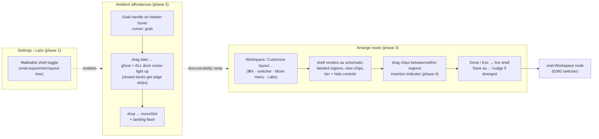
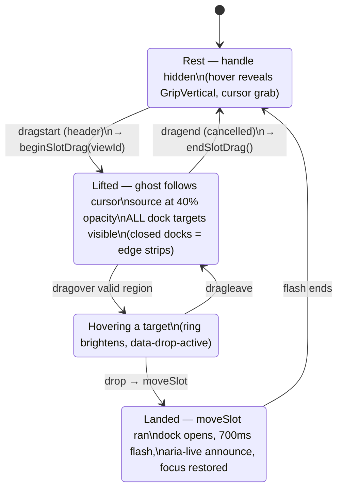

# Workspace Editing Affordances And The Labs Toggle

## Problem Statement

0280 shipped a genuinely malleable shell — movable slot views, saveable
workspace nodes, three presets — and almost nobody can find it. Three
distinct discoverability failures stack up:

1. **The renderer is gated behind a localStorage incantation.**
   `xnet:experiment:layout-tree` has no UI; enabling the malleable shell
   means opening devtools and typing `localStorage.setItem(...)`. The two
   older shell flags (`xnet:experiment:quiet-default`,
   `xnet:experiment:desk-radial`) have the same problem. We deliberately do
   NOT want to flip the default yet — but "experimental" must mean "one
   honest toggle away", not "read the source".
2. **The editing affordances are invisible even when enabled.** The only
   always-visible hint is a 13px ⇄ icon in a panel header. Panel headers
   are draggable, but nothing announces it: no grab handle, no cursor
   change, no lift/ghost styling, no highlighted drop zones, no insertion
   indicator, no post-drop confirmation. Every affordance-signal pattern
   the industry converged on is missing.
3. **Drops only land where a dock is already open.** The drop targets in
   `ShellFrame` wrap the _rendered_ dock bodies — a closed or empty dock is
   not a target at all, so "pop this panel out and slot it in over there"
   silently no-ops on most of the viewport. There is also no way to
   reorder views _within_ a dock from the UI, and the corner dock's Move
   popover intermittently swallows its own click (Radix dismissal race,
   observed during 0280 validation).

The ask: a proper settings toggle for the experiment, and first-class
pop-out / slot-in affordances so arranging the workspace feels like a
feature instead of a secret.

## Executive Summary

Three moves, each independently landable:

1. **A Labs section in Settings** backed by a tiny flag registry
   (`apps/web/src/lib/labs.ts`) that unifies the three existing
   `xnet:experiment:*` localStorage keys into declarative entries
   (label, description, stage, reload semantics). Named **Labs** — the
   habit-tracking feature already owns the word "Experiments"
   (`/experiments`, `ExperimentsView`). The malleable-shell toggle is the
   flagship entry, with honest staging copy.
2. **Always-on affordance upgrades** to the existing drag machinery, in
   the exact visual language the research consensus prescribes: a grab
   handle that appears on header hover with `cursor: grab`; a window-level
   drag lifecycle so that _while any slot drag is in flight_ all four dock
   regions materialize as highlighted drop zones (closed docks get portal
   edge strips — this fixes the biggest mechanical gap); drag ghost at
   reduced opacity; a brief post-drop flash on the landing dock; and the
   Move menu rebuilt on `DropdownMenu` so its clicks stop racing the
   popover dismissal.
3. **An explicit "Arrange" mode** — the iOS-jiggle/Home-Assistant pattern,
   tuned to xNet's calm aesthetic (outlines and handles, no wiggle). One
   verb (`Workspace: Customize layout…`, in ⌘K, the workspace switcher,
   and every Move menu) swaps the shell for a schematic of itself: all
   regions rendered as labeled, outlined slots; every view a draggable
   chip with visible handle, tier control and hide button; insertion
   lines for reordering (the `order` field exists; the UI doesn't);
   Esc/Done walks out, and a "Save as…" nudge appears if the tree diverged
   from its preset. Arrange mode is where coarse rearrangement becomes
   _teachable_ — the affordances don't have to whisper because the user
   explicitly asked to see them.

No new dependencies: the shell already has a working HTML5 DnD idiom
(TabBar's drop-edge indicator, `@xnetjs/ui`'s transfer helpers), the menu
fallback required for accessibility/touch already exists (`slot.move:*`
commands + Move menu), and desktop-first HTML5 DnD is adequate for this
iteration. Adopting a pointer-event library (dnd-kit /
pragmatic-drag-and-drop) is deliberately deferred until arrange mode goes
touch-first.

## Current State In The Repository

### Flags with no front door

| Flag                            | Defined in                                       | UI today |
| ------------------------------- | ------------------------------------------------ | -------- |
| `xnet:experiment:layout-tree`   | `apps/web/src/workbench/experiments.ts`          | none     |
| `xnet:experiment:quiet-default` | `apps/web/src/lib/desk.ts` (`QUIET_DEFAULT_KEY`) | none     |
| `xnet:experiment:desk-radial`   | `apps/web/src/lib/desk.ts` (`DESK_RADIAL_KEY`)   | none     |

`apps/web/src/routes/settings.tsx` has twelve sections (`SECTIONS`,
~line 104) — none is a Labs/flags surface. Naming constraint: the
`/experiments` route and `apps/web/src/components/experiments/*` are the
habit-tracker (metrics/observations), so the settings section must not be
called "Experiments".

### The editing machinery that exists (0280)

- `apps/web/src/workbench/slot-registry.tsx` — component-free registry;
  every view registers `slot.move:<id>:<region>` / `slot.open` /
  `slot.hide` / `slot.show` palette commands (the keyboard road is done).
- `apps/web/src/workbench/PanelViewHost.tsx` — `SLOT_DRAG_TYPE` MIME,
  `draggable` header (no handle icon, no cursor styling, no drag image),
  `MoveViewMenu` (⇄ button → Radix Popover; the popover's item clicks
  intermittently lose the race against outside-dismissal — seen live
  during 0280 validation).
- `apps/web/src/workbench/ShellFrame.tsx` — `dropProps(region)` adds
  `onDragOver`/`onDrop` to _open_ dock bodies only; no `dragenter`
  highlight state, no indicator when a drop is viable, closed docks are
  untargetable.
- `apps/web/src/workbench/TabBar.tsx` — the in-house gold standard:
  per-edge `dropEdge` state renders a 2px insertion indicator
  (`TabDropIndicator`), exactly the pattern the docks lack.
- `packages/plugins/src/workspace/layout-tree.ts` — `SlotPlacement.order`
  is modeled and renumbered on every move, but no UI mutates order
  directly (`moveSlot` always appends).
- Tier changes (`pinned`/`summoned`/`hidden`) are palette-only.
- `apps/web/src/workbench/calm/QuietChrome.tsx` overlays and
  `SurfaceDock.tsx` strip items are not drag sources at all.
- Coachmarks (0206, `contributeTips`) and the disclosure ladder (0273)
  are available carriers for first-run hints.

### The three roads today, honestly graded

| Road                   | State                                                        |
| ---------------------- | ------------------------------------------------------------ |
| Keyboard (⌘K commands) | Complete — every verb exists                                 |
| Pointer (menus)        | Present but subtle (13px ⇄), and flaky in the corner card    |
| Pointer (drag)         | Technically present, perceptually absent, drops mostly no-op |
| Touch                  | Menu only (HTML5 DnD does not fire on most mobile browsers)  |

## External Research

Distilled from a 25-product sweep (IDEs, docking frameworks, dashboards,
experimental-toggle surfaces, DnD libraries); full citations in
References.

**The recurring affordance patterns** (near-universal consensus):

1. **Grab handle on hover** + `cursor: grab` — Notion's six-dot handle,
   Obsidian gutters. Signals draggability without permanent clutter.
2. **Lift/ghost on drag start** — original dims to ~40% opacity, preview
   carries a shadow (Atlassian spec; Trello's signature 4° tilt).
3. **Highlighted drop zones on every valid target, for the whole drag** —
   Photoshop's blue glow, Visual Studio's shaded preview, Home
   Assistant's color-coded regions. The critical property: _all_ valid
   targets light up when the drag starts, not just the one under the
   cursor — which is precisely what fixes our closed-dock problem.
4. **Insertion indicator** — 2px selected-color line with terminal dots
   (Atlassian pragmatic-drag-and-drop spec) for ordered placement.
5. **Explicit edit mode for coarse rearrangement** — iOS jiggle mode,
   Home Assistant/Grafana dashboard edit: chosen exactly when
   rearranging is a _secondary_ task, with a clear entry verb and a Done
   commit. Always-on handles (Notion/Trello) are chosen when drag is the
   primary interaction. A workspace shell is squarely the former.
6. **Keyboard/menu fallback with live-region announcements** — Atlassian
   a11y guidance: handle button opens a move menu (no arrow-key drag);
   announce "X moved to Y from Z"; restore focus afterwards. VS Code's
   `View: Move View` is the same idea. We already have this road.
7. **Magnetic snap + post-drop flash** — ~350ms background ease while
   hovering, ~700ms flash on the landed item; respect
   `prefers-reduced-motion`.
8. **Docking compass/diamond** (Visual Studio) — powerful for arbitrary
   2D splits; overkill for our fixed four-dock skeleton. Rejected.

**Experimental-toggle framing**: Gmail Labs / Obsidian core plugins /
Slack beta all converge on plain toggles grouped in Settings with honest
per-feature descriptions; auto-apply where possible; no scary iconography
(Discord's console-only experiments are the anti-pattern for us — that's
where we are today). Chrome's `chrome://flags` shows what "discoverable
only by the initiated" looks like — also today's state.

**HTML5 DnD vs pointer libraries**: native DnD is mouse-spec'd — no
touch events on most mobile browsers (only recent iOS 15+/Chrome 96+
partially), poor drag-image control, no styling of previews. Libraries
(dnd-kit, Atlassian pragmatic-drag-and-drop) fix this with pointer
events + full a11y kits. Our shell is desktop-first, has a complete menu
fallback for touch, and already owns a working HTML5 idiom (TabBar) —
so the library adoption is real but not this iteration's blocker.

## Key Findings

1. **We built the verbs, not the visibility.** Every mutation exists as a
   command; what's missing is 100% presentation: handles, highlights,
   indicators, and a front door for the flag. This is styling + one state
   machine, not new architecture.
2. **The closed-dock gap is the one _mechanical_ bug.** Everything else is
   perception; "drops silently no-op unless the target dock happens to be
   open" breaks the core promise. The fix falls straight out of research
   pattern 3: a drag-lifecycle state that materializes all four dock
   targets for the duration of any slot drag.
3. **Arrange mode fits xNet's disclosure grammar.** 0273/0280 established
   the ladder (L0 bare → summoned → pinned → arranged/saved). An explicit
   "Customize layout" rung is the same philosophy: density on request,
   never imposed. It also matches the research decision rule — layout
   editing is a secondary task, which is exactly when products choose an
   explicit mode over always-on handles.
4. **A Labs registry is nearly free and pays compound interest.** Three
   flags already exist with three ad-hoc readers; the next experiment is
   inevitable. One declarative list renders the settings section, and the
   devtools seed/e2e can enumerate it.
5. **TabBar already solved insertion indicators in-house.** Reordering
   within a dock is `TabDropIndicator` + an `insertSlot(viewId, region,
index)` tree op away — the `order` field is modeled and tested.
6. **The Move menu flake is a real bug** independent of discoverability:
   Radix `Popover` content clicks race outside-dismissal when the trigger
   sits inside a hover-expanded strip. `DropdownMenu` (`onSelect` fires
   before close) is the sturdier primitive.

## Options And Tradeoffs

### A. Where the experiment toggle lives

- **A1 — Labs section in Settings (recommended).** New `SECTIONS` entry
  (FlaskConical icon) rendering from a flag registry; the Gmail-Labs /
  Obsidian pattern. Pros: honest, discoverable, scales to future flags.
  Cons: one more settings section (mitigated: it only renders when the
  registry is non-empty).
- **A2 — Bury it in devtools.** Keeps Settings pristine; keeps the
  feature undiscoverable — fails the brief.
- **A3 — Flip the default now.** Explicitly out of scope per the brief;
  parity isn't proven (0280 risk 1).

### B. Affordance model for editing

- **B1 — Always-on handles everywhere (Notion model).** Maximal
  discoverability, but permanent chrome noise contradicts the calm/quiet
  doctrine, and drag is a secondary task here — the research decision
  rule points away from this.
- **B2 — Explicit Arrange mode only (iOS model).** Clean at rest,
  teachable when entered; but direct header-drag (which already works)
  would stay undiscoverable and the closed-dock bug would still bite
  outside the mode.
- **B3 — Both, layered (recommended).** Fix the mechanics and add quiet
  always-on signals (hover handle, cursor, drag-time drop zones,
  post-drop flash) so direct manipulation works and is _noticeable_; add
  Arrange mode as the guided, exploratory surface where everything is
  visible at once. This is exactly VS Code's layering: drag works
  ambiently, `View: Move View` and the customize submenu exist for
  deliberate edits.

### C. Drag technology

- **C1 — Keep native HTML5 DnD + in-house idiom (recommended now).**
  Zero dependencies; consistent with TabBar/canvas ingestion; desktop
  complete. Touch stays on the menu road (which Atlassian recommends
  keeping as the a11y road regardless).
- **C2 — Adopt `pragmatic-drag-and-drop` or `dnd-kit`.** Buys touch drag,
  custom previews, a11y kit — at the cost of a new dependency and a
  rewrite of working code. Right move _if/when_ arrange mode needs
  touch-native drag; the arrange-mode chip UI should be built so its drag
  layer is swappable.
- **C3 — Docking framework (dockview et al.).** Re-rejected (0273 D,
  0280 C): our skeleton is intentionally fixed; frameworks bring their
  own layout model.

## Recommendation

Ship **B3 + A1 + C1** in four phases.

### The customize loop



### Phase 1 — Labs settings section

`apps/web/src/lib/labs.ts`: a declarative registry unifying the existing
keys (the flag _definitions_ stay where they are; the registry references
them):

- `{ key, label, description, stage: 'experimental' | 'preview', appliesOn: 'reload' | 'immediate', learnMoreTip? }`
- Entries: malleable shell (`LAYOUT_TREE_KEY`, reload), quiet default for
  new identities (`QUIET_DEFAULT_KEY`), Desk radial menu
  (`DESK_RADIAL_KEY`).
- Settings gains a **Labs** section (FlaskConical icon) rendering
  `SettingToggle` rows from the registry, with a short preamble
  ("Early features. They may change or go away.") and a "Reload to
  apply" inline chip when a reload-scoped flag changes — the Obsidian
  core-plugins feel, not the Discord console feel.
- The malleable-shell row cross-links: when ON, show a "Customize
  layout…" button (runs the arrange-mode command); the Appearance
  Layout row gets one sentence pointing at Labs when the flag is off.

### Phase 2 — Ambient affordances (mechanics + signals)

All in the existing HTML5 idiom:

- **Slot-drag lifecycle store**: a tiny module-level pub/sub
  (`beginSlotDrag(viewId)` / `endSlotDrag()`; window `dragend`+`drop`
  listeners as the safety net) — mirrors `setNodeTransfer`'s role for
  node drags. React hook `useSlotDragActive()`.
- **Drop zones everywhere while dragging**: `ShellFrame` (and the legacy
  `DesktopWorkbench` panels, which share `PanelViewHost`) render, during
  an active slot drag: highlight ring on open dock bodies
  (`data-drop-active` + accent border token), and **portal edge strips**
  (~48px, labeled "Left dock" etc.) over the four edges for docks that
  are closed or empty — research pattern 3. Drop = same
  `moveSlot`; the dock opens to show the landing (then the post-drop
  flash, ~700ms, `motion-safe:` only).
- **Grab handle**: `GripVertical` fades in on panel-header hover next to
  the title, `cursor-grab active:cursor-grabbing`; `setDragImage` uses
  the header element so the ghost looks like the thing being moved;
  source header drops to 40% opacity during the drag.
- **Menu fix**: `MoveViewMenu` moves from `PopoverRoot` to
  `DropdownMenu*` primitives (check `@xnetjs/ui` exports; they exist for
  other menus) — kills the click-swallow race in the corner card.
- **A11y**: an `aria-live=polite` region announces "Explorer moved to
  right dock" on every `moveSlot` (command-level, so palette/menu/drag
  all announce); focus returns to the moved view's header.

The drag lifecycle this phase introduces (and phase 3 reuses):



### Phase 3 — Arrange mode

A guided schematic, entered deliberately (research pattern 5), calm
rather than jiggly:

- **Entry**: command `workspace.customize` ("Workspace: Customize
  layout…") — registered headlessly like the preset commands; surfaced in
  ⌘K, the workspace switcher list, each Move menu ("Customize layout…"
  footer item), and the Labs row. Ephemeral state (`arranging: boolean`)
  in the workbench store — never persisted (same rule as
  `discloseLevel`).
- **Rendering**: `ArrangeOverlay` replaces the frame's content area: a
  scaled schematic of the region skeleton — five labeled outlined slots
  (left/right/bottom/corner docks + rail preview), each listing its
  placed views as chips (icon + label + `GripVertical` + tier badge +
  hide ✕). Unplaced/hidden views collect in a "Hidden" tray at the
  bottom. Everything visible at once — the whole tree, teachable in one
  screen.
- **Interactions**: drag chips between slots (`moveSlot`) and within a
  slot (phase 4 reorder); click tier badge to cycle pinned/summoned;
  ✕ → hidden tray; every chip also has the Move dropdown (keyboard road
  intact inside the mode). All mutations are the same store
  actions/commands — arrange mode is pure presentation over them (the
  0280 tripwire idiom: no new mutation paths).
- **Exit**: Done button + Esc (top of the ladder — arrange closes before
  docks close); if `tree` diverged from its preset/workspace provenance,
  the exit toast offers "Save as…" (opens the 0280 switcher in save
  mode).
- **First-run**: one coachmark (0206) on the grab handle the first time
  the flag turns on: "Drag this — or press ⌘K and type 'customize'."

### Phase 4 — Reorder within a dock

- `insertSlot(tree, viewId, region, index)` pure op in
  `packages/plugins/src/workspace/layout-tree.ts` (minor bump; `moveSlot`
  becomes `insertSlot(…, end)`).
- Drop-edge insertion indicator on chips (arrange mode) and on the corner
  strip / bottom-dock header tabs (ambient), lifted from
  `TabBar.tsx`'s `TabDropIndicator`.
- New commands `slot.reorder:<id>:up|down` for the keyboard road.

### What this explicitly does not do

- No default flip (`layout-tree` stays opt-in; Labs is the front door).
- No DnD library yet; the arrange-mode drag layer is isolated so C2 can
  swap in for touch later.
- No free-form splits/compass docking; the four-dock skeleton stands.
- No changes to `modes.ts`, routes, or the legacy shells' compositions.

## Example Code

```ts
// apps/web/src/lib/labs.ts — the registry the Labs section renders
export interface LabsFlag {
  key: string
  label: string
  description: string
  stage: 'experimental' | 'preview'
  /** Whether flipping it needs a reload to take effect. */
  appliesOn: 'reload' | 'immediate'
}

export const LABS_FLAGS: LabsFlag[] = [
  {
    key: LAYOUT_TREE_KEY,
    label: 'Malleable shell',
    description:
      'Move panels between docks, arrange the layout, and save it as a workspace. The presets and switcher work either way.',
    stage: 'experimental',
    appliesOn: 'reload'
  }
  // quiet-default, desk-radial…
]

export function isLabEnabled(key: string): boolean {
  try {
    return localStorage.getItem(key) === '1'
  } catch {
    return false
  }
}

export function setLabEnabled(key: string, on: boolean): void {
  try {
    on ? localStorage.setItem(key, '1') : localStorage.removeItem(key)
  } catch {
    /* private mode */
  }
}
```

```ts
// apps/web/src/workbench/slot-drag.ts — the drag lifecycle (pattern 3)
type Listener = (active: { viewId: string } | null) => void
let active: { viewId: string } | null = null
const listeners = new Set<Listener>()

export function beginSlotDrag(viewId: string): void {
  active = { viewId }
  for (const l of listeners) l(active)
}
export function endSlotDrag(): void {
  if (!active) return
  active = null
  for (const l of listeners) l(null)
}
// Safety net: HTML5 fires dragend on the SOURCE even for cancelled drags.
if (typeof window !== 'undefined') {
  window.addEventListener('dragend', endSlotDrag)
  window.addEventListener('drop', endSlotDrag)
}
export function useSlotDragActive(): { viewId: string } | null {
  return useSyncExternalStore(
    (cb) => (listeners.add(cb as Listener), () => listeners.delete(cb as Listener)),
    () => active
  )
}
```

```tsx
// ShellFrame: while a slot drag is live, closed docks become edge strips
{
  dragActive && !rightOpen && (
    <DockEdgeStrip
      region="dock.right"
      label="Right dock"
      className="motion-safe:animate-in fade-in fixed inset-y-16 right-0 w-12
               rounded-l-lg border-2 border-dashed border-accent-ink/50
               bg-surface-1/80 backdrop-blur data-[drop-active=true]:border-accent-ink"
    />
  )
}
```

## Risks And Open Questions

1. **Settings clutter.** Twelve sections become thirteen. Accepted: Labs
   only renders when the registry is non-empty, and it _removes_ the
   worse cost (support burden of "how do I turn this on?").
2. **Ambient affordances in the legacy renderer.** With the flag off, the
   legacy CalmShell renders ListPane/Canvas directly (no headers), so
   ambient drag simply doesn't exist there — fine (the flag gates the
   feature), but the legacy _workbench_ grid shares `PanelViewHost` and
   will grow handles whose drops rearrange a tree the legacy renderer
   only partially reflects. Mitigation: gate the handle/drag-source on
   `isLayoutTreeEnabled()` so legacy stays inert.
3. **Edge strips vs existing edge semantics.** Quiet posture already uses
   edge hot-zones for summoning (0273). Arrange-mode/drag strips must not
   fight them: drag strips render only during an active slot drag, when
   summon hot-zones are suppressed (`buttons !== 0` already guards them).
   Verify on the real quiet posture.
4. **Popover→DropdownMenu regression risk** in the five places
   `MoveViewMenu` renders. Small, but the 0280 validation script should
   re-click all of them.
5. **`prefers-reduced-motion`**: every new animation (fade-in strips,
   post-drop flash) must be `motion-safe:`-gated — the motion vocabulary
   gate (`check-motion-vocab.mjs`, 0199) will enforce the vocabulary but
   not the gating; review does.
6. **Does the Desk (canvas home) need arrange-mode treatment too?** Out
   of scope: the Desk is content (canvas cards), not shell; its editing
   affordances are 0273 Phase 5's radial-menu track.
7. **Touch drag** stays menu-only this iteration. If dogfood feedback
   demands touch drag in arrange mode, that's the C2 trigger
   (pragmatic-drag-and-drop, whose a11y/announcement patterns we're
   already adopting manually).

## Implementation Checklist

### Phase 1 — Labs section

- [x] `apps/web/src/lib/labs.ts`: `LabsFlag` registry + `isLabEnabled` /
      `setLabEnabled`; entries for layout-tree, quiet-default, desk-radial
      (flag key constants stay in their current homes)
- [x] Settings: `labs` entry in `SECTIONS` (FlaskConical) +
      `LabsSettings` panel rendering `SettingToggle` rows, stage badge,
      preamble copy, and a "Reload to apply" chip for `appliesOn:
'reload'` changes
- [x] Appearance → Layout row: one-line pointer to Labs when the
      malleable shell is off; "Customize layout…" button when on
- [x] Unit test: registry entries resolve real keys; toggling round-trips
      localStorage

### Phase 2 — Ambient affordances

- [x] `apps/web/src/workbench/slot-drag.ts` lifecycle
      (begin/end/useSlotDragActive + window safety net)
- [x] `PanelViewHost` header: `GripVertical` hover handle, `cursor-grab`,
      `setDragImage(header)`, 40% source opacity during drag; drag source
      gated on `isLayoutTreeEnabled()`
- [x] `ShellFrame`: `data-drop-active` highlight on open dock bodies +
      portal `DockEdgeStrip`s for closed docks during a live drag;
      post-drop `motion-safe:` flash on the landing dock
- [x] `MoveViewMenu`: Popover → DropdownMenu primitives
- [x] `aria-live` announcement on `moveSlot` (command layer) + focus
      restoration
- [x] Tests: lifecycle store; edge-strip render during drag (jsdom
      drag events); announcement text

### Phase 3 — Arrange mode

- [ ] `arranging` ephemeral state + `workspace.customize` headless
      command (excluded from persistence like `discloseLevel`)
- [ ] `ArrangeOverlay` schematic: labeled region slots, view chips
      (icon/label/handle/tier badge/hide), hidden tray; all mutations via
      existing store actions
- [ ] Entry points: ⌘K, workspace switcher row, Move menu footer, Labs
      row button
- [ ] Exit: Done + Esc (arrange closes first on the ladder); diverged →
      "Save as…" nudge into the 0280 switcher save flow
- [ ] First-run coachmark on the grab handle (0206), registered only when
      the flag is on
- [ ] Tests: enter/exit + Esc order; chip move dispatches `moveSlot`;
      tier cycle; hidden tray round-trip

### Phase 4 — Reorder within a dock

- [ ] `insertSlot(tree, viewId, region, index)` in
      `packages/plugins/src/workspace/layout-tree.ts` + tests; changeset
      (minor)
- [ ] Store action + `slot.reorder:<id>:up|down` commands
- [ ] Insertion indicator on arrange-mode chips and the bottom-dock
      header tabs (lift `TabDropIndicator`)
- [ ] Changelog fragment (`--tags app`) covering the Labs toggle +
      arrange mode

## Validation Checklist

- [ ] With a fresh profile, the malleable shell can be enabled entirely
      through UI: Settings → Labs → toggle → reload chip → arrange
- [ ] With the flag off, no drag affordances render anywhere (legacy
      shells inert) and Labs is the only new surface
- [ ] Dragging any panel header lights up all four dock targets,
      including closed docks (edge strips), and dropping on a closed dock
      opens it with the view landed + flash
- [ ] The Move menu works reliably in all hosts (left/bottom docks,
      corner card ×5 clicks each — the 0280 flake is gone)
- [ ] Arrange mode: every placed view visible as a chip; move/reorder/
      tier/hide all work by drag AND by menu/keyboard; screen reader
      announces each move; Esc walks out before closing docks
- [ ] Exiting arrange mode with a diverged tree surfaces the Save-as
      nudge; saving creates the workspace node (0280 flow)
- [ ] Reordering within a dock persists across reload and round-trips
      through a saved workspace node
- [ ] All new motion is disabled under `prefers-reduced-motion`
- [ ] Quiet posture: edge summon hot-zones and drag edge strips never
      fight (manual pass on the live app)

## References

- Prior explorations: `0280_[x]_MALLEABLE_WORKBENCH_COMPOSABLE_WORKSPACE.md`
  (the machinery), `0273_[x]_QUIET_SURFACE_WORKSPACE_SHELL.md` (disclosure
  ladder, touch twins), `0206` (coachmarks), `0199` (motion vocabulary)
- [Atlassian pragmatic-drag-and-drop — design guidelines](https://atlassian.design/components/pragmatic-drag-and-drop/design-guidelines)
  (drop indicator/flash specs) ·
  [accessibility guidelines](https://atlassian.design/components/pragmatic-drag-and-drop/accessibility-guidelines)
  (menu-based move, live regions)
- [NN/g — Drag-and-Drop usability](https://www.nngroup.com/articles/drag-drop/)
- [Visual Studio — window layouts & docking diamond](https://learn.microsoft.com/en-us/visualstudio/ide/customizing-window-layouts-in-visual-studio?view=visualstudio) ·
  [VS Code — custom layout & View: Move View](https://code.visualstudio.com/docs/configure/custom-layout) ·
  [JetBrains — tool windows](https://www.jetbrains.com/help/idea/manipulating-the-tool-windows.html) ·
  [Zed — panel system](https://zed.dev/blog/new-panel-system)
- [Photoshop — panel docking zones](https://helpx.adobe.com/photoshop/desktop/get-started/learn-the-basics/dock-undeck-panels.html)
- [iOS — Home Screen editing (jiggle mode)](https://support.apple.com/guide/iphone/move-apps-and-widgets-on-the-home-screen-iphd2fc8ce30/ios) ·
  [Home Assistant — dashboard edit mode](https://www.home-assistant.io/dashboards/) ·
  [Grafana — dashboard editing](https://grafana.com/docs/grafana/latest/dashboards/build-dashboards/modify-dashboard-settings/)
- [Notion — block drag handles](https://www.notion.com/help/writing-and-editing-basics) ·
  [Obsidian — core plugins toggles](https://obsidian.md/help/plugins) ·
  [Chrome flags](https://developer.chrome.com/docs/web-platform/chrome-flags)
- [dnd-kit](https://dndkit.com/) ·
  [MDN — setDragImage](https://developer.mozilla.org/en-US/docs/Web/API/DataTransfer/setDragImage) ·
  [drag-drop-touch polyfill](https://github.com/drag-drop-touch-js/dragdroptouch)
- In-repo prior art: `apps/web/src/workbench/TabBar.tsx`
  (`TabDropIndicator`), `@xnetjs/ui` node-transfer helpers,
  `packages/devtools` panel registry tiers
