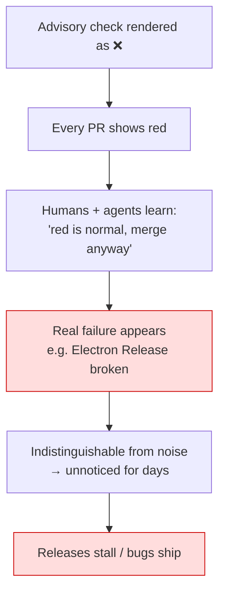
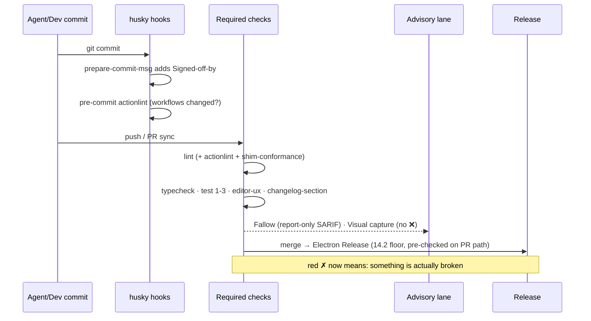

# CI Failure Patterns And Pipeline Health

## Problem Statement

GitHub Actions runs for this repository are red far more often than the code
is actually broken. Over the most recent ~500 workflow runs (window ending
2026-07-08), four workflows account for over 90% of all failures — and **none
of the top three failure sources indicate a defect in the shipped code**. The
result is a pipeline where a red ✗ on a PR carries almost no information,
genuinely broken things (Electron releases have been failing since 0279
merged) hide in the noise, and CI minutes are spent re-computing work other
jobs already did.

This exploration audits the recent failure data, identifies root causes per
workflow, extracts the cross-cutting patterns, and proposes fixes for both
reliability (fewer bogus failures) and performance (shorter, cheaper runs).

## Executive Summary

- **48 of 48 `mobile-e2e` runs failed with zero jobs executed.** The workflow
  file has a YAML syntax error (unquoted `: ` inside a plain-scalar `run:`
  line), so GitHub creates a phantom failed run *on every push to every
  branch* — even though the workflow is `workflow_dispatch`-only. This single
  bug is ~40% of all recent failures. Fix is quoting two lines.
- **DCO fails on 76% of runs** because agent-authored commits never carry
  `Signed-off-by`. It is a PR-time check for a commit-time ceremony; a
  dependency-free `prepare-commit-msg` hook makes it green by construction.
- **Fallow fails 44% of runs by design** (`--fail-on-issues` trips on
  advisory notes) and is also the slowest workflow (~17 min avg) because it
  rebuilds the workspace with the turbo cache disabled and re-runs the *full*
  test suite under istanbul for coverage that its changed-code audit mostly
  discards.
- **Electron Release is genuinely broken** (3 consecutive failures on main):
  the 0279 `xnet-audiotee` Swift helper uses macOS 14.2-only CoreAudio APIs
  while `Package.swift` declares `.macOS(.v14)`. Desktop releases are
  silently stalled — and the download page tracks `v*` releases.
- **Plugins Registry's daily rebuild pushes directly to `main`**, which
  repository rules reject ("changes must be made through a pull request") —
  it will fail every day the index changes.
- Cross-cutting theme: **advisory checks that render as hard failures**
  train everyone (humans and agents) to merge past red, which is how a
  broken release pipeline went unnoticed. The fix is to make advisory checks
  *report* without failing, make required checks *fail fast and loud*, and
  lint the workflow files themselves so a parse error can never ship again.

## Current State In The Repository

### Failure data (last ~500 runs, window ending 2026-07-08)

| Workflow | Runs | Failure | Cancelled | Success | Failure rate |
| --- | ---: | ---: | ---: | ---: | ---: |
| `.github/workflows/mobile-e2e.yml` (phantom) | 48 | **48** | 0 | 0 | **100%** |
| DCO | 29 | **22** | 0 | 7 | **76%** |
| Fallow | 27 | **12** | 6 | 8 | **44%** |
| Visual UI Capture | 35 | **10** | 4 | 20 | **29%** |
| Changelog Check | 30 | 4 | 0 | 26 | 13% |
| CI | 45 | 3 | 3 | 39 | 7% |
| Electron Release | 15 | 3 | 0 | 12 | 20% |
| Plugins Registry | 6 | 2 | 0 | 4 | 33% |
| everything else (11 workflows) | ~260 | 1 | ~16 | ~240 | <1% |

Reproduce with:

```bash
gh run list --limit 500 --json workflowName,conclusion \
  --jq 'group_by(.workflowName) | map({wf: .[0].workflowName, total: length,
        fail: (map(select(.conclusion=="failure")) | length)}) | sort_by(-.fail)'
```

### Duration data (successful runs only)

| Workflow | Avg | Max | Trigger frequency |
| --- | ---: | ---: | --- |
| Fallow | **16.7 min** | 18.4 min | every PR sync |
| Soak | 14.4 min | 14.6 min | schedule (fine) |
| CI | 7.2 min | 10.8 min | every PR sync + main push |
| Visual UI Capture | 6.7 min | 7.7 min | path-filtered PR sync + main push |
| Deploy Site | 6.4 min | 8.8 min | main push |
| Deploy PR Preview | 5.8 min | 6.2 min | every PR sync |
| npm Release | 5.4 min | 7.3 min | main push |
| Electron Release | 4.7 min | 15.6 min | release tags / main push |

CI itself was already optimized in exploration 0193 (split lint from
build+typecheck, 3-way test shards, Playwright/better-sqlite3/turbo caches,
PR-level concurrency cancellation — see `.github/workflows/ci.yml` and
`.github/actions/setup/action.yml`). The long pole today is **Fallow**, not CI.

### Root cause per failing workflow

#### 1. `mobile-e2e.yml` — invalid YAML, phantom run on every push (48/48)

`.github/workflows/mobile-e2e.yml:44` and `:67`:

```yaml
- name: Run Maestro flows
  run: echo "TODO: build APK + boot emulator, then 'maestro test tests/mobile/flows'"
```

The `run:` value is a YAML *plain scalar* (the double quotes are content, not
YAML quoting), and plain scalars may not contain `": "` — `js-yaml` reports
`bad indentation of a mapping entry (44:24)`. GitHub cannot parse the file,
and its documented behaviour for unparseable workflow files is to create a
**failed run named after the file path, with zero jobs, on every push** —
which is why a `workflow_dispatch`-only workflow "fails" on every push to
every branch (`gh run view` says: *"This run likely failed because of a
workflow file issue."*). This has produced 48 failed runs in the window and
is invisible locally because nothing validates workflow YAML.

#### 2. DCO — agent commits never signed off (22/29)

`.github/workflows/dco.yml` requires a `Signed-off-by:` trailer on every
non-bot commit. All commits here are authored locally by the agent workflow
(`git commit` without `-s`), and `.husky/` has `commit-msg`, `pre-commit`,
`pre-push`, `post-checkout` — but **no `prepare-commit-msg`**, so nothing adds
the trailer. DCO is not in the required-checks rule, so PRs merge over the
red ✗ (which the merge-mechanics memory explicitly documents as routine).
A check that fails 76% of the time and never blocks anything is pure noise.

#### 3. Fallow — advisory alerts fail the run; slowest workflow (12 fail / 6 cancelled / 27)

`.github/workflows/fallow.yml:84-88` runs
`fallow audit --changed-since <base> … --fail-on-issues`, so **any** new
alert — including notes (a recent run: "1 warning, 4 notes") — fails the
workflow. Fallow is not a required check either; per the quality-gate memory
it is deliberately advisory. So its red ✗ is, again, noise.

It is also the pipeline's most expensive job:

- `turbo-cache: 'false'` (`fallow.yml:40`) forces a full workspace rebuild
  every PR sync (~4 min that other jobs get from cache).
- The CRAP-scoring coverage step runs the **entire** vitest suite, unsharded,
  under istanbul (slower than v8) — while the audit itself only scores
  functions **changed since the base**. Most of that coverage is discarded.
- 6 of 27 runs were cancelled by the concurrency group — i.e. ~2 hours of
  compute thrown away because each 17-minute run rarely finishes before the
  next push.

#### 4. Visual UI Capture — storybook shim drift (10/35)

The workflow header says *"This is INFORMATIONAL … a capture failure must
never block a merge (continue-on-error throughout)"* — but the `Build
Storybook` step failure still fails the `capture` job and the run shows a red
✗ on the PR. The recurring failure class is real, though: the storybook
plugins shim must re-export whatever `@xnetjs/plugins` gains, and it drifts
(memory gotchas from 0279 and 0280; the very HEAD commit of PR #412 is
`fix(ci): export insertSlot from the storybook plugins shim`). So this check
*does* catch real breakage — but 6 minutes into an optional workflow, instead
of seconds into a required one.

#### 5. Electron Release — audiotee needs macOS 14.2 (3/15, currently broken)

`apps/electron/native/audiotee/Package.swift:9` declares
`platforms: [.macOS(.v14)]` (= 14.0), but `Sources/main.swift:37,113` call
`AudioHardwareCreateProcessTap` / `AudioHardwareDestroyProcessTap`, which are
**macOS 14.2+**. Swift availability checking fails the build on both macOS
arches. Every Electron Release run since 0279 merged (3 consecutive on main)
has failed, and nothing on the PR path builds the Swift helper, so the
breakage was only discoverable at release time. Note the download page
tracks `v*` releases (download-page coupling memory) — desktop releases are
stalled until this is fixed.

#### 6. Plugins Registry — scheduled job pushes to protected main (2/6)

`.github/workflows/plugins-registry.yml` `rebuild` job commits
`registry/registry.json` and pushes to `main` — which repository rules
reject: *"push declined due to repository rule violations … Changes must be
made through a pull request."* The daily 06:00 cron will fail every day the
index actually changes (stars/releases refresh), i.e. most days.

#### 7. Changelog Check — missing fragment (4/30)

Working as intended (it is effectively required via `changelog-section`),
but the feedback arrives at PR time. The changeset side already has a Stop
hook (`scripts/changeset/assert-coverage.mjs`) that catches the equivalent
omission before the turn ends; changelog fragments have no such local
counterpart.

#### Non-problems

- CI's 3 cancelled runs and `pages-build-deployment`'s 10 cancellations are
  healthy concurrency-supersession, not failures.
- CI's 3 real failures were genuine test/type breakage — the system working.

### Required checks vs. the noise

Required on `main` (via repo ruleset): `lint`, `typecheck`,
`test (1/3 · 2/3 · 3/3)`, `editor-ux`, `changelog-section`. **Not required:**
DCO, Fallow, Visual UI Capture, mobile-e2e. So the four noisiest signals are
all advisory — every PR shows red, everyone learns to merge past red, and a
genuinely broken release pipeline sat unnoticed among them.



### Where each failure class *should* be caught

```mermaid
flowchart LR
    subgraph commit["Commit time (husky)"]
        H1[prepare-commit-msg<br/>auto sign-off → DCO green]
        H2[pre-commit actionlint<br/>on .github/workflows/**]
    end
    subgraph pr["PR time (required checks)"]
        P1[lint job: actionlint step]
        P2[lint job: storybook-shim<br/>export conformance]
        P3[native-helper build check<br/>when native/** changes]
    end
    subgraph advisory["PR time (advisory, never ❌)"]
        A1[Fallow: SARIF + summary,<br/>no --fail-on-issues]
        A2[Visual capture:<br/>continue-on-error at job level]
    end
    subgraph release["Release time"]
        R1[Electron Release<br/>only real packaging left to fail]
    end
    commit --> pr --> advisory --> release
```



## External Research

- **actionlint** ([rhysd/actionlint](https://github.com/rhysd/actionlint)) is
  the standard static checker for workflow files — it catches exactly this
  class (YAML parse errors, plus expression/typing/shellcheck issues) and is
  designed to run in CI on the workflows themselves, with
  [pre-commit and CI integrations](https://github.com/rhysd/actionlint/blob/main/docs/usage.md).
  Common practice is to make it a required check so an unparseable workflow
  can never merge ([Tenki writeup](https://tenki.cloud/blog/lint-github-actions-workflows-actionlint)).
- **DCO automation**: the established pattern is a local
  `prepare-commit-msg` hook that appends the trailer automatically (works
  with every git frontend), optionally paired with a server-side check like
  the [DCO GitHub App](https://github.com/apps/dco) as enforcement — see
  [Prometheus's DCO-signing guide](https://github.com/prometheus/prometheus/wiki/DCO-signing)
  and the [dcoapp discussion of hook-based signing](https://github.com/dcoapp/app/issues/173).
  Prevention at commit time beats detection at PR time.
- **Bot commits to protected branches**: GitHub's own guidance for scheduled
  data-refresh jobs on rule-protected repos is either a PR-based flow
  (e.g. `peter-evans/create-pull-request`, the same shape as the existing
  changesets release PR) or a rules bypass for a dedicated GitHub App. The
  repo already runs the PR-based pattern successfully for releases.
- **Alert-only code scanning**: uploading SARIF to code scanning (which
  Fallow already does) is GitHub's intended channel for advisory findings —
  alerts annotate the diff without a failing check. Failing the workflow
  *and* uploading alerts double-reports the same information.

## Key Findings

1. **~75% of all failed runs in the window (82 of ~105) trace to four causes
   with zero relation to code correctness**: an unparseable workflow file
   (48), unsigned commits (22), advisory-quality gates hard-failing (12+10).
2. **One two-line YAML quoting bug produced more failures than every real
   defect combined**, and no local or CI tooling could have caught it because
   nothing lints `.github/workflows/`.
3. **The only sustained *real* breakage (Electron Release) went unnoticed**,
   which is the predictable cost of finding 1: red stopped meaning anything.
4. **Commit-metadata ceremonies (sign-off, changelog fragments, changesets)
   fail late when enforced only at PR time.** The repo already proved the
   fix works — the changesets Stop hook — and simply hasn't applied the same
   pattern to sign-off.
5. **Fallow's cost is self-inflicted**: full rebuild with cache disabled +
   full-suite istanbul coverage to score only changed functions. Its 17-min
   wall time also guarantees cancellation churn (6/27 runs thrown away).
6. **Native-platform code (Swift helper) has no PR-path build check**, so
   macOS-availability drift is only discoverable at release time.

## Options And Tradeoffs

### A. The mobile-e2e phantom failure

| Option | Effort | Notes |
| --- | --- | --- |
| **A1. Quote the two `run:` lines** | 1 line ×2 | Immediate; removes ~40% of all failures. |
| A2. Delete the workflow until a runner exists | tiny | It's a TODO-stub anyway; but keeping the (fixed) skeleton preserves the 0238 wiring intent. |
| **A3. Add actionlint (pre-commit + CI `lint` job, path-filtered)** | small | Prevents the entire class. actionlint also shellchecks `run:` blocks — likely surfaces other latent issues on first run. |

A1 + A3 together. A2 optional — the fixed file costs nothing (dispatch-only).

### B. DCO redness

| Option | Effort | Notes |
| --- | --- | --- |
| **B1. `prepare-commit-msg` husky hook auto-appending sign-off** | small | Dependency-free shell; works for agent and human commits alike. Note: `--no-verify` skips it (the devkit-tests gotcha shows `--no-verify` gets used), so keep the CI check as backstop. |
| B2. Drop the DCO workflow | tiny | Contradicts GOVERNANCE.md (0242/0243 chose DCO deliberately). Rejected. |
| B3. Make DCO required | tiny | Without B1 this blocks every PR; with B1 it's nearly moot but a good ratchet *after* B1 proves out. |

B1 now; consider B3 after a week of green.

### C. Fallow — signal and speed

| Option | Effort | Notes |
| --- | --- | --- |
| **C1. Report-only on PRs**: drop `--fail-on-issues`; keep SARIF upload + step summary (alerts still annotate the diff) | tiny | Matches its de-facto advisory status; ends 44% red. Keep hard-fail on the weekly scheduled run so regressions still page someone. |
| C2. Fail only on `warning`+ severity (filter SARIF, exit accordingly) | small | Middle ground if pure report-only feels too soft; still red on real warnings. |
| **C3. Coverage only for changed code**: `vitest run --changed=<base>` before the audit | small | The audit is already `--changed-since` scoped; full-suite istanbul coverage is mostly discarded. Cuts the ~10-min coverage step to ~1-3 min. Risk: `--changed` misses coverage of a changed function exercised only by an unchanged test file → CRAP over-scores it; acceptable for an advisory check, and C1 removes the sting. |
| **C4. Re-enable turbo cache** | 1 line | `turbo-cache: 'false'` looks like a leftover; the audit reads sources, not stale dist. Saves ~3-4 min/run. |

C1 + C3 + C4: Fallow drops from ~17 min red-by-default to ~6-8 min
informational, and cancellation waste shrinks proportionally.

### D. Visual UI Capture

| Option | Effort | Notes |
| --- | --- | --- |
| **D1. Job-level `continue-on-error: true`** on `capture` | 1 line | Makes behaviour match the documented contract (never a red ✗). |
| **D2. Shim-conformance check in the required `lint` job** | small | A script that imports `.storybook`'s plugins-shim export list and diffs it against `@xnetjs/plugins`' actual exports — the recurring drift (0279, 0280, #412) then fails in seconds in a *required* check with a clear message, instead of 6 minutes into an optional one. |

Both: D2 moves the real signal into the required lane, D1 silences the
advisory lane. (D1 alone would *hide* the shim drift — do not do D1 without D2.)

### E. Electron Release / native helper

| Option | Effort | Notes |
| --- | --- | --- |
| **E1. `platforms: [.macOS("14.2")]` in Package.swift** | 1 line | The helper is only ever spawned for the 14.2+ CATap capability path, so raising the deployment floor is semantically correct and simpler than sprinkling `if #available`. |
| E2. `if #available(macOS 14.2, *)` guards + runtime fail | medium | Only worth it if the binary must run (and cleanly report "unsupported") on 14.0/14.1. |
| **E3. PR-path guard**: a path-filtered CI job (`macos-14`, `swift build -c release`) when `apps/electron/native/**` changes | small | macOS minutes cost 10× Linux, but the path filter means it runs a few times a month. Catches availability drift before release time. |

E1 + E3.

### F. Plugins Registry rebuild vs. branch rules

| Option | Effort | Notes |
| --- | --- | --- |
| **F1. PR-based**: `peter-evans/create-pull-request` refreshing a standing `plugins-registry/data` PR | small | Same proven shape as the changesets release PR; merge is one click (or auto-merge label). Adds merge latency to star-count refreshes — harmless. |
| F2. Rules bypass for a dedicated App/actor | config | Zero-latency but weakens the "PRs only" invariant and needs an App + secret. |
| F3. Publish the index to a data branch / artifact instead of main | medium | Cleanest long-term (generated data out of the source branch) but touches the Deploy Site trigger chain (`registry/**` re-triggers deploy). |

F1 now; F3 if generated-file churn ever becomes annoying.

### G. Changelog fragments earlier

Extend the existing Stop-hook pattern: `scripts/changeset/assert-coverage.mjs`
already blocks turn-end without a changeset; add an equivalent (or extend it)
to warn when the branch diff touches `apps/`, `packages/`, or `site/` with no
`site/changelog/*` fragment and no `skip-changelog` label intent. Low effort,
removes the remaining 13% failure rate at the source. (Warn, don't block —
fragment-worthiness is a judgment call the `changelog-section` check already
enforces with a label escape hatch.)

## Recommendation

Ship in three tiers:

**Tier 1 — the two-line fixes (do immediately, one PR):**
1. Quote `mobile-e2e.yml:44` and `:67` (A1). Kills the 100%-failure phantom.
2. `Package.swift` → `.macOS("14.2")` (E1). Unblocks desktop releases.
3. Fallow: re-enable turbo cache (C4); drop `--fail-on-issues` on PR events,
   keep it for `schedule`/`workflow_dispatch` (C1).
4. `continue-on-error: true` on the visual-capture job (D1) — paired with D2
   in Tier 2.

**Tier 2 — prevent the classes (second PR):**
5. actionlint: path-filtered step in the CI `lint` job + a pre-commit hook
   entry for `.github/workflows/**` (A3).
6. `.husky/prepare-commit-msg` auto sign-off (B1).
7. Storybook shim-conformance check in `lint` (D2).
8. Fallow coverage via `--changed` (C3).
9. Plugins Registry rebuild → standing PR (F1).

**Tier 3 — ratchets (after a week of green):**
10. Path-filtered macOS `swift build` guard for `apps/electron/native/**` (E3).
11. Consider making DCO required (B3) once B1 has it reliably green.
12. Changelog-fragment Stop-hook warning (G).

Expected outcome: failed-run rate drops from ~21% of runs to an estimated
**~2-3%** (real failures only), Fallow wall time roughly halves, and a red ✗
regains meaning.



## Example Code

### mobile-e2e.yml fix (both jobs)

```yaml
- name: Run Maestro flows
  run: 'echo "TODO: build APK + boot emulator, then run maestro test tests/mobile/flows"'
```

### `.husky/prepare-commit-msg` (dependency-free)

```sh
#!/bin/sh
# Auto-append a DCO sign-off (GOVERNANCE.md: xNet uses DCO). Skips merges,
# fixups, and messages that already carry a trailer.
case "$2" in merge|squash) exit 0;; esac
MSG_FILE="$1"
NAME=$(git config user.name); EMAIL=$(git config user.email)
[ -n "$NAME" ] && [ -n "$EMAIL" ] || exit 0
grep -qi "^Signed-off-by: " "$MSG_FILE" || \
  printf '\nSigned-off-by: %s <%s>\n' "$NAME" "$EMAIL" >> "$MSG_FILE"
```

### actionlint step in the CI `lint` job

```yaml
- name: Lint workflow files (actionlint)
  run: |
    bash <(curl -fsSL https://raw.githubusercontent.com/rhysd/actionlint/main/scripts/download-actionlint.bash) 1.7.7
    ./actionlint -color
```

### Fallow: report-only on PRs + changed-scope coverage

```yaml
- name: Generate coverage for CRAP scoring (changed scope on PRs)
  run: |
    EXTRA=()
    if [[ "${{ github.event_name }}" == "pull_request" ]]; then
      EXTRA=(--changed "${{ steps.base.outputs.ref }}")
    fi
    pnpm vitest run "${EXTRA[@]}" --passWithNoTests \
      --coverage.enabled --coverage.provider=istanbul \
      --coverage.reporter=json --coverage.reportsDirectory=coverage

- name: Run Fallow audit
  run: |
    FAIL=()
    [[ "${{ github.event_name }}" != "pull_request" ]] && FAIL=(--fail-on-issues)
    pnpm exec fallow audit --changed-since "${{ steps.base.outputs.ref }}" \
      ${COVERAGE_ARGS+"${COVERAGE_ARGS[@]}"} --format sarif "${FAIL[@]}" > fallow-audit.sarif
```

### Package.swift deployment floor

```swift
platforms: [.macOS("14.2")],  // AudioHardwareCreateProcessTap requires 14.2
```

## Risks And Open Questions

- **`--no-verify` bypasses the sign-off hook** (and it *is* used here per the
  devkit-tests gotcha) — the DCO workflow stays as backstop; don't make it
  required until observed green for a while.
- **Fallow `--changed` coverage under-measures** functions whose tests didn't
  change → occasional CRAP over-scoring. Acceptable for an advisory signal;
  the weekly full run keeps an accurate baseline.
- **actionlint's first run may flag latent issues** across all 24 workflows
  (shellcheck on `run:` blocks is strict). Budget a cleanup pass in the same
  PR; use inline `# shellcheck disable=` only with justification.
- **Raising audiotee to 14.2**: confirm no supported install path expects the
  helper on macOS 14.0/14.1 (the capability detection in the Electron main
  should already gate on API availability, not helper presence — verify).
- **Registry PR flow**: daily auto-PRs need auto-merge or they become their
  own rot; enable auto-merge on the standing PR or merge it in the same
  review habit as the changesets release PR.
- Phantom-run naming: after fixing the YAML, confirm the per-push phantom
  disappears (it should — the run is created only while the file is
  unparseable at the pushed ref). Old failed runs remain in history.

## Implementation Checklist

Tier 1 — stop the bleeding:
- [x] Quote the two `run:` echo lines in `.github/workflows/mobile-e2e.yml` (44, 67)
- [x] `apps/electron/native/audiotee/Package.swift`: `.macOS(.v14)` → `.macOS("14.2")`
- [x] Verify Electron main's systemAudio capability gates on OS version ≥ 14.2 (not helper presence)
- [ ] `fallow.yml`: remove `turbo-cache: 'false'`
- [ ] `fallow.yml`: `--fail-on-issues` only when `github.event_name != 'pull_request'`
- [ ] `visual-capture.yml`: `continue-on-error: true` on the `capture` job

Tier 2 — prevent the classes:
- [ ] Add actionlint step to the `lint` job in `ci.yml` (pin version)
- [ ] Add actionlint to `.husky/pre-commit` for staged `.github/workflows/**` files
- [ ] Fix whatever actionlint flags across the other 23 workflows
- [ ] Add `.husky/prepare-commit-msg` DCO auto-sign-off (dependency-free shell)
- [ ] Storybook shim-conformance script + `lint` job step (diff shim exports vs `@xnetjs/plugins` exports)
- [ ] `fallow.yml`: changed-scope coverage on PR events (`vitest --changed`)
- [ ] `plugins-registry.yml`: replace direct push with `peter-evans/create-pull-request` standing PR + auto-merge

Tier 3 — ratchets:
- [ ] Path-filtered macOS `swift build -c release` check for `apps/electron/native/**` in CI
- [ ] After ≥1 week of green DCO: add DCO to the required-checks ruleset
- [ ] Changelog-fragment Stop-hook warning (mirror `scripts/changeset/assert-coverage.mjs`)

## Validation Checklist

- [ ] Push any commit: no phantom `.github/workflows/mobile-e2e.yml` run appears
- [ ] `gh workflow run mobile-e2e.yml -f platform=android` parses and starts jobs
- [ ] Next Electron Release run: both macOS arch jobs pass `Build xnet-audiotee helper`; `v*` release publishes and the download page picks it up
- [ ] Fresh PR: DCO check green without manual `-s`
- [ ] Fresh PR touching a package: Fallow completes in < 8 min and reports (SARIF alerts + summary) without a red ✗
- [ ] Intentionally add an unexported plugin symbol to a storybook story: `lint` fails in < 2 min with the shim-conformance message
- [ ] Intentionally break a workflow file's YAML in a branch: pre-commit and/or `lint` actionlint step reject it
- [ ] Next daily Plugins Registry cron with changes: opens/refreshes a PR instead of failing
- [ ] After 2 weeks: re-run the failure-rate query — failure share of total runs ≤ 5%, with all failures traceable to real defects

## References

- Run/failure data: `gh run list` queries above (window ending 2026-07-08)
- `.github/workflows/mobile-e2e.yml`, `dco.yml`, `fallow.yml`,
  `visual-capture.yml`, `plugins-registry.yml`, `electron-release.yml`,
  `ci.yml`, `.github/actions/setup/action.yml`
- `apps/electron/native/audiotee/Package.swift`, `Sources/main.swift`
- Exploration 0193 (CI parallelize + cache), 0238 (mobile shell / e2e),
  0242/0243 (DCO governance), 0279 (meeting transcription — audiotee, shim
  gotchas), 0280 (shim gotcha recurrence)
- [rhysd/actionlint](https://github.com/rhysd/actionlint) ·
  [usage docs](https://github.com/rhysd/actionlint/blob/main/docs/usage.md) ·
  [CI integration writeup](https://tenki.cloud/blog/lint-github-actions-workflows-actionlint)
- [DCO GitHub App](https://github.com/apps/dco) ·
  [Prometheus DCO-signing guide](https://github.com/prometheus/prometheus/wiki/DCO-signing) ·
  [dcoapp hook discussion](https://github.com/dcoapp/app/issues/173)
