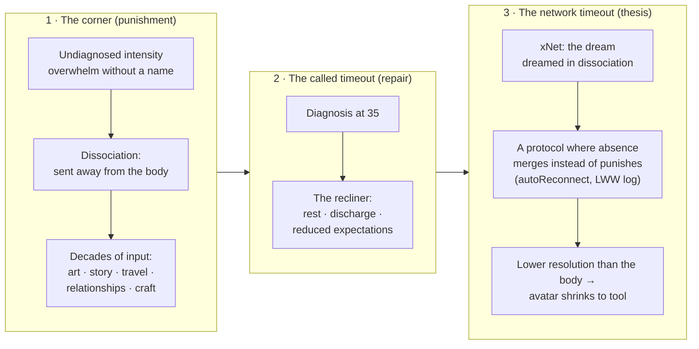
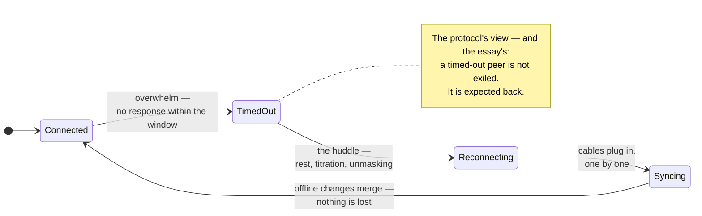
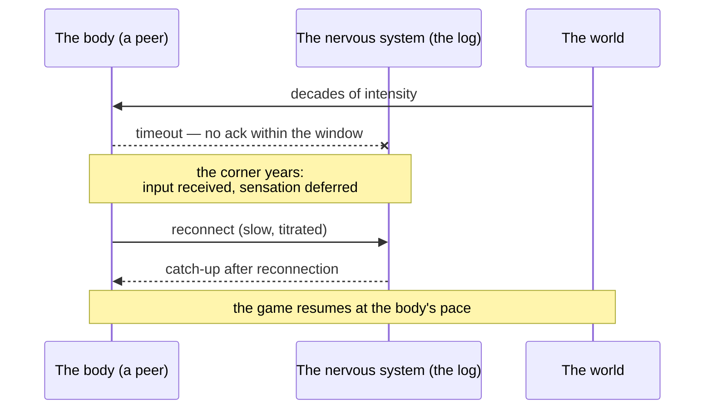

# Blog Post: "Timeout" — A Personal Essay on Dissociation, Reconnection, and the Dream That Became xNet

> _"I'm sitting in a recliner right now, talking to my computer, hardly
> moving."_ — the seed dictation for this essay

## Problem Statement

The author wants to write a blog post — working title **"Timeout"** — that is
unlike anything else in the series. The eleven essays so far argue about
protocols, economics, ecology, and power. This one is first-person: the
author is autistic and ADHD, diagnosed at thirty-five, and describes having
spent years — maybe a whole life — in a "timeout": dissociated from the body
and the richness of its sensation, while taking in enormous amounts of art,
story, travel, relationships, and craft. xNet, in the author's own words, is
_"the dream that I had in the dissociation"_ — an amalgamation, maybe an
excretion, of all those inputs, formed while somewhat disembodied. And there
is an honest tension to carry: as the nervous system reconnects — slowly,
cable by cable, mostly from a recliner — the author can feel how much **lower
resolution** the platform is than the body it was dreamed from, and is torn:
excited by xNet's possibility, and not entirely sure he wants to build it.

The exploration must answer:

1. **Does this essay belong on the xNet blog at all**, or on the author's
   personal sites ([nervous-system-healing](https://crs48.github.io/nervous-system-healing/),
   [LIBCard](https://crs48.github.io/LIBCard/))?
2. **What is the essay's argument** — beyond memoir — so it earns its place
   in a series where every post has a thesis?
3. **Is "Timeout" the right title**, and what shape/structure serves the
   material?
4. **What are the risks** (privacy, medical-advice adjacency, tonal whiplash
   with the series) and how are they handled?

The failure mode to avoid: an unstructured confessional that neither the
series' readers nor the author would want to reread in a year. The material
deserves the same craft discipline as the other eleven.

## Executive Summary

- **Yes, it belongs on the xNet blog — as the series' missing origin story.**
  Eleven essays explain what xNet believes; none explains where it came from.
  Readers of values-forward projects consistently ask "why does this person
  care so much?" This essay is the answer, and it makes every other essay
  more legible. It links back to the personal sites rather than living there.
- **"Timeout" is the right title, because the word means three things and the
  essay is the journey between them.** (1) The **punishment corner** — how
  undiagnosed autistic overwhelm felt from the inside: sent away from your
  own body, told to sit apart. (2) The **called timeout** — sports: a
  deliberate stoppage, called _by your own team_, when the game is running
  away from you; the clock stops so the players can breathe and re-plan.
  (3) The **network timeout** — a peer that didn't respond within the
  window. And here the essay lands its thesis, because xNet's own protocol
  treats a timeout not as exile but as a state to return from:
  `timeout`, `autoReconnect`, and "catching up after reconnection" are
  literal fields and doc-comments in
  [packages/sync/src/provider.ts](../../packages/sync/src/provider.ts), and
  the signed LWW change log means a peer can be offline for years and still
  merge back in without being punished for its absence. **The author built a
  network that treats going quiet the way he needed to be treated.**
- **The essay's argument (beyond memoir):** systems dreamed in dissociation
  can still be diagrams of health. The disembodied self designed, without
  fully knowing it, a formal model of the connection it was missing — peers
  that hold their own state; connection without dissolution into a center;
  absence tolerated and merged rather than penalized; the primary copy kept
  _at home_ (local-first as a somatic principle: your body holds the primary;
  everything else is a secondary replica). And the honest inversion: the map
  is lower-resolution than the territory. As embodiment returns, the platform
  stops being an avatar and finds its right size — a tool, not a self. That
  ambivalence, stated plainly, is the most trustworthy sentence a founder can
  publish.
- **The experience described is textbook, and the research grounds it
  without clinicalizing it.** Autistic burnout is a defined syndrome —
  chronic exhaustion, loss of function, reduced stimulus tolerance — and the
  documented recovery factors are exactly the author's practice: time off,
  reduced expectations, doing things in an autistic way (Raymaker et al.
  2020). Interoception research (Garfinkel, Shah et al.) grounds "dissociated
  from sensation"; Levine's Somatic Experiencing (discharge, titration,
  pendulation) grounds the recliner. One light-touch paragraph each — the
  essay cites, it does not lecture.
- **Recommendation:** ship blog post #12, `site/src/pages/blog/timeout.astro`,
  new `'personal'` tag added to the `BlogTag` union, authors
  `['crs48', 'claude']`, cold-opening on the recliner, closing on the
  reconnecting peer. ~12–14 min read. Privacy pass with the author before
  publishing (the divorce and the ex-wife are identifiable).

## Current State In The Repository

### Blog machinery (post #12 slots in mechanically)

- [site/src/data/blog.ts](../../site/src/data/blog.ts) — single source of
  truth: `posts[]`, `AUTHORS` (crs48 + Claude, vendored avatars), `BlogTag`
  union, `seriesNeighbors()`. Eleven posts exist (`the-vault-and-the-view`
  newest). A new post = one `posts[]` entry + one hand-authored `.astro`
  page. **The `BlogTag` union
  ([blog.ts:23-31](../../site/src/data/blog.ts)) has no tag for personal
  writing** — `'personal'` must be added (one-line union change; site is not
  a publishable package, so no changeset).
- [site/src/pages/blog/the-vault-and-the-view.astro](../../site/src/pages/blog/the-vault-and-the-view.astro)
  — freshest conventions template: `Byline`, `SeriesNav`, `Mermaid`,
  `CodeFigure`, bespoke hero component, `prose` body, en-GB, nothing
  third-party on the page.
- Gotchas already learned (0239–0281): pages are `.astro` not MDX; heroes and
  avatars are vendored; commit headers ≤72 chars; changelog fragment via
  `scripts/changelog/new.mjs --tags platform` (never hand-written); RSS and
  index derive from `posts[]` automatically.

### The repo receipts for the essay's central metaphor

The "network timeout" movement only works if the protocol really behaves the
way the essay claims. It does:

- **A timeout is a config field, not a verdict.**
  [packages/sync/src/provider.ts:185-192](../../packages/sync/src/provider.ts)
  — `timeout?: number`, `autoReconnect?: boolean`,
  `maxReconnectAttempts?: number`, `reconnectDelay?: number`. The provider's
  own doc-comment at
  [provider.ts:145](../../packages/sync/src/provider.ts) describes fetching
  changes "useful for catching up after reconnection."
- **Absence merges; it is not punished.** The substrate is a signed,
  hash-chained, Lamport-ordered LWW change log
  ([packages/sync/src/change.ts](../../packages/sync/src/change.ts),
  [clock.ts](../../packages/sync/src/clock.ts)) — a peer that has been
  offline arbitrarily long appends its changes and converges. No rebase
  shame, no exile.
- **The primary copy lives at home.** The whole local-first stance (protocol
  spec in [docs/specs/protocol/](../../docs/specs/protocol/); hub as
  optional relay, replica primary — explorations 0200, 0258) is the
  architectural form of "your body holds the primary; the cloud is a
  secondary copy." Essay #11 argued this for data; #12 gets to say it about
  a nervous system, and mean both.
- **Multiple views, one substrate** (essay #11's territory,
  [packages/views/src/](../../packages/views/src/)) — usable in one line for
  the "many lives, one person" beat (theater, animation, sculpture, film,
  businesses, cities — views over the same node), but must not be re-argued.

### Series-fit audit

| Existing essay             | Register                        | #12's distinct job                                        |
| -------------------------- | ------------------------------- | --------------------------------------------------------- |
| #1–#11                     | Argument essays (they/you/we)   | First sustained **I**; the origin story behind the series |
| #6 Forest and the Field    | Nature-as-argument              | Nature appears as _lived preference_ (food forests) only  |
| #9 Hand on the Tiller      | Steering/cybernetics            | #12's "called timeout" is a steering act — cite, don't re-argue |
| #11 Vault and the View     | Apps as views; data as heirloom | #12 inverts inward: the builder as the substrate          |

The seam: every prior essay says "here is how software should treat people."
#12 says "here is the person, and why he needed software to be that way."

## External Research

### Autistic burnout — the "timeout" has a clinical name

- **Raymaker et al. 2020, ["Having All of Your Internal Resources Exhausted
  Beyond Measure and Being Left with No Clean-Up
  Crew": Defining Autistic Burnout](https://pubmed.ncbi.nlm.nih.gov/32851204/)**
  (AASPIRE; [publisher page](https://www.liebertpub.com/doi/abs/10.1089/aut.2019.0079)) —
  defines autistic burnout as a syndrome of chronic life stress and a
  mismatch of expectations and abilities without adequate supports:
  pervasive long-term exhaustion, **loss of function**, and **reduced
  tolerance to stimulus**. Documented recovery factors: **acceptance and
  social support, time off / reduced expectations, and doing things in an
  autistic way (unmasking)**. The author's recliner practice is, almost
  point for point, the recovery protocol the research describes. The essay
  should cite this once, gently — it reframes "hardly moving all day" from
  indulgence to evidence-based repair.
- Context pieces: [National Autistic Society on autistic
  burnout](https://www.autism.org.uk/advice-and-guidance/professional-practice/autistic-burnout),
  [OAR, "No Clean-up Crew"](https://researchautism.org/blog/no-clean-up-crew-causes-and-costs-of-autistic-burnout/).
  Late diagnosis (mid-thirties) is a recurring feature of burnout accounts —
  decades of masking with no name for the cost.

### Interoception and alexithymia — "dissociated from sensation" is measurable

- **[Shah et al. 2016, "Alexithymia, not autism, is associated with impaired
  interoception"](https://www.ncbi.nlm.nih.gov/pmc/articles/PMC4962768/)** —
  the reduced felt sense of the body common in autistic adults tracks
  co-occurring **alexithymia** (present in ~40–65% of autistic people), not
  autism itself. Useful nuance: the disconnection is real, common, and *not
  intrinsic* — which is exactly why reconnection is possible.
- **Garfinkel and colleagues** — autistic participants often show **high
  confidence in interoceptive ability alongside poor accuracy**
  ([review/meta-analysis](https://www.frontiersin.org/journals/psychiatry/articles/10.3389/fpsyt.2025.1573263/full),
  [emotional dysfunction and interoceptive challenges in autistic
  adults](https://www.ncbi.nlm.nih.gov/pmc/articles/PMC10136046/)) — the
  signal was always arriving; the reading of it was the hard part. "Plugging
  the cables back in" is a fair lay rendering of interoceptive retraining.

### Somatic Experiencing — the recliner, technically described

- **Peter Levine's Somatic Experiencing**
  ([SE International](https://traumahealing.org/se-101/),
  [overview](https://www.simplypsychology.com/articles/somatic-experiencing-guide)) —
  trauma as trapped survival energy; **discharge** (the body releasing held
  activation, the way animals shake after threat), **titration** (small
  doses), **pendulation** (moving between activation and resource). The
  author's phrase "giving my body the opportunity to discharge… that intense
  clenched energy it's been holding for decades" is SE vocabulary already.
  One paragraph, cited, no more — the essay must not become a modality
  explainer (the author's
  [nervous-system-healing site](https://crs48.github.io/nervous-system-healing/)
  exists for that, with its own evidence-rating discipline; the essay should
  link it exactly once).

### The author's own sites (fetched during this exploration)

- **[nervous-system-healing](https://crs48.github.io/nervous-system-healing/)** —
  free, no-account, no-paywall educational resource; "A calm place to
  start… Go gently"; practices of 2–10 minutes; modality directory with
  evidence ratings; explicit non-commercial ethics. The essay's tone should
  match this register when it touches healing: gentle, honest,
  non-prescriptive, crisis-resources-aware.
- **[LIBCard personal site](https://crs48.github.io/LIBCard/)** — xNet as
  primary project; murmuration (flocking simulations); food forests,
  geodesic domes, regenerative community ("Yinning to Winning"); values of
  presence, consistency "when it's hard and messy," being fully seen with
  less judgment. The essay's later beats (food forests, dome homes, networks
  of regenerative communities) are already public commitments, not new
  disclosures.

### Genre prior art — the founder essay that admits ambivalence

The rarest and most trusted move in founder writing is the honest
counter-motive. The essay's "I don't super want to build xNet" moment sits
in a small, strong lineage: post-burnout maker essays and neurodivergent
builder memoirs (e.g. the public wave of late-diagnosis essays after 2020;
Devon Price's _Unmasking Autism_ popularized masking-cost language). The
essay does not need to cite this genre — but it should learn its craft rule:
**specificity is what keeps vulnerability from reading as marketing.** The
recliner, the cables, the cities, the fifteen years — concrete nouns carry
it.

## Key Findings

1. **The triple meaning of "timeout" is the essay's engine.** Punishment
   corner → called timeout → network timeout is a complete arc: how it felt,
   what it actually was, and what a humane system does about it. The third
   meaning is earned only because the repo receipts are real
   (`autoReconnect`, catch-up after reconnection, LWW merge of long-offline
   peers).
2. **The essay has a thesis, not just a story:** the disembodied self drew a
   diagram of healthy connection and called it a protocol. Local-first is a
   somatic principle — the primary copy lives at home. And the honest
   corollary: the diagram is lower-resolution than the body, so as the body
   comes back online, the project must shrink from avatar to tool. This is
   an *argument about what software is for*, which is what qualifies it for
   this blog.
3. **The lived experience is research-legible without being pathologized.**
   Burnout recovery factors (Raymaker), interoception/alexithymia (Shah,
   Garfinkel), and SE discharge (Levine) each get one grounding touch. The
   essay stays memoir with citations, not a case study.
4. **The ambivalence is the credibility.** "I'm excited by xNet and I'm not
   sure I want to build it" is the sentence readers will remember, and it
   must not be sanded off in drafting. It also sets up the resolution: the
   point of xNet was never that its author should live inside it — a tool
   for owning your own state, built by someone learning to own his.
5. **Privacy is the one hard gate.** The divorce, the fifteen years, and the
   ex-wife's inner life ("she'd been wanting for that for a while") are
   identifiable. The essay should say only what is the author's to tell —
   and the author should explicitly approve those lines (ideally after she
   has seen them) before publish.

## Options And Tradeoffs

### Where does it live?

| Option                                        | Pros                                                                          | Cons                                                          |
| --------------------------------------------- | ----------------------------------------------------------------------------- | ------------------------------------------------------------- |
| **A. xNet blog, post #12** ✅                 | Origin story the series lacks; deepens every prior essay; widest readership   | Tonal departure; needs `'personal'` tag; privacy gate         |
| B. nervous-system-healing site                | Register match for the healing material                                       | That site is deliberately impersonal/educational; essay is not |
| C. Personal site (LIBCard)                    | Lowest stakes                                                                  | Orphans the xNet material; LIBCard is zero-JS bio, no essay home |
| D. Split (personal half → C, xNet half → A)   | Clean registers                                                                | Kills the essay — the collision *is* the essay                |

**A.** The essay's subject is the relationship between a person and this
project; it belongs where the project speaks.

### Title

| Title                     | Notes                                                                                                        |
| ------------------------- | ------------------------------------------------------------------------------------------------------------ |
| **"Timeout"** ✅          | Author's instinct; triple meaning (corner / called / network); first one-word title marks the register shift |
| "The Called Timeout"      | Pre-resolves the arc in the title; less room to travel                                                       |
| "The Peer That Went Quiet" | Series-consistent metaphor style; beautiful, but makes the network frame primary when the body is           |
| "Offline, Not Gone"       | Deck material, not a title                                                                                    |

Keep **"Timeout"**; use the deck to orient:
_"A personal essay on autism, dissociation, and the network I dreamed while I
was away from my body."_ ("The Peer That Went Quiet" survives as a section
heading.)

### Structure

| Option                                   | Shape                                                     | Verdict                                                          |
| ---------------------------------------- | --------------------------------------------------------- | ---------------------------------------------------------------- |
| **A. Three timeouts** ✅                 | Corner → called → network; recliner as frame at both ends | Argument and memoir braided; each meaning advances the thesis    |
| B. Chronological memoir                  | Childhood → school → marriage → diagnosis → now           | True but shapeless; buries the xNet material at the end          |
| C. Essay-with-interludes                 | Argument essay, italicized memoir fragments               | Distances exactly the material that must be close                |
| D. Letter to xNet                        | Second-person address to the project                      | Striking but precious over 12 minutes                            |

### Recommended outline (Option A)

1. **The recliner (cold open).** Present tense. Hardly moving, talking to a
   computer. Name the paradox: from outside, nothing is happening; from
   inside, decades of clenched energy are finally being allowed to move.
   _"I've started calling this my timeout."_
2. **The corner.** Timeout as punishment — the child's version. Undiagnosed
   autism as being sent away from your own body: the sensory intensity of a
   world calibrated for other nervous systems; overwhelm with no name until
   thirty-five; dissociation as the sentence you serve for a rule you were
   never shown. Interoception note (one touch): the signal was arriving; the
   reading was hard. The world during the corner years: stories — film,
   anime, manga, horror, romance, sci-fi; theater, animation, sculpture,
   electronic art; New York, Berlin, an island in the Atlantic, a forest,
   the tropics, San Diego, San Francisco; businesses opened and closed. The
   dissociated years were not empty — they were _receiving_. And fifteen
   years of a marriage where two nervous systems met each other's want for
   touch; now a divorce that is also a best friendship. (Privacy-gated
   lines live here.)
3. **The called timeout.** Reframe: in a game, a timeout is not a
   punishment; it is called *by your own team* when the game is running away
   from you. The clock stops. The burnout literature says the recovery is
   rest, reduced expectations, doing things your own way (Raymaker, one
   cite). The recliner is not absence from life; it is the huddle. Levine's
   discharge (one cite): the body finishing decades-old sentences.
4. **The dream in the dissociation.** What did the disembodied self do with
   all that input? It dreamed a network. xNet as amalgamation — maybe
   excretion — of every vibe picked up while surfing the ether. And notice
   what the dream insists on: every peer holds its own complete copy; peers
   connect without dissolving into a center; you can go quiet for years and
   come back and be merged, not punished (`autoReconnect`; catching up after
   reconnection; the log receives you). _The protocol is a self-portrait of
   the connection I was missing._ One `CodeFigure` here — the provider
   options with `timeout` and `autoReconnect` — and the line: "I built a
   network that treats going quiet the way I needed to be treated."
5. **Lower resolution.** The honest turn. As sensation returns, the author
   can feel how much coarser the platform is than the nervous system it
   mirrors — and can say the uncomfortable sentence: _I don't entirely want
   to build this._ xNet as avatar of the disembodied self; embodiment
   returning means the avatar loses primacy. Resolution without tidiness:
   the point of local-first was always that the primary copy lives at home.
   The primary copy of _me_ lives in this body, not in the dream. The
   project's right size is a tool — a good one, worth finishing well — not
   a self. (One sentence hands "data as heirloom" back to essay #11.)
6. **The peer that went quiet (close).** Back to the recliner, the cables
   reconnecting one by one, food forests and dome homes and networks of
   regenerating communities as what the reconnected life points toward. The
   game resumes — slowly, at the body's pace. A timeout, it turns out, was
   never an ending. The peer syncs. The log merges. Nothing that happened
   while offline is lost.







## Recommendation

Write **blog post #12, "Timeout"**, structure Option A, on the xNet blog:

- `site/src/pages/blog/timeout.astro` + `posts[]` entry; slug `timeout`;
  tags `['essay', 'personal', 'philosophy']` (add `'personal'` to the
  `BlogTag` union); authors `['crs48', 'claude']`; ~12–14 min; bespoke hero
  (suggestion: a quiet reclined figure as a node among nodes, one edge
  re-lighting — vendored SVG like the other heroes); en-GB spellings but the
  author's natural first-person voice.
- One `CodeFigure` (the real provider options from
  [packages/sync/src/provider.ts](../../packages/sync/src/provider.ts) —
  no invented fields), one or two of the diagrams above, `SeriesNav` linking
  #11 ↔ #12.
- Cite exactly four externals (Raymaker 2020, Shah 2016/Garfinkel, Levine/SE,
  and the author's nervous-system-healing site); include a one-line "this is
  a personal essay, not medical advice" note in the same gentle register the
  healing site uses.
- **Privacy gate before publish:** the author reviews (and is comfortable
  with his ex-wife reading) every sentence touching the marriage and
  divorce; default to generosity and brevity there — the essay needs the
  fifteen years and the friendship, not the details.
- Mechanics per series convention: changelog fragment via
  `scripts/changelog/new.mjs --tags platform`; no changeset (site is not
  publishable); conventional commit ≤72 chars; PR to `main`, merge-commit.

## Example Code

The essay's single code exhibit — real options from
[packages/sync/src/provider.ts:185-192](../../packages/sync/src/provider.ts),
shown exactly as they exist:

```typescript
/** Connection timeout in milliseconds */
timeout?: number
/** Whether to auto-reconnect on disconnect */
autoReconnect?: boolean
/** Maximum reconnection attempts */
maxReconnectAttempts?: number
/** Reconnection delay in milliseconds */
reconnectDelay?: number
```

Caption in the essay: _"Somewhere in here I apparently wrote down what I
needed: a timeout is a duration, not a verdict; reconnection is assumed;
and when you come back, the log catches you up on everything you missed."_

## Risks And Open Questions

- **Privacy (the hard gate).** The marriage/divorce material identifies a
  real person and gestures at her inner life. Mitigation: the outline keeps
  those beats short and generous; the author approves them explicitly
  pre-publish, ideally after she has seen them. This is the one checklist
  item that can block the post.
- **Medical-advice adjacency.** Discharge/SE and burnout-recovery framing
  must stay autobiographical ("what I do") not prescriptive ("what you
  should do"), with the disclaimer line and a single link to the healing
  site — which already models the right register.
- **Tonal whiplash with the series.** Mitigated by the `'personal'` tag, a
  deck that signals the register, and the fact that the essay still carries
  a software thesis. If it lands, it retroactively warms the whole series;
  if it wobbles, it reads as off-brand. Draft-time discipline: every memoir
  paragraph must serve the timeout arc.
- **The ambivalence could spook readers/users** ("the founder doesn't want
  to build it?"). Scope it honestly at draft time: the torn feeling is about
  xNet as *identity*, not about abandoning the work — the essay's own
  resolution ("tool, not self; worth finishing well") answers this, and the
  project's open protocol + right-to-leave essays mean the stakes of any
  founder's energy are structurally lower here than in a silo. That's a
  quiet, on-message point — the series' architecture is exactly what makes
  this admission safe to publish.
- **Overclaiming the metaphor.** The nervous system is not a distributed
  system; the essay should hold the analogy lightly ("a self-portrait, not a
  model") and concede the resolution gap explicitly — which is already the
  essay's own point.
- Open question: include the marriage material at all, vs. a single
  sentence? Decide at draft time with the author; the outline works either
  way.
- Open question: does `'personal'` warrant an index-page treatment (e.g.
  slightly different card styling)? Default no — the tag chip is enough.

## Implementation Checklist

- [ ] Add `'personal'` to the `BlogTag` union in
      [site/src/data/blog.ts](../../site/src/data/blog.ts) (no changeset —
      site is not publishable).
- [ ] Add the `posts[]` entry: slug `timeout`, title `Timeout`, deck as
      recommended, tags `['essay', 'personal', 'philosophy']`, authors
      `['crs48', 'claude']`, honest `readingMinutes`.
- [ ] Write `site/src/pages/blog/timeout.astro` per the six-part outline
      (Byline, SeriesNav, Mermaid state diagram, one CodeFigure with the
      real provider options, bespoke vendored hero, en-GB, nothing
      third-party).
- [ ] Keep the four external citations exactly as verified in External
      Research (Raymaker 2020, Shah 2016, SE/Levine, nervous-system-healing
      site); include the not-medical-advice line.
- [ ] Verify the CodeFigure against
      [packages/sync/src/provider.ts](../../packages/sync/src/provider.ts)
      at draft time (no invented fields).
- [ ] **Privacy gate:** author reviews and explicitly approves all
      marriage/divorce sentences before the PR merges.
- [ ] Changelog fragment via `scripts/changelog/new.mjs --tags platform`
      (do not hand-write).
- [ ] Conventional commit(s), header ≤72 chars; PR to `main`; merge-commit
      per repo policy.

## Validation Checklist

- [ ] Site build passes; post renders with hero, byline, diagram, and code
      figure; dark-mode and mobile spot-check match the series.
- [ ] Post appears on `/blog` index and in `rss.xml`; `seriesNeighbors`
      links #11 ↔ #12 correctly; `'personal'` tag chip renders.
- [ ] No third-party requests on the page (network tab clean).
- [ ] Quotes/claims check: the four citations match their sources; the
      provider-options code matches the file verbatim.
- [ ] Register check: every memoir paragraph advances the corner → called →
      network arc (no orphaned confessional passages).
- [ ] The author has read the published draft aloud once and still endorses
      the "I don't entirely want to build this" passage — it stays only if
      it still feels true.

## References

- Raymaker, D. M. et al., _"Having All of Your Internal Resources Exhausted
  Beyond Measure and Being Left with No Clean-Up Crew": Defining Autistic
  Burnout_ (Autism in Adulthood, 2020) —
  <https://pubmed.ncbi.nlm.nih.gov/32851204/>
- Shah, P. et al., _Alexithymia, not autism, is associated with impaired
  interoception_ (Cortex, 2016) —
  <https://www.ncbi.nlm.nih.gov/pmc/articles/PMC4962768/>
- Interoception in autism — systematic review & meta-analysis (Frontiers in
  Psychiatry, 2025) —
  <https://www.frontiersin.org/journals/psychiatry/articles/10.3389/fpsyt.2025.1573263/full>
- Somatic Experiencing International, _SE 101_ —
  <https://traumahealing.org/se-101/> (Levine: discharge, titration,
  pendulation)
- National Autistic Society, _Understanding autistic burnout_ —
  <https://www.autism.org.uk/advice-and-guidance/professional-practice/autistic-burnout>
- The author's sites: <https://crs48.github.io/nervous-system-healing/> ·
  <https://crs48.github.io/LIBCard/>
- Repo: [site/src/data/blog.ts](../../site/src/data/blog.ts),
  [packages/sync/src/provider.ts](../../packages/sync/src/provider.ts),
  [packages/sync/src/change.ts](../../packages/sync/src/change.ts),
  [docs/specs/protocol/](../../docs/specs/protocol/), explorations
  0239/0247/0269/0281 (blog conventions & fact-check discipline)
