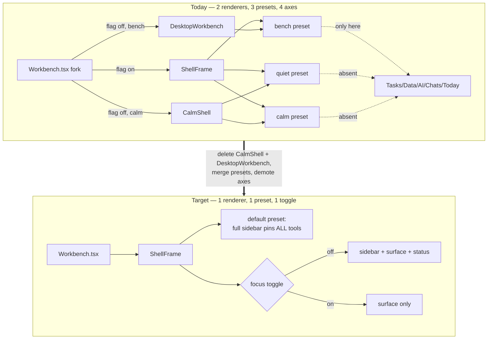
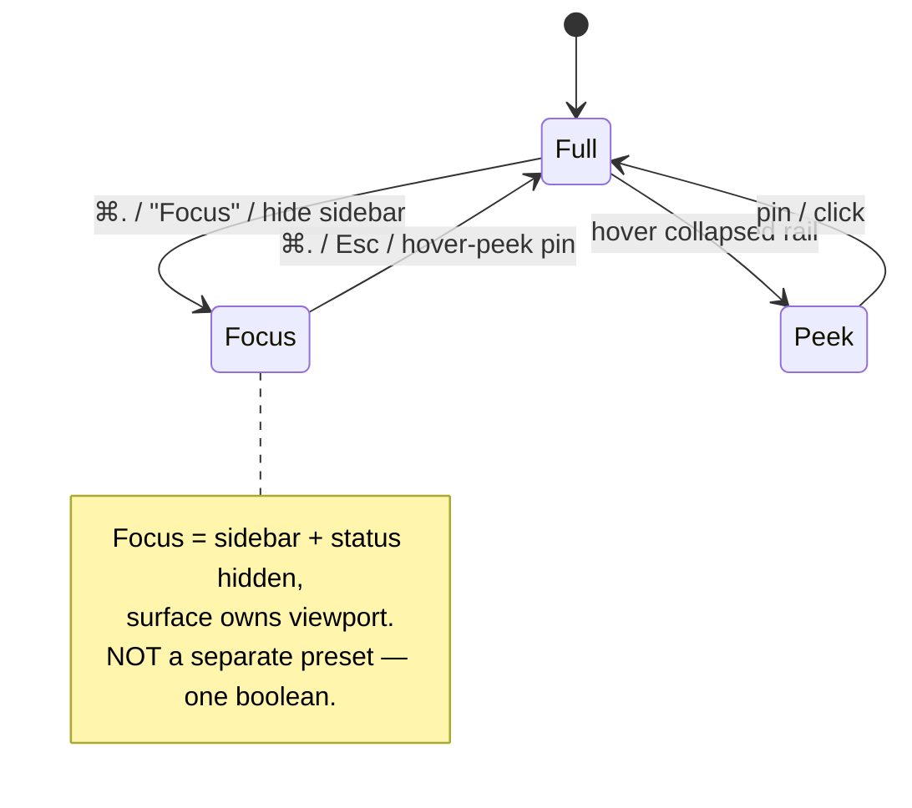

# Coherent Single-Shell Redesign For The Web App

> Status: exploration `[_]` — not yet implemented.
> Sibling context: [[0250_EVERYPERSON_SHELL]], [[0273_QUIET_SURFACE_WORKSPACE_SHELL]],
> [[0280_MALLEABLE_WORKBENCH]], [[0282_WORKSPACE_EDITING_AFFORDANCES]],
> [[0232_COZY_CALM_AGENT_FIRST]]. This exploration proposes **retiring the
> multi-shell grammar those explorations accreted** in favour of one shell.

## Problem Statement

The web app does not feel like a single, coherent workspace. It feels like
three overlapping worlds — **quiet**, **calm**, and **workbench** — bolted
together, where:

- Only **workbench** exposes all the features. Switching to calm or quiet
  silently strips Tasks / Today / Data / AI / Chats from any persistent
  surface, with no in-UI hint that they still exist.
- The shell is **janky** — quiet-chrome summoning has documented layout-shift
  and re-summon workarounds; zen and Escape are handled in four different
  places; the same frame layout is duplicated across two renderers.
- Some things are **visibly broken** — a freshly created page renders as a
  blank white void (the editor mounts but shows no title, no placeholder, no
  cursor affordance); an oversized "Durable storage pending" banner eats the
  top third of the viewport on load; the first-run empty state is barren.
- The mental model is **incoherent**: "three views" is a leaky description of
  what is actually _two orthogonal axes plus a third mode axis plus a
  feature-flagged dual renderer_.

The bar the product is being held to is Notion and the Claude desktop app:
one well-composed shell you _want_ to open, where everything is one obvious
click or `⌘K` away.

## Executive Summary

**Collapse the trichotomy into one shell.** There should be exactly one
desktop composition:

- a **single collapsible left sidebar** that always lists every tool
  (Explorer, Chats, Tasks, Today, Data, AI, CRM, Discover, Requests) and the
  currently-orphaned routes (Meetings, Finance, Analytics, Dashboards, Map);
- a **clean content surface** with a real, polished editor (visible title +
  slash-placeholder);
- **`⌘K` command palette** as the universal accelerator (already excellent —
  keep it);
- **Focus / Zen as a _toggle_** (hide chrome), not a separate world.

Mechanically this means: **keep the unified `ShellFrame` renderer, delete the
legacy `CalmShell` / `DesktopWorkbench` fork**, converge the `quiet | calm |
bench` presets into **one default preset that pins the full tool set**, demote
`layout` / `chrome` / `calmMode` from user-facing "modes" to at most a single
`focus` toggle, and fix the four concrete polish/broken issues. The malleable
layout-tree engine (0280) is good infrastructure and stays — we just stop
shipping three incoherent presets over it.

The user has chosen **"one coherent shell"** as the direction and **"write a
plan first"** as the process; this document is that plan.

## Current State In The Repository

### The shell dispatcher is a feature-flagged fork

`apps/web/src/workbench/Workbench.tsx:119` is the true "which shell renders"
decision. Behind the `xnet:experiment:layout-tree` Labs flag
(`isLayoutTreeEnabled()`) it renders the unified `ShellFrame`; otherwise it
renders the **legacy** `CalmShell` / `DesktopWorkbench` fork
(`Workbench.tsx:126-152`):

```
treeShell = isLayoutTreeEnabled()
if treeShell:  compact ? (tabsEnabled ? MobileShell : CalmMobile) : ShellFrame
else if layout==='calm': compact ? CalmMobile : CalmShell
else:                    compact ? MobileShell : DesktopWorkbench
```

So the frame layout (resizable panel grid, zen frame, palette mounting) exists
**twice**: once in `ShellFrame.tsx` (`PinnedFrame` at `:197`, `QuietFrame` at
`:290`) and once in `Workbench.tsx`'s `DesktopWorkbench` (`:165`). Every shell
change must be made in both until the flag flips.

### "Three views" = two axes + a mode + a dual renderer

Stored in `apps/web/src/workbench/state.ts` (`useWorkbench`, zustand+persist,
key `xnet:workbench:v1`):

| Axis            | Values                                  | Meaning                             |
| --------------- | --------------------------------------- | ----------------------------------- |
| `layout`        | `workbench` \| `calm`                   | really just `surface.tabsEnabled`   |
| `chrome`        | `pinned` \| `quiet`                     | persistent vs hover-summoned chrome |
| `calmMode`      | `companion` \| `workspace` \| `network` | the "mode" inside calm/quiet        |
| `mode` (zen)    | `normal` \| `zen`                       | separate axis again                 |
| `discloseLevel` | `0` \| `1` \| `2`                       | ephemeral quiet summon ladder       |
| `arranging`     | bool                                    | Arrange overlay                     |

The three "presets" are just points in this space: **quiet** = calm+quiet,
**calm** = calm+pinned, **bench** = workbench+pinned. `state.ts` itself
documents quiet as "an orthogonal axis (like density vs color), not a third
shell" — the trichotomy is an emergent illusion, not a design.

### Why only workbench exposes everything (the smoking gun)

`packages/plugins/src/workspace/layout-tree.ts:124` — `createPresetTree`. The
**bench** preset pins `explorer` and places `chats/tasks/today/data/ai-chat`
in `dock.left` (`:152-159`). The **calm** and **quiet** presets place only
`navigator` in `dock.left` (`:129`, `:140`). Those five tool views are simply
**not in the calm/quiet trees**, so:

- under `ShellFrame` they are reachable only via `slot.open:*` palette
  commands;
- under the legacy `CalmShell` they are not rendered at all.

CRM / Discover / Requests are demoted into a `NetworkList`
(`apps/web/src/workbench/calm/NetworkList.tsx`) reachable only when "Network
mode" is active.

### Orphaned routes (no nav affordance in _any_ mode)

Cross-referencing `apps/web/src/routes/` against every nav surface (Rail,
ModeSwitch, ListPane, CornerGlyphs): `/meetings`, `/finance`, `/experiments`,
`/analytics`, `/dashboard/*`, `/map/*`, `/lab/*`, `/stories`, `/space/*`,
`/tag/*` have **no button anywhere** — palette or deep-link only.

### Live-driven observations (this session)

Driving the running app (`web-worktree` on :5199, test-bypass identity):

1. **Broken build out of the box** — `@xnetjs/meetings` / `@xnetjs/dictation`
   were unlinked and `@xnetjs/data`'s `dist/` was stale (missing
   `MeetingSchema`, `WorkspaceSchema`, form exports). Worktree-local, fixed by
   `pnpm install` + `turbo run build --filter=./packages/*`, but it signals a
   fragile dev loop for shell work.
2. **Calm default is barren** — a mode rail + two onboarding cards + a large
   empty void.
3. **Workbench is dense/IDE-like** — full icon rail (`Rail.tsx:85`, 12+ icons)
   - Explorer + tab strip + status bar. Not calm, not Notion-like.
4. **~~New page = blank white void~~ — CORRECTED (not a bug).** A first
   screenshot showed a blank surface, but re-verifying live at 1280px and
   1600px shows the editor renders correctly: a bold "Untitled" title, a
   "Start writing…" placeholder (`beforeColor: rgb(113,113,122)`, visible),
   and a cursor. The "blank" frame was the transient **"Loading document…"**
   state (slow first-boot sqlite/OPFS worker) captured before the Yjs doc
   loaded — the known cold-open stall, not an editor defect. No editor fix is
   warranted; the Placeholder extension is already wired
   (`RichTextEditor.tsx:512`) with matching CSS (`editor.css:147`).
5. **Intrusive storage banner** — "Durable storage pending"
   (`StorageWarningBanner.tsx`, driven by `lib/storage-banner.ts`) occupies
   the top of the viewport on load and re-appears on every reload.

### Anchor files

| Concern              | File                                                                |
| -------------------- | ------------------------------------------------------------------- |
| The fork             | `apps/web/src/workbench/Workbench.tsx:119`                          |
| Target renderer      | `apps/web/src/workbench/ShellFrame.tsx:304`                         |
| All axes / store     | `apps/web/src/workbench/state.ts`                                   |
| Preset definitions   | `packages/plugins/src/workspace/layout-tree.ts:124`                 |
| Legacy calm shell    | `apps/web/src/workbench/calm/CalmShell.tsx`                         |
| Route↔mode ownership | `apps/web/src/workbench/calm/modes.ts`                              |
| Full tool rail       | `apps/web/src/workbench/Rail.tsx`                                   |
| View inventory       | `apps/web/src/workbench/builtin-slot-views.tsx`                     |
| Nav mode switch      | `apps/web/src/workbench/calm/ModeSwitch.tsx`                        |
| Editor surface       | tiptap `.ProseMirror` via the page view                             |
| Storage banner       | `apps/web/src/components/StorageWarningBanner.tsx` |
| Labs flags           | `apps/web/src/lib/labs.ts`, `apps/web/src/workbench/experiments.ts` |

## Current vs Target (diagram)



## External Research

Prior art for "one shell, collapsible sidebar, palette, focus toggle":

- **Notion** — single persistent left sidebar (collapsible to a hover-peek
  rail), a clean page surface with a prominent title placeholder and a
  `/`-command menu, and `⌘\` to toggle the sidebar. There is exactly **one**
  shell; "focus" is just the collapsed sidebar. No competing "modes."
- **Claude desktop** — left column of top-level destinations (Chat / Projects
  / etc.), a content pane, a command surface; density is uniform. Coherence
  comes from _one_ navigation model, not several.
- **Linear** — the app the repo already emulates for Tasks (0198). One shell,
  a collapsible sidebar, `⌘K` everywhere, and a genuinely fast content area.
  "Focus mode" hides the sidebar; it is not a separate layout.
- **VS Code** — the _cautionary_ example: an Activity Bar + Side Bar + Panel +
  Editor Groups is powerful but reads as an IDE, not a calm workspace. Our
  current **workbench** preset is drifting toward this. The redesign should
  keep the completeness of workbench but the _calm_ of Notion.

Common thread: **one shell + one collapsible sidebar + one palette + a focus
toggle** is the dominant, well-loved pattern. Multiple co-equal "shell modes"
is not a pattern anyone ships, because it forces users to learn several apps.

Sidebar interaction details worth stealing:

- Collapse to a **hover-peek rail** (icons only) rather than fully vanishing,
  so nav is never more than a hover away (Notion, Linear).
- **Sections with disclosure** (Workspace / Tools / People) instead of a flat
  icon column, so 15+ destinations stay scannable.
- **Pinning / reordering** — our layout-tree already supports this (0280/0282);
  expose it as "customise sidebar," not "arrange a schematic."

## Key Findings

1. The trichotomy is **not a feature, it is an artifact** of three
   explorations (0232 cozy, 0250 everyperson/calm, 0273 quiet) each adding an
   axis without anyone removing the previous shell. There is no user story that
   needs quiet ≠ calm ≠ bench as distinct worlds.
2. The **layout-tree engine (0280) is sound** and worth keeping. The problem
   is the _presets_ layered on it, not the engine. One good preset fixes the
   coherence problem without throwing away the malleable-shell work.
3. **Feature reachability is a data problem**, not a rendering problem: put
   every tool in the one preset's tree and "features hidden in some modes"
   disappears by construction.
4. The **dual renderer is pure cost** — deleting `CalmShell` /
   `DesktopWorkbench` removes ~duplicated frame logic and three of the four
   Escape handlers, and makes every future shell change single-site.
5. The **broken editor and the storage banner are cheap, high-visibility
   wins** that should ship regardless of the architectural work — they are
   most of the "looks broken" feeling.

## Options And Tradeoffs

### Option A — One shell, delete the forks (recommended)

Keep `ShellFrame`, delete `CalmShell` + `DesktopWorkbench`, merge presets into
one, demote axes to a single `focus` toggle, flip the flag on permanently
(then remove it).

- **Pros:** matches the chosen direction; single mental model; single renderer;
  every feature reachable by construction; retires the most-confusing code.
- **Cons:** biggest diff; must migrate persisted `xnet:workbench:v1` state
  (users with `layout:'calm'` etc. must land in the new shell cleanly); mobile
  projections (`MobileShell` / `CalmMobile`) must be reconciled to one path
  too.

### Option B — Keep modes, make them honest

Unify on `ShellFrame`, add the five tool views to the calm/quiet presets, keep
three presets.

- **Pros:** smaller diff; preserves quiet/calm for users who like them.
- **Cons:** _does not solve the stated problem_ — three worlds remain; the
  user explicitly rejected this. Rejected.

### Option C — Anoint workbench, demote the rest to "focus"

Make the bench preset the one true shell, keep quiet as a `focus` toggle over
it, delete calm entirely.

- **Pros:** workbench already exposes everything; smallest path to "one shell."
- **Cons:** bench is the _IDE-like, dense_ one; shipping it as-is keeps the
  "utilitarian, not calm" complaint. Acceptable only if paired with a real
  visual calm-down pass on the sidebar/surface.

**A is the target; C is the pragmatic first delivery of A** — anoint one
preset, calm it down, then remove the dead forks and axes. The recommendation
merges them: ship C's convergence, finished to A's cleanliness.

### The `focus` toggle — state design



This one boolean replaces: `chrome: quiet|pinned`, `mode: zen|normal`, and
`discloseLevel: 0|1|2`. The hover-peek behaviour (the good part of quiet) is
preserved as sidebar-collapse, not as a whole posture.

## Recommendation

Ship **Option A, delivered in the order of C** — one shell, calmed down,
forks and axes removed — in four stages so value lands early and risk stays
low:

1. **Polish wins first (no architecture):** fix the blank editor, tame the
   storage banner, warm up the first-run empty state. Independently shippable.
2. **One preset:** collapse `createPresetTree` to a single default that pins a
   sectioned sidebar containing **every** tool + the orphaned routes; make the
   sidebar collapsible to a hover-peek rail.
3. **One toggle:** introduce `focus: boolean`, route `chrome`/`mode`/
   `discloseLevel` through it, migrate persisted state, delete the dead axes
   from the store surface (keep silent migrations).
4. **One renderer:** flip `xnet:experiment:layout-tree` on by default, delete
   `CalmShell` + `DesktopWorkbench` + `ModeSwitch` + `calm/*` mode machinery,
   reconcile mobile to a single `MobileShell`, then remove the flag.

Keep: `ShellFrame`, the layout-tree engine, `⌘K` palette, workspace switcher,
sidebar customise/pin (re-skinned from Arrange), `cozy`/`density`/theme
variants (those are _appearance_, orthogonal and fine).

## Example Code

Target preset — one tree, every tool pinned, sections for scannability:

```ts
// packages/plugins/src/workspace/layout-tree.ts
export function createDefaultTree(): LayoutTree {
  const regions = emptyRegions()
  regions.rail = [place('sidebar', 'pinned', 0)] // one sectioned sidebar, not a mode rail
  regions.status = [place('status', 'pinned', 0)]
  regions['dock.left'] = [
    // Workspace
    place('explorer', 'pinned', 0),
    // Tools — previously bench-only, now always present
    place('chats', 'pinned', 1),
    place('tasks', 'pinned', 2),
    place('today', 'pinned', 3),
    place('data', 'pinned', 4),
    place('ai-chat', 'pinned', 5),
    // People — previously demoted into "Network mode"
    place('crm', 'summoned', 6),
    place('discover', 'summoned', 7),
    place('requests', 'summoned', 8),
    // Formerly orphaned routes get a home
    place('meetings', 'summoned', 9),
    place('finance', 'summoned', 10),
    place('analytics', 'summoned', 11)
  ]
  regions['dock.right'] = [place('context', 'summoned', 0)]
  regions['dock.bottom'] = [
    place('shelf', 'summoned', 0),
    place('capture', 'summoned', 1),
    place('notifications', 'summoned', 2),
    place('sync', 'summoned', 3)
  ]
  return {
    workspaceId: presetWorkspaceId('default'),
    regions,
    surface: { tabsEnabled: true },
    chrome: 'pinned'
  }
}
```

Focus toggle replacing three axes:

```ts
// apps/web/src/workbench/state.ts (sketch)
focus: false,
toggleFocus: () => set((s) => ({ focus: !s.focus })),
// migration v3 -> v4: any of {chrome:'quiet', mode:'zen'} => focus:true; drop calmMode/layout.
```

Editor placeholder fix (the "blank void") — ensure the tiptap Placeholder
extension is configured and its CSS is present:

```ts
Placeholder.configure({
  placeholder: ({ node }) => (node.type.name === 'title' ? 'Untitled' : "Type '/' for commands…"),
  showOnlyWhenEditable: true
})
```

```css
.ProseMirror .is-empty::before {
  content: attr(data-placeholder);
  color: var(--text-tertiary);
  pointer-events: none;
  height: 0;
  float: left;
}
```

## Risks And Open Questions

- **Persisted-state migration.** `xnet:workbench:v1` is at store version 3
  (`state.ts`). Existing users have `layout`/`chrome`/`calmMode`/custom trees
  persisted. The migration must map all of them onto the one shell without a
  blank or broken first paint. _Test: seed each legacy state and boot._
- **Mobile.** `MobileShell` vs `CalmMobile` is the same fork on phones. The
  single-shell decision must extend to compact widths (likely: keep
  `MobileShell`, delete `CalmMobile`). Needs its own pass.
- **Do power users lose "quiet"?** The hover-peek collapsed sidebar + focus
  toggle should recover ~all of quiet's value. Validate with the person who
  championed 0273 before deleting `QuietChrome`.
- **Sidebar length.** 15+ destinations need sections + collapse + pinning to
  stay calm; a flat list would just move the density problem. Design the
  sidebar sections deliberately (Workspace / Tools / People / More).
- **Agent/layout API.** `plugins/workspace-agent-module.ts` exposes
  `workspace_apply_preset` etc.; removing presets changes that contract →
  **changeset (major for `@xnetjs/plugins`)**. Also the stale AI system prompt
  ("You cannot yet modify the workspace", `views/ai-context.ts`) contradicts
  shipped tools and should be corrected in the same pass.
- **`check:view-drift` gate.** `scripts/check-view-drift.mjs` guards the shared
  view core; the preset/renderer changes must keep it green.
- **Changesets.** Publishable packages touched (`@xnetjs/plugins`, possibly
  `@xnetjs/react`) need changesets; a removed preset/agent tool is a **major**.

## Implementation Checklist

### Stage 1 — Polish wins (no architecture change)

- [x] ~~Fix the blank editor surface~~ — **verified as a non-bug.** Re-tested
      live: the editor renders a visible "Untitled" title, "Start writing…"
      placeholder, and cursor. The Placeholder extension + CSS are already
      correctly wired (`RichTextEditor.tsx:512`, `editor.css:147`); the
      original "blank" screenshot was the transient "Loading document…"
      cold-boot state. No change made.
- [x] Tame `StorageOptimiseHint` — make it a dismissible one-line toast /
      status-bar chip, not a top-of-viewport block; persist dismissal.
- [x] Warm up the first-run empty state (a real "create your first page /
      database / canvas" affordance, not just grey text).

### Stage 2 — One preset

- [x] Add `sidebar` slot view (sectioned, collapsible, hover-peek) in
      `builtin-slot-views.tsx`; sections: Workspace / Tools / People / More.
- [x] Replace `createPresetTree(quiet|calm|bench)` with `createDefaultTree()`
      pinning every tool (per Example Code); give the orphaned routes
      (meetings/finance/analytics/dashboards/map) a home in the sidebar.
- [x] Point `ShellFrame` at the single default tree; remove preset switching
      from the palette (`Workspace: Preset: …`).

### Stage 3 — One toggle

- [x] Add `focus: boolean` + `toggleFocus` to the store; bind `⌘.`.
- [x] Route the collapsed-sidebar / hide-chrome behaviour through `focus`;
      delete `chrome`, `mode` (zen), `discloseLevel` from the public store
      surface.
- [x] Write store migration v3→v4 mapping legacy axes onto `focus` + default
      tree; keep it silent and total.

### Stage 4 — One renderer

- [x] Flip `xnet:experiment:layout-tree` on by default.
- [x] Delete `DesktopWorkbench` (in `Workbench.tsx`), `CalmShell`, `ModeSwitch`,
      `ListPane`, `QuietChrome`, `NetworkList`, `CompanionList`, `calm/modes.ts`,
      and dead Escape handlers; reconcile mobile to a single `MobileShell`.
- [x] Update `plugins/workspace-agent-module.ts` (drop `apply_preset`, keep
      move/pin) and fix the stale `views/ai-context.ts` system prompt.
- [x] Remove the Labs flag once parity is confirmed.
- [ ] Changesets for every publishable package touched (major where a
      preset/agent tool/export was removed).

## Validation Checklist

- [ ] Every feature (Explorer, Chats, Tasks, Today, Data, AI, CRM, Discover,
      Requests, Meetings, Finance, Analytics, Dashboards, Map) is reachable
      from the sidebar with **no mode switch** — verified live in the running
      app.
- [x] Creating a new page shows a visible title + placeholder + cursor —
      verified live at 1280px and 1600px (was already working; the "blank"
      report was the transient "Loading document…" state).
- [x] The storage banner no longer blocks the top of the viewport; dismissal
      sticks across reloads — verified live (banner drops to ~2 lines with a
      "What can I do?" disclosure; `--storage-banner-height: 0px` after reload).
- [ ] `focus` toggle hides/reveals chrome with no layout shift and no stranded
      overlay backdrop (the old quiet jank); `Esc` and `⌘.` both exit.
- [ ] Booting from each legacy persisted state (`layout:'calm'`,
      `chrome:'quiet'`, a custom arranged tree) lands in the one shell with a
      correct first paint — no blank `#root`, no missing tools.
- [ ] `pnpm test`, `pnpm lint`, `pnpm typecheck`, `pnpm check:view-drift`,
      `pnpm check:humane-patterns`, and the changeset Stop hook all pass.
- [ ] Mobile (compact width) renders the single shell, not a second fork.
- [ ] Grep confirms `CalmShell` / `DesktopWorkbench` / `ModeSwitch` /
      `createPresetTree` are gone (no dead imports).

## References

- `apps/web/src/workbench/Workbench.tsx:119` — the renderer fork.
- `apps/web/src/workbench/ShellFrame.tsx:304` — the target unified renderer.
- `apps/web/src/workbench/state.ts` — every axis; persist key
  `xnet:workbench:v1`, version 3.
- `packages/plugins/src/workspace/layout-tree.ts:124` — `createPresetTree`
  (the single source of what each mode shows/hides).
- `apps/web/src/workbench/calm/CalmShell.tsx`, `calm/modes.ts`,
  `calm/QuietChrome.tsx`, `calm/NetworkList.tsx` — the legacy fork to retire.
- `apps/web/src/workbench/Rail.tsx`, `builtin-slot-views.tsx` — the tool
  inventory the sidebar must surface.
- `apps/web/src/components/StorageWarningBanner.tsx` + `lib/storage-banner.ts` — the intrusive banner.
- `apps/web/src/lib/labs.ts`, `apps/web/src/workbench/experiments.ts` — the
  `layout-tree` flag to flip and remove.
- Prior explorations: 0232 (cozy/calm), 0250 (everyperson/calm shell), 0273
  (quiet surface), 0280 (malleable workbench / layout tree), 0282 (workspace
  editing affordances).
- Prior art: Notion sidebar + `/`-menu, Claude desktop, Linear focus mode,
  VS Code (cautionary density example).
