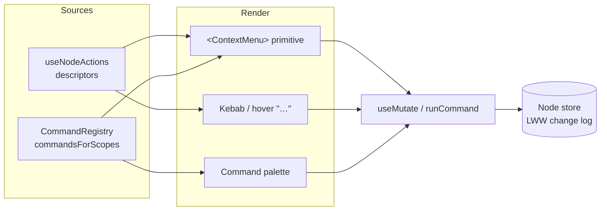
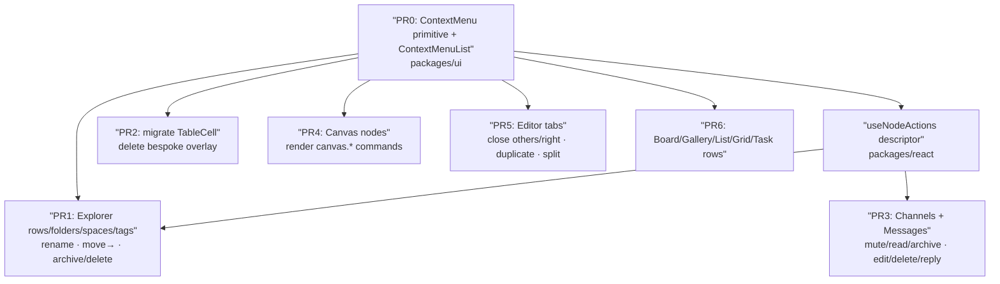
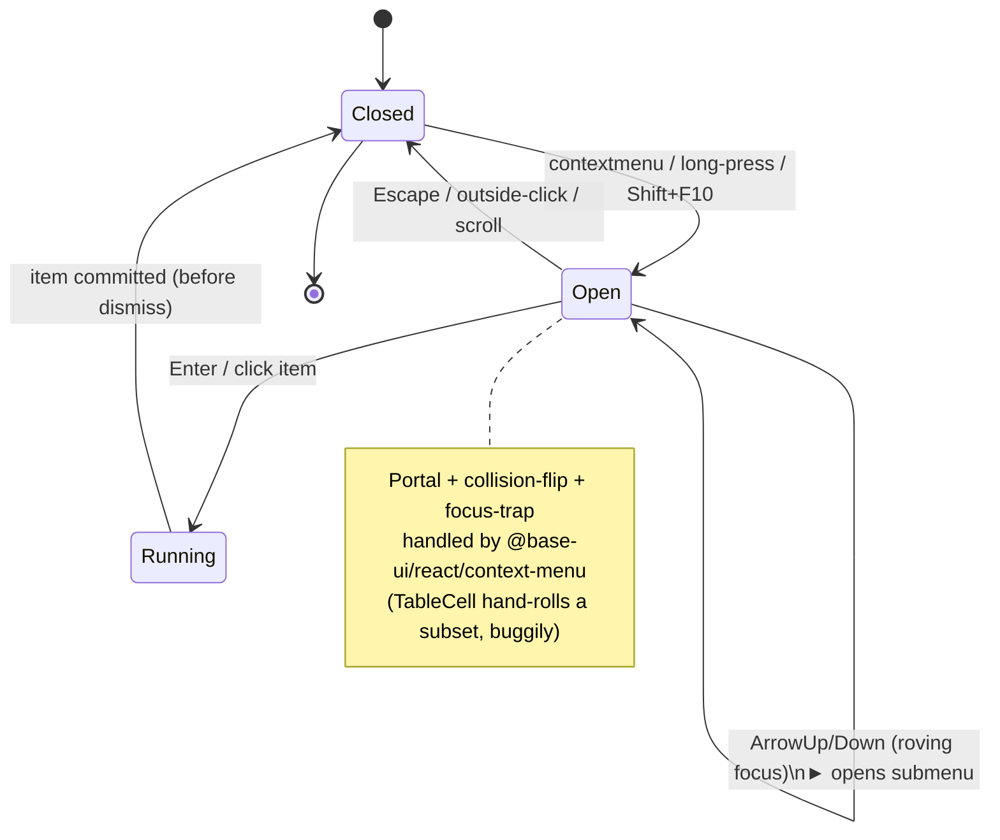

# Right-Click Context Menus Across The UI

> Status: exploration (`[_]`). Successor to the single-shell / workbench
> line of work (0273 → 0280 → 0282 → 0284). Where those explorations made
> _every destination reachable_, this one makes _every object actionable
> in place_.

## Problem Statement

The app has grown a rich object model — pages, databases, canvases,
dashboards, maps, folders, Spaces, tags, channels, DMs, messages, tasks,
board/gallery/list cards, canvas nodes, editor tabs — but the verbs that
act on those objects are scattered and inconsistent:

- Some actions hide behind **hover-revealed icon buttons** (Explorer node
  rows, folder rows, list items).
- Some hide behind a **kebab / "…" popover** (per-person, per-message).
- Some are **keyboard-only** (grid keymap, canvas command scope).
- Some are **middle-click / double-click gestures with no discoverable
  menu** (editor tabs).
- Exactly **one** surface supports right-click today — a table cell — and
  it is a bespoke, non-portaled, un-themed overlay.

The user's ask, in their words: _"anywhere where it makes sense to
right-click … show all the options for that thing — rename it, move it
into a workspace, archive it."_ Concretely they called out the **Explorer
panel**, the **Channels tab**, and **chats**, then generalized to _"let's
go through the whole UI."_

Right-click is the muscle-memory affordance for "what can I do with
_this_?" Its absence means every object type teaches a different gesture,
and several common verbs (rename a page from the sidebar, archive a
channel, delete a message, act on a canvas node) have **no pointer path at
all** today.

## Executive Summary

**Recommendation: build one themed `ContextMenu` primitive on the
already-installed-but-unused `@base-ui/react/context-menu`, back it with a
small declarative "action descriptor" model, and roll it out surface by
surface — Explorer first, then Channels/Chats, Canvas, Tabs, and the
data-view rows.**

Three findings make this cheap and safe:

1. **The primitive is already in the dependency tree.** `@base-ui/react`
   `^1.1.0` ships a first-class `context-menu` module that reuses the same
   `Menu.*` parts we already wrap in
   [`packages/ui/src/primitives/Menu.tsx`](../../packages/ui/src/primitives/Menu.tsx).
   It handles pointer-anchoring, portaling, collision/flip, focus
   trapping, `Escape`/outside-click dismissal, submenus, and keyboard
   activation (`Menu` key / `Shift+F10`) natively — everything the
   hand-rolled table overlay does manually and incompletely.

2. **The action source already exists.** The workspace
   [`CommandRegistry`](../../packages/plugins/src/commands.ts) has a
   `commandsForScopes()` method whose own doc comment says it exists so a
   "context-aware command menu can surface the focused-task verbs." Canvas
   already registers its full verb set there
   ([`useCanvasCommands.ts`](../../packages/views/src/canvas-view/useCanvasCommands.ts));
   the palette already reads it. A context menu is a third consumer of the
   same registry, not a new action system.

3. **The mutations already exist.** `rename` / `move` / `archive` /
   `delete` all reduce to `useMutate` ops
   ([`packages/react/src/hooks/useMutate.ts`](../../packages/react/src/hooks/useMutate.ts):
   `create | update | delete | restore`). The one real _data_ gap is that
   only `Space`, `Tag`, and `Channel` carry an `archived` field — document
   nodes can only be soft-deleted (with `restore`). That shapes the menu
   copy, not the plumbing.

The work is therefore **~1 primitive + 1 descriptor helper + N thin
wirings**, not a framework.

## Current State In The Repository

### The single existing right-click menu (the anti-pattern to replace)

[`packages/views/src/table/TableCell.tsx`](../../packages/views/src/table/TableCell.tsx)
is the only `onContextMenu` in `apps/` or `packages/` source. It is fully
bespoke:

- `useState<{x:number;y:number}|null>` for open state (line ~52).
- `onContextMenu` → `e.preventDefault(); setContextMenu({x,y})` (lines
  ~244, wired at ~448/479).
- A manual `useEffect` adding `document` `mousedown` + `keydown`
  listeners for outside-click / `Escape` (lines ~254–270).
- A raw, **non-portaled** `<div className="fixed z-50 …" style={{left,
top}}>` (lines ~367–435) with naive absolute positioning — **no
  viewport-edge flipping**.
- Items are plain `<button>`s styled with raw Tailwind grays
  (`bg-white dark:bg-gray-900`, `hover:bg-gray-100`) **instead of** the
  design tokens (`bg-popover`, `bg-accent`, `text-destructive`) the real
  primitives use, and it uses `animate-in fade-in-0` rather than the
  repo's motion tokens.

It works, but it is exactly what a shared primitive should absorb.

### The menu primitives we already have (Base UI)

All menus are Base UI, package `@base-ui/react` `^1.1.0` (note: the modern
`@base-ui/react`, not the older `@base-ui-components/react`):

- [`packages/ui/src/primitives/Menu.tsx`](../../packages/ui/src/primitives/Menu.tsx)
  — wraps `@base-ui/react/menu`. Exports both a simple API (`Menu`,
  `MenuItem` with `icon`/`shortcut`/`disabled`/`danger`, `MenuSeparator`,
  `MenuLabel`) and the compound `DropdownMenu*` set (incl.
  `Checkbox/Radio/Sub` items). Structure: `Root › Trigger render={…} ›
Portal › Positioner › Popup`.
- [`packages/ui/src/primitives/Popover.tsx`](../../packages/ui/src/primitives/Popover.tsx)
  — `@base-ui/react/popover`.
- [`packages/ui/src/base-ui/index.ts`](../../packages/ui/src/base-ui/index.ts)
  — a thin barrel that `export *`s a dozen Base UI subpaths
  (`menu`, `popover`, `dialog`, …). **It does _not_ re-export
  `context-menu`.**

**Key finding:** `@base-ui/react/context-menu` exists in the installed
version, is unused, and its parts (`Root`, `Trigger`, `Backdrop`,
`Portal`, `Positioner`, `Popup`, `Arrow`, `Group`, `GroupLabel`, `Item`,
`CheckboxItem`, `RadioGroup/RadioItem`, `SubmenuRoot`, `SubmenuTrigger`,
`Separator`) are the **same underlying `Menu.*` part components** — so a
`ContextMenu.tsx` primitive can mirror `Menu.tsx`'s styling almost
verbatim, swapping the click `Trigger` for a pointer-anchored one.

### The action / command infrastructure

- [`packages/plugins/src/commands.ts`](../../packages/plugins/src/commands.ts)
  — `CommandRegistry` + `getCommandRegistry()` singleton. `WorkspaceCommand`
  is `{ id, title, scope?, key?, allowInInput?, when?(), run(ctx) }` (the
  interface's own example is `id: 'task.setStatus'`, `title: 'Change
status…'`). Methods a context menu wants: `commandsForScopes(scopes)`
  (built for exactly this), `getAvailableCommands()`, `runCommand(id)`,
  `formatForDisplay('Mod-K') → '⌘K'` for shortcut hints.
- [`packages/views/src/canvas-view/useCanvasCommands.ts`](../../packages/views/src/canvas-view/useCanvasCommands.ts)
  — the reference pattern: registers `canvas.*` verbs under scope
  `surface:canvas` with `when` guards (`hasSelection`, `hasFrameSelection`,
  …). A canvas right-click menu is a rendering of these.
- **Fragmentation to note:**
  [`packages/ui/src/composed/CommandPalette.tsx`](../../packages/ui/src/composed/CommandPalette.tsx)
  defines a _second_, older `PaletteCommand` model (`{ id, name, icon,
shortcut, keywords, group, execute(), when() }`) built on `cmdk`. Two
  command shapes coexist; the context-menu work should standardize on
  `WorkspaceCommand`, not add a third.

### The mutation layer (rename / move / archive / delete)

- [`packages/react/src/hooks/useMutate.ts`](../../packages/react/src/hooks/useMutate.ts)
  — `create`, `update`, `remove`, `restore`, and transactional
  `mutate([...])` with op union `create | update | delete | restore`.
- [`packages/react/src/hooks/useNode.ts`](../../packages/react/src/hooks/useNode.ts)
  — per-node `update(props)` and `remove()` (soft delete).
- **Rename** = `update` on `name`/`title`. **Move to workspace** =
  `useSpaces().setNodeSpace(nodeId, spaceId)` writing `{ space }` on the
  node ([`apps/web/src/hooks/useSpaces.ts`](../../apps/web/src/hooks/useSpaces.ts)).
  **Move to folder** = `useExplorerFolders().moveItemToFolder(...)`.
  **Delete** = `remove(id)` (soft delete, paired with `restore(id)` — Trash
  semantics already exist).
- **Archive gap:** `archived: checkbox({default:false})` exists **only** on
  [`space.ts`](../../packages/data/src/schema/schemas/space.ts),
  [`tag.ts`](../../packages/data/src/schema/schemas/tag.ts), and
  [`channel.ts`](../../packages/data/src/schema/schemas/channel.ts).
  Pages / databases / canvases / dashboards / maps have **no** `archived`
  field. So "Archive" is a real menu item for Spaces/Tags/Channels; for
  document nodes the honest verb is "Delete" (→ Trash) until/unless we add
  an `archived` field to the document schemas.

### Surface inventory — where right-click makes sense

| Surface                             | File                                                                                                                                   | Unit                         | Actions today (how)                                                                 | Gap a menu fills                                                       |
| ----------------------------------- | -------------------------------------------------------------------------------------------------------------------------------------- | ---------------------------- | ----------------------------------------------------------------------------------- | ---------------------------------------------------------------------- |
| **Explorer node row**               | [`explorer-rows.tsx`](../../apps/web/src/workbench/views/explorer-rows.tsx)                                                            | page/db/canvas/dashboard/map | open, pin-to-Desk, move-to-Space, move-to-folder, sidebar-pin — all **hover icons** | **rename, delete/Trash** (no path today)                               |
| **Explorer folder row**             | [`ExplorerFolderTree.tsx`](../../apps/web/src/workbench/views/ExplorerFolderTree.tsx)                                                  | folder                       | new page, rename (inline), delete — hover icons                                     | one discoverable menu                                                  |
| **Explorer Space row**              | [`ExplorerSpacesSection.tsx`](../../apps/web/src/workbench/views/ExplorerSpacesSection.tsx)                                            | Space                        | open, invite — hover icons                                                          | rename/archive/visibility/re-parent (exist in `useSpaces`, unsurfaced) |
| **Explorer tag row**                | [`ExplorerTagsSection.tsx`](../../apps/web/src/workbench/views/ExplorerTagsSection.tsx)                                                | tag                          | open only                                                                           | rename/archive                                                         |
| **Channel / DM row**                | [`ChatsPanel.tsx`](../../apps/web/src/comms/ChatsPanel.tsx)                                                                            | channel                      | open only                                                                           | mute / mark-read / archive / leave / pin (mostly net-new)              |
| **Message**                         | [`MessageRow.tsx`](../../apps/web/src/comms/MessageRow.tsx) + [`MessageActions.tsx`](../../apps/web/src/components/MessageActions.tsx) | message                      | react/reply/edit (hover toolbar), report/label (popover)                            | copy, edit, **delete/redact** (`redactMessage` exists, unused), reply  |
| **Table cell/row**                  | [`TableCell.tsx`](../../packages/views/src/table/TableCell.tsx)                                                                        | cell                         | **right-click ✅ (bespoke)**                                                        | migrate to primitive                                                   |
| **Grid cell/row**                   | [`grid/GridSurface.tsx`](../../packages/views/src/grid/GridSurface.tsx)                                                                | cell/row                     | keymap + clipboard                                                                  | cut/copy/paste/insert/delete row                                       |
| **Board / Gallery / Timeline card** | `board/BoardCard.tsx`, `gallery/GalleryCard.tsx`, `timeline/TimelineBar.tsx`                                                           | card                         | `onClick` only                                                                      | open/edit/delete/move                                                  |
| **List item**                       | [`list/ListItem.tsx`](../../packages/views/src/list/ListItem.tsx)                                                                      | row                          | onClick + hover-delete                                                              | full row verbs                                                         |
| **Canvas node**                     | [`CanvasNodeComponent.tsx`](../../packages/canvas/src/nodes/CanvasNodeComponent.tsx)                                                   | node                         | select/double-click; **right-click ignored** (asserted by a test)                   | the whole `canvas.*` command set + HUD verbs                           |
| **Task row**                        | [`TaskListGrouped.tsx`](../../packages/views/src/tasks/TaskListGrouped.tsx)                                                            | task                         | status glyph dropdown, multi-select                                                 | set status/priority/assignee, delete, open                             |
| **Editor tab**                      | [`TabBar.tsx`](../../apps/web/src/workbench/TabBar.tsx)                                                                                | tab                          | activate/promote/middle-close/pin/drag                                              | Close others / Close to right / Duplicate / Split / Pin                |

## External Research

### Base UI `ContextMenu` (our library)

Base UI's `ContextMenu.Trigger` "activates on right click or long press"
and the popup "positions itself at the pointer," in contrast to `Menu`
which anchors to a fixed trigger element. It exposes `LinkItem` for
navigational entries, `SubmenuRoot/SubmenuTrigger` for nesting, and the
full `Checkbox/Radio/Group` set — a superset of what any surface here
needs. Minimal shape:

```tsx
<ContextMenu.Root>
  <ContextMenu.Trigger>…object…</ContextMenu.Trigger>
  <ContextMenu.Portal>
    <ContextMenu.Positioner>
      <ContextMenu.Popup>
        <ContextMenu.Item>Rename</ContextMenu.Item>
        <ContextMenu.Separator />
        <ContextMenu.Item>Delete</ContextMenu.Item>
      </ContextMenu.Popup>
    </ContextMenu.Positioner>
  </ContextMenu.Portal>
</ContextMenu.Root>
```

Long-press support matters: it is the mobile/touch equivalent of
right-click, and the app already ships a mobile shell
(0196/0238). Base UI gives us that for free.

### Context-menu UX guidance (NN/g, Mobbin, icons8)

Distilled principles that shape the design:

- **Right-click must never be the _only_ path.** Not all users know to
  right-click; provide a redundant affordance (kebab button and/or
  keyboard shortcut). Critical actions should have both. → We keep the
  hover kebab and add right-click as a second door onto the _same_ action
  list.
- **Keep menus shallow and short** (< ~10–12 items); group with
  separators; one submenu level max for "Move to →".
- **Show shortcuts inline** so users graduate to the keyboard — we already
  have `formatForDisplay()` for this.
- **Only object-relevant verbs.** The menu is a projection of "what
  applies to _this_ object in _this_ state," which maps directly onto
  `when()` guards.
- **Consistent invocation across devices** — right-click ⇔ long-press ⇔
  kebab, all rendering the identical list.

### Prior art in comparable apps

- **VS Code** builds every context menu from a single `MenuRegistry`
  keyed by menu-id with `when`-clause visibility — the strongest argument
  for the registry-backed (not per-component) approach.
- **Notion / Linear / Slack** all pair a right-click menu with a hover "…"
  button that opens the _same_ menu, exactly the redundancy NN/g
  prescribes. Linear additionally makes the menu multi-select-aware (act
  on all selected rows) — relevant to our Tasks/Grid/Canvas multi-select.

## Key Findings

1. **Greenfield with one template.** 12+ surfaces want right-click; one
   (table cell) has it, bespoke. Nothing else binds `onContextMenu`;
   canvas actively ignores it.
2. **The primitive is a dependency we already pay for** — `@base-ui/react`
   `context-menu`, unused. No new package, no bundle regression of note.
3. **A registry-backed action model already exists and was designed for
   this** (`commandsForScopes`), but coexists with an older `PaletteCommand`
   model. Consolidation opportunity, or at least "don't add a third."
4. **Mutations are uniform** (`useMutate`), so per-surface wiring is thin.
5. **The archive verb is data-gated:** real for Space/Tag/Channel;
   for document nodes it's Delete-to-Trash unless we extend the schemas
   (a **major**-ish, migration-bearing decision — see Risks).
6. **Discoverability is a design constraint, not an afterthought** — the
   menu must supplement, not replace, visible affordances, and must have a
   keyboard equivalent.
7. **No z-index tokens exist** — everything uses literal `z-50`. Stacking a
   context menu over an open Popover/Sheet/Modal needs a deliberate choice
   (Base UI portals to `document.body`, so DOM order mostly handles it, but
   nested-in-dialog cases need testing).

## Options And Tradeoffs

### A. The primitive: how do we render the menu?

| Option                                                                     | Pros                                                                                                                                                    | Cons                                                                                                               |
| -------------------------------------------------------------------------- | ------------------------------------------------------------------------------------------------------------------------------------------------------- | ------------------------------------------------------------------------------------------------------------------ |
| **A1. Wrap `@base-ui/react/context-menu`** ✅                              | Pointer-anchor, portal, collision, focus, keyboard, submenus, long-press — all free; styling mirrors `Menu.tsx`; consistent with the rest of the UI kit | Must add the wrapper + barrel export                                                                               |
| A2. Generalize the `TableCell` hand-rolled overlay into a hook             | No new dependency surface                                                                                                                               | Re-implements (badly) what A1 gives free: no flip, no focus trap, no keyboard, no long-press; diverges from tokens |
| A3. Reuse `DropdownMenu` anchored to a synthetic 1×1 element at the cursor | Uses an already-wrapped primitive                                                                                                                       | Fights the library; `DropdownMenu` isn't pointer-anchored; hacky positioning                                       |

**Pick A1.** It's strictly less code than A2 and correct by construction.
Note the prior-art lesson from
[`PanelViewHost.tsx`](../../apps/web/src/workbench/PanelViewHost.tsx)'s
`MoveViewMenu`: it deliberately chose a Base UI `DropdownMenu` over a
hand-rolled `Popover` because "menu item selection commits before the menu
dismisses, which kills the click-vs-outside-dismissal race" (0282). The
context-menu primitive inherits that same correct behavior.

### B. The action source: where do menu items come from?

| Option                                                                                                   | Pros                                                                                                                                               | Cons                                                                                                                                   |
| -------------------------------------------------------------------------------------------------------- | -------------------------------------------------------------------------------------------------------------------------------------------------- | -------------------------------------------------------------------------------------------------------------------------------------- |
| **B1. Declarative `Action` descriptors per object type**, optionally sourced from the CommandRegistry ✅ | One list per object powers right-click **and** the kebab **and** (eventually) the palette; `when()` gives state-aware items; testable in isolation | Requires defining the descriptor type + per-type action lists                                                                          |
| B2. Inline JSX `<ContextMenu.Item>`s at each call site (like TableCell)                                  | Fastest for the first surface                                                                                                                      | N copies drift; no reuse between kebab and right-click; no single source of truth                                                      |
| B3. Everything must be a registered `WorkspaceCommand` first                                             | Maximal unification; palette parity for free                                                                                                       | Heavyweight for object-scoped verbs that need the object instance as an argument; scope plumbing for transient right-clicks is awkward |

**Pick B1**, with a bridge to B3: object-type action lists are plain data;
where a verb already exists as a `WorkspaceCommand` (canvas, tasks), the
descriptor's `run` just calls `getCommandRegistry().runCommand(id)`. This
gets us reuse without forcing every row verb through scope activation.



### C. Rollout shape

| Option                                                                        | Pros                                                                                          | Cons                                                                                                                                    |
| ----------------------------------------------------------------------------- | --------------------------------------------------------------------------------------------- | --------------------------------------------------------------------------------------------------------------------------------------- |
| **C1. Primitive + descriptor first, then Explorer, then fan out by value** ✅ | De-risks the primitive on the user's #1 surface; each surface is an independent, shippable PR | Multiple PRs                                                                                                                            |
| C2. Big-bang every surface at once                                            | One review                                                                                    | Huge diff; couples unrelated surfaces; hard to validate                                                                                 |
| C3. Only do the three the user named (Explorer, Channels, Chats)              | Smallest scope                                                                                | Leaves the highest-value surface (Canvas) and the most-broken one (TableCell) untouched; re-opens the "inconsistent gestures" complaint |

**Pick C1**, sequenced by value: **Explorer → migrate TableCell → Channels
& Messages → Canvas → Tabs → remaining data-view cards.**

## Recommendation

Build **`ContextMenu` in `packages/ui`** on `@base-ui/react/context-menu`,
plus a small **`ContextMenuList` convenience** that renders an `Action[]`
descriptor array (icons, shortcuts, danger styling, separators, `Move to
→` submenu, `disabled`/hidden via `when`). Add a
**`useNodeActions(node)`** helper in `packages/react` that returns the
descriptor list for an Explorer/data node, wiring the existing
`useMutate` / `useSpaces` / `useExplorerFolders` verbs and reusing the same
list for the existing hover kebabs.

Then wire surfaces in this order, each its own PR:



Guardrails, per repo conventions:

- **Discoverability:** every right-click menu is mirrored by a visible
  kebab (keep existing hover buttons; have them open the _same_
  `ContextMenuList`). Right-click is an accelerator, never the sole path.
- **Keyboard:** Base UI handles `Shift+F10` / `Menu` key to open on the
  focused row; ensure rows are focusable (`tabIndex`).
- **Multi-select aware:** on Canvas/Grid/Tasks, if the right-clicked object
  is within an existing selection, the menu acts on the whole selection
  (Linear's rule); otherwise it selects-then-acts on the single object.
- **Barrel policy (0276):** the new primitive is exported from a **scoped
  sub-barrel** re-exported once from the `@xnetjs/ui` root — not five new
  root-barrel lines. `context-menu` also gets added to
  `packages/ui/src/base-ui/index.ts`.
- **Changeset:** `@xnetjs/ui` gains a new public export ⇒ **minor**;
  `@xnetjs/react` gaining `useNodeActions` ⇒ **minor**. Wirings in `apps/`
  need no changeset.

## Example Code

### 1. The primitive — `packages/ui/src/primitives/ContextMenu.tsx`

Mirrors `Menu.tsx` but on the pointer-anchored module. Same tokens, same
motion.

```tsx
import { ContextMenu as BaseContextMenu } from '@base-ui/react/context-menu'
import * as React from 'react'
import { cn } from '../utils'

/** Wrap any element; right-click / long-press within it opens `menu`. */
export function ContextMenu({
  children,
  menu,
  className
}: {
  children: React.ReactNode
  menu: React.ReactNode
  className?: string
}) {
  return (
    <BaseContextMenu.Root>
      <BaseContextMenu.Trigger className={className}>{children}</BaseContextMenu.Trigger>
      <BaseContextMenu.Portal>
        <BaseContextMenu.Positioner className="outline-none">
          <BaseContextMenu.Popup
            className={cn(
              'z-50 min-w-[10rem] overflow-hidden',
              'rounded-md border border-border bg-popover p-1 text-popover-foreground',
              'opacity-0 scale-95 data-[open]:opacity-100 data-[open]:scale-100',
              'transition-[opacity,transform] duration-fast ease-out',
              'data-[ending-style]:opacity-0 data-[ending-style]:scale-95'
            )}
          >
            {menu}
          </BaseContextMenu.Popup>
        </BaseContextMenu.Positioner>
      </BaseContextMenu.Portal>
    </BaseContextMenu.Root>
  )
}

export const ContextMenuItem = React.forwardRef<
  HTMLDivElement,
  React.ComponentPropsWithoutRef<typeof BaseContextMenu.Item> & { danger?: boolean }
>(({ className, danger, ...props }, ref) => (
  <BaseContextMenu.Item
    ref={ref}
    className={cn(
      'relative flex cursor-default select-none items-center gap-2 rounded-sm px-2 py-1.5 text-sm outline-none',
      'data-[highlighted]:bg-accent data-[highlighted]:text-accent-foreground',
      'data-[disabled]:pointer-events-none data-[disabled]:opacity-50',
      '[&>svg]:size-4 [&>svg]:shrink-0',
      danger &&
        'text-destructive data-[highlighted]:bg-destructive/10 data-[highlighted]:text-destructive',
      className
    )}
    {...props}
  />
))
ContextMenuItem.displayName = 'ContextMenuItem'

export const ContextMenuSeparator = () => (
  <BaseContextMenu.Separator className="-mx-1 my-1 h-px bg-border" />
)
```

### 2. The descriptor + list renderer

```tsx
// packages/ui/src/composed/ActionMenu.tsx
export interface Action {
  id: string
  label: string
  icon?: React.ReactNode
  shortcut?: string // pre-formatted, e.g. via formatForDisplay()
  danger?: boolean
  disabled?: boolean
  when?: () => boolean // hidden when false
  run: () => void | Promise<void>
  children?: Action[] // one level of submenu ("Move to →")
}

export function ActionMenuList({ actions }: { actions: Action[] }) {
  return (
    <>
      {actions
        .filter((a) => a.when?.() ?? true)
        .map((a) =>
          a.id === '---' ? (
            <ContextMenuSeparator key={Math.random()} />
          ) : a.children ? (
            <BaseContextMenu.SubmenuRoot key={a.id}>
              <BaseContextMenu.SubmenuTrigger className="…">
                {a.label}
              </BaseContextMenu.SubmenuTrigger>
              <BaseContextMenu.Portal>
                <BaseContextMenu.Positioner>
                  <BaseContextMenu.Popup className="…">
                    <ActionMenuList actions={a.children} />
                  </BaseContextMenu.Popup>
                </BaseContextMenu.Positioner>
              </BaseContextMenu.Portal>
            </BaseContextMenu.SubmenuRoot>
          ) : (
            <ContextMenuItem
              key={a.id}
              danger={a.danger}
              disabled={a.disabled}
              onClick={() => void a.run()}
            >
              {a.icon}
              <span className="flex-1">{a.label}</span>
              {a.shortcut && (
                <span className="ml-auto text-xs text-foreground-muted">{a.shortcut}</span>
              )}
            </ContextMenuItem>
          )
        )}
    </>
  )
}
```

### 3. The node action descriptor — `packages/react/src/hooks/useNodeActions.ts`

```tsx
export function useNodeActions(node: {
  id: string
  type: ExplorerNodeType
  title: string
}): Action[] {
  const { update, remove } = useMutate()
  const { spaces, setNodeSpace } = useSpaces()
  const { folders, moveItemToFolder } = useExplorerFolders()
  const canArchive = node.type === 'space' || node.type === 'tag' // schema-gated

  return [
    { id: 'open', label: 'Open', run: () => navigateToNode(node) },
    { id: 'rename', label: 'Rename…', run: () => beginInlineRename(node.id) },
    {
      id: 'move-space',
      label: 'Move to workspace',
      children: spaces.map((s) => ({
        id: `space:${s.id}`,
        label: s.name,
        run: () => setNodeSpace(node.id, s.id)
      }))
    },
    {
      id: 'move-folder',
      label: 'Move to folder',
      children: folders.map((f) => ({
        id: `folder:${f.id}`,
        label: f.name,
        run: () => moveItemToFolder(node, f.id)
      }))
    },
    { id: '---', label: '' },
    canArchive
      ? { id: 'archive', label: 'Archive', run: () => update({ id: node.id, archived: true }) }
      : {
          id: 'delete',
          label: 'Delete',
          danger: true,
          run: () => remove(node.id) /* → Trash, restorable */
        }
  ]
}
```

### 4. Wiring an Explorer row (right-click **and** the existing kebab share the list)

```tsx
const actions = useNodeActions(item)
return (
  <ContextMenu menu={<ActionMenuList actions={actions} />}>
    <ExplorerRow
      item={item}
      kebab={
        <Menu trigger={<KebabButton />}>
          <ActionMenuList actions={actions} />
        </Menu>
      }
    />
  </ContextMenu>
)
```

### Lifecycle (what Base UI gives us vs. the current TableCell)



## Risks And Open Questions

- **Archive semantics for document nodes.** Only Space/Tag/Channel have
  `archived`. Options: (a) menu says "Delete" (→ existing soft-delete
  Trash) for documents and reserves "Archive" for the three that support
  it; (b) add an `archived` boolean to the document schemas. (b) is a
  cross-cutting schema change (migration + view filters + a likely
  **major** bump on `@xnetjs/data`) and should be its **own** exploration,
  not smuggled into this one. **Recommend (a) now.**
- **Native browser menu.** `preventDefault()` suppresses the OS menu on our
  targets — intentional, but must be scoped tightly so right-click on
  plain text / links / inputs still yields the native menu (copy, spellcheck,
  "open link in new tab"). The `Trigger` wraps only the object chrome, not
  its editable content.
- **Two command models.** `WorkspaceCommand` vs `PaletteCommand` — pick
  `WorkspaceCommand`; file a follow-up to migrate `CommandPalette.tsx`
  rather than entrench the split.
- **Multi-select intent.** Right-clicking outside the current selection:
  select-then-act vs act-on-hovered. Adopt Linear's rule (act on selection
  if the target is in it, else reset to the single target).
- **Nesting inside dialogs / sheets.** No z-index tokens (all `z-50`). A
  context menu opened from within a Modal/Sheet must stack above it; verify
  Base UI portal ordering, and consider introducing z-index tokens as a
  small prerequisite.
- **Touch/long-press false positives** during drag-to-reorder (Explorer,
  Canvas, Tabs all support drag). Tune the long-press threshold / cancel on
  move.
- **Canvas right-click is currently asserted-ignored** by a test in
  `packages/canvas/src/__tests__/drawing-tools.test.ts`. Enabling the menu
  means updating that test and ensuring pan/marquee gestures bound to the
  pointer don't conflict.
- **Mobile shell parity** — long-press should open the same menu on the
  Capacitor shell; validate there too.

## Implementation Checklist

- [x] Add `export * from '@base-ui/react/context-menu'` to
      [`packages/ui/src/base-ui/index.ts`](../../packages/ui/src/base-ui/index.ts).
- [x] Create `packages/ui/src/primitives/ContextMenu.tsx` (`ContextMenu`,
      `ContextMenuItem`, `ContextMenuSeparator`, submenu parts) mirroring
      `Menu.tsx` tokens/motion.
- [x] Create `packages/ui/src/composed/ActionMenu.tsx` (`Action` type +
      `ActionMenuList`, with one-level submenu + separator support).
- [x] Export both from a **scoped sub-barrel** re-exported once from the
      `@xnetjs/ui` root barrel (0276 policy).
- [x] Add a Storybook story + keep the plugins storybook shim in sync
      (recurring gotcha from 0282/0284).
- [x] Write `packages/react/src/hooks/useNodeActions.ts` bridging
      `useMutate` / `useSpaces` / `useExplorerFolders`; export via the
      hooks sub-barrel.
- [x] **PR1 Explorer:** wrap `ExplorerRow`, `FolderRow`, `SpaceRow`, tag
      rows; add rename (inline) + delete/Trash for node rows; surface
      `renameSpace`/`archiveSpace`/`setSpaceVisibility`/`setSpaceParent`;
      point existing hover kebabs at the same `ActionMenuList`.
- [x] **PR2 TableCell:** replace the bespoke overlay
      ([`TableCell.tsx`](../../packages/views/src/table/TableCell.tsx)
      lines ~52/244–270/367–435) with `ContextMenu`; delete the inline SVG
      icons and manual listeners.
- [x] **PR3 Comms:** channel/DM row menu (mute / mark-read / archive /
      leave / pin — build the missing service verbs) and message menu
      (copy, edit, reply, **delete via `redactMessage`** — currently
      unused, report/label reuse `MessageActions`).
- [ ] **PR4 Canvas:** bind `onContextMenu` on the node component; render
      `commandsForScopes(['surface:canvas'])` via `ActionMenuList`; make it
      multi-select-aware; update the "ignores right-click" test.
- [ ] **PR5 Tabs:** `TabBar` right-click → Close / Close others / Close to
      the right / Pin-Unpin / Duplicate / Split (add the two missing verbs
      to `state.ts`/`tabs.ts`).
- [ ] **PR6 Data cards:** Board/Gallery/List/Timeline/Grid/Task rows via
      the shared list.
- [ ] Add a `.changeset/*.md`: `@xnetjs/ui` **minor** (new export),
      `@xnetjs/react` **minor** (`useNodeActions`).

## Validation Checklist

- [ ] Right-click, long-press (touch), and `Shift+F10`/`Menu`-key all open
      the identical menu on a focused Explorer row.
- [ ] Every menu is also reachable via a visible kebab (no right-click-only
      action anywhere).
- [ ] Rename / Move-to-workspace / Move-to-folder / Delete on an Explorer
      node persist through the change log and survive reload; Delete lands
      in Trash and `restore` brings it back.
- [ ] Archive on a Space/Tag/Channel sets `archived` and the item leaves
      the active list; document nodes show **Delete**, not Archive.
- [ ] Right-click on editable text / a link inside a page still shows the
      **native** browser menu (our trigger doesn't swallow it).
- [ ] Menu flips at viewport edges; opens correctly when the object is near
      the bottom/right; scrolls closed.
- [ ] Menu stacks above an open Sheet/Modal when invoked from within one.
- [ ] Canvas menu acts on the full selection when the target is selected;
      pan/marquee gestures still work; the updated drawing-tools test
      passes.
- [ ] TableCell behaves identically to before (copy/edit/clear/comment/
      delete) with the bespoke overlay removed; no visual regression vs the
      screenshot baseline.
- [ ] Tab "Close others / Close to the right / Duplicate / Split" behave
      correctly with pinned tabs and across split groups.
- [ ] Keyboard shortcut hints in the menu match the registry
      (`formatForDisplay`).
- [ ] Mobile/Capacitor shell: long-press opens the menu; no conflict with
      drag-to-reorder.
- [ ] `pnpm test`, typecheck, and the Fallow/humane-pattern gates pass; the
      Stop-hook changeset check is satisfied.

## References

- Repo — primitive layer: [`packages/ui/src/primitives/Menu.tsx`](../../packages/ui/src/primitives/Menu.tsx),
  [`packages/ui/src/base-ui/index.ts`](../../packages/ui/src/base-ui/index.ts),
  [`packages/ui/src/composed/CommandPalette.tsx`](../../packages/ui/src/composed/CommandPalette.tsx)
- Repo — command/action layer: [`packages/plugins/src/commands.ts`](../../packages/plugins/src/commands.ts),
  [`packages/views/src/canvas-view/useCanvasCommands.ts`](../../packages/views/src/canvas-view/useCanvasCommands.ts)
- Repo — mutation layer: [`packages/react/src/hooks/useMutate.ts`](../../packages/react/src/hooks/useMutate.ts),
  [`packages/react/src/hooks/useNode.ts`](../../packages/react/src/hooks/useNode.ts),
  [`apps/web/src/hooks/useSpaces.ts`](../../apps/web/src/hooks/useSpaces.ts)
- Repo — surfaces: [`explorer-rows.tsx`](../../apps/web/src/workbench/views/explorer-rows.tsx),
  [`ExplorerFolderTree.tsx`](../../apps/web/src/workbench/views/ExplorerFolderTree.tsx),
  [`ChatsPanel.tsx`](../../apps/web/src/comms/ChatsPanel.tsx),
  [`MessageActions.tsx`](../../apps/web/src/components/MessageActions.tsx),
  [`TableCell.tsx`](../../packages/views/src/table/TableCell.tsx),
  [`CanvasNodeComponent.tsx`](../../packages/canvas/src/nodes/CanvasNodeComponent.tsx),
  [`TabBar.tsx`](../../apps/web/src/workbench/TabBar.tsx),
  [`PanelViewHost.tsx`](../../apps/web/src/workbench/PanelViewHost.tsx) (MoveViewMenu prior art)
- Predecessor explorations: [`0284_[x]_COHERENT_SINGLE_SHELL_REDESIGN.md`](./0284_[x]_COHERENT_SINGLE_SHELL_REDESIGN.md),
  [`0282_[x]_WORKSPACE_EDITING_AFFORDANCES_AND_LABS_TOGGLE.md`](./0282_[x]_WORKSPACE_EDITING_AFFORDANCES_AND_LABS_TOGGLE.md),
  [`0280_[x]_MALLEABLE_WORKBENCH_COMPOSABLE_WORKSPACE.md`](./0280_[x]_MALLEABLE_WORKBENCH_COMPOSABLE_WORKSPACE.md)
- Base UI — [ContextMenu component](https://base-ui.com/react/components/context-menu)
- NN/g — [Contextual Menus: 10 Guidelines](https://www.nngroup.com/articles/contextual-menus-guidelines/),
  [Contextual Menus: Delivering Relevant Tools for Tasks](https://www.nngroup.com/articles/contextual-menus/)
- Mobbin — [Context Menu UI Design](https://mobbin.com/glossary/context-menu);
  icons8 — [Hotkey vs. Context menu](https://blog.icons8.com/articles/the-ux-dilemma-hotkeys-vs-context-menus/)
