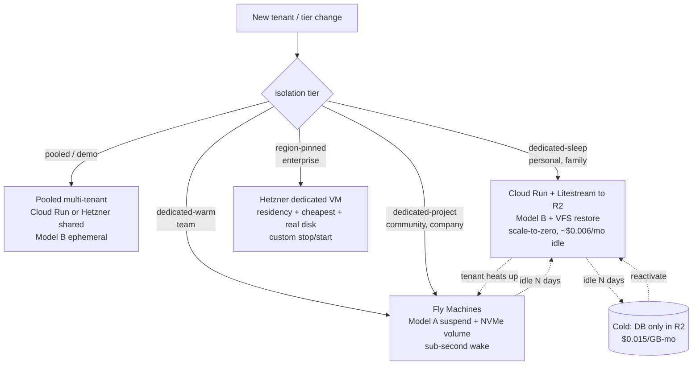
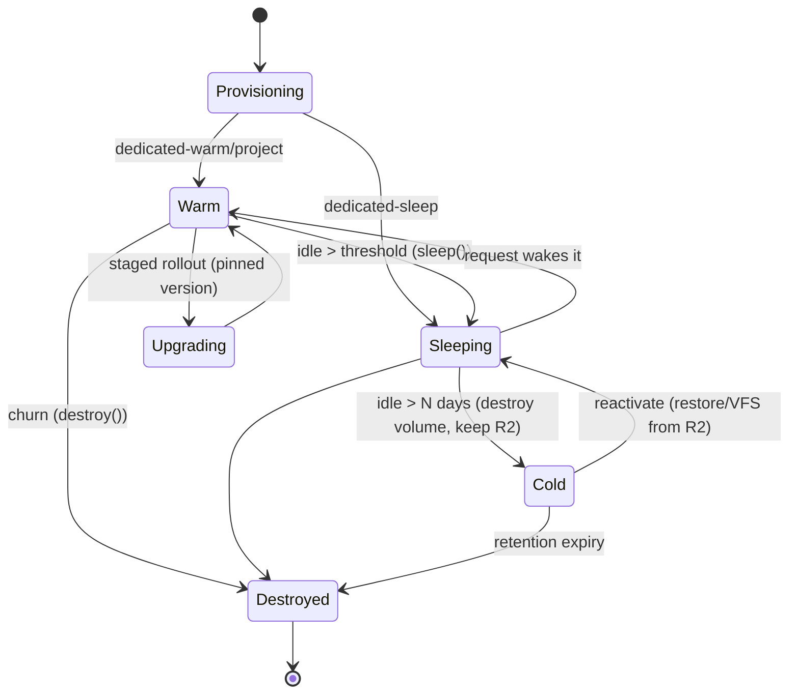
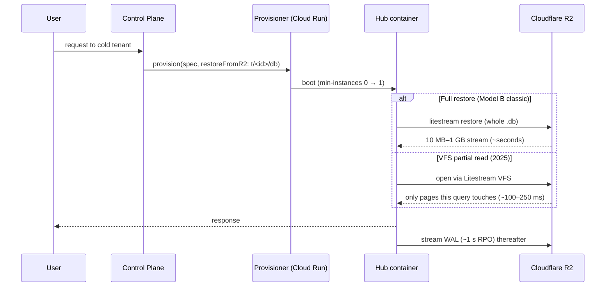

# Alternative Cloud Hosting Substrates — Compute And Storage Tradeoffs

> **Status:** Exploration
> **Date:** 2026-07-08
> **Author:** Claude
> **Tags:** hosting, infrastructure, compute, storage, cloud-run, fly, hetzner,
> fargate, cloudflare-containers, durable-objects, r2, tigris, litestream,
> litestream-vfs, d1, turso, scale-to-zero, reselling-tos, cold-tiering, decision,
> extends-0175, extends-0178

## Problem Statement

xNet Cloud provisions **one isolated hub per tenant** — a Node process running
`better-sqlite3` — and the fleet is dominated by tenants that are idle almost all
the time (free/personal), with a small paying core that is warm or always-on. The
architecture was settled across [0175](./0175_[_]_MANAGED_HUB_FLEET_DEPLOYMENT_AND_AI_GATEWAY.md)
(deploy substrate + AI gateway) and [0178](./0178_[_]_COST_EFFICIENT_SQLITE_HOSTING_NO_LIBSQL_MIGRATION.md)
(keep SQLite, add Litestream → R2, tier by activity). The current lead is **GCP
Cloud Run + Litestream → Cloudflare R2**, and a skeleton adapter for it already
exists ([`cloud-run-litestream.ts`](../../packages/cloud/src/provisioner/adapters/cloud-run-litestream.ts)).

Those decisions are ~13 months old (June 2026 as of writing). This exploration
**re-prices the field with current (mid-2026) numbers, surfaces two constraints
the earlier docs did not have data on, and asks whether the substrate choice still
holds** — separately for **compute** and **storage**, because they scale, bill,
and fail independently. It does *not* re-open the "keep `better-sqlite3`" call
from 0178 (that still stands); it asks *where and how* the fleet runs, and what
the alternatives cost.

Two findings force the re-examination:

1. **Cloud Run has no SQLite-safe persistent disk.** Its only volume options —
   GCS-FUSE and Filestore/NFS — have no working file locking (Google's own docs
   flag GCS-FUSE as "last write wins" and force NFS into no-lock mode). So Cloud
   Run **cannot** host the "durable volume + suspend, resume with the file intact"
   model (Model A in 0178). On Cloud Run every tenant is necessarily
   **ephemeral + restore-from-R2 on boot** (Model B). That silently narrows what
   the lead substrate can do.
2. **Litestream shipped a read-replica VFS in 2025**, which enables *partial-read*
   restore (fetch only the pages a query touches) instead of a full-file download —
   collapsing cold-open latency by roughly an order of magnitude. That changes the
   Model B cost/latency calculus that made 0178 hedge toward Fly for warm tenants.

## Executive Summary

**Keep SQLite + Litestream → R2 (0178 holds). Change nothing about the data
engine. But treat "substrate" as a per-tier decision, not one global bet, and
retire the assumption that Cloud Run is the single answer.** Concretely:

1. **No single substrate wins on all four axes** — cheapest-at-rest, fastest
   wake, SQLite-safe persistence, and reselling-permitted ToS. The right shape is
   a **two-substrate hybrid keyed to the plan's isolation tier** (the
   [`IsolationTier`](../../packages/entitlements/src/plans.ts) enum already exists
   for exactly this), behind the existing `Provisioner` seam.
2. **Cold long tail (demo/personal/family → `pooled`/`dedicated-sleep`): Cloud Run
   + Litestream → R2, Model B.** True scale-to-zero, ~$0.006/mo idle compute,
   managed (no ops), adapter already written. Adopt **Litestream VFS** to bring
   cold-open from 5–30 s (full restore) down to ~sub-second (partial read).
3. **Warm paid tier (team+ → `dedicated-warm`): Fly Machines, Model A.**
   `suspend`/resume gives sub-second wake with the SQLite file intact on local
   NVMe (the one thing Cloud Run structurally cannot do). **Gate on a written OK
   from Fly** — their ToS reselling clause is a gray area (§ below).
4. **Cost-sensitive / region-pinned / backbone (enterprise → `region-pinned`):
   Hetzner dedicated VMs.** Cheapest raw compute by 3–5×, **reselling explicitly
   permitted**, real POSIX disk — at the cost of building your own stop/start
   orchestration. Reserve for when a tenant's volume justifies the ops.
5. **Track Cloudflare Containers + Durable-Object SQLite as a funded spike, not a
   port.** DO-per-tenant is the most elegant "millions of mostly-idle isolated
   units" fit in the entire field — but adopting it means Cloudflare's SQLite
   engine, not `better-sqlite3`, i.e. the *same* data-layer fork 0178 rejected for
   libSQL. Only pursue if edge latency or fleet economics later demand it.
6. **Storage verdict is unchanged and strong: R2 for cold snapshots + blobs
   ($0.015/GB-mo, $0 egress).** The only credible challenger is **Tigris**
   ($0.02/GB, $0 egress) if we ever lean into Fly; Backblaze B2 is cheaper per-GB
   but its free egress is Cloudflare-CDN-gated. Managed SQLite stores (Turso
   $0.45–0.75/GB overage, D1 $0.75/GB) remain 30–50× too expensive for cold data.

## Current State In The Repository

### What's deployed vs. designed

| Piece | Where | State |
| --- | --- | --- |
| Demo hub | Railway, [`railway.toml`](../../railway.toml) → [`packages/hub/Dockerfile`](../../packages/hub/Dockerfile) | **Live.** `--demo`, pooled, ephemeral `/data`. |
| Hub (Fly config) | [`packages/hub/fly.toml`](../../packages/hub/fly.toml) | **Config present**, `auto_stop_machines="suspend"`, `min_machines_running=0`, `/data` volume — Model A ready. |
| Control plane | [`apps/cloud/Dockerfile`](../../apps/cloud/Dockerfile) → Cloud Run | Deployed to staging (0205). Pure-JS closure (Firestore/R2/Stripe), no native modules. |
| Cloud Run provisioner | [`cloud-run-litestream.ts`](../../packages/cloud/src/provisioner/adapters/cloud-run-litestream.ts) | **Skeleton**: talks to a narrow `CloudRunClient` port; real `@google-cloud/run` wiring lives in `apps/cloud`. Sharded 800/project under the 1,000-cap. |
| Fargate provisioner | [`fargate-litestream.ts`](../../packages/cloud/src/provisioner/adapters/fargate-litestream.ts) | **Stub** — every method throws `NotImplementedError`. |
| Litestream in image | [`packages/hub/Dockerfile`](../../packages/hub/Dockerfile) | Pinned **v0.5.3** (0.5.6/0.5.7 silent-skip bug #1083); activated only when `LITESTREAM=1`. |
| Cost model | [`packages/cloud/src/cost/pricing.ts`](../../packages/cloud/src/cost/pricing.ts) | `UNIT_COSTS`: R2 $0.015, Fly vol $0.15, Hetzner vol $0.048, warm $6/mo, active $0.00266/hr. |

### The seam this exploration plugs into

Everything below is expressed through one interface —
[`Provisioner`](../../packages/cloud/src/provisioner/types.ts) — so a substrate
change is an adapter, never a control-plane rewrite:

```ts
interface Provisioner {
  provision(spec: ProvisionSpec): Promise<HubHandle>
  upgrade(ref: string, targetVersion: string): Promise<HubHandle>
  setEnv(ref: string, env: Record<string, string>): Promise<HubHandle>
  sleep(ref: string): Promise<HubHandle>   // scale-to-zero / suspend
  destroy(ref: string): Promise<void>
  get(ref: string): Promise<HubHandle | null>
}
```

And the plan tiers already carry the isolation intent that keys substrate choice
([`plans.ts`](../../packages/entitlements/src/plans.ts)):

```
demo       → pooled            (shared, 10 MiB)
personal   → dedicated-sleep   (scale-to-zero)
family     → dedicated-sleep
team       → dedicated-warm    (min 1 instance)
community  → dedicated-project
company    → dedicated-project
enterprise → region-pinned     (residency)
```

The `minInstances()` logic in the Cloud Run adapter already reads this:
`dedicated-warm → 1`, everyone else → `0`.

## External Research

All figures are mid-2026, from provider pricing/ToS pages (URLs in References).

### The reselling filter (this disqualifies before price matters)

Because xNet Cloud runs **other people's** tenants on rented infra, a "no
reselling compute" clause is a hard disqualifier — it was the open landmine in
0175. Current stances:

| Provider | Reselling multi-tenant SaaS on it | Verdict |
| --- | --- | --- |
| **Railway** | AUP lists "reselling compute resources" as prohibited abuse | ❌ **Blocked** (used only for the single first-party demo hub) |
| **Render** | AUP: no "reselling, renting, leasing… the Service to third parties" | ❌ **Blocked** |
| **Fly.io** | ToS says "internal use," no "benefit of a third party" — **but** Fly's own docs bless per-tenant app-per-customer as the recommended pattern | ⚠️ **Gray** — get written OK first |
| **Hetzner** | ToS: "You are entitled to allow third parties to use the services… You remain the sole contractual partner" | ✅ **Explicitly permitted** |
| **AWS / GCP / Cloudflare** | No analogous clause; multi-tenant SaaS is the marketed core use | ✅ **Fine** (building *your* product, not reselling *their* dashboard) |
| **Koyeb / Northflank** | No explicit clause found | ❓ Unconfirmed — ask before scale |

### Compute — the shortlist

| Substrate | Scale-to-0 | Cold wake | Billing gran. | Smallest / price | SQLite-safe disk? | Fleet ceiling | Resell |
| --- | --- | --- | --- | --- | --- | --- | --- |
| **Cloud Run** (svc) | ✅ default | 0.2–2 s | per-100ms | 0.08 vCPU/128 MiB; ~$0.006/mo idle | ❌ **no** (FUSE/NFS unlocked) | **1,000 svc/project/region** (hard) | ✅ |
| **Fly Machines** | ✅ `suspend`/`stop` | <1 s (suspend) | per-second | `shared-1x` 256 MB ~$2/mo run | ✅ local NVMe volume | soft, raise on ask | ⚠️ |
| **Fargate/ECS** | ✗ native (custom) | **30–45 s** | per-second | 0.25 vCPU/0.5 GB | ⚠️ EBS 1/task, single-AZ | ~4,000 vCPU soft | ✅ |
| **Hetzner VM** | ✗ (build own) | tens of s | hourly | CX22 2v/4G **€3.79/mo** | ✅ real block vol | unbounded (ticket) | ✅✅ |
| **Cloudflare Containers + DO** | ✅ idle sleep | ~1–3 s | per-second | 1/16 vCPU/256 MiB "lite" | ➖ **DO SQLite, not b-sqlite3** | millions of DO (design point) | ✅ |
| **GKE Autopilot** | pod→0 (HPA/KEDA) | low s | per-second | 50m vCPU/52Mi pod | ✅ PD/Filestore CSI | huge | ✅ |
| **k8s+KEDA on Hetzner** | ✅ (KEDA) | 2–10 s | node hourly | Hetzner node price | ✅ Hetzner vol CSI | your capacity | ✅✅ |
| **Render / Koyeb / Northflank** | Render: **free tier only**; others yes | seconds | per-second | Render $7/mo (no s2z on paid) | disk, 1 instance | Render 750 free-hr cap | ❌/❓ |

Sharp edges worth naming:

- **Cloud Run's 1,000-services-per-project-per-region cap is not raiseable** — the
  adapter's `ShardAllocator` (800/project headroom) exists precisely to shard
  across projects. Thousands of tenants ⇒ many GCP projects to babysit.
- **Fargate's 30–45 s cold start** is a non-starter for interactive wake; it only
  makes sense always-warm, where it's more expensive than Fly/Hetzner.
- **Render's paid tier does not scale to zero** — you either eat ~$7/mo/tenant
  always-on or park idle tenants in the shared 750-instance-hour free pool. Wrong
  shape for a mostly-idle fleet.
- **GKE Autopilot carries a ~$73/mo per-cluster management fee** regardless of pod
  scale-to-zero; self-managed k8s on Hetzner removes that but adds an etcd/upgrade/
  CNI ops burden a small team shouldn't take lightly (cross-provider reports: ~70%
  raw-compute savings, but you hire infra engineers to bank it).

### Storage — object store, replication engine, and block volumes

**Object storage (cold DB snapshots + blobs), $/GB-mo + egress:**

| Store | $/GB-mo | Egress | Notes |
| --- | --- | --- | --- |
| **Backblaze B2** | **$0.006** | $0 *only* via Cloudflare/Fastly CDN | cheapest per-GB, egress gated on partner CDN |
| **Cloudflare R2** | **$0.015** | **$0 unconditional** | current pick; Class A $4.50/M, Class B $0.36/M |
| **Tigris** (Fly) | $0.02 | **$0 unconditional** | globally consistent, natural pair *if* we go Fly |
| S3 Standard | $0.023 | 100 GB free then ~$0.09/GB | egress bites every cold restore |
| GCS Standard | $0.020 | ~$0.12/GB | pricier egress than S3 |
| **DO SQLite storage** | $0.20 | n/a (managed) | cheapest *managed DB* storage, but ≠ object store |

**Replication / durability engine (2026 state):**

| Engine | State | Fit |
| --- | --- | --- |
| **Litestream** | Maintained (Fly/Ben Johnson); **read-replica VFS shipped 2025**; ~1 s RPO | ✅ **our engine.** VFS = partial-read cold restore |
| LiteFS | LiteFS Cloud shut Oct 2024; core de-emphasized, FUSE caps ~100 tx/s | ❌ wrong tool for a sleeping fleet |
| Turso / libSQL | libSQL stable; "Turso DB" Rust rewrite still **beta**; storage overage **$0.45–0.75/GB** | ❌ rejected in 0178, price confirms |
| Cloudflare D1 | GA; storage **$0.75/GB**, **10 GB/DB hard cap** | ❌ too pricey + cap forces sharding |
| DO SQLite | GA; storage billing began Jan 2026 @ **$0.20/GB**; 10 GB/DO | ➖ only under the Cloudflare-fork option |
| cr-sqlite / PowerSync / Electric | alive; CRDT / sync layers | ➖ different problem (multi-writer sync) |

**Block volumes (hot DB), $/GB-mo:** Hetzner **€0.057** ≈ $0.062 (repo constant
says 0.048 — stale, bump) · EBS gp3 **$0.08** · GCP pd-balanced ~$0.10 · Fly /
Railway **$0.15** · Render **$0.25** · EFS **$0.30**. Block storage is **4–20×**
pricier per GB than object storage — the entire economic case for tiering idle
tenants out of volumes into R2.

**Cold-restore latency** (the number that decides Model A vs B):

- Full-file download-then-open of a 10 MB–1 GB `.db` from R2: **~seconds to ~10 s**,
  throughput-bound, no vendor SLA — benchmark before promising an RTO.
- **Partial-read VFS** (Litestream VFS / Turbolite-style): fetch only touched
  pages → **~sub-100–250 ms** cold JOINs. ~1 order of magnitude better. This is
  the 2025 development that makes Model B viable for interactive tenants.

## Key Findings

1. **The 0178 hot/warm/cold ladder is right; the substrate mapping was
   incomplete.** Model A (durable volume + suspend, file intact) is a **Fly.io
   capability**, not a Cloud Run one — Cloud Run has no lockable disk, so it is
   **Model B only**. The lead substrate can't cover the whole ladder alone.
2. **Litestream VFS retro-actively strengthens Model B / Cloud Run.** With
   partial-read restore, the cold path's wake penalty largely evaporates, so the
   "must be Fly for warm" pressure eases — Cloud Run can serve further up the tier
   ladder than 0178 assumed.
3. **Reselling ToS is still the first filter, and it re-ranks the field.** Railway
   and Render are out for tenant hosting; Fly is a gray area needing sign-off;
   Hetzner is the only host that *explicitly* welcomes it; the hyperscalers +
   Cloudflare are fine.
4. **Cloudflare DO-SQLite is now the most architecturally elegant fleet fit** —
   one single-writer actor per tenant, millions of them, idle ones hibernate,
   $0.20/GB storage, no FUSE-locking problem at all. Its only (large) cost: it is
   **not `better-sqlite3`**, so it re-opens the exact data-layer fork 0178 closed.
5. **Storage is a solved problem.** R2 wins on the merits ($0 egress is decisive
   for restore-heavy cold tiering); Tigris is the fallback if we commit to Fly;
   managed SQLite stores are disqualified by 30–50× storage overage.
6. **Every path stays behind the `Provisioner` seam.** None of these is a rewrite;
   each is an adapter plus a routing rule keyed on `entitlements.isolation`.

## Options And Tradeoffs

### Substrate decision by plan tier



### The four strategic postures (pick the mix, not one)

| Option | Compute | Storage | Idle cost/tenant | Wake | Reselling | Ops burden | Best for |
| --- | --- | --- | --- | --- | --- | --- | --- |
| **A. Cloud-Run-led (status quo, updated)** | Cloud Run svc, sharded | R2 + Litestream VFS | **~$0.006/mo** (compute) + $0.015/GB | ~sub-s (VFS) / 5–30 s (full) | ✅ | Low (managed) | The cold long tail |
| **B. Fly-led** | Fly Machines suspend | Fly vol $0.15 + Tigris/R2 | vol-bound (~$0.15/GB) | **<1 s** | ⚠️ gray | Low–med | Warm paid tenants |
| **C. Hetzner-led** | Hetzner VMs + own orchestrator | Hetzner vol €0.057 + R2 | node-bound unless you build s2z | tens of s | ✅✅ | **High** | Cost-sensitive / residency / backbone |
| **D. Cloudflare-native** | Workers + Containers + **DO SQLite** | DO SQLite $0.20/GB | near-$0 idle | ~1–3 s | ✅ | Med (but **data-layer fork**) | Edge latency, millions of tiny tenants — *future* |

**Why not "just pick one":**

- **All-Cloud-Run (A only):** clean and managed, but the 1,000/project cap means
  project sprawl at scale, and it structurally can't do sub-second warm wake with a
  live file — so `dedicated-warm` tenants get a worse experience than Fly gives.
- **All-Fly (B only):** best warm wake and SQLite-safe volumes, but the reselling
  clause is an unquantified legal risk at "thousands of tenants," and volumes bill
  even while suspended — the idle long tail is *more* expensive than Cloud Run's
  scale-to-zero-to-$0.006.
- **All-Hetzner (C only):** cheapest and reselling-blessed, but there is **no
  managed scale-to-zero** — you build and operate the stop/start control loop,
  health, upgrades, and multi-AZ durability yourself. 0175's stated constraint was
  "a small team must operate this without a platform org." C violates that unless
  reserved for a few high-value tenants.
- **All-Cloudflare (D only):** the most beautiful fit on paper, but "adopt DO
  SQLite" = re-open the data-engine migration 0178 explicitly closed, plus a CF
  lock-in the `Provisioner` abstraction was built to avoid. Premature.

### Compute cost sanity check (idle-dominated fleet of 10,000 tenants)

Assume 9,000 cold (idle), 900 warm, 100 always-on, ~100 MB DB each.

| Line | A (Cloud-Run + R2) | B (Fly) | C (Hetzner) |
| --- | --- | --- | --- |
| 9,000 cold compute | ~$0 (scale-to-zero) | vol $0.15×0.1 GB×9k = **$135/mo** | node/packing dependent |
| 9,000 cold storage | 900 GB @ $0.015 = **$13.50/mo** | + Fly vol as above | 900 GB @ R2 = **$13.50/mo** |
| 900 warm compute | active-hrs × $0.00266 | suspend, vol-billed | packed VMs |
| 100 always-on | $6/mo ea = **$600/mo** | ~$2–6/mo ea | cheapest raw |
| **Idle-tier takeaway** | **cold tenants ≈ free** | **cold tenants pay volume rent** | cheap iff you build s2z |

The dominant cost in a mostly-idle fleet is **whether idle tenants pay for a
volume**. Cloud Run Model B ($0 idle compute, $0.015/GB cold storage) is
structurally cheapest for the long tail; Fly is structurally cheapest for the warm
middle (sub-second wake, no restore); Hetzner wins only where you can pack many
tenants per always-on node and amortize the ops.

### Tenant lifecycle (unchanged in spirit, sharpened by substrate)



### Cold reactivation with Litestream VFS (the 2025 improvement)



## Recommendation

**Adopt the two-substrate hybrid (Options A + B), keep C and D as named escape
hatches, and make the data engine untouchable.**

1. **Keep `better-sqlite3` + Litestream → R2.** 0178 stands; storage research only
   reconfirms it. Do **not** migrate to libSQL, D1, or DO SQLite for the base case.
2. **Primary (cold long tail) = Cloud Run + Litestream → R2, Model B**, finishing
   the existing [`cloud-run-litestream.ts`](../../packages/cloud/src/provisioner/adapters/cloud-run-litestream.ts)
   adapter's real `@google-cloud/run` wiring in `apps/cloud`. **Add Litestream VFS**
   to the hub entrypoint so cold wake is partial-read, not full-download.
3. **Warm tier = Fly Machines, Model A** via a new `FlyMachinesProvisioner`
   adapter (`fly.toml` already proves the config). **Precondition: written
   confirmation from Fly** that per-tenant SaaS hosting is within ToS. If Fly says
   no, fall back to Cloud Run warm (min-instances 1) and accept it can't hold a
   live file across a true suspend.
4. **Escape hatch = Hetzner** (`HetznerProvisioner`, reselling-blessed) for
   enterprise `region-pinned` / residency and any tenant whose economics justify a
   dedicated packed node. Build the stop/start loop only when the first such tenant
   pays for it — not speculatively.
5. **Retire the Fargate stub** unless an AWS-residency enterprise deal demands it;
   its 30–45 s cold start makes it the worst interactive option in the field.
6. **File a tracked spike for Cloudflare Containers + DO SQLite** — a genuinely
   compelling long-term fleet model, but only worth the data-layer fork if edge
   latency or per-tenant unit economics later force the issue.
7. **Route on `entitlements.isolation`** in the control plane: a
   `CompositeProvisioner` that delegates to the substrate adapter for the tenant's
   tier — one place, keyed on data that already exists.
8. **Fix the stale cost constant:** `hetznerVolumePerGbMonth: 0.048` →
   ~`0.062` (post-2026 increase) in [`pricing.ts`](../../packages/cloud/src/cost/pricing.ts).

This respects every prior decision, closes the two gaps the old docs lacked data
on, and keeps xNet un-hostage to any one vendor's price sheet or ToS.

## Example Code

A thin composite that routes by the isolation tier the plans already carry — no
control-plane changes beyond construction:

```ts
// packages/cloud/src/provisioner/composite.ts
import type { IsolationTier } from '@xnetjs/entitlements'
import type { HubHandle, ProvisionSpec, Provisioner } from './types'

/** Map an isolation tier to the substrate that serves it best (0286). */
export type SubstrateRouter = (tier: IsolationTier) => Provisioner

export class CompositeProvisioner implements Provisioner {
  readonly substrate = 'composite'
  /** substrateRef is prefixed `<name>::` so we can route follow-up ops back. */
  constructor(
    private readonly route: SubstrateRouter,
    private readonly byName: Map<string, Provisioner>
  ) {}

  private pick(tier: IsolationTier): Provisioner {
    return this.route(tier)
  }

  private resolve(substrateRef: string): { p: Provisioner; ref: string } {
    const i = substrateRef.indexOf('::')
    if (i < 0) throw new Error(`Unrouted substrateRef: ${substrateRef}`)
    const name = substrateRef.slice(0, i)
    const p = this.byName.get(name)
    if (!p) throw new Error(`No adapter for substrate: ${name}`)
    return { p, ref: substrateRef.slice(i + 2) }
  }

  private tag(name: string, h: HubHandle): HubHandle {
    return { ...h, substrateRef: `${name}::${h.substrateRef}` }
  }

  async provision(spec: ProvisionSpec): Promise<HubHandle> {
    const p = this.pick(spec.entitlements.isolation)
    return this.tag(p.substrate, await p.provision(spec))
  }
  async upgrade(ref: string, v: string): Promise<HubHandle> {
    const { p, ref: r } = this.resolve(ref)
    return this.tag(p.substrate, await p.upgrade(r, v))
  }
  async setEnv(ref: string, env: Record<string, string>): Promise<HubHandle> {
    const { p, ref: r } = this.resolve(ref)
    return this.tag(p.substrate, await p.setEnv(r, env))
  }
  async sleep(ref: string): Promise<HubHandle> {
    const { p, ref: r } = this.resolve(ref)
    return this.tag(p.substrate, await p.sleep(r))
  }
  async destroy(ref: string): Promise<void> {
    const { p, ref: r } = this.resolve(ref)
    await p.destroy(r)
  }
  async get(ref: string): Promise<HubHandle | null> {
    const { p, ref: r } = this.resolve(ref)
    const h = await p.get(r)
    return h ? this.tag(p.substrate, h) : null
  }
}

// Wiring (apps/cloud): tier → substrate
const router: SubstrateRouter = (tier) =>
  tier === 'dedicated-warm' || tier === 'dedicated-project'
    ? fly            // Model A: sub-second suspend/resume, SQLite-safe NVMe
    : tier === 'region-pinned'
      ? hetzner      // residency + cheapest + own stop/start
      : cloudRun     // pooled / dedicated-sleep → Model B + Litestream VFS
```

## Risks And Open Questions

- **Fly reselling sign-off (blocker for Option B).** The ToS clause is broader
  than Fly's own recommended pattern. Email `abuse@fly.io`/sales and get it in
  writing before building the adapter. If denied, warm tenants fall back to Cloud
  Run min-instances=1 (no live-file suspend).
- **Litestream VFS maturity + bus factor.** The read-replica VFS is 2025-new; the
  project is largely one maintainer (Ben Johnson) and already burned us with the
  0.5.6/0.5.7 silent-skip bug (#1083, why we pin 0.5.3). Benchmark VFS restore
  latency and correctness on our real DB shapes before depending on it; keep
  `VACUUM INTO → R2` hourly as the low-tech fallback.
- **Cloud Run project sprawl.** 1,000 services/project/region is unraiseable;
  10k tenants ⇒ ≥13 projects to manage, quota-track, and bill. Validate the
  `ShardAllocator` against real GCP project-creation quotas.
- **Two substrates = two failure modes, two runbooks.** A hybrid doubles the
  operational surface. Mitigate by keeping the *hub image identical* across
  substrates (only the entrypoint/env differ) and testing both in the reliability
  lane (0272).
- **Hetzner durability.** Single-AZ local NVMe, no managed replication — Litestream
  → R2 is the only backup. Acceptable for `region-pinned` if RPO ~1 s is contracted;
  not for a 99.99% SLA without a second region.
- **DO SQLite temptation.** Elegant enough to be a distraction. Guard against
  scope-creeping the spike into a migration; it changes the data engine.
- **Cost-model drift.** `UNIT_COSTS` has at least one stale rate (Hetzner volume);
  audit all constants against this doc's mid-2026 numbers.

## Implementation Checklist

- [ ] Correct `hetznerVolumePerGbMonth` (and re-audit every `UNIT_COSTS` rate) in [`packages/cloud/src/cost/pricing.ts`](../../packages/cloud/src/cost/pricing.ts) against mid-2026 numbers.
- [ ] Add `CompositeProvisioner` (`packages/cloud/src/provisioner/composite.ts`) + tier→substrate router + unit tests, exported via the provisioner sub-barrel.
- [ ] Finish the real `@google-cloud/run` `CloudRunClient` in `apps/cloud` (the port exists; wire the SDK).
- [ ] Add **Litestream VFS** restore path to the hub entrypoint ([`litestream-entrypoint.sh`](../../packages/hub/litestream-entrypoint.sh)); keep full-restore as fallback behind an env flag.
- [ ] Obtain **written Fly reselling confirmation**; record the outcome in this doc.
- [ ] Implement `FlyMachinesProvisioner` (suspend/resume, volume, `sleep()` → suspend) against a narrow `FlyClient` port + `FakeFlyClient` for tests.
- [ ] Implement `HetznerProvisioner` skeleton + a documented stop/start orchestration design (defer real wiring until the first `region-pinned` tenant).
- [ ] Decide Fargate: keep stub or delete; if kept, note the 30–45 s cold-start caveat in the adapter.
- [ ] File a tracked spike issue: "Cloudflare Containers + DO SQLite fleet model" with the data-engine-fork caveat front and centre.
- [ ] Extend the reliability lane (0272) to exercise cold-restore (full + VFS) and suspend/resume across both live substrates.
- [ ] Changeset: `@xnetjs/cloud` **minor** (new provisioner surface; no removed exports).

## Validation Checklist

- [ ] Cold tenant reactivates end-to-end on Cloud Run: `restoreFromR2` → boot → first query, with VFS latency measured (< 500 ms p95 target) and full-restore latency recorded as fallback.
- [ ] Warm tenant on Fly: `suspend` then request → resume with the SQLite file intact (no restore), sub-second wake measured.
- [ ] `CompositeProvisioner` routes each plan tier to the intended substrate; follow-up `upgrade/setEnv/sleep/destroy/get` resolve back to the right adapter (prefix round-trips).
- [ ] Litestream RPO verified ≤ ~1 s under write load; kill-mid-write loses ≤ 1 s; VFS reads return correct pages vs a full restore of the same generation.
- [ ] Cost model reproduces the idle-fleet sanity check (10k tenants) within tolerance of the mid-2026 rates in this doc.
- [ ] Reselling posture documented per substrate actually in production use (Fly OK on file, or adapter not shipped).
- [ ] Same hub image boots and passes health on all live substrates (only entrypoint/env differ).

## References

**Repo**
- Provisioner contract — [`packages/cloud/src/provisioner/types.ts`](../../packages/cloud/src/provisioner/types.ts)
- Cloud Run adapter — [`packages/cloud/src/provisioner/adapters/cloud-run-litestream.ts`](../../packages/cloud/src/provisioner/adapters/cloud-run-litestream.ts)
- Fargate stub — [`packages/cloud/src/provisioner/adapters/fargate-litestream.ts`](../../packages/cloud/src/provisioner/adapters/fargate-litestream.ts)
- Plans / isolation tiers — [`packages/entitlements/src/plans.ts`](../../packages/entitlements/src/plans.ts)
- Cost model — [`packages/cloud/src/cost/pricing.ts`](../../packages/cloud/src/cost/pricing.ts)
- Hub image + Litestream — [`packages/hub/Dockerfile`](../../packages/hub/Dockerfile), [`packages/hub/fly.toml`](../../packages/hub/fly.toml), [`railway.toml`](../../railway.toml)
- Prior explorations — [0175](./0175_[_]_MANAGED_HUB_FLEET_DEPLOYMENT_AND_AI_GATEWAY.md), [0178](./0178_[_]_COST_EFFICIENT_SQLITE_HOSTING_NO_LIBSQL_MIGRATION.md), [0258 HA/reliability](./0258_[_]_CLOUD_HA_RELIABILITY.md), [0173 community cloud](./0173_[_]_COMMUNITY_OWNED_DECENTRALIZED_CLOUD_INFRASTRUCTURE.md)

**Compute (mid-2026)**
- Cloud Run pricing / quotas — https://cloud.google.com/run/pricing · https://docs.cloud.google.com/run/quotas
- Cloud Run volume mounts (GCS-FUSE no-lock) — https://docs.cloud.google.com/run/docs/configuring/services/cloud-storage-volume-mounts
- Fly pricing / autostop / one-app-per-user — https://fly.io/docs/about/pricing/ · https://fly.io/docs/launch/autostop-autostart/ · https://fly.io/docs/machines/guides-examples/one-app-per-user-why/
- Fly ToS — https://fly.io/legal/terms-of-service/
- Fargate / App Runner pricing — https://aws.amazon.com/fargate/pricing/ · https://aws.amazon.com/apprunner/pricing/
- Hetzner pricing / terms — https://www.hetzner.com/cloud/pricing/ · https://www.hetzner.com/legal/terms-and-conditions/
- Cloudflare Containers / DO pricing — https://developers.cloudflare.com/containers/pricing/ · https://developers.cloudflare.com/durable-objects/platform/pricing/
- Railway / Render AUPs — https://railway.com/legal/fair-use · https://render.com/acceptable-use
- GKE Autopilot / KEDA — https://cloud.google.com/kubernetes-engine/pricing · https://keda.sh/

**Storage (mid-2026)**
- R2 pricing — https://developers.cloudflare.com/r2/pricing/
- S3 / EFS / EBS pricing — https://aws.amazon.com/s3/pricing/ · https://aws.amazon.com/efs/pricing/ · https://aws.amazon.com/ebs/pricing/
- Backblaze B2 — https://www.backblaze.com/cloud-storage/pricing
- Tigris — https://www.tigrisdata.com/pricing/
- Litestream VFS (read replicas) — https://fly.io/blog/litestream-vfs/ · silent-skip bug #1083 — https://github.com/benbjohnson/litestream/issues/1083
- LiteFS FAQ / discontinuation — https://fly.io/docs/litefs/faq/
- Turso pricing / Rust rewrite — https://turso.tech/pricing · https://turso.tech/blog/we-will-rewrite-sqlite-and-we-are-going-all-in
- Cloudflare D1 pricing — https://developers.cloudflare.com/d1/platform/pricing/
- DO SQLite storage billing — https://developers.cloudflare.com/changelog/2025-12-12-durable-objects-sqlite-storage-billing/
- SQLite-from-S3 VFS latency (Turbolite) — https://github.com/russellromney/turbolite
