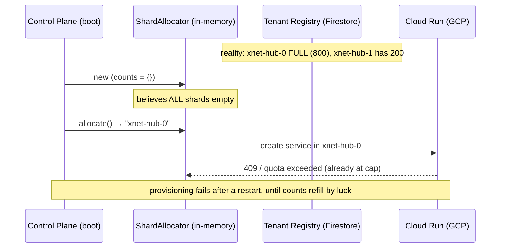
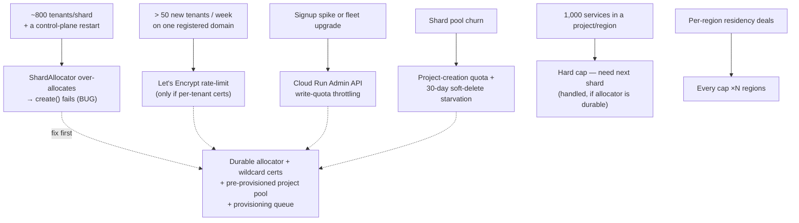

# Fleet Scalability Sharp Edges And Hard Caps

> **Status:** Exploration
> **Date:** 2026-07-08
> **Author:** Claude
> **Tags:** scalability, quotas, hard-caps, cloud-run, gcp-projects, sharding,
> shard-allocator, letsencrypt, tls, custom-domains, r2, firestore, fly, hetzner,
> service-accounts, api-rate-limits, region-pinned, extends-0286, extends-0178

## Problem Statement

[0286](./0286_[_]_ALTERNATIVE_CLOUD_HOSTING_SUBSTRATES_COMPUTE_AND_STORAGE_TRADEOFFS.md)
recommended a two-substrate hybrid — **Cloud Run + Litestream → R2** for the cold
long tail, Fly for warm, Hetzner for residency — and named one sharp edge in
passing: **Cloud Run caps services at 1,000 per project per region, and that cap
is not raiseable.** The [`ShardAllocator`](../../packages/cloud/src/provisioner/sharding.ts)
already shards across projects to route around it.

But the 1,000-service cap is not the *only* ceiling, and arguably not the one that
bites first. A fleet that provisions one isolated resource per tenant runs into a
lattice of caps — some hard (un-raiseable), some soft (a quota-increase ticket),
some *architectural* (they don't stop you, they just make a naïve design fall over
at scale). This exploration **enumerates every cap on the critical path of the
preferred stack, ranks them by which bites first, and finds the repo-specific
sharp edges the code already carries** — including one latent bug in the shard
allocator and a per-tenant-domain design gap that would hit a Let's Encrypt rate
limit head-on.

The framing question: **at what tenant count does each ceiling bind, and what has
to change before then?**

## Executive Summary

**The 1,000-services cap is real but well-handled. The ceilings that will actually
hurt are (1) a latent shard-allocator bug, (2) per-tenant TLS certs vs Let's
Encrypt's 50-certs/week/registered-domain hard limit, (3) GCP project *creation*
quota and 30-day soft-delete making shard projects a scarce, slow-to-recycle
resource, and (4) Cloud Run Admin API write-rate throttling the provisioning
pipeline.** Concretely:

1. **`ShardAllocator` is in-memory and never rehydrated.** Its per-project counts
   live only in the provisioner instance
   ([`cloud-run-litestream.ts:108`](../../packages/cloud/src/provisioner/adapters/cloud-run-litestream.ts));
   on every control-plane restart they reset to zero and `allocate()` starts
   re-filling `…-0` — even though shard `…-0` is really full. The next
   `client.create()` there fails (or silently over-packs toward the 1,000 cap).
   The truth (`substrateRef = project/region/service`) *is* persisted in the
   tenant registry but is never read back. **This is a correctness bug, not just a
   scaling one — fix before any real fleet.**
2. **Per-tenant subdomains can't use per-tenant Let's Encrypt certs.** LE caps
   **50 new certificates per registered domain per week** — a hard, global-per-
   domain rate limit. At >50 new tenants/week on `*.hubs.xnet.fyi` you'd be rate-
   limited into a multi-week backlog. The fix is a **single wildcard cert
   (`*.hubs.xnet.fyi`)** plus a wildcard DNS record, or **Cloudflare SSL-for-SaaS**
   — *not* one cert per tenant. The repo has **no domain/cert code yet**
   (`hubUrl` is the raw `*.run.app`), so this is a design decision to make *before*
   building it, not a migration.
3. **GCP projects are a scarce, slow resource.** Project **creation is quota-
   limited** (low default, ticket to raise) and **deletion is a 30-day soft-
   delete** — you can't rapidly create/destroy shard projects. Treat the shard
   pool as **pre-provisioned, long-lived infrastructure**, not something the
   allocator conjures on demand.
4. **Provisioning throughput is Admin-API-bound.** Cloud Run Admin API and Cloud
   Resource Manager have per-minute write quotas; a signup spike or a fleet-wide
   staged upgrade (0174) serializes against them. Needs a **rate-limited,
   retrying, idempotent provisioning queue**, not fan-out.
5. **Region-pinning (enterprise) multiplies every per-region cap.** Each pinned
   region is its own 1,000-service, own project-pool, own cert story.
6. **Most other caps are soft or non-binding** at realistic scale (R2 buckets/
   objects, Firestore throughput, Fly/Hetzner instance counts, Stripe) — but two
   Firestore hot-spots (a shared allocator counter doc; the per-tenant record on
   demote/reactivate) deserve care.

The headline: **the preferred stack scales, but only after the allocator is made
durable, the cert strategy is fixed to wildcard, and the shard-project pool is
treated as pre-provisioned capacity.**

## Current State In The Repository

### The sharding mechanism (and its gap)

[`packages/cloud/src/provisioner/sharding.ts`](../../packages/cloud/src/provisioner/sharding.ts)
gives two things:

- `projectForServiceIndex(index, cfg)` — **pure/stateless**: project = `prefix-⌊index/limit⌋`.
- `ShardAllocator` — **stateful, in-memory**: a `Map<project, count>`, `allocate()`
  picks the lowest-index shard with `count < limit` (default 800, headroom under
  1,000), `release()` decrements on destroy.

The allocator is constructed **inside** the provisioner with an empty map and no
seed:

```ts
// cloud-run-litestream.ts:108 — counts start empty, every process, forever
this.allocator = new ShardAllocator({ projectPrefix: config.projectPrefix, … })
```

And the provisioner is built from env with no rehydration step
([`apps/cloud/src/provisioner/google-cloud-run-client.ts:165`](../../apps/cloud/src/provisioner/google-cloud-run-client.ts)).
Meanwhile the durable truth exists — [`TenantRecord.substrateRef`](../../apps/cloud/src/registry.ts)
stores `project/region/service` for every tenant. **Nothing reads it back into the
allocator.** So:



There's no persisted counter and no boot-time reconciliation — a classic
"in-memory index over durable data" divergence.

### No per-tenant domain / TLS layer yet

`hubUrl` is whatever the substrate returns — the raw Cloud Run
`https://<svc>-<project>.run.app` (real client) or `https://<tenant>.<baseDomain>`
(the [`MemoryProvisioner`](../../packages/cloud/src/provisioner/memory.ts) stub).
There is **no domain-mapping, DNS, or certificate provisioning anywhere** in
`packages/cloud` or `apps/cloud`. The dashboard even has an allowlist that
*rejects* `*.run.app` for desktop deep-links
([`apps/cloud/src/dashboard.ts:88`](../../apps/cloud/src/dashboard.ts)). So the
"pretty per-tenant subdomain" is unbuilt — which is the right moment to choose a
strategy that respects the LE cap.

### Provisioning is one-shot, not queued

`ControlPlane.reactivate()` / `demoteIfCold()`
([`apps/cloud/src/control-plane.ts`](../../apps/cloud/src/control-plane.ts)) call
the provisioner directly and inline. There's no queue, no rate limiter, no retry/
backoff around the Cloud Run Admin API. Fine for a demo; a signup spike or a
fleet-wide upgrade would hammer the API quota.

### What's already right

- **Litestream is one-sidecar-per-container** (entrypoint `-exec`), so there's no
  "max DBs per Litestream process" ceiling — each tenant's process replicates only
  its own DB.
- **R2 uses per-tenant path prefixes** (`t/<tenantId>/db`), so one bucket holds the
  whole fleet — no per-tenant bucket, no bucket-count cap.
- **The image is shared** (one `xnet-hub:<version>`), so Artifact Registry / Cloud
  Build quotas scale with *releases*, not tenants.

## External Research

Current (mid-2026) figures. **Verify each against the live console before
committing** — quotas drift and some are account-tier-specific. Marked
**HARD** (un-raiseable), **SOFT** (quota-increase ticket), or **ARCH** (design
constraint, not a numeric limit).

### GCP Cloud Run

| Limit | Value | Kind | Notes / workaround |
| --- | --- | --- | --- |
| **Services per project per region** | **1,000** | **HARD** | The known one. Shard across projects (allocator does this at 800). |
| Revisions per service | 1,000 | SOFT/ARCH | Frequent staged upgrades (0174) accrete revisions; prune old ones or hit it. |
| Max instances per service | 100 default | SOFT | Raiseable to thousands; per-tenant hubs rarely need >1. |
| Max concurrent requests/instance | 1,000 | HARD (ceiling) | Per-tenant concurrency is small; not binding. |
| Container instances per region | quota | SOFT | Regional CPU/memory allocation quota — raise as fleet grows. |
| **Domain mappings per region** | ~1,000 & limited regions | **HARD/ARCH** | Cloud Run's built-in domain mapping does **not** scale to per-tenant subdomains — use an external LB or wildcard (see TLS below). |
| Admin API write requests | per-minute quota | SOFT | Throttles provisioning throughput; needs a queue. |

### GCP project & IAM

| Limit | Value | Kind | Notes |
| --- | --- | --- | --- |
| **Project creation rate** | low default (per-account) | **SOFT but painful** | Bulk project creation needs a quota increase and is rate-limited; can't spin shards on demand. |
| **Project deletion** | **30-day soft-delete** | **HARD** | A destroyed shard project lingers 30 days; you can't rapidly recycle project ids. Pre-provision the pool. |
| Projects per org | high / effectively soft | SOFT | Not binding if the pool is pre-sized. |
| **Service accounts per project** | **100** | **SOFT (cap ~ thousands)** | **Do NOT mint one SA per tenant** — you'd exhaust it at 100 tenants/project. Use one SA per shard project (or workload identity). |
| IAM principals per policy | ~1,500 / 250 KB | HARD | Don't add per-tenant IAM bindings; keep tenant authz in-app. |

### TLS / DNS (the per-tenant-subdomain trap)

| Limit | Value | Kind | Notes |
| --- | --- | --- | --- |
| **Let's Encrypt certs / registered domain / week** | **50** | **HARD** | >50 new tenant subdomains/week ⇒ rate-limited. **Use a wildcard cert.** |
| LE duplicate certs / week | 5 | HARD | Re-issue storms hit this. |
| LE new orders / account / 3h | 300 | HARD | Bulk issuance throttle. |
| **Wildcard cert `*.hubs.xnet.fyi`** | 1 cert covers all | **ARCH win** | Needs DNS-01; one cert, one renewal, unlimited subdomains. |
| Cloudflare SSL for SaaS | high volume, managed | ARCH win | Offloads per-hostname certs to Cloudflare; scales to many custom domains. |
| DNS records per zone (Cloudflare) | ~3,500 free / higher paid | SOFT | A **wildcard DNS record** (`*.hubs`) avoids per-tenant records entirely. |

### Cloudflare R2 (storage plane)

| Limit | Value | Kind | Notes |
| --- | --- | --- | --- |
| Buckets per account | very high (≥1M) | SOFT | Irrelevant — we use one bucket + per-tenant prefixes. |
| Objects per bucket | unlimited | — | Litestream writes many small WAL objects per tenant prefix. |
| Max object size | ~5 TB (multipart) | — | Non-binding for SQLite. |
| Per-prefix hot-spot | no S3-style partition split needed | ARCH | R2 doesn't require prefix-sharding for throughput the way S3 historically did; still, one Litestream sidecar/tenant keeps request rates low. |
| API tokens / account | limited | SOFT | Use **one** R2 credential for the fleet (already the design — injected via env), not per-tenant tokens. |

### Fly.io & Hetzner (secondary substrates)

| Limit | Value | Kind | Notes |
| --- | --- | --- | --- |
| Fly machines/app, apps/org | soft org limits | SOFT | Raised via billing@fly.io; no hard platform cap like Cloud Run. |
| Fly per-hostname certs | LE-backed | HARD (LE) | Same 50/week LE limit if per-tenant hostnames — wildcard applies here too. |
| Hetzner servers per project | 10 default | SOFT | Raise via ticket; project-per-shard model. |
| Hetzner volumes per server | 16 | HARD | Constrains many-tenants-per-node packing. |
| Hetzner API rate | ~3,600 req/h | SOFT | Throttle orchestration. |

### Control-plane data (Firestore) & billing

| Limit | Value | Kind | Notes |
| --- | --- | --- | --- |
| Firestore sustained writes/doc | ~1/sec/doc | **HARD (hot-doc)** | A shared allocator-counter doc would be a hot-spot; shard the counter or use per-project docs. |
| Firestore writes/sec/db | ~10k+ (autoscales) | SOFT | Fleet-wide fine; watch the demote/reactivate write path. |
| Stripe subscriptions/customers/meters | effectively unbounded | — | Not a scaling ceiling. |

## Key Findings

1. **The allocator bug binds before any provider cap** — it's a correctness defect
   that manifests on the *first control-plane restart after shard `…-0` fills*
   (~800 tenants), long before you'd stress GCP itself.
2. **Let's Encrypt's 50/week is the first *external* hard wall** for the
   subdomain feature — and it's avoidable entirely by never issuing per-tenant
   certs (wildcard or Cloudflare SSL-for-SaaS). Because the domain layer is
   unbuilt, this is a free design win if decided now.
3. **GCP projects are capacity, not compute** — creation-quota + 30-day
   soft-delete mean the shard pool must be **pre-provisioned and long-lived**. The
   allocator should draw from a *known pool*, and alert when the pool nears
   exhaustion, rather than assume it can create `prefix-N` on the fly.
4. **Provisioning throughput, not tenant count, is the operational ceiling** —
   Admin-API write quotas mean bursts must be queued, rate-limited, retried, and
   idempotent (safe against the allocator fix too).
5. **Per-tenant IAM/SA/token/bucket/domain resources are all anti-patterns** — the
   design already avoids them for R2/image; the same discipline must extend to SAs
   (one per shard, never per tenant) and certs (wildcard, never per tenant).
6. **Region-pinning is a cap multiplier** — every ceiling above is *per region*;
   enterprise residency turns one scaling problem into one-per-region.

### When does each ceiling bind? (order of first pain)



## Options And Tradeoffs

### The shard allocator: how to make it durable

| Option | How | Pros | Cons |
| --- | --- | --- | --- |
| **A. Rehydrate on boot** (recommended) | On start, scan the tenant registry, parse `substrateRef` → count per project, seed the allocator | Truth-sourced; no new store; self-healing | O(tenants) scan at boot (cheap ≤10⁵); needs a scan API |
| **B. Persist counts** | Write `Map<project,count>` to Firestore on each alloc/release | O(1) boot | New hot-doc; drifts from reality on partial failures |
| **C. Stateless derive** | Project = `prefix-⌊globalIndex/limit⌋` from a persisted monotonic counter (`projectForServiceIndex` already exists) | Pure, no map, restart-proof | Doesn't reclaim freed slots (fine — GCP projects don't recycle anyway); counter is a hot-doc (shard it) |
| **D. Query GCP live** | Ask Cloud Run how many services per project | Always accurate | Slow, Admin-API-quota cost per provision |

**A + C together** is the sweet spot: derive the *next* project from a durable
monotonic counter (C — matches the fact that GCP project slots don't really
recycle), and reconcile/verify against the registry scan on boot (A) as a
correctness check + telemetry. Drop the in-memory `release()`-based reuse; it
fights the reality that a destroyed tenant's project isn't reclaimable quickly.

### Per-tenant addressing: four ways, only two scale

| Option | Cert model | Scales? | Notes |
| --- | --- | --- | --- |
| Raw `*.run.app` | GCP-managed | ✅ | Ugly URL; dashboard deep-link allowlist rejects it — status quo. |
| **Wildcard `*.hubs.xnet.fyi`** (recommended) | **1 wildcard cert + wildcard DNS + external LB/router** | ✅✅ | One cert, one DNS record, unlimited tenants; router maps host→Cloud Run service. |
| **Cloudflare SSL for SaaS** | CF-managed per-hostname | ✅ | Best if tenants bring *custom* domains; offloads cert volume to CF. |
| Per-tenant LE cert | one cert/tenant | ❌ | Dies at 50 new/week — **do not build this**. |

### Provisioning pipeline: inline vs queued

Inline (today) is simplest but unbounded against Admin-API quota and not
restart-safe mid-burst. A **durable work queue** (idempotent `provision(tenantId)`
jobs, rate-limited to the Admin-API budget, exponential backoff, dedupe on
tenantId) is the scale-safe shape — and it composes with the allocator fix (a
retried job must allocate deterministically, favouring option C).

## Recommendation

**Do the three "before real fleet" fixes, then treat shards + certs + projects as
pre-provisioned capacity governed by a queue.**

1. **Fix the allocator (correctness, do first).** Implement **derive-from-durable-
   counter (C)** for the *next* project, **reconcile from the registry on boot
   (A)** for safety/telemetry, and remove reliance on the in-memory count surviving
   restarts. Add a unit test that simulates "restart with shard-0 full → next
   allocation must not target shard-0."
2. **Choose wildcard TLS now, before building the domain layer.** Single
   `*.hubs.xnet.fyi` wildcard cert (DNS-01, auto-renew) + wildcard DNS + a
   host→service router (external HTTPS LB or a thin edge worker). Reserve
   Cloudflare SSL-for-SaaS for the later "bring your own domain" enterprise
   feature. **Never issue per-tenant LE certs.**
3. **Pre-provision the shard-project pool as infrastructure.** Terraform/Pulumi a
   pool of `xnet-hub-0…N` projects sized to target tenant count ÷ 800, each with
   **one** shared service account (never per-tenant SAs), APIs enabled, R2 creds
   set. Add a **pool-headroom alert** ("<2 shards free") since creating more is
   quota-gated and slow.
4. **Put a rate-limited, idempotent provisioning queue** in front of the Cloud Run
   Admin API. Jobs keyed by tenantId, retried with backoff, allocating
   deterministically. This also smooths staged fleet upgrades (0174).
5. **Budget every cap per region** for residency plans; a pinned region is a fresh
   1,000-cap + project-pool + cert scope.
6. **Add a caps/telemetry dashboard** — services-per-shard, pool headroom, weekly
   cert-issuance count, Admin-API 429 rate — so a ceiling is seen approaching, not
   hit.

## Example Code

Restart-safe allocation: derive from a durable counter, reconcile on boot.

```ts
// packages/cloud/src/provisioner/sharding.ts — additions

/** Durable monotonic source: returns the next 0-based global service index. */
export interface ShardCounter {
  /** Atomically reserve and return the next index (Firestore FieldValue.increment, etc.). */
  next(): Promise<number>
}

/**
 * Restart-safe allocator: the project is a pure function of a DURABLE index,
 * so a control-plane restart can never re-fill a full shard (fixes the in-memory
 * ShardAllocator divergence). GCP project slots don't recycle on a useful
 * timescale (30-day soft-delete), so we intentionally do NOT reuse freed slots.
 */
export class DurableShardAllocator {
  constructor(
    private readonly counter: ShardCounter,
    private readonly cfg: ShardingConfig
  ) {}

  async allocate(): Promise<string> {
    const index = await this.counter.next()
    return projectForServiceIndex(index, this.cfg) // existing pure fn
  }
}

/** Boot-time reconciliation: rebuild per-project counts from the source of truth. */
export function reconcileFromRegistry(
  substrateRefs: string[],
  cfg: ShardingConfig
): { countsByProject: Map<string, number>; maxIndexSeen: number; freeShardHeadroom: number } {
  const counts = new Map<string, number>()
  for (const ref of substrateRefs) {
    const project = ref.split('/')[0]
    if (project) counts.set(project, (counts.get(project) ?? 0) + 1)
  }
  const limit = cfg.servicesPerProject ?? 800
  const overfull = [...counts.values()].filter((c) => c >= limit).length
  // Alert when the pre-provisioned pool is nearly exhausted (creating more is slow).
  const freeShardHeadroom = counts.size - overfull
  const maxIndexSeen = counts.size * limit
  return { countsByProject: counts, maxIndexSeen, freeShardHeadroom }
}
```

Host→service routing for the wildcard domain (edge sketch):

```ts
// A single *.hubs.xnet.fyi wildcard cert terminates TLS; the router maps
// `<tenant>.hubs.xnet.fyi` → that tenant's Cloud Run service URL from the registry.
// No per-tenant cert, no per-tenant DNS record — one wildcard of each.
async function routeByHost(host: string, registry: TenantLookup): Promise<string | null> {
  const sub = host.replace(/\.hubs\.xnet\.fyi$/, '')
  const rec = await registry.getByTenantId(sub)
  return rec?.hubUrl ?? null // 404/parking page when cold or unknown
}
```

## Risks And Open Questions

- **Allocator migration.** Existing tenants already have `substrateRef`s; the new
  durable counter must be seeded past the current `maxIndexSeen` so it never
  re-issues an occupied project/slot. Cover with the boot reconciliation.
- **Wildcard cert blast radius.** One key for all subdomains — key compromise is
  fleet-wide. Mitigate with short-lived certs, HSM/KMS-held keys, and per-tenant
  authz still enforced at the hub, not the edge.
- **Router becomes a control-plane dependency on the hot path.** Host→service
  lookup must be cached and highly available; a router outage dark-holes every
  tenant. Consider baking the mapping into the LB or an edge KV.
- **Cold tenants have no `hubUrl`.** The router must handle "known but cold" →
  trigger `reactivate()` (a wake path), and "unknown" → parking page. This couples
  routing to reactivation latency (0286's VFS work helps).
- **Quota numbers drift.** Every figure here needs a live-console check before it's
  load-bearing; treat the table as a checklist, not gospel.
- **Per-region residency economics.** N pinned regions × pre-provisioned pools may
  strand capacity (idle shard projects per region). Only pre-provision regions with
  signed demand.
- **Firestore hot-docs.** The durable counter and the demote/reactivate write path
  are per-doc-1/sec-limited; shard the counter (e.g. K sub-counters) if provision
  rate could exceed that.

## Implementation Checklist

- [ ] Add `ShardCounter` + `DurableShardAllocator` + `reconcileFromRegistry` to [`packages/cloud/src/provisioner/sharding.ts`](../../packages/cloud/src/provisioner/sharding.ts); export via the provisioner sub-barrel.
- [ ] Implement a Firestore-backed `ShardCounter` (atomic increment) in `apps/cloud`; seed it from `reconcileFromRegistry().maxIndexSeen` on first deploy.
- [ ] Switch `CloudRunLitestreamProvisioner` to accept an injected async allocator; make `provision()` allocation restart-safe. Update tests.
- [ ] **Unit test:** "shard-0 full + fresh process → next allocation targets shard-1, never shard-0."
- [ ] Add boot-time reconciliation + a **pool-headroom metric/alert** (`freeShardHeadroom < 2`).
- [ ] Decide + document the **wildcard TLS** strategy; provision `*.hubs.xnet.fyi` cert (DNS-01) + wildcard DNS + host→service router; **remove** any temptation toward per-tenant certs.
- [ ] Pre-provision the shard-project pool via IaC (one shared SA per project, APIs enabled, R2 env). Document that projects are pre-provisioned capacity, not on-demand.
- [ ] Introduce an **idempotent, rate-limited provisioning queue** in front of the Cloud Run Admin API (backoff, dedupe on tenantId).
- [ ] Add a caps dashboard: services/shard, pool headroom, weekly cert issuance, Admin-API 429s.
- [ ] Verify every quota figure in this doc against the live GCP/Cloudflare/Fly/Hetzner consoles; annotate the table with confirmed values + dates.
- [ ] Changeset: `@xnetjs/cloud` **minor** (new allocator API; keep the old `ShardAllocator` export until callers migrate, then major-remove).

## Validation Checklist

- [ ] Kill + restart the control plane with shard-0 at capacity in a fake registry; assert no `create()` targets a full shard and no 409/quota error occurs.
- [ ] Provision past a shard boundary (index 800→801) and confirm the tenant lands in shard-1 and the registry `substrateRef` agrees.
- [ ] Issue >50 tenant subdomains in a simulated week against the wildcard cert; confirm **zero** new LE orders per tenant (one wildcard covers all).
- [ ] Load-test the provisioning queue at a burst rate above the Admin-API quota; confirm it throttles + retries without dropping or double-creating tenants.
- [ ] Trigger the pool-headroom alert by filling shards; confirm it fires before the last free shard is consumed.
- [ ] Reactivate a cold tenant through the host→service router; confirm wake path + parking page for unknown hosts.
- [ ] Region-pinned tenant provisions into the correct region's project pool and cert scope.

## References

**Repo**
- Shard allocator — [`packages/cloud/src/provisioner/sharding.ts`](../../packages/cloud/src/provisioner/sharding.ts)
- Cloud Run adapter (allocator construction) — [`packages/cloud/src/provisioner/adapters/cloud-run-litestream.ts`](../../packages/cloud/src/provisioner/adapters/cloud-run-litestream.ts)
- Real GCP client wiring — [`apps/cloud/src/provisioner/google-cloud-run-client.ts`](../../apps/cloud/src/provisioner/google-cloud-run-client.ts)
- Tenant registry (`substrateRef`) — [`apps/cloud/src/registry.ts`](../../apps/cloud/src/registry.ts)
- Control plane (provision/reactivate/demote) — [`apps/cloud/src/control-plane.ts`](../../apps/cloud/src/control-plane.ts)
- Dashboard deep-link allowlist — [`apps/cloud/src/dashboard.ts`](../../apps/cloud/src/dashboard.ts)
- Substrate tradeoffs — [0286](./0286_[_]_ALTERNATIVE_CLOUD_HOSTING_SUBSTRATES_COMPUTE_AND_STORAGE_TRADEOFFS.md) · fleet deploy — [0175](./0175_[_]_MANAGED_HUB_FLEET_DEPLOYMENT_AND_AI_GATEWAY.md) · staged upgrades — [0174](./0174_[_]_MANAGED_HOSTING_AS_OPEN_CORE_IN_THE_PUBLIC_MONOREPO.md)

**External (verify live before relying)**
- Cloud Run quotas & limits — https://cloud.google.com/run/quotas
- Cloud Run domain mappings — https://cloud.google.com/run/docs/mapping-custom-domains
- GCP Resource Manager / project creation quota — https://cloud.google.com/resource-manager/docs/limits · project lifecycle (30-day delete) — https://cloud.google.com/resource-manager/docs/creating-managing-projects
- Service accounts per project limit — https://cloud.google.com/iam/quotas
- Let's Encrypt rate limits (50/registered-domain/week) — https://letsencrypt.org/docs/rate-limits/
- Cloudflare SSL for SaaS — https://developers.cloudflare.com/cloudflare-for-platforms/cloudflare-for-saas/
- Cloudflare R2 limits — https://developers.cloudflare.com/r2/platform/limits/
- Firestore quotas / per-doc write limit — https://firebase.google.com/docs/firestore/quotas
- Fly.io limits — https://fly.io/docs/about/pricing/ · Hetzner Cloud limits — https://docs.hetzner.com/cloud/
