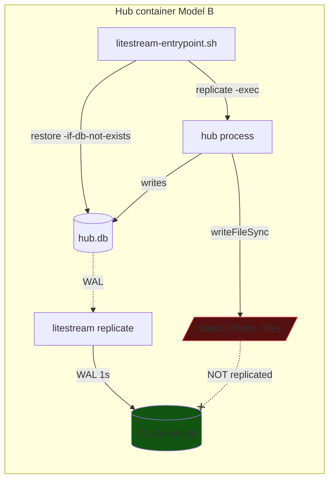
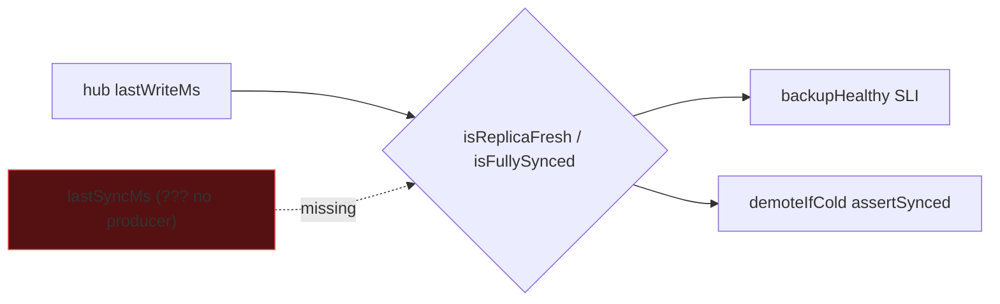
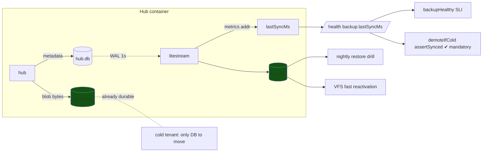
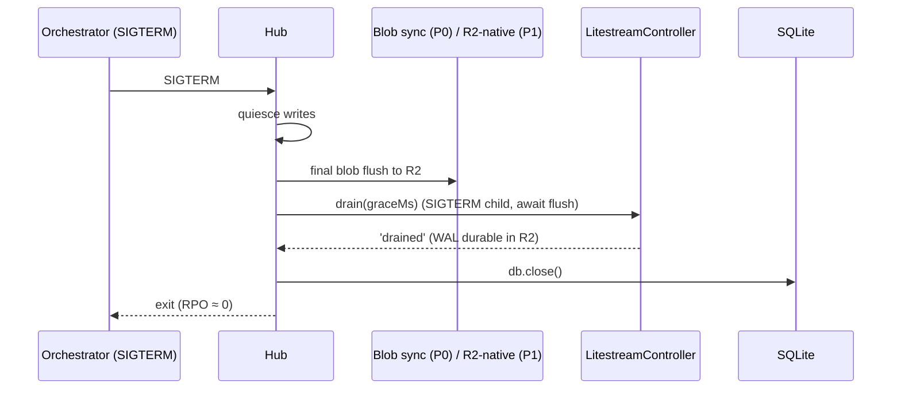

# Fully Integrating Litestream Into The Cloud Offering

> **Status:** Exploration
> **Date:** 2026-07-08
> **Author:** Claude
> **Tags:** litestream, durability, backup, restore, r2, sqlite, blob-storage,
> cold-tiering, replication-freshness, rpo, restore-drill, vacuum, litestream-vfs,
> observability, self-host, extends-0178, extends-0286, extends-0287

## Problem Statement

Litestream is the durability engine the whole managed-cloud data story rests on
(decided in [0178](./0178_[_]_COST_EFFICIENT_SQLITE_HOSTING_NO_LIBSQL_MIGRATION.md),
leaned on again in [0286](./0286_[_]_ALTERNATIVE_CLOUD_HOSTING_SUBSTRATES_COMPUTE_AND_STORAGE_TRADEOFFS.md)).
It is **partly wired** — the hub image ships the binary, an entrypoint restores on
boot and supervises replication, a `@xnetjs/cloud/litestream` package generates
config and controls drain-before-close, and the control plane has cold-tiering
methods that assume an R2 replica exists.

But "wired" is not "fully integrated." A feature is fully integrated when a paying
tenant can be **destroyed and losslessly reconstituted from R2 — all of their
data — and the operator can *prove* the backup is fresh before trusting it.**
Today neither is guaranteed:

- **Litestream replicates only `hub.db`. Blobs and file attachments are written to
  the local filesystem** ([`sqlite.ts:1207`](../../packages/hub/src/storage/sqlite.ts),
  `writeFileSync(blobPath, data)` under `dataDir/blobs`) — **and nothing replicates
  that directory.** A cold/ephemeral tenant (Model B) restored on a fresh container
  gets its SQLite back with `blob_path` rows pointing at files **that no longer
  exist**. That is silent data loss of every attachment.
- **There is no live producer of `lastSyncMs`.** The freshness helpers
  ([`freshness.ts`](../../packages/cloud/src/litestream/freshness.ts)) and the
  `backupHealthy` SLI ([`sli.ts:70`](../../apps/cloud/src/observability/sli.ts))
  both take a `lastSyncMs` argument, but nothing measures it — the hub `/health`
  reports only `lastWriteMs`. So the demotion gate and the backup-health alert are
  wired to a value with no source.
- **The restore drill and the cold-demotion loop are coded but never scheduled.**

This exploration defines what "fully integrated" means and how to get there.

## Executive Summary

**Litestream today backs up the database but not the tenant. Full integration is
mostly about closing the blob-durability gap and making replication health a
first-class, observable, gating signal — not about Litestream itself, which works.**

1. **Close the blob/file durability gap (the headline).** Litestream covers SQLite
   only. Either (recommended) **move blobs+files to an R2-native blob store** so
   they're durable by construction and cold-tiering is trivial, or (bridge)
   **run a `rclone`/`aws s3 sync` sidecar** that mirrors `dataDir/blobs` +
   `dataDir/files` to the same R2 bucket and restores them on boot alongside the DB.
   Until this lands, **no managed tenant with attachments is safely recoverable.**
2. **Produce and surface `lastSyncMs`.** Enable Litestream's Prometheus metrics
   endpoint, read the replica's last-sync timestamp, expose it on hub `/health`
   (`backup.lastSyncMs`), and feed it into `backupHealthy` and — critically — the
   `demoteIfCold` `assertSynced` gate, which must become **mandatory** in prod.
3. **Schedule what's already written.** Wire `runRestoreDrills` (nightly, rotating
   sample) and a cold-demotion sweep onto real timers in `apps/cloud`. The code
   exists; nothing runs it.
4. **Add retention + a clean-archive snapshot.** Configure Litestream snapshot/
   retention and add an hourly `VACUUM INTO → R2` compacted archive (0178's belt-
   and-suspenders) as a low-tech restore fallback independent of WAL generations.
5. **Adopt Litestream VFS for fast cold-open** (0286): partial-read restore cuts
   reactivation from seconds to sub-second for interactive wakes.
6. **Surface durability to the user + offer it to self-host.** Show "your data is
   safe as of …" on the dashboard; ship an opt-in BYO-S3 Litestream config for
   self-hosters so durability isn't a managed-only privilege.
7. **Keep the version discipline.** Stay pinned at v0.5.3, keep the freshness alert
   as the early-warning for the silent-skip class of bug, and gate any upgrade on a
   restore-drill pass.

The through-line: **make Litestream the guarantee it's assumed to be, prove it
continuously, and cover the data it currently misses.**

## Current State In The Repository

### What Litestream integration exists today



| Piece | File | State |
| --- | --- | --- |
| Config + YAML generator | [`litestream/config.ts`](../../packages/cloud/src/litestream/config.ts) | ✅ solid, env-ref creds |
| CLI argv builders | [`litestream/commands.ts`](../../packages/cloud/src/litestream/commands.ts) | ✅ `restoreArgs`/`replicateArgs` |
| Drain-before-close controller | [`litestream/controller.ts`](../../packages/cloud/src/litestream/controller.ts) | ✅ SIGTERM→flush→exit |
| Freshness helpers | [`litestream/freshness.ts`](../../packages/cloud/src/litestream/freshness.ts) | ⚠️ pure, **no live input** |
| Entrypoint (restore + exec) | [`hub/litestream-entrypoint.sh`](../../packages/hub/litestream-entrypoint.sh) | ✅ hub.db; ⚠️ telemetry.db restore is a no-op |
| WAL pragma (`autocheckpoint=0`) | [`hub/src/storage/litestream.ts`](../../packages/hub/src/storage/litestream.ts) | ✅ correct |
| Binary pin v0.5.3 | [`hub/Dockerfile`](../../packages/hub/Dockerfile) | ✅ avoids 0.5.6/0.5.7 bug |
| Env injection (R2 creds) | [`cloud-run-litestream.ts`](../../packages/cloud/src/provisioner/adapters/cloud-run-litestream.ts) | ✅ |
| Cold demote / reactivate | [`control-plane.ts:635`](../../apps/cloud/src/control-plane.ts) | ⚠️ `assertSynced` optional; **not scheduled** |
| Restore drill | [`backup/restore-drill.ts`](../../apps/cloud/src/backup/restore-drill.ts) | ⚠️ written, **imported but not scheduled** |
| Backup-health SLI | [`observability/sli.ts:70`](../../apps/cloud/src/observability/sli.ts) | ⚠️ `lastSyncMs` unsourced |
| Hub `/health` backup block | [`hub/src/server.ts:384`](../../packages/hub/src/server.ts) | ⚠️ reports `lastWriteMs` only |

### The blob gap, concretely

The SQLite adapter stores blob/file **bytes on disk** and only the **pointer** in
SQLite:

```
sqlite.ts:1204  putBlob → writeFileSync(join(dataDir,'blobs', key), data)
sqlite.ts:127   backups table: blob_path TEXT   ← points at a file on the volume
sqlite.ts:1268  file attachments → writeFileSync(filePath, data)
```

Litestream replicates `hub.db`. It does **not** replicate `dataDir/blobs` or
`dataDir/files`. On Model B reactivation (`restoreFromR2`), the container is fresh:
the DB comes back, the `blob_path`/`file_path` rows come back, **the files do
not.** `getBlob` then `readFileSync(row.blob_path)` → ENOENT. Silent per-attachment
loss, invisible until a user opens an old attachment.

### The freshness gap, concretely



`demoteIfCold` will happily destroy a tenant's volume if `assertSynced` is omitted
(it's optional), and `backupHealthy` can't actually tell if a backup is stale —
both because `lastSyncMs` has no measured source. Litestream *does* expose it (its
metrics endpoint publishes replica sync progress); we just don't read it.

## External Research

- **Litestream model.** Single-process, streams WAL frames to S3-compatible storage
  every `sync-interval` (default 1 s → ~1 s RPO); near-zero RPO on graceful drain
  (why the controller SIGTERMs and waits). It replicates **one or more SQLite DBs**
  — but **only SQLite**; anything not in the DB is out of scope. Backing up blobs
  is explicitly an application concern.
- **Litestream metrics.** Litestream can serve Prometheus metrics (replica WAL
  offset, sync counts/timestamps, operation errors) on a configured `addr`. This is
  the intended source for a real `lastSyncMs` and for silent-skip detection.
- **Litestream VFS read replicas (2025).** New `litestream` VFS hydrates pages
  on-demand from the object store — enables **partial-read restore** (~sub-100–250 ms
  cold JOINs) vs full-file download (seconds) — the reactivation-latency win in 0286.
- **Version risk.** v0.5.6/0.5.7 carried a *silent* replication-skip bug
  (WAL-space reuse after checkpoint → backups silently stale). We pin **v0.5.3**
  ([`Dockerfile`](../../packages/hub/Dockerfile)); the freshness alert is the
  operational guard against the whole bug class — which is exactly why it needs a
  live `lastSyncMs`.
- **Blob-durability patterns.** Two established shapes: (a) **object-store-native
  blobs** — write large objects straight to S3/R2, keep only metadata in SQLite
  (durable by construction, $0 R2 egress, cold-tiering trivial); (b) **sidecar
  mirror** — `rclone`/`aws s3 sync` the blob dir to the same bucket, restore on
  boot. (a) is cleaner long-term; (b) is a faster bridge.
- **`VACUUM INTO` archive.** A compacted, single-file, point-in-time snapshot
  independent of WAL generations — a cheap complement to continuous replication and
  a simpler restore path for DR (0178 flagged it).

## Key Findings

1. **Litestream is not the risk — the uncovered data is.** The engine works; the
   fleet is unsafe because **blobs/files live outside what it replicates.** Fixing
   that is the single highest-value integration step.
2. **The durability guarantee is unobservable.** Without a measured `lastSyncMs`,
   the demotion gate and the health SLI are decorative. Sourcing it turns two
   dormant safety features on and makes the silent-skip bug detectable.
3. **The automation is written but idle.** Restore drills and cold demotion are
   coded and tested but scheduled nowhere — "we can restore" is currently unproven
   in production because the proving job doesn't run.
4. **Cold-tiering and blob-native storage reinforce each other.** If blobs already
   live in R2, demote/reactivate only has to move the (small) SQLite DB — faster,
   cheaper, and the blob gap disappears. The blob fix and the cold-tier design want
   the same answer.
5. **VFS makes Model B pleasant.** Partial-read restore is the difference between a
   multi-second cold wake and an imperceptible one — it upgrades Cloud Run's cold
   tier (0286) from "tolerable" to "good."
6. **Self-host is being left out.** Litestream is managed-only today; a BYO-S3
   opt-in would give self-hosters real durability with the code that already exists.

## Options And Tradeoffs

### The blob/file durability gap — three ways

| Option | Mechanism | Pros | Cons |
| --- | --- | --- | --- |
| **1. R2-native blob store** (recommended, long-term) | Hub writes blob/file **bytes to R2** via the `putBlob`/`getBlob` storage interface; SQLite keeps only metadata + R2 key | Durable by construction; cold-tiering trivial (blobs already in R2); $0 egress; DB stays small (Litestream cheap) | New R2 blob adapter behind the existing interface; read latency = R2 GET (cache hot blobs); a code change in the hot path |
| **2. Sidecar mirror** (bridge) | `rclone`/`aws s3 sync` `dataDir/{blobs,files}` → R2 on interval + on shutdown; restore on boot after `litestream restore` | No hub code change; ships fast; covers everything on the volume | Second replication system + RPO to reason about; sync-vs-Litestream ordering; more moving parts in the entrypoint |
| **3. Blobs as SQLite BLOBs** | Store blob bytes **in** the DB so Litestream covers them | One durability system; simplest mental model | DB bloat + WAL churn (fights 0177/0178 economics); large-object write amplification; not for big attachments |

The storage interface already abstracts blobs
([`storage/interface.ts:343`](../../packages/hub/src/storage/interface.ts):
`putBlob/getBlob/listBlobs/deleteBlob`), so **Option 1 is an adapter swap, not a
schema change** — the clean end state. **Option 2 is the right stopgap** to make
existing tenants safe *this week* while Option 1 is built.

### Sourcing `lastSyncMs`

| Option | How | Pros | Cons |
| --- | --- | --- | --- |
| **A. Hub scrapes Litestream metrics** (recommended) | Enable Litestream `addr`; hub reads replica last-sync, exposes `backup.lastSyncMs` on `/health` | Single source; rides the existing fleet `/health` probe; works for the `assertSynced` gate | Hub↔Litestream local coupling |
| B. Control plane scrapes each hub's Litestream | CP polls tenant Litestream metrics directly | Hub untouched | N extra endpoints exposed; auth/networking per tenant |
| C. Derive from R2 object mtime | List the replica prefix, use newest object time | No metrics dep | Coarse, racy, extra R2 ops |

### Reactivation latency

| Option | Restore | Cold wake | Use |
| --- | --- | --- | --- |
| Full-file (today) | `litestream restore` whole DB | seconds–10 s | DR / drills |
| **VFS partial-read** (0286) | open via Litestream VFS, fetch touched pages | ~sub-second | interactive reactivation |
| Keep both | VFS for wake, full restore as fallback | best of both | recommended |

## Recommendation

**Make Litestream a real guarantee: cover the blobs, measure the freshness, run the
proofs — then optimize the wake.** Ordered by priority:

1. **[P0] Stop the blob data loss.** Ship **Option 2 (sync sidecar)** now so every
   managed tenant's `blobs/`+`files/` are mirrored to R2 and restored on boot
   alongside the DB. In parallel, build **Option 1 (R2-native blob store)** as the
   durable end state and migrate to it; retire the sidecar once blobs are native.
2. **[P0] Source `lastSyncMs` (Option A)** and make the `demoteIfCold`
   `assertSynced` gate **mandatory** in the `apps/cloud` wiring — a volume must
   never be destroyed until every write is durable in R2, blobs included.
3. **[P1] Schedule the automation.** Wire `runRestoreDrills` nightly over a
   rotating sample and a cold-demotion sweep on an interval (both already coded);
   emit results to telemetry + alert on drill failure.
4. **[P1] Retention + `VACUUM INTO` archive.** Configure Litestream snapshot
   retention; add an hourly compacted archive to R2 as an independent restore path.
5. **[P2] Adopt Litestream VFS** for interactive reactivation; keep full-file
   restore for drills/DR.
6. **[P2] Surface + share.** Dashboard "your data is safe as of `lastSyncMs`";
   ship an opt-in BYO-S3 Litestream config for self-hosters.
7. **[ongoing] Version discipline.** Stay on v0.5.3; freshness alert as silent-skip
   canary; gate upgrades on a green restore drill.

### Target end state



### Shutdown ordering (already correct, now covers blobs)



## Example Code

Real `lastSyncMs` on hub `/health`, feeding the existing helpers:

```ts
// packages/hub/src/storage/litestream.ts — read Litestream's Prometheus metrics
/** Parse `litestream_replica_last_sync_seconds`-style gauges → epoch ms, or null. */
export async function readLitestreamLastSyncMs(
  metricsUrl = 'http://127.0.0.1:9090/metrics',
  fetchImpl: typeof fetch = fetch
): Promise<number | null> {
  if (process.env.LITESTREAM !== '1') return null
  try {
    const text = await (await fetchImpl(metricsUrl)).text()
    // newest replica sync timestamp across lines (gauge is in seconds)
    let newest = 0
    for (const line of text.split('\n')) {
      const m = /litestream_replica_(?:last_sync|sync)_seconds\S*\s+([0-9.]+)/.exec(line)
      if (m) newest = Math.max(newest, Number(m[1]) * 1000)
    }
    return newest || null
  } catch {
    return null // health stays truthful: unknown, not "fresh"
  }
}
```

```ts
// packages/hub/src/server.ts — /health backup block gains a measured lastSyncMs
const lastSyncMs = await readLitestreamLastSyncMs()
// ...
backup: {
  replicating: process.env.LITESTREAM === '1',
  lastWriteMs: usage.lastWriteMs,
  lastSyncMs,                                   // NEW: real source for freshness
  fresh: lastSyncMs != null && isReplicaFresh(usage.lastWriteMs, lastSyncMs, 5 * 60_000)
}
```

```ts
// apps/cloud — the demotion gate becomes mandatory, backed by the hub's /health
const assertSynced = async (tenantId: string): Promise<boolean> => {
  const rec = await tenants.get(tenantId)
  if (!rec?.hubUrl) return false
  const h = await fetchHubHealth(rec.hubUrl)
  return Boolean(h?.backup?.lastSyncMs != null &&
    isFullySynced(h.backup.lastWriteMs, h.backup.lastSyncMs)) // never destroy unsynced
}
await controlPlane.demoteIfCold(tenantId, { coldAfterMs, assertSynced }) // no longer optional
```

Scheduling the drills + demotion sweep (in `apps/cloud/src/index.ts`, beside the
existing fleet-health `setInterval`):

```ts
const drillMs = Number(env.XNET_CLOUD_DRILL_MS ?? 24 * 60 * 60_000)
const drillTimer = setInterval(() => {
  void controlPlane.listTenants().then((tenants) => {
    const sample = pickDrillSample(tenants, Number(env.XNET_CLOUD_DRILL_SAMPLE ?? 20), dayIndex())
    return runRestoreDrills(provisioner, restoreProbe, sample)
      .then((r) => reportDrillResults(r)) // alert on any { ok:false }
  })
}, drillMs)
drillTimer.unref()
```

## Risks And Open Questions

- **Migration to R2-native blobs.** Existing on-volume blobs must be back-filled to
  R2 before the sidecar is retired; a tenant mid-migration must read from whichever
  store holds the bytes. Sequence: sidecar (safe) → back-fill → native reads →
  drop sidecar.
- **Sidecar RPO vs Litestream RPO.** Two replication systems with different lags:
  a blob referenced by a just-synced DB row might not be in R2 yet. Order the
  shutdown flush (blobs before DB drain) and, for continuous ops, write blobs to R2
  *before* committing the metadata row (native store makes this natural).
- **`lastSyncMs` truthfulness.** If metrics scrape fails, health must report
  *unknown*, never *fresh* — the gate must fail closed (don't demote).
- **VFS maturity/bus-factor.** 2025-new, largely one maintainer, and we've been
  bitten before (0.5.6/0.5.7). Benchmark + keep full-file restore as the fallback;
  gate on drills.
- **Telemetry.db inconsistency.** The entrypoint tries to restore `telemetry.db`
  but the managed config only replicates `hub.db`. Decide: replicate telemetry
  (add to config) or drop the restore attempt — don't leave a silent skip.
- **`VACUUM INTO` cost.** Hourly full-DB vacuum is I/O on large tenants; scope it to
  a size/interval policy, not blindly hourly.
- **Self-host abuse surface.** BYO-S3 config must keep credentials as env refs (the
  config generator already does) and never log them.
- **Metrics endpoint exposure.** Litestream `addr` must bind localhost only (hub
  scrapes it in-process); never expose per-tenant metrics publicly.

## Implementation Checklist

- [ ] **[P0]** Add a blob/file **sync sidecar** to the hub image + entrypoint (`rclone`/`aws s3 sync` `dataDir/{blobs,files}` ↔ R2, restore after `litestream restore`, flush on shutdown before DB drain).
- [x] **[P0]** Implement `readLitestreamLastSyncMs` + Litestream `addr` (localhost) in the generated config; add `backup.lastSyncMs`/`fresh` to hub `/health`.
- [x] **[P0]** Make `demoteIfCold`'s `assertSynced` **mandatory** in `apps/cloud` wiring, backed by `/health` `lastSyncMs`; fail closed on unknown.
- [ ] **[P1]** Build the **R2-native blob store** adapter behind [`storage/interface.ts`](../../packages/hub/src/storage/interface.ts); back-fill existing blobs; switch reads; retire the sidecar.
- [x] **[P1]** Schedule `runRestoreDrills` (nightly, rotating sample) + a cold-demotion sweep in [`apps/cloud/src/index.ts`](../../apps/cloud/src/index.ts); emit results + alert on failure.
- [ ] **[P1]** Configure Litestream **snapshot retention** + hourly **`VACUUM INTO → R2`** archive (size/interval-scoped).
- [ ] **[P2]** Add **Litestream VFS** reactivation path (env-flagged); keep full-file restore fallback.
- [ ] **[P2]** Dashboard "data safe as of `lastSyncMs`" indicator (extends [`dashboard.ts`](../../apps/cloud/src/dashboard.ts)).
- [ ] **[P2]** Opt-in **BYO-S3 Litestream** config for self-host (reuse the config generator + entrypoint).
- [x] Resolve the **telemetry.db** replicate-vs-restore inconsistency in the entrypoint/config.
- [ ] Changeset: `@xnetjs/hub` (blob store + health) and `@xnetjs/cloud` (freshness wiring) — **minor**; blob-store swap is internal (no export removal).

## Validation Checklist

- [ ] **Blob durability:** create a tenant with attachments → demote to cold → reactivate on a fresh container → every blob/file reads back byte-identical (the current failing case).
- [ ] **Freshness source:** hub `/health` reports a moving `lastSyncMs`; kill Litestream and confirm `fresh` flips to false and `backupHealthy` SLI degrades.
- [ ] **Demotion gate:** attempt demote while writes are unsynced → refused; after sync catches up → allowed. Metrics-scrape failure → refused (fail closed).
- [ ] **RPO drill:** kill the container mid-write; reactivate; assert ≤ ~1 s of writes lost and all committed blobs present.
- [ ] **Scheduled drill:** nightly drill runs, provisions a throwaway restore, asserts `/ready`, tears down, and alerts on an injected broken replica.
- [ ] **VFS vs full restore:** same generation restored both ways returns identical rows; VFS cold-open < 500 ms p95.
- [ ] **`VACUUM INTO` archive** restores to a consistent DB independent of WAL generations.
- [ ] **Self-host:** a self-hoster with BYO-S3 gets working restore-on-boot + replication with no secret leakage in logs/config.

## References

**Repo**
- Litestream package — [`config.ts`](../../packages/cloud/src/litestream/config.ts) · [`commands.ts`](../../packages/cloud/src/litestream/commands.ts) · [`controller.ts`](../../packages/cloud/src/litestream/controller.ts) · [`freshness.ts`](../../packages/cloud/src/litestream/freshness.ts)
- Entrypoint + WAL pragma — [`hub/litestream-entrypoint.sh`](../../packages/hub/litestream-entrypoint.sh) · [`hub/src/storage/litestream.ts`](../../packages/hub/src/storage/litestream.ts)
- Blob storage (the gap) — [`hub/src/storage/sqlite.ts`](../../packages/hub/src/storage/sqlite.ts) · [`hub/src/storage/interface.ts`](../../packages/hub/src/storage/interface.ts)
- Hub `/health` backup block — [`hub/src/server.ts`](../../packages/hub/src/server.ts)
- Cold demote / reactivate — [`apps/cloud/src/control-plane.ts`](../../apps/cloud/src/control-plane.ts)
- Restore drill — [`apps/cloud/src/backup/restore-drill.ts`](../../apps/cloud/src/backup/restore-drill.ts)
- Backup-health SLI — [`apps/cloud/src/observability/sli.ts`](../../apps/cloud/src/observability/sli.ts)
- Image pin — [`packages/hub/Dockerfile`](../../packages/hub/Dockerfile)
- Prior decisions — [0178 keep-SQLite + Litestream](./0178_[_]_COST_EFFICIENT_SQLITE_HOSTING_NO_LIBSQL_MIGRATION.md) · [0286 substrates + VFS](./0286_[_]_ALTERNATIVE_CLOUD_HOSTING_SUBSTRATES_COMPUTE_AND_STORAGE_TRADEOFFS.md) · [0287 caps](./0287_[_]_FLEET_SCALABILITY_SHARP_EDGES_AND_HARD_CAPS.md) · [0193 restore verification](./0193_[_]_XNET_CLOUD_OPERATIONS_UPTIME_BACKUPS_AND_TELEMETRY.md)

**External**
- Litestream — https://litestream.io/how-it-works/ · metrics — https://litestream.io/reference/config/ · VFS read replicas — https://fly.io/blog/litestream-vfs/ · silent-skip bug #1083 — https://github.com/benbjohnson/litestream/issues/1083
- SQLite backup strategies (`VACUUM INTO`) — https://oldmoe.blog/2024/04/30/backup-strategies-for-sqlite-in-production/
- Cloudflare R2 (blob store target, $0 egress) — https://developers.cloudflare.com/r2/
