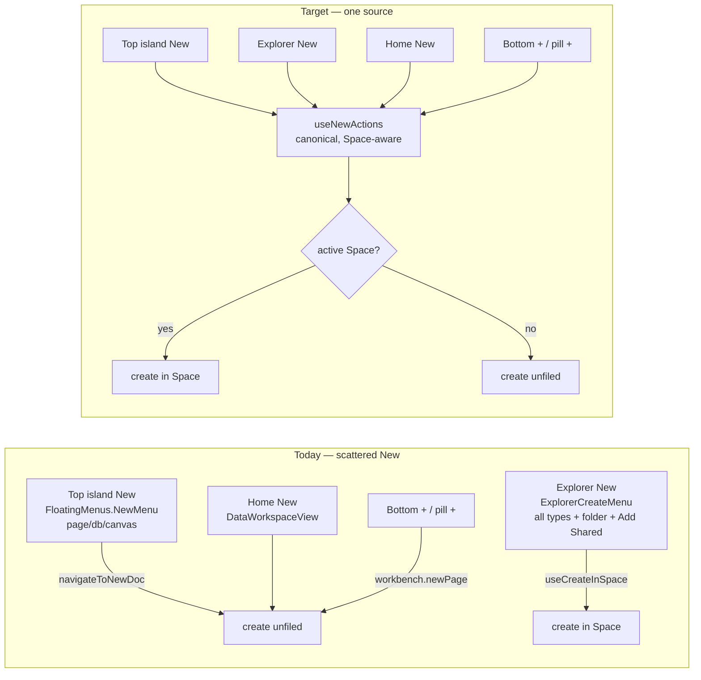
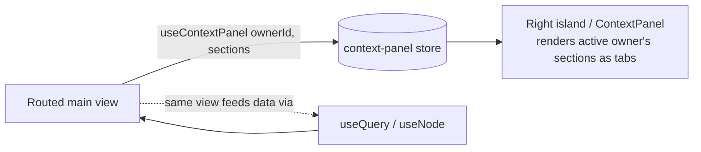

# Wiring The Floating Shell's Affordances To Their Actions

> Status: exploration `[_]` — not yet implemented.
> Sibling context: [[0286_WORKBENCH_FLOATING_ISLANDS_REDESIGN]] (the redesign
> this cleans up after), [[0285_RIGHT_CLICK_CONTEXT_MENUS_ACROSS_THE_UI]] (the
> `useNodeActions` verb list we should reuse), [[0181_SPACES_NESTED_AUTH]] /
> [[0190_COHESIVE_DOMAIN_UIS]] (Space-scoped filing).

## Problem Statement

The Floating Islands redesign (0286, #426) + its refinements (0287, #427)
re-homed the workbench chrome into islands and moved several affordances to new
locations. The **paint** landed, but some affordances are now **stripped
duplicates or placeholders** — the button exists in its new spot, but its old,
fuller behaviour still lives in the old spot (or nowhere).

The clearest case, called out directly: the **"New" button in the top sidebar
island** is a three-item stub (`page / database / canvas`), while the *real*
New action — Space-aware filing, every creatable type, **New folder**, and
**Add Shared…** — still lives inside the **Explorer** contextual island as
`ExplorerCreateMenu`. The design intent is the inverse: the **top island** is
the primary, always-visible New; the Explorer's in-list New is at most a
secondary, in-context convenience.

Beyond New, a sweep of the new shell finds a handful of buttons that render but
don't do the right thing yet (the editor header **⋯ More** is inert; the pill
**History** button is a placeholder; the bottom-island **+** is a generic
"new page" regardless of surface; the notifications popover shows only a
request count). This exploration audits every re-homed affordance and prescribes
how to wire each to its intended action, with the **New-action consolidation**
as the centrepiece.

## Executive Summary

1. **Extract one canonical New-action source** — a `useNewActions()` hook (+ a
   shared `<NewMenu>` content component) that owns the *whole* create surface:
   every `CreatableDocType`, **New folder**, **Add Shared…**, and the
   **Space-aware target** ("in {Space}" vs unfiled). Today that logic is
   duplicated/partial across `ExplorerCreateMenu`, the top-island `NewMenu`
   (`FloatingMenus.tsx`), `useCreateInSpace`, and `DataWorkspaceView`.
2. **Point the top-island New button at it** — replace `FloatingMenus`'
   three-item `NewMenu` with the canonical `<NewMenu>`; it becomes the primary,
   Space-aware New. Demote `ExplorerCreateMenu` to reuse the same hook (no
   behaviour divergence) or drop it now that the primary lives up top.
3. **Fix the other re-homed affordances** — wire the editor **⋯ More** to the
   0285 `useNodeActions` verb list for the active tab; make the bottom-island
   **+** surface-aware; give the pill **History** a real target (recents /
   reopen-closed-tab); enrich (or honestly link) the notifications popover.
4. **Register the create verbs as commands** so `⌘K`, the pill **+**, and the
   New menu all invoke one code path.
5. **Move the workspace/Space scope picker up into the top island.** The
   `ExplorerScopeBar` (0190) — the picker that sets `currentSpaceId`, i.e. the
   very Space the New action files into — currently lives *inside* the Explorer
   contextual island. It belongs beside the New button in the top island so the
   "am I filtered, and to what?" answer and the "in {Space}" filing target are
   one coherent control, visible on every surface (not just Explorer).
6. **Make the user avatar the single home for identity, profile, settings and
   sign-out.** The top-left avatar already opens a menu; consolidate *all*
   account/settings entry points there (Profile, Settings, theme, and a missing
   **Sign out**) and ensure no stray settings affordance survives elsewhere on
   the desktop shell.
7. **Wire every surface as master-detail: list in the bottom island, full
   content in the main area.** Panel surfaces (Explorer/Chats/Tasks/Today/Data/
   AI) already render their list in the bottom island and open items in the
   editor. The **route surfaces in the "More" roll-out** (People/CRM, Discover,
   Inbox, Meetings, Finance, Analytics) currently jump straight to a full route
   with **no bottom-island list** — they need the same two-part shape so
   selecting the surface shows its sub-menu on the left and its content on the
   right, consistently for *every* tab including those under **More**.
8. **Back every count, list and badge with a real query.** The surface lists
   render real slot views, but the nav **counts/badges are only wired for
   Inbox** (`useRequestCount`); Tasks/Chats/etc. show none, and the new
   master-detail list panels must each read real domain data
   (`useQuery`/`useNode`/`useTasks`/channel-unread/…). No representative or
   placeholder data should survive in the shell chrome.
9. **Make the contextual right sidebar adapt to every main UI.** The right
   island (behind the comments icon) is the contribution-driven `ContextPanel`:
   the routed view publishes its sections via `useContextPanel`. Page, Database,
   Canvas, Tasks and Chat already do; **Meetings, CRM, Finance, Analytics,
   Discover, Inbox, Dashboard and Map do not**, so the panel is empty there. Each
   main UI should publish sections appropriate to *it*, so the right sidebar
   changes shape to meet the surface.
10. **Retire the per-view header chrome into the shell.** Each main view still
    renders its *own* Share button, presence avatars and toolbar/actions
    (`PageView` mounts `ShareButton` + `PresenceAvatars` + `PageToolbar`;
    Database/Canvas do the same). These now **duplicate** the shell's
    `EditorHeader` (its Share button, its "you" facepile, its ⋯ More). The
    per-view copies should be removed and their real data — the active doc's
    share target, its live collaborators/presence, its contextual actions — fed
    to the shell header (**Share** + **user-count**) and the ⋯ menu / right
    sidebar via a small header-contribution API (the `useContextPanel` pattern).



## Current State In The Repository

### The New action lives in four places

| Where | File | What it does today |
| --- | --- | --- |
| **Top island New** | [`FloatingMenus.tsx`](../../apps/web/src/workbench/FloatingMenus.tsx) `NewMenu` | `page / database / canvas` only, via `navigateToNewDoc` — **not** Space-aware, no folder, no Add Shared |
| **Explorer New** | [`Explorer.tsx`](../../apps/web/src/workbench/views/Explorer.tsx) `ExplorerCreateMenu` (l.45) + `handleCreate` (l.427) | every type (`page/database/canvas/dashboard/map/lab`), **Add Shared…**, Space target label ("in {Space}"); files via `useCreateInSpace` when a real Space is scoped |
| **Space-aware create** | [`useCreateInSpace.ts`](../../apps/web/src/hooks/useCreateInSpace.ts) | eager-creates page/db/canvas/map with `space` set, then navigates; lab/dashboard created normally |
| **Shared table + items** | [`doc-creation.tsx`](../../apps/web/src/lib/doc-creation.tsx) | `DOC_TYPE_ROUTES`, `navigateToNewDoc`, `CreateDocMenuItems` |
| **Home New** | [`DataWorkspaceView.tsx`](../../apps/web/src/components/DataWorkspaceView.tsx) | the `/` "All Documents" view's own New/Import affordances |
| **New folder** | [`explorer-folders-context.tsx`](../../apps/web/src/workbench/views/explorer-folders-context.tsx) `createFolder` (l.134) | creates a `folder` node named "New folder" |

`ExplorerCreateMenu` is the most complete; the top-island `NewMenu` is the stub
the user wants promoted.

### Two different "workspace" pickers

"Workspace" is overloaded in the shell — untangling it matters here:

| Picker | What it selects | File | Location today |
| --- | --- | --- | --- |
| **Bench / layout switcher** (0280) | which saved *shell layout* (`xnet:Workspace` node) is loaded | `WorkspaceSwitcher` via the `workspace.switch` command | already in the top island — the `xN {name}` selector button |
| **Space scope picker** (0190) | the active *data Space* (`currentSpaceId`) — the filter *and* the New-doc filing target | [`ExplorerScopeBar.tsx`](../../apps/web/src/workbench/views/ExplorerScopeBar.tsx) | **buried in the Explorer contextual island** ([`Explorer.tsx:440`](../../apps/web/src/workbench/views/Explorer.tsx)) |

The **Space scope picker** is the one to promote: it decides where New files
(`useCreateInSpace(type, currentSpaceId)`), it drives the status-bar
`ScopeStatus`, and it's only reachable while the Explorer surface is showing —
yet it governs behaviour on *every* surface. Moving it into the top island (next
to New) makes scope a first-class, always-visible control and removes the
"why did my new page file there?" surprise on non-Explorer surfaces.

```mermaid
flowchart TB
  subgraph Top["Top island (target)"]
    WS[Bench switcher\nxN {name} — already here]
    SP[Space scope picker\nExplorerScopeBar — move up]
    NB[New button]
  end
  SP -->|sets currentSpaceId| ST[(workbench store)]
  NB -->|useNewActions reads scope| ST
  ST --> FILE[new doc files into the active Space]
  ST --> SB[status-bar ScopeStatus]
  EX[Explorer list] -->|still reflects filter| ST
```

### Surfaces are half-wired: list-in-bottom-island + content-in-main

The redesign's `SurfaceDef` ([`surfaces.ts`](../../apps/web/src/workbench/surfaces.ts))
splits surfaces into two disjoint kinds:

- `kind: 'panel'` → the bottom island renders a registered slot view (its
  **list/sub-menu**); picking an item navigates the editor (its **content**).
  Explorer, Chats, Tasks, Today, Data, AI already work this way.
- `kind: 'route'` → selecting it just navigates the editor; the bottom island is
  left on whatever panel it last showed. People/CRM, Discover, Inbox, Meetings,
  Finance, Analytics are all route-only — **they have no bottom-island list.**

The design intent (and the calm-shell prior art, [[0250_EVERYPERSON_SHELL]]'s
`list · surface`) is that **every** surface is master-detail: a list on the left
(bottom island), the selected item full-screen on the right (main area). So the
model should stop being an either/or and instead give each surface **both** a
`listViewId` (bottom island) and a detail `to`/route (main area).

```mermaid
flowchart LR
  Pick[Pick a surface\n(primary row or More roll-out)] --> Set[activeSurface = id]
  Set --> L[Bottom island renders\nsurface.listViewId]
  L -->|select an item| R[Main area opens\nthe item's route/tab]
  Set -.optional default.-> R
```

Registered slot views already exist for more surfaces than the model uses —
including `notifications` (`NotificationsTray`), `sync`, and `console`
([`builtin-slot-views.tsx`](../../apps/web/src/workbench/builtin-slot-views.tsx)).
So some route surfaces can be wired to an existing list for free; the rest need a
thin list panel (or a master/detail split of their route view).

| Surface (More-inclusive) | Bottom-island list today | Main-area content | Wiring needed |
| --- | --- | --- | --- |
| Explorer | ✅ `explorer` | doc routes | none |
| Chats | ✅ `chats` (channels + DMs) | `/channel/$id` | none |
| Tasks | ✅ `tasks` | `/tasks` | none |
| Today | ✅ `today` | routes | none |
| Data | ✅ `data` | `/db/$id` | none |
| AI | ✅ `ai-chat` | — | none |
| **Inbox** | ❌ (route only) | `/requests` | map to the existing **`notifications`** (`NotificationsTray`) list |
| **People / CRM** | ❌ | `/crm` | new list panel (contacts) → `/crm/$id` detail |
| **Discover** | ❌ | `/discover` | new list panel (people/feeds) → detail |
| **Meetings** | ❌ | `/meetings` | new list panel (meetings) → `/meetings/$id` |
| **Finance** | ❌ | `/finance` | new list panel (accounts/ledgers) → detail |
| **Analytics** | ❌ | `/analytics` | list of reports, or a single full view (no list — see options) |

### The contextual right sidebar is contribution-driven — but half-populated

The right island wraps [`ContextPanel`](../../apps/web/src/workbench/ContextPanel.tsx),
which renders whatever the **routed view publishes** through
[`useContextPanel(ownerId, sections)`](../../apps/web/src/workbench/context-panel.tsx)
(0166). The mechanism is exactly what the ask needs — "the sidebar changes to
meet the requirements of the given UI" — it's just **not called from every UI**:

| Main UI | Publishes context sections? | File |
| --- | --- | --- |
| Page | ✅ properties / comments / backlinks | [`PageView.tsx`](../../apps/web/src/components/PageView.tsx) |
| Database | ✅ | [`DatabaseView.tsx`](../../apps/web/src/components/DatabaseView.tsx) |
| Canvas | ✅ selection inspector | [`CanvasView.tsx`](../../apps/web/src/components/CanvasView.tsx) |
| Tasks | ✅ | [`TasksView.tsx`](../../apps/web/src/components/TasksView.tsx) |
| Chat | ✅ room/members | [`comms/RoomSection.tsx`](../../apps/web/src/comms/RoomSection.tsx) |
| **Meetings** | ❌ | `routes/meetings.tsx` → participants / notes / transcript |
| **People / CRM** | ❌ | `routes/crm.tsx` → deal / activity / related contacts |
| **Finance** | ❌ | `routes/finance.tsx` → account / ledger summary |
| **Analytics** | ❌ | `routes/analytics.tsx` → filters / legend / date range |
| **Discover** | ❌ | `routes/discover.tsx` → intent filters / match reasons |
| **Inbox / Dashboard / Map** | ❌ | request detail / widget inspector / layer list |

So the right-sidebar work is **not** new plumbing — it's calling the existing
`useContextPanel` from each remaining main view with sections that fit it. The
redesign's right island already renders them (verified: pages show
Properties/Comments; other routes show the empty "Context" state today).



### Data wiring: every count/list/section reads a real query

The shell chrome must not fabricate. Audit each data-bearing affordance to a
real hook:

| Affordance | Real source |
| --- | --- |
| Inbox badge | `useRequestCount` ✅ |
| **Tasks / Chats / Meetings counts** | `useTasks`, unread-channel query, upcoming-meetings query (❌ today — no badge) |
| Surface **list panels** (existing) | already on `useQuery`/domain hooks ✅ |
| Surface **list panels** (new CRM/Meetings/…) | each new panel wired to its domain query, not seed data |
| Notifications popover | a real per-user notification query if one exists, else the honest `/requests` link |
| Right-sidebar sections | the routed view's own `useQuery`/`useNode` (comments, participants, ledger rows, …) |

`useQuery`/`useNode` are also **instrumented** by devtools (the Queries panel we
docked in 0287), so "properly wired" is verifiable live: every surface's queries
should appear there with results, and none should be firing from placeholder
descriptors.

### Per-view header chrome still duplicates the shell

The redesign gave the shell an `EditorHeader` (Share, "you" facepile, ⋯ More),
but the **main views never gave theirs up**:

| View | Renders its own… | File |
| --- | --- | --- |
| Page | `ShareButton` (l.298), `PresenceAvatars` (l.295), `PageToolbar` (l.466) | [`PageView.tsx`](../../apps/web/src/components/PageView.tsx) |
| Database | `ShareButton` + toolbar | [`DatabaseView.tsx`](../../apps/web/src/components/DatabaseView.tsx) |
| Canvas | `ShareButton` + toolbar | [`CanvasView.tsx`](../../apps/web/src/components/CanvasView.tsx) |

So a page shows **two** Share buttons (in-view and shell) and **two** presence
displays (the view's real `PresenceAvatars` and the shell's placeholder "you").
The shell header is the "new home" — the per-view copies must move into it,
carrying their *real* data (the shell's facepile is a placeholder precisely
because presence lives in the view).

The catch: presence/share/actions are owned by the mounted view (Y.Doc awareness,
docId, view-specific verbs) — the shell can't read them directly. The clean
seam is the **same contribution pattern the right sidebar uses**: the active view
publishes a small `{ share, collaborators, actions }` payload to a header store;
`EditorHeader` renders it (real facepile + user-count + Share + ⋯), and the view
stops drawing its own. When no view contributes (route surfaces), the header
falls back to today's minimal set.

```mermaid
flowchart LR
  PV[PageView / DatabaseView / CanvasView] -->|useEditorChrome ownerId, {share, collaborators, actions}| HS[(header store)]
  HS --> EH[EditorHeader\nfacepile + user-count + Share + ⋯]
  PV -. deletes its own .-> X[inline ShareButton / PresenceAvatars / toolbar]
```

### Affordance → action audit (the whole sweep)

| Affordance (new location) | File | Current wiring | Gap / intended |
| --- | --- | --- | --- |
| **Top-island New** | `SidebarIslands` → `FloatingMenus.NewMenu` | 3 types, unfiled | ⭐ canonical Space-aware New (all types + folder + Add Shared + target) |
| Top-island Search / workspace(bench) / avatar / rows / More | `SidebarIslands.tsx` | `search.open` / `workspace.switch` / profile / activate / surfaces | ✅ correct |
| **Space scope picker** | [`ExplorerScopeBar.tsx`](../../apps/web/src/workbench/views/ExplorerScopeBar.tsx), mounted in `Explorer.tsx` | sets `currentSpaceId` (filter + New target) — only visible on the Explorer surface | ⭐ move into the top island (beside New) so scope is always visible and drives New/status everywhere |
| **Bottom-island header +** | `SidebarIslands.tsx` `BottomIsland` | `workbench.newPage` (always a page) | surface-aware: Tasks→new task, Chats→new channel, Data→new database, Explorer→canonical New in Space |
| **Editor ⋯ More** | [`EditorHeader.tsx`](../../apps/web/src/workbench/EditorHeader.tsx) | **inert** (no `onClick`) | active-tab node menu via 0285 [`useNodeActions`](../../apps/web/src/hooks/useNodeActions.ts) (rename/duplicate/copy link/move/favorite/export/delete) |
| Editor facepile / **user-count** | `EditorHeader.tsx` | placeholder "you" avatar | real collaborators/presence contributed by the active view (retire `PageView`'s `PresenceAvatars`) |
| Editor **Share** | `EditorHeader.tsx` + per-view `ShareButton` | **two** Share buttons (shell + in-view) | one Share in the shell header, targeting the active doc; delete the per-view `ShareButton` |
| Editor Share / Comments / Bell | `EditorHeader.tsx` | ShareDialog / `togglePanel('right')` / notif menu | ✅ (bell depends on notif wiring below) |
| **Right sidebar (contextual)** | `ContextPanel` + `useContextPanel` | populated for Page/DB/Canvas/Tasks/Chat; **empty for Meetings/CRM/Finance/Analytics/Discover/Inbox/Dashboard/Map** | each of those views calls `useContextPanel` with sections that fit it |
| **Nav counts / badges** | `SidebarIslands.tsx`, `surfaces.ts` | only Inbox (`useRequestCount`) | back Tasks/Chats/Meetings badges with real queries |
| **Pill History** | [`TabBar.tsx`](../../apps/web/src/workbench/TabBar.tsx) `PillControls` | `search.open` (placeholder) | recents fly-out / reopen-closed-tab, or drop it |
| Pill **+** new tab | `TabBar.tsx` | `workbench.newPage` | route through the canonical New (page default) |
| Pill Split | `TabBar.tsx` | `splitWith` | ✅ |
| **Notifications popover** | `FloatingMenus.tsx` `NotifMenu` | request count + link to `/requests` | mentions + resolved comments + share requests if a source exists; else keep the honest link |
| **User avatar menu** | `FloatingMenus.tsx` `ProfileMenu` | Profile & Settings → `/settings`, theme toggle | the single home for identity: Profile, **Settings**, theme, account/DID, and a missing **Sign out**; no other settings entry on the desktop shell |
| Assistant dock composer | [`FloatingDock.tsx`](../../apps/web/src/workbench/FloatingDock.tsx) | routes to the AI surface | optionally seed the AI panel with the typed text |
| Home New | `DataWorkspaceView.tsx` | its own New/Import | defer to the shell's canonical New (dedupe) |
| Dev-tools Feature flags | [`DevToolsIsland.tsx`](../../apps/web/src/workbench/DevToolsIsland.tsx) | `/experiments` | ✅ |

### Command surface today

`workbench.newPage` (`Mod-T`) is the only registered create command
([`EditorArea.tsx`](../../apps/web/src/workbench/EditorArea.tsx)). There is no
`workbench.new` (open-the-menu) or per-type command, so the pill **+** and the
menu can't share one path yet.

## External Research

Prior art for a **single global "New"**:

- **Notion** — a persistent "＋ New page" at the sidebar's foot is *the* create
  entry; context (the current teamspace) sets where it files. One button, one
  code path, target inferred from context — exactly the Space-aware model here.
- **Linear** — global create is a command (`C`) surfaced from a top-of-sidebar
  button *and* the palette; both invoke the same action. Argues for registering
  create as a **command** so button + `⌘K` + shortcut converge.
- **Claude / Slack** — a top-left composer/New anchored above navigation; the
  primary create is chrome-level, not buried in a list — matching "move it up
  into the top island."

Common thread: **one create action, invoked from several entry points, target
inferred from the active scope.** That is the `useNewActions()` recommendation.

## Key Findings

1. The New logic is **already centralised at the data layer** (`useCreateInSpace`
   + `doc-creation.tsx`); what's missing is a **shared menu/action layer** so
   every entry point renders the same items and files the same way.
2. `ExplorerCreateMenu` is the de-facto spec for "complete New" — copy its
   contents (types + folder + Add Shared + target label) into the shared piece.
3. **Add Shared…** opens `AddSharedDialog`; to offer it from the top island the
   dialog (or a command to open it) must be reachable from the shell, not only
   from inside Explorer.
4. Most other gaps are small and independent — they can land as follow-up
   commits after the New consolidation without blocking it.
5. The 0285 `useNodeActions` verb list already exists and is the right fill for
   the inert editor **⋯ More** (no new menu logic needed).

## Options And Tradeoffs

### For the New consolidation

| Option | How | Pros | Cons |
| --- | --- | --- | --- |
| **A. Shared hook + `<NewMenu>`** (recommended) | `useNewActions()` returns `{ types, createDoc(type), createFolder(), addShared(), targetName }`; a `<NewMenu>` renders them; top island, Explorer, home all use it | one source of truth; Space-aware everywhere; minimal churn | one new hook + component; must lift `AddSharedDialog` reach |
| B. Command-registry-only | register `workbench.new.*` commands; menus are thin lists of commands | palette + shortcut + button converge for free | commands can't easily carry the "in {Space}" label / Add-Shared dialog; more indirection for a visual menu |
| C. Leave duplicates, just enrich the top-island stub | copy the items inline into `FloatingMenus.NewMenu` | smallest diff | perpetuates two diverging New menus — the exact smell we're removing |

**A**, with the create verbs *also* registered as commands (a light dose of B)
so `⌘K` and the pill **+** share the path.

### For the editor ⋯ More

- Reuse `useNodeActions(activeTab)` (0285) → an `ActionMenuList` in an anchored
  popover. Consistent with right-click menus elsewhere; near-zero new logic.

### For the bottom-island +

- Map `activeSurface` → a default create: `explorer` → canonical New (in Space),
  `tasks` → new task, `chats` → new channel, `data` → new database, else hide
  the +. Small `switch`, no new subsystem.

### For the workspace/Space scope picker

| Option | How | Pros | Cons |
| --- | --- | --- | --- |
| **A. Compact scope control in the top island** (recommended) | render a small scope chip/dropdown in `SidebarIslands` (its own row, or folded into the `xN {name}` selector as a second line); `ExplorerScopeBar` stays as the full multi-select control but the *primary* single-scope pick lives up top | scope always visible; sits beside New (coherent filing target); works on every surface | two renderings of scope to keep in sync (share the `explorer-scope` helpers so state is one source) |
| B. Merge bench + Space into one "workspace" selector | the `xN {name}` button opens a combined picker (layouts + Spaces) | one control | conflates two orthogonal concepts (layout vs data Space) — likely confusing |
| C. Leave it in Explorer | — | zero work | the exact problem: scope hidden on non-Explorer surfaces |

**A** — a compact single-scope picker in the top island backed by the existing
`explorer-scope` state (`currentSpaceId` / `applyScopeSelection`), with the
Explorer's `ExplorerScopeBar` kept (or thinned) for the multi-Space *view*
filter. Both read/write the same store, so they never diverge.

### For the user avatar (profile + settings)

The avatar menu already exists (`ProfileMenu`); this is consolidation, not new
UI. Fold every account/settings entry into it — Profile, **Settings**, theme,
the DID/account line, and **Sign out** — and confirm nothing else on the desktop
shell opens settings (the old sidebar Settings row is already gone; keep it
that way). Low-risk, mostly a content pass on `ProfileMenu`.

### For the surfaces (master-detail wiring)

| Option | How | Pros | Cons |
| --- | --- | --- | --- |
| **A. Give `SurfaceDef` both a `listViewId` and a `to`** (recommended) | evolve the model from `kind:'panel'\|'route'` to "every surface has a bottom-island list + a main detail"; register a list slot view per route surface (reuse `notifications` for Inbox); selecting the surface sets `activeSurface` (→ list) and picking a list item navigates the detail | uniform master-detail for *all* tabs incl. More; reuses the slot registry; the calm-shell pattern, proven | need ~5 new thin list panels (CRM/Discover/Meetings/Finance/Analytics); some route views must split into master/detail |
| B. Keep route surfaces full-bleed, no list | leave as-is | zero work | violates the design ask; scope/New/context feel inconsistent between surfaces |
| C. Generic "recents in this surface" list | one list panel that shows recent nodes of the surface's type | one component | weak — not the real domain list (channels, meetings, contacts) |

**A**, reusing existing panels where they exist (`notifications` → Inbox) and
adding thin list panels for the rest, each opening its route as the detail. For
a genuinely single-view surface (e.g. Analytics overview) it's acceptable to
show a short section/report list rather than invent items.

### For the contextual right sidebar

Reuse the existing `useContextPanel` API — no new subsystem. Each remaining main
view (Meetings, CRM, Finance, Analytics, Discover, Inbox, Dashboard, Map)
publishes a memoized `sections` array keyed by a stable `ownerId`
(e.g. `meeting:<id>`). Sections read the view's own `useQuery`/`useNode`, so the
right sidebar is both **contextual** (per UI) and **live** (real data) by
construction. The one design rule: sections must clear on unmount (the hook's
`clear(ownerId)` already does) so switching surfaces never shows stale context.

### For query wiring

No architectural change — it's a completeness sweep. For each count/list/section
that shows placeholder or nothing, point it at the real hook, and verify in the
devtools **Queries** panel that it fires with results. Prefer existing domain
hooks (`useTasks`, `useSpaces`, channel/meeting queries) over hand-rolled reads.

### For the per-view header chrome

| Option | How | Pros | Cons |
| --- | --- | --- | --- |
| **A. Header-contribution API** (recommended) | a `useEditorChrome(ownerId, {share, collaborators, actions})` store mirroring `useContextPanel`; the view publishes, `EditorHeader` renders, the view deletes its inline Share/presence/toolbar | single header; real presence in the shell; symmetric with the right-sidebar pattern; route surfaces fall back cleanly | one small new store + touching each view once |
| B. Shell reads via hooks keyed by active nodeId | shell calls a presence/share hook for the active tab | no view edits to publish | presence needs the live Y.Doc awareness the view owns — a hook outside the view would re-open the doc; wasteful/fragile |
| C. Keep per-view, hide the shell header there | conditionally blank the shell header | tiny diff | leaves two code paths and the shell facepile permanently fake |

**A** — the header becomes contribution-driven exactly like the right sidebar,
so both the top chrome and the side chrome adapt to the active UI from one
mechanism, and the per-view Share/presence/toolbars are deleted (not hidden).

## Recommendation

Ship in this order (each a self-contained commit):

1. **`useNewActions()` + `<NewMenu>`** (canonical, Space-aware) — the core.
2. **Top-island New** renders `<NewMenu>` (via `FloatingMenus`); make
   `AddSharedDialog` reachable from the shell (a `share.addShared` command or a
   shell-level dialog host).
3. **Explorer** refactored to consume `useNewActions()` (kill the divergent
   copy) — or drop its inline New now the primary lives up top.
4. **Editor ⋯ More** → `useNodeActions` popover.
5. **Bottom-island +** surface-aware; **pill +** and **`⌘K`** via registered
   `workbench.new*` commands.
6. **Move the Space scope picker into the top island** (compact single-scope
   control backed by `explorer-scope` state; keep Explorer's bar for the
   multi-Space view filter) — so New's "in {Space}" target is set right there.
7. **Surfaces → master-detail** — evolve `SurfaceDef` to carry both a
   `listViewId` (bottom island) and a detail `to`; wire Inbox to the existing
   `notifications` list and add thin list panels for CRM/Discover/Meetings/
   Finance/Analytics so every tab (incl. More) shows list-left, content-right.
8. **Avatar menu** consolidation (Profile/Settings/theme/Sign out).
9. **Contextual right sidebar** — call `useContextPanel` from every remaining
   main view (Meetings/CRM/Finance/Analytics/Discover/Inbox/Dashboard/Map) with
   sections that fit it (one view per commit).
10. **Query wiring sweep** — real hooks behind every count/list/section; verify
    in the devtools Queries panel. Runs alongside 7 & 9 (each new panel/section
    lands already wired).
11. **Retire per-view header chrome** — add `useEditorChrome`; move
    Share/presence/actions from Page/Database/Canvas into the shell `EditorHeader`
    (real facepile + user-count) and delete the in-view copies.
12. **History pill** + **notifications popover** — polish pass.

## Example Code

```tsx
// apps/web/src/workbench/new-actions.ts
import { useNavigate } from '@tanstack/react-router'
import { useCallback } from 'react'
import { useCreateInSpace } from '../hooks/useCreateInSpace'
import { navigateToNewDoc, type CreatableDocType, type NavigateLike } from '../lib/doc-creation'
import { useExplorerFolders } from './views/explorer-folders-context'
import { isRealSpace } from './views/explorer-scope'
import { useWorkbench } from './state'
import { useSpaces } from '../hooks/useSpaces'

export const NEW_DOC_TYPES: CreatableDocType[] = [
  'page', 'database', 'canvas', 'dashboard', 'map', 'lab'
]

/** The one Space-aware New action set, shared by every "New" entry point. */
export function useNewActions() {
  const navigate = useNavigate()
  const createInSpace = useCreateInSpace()
  const { createFolder } = useExplorerFolders()
  const currentSpaceId = useWorkbench((s) => s.currentSpaceId)
  const { getSpace } = useSpaces()
  const filed = isRealSpace(currentSpaceId)
  const targetName = filed ? (getSpace(currentSpaceId)?.name ?? null) : null

  const createDoc = useCallback((type: CreatableDocType) => {
    if (filed) return void createInSpace(type, currentSpaceId)
    navigateToNewDoc(navigate as unknown as NavigateLike, type)
  }, [filed, currentSpaceId, createInSpace, navigate])

  return { types: NEW_DOC_TYPES, targetName, createDoc, createFolder }
}
```

```tsx
// FloatingMenus.tsx — the top-island New becomes canonical
function NewMenu({ close }: { close: () => void }) {
  const { types, targetName, createDoc, createFolder } = useNewActions()
  return (
    <div className="w-[240px] p-1.5">
      {targetName && <div className={eyebrow}>Creating in {targetName}</div>}
      {types.map((t) => (
        <button key={t} className={item} onClick={() => { createDoc(t); close() }}>
          {/* DOC_TYPE_ROUTES[t].icon + label */}
        </button>
      ))}
      <div className="mx-0.5 my-1 h-px bg-hairline" />
      <button className={item} onClick={() => { void createFolder(null); close() }}>New folder</button>
      <button className={item} onClick={() => { openAddShared(); close() }}>Add shared…</button>
    </div>
  )
}
```

```tsx
// EditorHeader.tsx — wire the inert ⋯ More to the 0285 verb list
const actions = useNodeActions(activeTab ? { id: activeTab.nodeId, type: activeTab.nodeType } : null)
// render <ActionMenuList actions={actions}/> in an anchored popover on click
```

## Risks And Open Questions

- **`AddSharedDialog` reach** — cleanest is a `share.addShared` command (or a
  shell-level dialog host) so both Explorer and the top island can open it
  without prop-drilling. Decide the mechanism before step 2.
- **`useExplorerFolders` provider scope** — `createFolder` comes from
  `ExplorerFoldersProvider`, currently mounted inside Explorer. Calling it from
  the top island needs the provider higher up (or a folder-create that doesn't
  depend on that context). Verify before wiring folder-create into the shell New.
- **Bottom-island + for route surfaces** — routes have no obvious "new"; hide
  the + rather than invent one.
- **Notifications** — is there a real per-user notification source beyond
  `useRequestCount`? If not, keep the honest "N pending requests → /requests"
  and don't fabricate a feed.
- **Home `DataWorkspaceView` New** — dedupe vs leave; low priority, but note it
  so the two News don't drift again.
- **How many new list panels?** CRM/Discover/Meetings/Finance/Analytics each
  need a bottom-island list. Scope this — reuse existing route sub-views where a
  list already exists inside the route (extract it) rather than building five
  from scratch; land them incrementally (one surface per commit).
- **Route ↔ activeSurface sync** — with route surfaces gaining lists, selecting
  a surface must set `activeSurface` *and* the bottom island must reflect the
  route the user is actually on (deep-link `/meetings/x` → Meetings list active).
  Reconcile `activeSurface` with the router on navigation, like the tab store
  does in `EditorArea`.

## Implementation Checklist

- [x] Add `useNewActions()` + `NEW_DOC_TYPES` in `apps/web/src/workbench/new-actions.ts`.
- [x] Add a shared `<NewMenu>` (or fold the items into `FloatingMenus`) covering
      all types + New folder + Add Shared… + the "in {Space}" target label.
- [x] Make `AddSharedDialog` reachable from the shell (a `share.addShared`
      command or a shell-level host) and open it from the New menu.
- [x] Point the **top-island New** button at the canonical `<NewMenu>`.
- [x] Refactor `ExplorerCreateMenu` to consume `useNewActions()` (or remove it),
      so there is exactly one New behaviour.
- [ ] Register create verbs as commands (`workbench.new`, `workbench.new.page`…)
      and route the **pill +** and `⌘K` through them.
- [x] Make the **bottom-island +** surface-aware (Tasks/Chats/Data/Explorer),
      hiding it for route surfaces.
- [ ] Add a compact **Space scope picker** to the top island (`SidebarIslands`),
      backed by `explorer-scope` state (`currentSpaceId` / `applyScopeSelection`);
      keep/thin `ExplorerScopeBar` for the multi-Space view filter.
- [ ] Wire the editor **⋯ More** to `useNodeActions(activeTab)` in a popover.
- [ ] Give the **pill History** button a real target (recents / reopen closed)
      or remove it.
- [ ] Enrich or honestly link the **notifications** popover.
- [x] **Avatar menu**: consolidate Profile + Settings + theme + account/DID +
      **Sign out** into `ProfileMenu`; confirm no other desktop settings entry.
- [ ] **Surfaces master-detail**: evolve `SurfaceDef` to `{ listViewId?, to? }`;
      map **Inbox → `notifications`** list; add thin list panels for **CRM,
      Discover, Meetings, Finance, Analytics** (one commit each), each opening
      its route as the main-area detail; register them so **every More-section
      tab** has a bottom-island list.
- [ ] Reconcile `activeSurface` with the router so deep-links light the right
      surface and its list.
- [ ] **Contextual right sidebar**: call `useContextPanel(ownerId, sections)`
      from Meetings, CRM, Finance, Analytics, Discover, Inbox, Dashboard and Map
      (one view per commit), each publishing sections that fit the UI and read
      the view's own queries; sections clear on unmount.
- [ ] **Query wiring**: back Tasks/Chats/Meetings nav badges with real queries;
      every new list panel + right-sidebar section reads a real
      `useQuery`/`useNode`/domain hook (no seed/placeholder data in chrome).
- [ ] **Per-view header chrome**: add a `useEditorChrome(ownerId, {share,
      collaborators, actions})` store; have Page/Database/Canvas publish to it
      and **delete** their inline `ShareButton` / `PresenceAvatars` / toolbar;
      `EditorHeader` renders the real facepile + user-count + Share + ⋯.
- [ ] Dedupe the home `DataWorkspaceView` New against the shell New.

## Validation Checklist

- [ ] From the **top-island New**, creating each type while a Space is active
      files the node into that Space (shows under it in Explorer); with no Space
      active it creates unfiled — identical to the old Explorer New.
- [ ] **New folder** and **Add Shared…** work from the top island.
- [ ] The pill **+**, `⌘T`/`⌘K` "New page", and the New menu all reach one code
      path (create a page three ways → identical result).
- [ ] The bottom-island **+** creates the right thing per surface; hidden on
      route surfaces.
- [ ] The top-island **Space scope picker** sets `currentSpaceId`, is visible on
      every surface, and stays in sync with Explorer's bar and the status-bar
      `ScopeStatus` (change scope up top → New files there, status echoes it).
- [ ] Every surface — **including all the More-section tabs** — shows a
      bottom-island **list** and opens its selection as **full content in the
      main area**; Inbox uses the `notifications` list; deep-linking a detail
      route lights its surface + list.
- [ ] The **avatar menu** is the only desktop route to Profile/Settings; theme
      and **Sign out** work from it.
- [ ] Opening each main UI changes the **right sidebar** to that UI's own
      sections (a meeting shows participants/notes; a CRM contact shows
      deal/activity; …) and they clear when you switch away — no stale context.
- [ ] The devtools **Queries** panel shows a real, resulting query behind every
      surface count, list panel and right-sidebar section — none firing from
      placeholder descriptors.
- [ ] A page/database/canvas shows **exactly one** Share button and **one**
      presence/user-count — in the shell header, reflecting the real doc's
      collaborators — with the in-view copies gone.
- [ ] Editor **⋯ More** opens the active tab's node actions; each verb behaves
      as in the right-click menu (0285).
- [ ] No duplicate/diverging New menus remain (grep for `navigateToNewDoc`
      callers; each should go through `useNewActions`).
- [ ] `pnpm test`, typecheck, lint, humane-pattern gates pass; live-render in the
      worktree preview (light + dark); DCO + changelog fragment.

## References

- Redesign: [`0286_[x]_WORKBENCH_FLOATING_ISLANDS_REDESIGN.md`](./0286_[x]_WORKBENCH_FLOATING_ISLANDS_REDESIGN.md)
- Repo — New action: [`lib/doc-creation.tsx`](../../apps/web/src/lib/doc-creation.tsx),
  [`hooks/useCreateInSpace.ts`](../../apps/web/src/hooks/useCreateInSpace.ts),
  [`views/Explorer.tsx`](../../apps/web/src/workbench/views/Explorer.tsx),
  [`views/explorer-folders-context.tsx`](../../apps/web/src/workbench/views/explorer-folders-context.tsx),
  [`components/DataWorkspaceView.tsx`](../../apps/web/src/components/DataWorkspaceView.tsx)
- Repo — shell affordances: [`FloatingMenus.tsx`](../../apps/web/src/workbench/FloatingMenus.tsx),
  [`SidebarIslands.tsx`](../../apps/web/src/workbench/SidebarIslands.tsx),
  [`EditorHeader.tsx`](../../apps/web/src/workbench/EditorHeader.tsx),
  [`TabBar.tsx`](../../apps/web/src/workbench/TabBar.tsx),
  [`FloatingDock.tsx`](../../apps/web/src/workbench/FloatingDock.tsx)
- Repo — workspace/Space scope: [`views/ExplorerScopeBar.tsx`](../../apps/web/src/workbench/views/ExplorerScopeBar.tsx),
  [`views/explorer-scope.ts`](../../apps/web/src/workbench/views/explorer-scope.ts),
  [`WorkspaceSwitcher.tsx`](../../apps/web/src/workbench/WorkspaceSwitcher.tsx) (bench switcher, 0280)
- Repo — surfaces & lists: [`surfaces.ts`](../../apps/web/src/workbench/surfaces.ts),
  [`builtin-slot-views.tsx`](../../apps/web/src/workbench/builtin-slot-views.tsx) (incl. `notifications`/`sync`/`console` trays),
  [`slot-registry.tsx`](../../apps/web/src/workbench/slot-registry.tsx),
  calm-shell list·surface prior art [`calm/CompanionView.tsx`](../../apps/web/src/workbench/calm/CompanionView.tsx) ([[0250_EVERYPERSON_SHELL]])
- Repo — right sidebar: [`context-panel.tsx`](../../apps/web/src/workbench/context-panel.tsx) (`useContextPanel`),
  [`ContextPanel.tsx`](../../apps/web/src/workbench/ContextPanel.tsx); existing contributors
  [`PageView.tsx`](../../apps/web/src/components/PageView.tsx),
  [`DatabaseView.tsx`](../../apps/web/src/components/DatabaseView.tsx),
  [`CanvasView.tsx`](../../apps/web/src/components/CanvasView.tsx),
  [`TasksView.tsx`](../../apps/web/src/components/TasksView.tsx),
  [`comms/RoomSection.tsx`](../../apps/web/src/comms/RoomSection.tsx)
- Repo — query hooks: `@xnetjs/react` `useQuery`/`useNode`/`useTasks`,
  [`hooks/useSpaces.ts`](../../apps/web/src/hooks/useSpaces.ts),
  [`hooks/useRequestCount.ts`](../../apps/web/src/hooks/useRequestCount.ts); instrumented by the devtools Queries panel (0287)
- Repo — per-view header chrome to retire: [`components/PageView.tsx`](../../apps/web/src/components/PageView.tsx)
  (`ShareButton` + `PresenceAvatars` + `PageToolbar`),
  [`components/DatabaseView.tsx`](../../apps/web/src/components/DatabaseView.tsx),
  [`components/CanvasView.tsx`](../../apps/web/src/components/CanvasView.tsx),
  [`components/ShareButton.tsx`](../../apps/web/src/components/ShareButton.tsx)
- Repo — verbs to reuse: [`hooks/useNodeActions.ts`](../../apps/web/src/hooks/useNodeActions.ts) (0285)
- Prior art: Notion global "New page", Linear global create (`C`) + command
  palette, Claude/Slack top-left composer.
