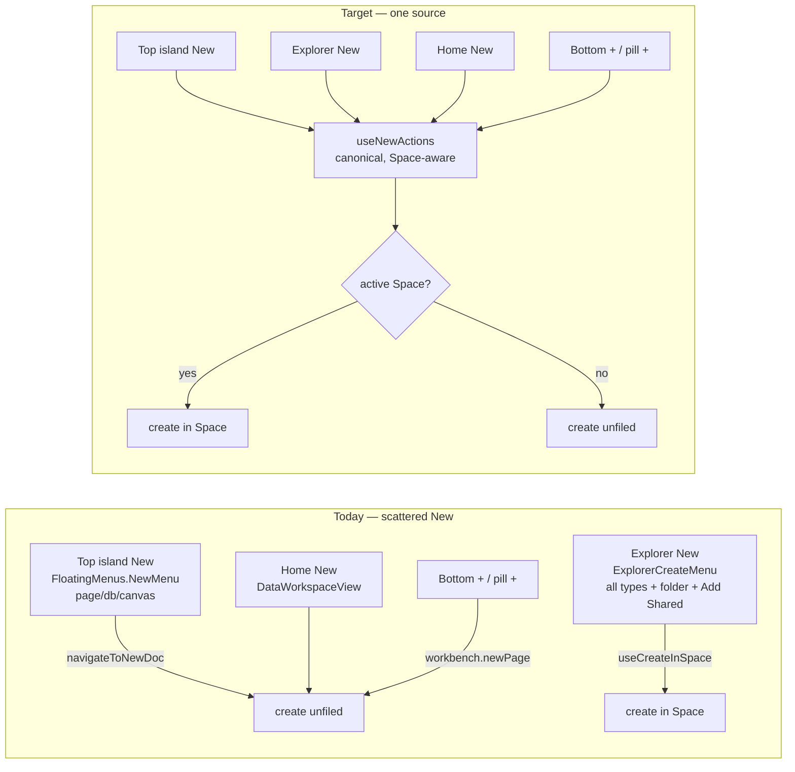

# Wiring The Floating Shell's Affordances To Their Actions

> Status: exploration `[_]` — not yet implemented.
> Sibling context: [[0286_WORKBENCH_FLOATING_ISLANDS_REDESIGN]] (the redesign
> this cleans up after), [[0285_RIGHT_CLICK_CONTEXT_MENUS_ACROSS_THE_UI]] (the
> `useNodeActions` verb list we should reuse), [[0181_SPACES_NESTED_AUTH]] /
> [[0190_COHESIVE_DOMAIN_UIS]] (Space-scoped filing).

## Problem Statement

The Floating Islands redesign (0286, #426) + its refinements (0287, #427)
re-homed the workbench chrome into islands and moved several affordances to new
locations. The **paint** landed, but some affordances are now **stripped
duplicates or placeholders** — the button exists in its new spot, but its old,
fuller behaviour still lives in the old spot (or nowhere).

The clearest case, called out directly: the **"New" button in the top sidebar
island** is a three-item stub (`page / database / canvas`), while the *real*
New action — Space-aware filing, every creatable type, **New folder**, and
**Add Shared…** — still lives inside the **Explorer** contextual island as
`ExplorerCreateMenu`. The design intent is the inverse: the **top island** is
the primary, always-visible New; the Explorer's in-list New is at most a
secondary, in-context convenience.

Beyond New, a sweep of the new shell finds a handful of buttons that render but
don't do the right thing yet (the editor header **⋯ More** is inert; the pill
**History** button is a placeholder; the bottom-island **+** is a generic
"new page" regardless of surface; the notifications popover shows only a
request count). This exploration audits every re-homed affordance and prescribes
how to wire each to its intended action, with the **New-action consolidation**
as the centrepiece.

## Executive Summary

1. **Extract one canonical New-action source** — a `useNewActions()` hook (+ a
   shared `<NewMenu>` content component) that owns the *whole* create surface:
   every `CreatableDocType`, **New folder**, **Add Shared…**, and the
   **Space-aware target** ("in {Space}" vs unfiled). Today that logic is
   duplicated/partial across `ExplorerCreateMenu`, the top-island `NewMenu`
   (`FloatingMenus.tsx`), `useCreateInSpace`, and `DataWorkspaceView`.
2. **Point the top-island New button at it** — replace `FloatingMenus`'
   three-item `NewMenu` with the canonical `<NewMenu>`; it becomes the primary,
   Space-aware New. Demote `ExplorerCreateMenu` to reuse the same hook (no
   behaviour divergence) or drop it now that the primary lives up top.
3. **Fix the other re-homed affordances** — wire the editor **⋯ More** to the
   0285 `useNodeActions` verb list for the active tab; make the bottom-island
   **+** surface-aware; give the pill **History** a real target (recents /
   reopen-closed-tab); enrich (or honestly link) the notifications popover.
4. **Register the create verbs as commands** so `⌘K`, the pill **+**, and the
   New menu all invoke one code path.



## Current State In The Repository

### The New action lives in four places

| Where | File | What it does today |
| --- | --- | --- |
| **Top island New** | [`FloatingMenus.tsx`](../../apps/web/src/workbench/FloatingMenus.tsx) `NewMenu` | `page / database / canvas` only, via `navigateToNewDoc` — **not** Space-aware, no folder, no Add Shared |
| **Explorer New** | [`Explorer.tsx`](../../apps/web/src/workbench/views/Explorer.tsx) `ExplorerCreateMenu` (l.45) + `handleCreate` (l.427) | every type (`page/database/canvas/dashboard/map/lab`), **Add Shared…**, Space target label ("in {Space}"); files via `useCreateInSpace` when a real Space is scoped |
| **Space-aware create** | [`useCreateInSpace.ts`](../../apps/web/src/hooks/useCreateInSpace.ts) | eager-creates page/db/canvas/map with `space` set, then navigates; lab/dashboard created normally |
| **Shared table + items** | [`doc-creation.tsx`](../../apps/web/src/lib/doc-creation.tsx) | `DOC_TYPE_ROUTES`, `navigateToNewDoc`, `CreateDocMenuItems` |
| **Home New** | [`DataWorkspaceView.tsx`](../../apps/web/src/components/DataWorkspaceView.tsx) | the `/` "All Documents" view's own New/Import affordances |
| **New folder** | [`explorer-folders-context.tsx`](../../apps/web/src/workbench/views/explorer-folders-context.tsx) `createFolder` (l.134) | creates a `folder` node named "New folder" |

`ExplorerCreateMenu` is the most complete; the top-island `NewMenu` is the stub
the user wants promoted.

### Affordance → action audit (the whole sweep)

| Affordance (new location) | File | Current wiring | Gap / intended |
| --- | --- | --- | --- |
| **Top-island New** | `SidebarIslands` → `FloatingMenus.NewMenu` | 3 types, unfiled | ⭐ canonical Space-aware New (all types + folder + Add Shared + target) |
| Top-island Search / workspace / avatar / rows / More | `SidebarIslands.tsx` | `search.open` / `workspace.switch` / profile / activate / surfaces | ✅ correct |
| **Bottom-island header +** | `SidebarIslands.tsx` `BottomIsland` | `workbench.newPage` (always a page) | surface-aware: Tasks→new task, Chats→new channel, Data→new database, Explorer→canonical New in Space |
| **Editor ⋯ More** | [`EditorHeader.tsx`](../../apps/web/src/workbench/EditorHeader.tsx) | **inert** (no `onClick`) | active-tab node menu via 0285 [`useNodeActions`](../../apps/web/src/hooks/useNodeActions.ts) (rename/duplicate/copy link/move/favorite/export/delete) |
| Editor facepile | `EditorHeader.tsx` | "you" avatar only | real presence when available (else keep the single "you") |
| Editor Share / Comments / Bell | `EditorHeader.tsx` | ShareDialog / `togglePanel('right')` / notif menu | ✅ (bell depends on notif wiring below) |
| **Pill History** | [`TabBar.tsx`](../../apps/web/src/workbench/TabBar.tsx) `PillControls` | `search.open` (placeholder) | recents fly-out / reopen-closed-tab, or drop it |
| Pill **+** new tab | `TabBar.tsx` | `workbench.newPage` | route through the canonical New (page default) |
| Pill Split | `TabBar.tsx` | `splitWith` | ✅ |
| **Notifications popover** | `FloatingMenus.tsx` `NotifMenu` | request count + link to `/requests` | mentions + resolved comments + share requests if a source exists; else keep the honest link |
| Profile menu | `FloatingMenus.tsx` `ProfileMenu` | Profile & Settings → `/settings`, theme | add **Sign out**; Profile → a real profile route if one exists |
| Assistant dock composer | [`FloatingDock.tsx`](../../apps/web/src/workbench/FloatingDock.tsx) | routes to the AI surface | optionally seed the AI panel with the typed text |
| Home New | `DataWorkspaceView.tsx` | its own New/Import | defer to the shell's canonical New (dedupe) |
| Dev-tools Feature flags | [`DevToolsIsland.tsx`](../../apps/web/src/workbench/DevToolsIsland.tsx) | `/experiments` | ✅ |

### Command surface today

`workbench.newPage` (`Mod-T`) is the only registered create command
([`EditorArea.tsx`](../../apps/web/src/workbench/EditorArea.tsx)). There is no
`workbench.new` (open-the-menu) or per-type command, so the pill **+** and the
menu can't share one path yet.

## External Research

Prior art for a **single global "New"**:

- **Notion** — a persistent "＋ New page" at the sidebar's foot is *the* create
  entry; context (the current teamspace) sets where it files. One button, one
  code path, target inferred from context — exactly the Space-aware model here.
- **Linear** — global create is a command (`C`) surfaced from a top-of-sidebar
  button *and* the palette; both invoke the same action. Argues for registering
  create as a **command** so button + `⌘K` + shortcut converge.
- **Claude / Slack** — a top-left composer/New anchored above navigation; the
  primary create is chrome-level, not buried in a list — matching "move it up
  into the top island."

Common thread: **one create action, invoked from several entry points, target
inferred from the active scope.** That is the `useNewActions()` recommendation.

## Key Findings

1. The New logic is **already centralised at the data layer** (`useCreateInSpace`
   + `doc-creation.tsx`); what's missing is a **shared menu/action layer** so
   every entry point renders the same items and files the same way.
2. `ExplorerCreateMenu` is the de-facto spec for "complete New" — copy its
   contents (types + folder + Add Shared + target label) into the shared piece.
3. **Add Shared…** opens `AddSharedDialog`; to offer it from the top island the
   dialog (or a command to open it) must be reachable from the shell, not only
   from inside Explorer.
4. Most other gaps are small and independent — they can land as follow-up
   commits after the New consolidation without blocking it.
5. The 0285 `useNodeActions` verb list already exists and is the right fill for
   the inert editor **⋯ More** (no new menu logic needed).

## Options And Tradeoffs

### For the New consolidation

| Option | How | Pros | Cons |
| --- | --- | --- | --- |
| **A. Shared hook + `<NewMenu>`** (recommended) | `useNewActions()` returns `{ types, createDoc(type), createFolder(), addShared(), targetName }`; a `<NewMenu>` renders them; top island, Explorer, home all use it | one source of truth; Space-aware everywhere; minimal churn | one new hook + component; must lift `AddSharedDialog` reach |
| B. Command-registry-only | register `workbench.new.*` commands; menus are thin lists of commands | palette + shortcut + button converge for free | commands can't easily carry the "in {Space}" label / Add-Shared dialog; more indirection for a visual menu |
| C. Leave duplicates, just enrich the top-island stub | copy the items inline into `FloatingMenus.NewMenu` | smallest diff | perpetuates two diverging New menus — the exact smell we're removing |

**A**, with the create verbs *also* registered as commands (a light dose of B)
so `⌘K` and the pill **+** share the path.

### For the editor ⋯ More

- Reuse `useNodeActions(activeTab)` (0285) → an `ActionMenuList` in an anchored
  popover. Consistent with right-click menus elsewhere; near-zero new logic.

### For the bottom-island +

- Map `activeSurface` → a default create: `explorer` → canonical New (in Space),
  `tasks` → new task, `chats` → new channel, `data` → new database, else hide
  the +. Small `switch`, no new subsystem.

## Recommendation

Ship in this order (each a self-contained commit):

1. **`useNewActions()` + `<NewMenu>`** (canonical, Space-aware) — the core.
2. **Top-island New** renders `<NewMenu>` (via `FloatingMenus`); make
   `AddSharedDialog` reachable from the shell (a `share.addShared` command or a
   shell-level dialog host).
3. **Explorer** refactored to consume `useNewActions()` (kill the divergent
   copy) — or drop its inline New now the primary lives up top.
4. **Editor ⋯ More** → `useNodeActions` popover.
5. **Bottom-island +** surface-aware; **pill +** and **`⌘K`** via registered
   `workbench.new*` commands.
6. **History pill** + **notifications** + **profile Sign out** — polish pass.

## Example Code

```tsx
// apps/web/src/workbench/new-actions.ts
import { useNavigate } from '@tanstack/react-router'
import { useCallback } from 'react'
import { useCreateInSpace } from '../hooks/useCreateInSpace'
import { navigateToNewDoc, type CreatableDocType, type NavigateLike } from '../lib/doc-creation'
import { useExplorerFolders } from './views/explorer-folders-context'
import { isRealSpace } from './views/explorer-scope'
import { useWorkbench } from './state'
import { useSpaces } from '../hooks/useSpaces'

export const NEW_DOC_TYPES: CreatableDocType[] = [
  'page', 'database', 'canvas', 'dashboard', 'map', 'lab'
]

/** The one Space-aware New action set, shared by every "New" entry point. */
export function useNewActions() {
  const navigate = useNavigate()
  const createInSpace = useCreateInSpace()
  const { createFolder } = useExplorerFolders()
  const currentSpaceId = useWorkbench((s) => s.currentSpaceId)
  const { getSpace } = useSpaces()
  const filed = isRealSpace(currentSpaceId)
  const targetName = filed ? (getSpace(currentSpaceId)?.name ?? null) : null

  const createDoc = useCallback((type: CreatableDocType) => {
    if (filed) return void createInSpace(type, currentSpaceId)
    navigateToNewDoc(navigate as unknown as NavigateLike, type)
  }, [filed, currentSpaceId, createInSpace, navigate])

  return { types: NEW_DOC_TYPES, targetName, createDoc, createFolder }
}
```

```tsx
// FloatingMenus.tsx — the top-island New becomes canonical
function NewMenu({ close }: { close: () => void }) {
  const { types, targetName, createDoc, createFolder } = useNewActions()
  return (
    <div className="w-[240px] p-1.5">
      {targetName && <div className={eyebrow}>Creating in {targetName}</div>}
      {types.map((t) => (
        <button key={t} className={item} onClick={() => { createDoc(t); close() }}>
          {/* DOC_TYPE_ROUTES[t].icon + label */}
        </button>
      ))}
      <div className="mx-0.5 my-1 h-px bg-hairline" />
      <button className={item} onClick={() => { void createFolder(null); close() }}>New folder</button>
      <button className={item} onClick={() => { openAddShared(); close() }}>Add shared…</button>
    </div>
  )
}
```

```tsx
// EditorHeader.tsx — wire the inert ⋯ More to the 0285 verb list
const actions = useNodeActions(activeTab ? { id: activeTab.nodeId, type: activeTab.nodeType } : null)
// render <ActionMenuList actions={actions}/> in an anchored popover on click
```

## Risks And Open Questions

- **`AddSharedDialog` reach** — cleanest is a `share.addShared` command (or a
  shell-level dialog host) so both Explorer and the top island can open it
  without prop-drilling. Decide the mechanism before step 2.
- **`useExplorerFolders` provider scope** — `createFolder` comes from
  `ExplorerFoldersProvider`, currently mounted inside Explorer. Calling it from
  the top island needs the provider higher up (or a folder-create that doesn't
  depend on that context). Verify before wiring folder-create into the shell New.
- **Bottom-island + for route surfaces** — routes have no obvious "new"; hide
  the + rather than invent one.
- **Notifications** — is there a real per-user notification source beyond
  `useRequestCount`? If not, keep the honest "N pending requests → /requests"
  and don't fabricate a feed.
- **Home `DataWorkspaceView` New** — dedupe vs leave; low priority, but note it
  so the two News don't drift again.

## Implementation Checklist

- [ ] Add `useNewActions()` + `NEW_DOC_TYPES` in `apps/web/src/workbench/new-actions.ts`.
- [ ] Add a shared `<NewMenu>` (or fold the items into `FloatingMenus`) covering
      all types + New folder + Add Shared… + the "in {Space}" target label.
- [ ] Make `AddSharedDialog` reachable from the shell (a `share.addShared`
      command or a shell-level host) and open it from the New menu.
- [ ] Point the **top-island New** button at the canonical `<NewMenu>`.
- [ ] Refactor `ExplorerCreateMenu` to consume `useNewActions()` (or remove it),
      so there is exactly one New behaviour.
- [ ] Register create verbs as commands (`workbench.new`, `workbench.new.page`…)
      and route the **pill +** and `⌘K` through them.
- [ ] Make the **bottom-island +** surface-aware (Tasks/Chats/Data/Explorer),
      hiding it for route surfaces.
- [ ] Wire the editor **⋯ More** to `useNodeActions(activeTab)` in a popover.
- [ ] Give the **pill History** button a real target (recents / reopen closed)
      or remove it.
- [ ] Enrich or honestly link the **notifications** popover; add **Sign out** to
      the profile menu.
- [ ] Dedupe the home `DataWorkspaceView` New against the shell New.

## Validation Checklist

- [ ] From the **top-island New**, creating each type while a Space is active
      files the node into that Space (shows under it in Explorer); with no Space
      active it creates unfiled — identical to the old Explorer New.
- [ ] **New folder** and **Add Shared…** work from the top island.
- [ ] The pill **+**, `⌘T`/`⌘K` "New page", and the New menu all reach one code
      path (create a page three ways → identical result).
- [ ] The bottom-island **+** creates the right thing per surface; hidden on
      route surfaces.
- [ ] Editor **⋯ More** opens the active tab's node actions; each verb behaves
      as in the right-click menu (0285).
- [ ] No duplicate/diverging New menus remain (grep for `navigateToNewDoc`
      callers; each should go through `useNewActions`).
- [ ] `pnpm test`, typecheck, lint, humane-pattern gates pass; live-render in the
      worktree preview (light + dark); DCO + changelog fragment.

## References

- Redesign: [`0286_[x]_WORKBENCH_FLOATING_ISLANDS_REDESIGN.md`](./0286_[x]_WORKBENCH_FLOATING_ISLANDS_REDESIGN.md)
- Repo — New action: [`lib/doc-creation.tsx`](../../apps/web/src/lib/doc-creation.tsx),
  [`hooks/useCreateInSpace.ts`](../../apps/web/src/hooks/useCreateInSpace.ts),
  [`views/Explorer.tsx`](../../apps/web/src/workbench/views/Explorer.tsx),
  [`views/explorer-folders-context.tsx`](../../apps/web/src/workbench/views/explorer-folders-context.tsx),
  [`components/DataWorkspaceView.tsx`](../../apps/web/src/components/DataWorkspaceView.tsx)
- Repo — shell affordances: [`FloatingMenus.tsx`](../../apps/web/src/workbench/FloatingMenus.tsx),
  [`SidebarIslands.tsx`](../../apps/web/src/workbench/SidebarIslands.tsx),
  [`EditorHeader.tsx`](../../apps/web/src/workbench/EditorHeader.tsx),
  [`TabBar.tsx`](../../apps/web/src/workbench/TabBar.tsx),
  [`FloatingDock.tsx`](../../apps/web/src/workbench/FloatingDock.tsx)
- Repo — verbs to reuse: [`hooks/useNodeActions.ts`](../../apps/web/src/hooks/useNodeActions.ts) (0285)
- Prior art: Notion global "New page", Linear global create (`C`) + command
  palette, Claude/Slack top-left composer.
