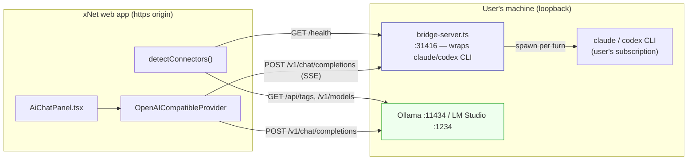
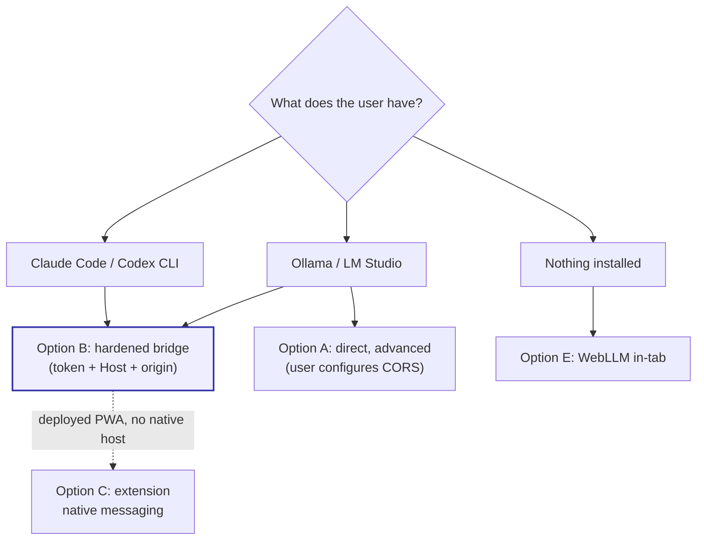
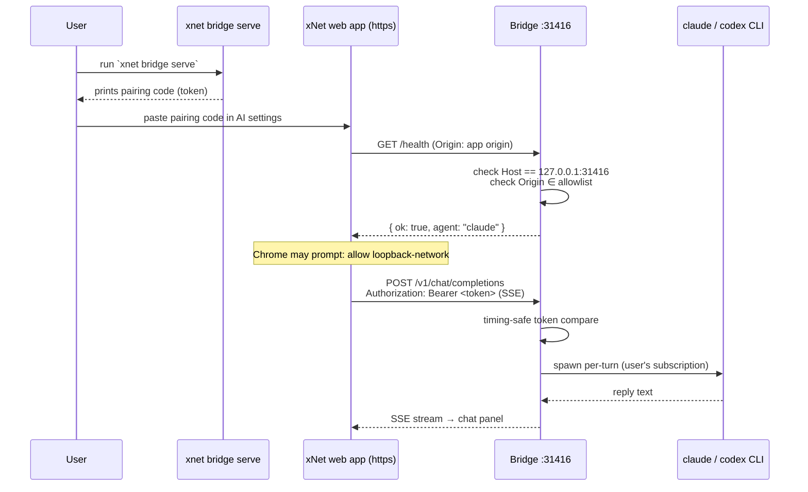
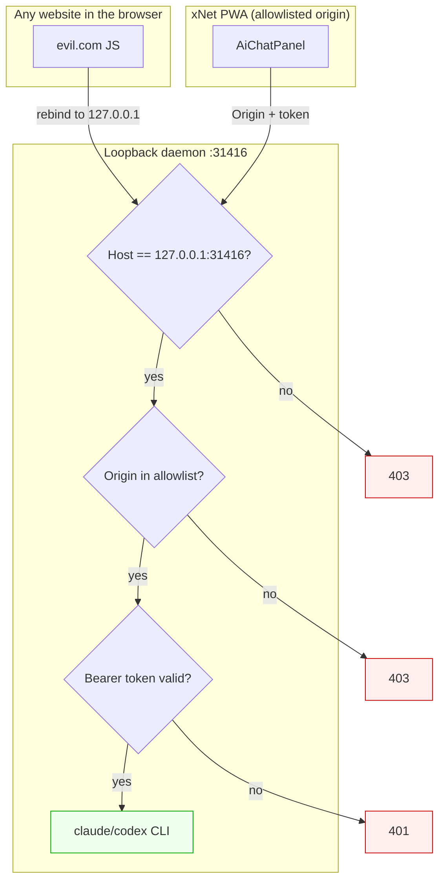

# Securely Connecting The Browser To A Local Model (Claude Code, Codex, Ollama, …)

## Problem Statement

The user wants to drive a model from **inside the xNet web app** while the model
runs **on their own machine** — their `claude` (Claude Code) or `codex` CLI
subscription, or a raw local server like Ollama / LM Studio / llama.cpp. The
requirement is not just "make it work" but **make it work *securely***: an
`https://` page reaching a plaintext `http://127.0.0.1` daemon is exactly the
shape of attack that has produced a string of real CVEs against local AI tools
(Ollama DNS-rebinding, AnythingLLM CORS bypass). We need a path that:

1. Lets the xNet browser app talk to a model process on `localhost`.
2. Works across the deployed PWA (`https://app.xnet.fyi`), the Electron desktop
   build, and dev.
3. Does **not** expose the user's local model / coding-agent subscription to any
   random website they happen to have open.
4. Degrades gracefully as browsers roll out the new Local Network Access
   permission gates (Chrome 142+, Firefox 149+).

## Executive Summary

xNet **already has both halves of this** from explorations 0174 (connector
ladder) and 0194 (agent bridge), but they are wired for the Electron build and
carry security gaps that make the *deployed browser* case both broken and unsafe:

- The **`bridge` tier** — a loopback daemon at `http://127.0.0.1:31416`
  ([`packages/devkit/src/bridge-server.ts`](packages/devkit/src/bridge-server.ts))
  — wraps the user's own `claude`/`codex` CLI as an **OpenAI-compatible**
  `POST /v1/chat/completions` endpoint. This is the direct answer to "connect my
  browser to Claude Code / Codex." It binds loopback-only, gates by `Origin`,
  answers preflights, and emits `Access-Control-Allow-Private-Network`.
- The **`local-server` tier** probes Ollama (`:11434`) and LM Studio (`:1234`)
  directly and maps them to an OpenAI-compatible provider
  ([`packages/plugins/src/ai/connectors/detect.ts`](packages/plugins/src/ai/connectors/detect.ts),
  [`providers.ts`](packages/plugins/src/ai/providers.ts)).

Three concrete problems block the *secure browser* story:

1. **The bridge has no authentication token.** Its sibling — the MCP HTTP
   transport
   ([`packages/plugins/src/services/mcp-http.ts`](packages/plugins/src/services/mcp-http.ts))
   — requires a constant-time-compared `x-xnet-pairing` secret. The chat bridge
   does **not**: it trusts *origin + loopback bind alone*, and it does **no
   `Host`-header validation**. That is precisely the assumption DNS rebinding
   breaks (the Ollama CVE-2024-28224 class). Any allowlisted origin — or, via
   rebinding, any site — could drive the user's paid coding agent.
2. **The deployed PWA can't even reach it, for two reasons.** (a) The Electron
   manager starts the bridge with **no `allowedOrigins`**
   ([`apps/electron/src/main/agent-bridge-manager.ts`](apps/electron/src/main/agent-bridge-manager.ts)),
   so only loopback-origin pages pass the gate — `https://app.xnet.fyi` is
   rejected. (b) The web app's CSP `connect-src` lists `http://localhost:*` but
   **not** `http://127.0.0.1:*`
   ([`apps/web/index.html`](apps/web/index.html)), while the bridge's default URL
   is `http://127.0.0.1:31416` — CSP-blocked before the request leaves the page.
3. **The direct `local-server` tier offloads security to the user** — they must
   set `OLLAMA_ORIGINS` / toggle LM Studio CORS, and the safe framing (never
   wildcard) isn't enforced or explained.

**Recommendation:** make the loopback bridge the **secure spine** for all local
model access and finish its hardening to match `mcp-http.ts` — a per-launch
**pairing token** delivered out-of-band, **`Host`-header validation**, an
**explicit origin allowlist** that includes the deployed PWA origin, and a fixed
CSP. Keep the direct `local-server` tier as an advanced opt-in with safe-origin
guidance. Model the wire contract on **MCP Streamable HTTP**, whose spec already
mandates Origin validation + loopback bind + auth, so we inherit a
community-reviewed threat model instead of inventing one. For the pure-web PWA
where no native host exists to spawn a daemon, the long-term strongest option is
a **browser-extension native-messaging bridge** (the 1Password pattern), which
sidesteps HTTP/CORS/DNS-rebinding entirely.

## Current State In The Repository

### The connector ladder already models this

[`packages/plugins/src/ai/connectors/types.ts`](packages/plugins/src/ai/connectors/types.ts)
defines `ConnectorTier = managed | bridge | cloud-key | local-server | webllm |
prompt-api`. Two of these are "local model on your machine":

| Tier | What it is | Probe | Provider mapping |
| --- | --- | --- | --- |
| `bridge` | User's own `claude`/`codex` CLI, wrapped as an HTTP daemon | `GET http://127.0.0.1:31416/health` → `{ ok: true }` | OpenAI-compatible → the daemon |
| `local-server` | Ollama / LM Studio running directly | `GET :11434/api/tags`, `GET :1234/v1/models` | OpenAI-compatible / Ollama provider |

Ranking + probes live in
[`detect.ts:63-208`](packages/plugins/src/ai/connectors/detect.ts): `bridge` is
`preference: 1` (just under managed cloud), `local-server` is `preference: 3`.
The panel auto-selects the most-preferred *available* tier
([`ai-chat-connector.ts`](apps/web/src/workbench/views/ai-chat-connector.ts)).

### The bridge daemon — the secure-ish spine we already have

[`packages/devkit/src/bridge-server.ts`](packages/devkit/src/bridge-server.ts)
is a Node `http` server that:

- **Binds loopback only** — throws if `host` isn't in
  `{127.0.0.1, ::1, localhost}` ([`:63-68`](packages/devkit/src/bridge-server.ts:63)).
- **Gates by `Origin`** — loopback origins and an explicit `allowedOrigins`
  allowlist pass; it never reflects `*`
  ([`isOriginAllowed`, `:192-201`](packages/devkit/src/bridge-server.ts:192)).
- **Answers `OPTIONS` preflights** and emits
  `Access-Control-Allow-Private-Network: true` for Chrome's Local Network Access
  flow ([`applyCors`, `:203-209`](packages/devkit/src/bridge-server.ts:203)).
- Serves `GET /health`, `POST /v1/chat/completions` (SSE streaming), and an
  opt-in `POST /run` (agentic worktree edits, behind a handler).
- Backs chat with `cliChatAgent`
  ([`chat-agent.ts:53`](packages/devkit/src/chat-agent.ts)) which **spawns the
  user's installed `claude`/`codex`** (their subscription — xNet never sees the
  token; the CLI authenticates itself).

It ships from Electron
([`apps/electron/src/main/agent-bridge-manager.ts`](apps/electron/src/main/agent-bridge-manager.ts))
and from the CLI (`xnet bridge serve`,
[`packages/cli/src/commands/bridge.ts`](packages/cli/src/commands/bridge.ts)).

### The security gap — compare the two loopback servers

The MCP HTTP transport is the *same shape* daemon but properly hardened. Diffing
the two is the crux of this exploration:

| Control | `mcp-http.ts` (MCP) | `bridge-server.ts` (chat) |
| --- | --- | --- |
| Loopback-only bind | ✅ | ✅ |
| Origin allowlist, never `*` | ✅ | ✅ |
| PNA / preflight | ✅ | ✅ |
| **Pairing token** (`x-xnet-pairing`, constant-time) | ✅ [`:36,94`](packages/plugins/src/services/mcp-http.ts:36) | ❌ **none** |
| **`Host`-header validation** (anti-DNS-rebind) | ❌ (also missing) | ❌ **none** |
| Body-size cap | ✅ | ✅ [`:28`](packages/devkit/src/bridge-server.ts:28) |

So the daemon that drives the user's **paid coding agent** is the *less* guarded
of the two. And neither validates `Host`, which is the specific fix Ollama
shipped for its DNS-rebinding CVE.

### The wiring gaps for the deployed PWA

- The Electron manager calls
  `createBridgeServer({ agent, agentName, version })`
  ([`agent-bridge-manager.ts:80`](apps/electron/src/main/agent-bridge-manager.ts:80))
  — **no `allowedOrigins`**, so `https://app.xnet.fyi` (a non-loopback origin)
  is rejected by `isOriginAllowed`. Only a page *also* served from loopback can
  talk to it.
- CSP in [`apps/web/index.html`](apps/web/index.html) `connect-src` includes
  `http://localhost:*` and `ws://localhost:*` but **not** `http://127.0.0.1:*`.
  The bridge's default URL (`DEFAULT_BRIDGE_URL = 'http://127.0.0.1:31416'`,
  [`detect.ts:63`](packages/plugins/src/ai/connectors/detect.ts:63)) is a
  `127.0.0.1` literal → blocked. (This is *also* the safer literal to prefer per
  Spotify's loopback guidance, so the fix is "add 127.0.0.1", not "drop it".)

### How the pieces connect today



## External Research

### Local model servers — can a browser talk to them, and how safely?

| System | Port | Transport | Browser-direct? | Auth | CORS default |
| --- | --- | --- | --- | --- | --- |
| **Claude Code / Agent SDK** | none | stdio subprocess | ❌ needs your own HTTP/WS relay | build it yourself | n/a |
| **Codex CLI** (`codex mcp-server`) | stdio (or HTTP) | stdio / Streamable HTTP | ⚠️ only if HTTP transport configured | Bearer / OAuth (HTTP mode) | you add it |
| **Ollama** | 11434 | HTTP (OpenAI `/v1` + `/api`) | ⚠️ from allowlisted origins only | **none** | conservative allowlist (`localhost`, app schemes); **not** arbitrary `https://` — extend via `OLLAMA_ORIGINS` |
| **LM Studio** | 1234 | HTTP (OpenAI + Anthropic) | ✅ if CORS toggled on | optional token (off) | off by default |
| **llama.cpp / llamafile** | 8080 | HTTP + SSE | ✅ **unconditionally** — reflects any `Origin`, allows credentials | optional `--api-key` | **wide open** (no flag to disable) |
| **MCP Streamable HTTP** | any | HTTP POST + SSE | ✅ | OAuth 2.1 resource-server (RFC 9728/8707) | spec **mandates** Origin validation + loopback bind |
| **ACP (Zed)** | n/a | JSON-RPC over stdio | ❌ remote/HTTP transport still WIP | `authenticate` RPC | n/a |

Key takeaways:

- **There is no zero-config "point a browser at Claude Code."** The Agent SDK
  explicitly documents that *you* build the HTTP/WS layer in front of the stdio
  subprocess ([Hosting the Agent SDK](https://code.claude.com/docs/en/agent-sdk/hosting)).
  xNet's `cliChatAgent` + `bridge-server.ts` **is** exactly that relay — so we're
  already on the officially-sanctioned pattern, not fighting it.
- **`claude mcp serve` is stdio-only** — "no network exposure, security comes
  through process isolation" ([Claude Code MCP docs](https://code.claude.com/docs/en/mcp)).
  A browser can't speak stdio, so a relay is unavoidable.
- **llama.cpp is the cautionary tale**: its server reflects any `Origin` and
  allows credentials *unconditionally* — any open web page can already drive a
  user's local `llama-server`. Our bridge must not become this.
- **MCP Streamable HTTP is the only native protocol here designed with
  DNS-rebinding/CORS in mind from the spec level** — it *mandates* servers
  validate `Origin`, bind `127.0.0.1`, and authenticate, and (2025-06 update)
  forbids passing client tokens upstream. Aligning our wire contract with it
  inherits a reviewed threat model and future MCP interop.

### The browser security landscape (fast-moving, 2025-2026)

- **DNS rebinding** defeats "loopback = trusted." `evil.com` resolves normally,
  then re-resolves to `127.0.0.1`; page JS under the `evil.com` origin now hits
  the local server, which sees a loopback connection. **Fix = validate the
  `Host` header** (exact `localhost:<port>`/`127.0.0.1:<port>`) **+ require a
  token.** This is the Ollama **CVE-2024-28224** fix (NCC Group; exploitable in
  ~3s). See also **AnythingLLM GHSA-24qj-pw4h-3jmm** — `cors({ origin: true })`
  + an auth bypass let any site exfiltrate workspaces/keys.
- **Mixed content**: loopback (`127.0.0.1`, `::1`, `localhost`, `*.localhost`)
  is a "potentially trustworthy" origin, so `https://` → `http://localhost`
  fetch/WebSocket is **not** mixed-content-blocked (has been true for years;
  Firefox extended it to WebSockets in FF71).
- **Chrome Local Network Access (LNA)** — the gap-closer. **Chrome 142**
  (~Oct 2025) added a **permission prompt** for any public→private/loopback
  request. **Chrome 145** split it into `local-network` and **`loopback-network`**
  (our case). Query `navigator.permissions.query({ name: 'loopback-network' })`
  and build an "allow local access" UX path. The daemon still answers preflight
  with `Access-Control-Allow-Private-Network: true` (already done).
- **Firefox**: rolling its own local-network permission (Strict-ETP users in
  **FF149**, general in **FF151**). **Safari/WebKit**: standards-position
  "support" but **not shipped** — today the most permissive (server-side auth is
  the *only* protection there).
- **Consequence**: **don't rely on the browser to protect the user.** The one
  layer under our control on every browser/version is **server-side auth +
  `Host`/`Origin` validation on the daemon.** Browser prompts are
  defense-in-depth that only gets stronger.

### Secure loopback patterns from prior art

- **Per-launch bearer token, delivered out-of-band** (not fetchable by any page)
  — the convergent pattern for browser↔local-app bridges.
- **RFC 8252** (OAuth for native apps): `http://127.0.0.1:<ephemeral>` redirect
  is fine because the request never leaves the device; layer **PKCE**. Spotify
  now steers redirect URIs to the `127.0.0.1` literal over `localhost`.
- **Capability token in the URL *fragment*** (`#token=…`) — never sent to a
  server or logged.
- **Native messaging** (1Password): browser extension ↔ desktop app via
  `chrome.runtime.connectNative` + host-manifest extension-ID allowlist — **no
  HTTP, no CORS, no DNS-rebinding surface**. Strongest origin binding.
- **mkcert** local TLS (`https://127.0.0.1`) — dev-only; can't ship a private CA
  to users.
- **UDS / named pipes** — a browser tab can't speak them; you still need a thin
  loopback HTTP/WS front door.

## Key Findings

1. **We already have the right architecture** (loopback relay wrapping the user's
   own CLI) — it matches Anthropic's official hosting guidance and MCP's threat
   model. The work is *hardening + wiring*, not a rebuild.
2. **The chat bridge is under-secured relative to its sibling.** It lacks the
   pairing token that `mcp-http.ts` already implements, and neither validates
   `Host`. The daemon driving a paid subscription is the weakest of the two.
3. **The deployed PWA is doubly blocked**: no `allowedOrigins` on the daemon, and
   a CSP that omits `http://127.0.0.1:*` while the bridge default *is* a
   `127.0.0.1` URL.
4. **Direct `local-server` access pushes security onto the user** and doesn't
   teach the safe framing (never `OLLAMA_ORIGINS=*`).
5. **Browser gates are arriving**, not arrived. We must ship server-side auth now
   and add a graceful `loopback-network` permission UX.
6. **Token delivery is the crux.** Electron can inject the token via preload
   (`window.xnetAgentBridge`); the pure-web PWA needs an out-of-band channel — a
   pairing code the user copies from `xnet bridge serve` into settings.

## Options And Tradeoffs

### A. Direct browser → local server (Ollama / LM Studio), as today

- **Pros:** zero new code; works now if the user configures CORS; no xNet daemon.
- **Cons:** no auth on Ollama at all; relies on the user editing `OLLAMA_ORIGINS`
  correctly (wildcard = any site can drive their model); no `Host` validation on
  their side; llama.cpp is wide open. Security is entirely the user's problem.
- **Verdict:** keep as an *advanced* tier with safe-origin guidance; never the
  default trust story.

### B. Harden the loopback bridge into the secure spine *(recommended)*

Add a **pairing token** (reuse `mcp-http.ts`'s constant-time check), **`Host`
validation**, an **explicit origin allowlist** including the deployed PWA origin,
out-of-band token delivery, and fix the CSP. The bridge can *also* front Ollama
(proxy `/v1/chat/completions` to `:11434`) so even "raw local model" access flows
through one audited, authenticated door.

- **Pros:** one hardened trust boundary for *all* local model access; works for
  Claude Code / Codex (the user's actual ask) and for Ollama; MCP-aligned;
  survives every browser because auth is server-side; the token defeats
  DNS-rebinding + drive-by sites.
- **Cons:** needs a native host process (Electron or `xnet bridge serve`) — the
  pure-web PWA can't *spawn* it, only *connect* to it; token-pairing UX to build.
- **Verdict:** the spine. Most of it already exists.

### C. Browser-extension native-messaging bridge (1Password pattern)

A small xNet extension talks to a native host via `connectNative`; the web app
talks to the extension.

- **Pros:** strongest origin binding (extension-ID allowlisted by the OS); **no
  HTTP/CORS/DNS-rebinding surface**; no loopback port at all; the only clean
  answer for a pure-web PWA with no bundled native host.
- **Cons:** ship + maintain an extension per browser; native-host installer;
  higher build cost. Longer-term.
- **Verdict:** the strategic answer for the deployed PWA; propose as a follow-up.

### D. mkcert local TLS (`https://127.0.0.1`)

- **Pros:** real HTTPS locally; sidesteps mixed-content and (currently) the LNA
  loopback gate; great for testing the token/CORS logic under realistic TLS.
- **Cons:** private CA can't ship to users; dev-only.
- **Verdict:** dev/test tooling, not a product control.

### E. In-tab model (WebLLM / Gemini Nano) — no connection at all

Already implemented (0252): WebGPU model runs *in the page*, nothing to secure.

- **Pros:** no network, no daemon, fully private; the true "nothing installed"
  path.
- **Cons:** small/weak models; big first-run download; weak tool-calling.
- **Verdict:** complementary — the zero-setup fallback, not a substitute for the
  user's real Claude Code / Codex / Ollama.

### Comparison



## Recommendation

**Ship B as the secure spine; keep A as an advanced opt-in; pursue C for the
pure-web PWA; E remains the zero-setup fallback.**

Concretely, in priority order:

1. **Fix the two PWA-blockers immediately** (tiny, high-value): add
   `http://127.0.0.1:*` (and `ws://127.0.0.1:*`) to the web CSP `connect-src`,
   and pass `allowedOrigins: [deployedWebOrigin, …]` when the Electron/CLI host
   starts the bridge.
2. **Harden `bridge-server.ts` to match `mcp-http.ts`**: per-launch pairing
   token (constant-time compare), **`Host`-header validation** (add to *both*
   servers), keep the origin allowlist + PNA header.
3. **Deliver the token out-of-band**: Electron injects it via preload; the web
   PWA shows a "paste your bridge pairing code" field fed by what
   `xnet bridge serve` prints. Store it in the existing `AI_CHAT_STORAGE_KEYS`.
4. **Let the bridge proxy Ollama** so raw-local-model users get the same
   authenticated door (optional `POST /v1/chat/completions` upstream to
   `:11434`).
5. **Add a `loopback-network` permission UX**: query the permission, and on
   denial show "Allow local network access to use your local model" instead of a
   silent failure.
6. **Guide the direct tier**: when `local-server` is selected, show the *exact*
   `OLLAMA_ORIGINS=https://app.xnet.fyi` line (never `*`) and a one-line "why".
7. **Follow-up: the native-messaging extension (C)** for a browser-only install
   with no bundled daemon.

This turns the answer to "how do I securely connect my browser to my local
Claude Code / Codex / any local model?" into: **the xNet bridge — a loopback
daemon that wraps your own CLI (or proxies your local server), authenticated with
a per-launch pairing code, locked to your app's origin and the real `Host`, so no
other website can touch it.**

### Target flow



### Trust boundary



Note how `Host` validation (G1) stops the DNS-rebind path *before* origin/token
even matter — a rebinding page sends `Host: evil.com`, so it never reaches G2.

## Example Code

### 1. `Host`-header validation (add to both loopback servers)

```ts
// packages/devkit/src/bridge-server.ts (and mirror in mcp-http.ts)
const LOOPBACK_HOSTS = new Set(['127.0.0.1', '::1', 'localhost'])

/** Reject requests whose Host isn't our exact loopback authority (anti-DNS-rebind). */
function isHostAllowed(hostHeader: string | undefined, boundPort: number): boolean {
  if (!hostHeader) return false
  // Host may be "127.0.0.1:31416" or "[::1]:31416"
  const withoutPort = hostHeader.replace(/:\d+$/, '').replace(/^\[|\]$/g, '')
  const port = hostHeader.match(/:(\d+)$/)?.[1]
  return LOOPBACK_HOSTS.has(withoutPort) && (port === undefined || port === String(boundPort))
}

// in onRequest, before anything else:
if (!isHostAllowed(headerStr(req.headers.host), boundPort)) {
  endStatus(res, 403)
  return
}
```

### 2. Per-launch pairing token (reuse the `mcp-http.ts` shape)

```ts
// packages/devkit/src/bridge-server.ts
import { randomBytes, timingSafeEqual } from 'node:crypto'

export interface BridgeServerConfig {
  // ...existing...
  /** Required in `Authorization: Bearer <token>`. Random when omitted; read back
   *  from the handle and hand to the client out-of-band (preload / pairing code). */
  pairingToken?: string
}

const pairingToken = config.pairingToken ?? randomBytes(24).toString('base64url')

function tokenOk(header: string | undefined): boolean {
  const presented = header?.replace(/^Bearer\s+/i, '') ?? ''
  const a = Buffer.from(presented)
  const b = Buffer.from(pairingToken)
  return a.length === b.length && timingSafeEqual(a, b)
}

// gate the data endpoints (not /health, which stays an unauth probe):
if (req.method === 'POST' && path === '/v1/chat/completions') {
  if (!tokenOk(headerStr(req.headers.authorization))) {
    sendJson(res, 401, { error: { message: 'invalid or missing pairing token' } })
    return
  }
  // ...existing handling...
}
```

Expose it on the handle (`readonly pairingToken: string`), exactly as
`McpHttpServerHandle` already does.

### 3. Wire the deployed origin + token from Electron

```ts
// apps/electron/src/main/agent-bridge-manager.ts
const server = createBridgeServer({
  agent,
  agentName: agentCmd,
  version: app.getVersion(),
  allowedOrigins: [
    'https://app.xnet.fyi',
    ...(process.env.XNET_BRIDGE_ALLOWED_ORIGINS?.split(',') ?? [])
  ]
})
await server.start()
// hand the token to the renderer over the preload channel (never over HTTP):
mainWindow.webContents.send('xnet:bridge-token', server.pairingToken)
```

### 4. Client — send the token, handle the permission gate

```ts
// apps/web/src/workbench/views/ai-chat-connector.ts (provider config)
function bridgeProviderConfig(baseUrl: string, token: string): AIProviderConfig {
  return {
    type: 'openai-compatible',
    baseUrl,
    apiKey: token, // becomes `Authorization: Bearer <token>`
    model: 'claude'
  }
}
```

```ts
// graceful Local Network Access UX before probing the bridge
async function ensureLoopbackAllowed(): Promise<'granted' | 'prompt' | 'denied'> {
  try {
    const status = await navigator.permissions.query(
      { name: 'loopback-network' as PermissionName }
    )
    return status.state as 'granted' | 'prompt' | 'denied'
  } catch {
    return 'granted' // browsers without the gate (Safari today) don't block
  }
}
```

### 5. CSP fix

```html
<!-- apps/web/index.html — add 127.0.0.1 forms alongside localhost -->
connect-src 'self'
  ws://localhost:* http://localhost:*
  ws://127.0.0.1:* http://127.0.0.1:*
  wss://* https://hub.xnet.fyi https://*.xnet.fyi
  https://huggingface.co https://*.huggingface.co https://*.hf.co ...
```

## Risks And Open Questions

- **Token delivery for the pure-web PWA is inherently manual** (copy-paste a
  pairing code). Is that acceptable UX, or is the extension (C) needed sooner?
  A QR/deep-link pairing could soften it.
- **`/health` stays unauthenticated** (it's a presence probe). Confirm it leaks
  nothing sensitive — currently just `{ ok, service, agent, version }`. The
  `agent` name is arguably minor fingerprinting; acceptable.
- **`/run`** (agentic worktree edits) is far more dangerous than chat — it must
  require the token *and* stay opt-in; consider a *separate*, stronger gate
  (confirm-in-app) for it.
- **Chrome LNA prompt fatigue / enterprise policy.** Some users will see the
  loopback prompt; document `LocalNetworkAccessAllowedForUrls` for managed fleets.
- **Origin allowlist vs. self-hosters.** A self-hosted xNet at a custom domain
  needs its origin allowlisted too — make `allowedOrigins` configurable
  (`XNET_BRIDGE_ALLOWED_ORIGINS`) rather than hardcoding `app.xnet.fyi`.
- **`localhost` vs `127.0.0.1` in `Host` checks** — both must be accepted (the
  panel probes `127.0.0.1`, users may hit `localhost`); the CSP must list both.
- **Proxying Ollama through the bridge** adds a hop and a config surface; some
  users will still want the direct tier. Keep both, default to the bridge.
- **Does `codex mcp-server` support an HTTP-listen mode** we could target
  directly (skipping our relay for Codex)? Needs a doc-diff — research suggests
  Codex's HTTP transport is for Codex-as-*client*, not inbound. Until confirmed,
  the `cliChatAgent` relay covers Codex uniformly.
- **0174 and 0194 are still `[_]`.** This doc is their security last-mile; decide
  whether to check them off or track hardening here.

## Implementation Checklist

- [ ] Add `http://127.0.0.1:*` and `ws://127.0.0.1:*` to `connect-src` in
      [`apps/web/index.html`](apps/web/index.html).
- [x] Add `Host`-header validation to
      [`packages/devkit/src/bridge-server.ts`](packages/devkit/src/bridge-server.ts)
      **and** [`packages/plugins/src/services/mcp-http.ts`](packages/plugins/src/services/mcp-http.ts)
      (exact loopback authority + bound port).
- [x] Add a per-launch `pairingToken` to `BridgeServerConfig`, gate
      `/v1/chat/completions` and `/run` on `Authorization: Bearer` with a
      constant-time compare; expose `pairingToken` on the handle; leave `/health`
      unauthenticated.
- [ ] Pass `allowedOrigins` (deployed PWA origin + `XNET_BRIDGE_ALLOWED_ORIGINS`)
      from [`apps/electron/src/main/agent-bridge-manager.ts`](apps/electron/src/main/agent-bridge-manager.ts)
      and the `xnet bridge serve` CLI.
- [ ] Print the pairing code from `xnet bridge serve`
      ([`packages/cli/src/commands/bridge.ts`](packages/cli/src/commands/bridge.ts))
      and inject it into the Electron renderer via preload
      (`window.xnetAgentBridge` / a `xnet:bridge-token` channel).
- [ ] Add a "bridge pairing code" field to the AI settings in
      [`AiChatPanel.tsx`](apps/web/src/workbench/views/AiChatPanel.tsx); persist
      under `AI_CHAT_STORAGE_KEYS`; feed it as the provider `apiKey`/bearer.
- [ ] Query `navigator.permissions.query({ name: 'loopback-network' })` and show
      an "allow local network access" hint on `prompt`/`denied` instead of a
      silent dead box.
- [ ] Show exact `OLLAMA_ORIGINS=<app origin>` / LM Studio CORS guidance (never
      `*`) in the `local-server` tier setup hint
      ([`detect.ts`](packages/plugins/src/ai/connectors/detect.ts) /
      [`AiChatPanel.tsx`](apps/web/src/workbench/views/AiChatPanel.tsx)).
- [ ] (Optional) Add an upstream-proxy mode to the bridge so `/v1/chat/completions`
      can forward to Ollama `:11434`, giving raw-local-model users the same
      authenticated door.
- [ ] Update tests: `bridge-server.test.ts` (token + Host cases),
      `detect.test.ts`, `ai-chat-connector.test.ts`.
- [ ] Changeset for `@xnetjs/devkit` and `@xnetjs/plugins` — new required token on
      the bridge data endpoints and the changed `Host` behavior are a **breaking**
      wire-contract change → **major** for any published surface (bump from the
      diff, per CLAUDE.md).
- [ ] (Follow-up) Spike the native-messaging extension (Option C) for the pure-web
      PWA install.

## Validation Checklist

- [ ] From the deployed PWA with the bridge running and paired: selecting the
      `bridge` tier probes `/health`, the composer enables, and a chat streams a
      reply from the user's `claude`/`codex` — end-to-end, over the SSE path.
- [ ] Without the pairing token, `POST /v1/chat/completions` returns **401**;
      with a wrong-length/incorrect token it also 401s (timing-safe).
- [ ] A request with `Host: evil.com` (simulated rebind) is rejected **403 at the
      `Host` gate**, before origin/token checks.
- [ ] A request from a non-allowlisted `Origin` is rejected **403**; the deployed
      PWA origin passes.
- [ ] Under the web CSP, a `http://127.0.0.1:31416` request is **not** CSP-blocked
      (network panel shows it leaving the page).
- [ ] In Chrome 142+/145+, the `loopback-network` permission prompt appears once;
      denying it surfaces the "allow local network access" hint, not a silent
      failure; granting it lets the chat proceed.
- [ ] `local-server` tier setup hint shows a concrete `OLLAMA_ORIGINS=<origin>`
      line scoped to the app origin (never `*`).
- [ ] `/health` still answers unauthenticated (detection works before pairing).
- [ ] Electron: the renderer receives the token via preload and never over HTTP;
      no token appears in any network response body.
- [ ] `bridge-server.test.ts`, `mcp-http` tests, `detect.test.ts`,
      `ai-chat-connector.test.ts` all pass with the new assertions.

## References

### Repo
- [`packages/devkit/src/bridge-server.ts`](packages/devkit/src/bridge-server.ts)
  — the loopback chat daemon (`:31416`), missing token + `Host` checks.
- [`packages/devkit/src/chat-agent.ts`](packages/devkit/src/chat-agent.ts) —
  `cliChatAgent` spawning the user's `claude`/`codex`.
- [`packages/plugins/src/services/mcp-http.ts`](packages/plugins/src/services/mcp-http.ts)
  — the hardened sibling with `x-xnet-pairing` (the template to copy).
- [`packages/plugins/src/ai/connectors/detect.ts`](packages/plugins/src/ai/connectors/detect.ts)
  — tier detection (`bridge`, `local-server`), default bridge URL.
- [`packages/plugins/src/ai/providers.ts`](packages/plugins/src/ai/providers.ts)
  — `OpenAICompatibleProvider`, `OllamaProvider`, `isOllamaAvailable`.
- [`apps/electron/src/main/agent-bridge-manager.ts`](apps/electron/src/main/agent-bridge-manager.ts)
  — wires the bridge (no `allowedOrigins` today).
- [`apps/web/index.html`](apps/web/index.html) — CSP `connect-src` (missing
  `127.0.0.1`).
- [`apps/web/src/workbench/views/AiChatPanel.tsx`](apps/web/src/workbench/views/AiChatPanel.tsx),
  [`ai-chat-connector.ts`](apps/web/src/workbench/views/ai-chat-connector.ts) —
  the chat panel + tier/provider mapping.
- [`docs/explorations/0174_[_]_BRING_YOUR_OWN_MODEL_AI_CHAT_PANEL.md`](docs/explorations/0174_[_]_BRING_YOUR_OWN_MODEL_AI_CHAT_PANEL.md),
  [`0194`](docs/explorations/0194_[_]_AGENT_BRIDGE_CLAUDE_CODE_CODEX_AND_ANY_AGENT_IN_XNET.md),
  [`0252`](docs/explorations/0252_[_]_WHY_THE_AI_CHAT_BOX_IS_DISABLED_LOCAL_MODEL_CONNECTOR_GAPS.md).

### External
- [Claude Agent SDK — Hosting](https://code.claude.com/docs/en/agent-sdk/hosting)
  and [Secure Deployment](https://code.claude.com/docs/en/agent-sdk/secure-deployment).
- [Claude Code as an MCP server](https://code.claude.com/docs/en/mcp) (stdio-only).
- [Codex MCP](https://developers.openai.com/codex/mcp).
- [MCP Transports](https://modelcontextprotocol.io/docs/concepts/transports) /
  [Authorization](https://modelcontextprotocol.io/specification/2025-06-18/basic/authorization).
- [Agent Client Protocol](https://agentclientprotocol.com/) / [Zed ACP](https://zed.dev/acp).
- [Ollama FAQ / `OLLAMA_ORIGINS`](https://docs.ollama.com/faq);
  [NCC Group — Ollama DNS rebinding CVE-2024-28224](https://www.nccgroup.com/research/technical-advisory-ollama-dns-rebinding-attack-cve-2024-28224/);
  [Wiz — Probllama CVE-2024-37032](https://www.wiz.io/blog/probllama-ollama-vulnerability-cve-2024-37032).
- [AnythingLLM CORS/auth advisory (GHSA-24qj-pw4h-3jmm)](https://github.com/Mintplex-Labs/anything-llm/security/advisories/GHSA-24qj-pw4h-3jmm).
- [LM Studio server settings](https://lmstudio.ai/docs/developer/core/server/settings);
  [llama.cpp server README](https://github.com/ggml-org/llama.cpp/blob/master/tools/server/README.md).
- [Chrome Local Network Access](https://developer.chrome.com/blog/local-network-access);
  [Chrome 145 permission split](https://chromestatus.com/feature/5068298146414592);
  [WICG Local Network Access spec](https://wicg.github.io/local-network-access/).
- [Firefox local-network permissions](https://support.mozilla.org/en-US/kb/control-personal-device-local-network-permissions-firefox);
  [WebKit standards-position](https://github.com/WebKit/standards-positions/issues/163).
- [MDN — Mixed content](https://developer.mozilla.org/en-US/docs/Web/Security/Defenses/Mixed_content) /
  [CSP connect-src](https://developer.mozilla.org/en-US/docs/Web/HTTP/Reference/Headers/Content-Security-Policy/connect-src).
- [RFC 8252 — OAuth for Native Apps](https://www.rfc-editor.org/rfc/rfc8252.html);
  [Spotify — migrate off insecure redirect URIs](https://developer.spotify.com/documentation/web-api/tutorials/migration-insecure-redirect-uri);
  [mkcert](https://github.com/filosottile/mkcert);
  [1Password browser-connection security](https://support.1password.com/1password-browser-connection-security/).
