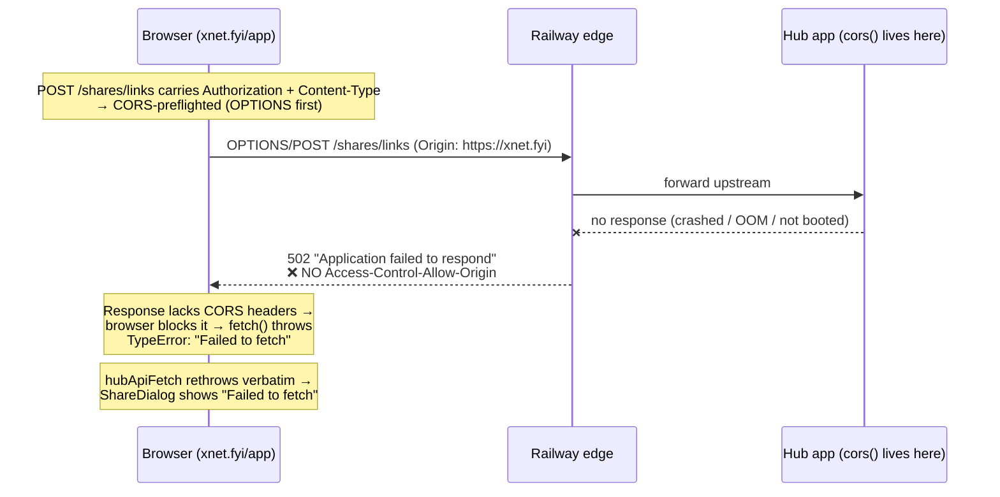
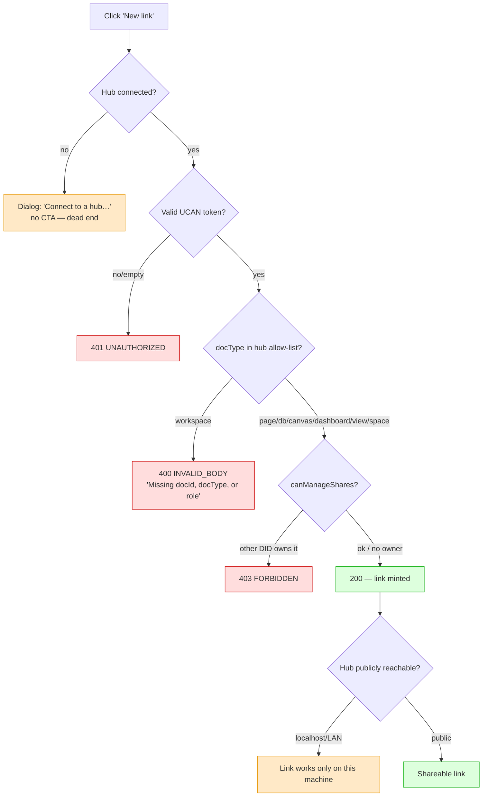

# Share-Link Generation: Failure Modes And Fixes

## Problem Statement

A user reports that **generating a share link fails** — e.g. "generating a
link to share a page." This exploration reproduces the share-link flow
locally against a real hub, isolates what actually fails (and what does
_not_), and recommends concrete fixes.

Bottom line up front: **sharing a _page_ works** end-to-end against a
reachable hub — I generated, claimed, and resolved a page link locally with
no errors. The real failures are elsewhere:

0. **⭐ The actual production report ("Failed to fetch" on `xnet.fyi/app` →
   `hub.xnet.fyi`) is a hub _outage_, not a share-link bug.** `hub.xnet.fyi`
   currently returns **`HTTP 502 "Application failed to respond"`** from the
   Railway edge for _every_ path (including `/health`). That 502 comes from
   the edge, **before** the hub's `cors()` runs, so it carries **no
   `Access-Control-Allow-Origin` header** — which is precisely what turns a
   CORS-preflighted `POST /shares/links` into a browser `TypeError: Failed to
   fetch`. Fix is operational (restart/redeploy the hub), not code. See
   [Production Outage](#production-outage-hubxnetfyi-returns-502--the-failed-to-fetch-report).
1. **Sharing a _workspace/bench_ is broken** — the client sends
   `docType: 'workspace'`, which the hub rejects with `400 INVALID_BODY`
   ("Missing docId, docType, or role"). Definite bug.
2. **Local-first default = no hub** — the app boots with no hub, and the
   Share dialog then only says _"Connect to a hub to create share links."_
   with no way to act. This is what most "sharing is broken" reports are.
3. **Private / `localhost` hubs mint links nobody else can open** —
   generation "succeeds" but produces a `http://localhost:4444/s/…` URL that
   only resolves on the issuing machine.

## Executive Summary

| Scenario | Result | Root cause |
| --- | --- | --- |
| **`xnet.fyi/app` → `hub.xnet.fyi` (the reported case)** | ❌ **`Failed to fetch`** | **Hub is down — Railway edge returns 502 with no CORS headers** |
| Share a **page** (hub connected, you own the doc) | ✅ works | — |
| Share a **database / canvas / dashboard / view / space** | ✅ works | — |
| Share a **workspace / bench** | ❌ `400 INVALID_BODY` | Hub `SHARE_DOC_TYPES` omits `'workspace'` |
| Share **anything with no hub connected** | ⚠️ blocked, no CTA | Local-first default; dialog dead-ends |
| Share from a **`localhost`/LAN hub** | ⚠️ link unusable off-machine | Private hub host in the URL |
| Share a doc **owned by another DID** (search-index recorded owner) | ❌ `403 FORBIDDEN` | `canManageShares` owner check |

I verified the production row and rows 2–6 directly (curl against
`hub.xnet.fyi`; Playwright against the running app; Node probes against a
live hub). The last row is confirmed by code inspection.

## Production Outage: hub.xnet.fyi Returns 502 (the `Failed to fetch` report)

The originally reported symptom — the link-generation modal on the hosted
demo app (`xnet.fyi/app`, connected to `hub.xnet.fyi`) failing with **"Failed
to fetch"** — reproduces from a plain `curl`, and it is **not** a share-link
code path at all. The hub is simply **down**.

Probed live on 2026-07-10:

```
$ curl -v https://hub.xnet.fyi/health
*  Trying 69.46.46.121:443...            # DNS → Railway (xjthmykc.up.railway.app)
*  SSL certificate verify ok.            # TLS handshake fine, edge is up
< HTTP/2 502
< content-type: application/json
< server: railway-hikari
< x-railway-fallback: true               # ← Railway edge fallback, app did NOT respond
< x-railway-edge: sjc1
{"status":"error","code":502,"message":"Application failed to respond","request_id":"…"}
```

Every path (including `/health` and `/shares/links`) returns the same 502.
For comparison, `xnet.fyi` and `cloud-staging.xnet.fyi` respond normally from
the same network, so this is `hub.xnet.fyi` specifically — the Railway
container is crashed / OOM / not booting, and the edge is serving its
fallback error page.

### Why a hub outage surfaces as `Failed to fetch`, not a clean error



The crucial subtlety: the hub's `app.use('*', cors())`
(`packages/hub/src/server.ts:150`, added in PR #398) can only attach
`Access-Control-Allow-Origin` **when the request reaches the hub process**.
A Railway edge 502 never gets there, so the error page has no CORS headers.
A CORS-preflighted request whose response lacks those headers is rejected by
the browser as a network `TypeError` — surfaced as the generic **"Failed to
fetch"**, indistinguishable (to the user) from a real CORS misconfiguration.

`hubApiFetch` (`apps/web/src/lib/share-links.ts:215`) does not catch the
network `TypeError`, so `createLink` → `handleCreate`
(`apps/web/src/components/ShareDialog.tsx:170`) sets `actionError =
"Failed to fetch"` verbatim. The same outage also breaks the `wss://hub.xnet.fyi`
sync socket, so the app is running purely local-first and the modal's
list-links `GET`s fail too (the user just notices the click that errors).

This is the exact scenario captured in the team memory note
_"Share dialog CORS + hub outage (#398): … Railway 502 = USER restart."_ —
the immediate remedy is to **restart / redeploy the Railway hub service**,
then confirm `GET https://hub.xnet.fyi/health` returns `200`.

**Why the hub crashed (likely root cause):** a restart alone may not hold. The
demo hub's per-user quota and daily eviction are **not enforced**, so one
active user filled the 500 MB Railway volume with >1 GB of `node_changes` data
— and a full SQLite volume crashes the hub on the next write/boot, producing
exactly this 502. Restart, but also **truncate the demo volume** and fix the
guardrails. Full analysis and fixes:
[0291_[_]_DEMO_HUB_RUNAWAY_STORAGE…](0291_%5B_%5D_DEMO_HUB_RUNAWAY_STORAGE_QUOTA_AND_EVICTION_NOT_ENFORCED.md).

### What this changes about the diagnosis

The `Failed to fetch` report is an **operational outage**, not the
share-link code. But it exposes two worthwhile product gaps:

- **The app can't tell "hub down" from "CORS bug" from "offline".** All three
  collapse into "Failed to fetch". `hubApiFetch` should catch the network
  `TypeError` and, when the hub is otherwise known (host reachable, socket
  down), surface something like _"Your hub (hub.xnet.fyi) isn't responding —
  it may be restarting. Try again shortly."_ instead of the raw string.
- **There is no uptime signal for `hub.xnet.fyi`.** A 502 on the demo hub
  silently breaks sharing, sync, forms, and files for every hosted user.
  A health-check monitor + auto-restart would have caught this before a user
  did.

## Reproduction Environment

- Hub: `node --import tsx packages/hub/src/cli.ts --port 4444 --storage memory`
  (defaults to UCAN auth on).
- Web app: `vite` dev server, driven with Playwright.
- Onboarding passkey: bypassed the WebAuthn wall with a CDP **virtual
  authenticator** (`WebAuthn.addVirtualAuthenticator`). The PRF extension
  is unsupported by the virtual authenticator, so the app's non-PRF
  **fallback** path minted a real `did:key:z6Mk…` identity — faithful to a
  real user, not the `xnet:test:bypass` shortcut.
- Hub connection: `localStorage['xnet:hub-url'] = 'ws://localhost:4444'`,
  then reload; status bar went to **"synced"**.

Creating a page (`/doc/g9wyvf2yzv`) → **Share** → **New link** produced:

```
http://localhost:4444/s/fMZI_06VwjOH#s=iXJlQVaqKdhVh9efgUMdaJUE5aS9JvVr
```

Network: `POST /shares/links → 200`. So the page path is healthy.

A Node probe minting a UCAN (mirroring `useHubAuthToken`) and hitting the
endpoint across every `docType`:

```
docType=page       -> 200
docType=database   -> 200
docType=canvas     -> 200
docType=dashboard  -> 200
docType=view       -> 200
docType=space      -> 200
docType=workspace  -> 400  {"code":"INVALID_BODY","error":"Missing docId, docType, or role"}
```

And a full round-trip (owner A creates → recipient B claims → interstitial):

```
create: http://localhost:4444/s/ziWlD0bxNrfc#s=…
claim status: 200 {"resource":"roundtrip_page","docType":"page","role":"write",…}
interstitial GET /s/:id status: 200  content-type: text/html
```

## Current State In The Repository

### Generation call chain

```
ShareDialog.handleCreate           apps/web/src/components/ShareDialog.tsx:158
  └─ useShareLinks.createLink       apps/web/src/hooks/useShareLinks.ts:190
       └─ hubApiFetch POST /shares/links   apps/web/src/lib/share-links.ts:215
            └─ hub POST /links      packages/hub/src/routes/share-links.ts:142
                 ├─ requireAuth (UCAN)          packages/hub/src/server.ts:432
                 ├─ isShareDocType(docType)     packages/hub/src/routes/share-links.ts:156
                 └─ canManageShares(did, docId) packages/hub/src/routes/share-links.ts:91
```

The `docType` mapping in the workbench header:
`packages/…`→ `apps/web/src/workbench/EditorHeader.tsx:29` maps node types to
`ShareDocType`. `page → 'page'` (valid), so the page header Share button is
correct.

### The `workspace` mismatch (bug #1)

- Client union **includes** `'workspace'`:
  `apps/web/src/hooks/useShareLinks.ts:13-22`.
- `WorkspaceSwitcher` sends it: `apps/web/src/workbench/WorkspaceSwitcher.tsx:215`
  (`docType="workspace"`).
- Hub **rejects** it — `SHARE_DOC_TYPES` has no `'workspace'`:
  `packages/hub/src/routes/share-links.ts:35`, validated at `:156`.
- The claim side is also unwired for it: `ShareClaimResult['docType']` union
  omits `'workspace'` (`apps/web/src/lib/share-links.ts:17`) and
  `docRouteFor` has no `'workspace'` case, falling through to `/doc/$docId`
  (`apps/web/src/lib/share-links.ts:238`).

So workspace sharing is half-implemented (added in exploration 0280 on the
client, never completed on the hub or the claim/route side).

### The no-hub dead-end (bug #2)

- Default boot logs `hub: (none — local-first…)`
  (`apps/web/src/boot/use-boot-sequence.ts:37`); hub is resolved from
  `localStorage['xnet:hub-url']` / `VITE_HUB_URL` / `?hub=`
  (`apps/web/src/lib/hub-url.ts`).
- With no hub, `useShareLinks` is not `ready`
  (`apps/web/src/hooks/useShareLinks.ts:109`) and the dialog renders only
  _"Connect to a hub to create share links."_
  (`apps/web/src/components/ShareDialog.tsx:238-240`) — **no button to
  connect one**. A hub _can_ be connected from the status-bar chip
  (`title="Hub: disconnected · local-ready"`, opens a dialog), but the Share
  dialog never points there.
- If a token is somehow empty, `hubApiFetch` still fires `Authorization:
  Bearer ` and the hub returns `401 UNAUTHORIZED`
  (`packages/hub/src/auth/ucan.ts`).

### The private-hub link (bug #3)

- `isPrivateHubHost` (`apps/web/src/lib/share-links.ts:268`) already detects
  `localhost`/RFC-1918/`.local`; the dialog shows an amber warning
  (`apps/web/src/components/ShareDialog.tsx:242-249`). But it still generates
  a `http://localhost:…` link — copyable and share-looking, yet dead for any
  recipient. The hub builds that URL from `publicUrl ?? ws://localhost:port`
  (`packages/hub/src/routes/share-links.ts:65-68,188-191`).

### Ownership gate (edge, bug #4)

`canManageShares` (`packages/hub/src/routes/share-links.ts:91-101`): if a
`docMeta` row exists with a different `ownerDid` and the caller has no
`admin` grant → `403 FORBIDDEN`. `ownerDid` is only ever recorded via the
**search-index** WS path (`packages/hub/src/ws/handlers/search-index.ts:40`
→ `packages/hub/src/services/query.ts:106`), keyed to the DID that sent the
index update. So a user who **rotated their identity** (recovery on a new
device, new `did:key`) can be locked out of sharing their own previously
indexed doc.

Conversely — and worth flagging — if **no** `docMeta` exists (the common
case; plain page/CRDT sync never writes it), `canManageShares` returns
`true`, so _any_ authenticated DID can mint links for _any_ `docId`.

## External Research

- **WebAuthn PRF + virtual authenticators.** Chrome's CDP
  `WebAuthn.addVirtualAuthenticator` does not advertise the `hmac-secret`
  extension that WebAuthn PRF relies on, so PRF-derived-key flows must have a
  fallback — which xNet has (`packages/identity/src/passkey/create.ts`,
  `support.ts`). This is the standard pattern (see Chromium
  `VirtualAuthenticatorOptions`; MDN "Web Authentication extensions → prf").
- **Fragment secrets.** Carrying the capability secret in the URL `#fragment`
  (never sent to the server) is the same technique used by password managers
  and E2E "secret link" tools (e.g. 1Password sharing, Firefox Send's model).
  xNet's hub only stores `sha256(secret)` and returns the secret exactly once
  (`packages/hub/src/routes/share-links.ts:47,170-191`) — correct.
- **Prior fix in this codebase.** PR #398 added global `app.use('*', cors())`
  (`packages/hub/src/server.ts:150`) so authenticated cross-origin POSTs
  survive preflight. I confirmed the preflight is answered
  (`access-control-allow-origin: *`) **when the request reaches the hub**.
  But that guarantee evaporates during an outage: a **Railway edge 502**
  (`x-railway-fallback: true`) is served _before_ the hub runs, with no CORS
  headers — reintroducing the same browser-visible "Failed to fetch". The
  application-layer CORS fix cannot cover edge/proxy error pages; only hub
  uptime (or edge-injected CORS headers) can. This is the production case
  observed here.

## Key Findings



1. **Page sharing is not broken** with a reachable hub and matching identity.
2. **Workspace sharing is broken** at the protocol layer (`docType` allow-list
   drift between client and hub).
3. The **no-hub** experience is the most common "sharing is broken" report:
   local-first is the default and the Share dialog dead-ends.
4. **Private-hub** links are generated but non-functional off-machine.
5. Two ownership edges: a rotated identity locks you out (`403`); a missing
   `docMeta` lets anyone mint links (over-permissive).

## Options And Tradeoffs

### Bug #1 — `workspace` docType

| Option | What | Tradeoff |
| --- | --- | --- |
| **A. Add `'workspace'` to the hub allow-list** (recommended) | Add to `SHARE_DOC_TYPES` (`share-links.ts:35`), the claim `ShareClaimResult['docType']` union, and a `docRouteFor` case. | Small, closes the drift; must also confirm the claim → route → sync path resolves a workspace node. Protocol-surface change → **minor** changeset for `@xnetjs/hub`? No: the hub isn't a publishable lib boundary here, but the accepted-values change is consumer-visible — bump per the diff. |
| **B. Remove `'workspace'` from the client** | Drop the union member + the `WorkspaceSwitcher` Share entry until the hub supports it. | Fastest to stop the error, but removes a feature 0280 intended to ship. |
| **C. Generic "shareable node" type** | Collapse doc-type validation to "is this a shareable node id?" and carry type as advisory. | Bigger refactor; loses the type-scoped routing/role semantics (esp. `space` subtree grants). |

### Bug #2 — no-hub dead-end

| Option | What | Tradeoff |
| --- | --- | --- |
| **A. In-dialog "Connect a hub" CTA** (recommended) | When `!ready`, render a button that opens the existing hub-connection dialog (the status-bar chip target). | Small UX add; turns a dead-end into a path. |
| **B. Ship a default hub** | Point `VITE_HUB_URL` at a managed hub for hosted builds. | Changes the local-first promise; only for the hosted app, gated on consent. |
| **C. Explain-only** | Improve copy ("Sharing needs a hub because links are claimed server-side…"). | Cheap, but still no action. |

### Bug #3 — private-hub links

| Option | What | Tradeoff |
| --- | --- | --- |
| **A. Escalate the warning + gate copy** (recommended) | Keep generating (LAN sharing is legitimate) but label the URL "Local only" and require a confirm to copy/QR. | Preserves LAN use; prevents "why doesn't my link work" confusion. |
| **B. Block generation on private hubs** | Refuse to mint when `isPrivateHubHost`. | Breaks legitimate same-LAN/in-person QR handoff. |

### Bug #4 — ownership edges

| Option | What | Tradeoff |
| --- | --- | --- |
| **A. Record `ownerDid` on first node write, not just index** | Have node-relay stamp `docMeta.ownerDid` when a doc is first seen. | Closes the "anyone can mint links for any docId" hole; must handle legacy docs and multi-writer docs carefully. |
| **B. Better `403` copy + self-heal for identity rotation** | Detect owner-mismatch and offer recovery-phrase re-link / admin-grant path. | Narrow; doesn't fix the over-permissive default. |

## Recommendation

**First, resolve the outage (this is what the user actually hit):**

0. **Restart / redeploy the `hub.xnet.fyi` Railway service now**, then verify
   `curl https://hub.xnet.fyi/health` → `200`. Check the Railway logs for the
   crash cause (OOM, boot failure, Litestream/VACUUM — cf. explorations 0258
   Cloud HA and the cold-open-stall note). Then add uptime monitoring +
   auto-restart so a hub 502 pages an operator, not a user.

**Then ship the two high-signal, low-risk code fixes, then the hardening:**

1. **Fix `workspace` (Bug #1, Option A)** — align the hub allow-list, the
   claim union, and `docRouteFor`, and add a hub test asserting all seven
   `ShareDocType` values round-trip. This is a true generation failure with a
   confusing error string; it's the clearest "share fails" defect.
2. **Add the in-dialog "Connect a hub" CTA (Bug #2, Option A)** — this is what
   most local-first users actually hit. Reuse the status-bar hub dialog.
3. **Label private-hub links "Local only" with a copy-confirm (Bug #3,
   Option A).**
4. **Follow up on ownership (Bug #4)** — separately, decide between stamping
   `ownerDid` on first write vs. keeping the permissive default; today's
   behaviour is a latent authz smell, not the user's immediate bug.

## Example Code

Bug #1 — hub allow-list (`packages/hub/src/routes/share-links.ts:35`):

```ts
// Add 'workspace' (saved shell layouts / benches — exploration 0280).
const SHARE_DOC_TYPES = [
  'page', 'database', 'canvas', 'dashboard', 'view', 'space', 'workspace'
] as const
```

Claim union + route (`apps/web/src/lib/share-links.ts:17,238`):

```ts
export type ShareClaimResult = {
  resource: string
  docType: 'page' | 'database' | 'canvas' | 'dashboard' | 'view' | 'space' | 'workspace'
  role: 'read' | 'comment' | 'write'
  endpoint: string
}

// docRouteFor(): add
case 'workspace':
  return { to: '/workspace/$workspaceId', params: { workspaceId: resource } }
```

Bug #2 — Share dialog CTA (`apps/web/src/components/ShareDialog.tsx:238`):

```tsx
{!ready && tab !== 'permissions' && (
  <div className="text-xs text-muted-foreground">
    <p className="mb-2">Share links are claimed on a hub — connect one to create links.</p>
    <button type="button" onClick={onConnectHub}
      className="px-2 py-1 rounded bg-primary text-white">Connect a hub…</button>
  </div>
)}
```

## Risks And Open Questions

- **Does the claim → route → sync path actually resolve a workspace node?**
  Adding `'workspace'` to the allow-list only fixes generation; exploration
  0280's `xnet:Workspace` node must sync and open at `/workspace/$id` for the
  recipient. Needs an end-to-end test, not just a 200 on `POST /links`.
- **Over-permissive `canManageShares`.** With no `docMeta`, any authenticated
  DID can mint links for any `docId`. If we stamp `ownerDid` on first write,
  we must not lock out legitimate multi-writer/collaborative docs or legacy
  data.
- **Identity rotation → 403.** Recovery on a new device yields a new
  `did:key`; previously indexed docs then reject sharing. Is there a re-link
  path? (Ties into the account-recovery work, 0243.)
- **Changeset bump.** Changing the hub's accepted `docType` set and the
  client `ShareClaimResult` union is a wire/contract change — bump from the
  diff (per CLAUDE.md), likely **minor** for the affected publishable
  packages.

## Implementation Checklist

- [ ] **Restart/redeploy `hub.xnet.fyi` and confirm `/health` → 200** (unblocks the reported "Failed to fetch").
- [ ] Investigate the Railway crash cause from logs; add a health-check monitor + alerting/auto-restart for the demo hub.
- [x] Make `hubApiFetch` catch the network `TypeError` and surface a "hub unreachable / may be restarting" message instead of raw "Failed to fetch" (`apps/web/src/lib/share-links.ts:215`).
- [x] Add `'workspace'` to `SHARE_DOC_TYPES` in `packages/hub/src/routes/share-links.ts`.
- [x] Extend `ShareClaimResult['docType']` union in `apps/web/src/lib/share-links.ts`.
- [x] Add a `'workspace'` case to `docRouteFor` (route target for a claimed bench).
- [ ] Verify the recipient's claim opens the workspace node (sync + route) end-to-end.
- [ ] Add an in-dialog "Connect a hub" CTA to `ShareDialog` when `!ready`, wired to the existing hub-connection dialog.
- [ ] Label private-hub links "Local only" and add a copy/QR confirm (keep LAN sharing).
- [ ] (Follow-up) Decide `ownerDid`-on-first-write vs. permissive default; write a hub test for the chosen behaviour.
- [x] Add a hub test asserting every `ShareDocType` value returns 200 from `POST /shares/links`.
- [ ] Write the changeset(s) reflecting the `docType`/union contract change.

## Validation Checklist

- [ ] `curl https://hub.xnet.fyi/health` returns **200** (not 502); a browser `POST /shares/links` from `xnet.fyi/app` succeeds.
- [ ] With the hub deliberately stopped, the Share dialog shows a "hub unreachable" message rather than raw "Failed to fetch".
- [x] Node probe: `POST /shares/links` returns **200** for all of
      page/database/canvas/dashboard/view/space/**workspace**.
- [ ] Browser: with a hub connected, **New link** for a page, a database, and
      a **bench** each yields a copyable URL (no error banner).
- [ ] Browser: with **no** hub, the Share dialog shows a working **Connect a
      hub** button that lands you connected, after which **New link** works.
- [ ] Round-trip: a second identity **claims** a workspace link and lands on
      the workspace view.
- [ ] Private hub: link is labelled "Local only"; copy requires confirm.
- [ ] Ownership: a non-owner (per `docMeta`) gets a clear `403` message, and
      the chosen owner-stamping behaviour matches the new hub test.

## References

- `apps/web/src/components/ShareDialog.tsx` — the dialog + `handleCreate`.
- `apps/web/src/hooks/useShareLinks.ts` — `createLink`, `ShareDocType`, hub API.
- `apps/web/src/lib/share-links.ts` — `hubApiFetch`, claim/parse, `isPrivateHubHost`, `docRouteFor`.
- `apps/web/src/workbench/EditorHeader.tsx` / `WorkspaceSwitcher.tsx` — Share entry points + docType mapping.
- `packages/hub/src/routes/share-links.ts` — `POST /links`, `SHARE_DOC_TYPES`, `canManageShares`, secret hashing.
- `packages/hub/src/server.ts` — route mount + global `cors()` (PR #398).
- `packages/hub/src/services/query.ts`, `ws/handlers/search-index.ts` — where `docMeta.ownerDid` is recorded.
- `apps/web/src/lib/hub-url.ts`, `apps/web/src/boot/use-boot-sequence.ts` — hub resolution + local-first default.
- `packages/hub/test/share-links.test.ts` — existing generation/claim/CORS tests (extend here).
- Related explorations: 0169 (durable share links), 0179 (Spaces unified sharing), 0280 (malleable workbench / `xnet:Workspace`), 0243 (account recovery / identity rotation).
