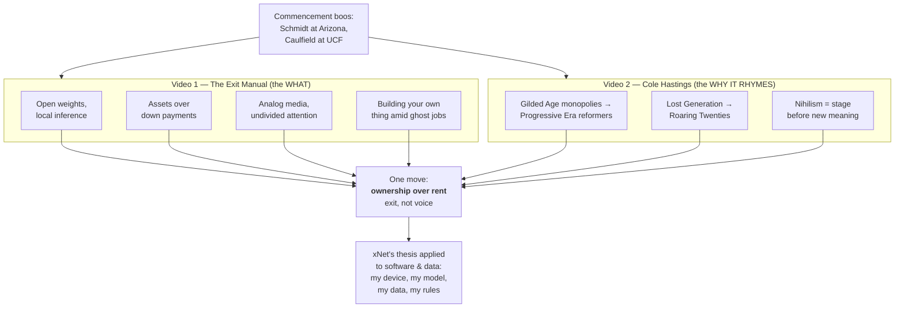
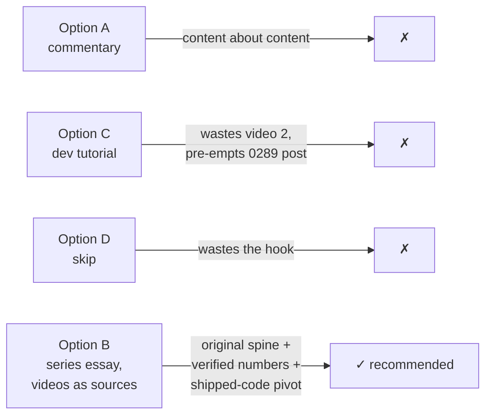
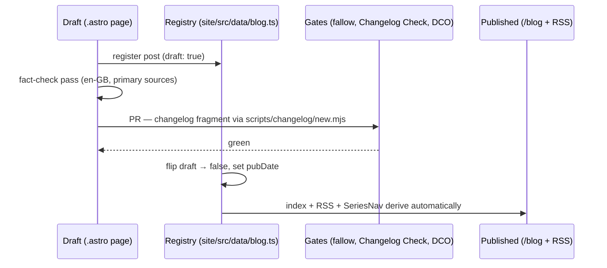

# A Blog Post On Gen Z's Quiet Ownership Revolution (From Two Videos)

## Problem Statement

Two recent YouTube essays argue, from different altitudes, that Gen Z is
mid-way through a quiet revolution:

1. **"The Gen Z Revolution Is Quietly Happening (and you might miss it)"** —
   _The Exit Manual_, 2026-06-26, 14 min, ~22k views
   (<https://www.youtube.com/watch?v=MwBwIYAj7_U>). Four data-backed
   behavioural shifts: ditching closed AI subscriptions for open-weight models
   run on their own hardware; skipping the down payment for stocks and
   Bitcoin; a genuine analog-media boom; and record entrepreneurship under 25
   (partly because the job market is full of ghosts).
2. **"Why Gen Z Will Start The Next Revolution"** — _Cole Hastings_,
   2026-05-25, 17 min, ~386k views
   (<https://www.youtube.com/watch?v=3MfsBH32n2g>). The historical frame:
   history is a spiral, not a circle (via Berserk's causality and Twain's
   "history rhymes"). The Gilded Age's monopolies produced the Progressive
   Era's reformers; the Lost Generation produced the Roaring Twenties'
   cultural explosion; today's nihilism statistics are the stage _before_ new
   meaning gets built.

Both videos literally open on the same scene — graduates booing AI executives
at commencement (Eric Schmidt at the University of Arizona; Gloria Caulfield
at the University of Central Florida). Neither video is about xNet, but their
shared thread — **a generation exiting rented everything for things it can
own and hold** — is xNet's founding thesis applied to software and data.

Should we write a blog post that weaves both videos together, and if so,
what's the angle, what survives fact-checking, and what are the mechanics?

## Executive Summary

**Yes — write it as essay #13 in the series**, with the two videos credited
and linked as the source material and a clear intellectual spine of our own:
**the revolution is exit, not voice** (Hirschman, _Exit, Voice, and
Loyalty_). Booing a commencement speaker is voice; quietly moving your
inference, your savings, your attention, and your work onto rails you own is
exit. The essay's job is to show the four shifts as one move — ownership over
rent — place that move on Hastings' historical spiral, and then make the move
concrete for software: local-first data, open weights on your own machine,
apps as views over data you hold. That last section is where xNet lives, and
we can write it from real shipped work (the local-model connector ladder and
the secure loopback bridge) rather than aspiration.

Fact-checking matters (established in exploration 0247): several of the
videos' punchiest statistics check out against primary sources
(bookstores +70% since 2020, the NBER "no measurable productivity impact"
survey, ghost-job surveys, Gen Z investing at ~19), several need softening
(the "90% of tasks" open-model parity claim, "60% of Fortune 1000"), and a
few should be dropped or reframed (down-payment years, the over-65 vs
under-25 hiring stat). The essay should ride the verified spine and treat the
rest as colour, always attributed.

## Source Material: The Two Videos

### Video 1 — The Exit Manual: four quiet shifts

| #   | Claim cluster               | The video's framing                                                                                                                                                                                                                                                                                                                                                         |
| --- | --------------------------- | --------------------------------------------------------------------------------------------------------------------------------------------------------------------------------------------------------------------------------------------------------------------------------------------------------------------------------------------------------------------------- |
| 1   | **Open-weight AI exodus**   | The commencement boos aren't Luddism — "these kids all use Claude Code to get through finals." They're calling an expensive bluff: AI is simultaneously sold as job-destroying and job-creating because trillion-dollar valuations require it. The real protest is running GLM/Qwen locally: "My device, my model, my rules." "Same productivity tools, $0 to big tech."    |
| 2   | **Skipping the house**      | First generation in ~80 years planning to skip the down payment outright; investing from age 19 (vs boomers at 35); houses as "the real pension" is a policy choice, not physics (Tokyo counter-example); draining the monetary premium from housing into equities/BTC.                                                                                                     |
| 3   | **Analog rebirth**          | Indie bookstores +70% since 2020; film cameras booming; board games at 20-year growth highs. Framed as a counter-response to how media is _produced_ (the Netflix "second screen" memo — dialogue rewritten for people half-watching) as much as consumed. Key line: "Choosing the things that cost you your undivided attention is like choosing a money you can't print." |
| 4   | **Forced entrepreneurship** | Record entrepreneurs under 25 — with the asterisk that entry-level jobs have evaporated and many listings are ghosts kept up "for investor optics." "Applying to AI-generated fake jobs with an AI-generated fake CV to make fake money printed out of thin air." Upside: a cohort forced to learn how an idea becomes a thing.                                             |

### Video 2 — Cole Hastings: the spiral

- **Causality as a spiral** (from Berserk): events rhyme with the past but
  express differently. "History is not a circle, but rather a spiral."
- **Gilded Age → Progressive Era**: railroads/oil/steel created wealth faster
  than society could morally process it; top 10% held ~80% of wealth by 1910
  (Piketty's historical series); child labour fed the machine. The people who
  grew up inside it — Ida Tarbell, Jane Addams, Theodore Roosevelt — built
  the reform era. Explicit parallel: "Back then … railroad companies, oil
  companies … Today … AI companies, social media platforms, and
  trillion-dollar tech firms" over "culture, attention, creativity, and truth."
- **Lost Generation → Roaring Twenties**: WWI (~16M dead) + 1918 flu (~50M)
  produced the generation called "lost" — which then produced Hemingway,
  Fitzgerald, jazz, and Tolkien's deliberate answer to despair.
- **Nihilism as the stage before meaning**: the post-2012 anxiety/depression
  curves can't rise forever; "hopecore," BookTok, indie film, and the
  analog revival are the revolt already visible through the cracks.

### Where they interlock



## Current State In The Repository

### Blog infrastructure (what a new post touches)

- **Registry**: `site/src/data/blog.ts` — hand-maintained `posts[]` array;
  each post has `slug`, `title`, `description` (the deck), `pubDate`
  (ISO-8601 UTC), `authors` (`['crs48', 'claude']` is the series norm, with
  the AI co-author rendering as "with …"), `tags` (union type `BlogTag`:
  `essay | philosophy | privacy | decentralization | protocol | nature |
cosmos | economics | personal`), `readingMinutes`, and optional
  `draft: true` while authoring. RSS (`site/src/pages/blog/rss.xml.ts`) and
  the index page derive from this registry — no extra wiring.
- **Page**: `site/src/pages/blog/<slug>.astro` — hand-authored,
  art-directed Astro pages (deliberately **no MDX/content collections**;
  established in exploration 0248). Each post imports `postBySlug`, a
  bespoke hero (e.g. `site/src/components/blog/TimeoutHero.astro`),
  `Byline.astro`, and optionally `Mermaid.astro` / `CodeFigure.astro`.
- **Series navigation**: `SeriesNav.astro` + `seriesNeighbors()` in
  `blog.ts` — new posts join automatically once registered.
- **Conventions from prior posts** (explorations 0239–0281): en-GB spelling
  throughout; every factual claim checked against a primary source (0247);
  all assets vendored, never hot-linked (0269 — avatars live at
  `site/public/blog/authors/`); a changelog fragment via
  `node scripts/changelog/new.mjs`; commit headers ≤72 chars; `site/` is a
  private app so **no changeset**, but the Changelog Check and DCO gates
  apply.

### xNet surfaces the essay can cite (the "we build this" section)

- **The local-model connector ladder**:
  `packages/plugins/src/ai/connectors/detect.ts` probes, in order, a
  loopback **bridge** wrapping the user's own `claude`/`codex` CLI
  (`packages/devkit/src/bridge-server.ts`, `:31416`), **local servers**
  (Ollama `:11434`, LM Studio `:1234`), and in-browser **WebLLM**
  (`apps/web/src/workbench/views/ai-webllm-engine.ts`) — before any cloud
  key. Exploration `0252_[_]_WHY_THE_AI_CHAT_BOX_IS_DISABLED_LOCAL_MODEL_CONNECTOR_GAPS.md`
  documents the detection/instantiation split.
- **The secure browser↔local-model spine**: exploration
  `0289_[_]_SECURELY_CONNECTING_THE_BROWSER_TO_A_LOCAL_MODEL.md` (this very
  worktree's lineage) — pairing-code auth, Host-header validation, and the
  native-messaging bridge spike (PR #442). "My device, my model, my rules"
  is not a slogan here; it's a threat model we've written CVE citations for.
- **The ownership thesis in prior essays**: `the-vault-and-the-view.astro`
  (apps as views over data you hold), `hand-on-the-tiller.astro` (agency),
  `the-workshop-and-the-walled-garden.astro` (scoped authority vs rented
  platforms), and the leveragism/economics thread
  (`the-forest-and-the-field.astro`, exploration 0245). The staged-but-unwritten
  exploration 0249 (substitute economy, spine: Illich) is adjacent — this
  post can gesture at it without pre-empting it.

## External Research (Fact-Check)

Per the 0247 convention: verify before we publish, attribute what we borrow,
soften or drop what doesn't hold.

| Claim (as made in the videos)                                                                         | Verdict                            | What the sources actually say                                                                                                                                                                                                                                                     |
| ----------------------------------------------------------------------------------------------------- | ---------------------------------- | --------------------------------------------------------------------------------------------------------------------------------------------------------------------------------------------------------------------------------------------------------------------------------- |
| Eric Schmidt booed at commencement over AI                                                            | **Verified**                       | NBC News: University of Arizona, class of 2026; opened with Time's 1982 "Machine of the Year" framing; audibly booed.                                                                                                                                                             |
| Gloria Caulfield booed at "University of Florida" (video 2)                                           | **Verified, correct the venue**    | It was the University of **Central** Florida; she called AI "the next industrial revolution."                                                                                                                                                                                     |
| "90% of CEOs report no productivity gains" (2026 study)                                               | **Soften to the real study**       | NBER survey (~6,000 execs, US/UK/DE/AU): the vast majority report **no measurable impact** on productivity or employment from AI over three years. MIT's 2025 report separately found ~95% of GenAI pilots deliver no measurable P&L impact. Use these, cited, not "90% of CEOs." |
| Open models "match or outperform Claude in 90% of tasks"                                              | **Drop the number**                | Unsupportable as stated. Defensible version: 2026 open-weight leaders (Qwen3, GLM, DeepSeek, Llama) are genuinely competitive on many benchmarks and trivially runnable via Ollama/LM Studio; "good enough for most of what most people do" is the honest claim.                  |
| Anthropic/OpenAI IPOs "$1.2T valuations, $20B revenue"                                                | **Verify before use, likely drop** | Fast-moving numbers; the essay doesn't need them. The verified NBER/MIT gap between capex narrative and measured gains carries the point.                                                                                                                                         |
| Indie bookstores +70% since 2020                                                                      | **Verified**                       | ~1,916 → ~3,218 US stores; 422 new indie shops opened in 2025 alone (ABA data, widely reported).                                                                                                                                                                                  |
| Film cameras +900% in 8 years                                                                         | **Soften**                         | Solid sources support a large multi-year boom (e.g. +127% sales since 2020; under-25s ≈41% of new film customers; vinyl +29% YoY). Use the sourced figures.                                                                                                                       |
| Netflix "second screen" dialogue memo                                                                 | **Verified as reported**           | Widely reported (originating in n+1's "casual viewing" piece, 2024): writers asked to have characters announce what they're doing for half-watching viewers.                                                                                                                      |
| Gen Z starts investing at 19 (boomers: 35)                                                            | **Verified**                       | Multiple surveys (Schwab/CFA Institute lineage) put Gen Z's average first-investment age at ~19 vs mid-30s for boomers; crypto held by ~42% of Gen Z investors.                                                                                                                   |
| First generation planning to skip the down payment                                                    | **Soften**                         | Well-supported directionally (widely reported surveys: Gen Z redirecting would-be down-payment savings into markets; 27% Gen Z homeownership vs 80% boomer). "22 years vs 7 years to save a deposit" varies wildly by market — use a sourced range or drop.                       |
| Ghost jobs: "60% of Fortune 1000 admit fake listings"                                                 | **Soften to real surveys**         | ResumeBuilder (May 2025, 650 hiring managers): ~40% posted a fake listing that year; ~30% have fakes up now; 7 in 10 hiring managers call the practice acceptable. Greenhouse: ~1 in 4 listings likely ghosts. Use these.                                                         |
| More over-65s than under-25s filled jobs last year                                                    | **Verify or drop**                 | Couldn't confirm in this pass; drop unless a BLS source is found.                                                                                                                                                                                                                 |
| Gilded Age: top 10% held ~80% of wealth (1910); child labour ~18% of ages 10–15 (1890)                | **Verified**                       | Piketty's historical series; US census-era child-labour data. (Video says "Thomas Petti" — it's Piketty.)                                                                                                                                                                         |
| WWI ~16M dead; 1918 flu ~50M; Stein → Hemingway "lost generation"; Tarbell/Addams/Northern Securities | **Verified**                       | Standard historical record.                                                                                                                                                                                                                                                       |
| 43% of Gen Z plan to start a business; 13% earn from social media                                     | **Verify before use**              | Plausible survey figures; find the primary survey or attribute to the video explicitly.                                                                                                                                                                                           |

**Aggregate judgement**: the two videos' spines survive contact with sources;
the decoration sometimes doesn't. Our essay should quote the videos for
voice, cite primary sources for numbers, and say plainly where a claim is
directional rather than proven.

## Key Findings

1. **This is the series' thesis arriving from outside.** Twelve essays argue
   ownership-over-rent for data and software; here are two unrelated
   creators (one finance-flavoured, one culture-flavoured, ~400k combined
   views) mapping the same move across AI, housing, media, and work. The
   essay writes itself as: _the revolution you're watching in those videos
   has a software layer, and it's buildable today._
2. **The two videos need each other.** Video 1 alone is a listicle of
   trends; video 2 alone is a history lecture with vibes. Woven: the spiral
   explains why the four shifts aren't cope — they're the standard behaviour
   of a generation that came of age inside someone else's boom.
3. **Exit vs voice is the missing named concept.** Neither video names
   Hirschman, but both describe him: booing is voice; unsubscribing,
   self-hosting, buying film cameras, and founding your own shop are exit.
   The channel behind video 1 is literally called _The Exit Manual_. This
   gives our essay an intellectual spine that is ours, not borrowed.
4. **xNet's section must be concrete, not evangelistic.** We can point at a
   working connector ladder (`detect.ts`), a security exploration with CVE
   citations (0289), and a protocol whose whole design is "your data outlives
   any app" (0200). The essay earns the pivot only if the pivot is shipped
   code.
5. **The weakest part of both videos is triumphalism.** NBER/MIT say AI
   gains are unmeasured, not absent; skipping housing is partly involuntary;
   under-25 entrepreneurship is partly unemployment wearing a trench coat.
   The essay should keep the honesty the series is known for — the spiral
   only turns because Tarbells and Addamses _work_; it is not a law of
   physics either.

## Options And Tradeoffs

### Option A — Straight commentary/response post ("two videos, reviewed")

Summarise both videos, react section by section.

- ✅ Fast to write; clean attribution.
- ❌ Reads as content-about-content; beneath the series' standard (every
  prior essay has an original metaphor and an argument of its own).
- ❌ Ages exactly as fast as the videos do.

### Option B — Series essay with the videos as source material (recommended)

An original essay — working title **"Weights You Can Hold"** — with the
Hirschman exit/voice spine, the spiral as historical frame (credited to
Hastings), the four shifts as evidence (credited to The Exit Manual, numbers
re-anchored to primary sources), and a closing movement on software
ownership grounded in xNet's shipped local-model work.

- ✅ Fits the series' voice and quality bar; the videos become footnotes to
  an argument rather than the argument.
- ✅ "Weights" puns across the whole essay: open weights, the weight of a
  book/film camera in your hand, weight as the thing rented things never
  have. Alternative titles: "The Spiral and the Exit", "A Money You Can't
  Print", "The Renters' Rebellion".
- ✅ Evergreen: the stats are dated colour; the exit/ownership argument is not.
- ❌ Most writing effort; needs a bespoke hero + art components like every
  series post.

### Option C — Developer-angled post ("run your own model, own your own data")

Lead with the local-AI shift only; make it half-tutorial (connector ladder,
bridge security), half-manifesto.

- ✅ Deepest xNet tie-in; useful content.
- ❌ Wastes the two videos (housing/analog/entrepreneurship don't fit);
  overlaps the docs' job; the series is essays, not tutorials.
- ❌ The 0289 exploration's work deserves its own technical post _after_ the
  bridge ships — better kept separate.

### Option D — Don't write it

- ✅ Zero effort.
- ❌ The overlap between the videos' thesis and the product's reason to
  exist is the best organic hook the blog has had; passing wastes it.



## Recommendation

Write **Option B** as series post #13:

- **Slug**: `weights-you-can-hold` (final title call at draft time; keep the
  slug stable once registered).
- **Registry entry**: `authors: ['crs48', 'claude']`,
  `tags: ['essay', 'economics', 'privacy', 'decentralization']`,
  `readingMinutes: ~14`, `draft: true` until review.
- **Attribution**: both videos linked prominently in the opening movement
  and in a closing "sources" note; direct quotes (e.g. "choosing a money you
  can't print", "my device, my model, my rules") quoted and credited, never
  absorbed silently. All statistics re-cited to primary sources per the
  fact-check table above.
- **En-GB spelling**; every claim in the table's "verify before use" rows
  either sourced or cut before `draft: false`.

### Proposed essay outline

1. **Two stages, one boo** — Schmidt at Arizona, Caulfield at UCF. The
   surface take (Luddites!) and the better take: the booers use AI daily;
   what they're rejecting is the story that they must rent their future from
   the people on stage.
2. **The spiral** (crediting Hastings) — Gilded Age → Progressive Era; Lost
   Generation → Roaring Twenties. The people who come of age inside someone
   else's boom are the ones who re-write its rules. Today's railroads are
   attention, inference, and cloud rent.
3. **Four quiet exits** (crediting The Exit Manual, numbers re-anchored) —
   open weights on owned hardware; assets you can hold over mortgages you
   can't reach; media that costs your undivided attention ("a money you
   can't print"); building your own thing in a market full of ghost jobs.
4. **Exit, not voice** — the Hirschman turn, and the observation that the
   channel is called The Exit Manual for a reason. Booing changes nothing;
   leaving changes the pricing model.
5. **The software layer of the exit** — what ownership means for data and
   apps; xNet's connector ladder and loopback bridge as "my device, my
   model, my rules" made literal; the vault-and-view thesis in one
   paragraph, linking back through the series.
6. **What the numbers don't say** (the honesty section) — unmeasured ≠
   absent AI gains; exits that are partly evictions; the spiral turns only
   when people push it. Tarbell wasn't a vibe.
7. **Close** — the generation that reads the terms of service. Both videos
   embedded/linked.



## Example Code

Registry entry (prepended to `posts[]` in `site/src/data/blog.ts`):

```ts
{
  slug: 'weights-you-can-hold',
  title: 'Weights You Can Hold',
  description:
    'Graduates are booing AI executives at commencement — then going home ' +
    'to run open-weight models on their own laptops. Two video essays, one ' +
    'quiet revolution: a generation swapping rented everything for things ' +
    'it can hold — model weights, assets, film cameras, its own businesses ' +
    '— and what that exit means for who owns your software.',
  pubDate: '2026-07-XXT17:00:00Z',
  authors: ['crs48', 'claude'],
  tags: ['essay', 'economics', 'privacy', 'decentralization'],
  readingMinutes: 14,
  draft: true
}
```

Page skeleton (`site/src/pages/blog/weights-you-can-hold.astro`) follows the
`timeout.astro` idiom: bespoke `WeightsHero.astro`, `Byline`, prose article,
one `Mermaid` exhibit (the spiral timeline), and — in the software-layer
section — a `CodeFigure` showing the connector ladder's probe order verbatim
from `packages/plugins/src/ai/connectors/detect.ts`.

## Risks And Open Questions

- **Riding creators' work**: the essay must add an argument, not repackage
  two videos. Mitigation: Hirschman spine + xNet pivot are original;
  everything borrowed is quoted and linked. (Also a courtesy: the post links
  send traffic to both channels.)
- **Dated statistics**: 2026 survey numbers will rot. Mitigation: keep
  numbers in clearly-dated, sourced asides; let the argument carry.
- **Politics-adjacent territory** (housing, generational grievance): the
  series has stayed non-partisan. Mitigation: the essay is about ownership
  mechanics, not policy prescriptions; the Tokyo zoning aside stays
  descriptive.
- **Triumphalism about open models**: we sell against closed AI while
  shipping OpenRouter-managed cloud AI ourselves (0208/0244). The essay must
  not saw off the branch: the honest position is _choice_ — the ladder
  probes local first and falls back to metered cloud, and the user decides.
  Say exactly that.
- **Title collision check**: confirm no existing post/tag clash for
  "weights" phrasing at draft time.
- **Open**: embed the videos (YouTube iframes; third-party script weight +
  consent implications for a privacy-branded site) or link with vendored
  thumbnails? Prior series practice vendors all assets — recommend
  **links + vendored stills**, no iframes.
- **Open**: does `pubDate` slot before or after the 0249 substitute-economy
  essay if that gets written? They're siblings; order by readiness.

## Implementation Checklist

- [x] Draft the essay in `site/src/pages/blog/weights-you-can-hold.astro`
      (en-GB, series voice, outline above; no MDX).
- [x] Register the post in `site/src/data/blog.ts` with `draft: true`
      (entry per Example Code; final title/description/readingMinutes at
      draft completion).
- [x] Build `WeightsHero.astro` (+ art component if the design wants one,
      e.g. `WeightsArt.astro`/`HonestWeights.astro`) under
      `site/src/components/blog/`, matching the series' hero idiom.
- [x] Vendor any stills/assets under `site/public/blog/` (no hot-linking,
      no YouTube iframes).
- [x] Add the `CodeFigure` exhibit from
      `packages/plugins/src/ai/connectors/detect.ts` (verbatim probe order)
      and the spiral `Mermaid` exhibit.
- [x] Fact-check pass against the table above: every "soften" softened,
      every "verify before use" sourced or cut; quotes attributed to the
      videos with links.
- [x] Read-through for series continuity links (the-vault-and-the-view,
      hand-on-the-tiller, the-workshop-and-the-walled-garden).
- [x] Changelog fragment via `node scripts/changelog/new.mjs` (site change;
      no changeset — `site/` is not a publishable package).
- [x] Flip `draft: false`, set real `pubDate`, confirm `readingMinutes`.
- [x] Commit per Conventional Commits (header ≤72 chars), PR, merge-commit
      per repo policy.

## Validation Checklist

- [x] `site` builds clean (`pnpm --filter site build` or repo-standard
      turbo filter) with the post registered.
- [x] Post renders at `/blog/weights-you-can-hold` in light **and** dark
      mode; hero, byline ("with Claude"), Mermaid exhibit, and CodeFigure
      all render.
- [x] `/blog` index and RSS (`/blog/rss.xml`) include the post once
      `draft: false`; SeriesNav neighbours are correct on this post and its
      neighbours.
- [x] All external links resolve (both videos, every cited source).
- [x] No hot-linked assets (grep the new files for `https://` in `src`
      attributes).
- [x] en-GB spell pass; no unverified statistics remain (re-walk the
      fact-check table).
- [x] Fallow/Changelog Check/DCO gates green on the PR.

## References

- Video 1: The Exit Manual — _The Gen Z Revolution Is Quietly Happening_
  (<https://www.youtube.com/watch?v=MwBwIYAj7_U>, 2026-06-26).
- Video 2: Cole Hastings — _Why Gen Z Will Start The Next Revolution_
  (<https://www.youtube.com/watch?v=3MfsBH32n2g>, 2026-05-25).
- NBC News — Former Google CEO Eric Schmidt booed during graduation speech
  about AI (University of Arizona):
  <https://www.nbcnews.com/tech/tech-news/former-google-ceo-booed-graduation-speech-ai-rcna345585>
- Fortune — Thousands of CEOs admit AI had no impact on employment or
  productivity (NBER survey):
  <https://fortune.com/article/why-do-thousands-of-ceos-believe-ai-not-having-impact-productivity-employment-study/>
- Fortune — MIT report: 95% of generative AI pilots at companies are failing:
  <https://fortune.com/2025/08/18/mit-report-95-percent-generative-ai-pilots-at-companies-failing-cfo/>
- Fast Company — Indie bookstores are making a shocking, triumphant comeback
  (+70% since 2020): <https://www.fastcompany.com/91461983/indie-bookstores-are-making-a-shocking-triumphant-comeback>
- The Conversation — Why Gen Z is falling in love with film photography:
  <https://theconversation.com/why-gen-z-is-falling-in-love-with-film-photography-282454>
- ResumeBuilder — 3 in 10 companies currently have fake job postings listed:
  <https://www.resumebuilder.com/3-in-10-companies-currently-have-fake-job-posting-listed/>
- Entrepreneur — 1 in 4 job listings on LinkedIn are likely "ghost jobs"
  (Greenhouse): <https://www.entrepreneur.com/business-news/one-quarter-of-jobs-posted-online-are-fake-ghost-jobs-study/496683>
- CFA Institute — Gen Z and Investing:
  <https://rpc.cfainstitute.org/sites/default/files/-/media/documents/article/industry-research/Gen_Z_and_Investing.pdf>
- Motley Fool — Financial Firsts: When Americans Hit Their Money Milestones:
  <https://www.fool.com/money/research/financial-firsts-milestones/>
- Albert O. Hirschman — _Exit, Voice, and Loyalty_ (1970), the essay's spine.
- Thomas Piketty — historical wealth-concentration series (Gilded Age figures).
- Repo: `site/src/data/blog.ts`, `site/src/pages/blog/*.astro`,
  `packages/plugins/src/ai/connectors/detect.ts`,
  `packages/devkit/src/bridge-server.ts`,
  `docs/explorations/0289_[_]_SECURELY_CONNECTING_THE_BROWSER_TO_A_LOCAL_MODEL.md`,
  `docs/explorations/0252_[_]_WHY_THE_AI_CHAT_BOX_IS_DISABLED_LOCAL_MODEL_CONNECTOR_GAPS.md`,
  `docs/explorations/0247_[x]_BLOG_FACT_CHECK_AND_COPY_EDIT.md` (fact-check
  convention),
  `docs/explorations/0245_[x]_LEVERAGISM_AND_THE_LOCAL_FIRST_EXIT_BENN_JORDAN_AND_THE_EXTRACTION_ECONOMY.md`
  (precedent: a series essay built from a video essay).
