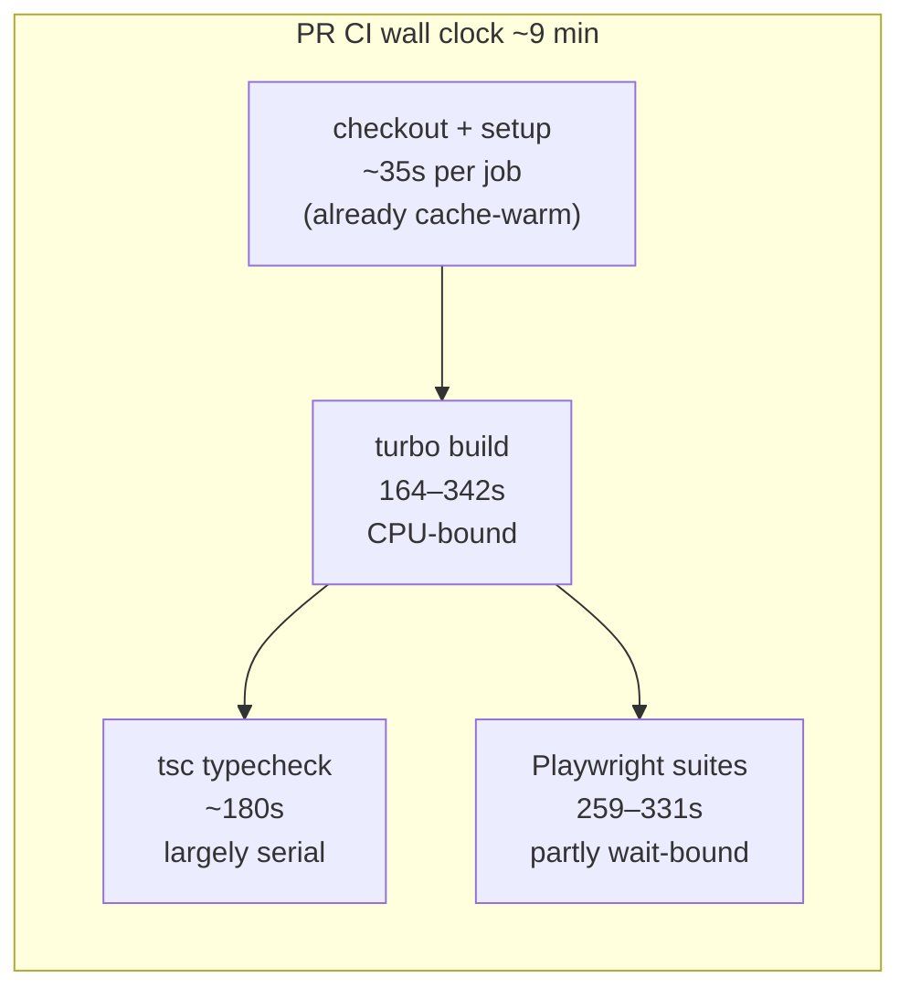
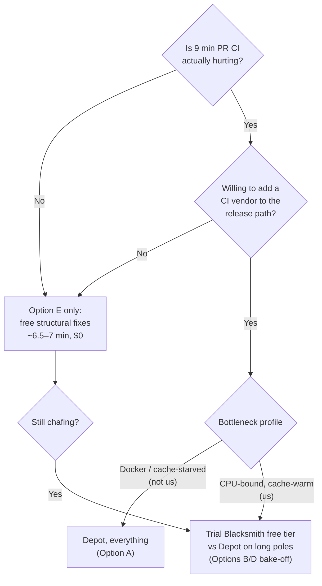

# Depot.dev CI Performance Evaluation

## Problem Statement

Would switching our GitHub Actions workflows to depot.dev managed runners
meaningfully speed up builds and CI? And is there anything else left on the
table performance-wise, given the pipeline has already been through a
dedicated parallelize-and-cache pass (exploration 0193) and a failure-pattern
audit (exploration 0283)?

## Executive Summary

**Expected gain: roughly 25–35% off PR CI wall clock (≈9 min → ≈6–7 min), not
the 2–10x in Depot's marketing.** The headline Depot numbers (PostHog 55x,
grpc 4.4x) come from pipelines that are Docker-heavy or cache-starved. Ours is
neither: exploration 0193 already gave every job warm pnpm/turbo/Playwright/
better-sqlite3 caches, so setup costs only ~35 s per job and **the remaining
time is compute (turbo build + tsc) and wait-bound e2e** — exactly the work
Depot accelerates least. PostHog's own realistic anchor for non-Docker jobs is
**12–13% average savings**; we'd do somewhat better than that by also stepping
up from 4 to 8 vCPUs, landing in the 25–35% band on the two long-pole jobs.

**The cost story is unusual for us: today's bill is $0.** `crs48/xNet` is a
public repo, so GitHub-hosted standard runners are free. Depot would be
~$20–40/month of net-new spend at our volume (~2,500–3,000 job-minutes/month).
That's trivial in absolute terms, but "pay to go from 9 to 6.5 minutes" is a
different proposition than the "half your CI bill" pitch Depot makes to
private-repo teams.

**Recommendation: not now.** Bank the free wins first (split the
`electron-e2e` long pole, fix the perpetually failing scheduled workflows,
turbo-cache `typecheck`). If PR latency still chafes after that, trial a
faster-runner provider on the two long-pole jobs only — and benchmark
Blacksmith (3,000 free min/month, fastest single-thread CPUs) against Depot
before committing, because our bottleneck profile (CPU-bound, cache-warm)
matches Blacksmith's strengths better than Depot's.

## Current State In The Repository

### Workflow inventory

25 workflows in `.github/workflows/`. Runner mix:

| Runner | Jobs |
| --- | --- |
| `ubuntu-latest` | 37 |
| `macos-14` | 2 (electron-release) |
| `macos-latest` | 1 (electron-release) |
| `windows-2022` | 1 (electron-release) |

The repo (`crs48/xNet`) is **public**, so all GitHub-hosted standard runners
are **free** — the current CI bill is $0. Any Depot minute is net-new spend.
Public-repo `ubuntu-latest` runners are the 4-vCPU / 16 GB tier.

### Measured timings (July 2026, real runs)

**CI on a PR** (`.github/workflows/ci.yml`, run 29116660178 — representative
of the 415–537 s range seen across the last 15 runs):

| Job | Duration | Bottleneck character |
| --- | --- | --- |
| `electron-e2e` | 534 s | 164 s turbo build + 259 s Playwright matrix (partly wait-bound) |
| `typecheck` | 389 s | 342 s `turbo run build typecheck` — pure compute |
| `editor-ux` | 331 s | package build + vitest + Playwright smoke |
| `lint` | 112 s | 35 s prettier + 34 s eslint |
| `test (×3 shards)` | 70–88 s each | vitest, `--changed` on PRs |
| `conformance-rust` | 30 s | cargo test, cached |
| `changelog` | 27 s | dependency-free node scripts |

Wall clock ≈ 9 min (`electron-e2e` is the long pole); billable job-minutes
≈ 28 min per PR run. Pushes to main skip the PR-only jobs and land around
5–6.5 min wall.

**Setup is already cheap.** The `.github/actions/setup` composite (checkout +
pnpm + node + `pnpm install` + turbo/better-sqlite3 caches) costs **31–37 s
per job**, of which cache download is a fraction. Exploration 0193 already
added: pnpm store cache, turbo cache with `restore-keys`, a compiled
better-sqlite3 binary cache, Playwright browser caches, cargo cache, and an
Electron binary cache. **Cache download throughput is not our bottleneck** —
compute is. This matters because "10x faster cache" is the centerpiece of
Depot's value proposition.

**Electron Release** (when it actually builds, ~853 s wall):

| Job | Duration |
| --- | --- |
| build-macos (x64) | 495 s |
| build-macos (arm64) | 435 s |
| build-windows | 309 s |
| build-linux (x64/arm64) | 269–277 s |
| build-js | 243 s (serial, gates all platform builds) |

**Other workflows** (recent medians): Visual UI Capture ~350–420 s, Deploy
Site ~390 s, Deploy PR Preview ~330 s, npm Release ~370 s, Hub Image (Docker)
~50–260 s, Soak ~850 s (scheduled), Fallow ~1000 s (weekly by design per
0283; currently failing on report content, not infra — a quality-gate issue,
not a runner issue).

### Monthly volume (last 30 days, wall-clock minutes per workflow)

| Workflow | Runs | Wall minutes |
| --- | --- | --- |
| CI | 50 | 292 |
| Visual UI Capture | 40 | 168 |
| Deploy PR Preview | 36 | 141 |
| Deploy Site | 12 | 78 |
| npm Release | 14 | 52 |
| pages-build-deployment | 66 | 45 |
| Hub Image | 23 | 34 |
| everything else | ~160 | ~95 |

Wall total ≈ 900 min/month; **billable job-minutes ≈ 2,500–3,000/month**
(CI alone is ~28 job-min × 50 runs ≈ 1,400). This is a *small* CI footprint —
an order of magnitude below where per-minute pricing becomes a lever.

### Where the time actually goes



Three distinct bottleneck types:

1. **CPU-bound compile** — `turbo run build typecheck` (342 s), Electron
   builds. Scales with single-core speed and (via turbo) core count.
2. **Wait-bound e2e** — Playwright suites include app startup, `curl` waits,
   network timeouts, animation settling. Faster CPUs shave the render/JS part
   but not the waits.
3. **Serial orchestration** — electron-release's `build-js → platform builds
   → release` chain; CI's long pole being one 534 s job.

## External Research

### What Depot actually is (July 2026)

- **Runners**: single-tenant AWS EC2 — 4th-gen AMD EPYC Genoa (x86) and
  Graviton4 (arm). *Not* bare-metal Ryzen (that's WarpBuild/Blacksmith).
  Drop-in: `runs-on: depot-ubuntu-24.04` with `-4/-8/-16/-32/-64` size
  suffixes. macOS runners are dedicated M2/M4 Macs (8 CPU / 24 GB).
- **Ultra Runners** (Oct 2024): a RAM disk (2–32 GB) baked into all Linux
  runners at no extra cost — the source of the "up to 3x faster" claim
  (benchmarked on BuildKit's Docker-heavy repo).
- **Cache**: Depot intercepts the `actions/cache` API on-runner, backed by S3
  at ~1 GB/s on 12.5 Gbps network — a genuine ~10x over GitHub's cache
  service, with no 10 GB repo cap and no branch scoping. Depot Cache (GA Jan
  2025) also speaks Turborepo/Bazel/Gradle/Go/sccache remote-cache protocols,
  usable from local machines and non-Depot CI (`TURBO_API=https://cache.depot.dev`).
  No pnpm-native protocol — pnpm rides the intercepted actions/cache path.
- **Container builds**: `depot build` with a persistent NVMe layer-cache
  cluster (up to 1 TB/project), native arm builders — this is where the
  2–55x case-study numbers live.
- **Pricing** (verified from depot.dev/pricing): Developer $20/mo (1 user,
  2,000 GHA min, 25 GB cache), Startup $200/mo (20,000 GHA min, 250 GB).
  Overage: Linux 2-core $0.004/min, 4-core $0.008, 8-core $0.016; macOS
  $0.08/min; cache storage $0.20/GB/mo. Billed **per second** (GitHub rounds
  each job up to a minute). Note the "half of GitHub" claim is against
  GitHub's old $0.008 rate; vs the current $0.006 it's 21–45% cheaper — and
  irrelevant to us since our GitHub minutes are free.

### The realistic anchor: PostHog's two numbers

PostHog is Depot's flagship case study and it contains both halves of the
truth: **Docker builds went 193 min → 3.5 min (55x)** — and **plain GitHub
Actions jobs on Depot runners saved 12–13% on average**. The 55x is cache
architecture applied to Docker layer reuse; the 12–13% is what faster
hardware + faster cache does for ordinary jobs that were already reasonably
cached. Our pipeline is almost entirely the second kind (Hub Image, our only
Docker workflow, is 34 wall-min/month).

### Independent benchmark caveat

RunsOn's independent Passmark single-thread benchmark of runner providers
shows Namespace / Blacksmith / WarpBuild at p50 ≈ 4,300–4,530 vs GitHub's
≈ 2,200–2,330 — roughly **2x single-thread** — but **does not include
Depot**. Depot's EPYC Genoa server cores are fast, but its "30% faster
compute" figure comes from Depot/AWS marketing, not independent measurement.
For a CPU-bound pipeline like ours, that gap matters: the fastest
single-thread providers are the ones with desktop-class (Ryzen) silicon.

### Alternatives snapshot

| Provider | Linux 2-core $/min | Distinguishing trait |
| --- | --- | --- |
| GitHub hosted | $0 (public repo) | what we have; 4 vCPU on public repos |
| Depot | $0.004 | 10x cache, per-second billing, best-in-class Docker builds |
| Blacksmith | ~$0.004, **3,000 free min/mo** | bare-metal EPYC, top single-thread CPU, per-test observability |
| Namespace | ~$0.0015 equiv | top of RunsOn CPU benchmark |
| WarpBuild | usage-based | Ryzen 9 7950X3D — fastest raw clocks |
| Ubicloud | from $0.0008 | cheapest managed; premium-only for new signups since mid-2026 |
| RunsOn | €300/yr + AWS bill | self-hosted; best economics at 10x our scale |

## Key Findings

1. **Our caches are already warm, so Depot's main lever is mostly spent.**
   Setup is 31–37 s/job. Even a free, instant cache would cut ~4% of PR wall
   clock. The 0193 work took the exact wins Depot sells to cache-starved
   teams.
2. **The long poles are compute- and wait-bound.** `typecheck` (342 s of
   turbo build + tsc) scales with CPU speed and cores; the Playwright suites
   (259–331 s) are partly irreducible waits. Faster silicon helps the first,
   barely touches the second.
3. **Realistic per-job estimates on `depot-ubuntu-24.04-8` (8 vCPU, faster
   cores):**
   - `typecheck` 389 s → ~250–280 s (turbo parallelism across packages +
     faster cores; tsc critical path limits the ceiling)
   - `electron-e2e` 534 s → ~400–440 s (build shrinks; Playwright matrix
     mostly doesn't)
   - `editor-ux` 331 s → ~240–270 s
   - **PR wall clock ≈ 9 min → ≈ 6–7 min (25–35%)**
4. **Cost flips sign for us.** Private-repo teams switch to Depot to *save*
   money. We'd go from $0 to ~$20–40/mo (Developer plan + modest overage at
   4–8 core rates). Trivial money, but the value must come entirely from the
   2–3 saved minutes per PR.
5. **The Docker and macOS accelerations don't move our needle.** Hub Image is
   34 wall-min/month; Electron Release runs ~6x/month at 15 wall-min total.
   Even a 10x Docker speedup saves ~30 min/month of *machine* time, not human
   time (nobody waits on those workflows).
6. **There are free wins left** (see Options) — the biggest being that the
   534 s `electron-e2e` long pole is two independent suites sharing one job,
   and that turbo does not cache `typecheck` outputs across CI runs the way
   it caches `build` (the `.turbo` cache keyed on SHA with `restore-keys`
   helps builds; a remote turbo cache would make PR typechecks incremental
   against main).
7. **Failures still cost more than slowness** (0283's conclusion holds):
   Fallow has failed 5 consecutive weekly runs (~16 min each) and mobile-e2e
   shows repeated failures. A red scheduled workflow trains everyone to
   ignore red — that's a bigger CI-health issue than runner speed.

## Options And Tradeoffs

### Option A — Switch everything to Depot runners

One-line `runs-on` changes (37 jobs), `depot-ubuntu-24.04-4` or `-8`.

- **Gain**: ~25–35% PR wall clock; per-second billing; unlimited concurrency
  (we never queue anyway at our volume).
- **Cost**: ~$20–40/mo; a new vendor dependency in the release path
  (npm provenance, Electron signing) for a protocol-critical project.
- **Risk**: runner image drift vs `ubuntu-latest` (Depot tracks GitHub images
  "within a week or two"); macOS runners are M-series only (our x64 mac
  Electron build would cross-compile — works with electron-builder, but is a
  change to validate).

### Option B — Depot runners on the two long-pole jobs only

`typecheck` and `electron-e2e` (plus `editor-ux` if it becomes the pole).

- **Gain**: nearly all of Option A's wall-clock win (~2–2.5 min/PR) at
  ~$8–15/mo, because wall clock only follows the long pole.
- **Cost/risk**: same vendor surface, smaller blast radius. Easy rollback.

### Option C — Depot Cache only (no Depot runners)

Point turbo at `TURBO_API=https://cache.depot.dev` from GitHub-hosted
runners; keep `runs-on` untouched.

- **Gain**: makes `turbo run build typecheck` incremental against main's
  artifacts even on cold PR runners — likely 60–120 s off `typecheck` on
  PRs that touch few packages. $20/mo Developer plan covers it.
- **Caveat**: turbo remote cache from GitHub's network is bounded by
  GitHub-runner egress (~100 MB/s), not Depot's 1 GB/s — still plenty for
  `.turbo` artifacts.
- **Alternative flavor**: the same incrementality is achievable for $0 by
  turbo's `--cache-dir` + `actions/cache` keyed per-package-hash, which we
  partially have — but the current `turbo-${{ runner.os }}-${{ github.sha }}`
  key with a bare `restore-keys` prefix restores *some recent* cache, not
  main's freshest; tightening the key scheme is free.

### Option D — Benchmark a CPU-first provider (Blacksmith / Namespace)

Our profile (CPU-bound, cache-warm, tiny Docker) matches what Blacksmith and
Namespace optimize for: ~2x single-thread over GitHub in independent
benchmarks, drop-in `runs-on`, and **Blacksmith's 3,000 free minutes/month
would cover our entire long-pole spend — $0**.

- **Gain**: potentially *more* than Depot on `typecheck` (tsc loves single-
  thread speed), at zero cost.
- **Risk**: smaller vendors; same image-drift and trust considerations.

### Option E — Free structural fixes, no vendor (baseline for comparison)

1. **Split `electron-e2e`** into `sync-matrix` and `electron-smoke` jobs.
   The 259 s Playwright step divides across two parallel jobs; the duplicated
   164 s build is softened by the turbo cache. Estimated new pole: `typecheck`
   at 389 s → **PR wall ≈ 6.5–7 min for $0**, i.e. most of Option A's win.
2. **Tighten the turbo cache key** so PR jobs restore main's freshest
   artifacts (restore-keys currently match any recent run).
3. **Fix Fallow's failing weekly report and mobile-e2e** — reliability, not
   speed, but it's the largest real waste in the Actions tab.
4. (Optional) Cache `typecheck` in turbo (`"typecheck": { "cache": true }`
   with declared inputs) so unchanged packages skip tsc entirely.



## Recommendation

**Don't switch to Depot now. Do Option E this month; hold Options B/D as the
next step if latency still matters.**

The honest answer to "how much faster would Depot make us" is **about 2–3
minutes per PR (25–35%)** — real but modest, because 0193 already harvested
the cache-side wins that produce Depot's dramatic case-study numbers, and
because our repo is public so we'd be introducing spend (however small) and a
vendor dependency into a supply-chain-sensitive release path to buy those
minutes. Meanwhile roughly the same wall-clock improvement is available for
free by splitting the `electron-e2e` job and tightening the turbo cache key.

If, after Option E, faster PR feedback is still wanted: run a one-week
bake-off of `typecheck` + the split e2e jobs on **Blacksmith (free tier)**
vs **Depot ($20 Developer)** and keep whichever wins. Depot becomes clearly
right for us the day one of these flips: the repo goes private (free minutes
vanish), CI volume grows ~10x, or we start shipping serious Docker images
(hub images at every merge, multi-arch) — its container-build cache is
genuinely best-in-class and nothing in Option E replicates it.

## Example Code

What a surgical Depot/Blacksmith trial looks like (Option B/D — the only
change is the label):

```yaml
# .github/workflows/ci.yml
  typecheck:
    runs-on: depot-ubuntu-24.04-8   # was: ubuntu-latest
    # or:   blacksmith-8vcpu-ubuntu-2404
```

Depot Cache for turbo without Depot runners (Option C):

```yaml
      - name: Build & Type check
        run: pnpm turbo run build typecheck
        env:
          TURBO_API: https://cache.depot.dev
          TURBO_TOKEN: ${{ secrets.DEPOT_TOKEN }}
          TURBO_TEAM: ${{ vars.DEPOT_ORG_ID }}
```

The free e2e split (Option E, sketch):

```yaml
  electron-smoke:
    # ...same setup as electron-e2e...
    - run: xvfb-run --auto-servernum pnpm --filter @xnetjs/e2e-tests exec \
        playwright test src/electron-smoke.spec.ts --project=electron --fail-on-flaky-tests

  sync-matrix:
    # ...same setup...
    - run: xvfb-run --auto-servernum pnpm --filter @xnetjs/e2e-tests exec \
        playwright test src/sync-matrix.spec.ts --project=chromium --project=electron --fail-on-flaky-tests
```

## Risks And Open Questions

- **Vendor trust in the release path**: npm provenance (0265's sigstore
  incident) and future Electron signing mean runner provenance matters.
  Single-tenant EC2 (Depot) is a reasonable story; evaluate Blacksmith's
  equivalent before the bake-off.
- **Plan-minute accounting**: whether an 8-core Depot minute draws 4x from
  the included 2,000-minute pool (it's priced 4x in overage) — verify before
  sizing the plan.
- **Required-check names**: `runs-on` changes don't rename checks, but the
  e2e split does — update branch protection when splitting `electron-e2e`.
- **macOS x64 Electron build on M-series Depot Macs**: cross-compilation
  works in electron-builder but needs a validation pass (only relevant under
  Option A; electron-release is not worth migrating on its own).
- **Depot absent from independent CPU benchmarks**: the 25–35% estimate
  leans on EPYC Genoa being meaningfully faster than GitHub's fleet; the
  bake-off exists precisely to replace this estimate with a measurement.
- **Fallow's 5 consecutive weekly failures** are unexplained here — separate
  investigation; it is the single largest recurring waste in the Actions tab.

## Implementation Checklist

Phase 1 — free wins (do regardless of vendor decision):

- [ ] Split `electron-e2e` into `sync-matrix` and `electron-smoke` parallel
      jobs in `.github/workflows/ci.yml`; update required checks.
- [ ] Tighten the turbo cache key in `.github/actions/setup/action.yml` so PR
      runs restore main's freshest cache (e.g. key on
      `turbo-${{ runner.os }}-${{ github.base_ref }}-…` with per-branch
      restore-keys) and measure `typecheck` before/after.
- [ ] Evaluate caching `typecheck` in `turbo.json` (declared inputs, cached
      logs) so unchanged packages skip tsc.
- [ ] Fix the Fallow weekly report failure (5 consecutive red runs).
- [ ] Triage mobile-e2e's repeated failures.
- [ ] Re-measure PR CI wall clock; record the new long pole.

Phase 2 — only if PR latency still matters after Phase 1:

- [ ] Sign up: Blacksmith free tier + Depot Developer ($20).
- [ ] One-week bake-off: run `typecheck` and the two e2e jobs on
      `depot-ubuntu-24.04-8` vs `blacksmith-8vcpu-ubuntu-2404` on a branch;
      collect per-job medians from real PRs.
- [ ] Verify Depot plan-minute accounting for sized runners.
- [ ] Decide: keep winner on long-pole jobs only (Option B/D) or revert.
- [ ] If keeping Depot: consider `TURBO_API` remote cache for the remaining
      GitHub-hosted jobs.

## Validation Checklist

- [ ] PR CI wall clock (p50 over ≥10 PRs) drops from ~9 min to ≤7 min after
      Phase 1, at $0 spend.
- [ ] `typecheck` job p50 measured before/after each change (baseline: 389 s).
- [ ] No new flakes introduced by the e2e split (`--fail-on-flaky-tests`
      stays green for 2 weeks).
- [ ] If Phase 2 runs: bake-off produces per-job medians for GitHub vs Depot
      vs Blacksmith, and the decision cites measured numbers, not vendor
      claims.
- [ ] Fallow and mobile-e2e green on their schedules for 2 consecutive weeks.

## References

- Depot pricing: https://depot.dev/pricing
- Depot GHA runners: https://depot.dev/products/github-actions ·
  https://depot.dev/docs/github-actions/overview ·
  https://depot.dev/docs/github-actions/runner-types
- Depot Cache: https://depot.dev/docs/cache/overview ·
  https://depot.dev/docs/cache/integrations/turbo ·
  https://depot.dev/blog/introducing-depot-cache
- Cache interception design: https://depot.dev/blog/github-actions-cache
- Ultra Runners: https://depot.dev/blog/introducing-github-actions-ultra-runners ·
  https://depot.dev/blog/ultra-runners-for-macos
- Container builds: https://depot.dev/products/container-builds
- PostHog case study (both numbers): https://depot.dev/customers/posthog ·
  https://posthog.com/blog/speeding-up-posthog-builds-with-depot
- AWS case study ("30% faster compute"):
  https://aws.amazon.com/solutions/case-studies/depot-dev/
- GitHub runner pricing:
  https://docs.github.com/en/billing/reference/actions-minute-multipliers
- Independent CPU benchmark (no Depot entry):
  https://runs-on.com/benchmarks/github-actions-cpu-performance/
- Alternatives: https://runs-on.com/pricing/ ·
  https://www.ubicloud.com/use-cases/github-actions ·
  https://www.warpbuild.com/blog/depot-warpbuild-comparison-2025-May ·
  https://latchkey.dev/learn/compare-runners/depot-vs-blacksmith ·
  https://betterstack.com/community/comparisons/github-actions-runner/
- Prior xNet work: exploration 0193 (CI parallelize + cache), exploration
  0283 (CI failure patterns)
