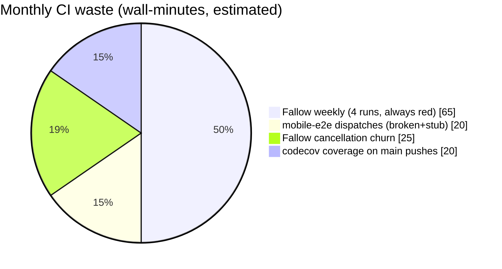
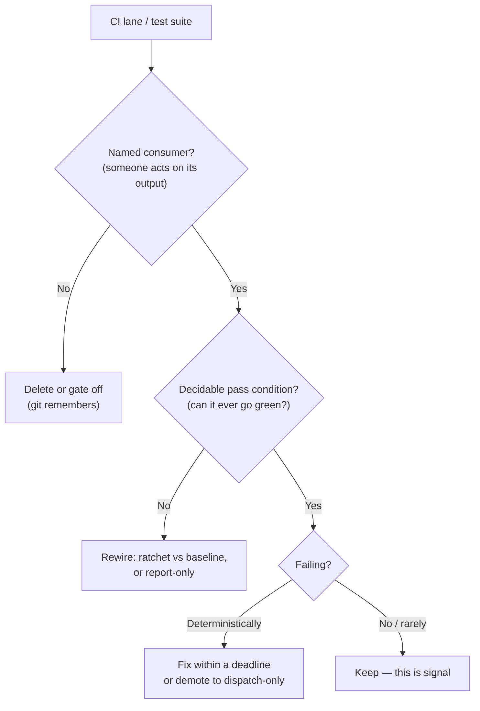

# CI Workflow Necessity And Test Value Audit

## Problem Statement

Exploration 0283 diagnosed *why* workflows fail and how to make them green.
This exploration asks the harder question: **which workflows and tests should
exist at all?** Specifically:

- What do we do about the chronically failing / flaky workflows (Fallow,
  mobile-e2e)? Fix, demote, or delete?
- Do we need Fallow at all?
- Are we over-testing — testing things that aren't meaningful, or running
  slow integration tests that should be unit tests?

## Executive Summary

**Two workflows are pure waste today and should be cut or gutted:**

1. **`mobile-e2e.yml` — delete it.** It is 29/30 red, and the punchline is
   that *even a green run tests nothing*: both platform jobs end in
   `echo "TODO: … run maestro test"` stubs (lines 46/71). It currently fails
   before even reaching the stub (missing `@capacitor/android` before
   `cap add android`). We are paying red-✗ noise for a placeholder. The three
   Maestro flows in `tests/mobile/flows/` stay in the repo; the workflow
   returns when exploration 0238's mobile shell has something real to test.
2. **Fallow's weekly audit — keep the ratchet, drop the audit.** The weekly
   run fails by construction: `fallow audit --fail-on-issues` gates on
   **1,136 standing repo-wide CRAP-score issues** that nobody is going to
   burn down, so every Monday produces a guaranteed red ✗ (5 consecutive so
   far) after ~16 minutes — ~10 of which is a full-suite istanbul coverage
   build that exists only to feed the doomed audit. The one part of Fallow
   with a real consumer and a real invariant is the **dead-code regression
   ratchet** (baseline-diffed, binary, fast, no coverage needed). Keep that;
   make the CRAP audit report-only or delete it.

**On "too much testing": no — and yes.** The unit suite is *not* the
problem: 1,003 test files / ~10.6k cases cost ~4 job-minutes sharded ×3, and
PRs run `--changed` so most PR "test" time is setup, not tests. The flab is
elsewhere:

- **15 of 21 Playwright specs (~3,500 lines, including a 1,559-line
  `web-canvas-ingestion.spec.ts`) are wired to no workflow at all** — pure
  maintenance liability with zero CI signal.
- The full-coverage vitest run inside Fallow (~10 min/week) feeds a gate
  that always fails.
- Coverage is uploaded to codecov on every main push, but CI never enforces
  thresholds (`skipThresholds` when `CI=true`) and the README carries no
  badge — an upload with no consumer.
- ~35 near-identical schema-shape test files and a handful of "policy
  freeze" meta-tests are individually cheap; keep them, but stop counting
  them as behavioral coverage.

**Integration→unit rewrites are worth doing for ~10 files, for flake
resistance more than speed** — the real-timer/real-server tests
(`packages/hub/test/*`, `chunked-storage`, `presence`, `sync-manager`) are
the suite's future flake reservoir, but today they cost seconds in CI, not
minutes. The governing principle for all of it: **every CI lane must have a
named consumer and a decidable pass condition — a check nobody reads, or one
that can't go green, is worse than no check.**

## Current State In The Repository

### Health per workflow (last 30 runs each, window ending 2026-07-10)

| Workflow | Record | Verdict |
| --- | --- | --- |
| `mobile-e2e.yml` | **29 fail / 1 success** | Broken *and* vacuous (TODO stubs) |
| `fallow.yml` | **14 fail / 8 cancelled / 8 success** | Fails by construction (standing debt gate) |
| `hub-release.yml` | 3 fail / 1 success | Low volume; needs a look |
| `electron-release.yml` | 5 fail / 23 success | Known (0283 E: audiotee macOS floor) |
| `ci.yml` | 4 fail / 19 success | Real signal — failures were legit |
| `changelog-check.yml` | 3 fail / 21 success | **Working as intended** (missing fragments) |
| `plugins-registry.yml` | 2 fail / 28 success | Known (0283 F) |
| `cloud-metrics.yml` | 3 skipped / 0 runs | Gated off (`CLOUD_METRICS_ENABLED != 'true'`) — dormant by design until cloud go-live |
| `dco.yml` | 24 success | Fixed since 0283 (auto sign-off works) |
| everything else | green | — |

Flakiness, strictly defined (same commit, pass-on-retry), is **not** our
problem — the red workflows fail *deterministically*. What we have is
**abandonment**: checks whose failure state stopped meaning anything.

### Anatomy of the two chronic failures

**`mobile-e2e.yml`** (now `workflow_dispatch`-only after 0283's phantom-run
fix): the android job runs `npx @capacitor/cli add android` without
`@capacitor/android` installed (and without `pnpm install` in the right
place: "Local package.json exists, but node_modules missing"), so it dies in
setup. If it *didn't* die, lines 46 and 71 are:

```yaml
run: 'echo "TODO: build APK + boot emulator, then run: maestro test tests/mobile/flows"'
```

The three Maestro flows (`tests/mobile/flows/{smoke,database-offline,document-and-deep-link}.yaml`)
have never executed in CI. The workflow validates nothing and has burned 30
runs' worth of setup minutes plus everyone's attention on red ✗s.

**`fallow.yml`** (weekly, per 0283's demotion — that part worked): the 16-min
run decomposes as

| Step | Cost | Consumer |
| --- | --- | --- |
| setup + `turbo run build` | ~3–4 min | (prerequisite) |
| **full vitest w/ istanbul coverage** | **~10 min** | only the CRAP audit below |
| `fallow audit --fail-on-issues` → SARIF | ~95 s | code-scanning alerts nobody triages; **always exits 1** (1,136 issues over threshold, 26,076 functions analyzed) |
| `fallow dead-code --fail-on-regression` vs `docs/reference/fallow-dead-code-regression-baseline.json` | fast | **a real ratchet with a real baseline** — the only decidable gate in the file |

The audit is `--changed-since origin/main`, but a scheduled run *on* main has
an empty diff, so it audits the world and gates the whole repo's standing
debt. Nobody is going to fix 1,136 findings because a Monday cron asked; the
gate cannot go green, so it teaches everyone that red means nothing —
directly corroding `ci.yml`'s 4 *real* failures. (Fallow itself —
`fallow@2.93.0`, docs.fallow.tools, "deterministic codebase intelligence" —
is a fine tool; the problem is the always-red *gate wiring*, not the tool.)

### The test estate (static inventory, no tests executed)

- **1,003 vitest files, ~10,595 cases.** Largest: `packages/data` 97 files /
  1,576 cases, `apps/web` 100 files, `packages/canvas` 85, `packages/editor`
  68, `packages/hub` 61. Zero snapshot tests (good).
- **CI cost is small**: PRs run `vitest --changed` in 3 shards (70–88 s
  each, mostly setup); full suite only on pushes to main. Unit testing is
  ~4 billable minutes — **we are not over-testing in time**.
- **vitest projects** (`vitest.config.ts`, 9 projects): `unit` runs
  `isolate: false` on threads (fast path — good); but 6 of 9 projects use
  `forks` (+`runtime` runs jsdom *inside* forks), and the reliability tier
  allows 60 s per test. Fine for a nightly lane; expensive if ever run
  per-PR.
- **Playwright: 5 of 21 specs run in `ci.yml`** (`editor-ux`,
  `editor-ux-mobile`, `safety-ui`, `sync-matrix`, `electron-smoke`) and 1 in
  nightly soak (`durability.spec.ts`). **The other 15 (~3,500 lines) are
  referenced by no workflow**: `web-canvas-ingestion.spec.ts` (1,559 L),
  `editor-markdown` (508 L), `column-ui` (405 L), `authz-advanced` (365 L),
  `doc-sync` (306 L), `database` (273 L), `authz-validation` (235 L),
  `authz-core` (176 L), `quiet-shell` (161 L), `multitab-sqlite` (129 L),
  `database-undo` (100 L), `mobile-surfaces` (94 L), `pages-crud` (93 L),
  `packaged-smoke` (54 L), `example-with-auth` (34 L).
- **Integration-tests-in-unit-clothing** (real timers / real servers /
  real disk): ~42 files use raw `setTimeout` waits, 38 use
  `vi.useRealTimers()`; the hub suite spins ~25 real WebSocket servers
  (`relay.test.ts` 639 L, `crawl.test.ts` 526 L, `federation.test.ts`
  307 L); `packages/canvas/src/__tests__/chunked-storage.test.ts` (694 L)
  and `presence.test.ts` (404 L) `await sleep()` inside jsdom;
  `packages/sqlite/src/adapter.test.ts` (684 L) hits native better-sqlite3.
- **Duplicated protocol coverage**: LWW/convergence is tested in ≥6 places
  (`core/lww.test.ts` reads the golden vectors; `data/store/lww-conformance`,
  `hub/test/lww-order`, `runtime/conformance.test.ts` (547 L),
  `tests/reliability/lww-convergence.property.test.ts`,
  `views/canvas-view-convergence`). The golden-vector set
  (`conformance/vectors/`, 25 vectors) is the *protocol's* source of truth
  (exploration 0200) but only 3 tests consume it.
- **Meta/policy tests** (lint-as-test): `seed-coverage.test.ts`,
  `authorization-coverage.test.ts`, `exports.test.ts` ×4, parity harnesses.
  Cheap, and they encode real invariants (0192's authz coverage caught real
  gaps) — keep, but they're guards, not behavior tests.
- **codecov**: uploaded on every main push (`ci.yml:143`), thresholds never
  enforced in CI, no README badge found — no visible consumer.

### Where the waste actually is



Against ~900 total wall-minutes/month this is ~15% — but the *attention*
cost dominates the minute cost: two workflows train the team to ignore red.

## External Research

- **The Google/Fowler consensus on non-determinism and abandoned gates**: a
  test (or check) whose failures don't block anything and don't get fixed is
  worse than deletion, because it degrades trust in the whole signal
  (Fowler, "Eradicating Non-Determinism in Tests"; Google Testing Blog,
  "Flaky Tests at Google and How We Mitigate Them"). Google's practice:
  quarantine fast, fix or delete within a deadline — never let a known-red
  check ride along.
- **CRAP score history**: CRAP (Change Risk Anti-Patterns, `cc² × (1 −
  cov)^3 + cc`, Crap4j lineage) was designed as a *review-time heuristic*,
  not a fleet gate; gating a legacy codebase's absolute CRAP count is the
  canonical misuse — the standard remedy is a **ratchet** (fail only on
  regression vs a committed baseline), exactly the mechanism Fallow's
  dead-code check already uses here.
- **Test-suite ROI**: the test-pyramid literature (Fowler; Spotify's
  "Testing of Microservices" honeycomb) argues e2e minutes should be spent
  only on flows whose breakage a unit layer cannot express — cross-process
  sync, persistence across restart, real browser storage. Our `sync-matrix`
  / `electron-smoke` / `durability` lanes are textbook-correct e2e; a
  1,559-line ingestion spec that never runs is textbook rot.
- **Dead test code**: unreferenced test suites rot faster than product code
  (APIs drift under them silently, since nothing executes them). Keeping
  them "for later" without a lane is strictly worse than `git rm` — git
  history preserves them for resurrection.

## Key Findings

1. **We don't have a flakiness problem; we have an abandonment problem.**
   The chronic reds are deterministic: a stub workflow that can't install
   its platform, and a debt gate that mathematically cannot pass.
2. **`mobile-e2e.yml` provides negative value** — it costs minutes and
   attention and would verify nothing even if green.
3. **Fallow's audit gate is mis-wired, not worthless.** The dead-code
   ratchet (baseline diff, decidable, fast) is a keeper; the whole-repo
   CRAP gate + its 10-minute coverage build is a guaranteed-red tax.
4. **Unit test volume is healthy, not excessive** (~4 CI-minutes,
   `--changed` on PRs). "Are we doing too much testing?" — in CI time, no.
5. **The real test flab is 15 orphaned Playwright specs** (~3,500 lines)
   that no workflow runs — including substantial, well-written suites
   (authz ×3, doc-sync, database) that either deserve a nightly lane or
   deletion.
6. **~10 integration-style unit tests are the flake reservoir** (real
   timers, real WS servers, real disk). They're cheap today because they're
   in the full-run-on-main-only path, but they're the files that will start
   costing retries as they age.
7. **Two zero-consumer emissions**: codecov uploads (no badge, no threshold)
   and Fallow SARIF alerts (no triage). Signals without consumers.
8. **`changelog-check`'s failures are the system working** — don't "fix"
   them; they're the gate catching real missing fragments.

## Options And Tradeoffs

### A. mobile-e2e

| Option | Effort | Notes |
| --- | --- | --- |
| **A1. Delete the workflow file** (keep `tests/mobile/flows/`) | tiny | Zero signal lost — it verifies nothing. Restore from git history when 0238's shell has a real APK to test. |
| A2. Fix capacitor setup, keep TODO stubs | small | Green but still vacuous — makes the dashboard *lie better*. Worst option. |
| A3. Fully implement (APK build + emulator + Maestro) | large | The right end-state, but blocked on 0279-style hardware/QA investment; not this month. |

### B. Fallow

| Option | Effort | Notes |
| --- | --- | --- |
| **B1. Keep only the dead-code ratchet**: weekly job = build + `fallow dead-code --fail-on-regression`; delete the audit + coverage steps | small | Cuts ~11 min of the 16; the surviving gate is decidable and has failed honestly before. SARIF/CRAP available on-demand via `workflow_dispatch`. |
| B2. Audit → report-only (`--fail-on-issues` removed, SARIF still uploaded) | tiny | Keeps code-scanning annotations for whoever looks; run stays green. Do this *only if* someone commits to reading the alerts — otherwise it's B1 with extra minutes. |
| B3. Audit with a **ratcheted baseline** (fail only on *new* issues vs a committed count/baseline) | small | The theoretically-right CRAP wiring; fallow supports changed-since scoping — pair with a PR-event run instead of weekly-on-main. Revisits 0283's C1 with teeth. Adds back a PR lane we deliberately removed — only if debt regression actually bites us. |
| B4. Remove Fallow entirely (workflow + dep) | small | Loses the dead-code ratchet, which has real regression-catching history, and the on-demand audit tooling agents use. Not recommended. |

### C. Orphaned Playwright specs (15 files, ~3,500 lines)

| Option | Effort | Notes |
| --- | --- | --- |
| **C1. Triage into three buckets**: (a) high-value flows → nightly lane appended to `soak.yml` (authz-core, doc-sync, multitab-sqlite, database, packaged-smoke); (b) redundant/rotted → delete (`web-canvas-ingestion` 1,559 L, `example-with-auth`, `mobile-surfaces` — superseded or template); (c) borderline → delete too, git remembers | medium | Soak already has the build+browser scaffolding; appending specs is cheap and nightly cadence tolerates their runtime. |
| C2. Wire all 15 into soak | small | Nightly runtime balloons; rotted specs (never executed) will fail on first run and turn soak red — triage first. |
| C3. Leave as-is | free | The status quo: 3,500 lines that silently drift. Rejected. |

### D. Unit-suite value

| Option | Effort | Notes |
| --- | --- | --- |
| **D1. Fake-timer/in-process rewrites for the top offenders** (opportunistic, one file per touch): `chunked-storage`, `presence`, `sync-manager`, hub `relay`/`crawl` (in-process ws pair or injected transport), sqlite adapter (`:memory:`) | medium, amortized | Buys flake-resistance and local-DX speed; CI barely notices. Do on-touch, not as a campaign. |
| **D2. Drop `--coverage` + codecov upload from main pushes** (or add the badge + thresholds back) | tiny | Either give coverage a consumer or stop paying for it. |
| D3. Prune the ~35 schema-shape tests / meta tests | small | Saves ~nothing (they're cheap) and they encode real policy (0192). Keep. Rejected. |
| D4. Consolidate LWW testing around the golden vectors (point `runtime/conformance.test.ts` at `conformance/vectors/` instead of re-implementing; extend the vector set where it's thin) | medium | Better protocol hygiene (0200's intent); modest test-time savings. Nice-to-have, not urgent. |

### The decision rule that generalizes



Applied: mobile-e2e fails Q1 (no consumer — nothing to consume) → delete.
Fallow audit fails Q2 → rewire (B1). Orphaned specs fail Q1 → triage/delete.
`changelog-check`, `ci.yml`, seed/authz meta-tests pass all three → keep.

## Recommendation

**One PR, three moves, this week:**

1. **Delete `mobile-e2e.yml`** (A1). Note in the commit message that
   `tests/mobile/flows/` stays and the workflow returns with a real APK
   build (0238/0279 dependency).
2. **Gut `fallow.yml` to the ratchet** (B1): drop the coverage-generation
   and `fallow audit` steps from the scheduled run; keep
   `dead-code --fail-on-regression` weekly; keep the full audit + SARIF
   reachable via `workflow_dispatch` for on-demand deep dives. Weekly run
   goes ~16 min always-red → ~5 min meaningfully-green.
3. **Drop the codecov upload** from `ci.yml` main pushes (D2) unless someone
   wants to re-adopt it with a badge and enforced thresholds.

**One follow-up PR: spec triage (C1).** Append the keepers
(`authz-core`, `doc-sync`, `database`, `multitab-sqlite`, `packaged-smoke`)
to `soak.yml`'s nightly lane — fixing whatever rot the first run reveals —
and `git rm` the rest, `web-canvas-ingestion.spec.ts` first.

**Standing policy (add to CLAUDE.md):** on-touch integration→unit rewrites
for the D1 list, and the three-question rule above for any new workflow or
advisory lane. Also finish 0283's unimplemented tiers (actionlint hook,
plugins-registry PR flow, electron `Package.swift` floor) — hub-release's
3/4 failure record needs a look under that same umbrella.

Explicitly *not* recommended: removing Fallow wholesale (B4 — the dead-code
ratchet earns its keep), pruning cheap meta/policy tests (D3), or any
"fix" that makes a vacuous check green (A2).

## Example Code

`fallow.yml` after B1 (scheduled path):

```yaml
      # Weekly: only the decidable gate. Full audit + SARIF stays available
      # via workflow_dispatch (below); the CRAP audit needs coverage and a
      # human consumer, so it does not run unattended.
      - name: Run Fallow dead-code regression
        run: |
          pnpm exec fallow dead-code \
            --fail-on-regression \
            --regression-baseline docs/reference/fallow-dead-code-regression-baseline.json \
            --summary --no-cache
```

Soak lane extension (C1 keepers):

```yaml
      - name: Nightly UX/authz regression specs
        run: pnpm --filter @xnetjs/e2e-tests exec playwright test \
          src/authz-core.spec.ts src/doc-sync.spec.ts src/database.spec.ts \
          src/multitab-sqlite.spec.ts src/packaged-smoke.spec.ts \
          --project=chromium --fail-on-flaky-tests
```

An on-touch D1 rewrite shape (hub relay, in-process transport instead of a
real listener):

```ts
// before: server.listen(0) + real ws client + await sleep(50)
// after: wire the relay to a MemoryDuplexPair transport and drive time
vi.useFakeTimers();
const [clientSide, serverSide] = createMemoryTransportPair();
const relay = createRelay({ transport: serverSide });
await vi.advanceTimersByTimeAsync(HEARTBEAT_MS);
```

## Risks And Open Questions

- **Does anything consume the Fallow SARIF alerts?** If code-scanning
  alerts are actually reviewed (by a human or an agent routine), prefer B2
  over B1 for the audit. Evidence so far (5 unremarked red weeks) says no.
- **Orphaned specs may encode undocumented product knowledge** — triage by
  reading, not just by lane status; the authz trio in particular tracks
  0181's cascade semantics. Deletion is reversible via git, silent drift
  isn't.
- **Soak becoming the new junk drawer**: appended specs must pass
  `--fail-on-flaky-tests` from day one, or soak inherits the abandonment
  disease. Budget one fix-forward day for the first nightly run.
- **hub-release 3/4 failures** — uninvestigated here (low volume); could be
  a real release-path defect. Needs its own 30-minute look.
- **Is codecov wanted?** If yes, the fix is a badge + enforced thresholds
  (make the signal consumed), not deletion. User call.
- **Coverage for CRAP on dispatch runs**: the on-demand audit path still
  needs the istanbul build (~10 min) — acceptable for a deliberate,
  attended run.

## Implementation Checklist

PR 1 — cut the dead weight:

- [x] `git rm .github/workflows/mobile-e2e.yml` (commit message points to
      `tests/mobile/flows/` and the 0238 re-entry condition).
- [x] `fallow.yml`: remove the coverage-generation and `fallow audit` +
      SARIF steps from the `schedule` path; keep dead-code regression;
      move audit+SARIF behind `workflow_dispatch` (input flag or separate
      job with `if: github.event_name == 'workflow_dispatch'`).
- [x] `ci.yml`: drop `--coverage` from the push-event vitest run and remove
      the codecov step (or, if keeping: add README badge + re-enable
      thresholds on an unsharded nightly run — pick one).
- [ ] Verify the next scheduled Fallow run is green and ~5 min.

PR 2 — spec triage:

- [ ] Read/triage the 15 orphaned specs into keep/delete buckets
      (starting point: keep `authz-core`, `doc-sync`, `database`,
      `multitab-sqlite`, `packaged-smoke`; delete `web-canvas-ingestion`,
      `example-with-auth`, `mobile-surfaces`, `editor-markdown`,
      `column-ui`, `authz-advanced`, `authz-validation`, `quiet-shell`,
      `database-undo`, `pages-crud` — adjust from reading).
- [ ] Append keepers to `soak.yml` with `--fail-on-flaky-tests`; fix rot
      surfaced by the first nightly run.
- [ ] `git rm` the delete bucket.

Standing / follow-ups:

- [ ] CLAUDE.md: add the "named consumer + decidable pass condition" rule
      for new CI lanes; note the on-touch integration→unit rewrite list
      (`chunked-storage`, `presence`, `sync-manager`, hub `relay`/`crawl`,
      `webrtc-signaling`, sqlite `adapter`).
- [ ] Investigate `hub-release.yml`'s 3/4 failures.
- [ ] Finish 0283 Tier 2/3 items (actionlint hook, plugins-registry PR
      flow, `Package.swift` macOS floor).
- [ ] (Optional, D4) Point `runtime/conformance.test.ts` at
      `conformance/vectors/` and extend the vector set.

## Validation Checklist

- [ ] Fallow scheduled run: green on 2 consecutive Mondays, wall time
      ≤ 6 min (baseline: ~16 min, 5 consecutive reds).
- [ ] Actions tab shows **zero** workflows with a >50% 30-run failure rate
      (baseline: mobile-e2e 97%, fallow 47%).
- [ ] Soak nightly green for 2 weeks *after* absorbing the keeper specs.
- [ ] `tests/e2e/src/` contains only specs referenced by at least one
      workflow.
- [ ] Repo-wide red-run rate (all workflows, 30-day window) ≤ 5% — and a
      red ✗ in the PR view once again means "something you did broke
      something".
- [ ] No loss reported from deleted specs for one month (nothing reopened
      from git history in anger).

## References

- Exploration 0283 `docs/explorations/0283_[_]_CI_FAILURE_PATTERNS_AND_PIPELINE_HEALTH.md`
  (failure diagnosis; partially implemented — fallow weekly demotion, DCO
  auto sign-off landed)
- Exploration 0293 (Depot evaluation — the "free structural fixes first"
  companion), 0272 (reliability lane / soak), 0238+0279 (mobile shell +
  hardware QA blockers), 0200 (golden vectors as protocol source of truth),
  0192 (authz coverage test), 0224 (seed coverage)
- `.github/workflows/{fallow,mobile-e2e,soak,ci,cloud-metrics}.yml`;
  `vitest.config.ts`; `conformance/vectors/`;
  `docs/reference/fallow-dead-code-regression-baseline.json`
- Fallow tool: https://docs.fallow.tools (`fallow@2.93.0`)
- Martin Fowler, "Eradicating Non-Determinism in Tests" —
  https://martinfowler.com/articles/nonDeterminism.html
- Google Testing Blog, "Flaky Tests at Google and How We Mitigate Them" —
  https://testing.googleblog.com/2016/05/flaky-tests-at-google-and-how-we.html
- Alberto Savoia, the CRAP metric (Crap4j) — background for why absolute
  CRAP gates on legacy code are the canonical misuse
- Test pyramid / e2e ROI: https://martinfowler.com/articles/practical-test-pyramid.html
