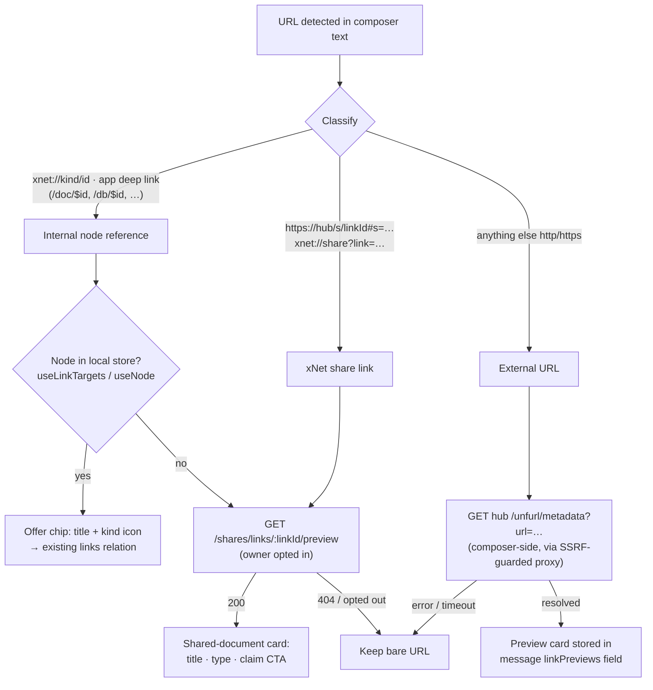
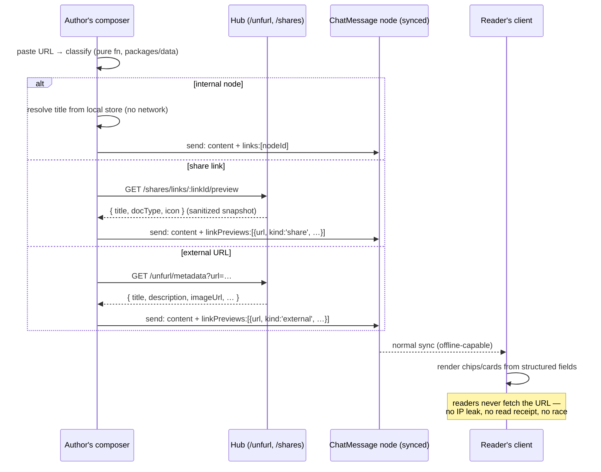
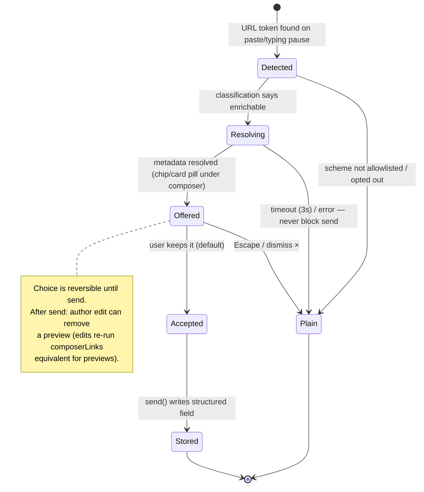

# URL Up-Res: Rich Link Previews In Chat, Comments, And Text Surfaces

Pasting a URL into chat should not leave a bare blue string. A share link to
a page or database should "up-res" into the title of the thing it points to —
and, where it earns its pixels, a preview card. External URLs should get the
same treatment via the metadata pipeline the repo already owns.

## Problem Statement

Exploration 0171 made every text surface _linkify_ — URLs become clickable
anchors at render time. But an anchor is the floor, not the ceiling:

- Paste `https://hub.xnet.fyi/s/xv17-H8BwWy9#s=…` (a share link to a page)
  into a channel and readers see an opaque token string. The interstitial the
  hub serves for that URL is deliberately metadata-free (verified against
  production: `<title>Opening shared document…</title>`, `noindex`,
  `no-referrer`, zero Open Graph tags) — so not even a generic scraper could
  title it. Only a purpose-built path can.
- Paste an internal deep link (`…/app/#/doc/<id>`, `xnet://database/<id>`)
  and the same thing happens — even though the node's title is sitting in the
  local store, one `useLinkTargets()` lookup away.
- Paste a YouTube/GitHub/arbitrary external URL and nothing enriches — even
  though the hub already runs an SSRF-guarded oEmbed/Open Graph resolver
  (`/unfurl/metadata`) and the page editor already has preview-card node
  views for exactly this.

Meanwhile the `@`-mention, `#`-tag, and `[[`-wikilink chips prove the pattern:
composer-declared structure, stored as data, rendered as chips. URLs are the
one reference type that never got the upgrade. This exploration designs the
up-res path for chat, comments, and the other user-authored text surfaces —
including the collaborative-editing constraints (same document open on two
devices) that any async "fetch then decorate" scheme must survive.

## Executive Summary

- **Three URL classes, three resolution strategies.** (1) _Internal deep
  links_ resolve locally against the workspace store — zero network, live
  titles, the Notion "link mention" model. (2) _xNet share links_ need a new
  lightweight hub endpoint (`GET /shares/links/:linkId/preview`) because
  today nothing can title a share link without claiming it. (3) _External
  URLs_ reuse `resolveExternalReferenceMetadata` + the hub `/unfurl` proxy.
- **Previews are composed, not rendered.** Following the Mysk/Bakry taxonomy
  and Signal's architecture, the _composer_ resolves the preview once and
  stores it in the message (`linkPreviews` structured field, mirroring
  `mentions`/`tags`/`links`). Readers never fetch — no per-reader IP leaks,
  no read receipts, no N-clients-race-to-decorate, and previews replicate
  offline like any other node data. This also matches the repo's existing
  doctrine: "structured field, never parsed text"
  (`packages/data/src/schema/schemas/chat-message.ts:12`).
- **The collaborative-editing race is designed out, not patched.** A stored,
  composer-written preview is immutable payload on a signed message node —
  there is nothing for two viewers to fight over. For the _page editor_ (Yjs,
  concurrently editable), the existing `RichLinkExtension` pattern — paste
  inserts a node whose attrs are written in one transaction by the pasting
  peer only — is the rule to keep; render-time hydration by every viewer is
  the anti-pattern that produces two-device clobbering. Smoke tests across
  the `editor` (805), `runtime` (173), and `data-bridge` (210) vitest
  projects are green today; a two-peer paste-race test is added to the
  validation checklist.
- **UX follows the industry consensus:** paste-time choice (keep URL / chip /
  card) in the composer, Escape restores the bare URL, a remove-× on rendered
  cards, ≤3 unfurls per message, and the real destination domain always
  visible on external cards (anti-phishing: attacker-controlled metadata must
  not be able to impersonate a trusted site without the domain giving it
  away).
- **Rollout is four phases**, each independently shippable: internal-link
  chips in chat (zero-fetch, biggest win/cost ratio) → share-link preview
  endpoint + "shared document" card with claim CTA → external unfurl cards in
  chat/comments → convergence of the page editor's rich-link cards onto the
  same metadata service.

## Current State In The Repository

### What renders user-authored text today

| Surface               | Renderer                                                                  | URL handling today                                                                                                    |
| --------------------- | ------------------------------------------------------------------------- | --------------------------------------------------------------------------------------------------------------------- |
| Chat messages         | `apps/web/src/comms/MessageRow.tsx` (`MessageBody`, line 44)              | `<LinkifiedText detectPhones>` — anchor only                                                                          |
| Thread pane           | `apps/web/src/comms/ThreadPane.tsx`                                       | same                                                                                                                  |
| Comments              | `packages/ui/src/composed/comments/CommentBubble.tsx` → `MarkdownContent` | GFM autolink literals — anchor only                                                                                   |
| Table/grid text cells | `packages/views/src/properties/text.tsx`                                  | `LinkifiedText` — anchor only                                                                                         |
| Page documents        | `packages/editor/src/components/RichTextEditor.tsx`                       | TipTap autolink **plus** `RichLinkExtension` / `SmartReferenceExtension` / embed family — the only surface with cards |

### The chip grammar chat already has

`ChatMessageSchema` (`packages/data/src/schema/schemas/chat-message.ts`)
stores `content` (GFM markdown, max 10k) plus structured, composer-declared
fields — the doc comment is explicit: _"Mentions are a structured field …
never parsed text."_

- `mentions: json<MessageMentions>` → `PersonMentionChip`
  (`apps/web/src/components/PersonHovercard.tsx`)
- `tags: relation(multiple)` → `#tag` pills resolved via `useWorkspaceTags`
- `links: relation(multiple)` → `[[Title]]` pills. The composer's `[[` picker
  (`apps/web/src/comms/link-composer.ts`) records title→id bindings; on send
  `composerLinks()` emits only the ids whose `[[Title]]` text survived.
  Renderer: `MessageLinkChips` (`apps/web/src/comms/MessageRow.tsx:90`),
  resolving titles through `useLinkTargets()`
  (`apps/web/src/hooks/useLinkTargets.ts`) — a recency-ordered
  `WikilinkTarget { href, title, kind }` map over Page/Database/Canvas/
  Dashboard/SavedView/Channel schemas. `nodeIdFromHref()`
  (`link-composer.ts:44`) already parses the internal
  `xnet://<kind>/<id>` URI scheme.

**Key observation: pasting an internal URL is just a `[[` pick the user made
in a different app.** The storage format (`links` relation), the chip
renderer, and the title resolver all exist. What's missing is the composer
recognizing a pasted URL as a node reference.

### Metadata infrastructure that already exists

- **Parser/registry** — `packages/data/src/external-references.ts`:
  `parseExternalReferenceUrl`, provider allowlist (youtube, vimeo, spotify,
  twitter, instagram, tiktok, figma, codesandbox, loom, github, + `generic`),
  embed-URL builders.
- **Resolution pipeline** — `packages/data/src/external-reference-metadata.ts`:
  `resolveExternalReferenceMetadata()` → normalized
  `{ title, subtitle, description, imageUrl, providerName, authorName,
source: 'oembed' | 'open-graph', sourceUrl }`.
- **Hub proxy (CORS + SSRF boundary)** — `packages/hub/src/routes/unfurl.ts`:
  `GET /unfurl/metadata?url=…` and `GET /unfurl/image?url=…` (thumbnail proxy
  behind `DEFAULT_UNFURL_IMAGE_HOST_PATTERNS`), both auth-gated, both wrapped
  in `validateExternalUrl` with post-redirect re-validation and size caps.
  Mounted at `packages/hub/src/server.ts:519`. Today its only consumer is
  social-feed enrichment (`apps/web/src/hooks/useSocialFeedEnrichment.ts`).
- **Card renderers in the editor** —
  `packages/editor/src/extensions/rich-link/RichLinkExtension.ts` (block
  preview card for generic pasted URLs; attrs `{url, provider, title,
subtitle, icon}` written at paste time), `SmartReferenceExtension`
  (provider chips), `PageEmbedNodeView` (internal page as titled card).
  Notably `createRichLinkAttrs()` titles cards from **URL parsing only** — it
  never calls the metadata pipeline, so editor cards show hostnames where
  they could show real titles. Phase 4 fixes this.

### Share links: the hole in the map

Share URLs are `https://<hub>/s/<linkId>#s=<secret>` (parser:
`apps/web/src/lib/share-links.ts:50`; deep-link twin
`xnet://share?link=…&hub=…#s=…`). The secret lives in the URL _fragment_ —
by design it never reaches any server. Minting: `POST /shares/links`
(`packages/hub/src/routes/share-links.ts:152`, stores only `secretHash`).
Opening: the interstitial (`packages/hub/src/routes/share-interstitial.ts:111`)
serves static app-launch HTML, then the client claims via
`POST /shares/links/:linkId/claim`.

**There is no endpoint that yields the target's title from a `linkId`.** The
adjacent precedents:

- `GET /public/node/:id` (`packages/hub/src/routes/public.ts:75`) — full node,
  but only when effective `visibility === 'public'`.
- `GET /f/:token` (form inbox, `packages/hub/src/features/form-inbox.ts`) —
  the repo's established pattern for _unauthenticated, high-entropy-token-
  gated, sanitized snapshot_ reads. The share-link preview endpoint should be
  its sibling.

## External Research

### The four generation architectures (Mysk/Bakry 2020)

The canonical taxonomy of who builds a link preview, from research that
audited ~20 messengers ([mysk.blog](https://mysk.blog/2020/10/25/link-previews/)):

| Model                | Who fetches                                         | Examples                        | Verdict for xNet                                                                                      |
| -------------------- | --------------------------------------------------- | ------------------------------- | ----------------------------------------------------------------------------------------------------- |
| No previews          | nobody                                              | Threema, TikTok                 | The status quo; fine but leaves value on the table                                                    |
| **Sender-generated** | composer's device, preview travels with the message | iMessage, WhatsApp, Signal      | **The local-first-correct model** — one fetch, replicates like content, readers never touch the URL   |
| Receiver-generated   | every reader's device                               | (eliminated after the research) | Disqualified: leaks each reader's IP + acts as read receipt, N fetches, race-prone                    |
| Server-generated     | platform servers                                    | Slack, Discord, FB              | The Matrix trap (below); centralizes fetch but leaks URLs into server logs, SSRF surface on the relay |

Findings against server-generation in the wild: LINE forwarded links from
E2E-encrypted chats to preview servers; Facebook/Instagram fetched without
size caps (2.6 GB file → 24.7 GB traffic); LinkedIn/Instagram preview servers
executed fetched JavaScript. Matrix's homeserver `preview_url` API has a
years-long tail of leak bugs (URLs in reverse-proxy logs,
[synapse#11591](https://github.com/matrix-org/synapse/issues/11591); a
malicious homeserver could re-enable previews in E2EE rooms,
[GHSA-f83w-wqhc-cfp4](https://github.com/matrix-org/matrix-react-sdk/security/advisories/GHSA-f83w-wqhc-cfp4)).

Signal's refinement: the sender fetches through a Signal-operated TCP proxy so
the target site never sees the sender's IP either
([signal.org/blog/i-link-therefore-i-am](https://signal.org/blog/i-link-therefore-i-am/)).
xNet's `/unfurl` proxy gives us the same property for free: composer fetches
_through the hub_, target site sees hub egress, readers see nothing.

### UX prior art

- **Slack**: server fetch, async attach-after-post; oEmbed → Twitter/OG →
  meta-description fallback; ≤5 unfurls per message; per-message
  `unfurl_links`/`unfurl_media` opt-outs; app unfurls via `link_shared` →
  `chat.unfurl` with URL-keyed maps
  ([docs.slack.dev](https://docs.slack.dev/messaging/unfurling-links-in-messages/)).
- **Notion**: paste offers **URL / Mention / Preview** — internal URLs become
  live _page mentions_ (entity reference, renders current icon+title,
  creates a backlink; no fetch) while external previews are a separate,
  integration-gated path
  ([notion.com/help/link-previews](https://www.notion.com/help/link-previews)).
  This split — internal = live entity reference, external = fetched snapshot —
  is exactly the architecture xNet's data model wants.
- **Editors**: TipTap v2 `nodePasteRule` (paste → node with attrs, async
  hydration via transaction) and Lexical's `LexicalAutoEmbedPlugin` (paste →
  conversion _menu_) both converge on: store previews as **node attributes**
  (serialize with the doc, replicate in the CRDT, never re-fetch per reader),
  and make the transform a dismissible choice.

### Metadata format consensus

Every ecosystem reduces to the same record — which
`ExternalReferenceResolvedMetadata` already models: fallback chain oEmbed (for
interactive embeds) → Twitter Cards → Open Graph → `<title>`/meta-description.
oEmbed `rich`/`video` HTML means executing third-party markup — click-to-load
inside a sandboxed iframe, or (v1) skip embeds and render static cards only.

### Security notes with direct code implications

- SSRF is _the_ classic unfurler bug (link-preview-js shipped
  [CVE-2022-25876](https://security.snyk.io/vuln/SNYK-JS-LINKPREVIEWJS-2933520),
  a DNS-rebinding bypass). The hub's `guardedFetch` already re-validates
  post-redirect URLs and caps sizes — keep all fetching behind it; never add
  a client-direct fetch path.
- Preview metadata is attacker-controlled: a phishing URL can wear a benign
  card. Cards must always render the real destination domain, and the
  scheme-allowlist (`safeHref`, `packages/ui/src/utils/linkify.ts:40`)
  applies to card hrefs exactly as to anchors.
- Thumbnails only via the existing `/unfurl/image` proxy + host allowlist —
  never hotlink `og:image` from readers' clients (per-reader tracking pixel).

## Key Findings

1. **~80% of the machinery exists.** Detection (`linkifyjs` tokens), scheme
   safety (`safeHref`), metadata resolution (`resolveExternalReferenceMetadata`),
   the SSRF-guarded fetch boundary (`/unfurl`), card node views
   (`RichLinkNodeView`, `PageEmbedNodeView`), the structured-field message
   grammar, and the id→title resolver (`useLinkTargets`) are all shipped.
   What's missing is (a) the composer-side classification/resolution step for
   chat & comments, (b) a share-link preview endpoint, and (c) a shared card
   component outside the editor package.
2. **Internal links are the free win.** Converting a pasted deep link into
   the _existing_ `links` relation reuses the whole chip pipeline — no schema
   change, no fetch, live titles (renames propagate because chips resolve at
   render).
3. **Share links are unfixable without a hub change** — verified live: the
   interstitial exposes nothing, deliberately. The preview must be an
   explicit, owner-consented product feature, not scraping.
4. **The page editor already made the right storage choice** (paste-time node
   attrs, single writer) — its gap is quality (no real metadata fetch), not
   architecture. Chat should copy the storage principle, not bolt previews on
   at render.
5. **The collaborative failure mode the user reports** (same doc open on two
   devices) is exactly what render-time hydration would cause and what
   composer-time storage precludes. Nothing in the current test suites
   reproduces an error (editor/runtime/data-bridge lanes all green as of this
   exploration); a two-peer paste-race regression test is specified below so
   the invariant is enforced, not assumed.

## URL Taxonomy And Resolution Flow



### Compose → store → render (sender-generated, stored previews)



### Preview lifecycle in the composer



## Options And Tradeoffs

### A. Who resolves the preview?

| Option                                                    | Privacy                                           | Latency                                                     | Collab safety                                    | Verdict                                                                                                               |
| --------------------------------------------------------- | ------------------------------------------------- | ----------------------------------------------------------- | ------------------------------------------------ | --------------------------------------------------------------------------------------------------------------------- |
| A1. Reader render-time fetch                              | ✗ every reader pings URL (IP leak, read receipt)  | card pops per reader                                        | ✗ N clients race to write if cached into the doc | **Rejected**                                                                                                          |
| A2. Hub fetch at message ingest                           | URLs parsed server-side; hub must inspect content | good                                                        | ✓                                                | Rejected: hub currently relays content without interpreting message bodies; adds Matrix-style leak surface & coupling |
| **A3. Composer fetch (via hub proxy), stored in message** | ✓ one fetch, author-only, proxied                 | preview may trail the paste by ~1s — acceptable in-composer | ✓ single writer by construction                  | **Recommended**                                                                                                       |

A3 also degrades perfectly offline: no metadata → message sends with a bare
URL, exactly like today. Nothing ever blocks send.

### B. Where is the preview stored?

| Option                                                             | Notes                                                                                                                                        | Verdict                      |
| ------------------------------------------------------------------ | -------------------------------------------------------------------------------------------------------------------------------------------- | ---------------------------- |
| B1. New `linkPreviews` structured field on `ChatMessage`/`Comment` | Mirrors `mentions`; additive schema change (minor bump, `fixed` core versions in lockstep); preview is immutable payload of a signed message | **Recommended**              |
| B2. Sidecar `LinkPreview` nodes + relation                         | Dedup across messages; but adds GC/authz/lifecycle complexity for tiny (<1 KB) payloads                                                      | Later, only if dedup matters |
| B3. Local-only render cache (no storage)                           | Zero schema change, but every device re-fetches → reintroduces A1's problems for offline readers                                             | Rejected                     |

For **internal** links there is nothing to store — the existing `links`
relation _is_ the storage, and titles stay live via `useLinkTargets`.

### C. Share-link preview: what may the endpoint reveal?

The secret-in-fragment invariant must hold: **the preview endpoint
authenticates by `linkId` possession only** (the URL path already exposes
`linkId` to any server that sees the link; the secret stays client-side for
claiming). Because a `linkId` alone would now leak a title where today it
leaks nothing, disclosure must be owner-controlled:

| Option                                                                                                                            | Verdict                                                                                                            |
| --------------------------------------------------------------------------------------------------------------------------------- | ------------------------------------------------------------------------------------------------------------------ |
| C1. Always return title for active links                                                                                          | Rejected — silently widens what a bare linkId reveals                                                              |
| C2. Owner opt-in per link ("Show title in link previews" in ShareDialog), default **on** for new links, off for pre-existing ones | **Recommended** — visible at mint time, matches user expectation ("I'm sharing this so people can see what it is") |
| C3. Require the secret                                                                                                            | Rejected — sends the secret to the server, violating the fragment invariant                                        |

Response is a sanitized snapshot (`{ title, docType, icon }`), written at
mint/rename time by the owner's client (the form-inbox `GET /f/:token`
pattern) — the hub never reads node content to serve it.

### D. Composer UX for the conversion

| Option                                                                                          | Verdict                                                                                                           |
| ----------------------------------------------------------------------------------------------- | ----------------------------------------------------------------------------------------------------------------- |
| D1. Silent auto-conversion                                                                      | Rejected — Slack/Notion both learned users need an out; destructive to intent ("I wanted the raw URL")            |
| D2. Paste-time choice pill (keep URL ⌫ / chip / card), Notion/Lexical style, default = enriched | **Recommended**; Escape restores bare URL; ≤3 previews per message; per-card remove-× after send (author only)    |
| D3. Up-res at render only for old messages                                                      | Internal links only (zero-fetch, safe); external URLs in historical messages stay plain — no retroactive fetching |

## Collaborative Editing Considerations

The reported symptom — issues when the same document is open on two devices —
maps to a known class of bugs for async link enrichment, and the architecture
above is chosen specifically to preclude it:

1. **Chat/comments: no shared mutable state.** A preview is written once by
   the composer into the message node before/at send. Viewers render; they
   never write. Two devices viewing the same channel cannot conflict over
   previews _by construction_.
2. **Page editor (Yjs): single-writer hydration.** `RichLinkExtension`
   already inserts the card node with attrs in the paste transaction on the
   pasting peer. The rule to enforce (and test): _only the peer that performed
   the paste may later update that node's attrs_ (loading → resolved), keyed
   by a node-local id. Any render-time "fill in missing attrs" effect run by
   viewers would fire on both devices and clobber concurrently — this is the
   anti-pattern to lint for in review.
3. **Idempotent upgrade.** If both devices somehow paste the same URL
   concurrently (genuinely two intents), two cards is the _correct_ outcome —
   no dedup magic across peers.
4. **Smoke-test status (run for this exploration):** `pnpm vitest run
--project editor` (805 tests), `--project runtime` (173), `--project
data-bridge` (210) — all green in this worktree. No existing test covers
   a two-peer paste + concurrent-view race; one is specified below. If the
   live two-device errors from `hub.xnet.fyi/s/xv17-H8BwWy9` produce console
   output or a stack trace, that becomes a targeted repro case — the suites
   alone did not surface it.

## Recommendation

Adopt **sender-generated, structured-field previews** with the Notion-style
internal/external split, in four independently shippable phases:

1. **Phase 1 — Internal link up-res in chat (zero-fetch).** Composer detects
   pasted deep links / `xnet://` URIs, resolves locally, offers the chip,
   stores via the existing `links` relation. Also render-time up-res of
   internal URLs in _historical_ messages (safe: local lookup only).
2. **Phase 2 — Share-link previews.** Owner-published sanitized snapshot on
   the hub (`GET /shares/links/:linkId/preview`, opt-in toggle in
   ShareDialog); "shared document" card with claim CTA in chat.
3. **Phase 3 — External unfurl cards in chat + comments.** Composer-side
   resolution through `/unfurl/metadata`, new `linkPreviews` json field on
   `ChatMessage` and `Comment`, shared `<LinkPreviewCard>` in `packages/ui`
   (sub-barrel: `components/index.ts` area export per 0276 policy).
4. **Phase 4 — Editor convergence.** `RichLinkExtension` upgrades its cards
   with real metadata via the same resolver (single writer, paste peer only);
   `SmartReferenceExtension`/`RichLink` and chat cards share the normalized
   `LinkPreview` type from `@xnetjs/data`.

## Example Code

### Classification (pure, in `@xnetjs/data` or `apps/web/src/lib`)

```ts
export type UrlClass =
  | { kind: 'internal'; nodeKind: string; nodeId: string }
  | { kind: 'share'; linkId: string; hubUrl: string }
  | { kind: 'external'; url: string }

export function classifyUrl(
  raw: string,
  env: { hubHosts: string[]; appHosts: string[] }
): UrlClass {
  const xnetRef = raw.match(/^xnet:\/\/([a-z]+)\/(.+)$/)
  if (xnetRef) return { kind: 'internal', nodeKind: xnetRef[1], nodeId: xnetRef[2] }

  const share = parseShareUrl(raw) // apps/web/src/lib/share-links.ts — already exists
  if (share) return { kind: 'share', linkId: share.linkId, hubUrl: share.hubUrl }

  const deep = parseAppDeepLink(raw, env.appHosts) // new: '…/app/#/doc/<id>' → { kind:'page', id }
  if (deep) return { kind: 'internal', nodeKind: deep.kind, nodeId: deep.id }

  return { kind: 'external', url: raw }
}
```

### Additive schema change (Phase 3 — minor bump, lockstep core)

```ts
// packages/data/src/schema/schemas/chat-message.ts (and comment.ts)
/** Composer-resolved URL previews (0294). Never parsed from content by readers. */
linkPreviews: json<MessageLinkPreview[]>({}),

// packages/data/src/schema/schemas/link-preview.ts (shared shape)
export interface MessageLinkPreview {
  url: string                     // exact token in content — the render key
  kind: 'share' | 'external'
  title: string
  description?: string
  imageUrl?: string               // rendered only via hub /unfurl/image proxy
  providerName?: string
  domain: string                  // always displayed — anti-phishing
  resolvedAt: number
}
```

### Composer hook sketch (Phase 3)

```ts
// apps/web/src/comms/useComposerPreviews.ts
// Debounced over findLinkTokens(text); resolution never blocks send.
const preview = await fetchWithTimeout(
  `${hubHttpUrl}/unfurl/metadata?url=${encodeURIComponent(token.href)}`,
  { timeoutMs: 3000 }
)
// → offered pill under the textarea; Escape or × discards; send() attaches
//   accepted previews (capped at 3) alongside mentions/tags/links.
```

## Risks And Open Questions

- **Share-link preview disclosure.** Opt-in default for new links needs
  product sign-off; also decide whether revoking a link should tombstone its
  preview snapshot (recommended: yes, 404 after revoke — but previews already
  stored in messages persist, as they do in every messenger).
- **Snapshot staleness.** Owner-published share titles go stale on rename
  until the owner's client re-publishes (mint-time + rename-hook). Acceptable
  for v1; live titles only exist for in-workspace readers (Phase 1 path).
- **Comment schema churn.** `Comment` and `ChatMessage` both gain
  `linkPreviews`; both are in the lockstep `fixed` core → one coordinated
  minor. Check `seed-coverage.test.ts` impact if a new `LinkPreview` schema
  (B2) is ever introduced — v1 (json field) has no seed implications.
- **Unresolved two-device bug.** The reported collab errors on the shared
  document are not yet reproduced (suites green; no error text captured).
  Risk: the symptom is unrelated to link enrichment (e.g. awareness/presence
  or claim-flow double-open). Needs console output or a repro recipe from the
  afflicted document — tracked in validation.
- **Historical-message up-res for external URLs** is deliberately excluded
  (would require someone to fetch — every option reintroduces A1/A2). Confirm
  we're at peace with old messages staying plain.
- **oEmbed interactive embeds** (YouTube player in chat) are out of scope for
  v1 — static cards only; embeds remain the editor's `EmbedExtension` domain.

## Implementation Checklist

### Phase 1 — internal link chips (chat)

- [x] `classifyUrl` + `parseAppDeepLink` pure helpers with tests (hash-router
      and path forms; `xnet://` URIs; share URLs delegated to `parseShareUrl`)
- [x] Composer: on paste/token-commit of an internal URL resolvable via
      `useLinkTargets`, offer conversion pill; accept → record in the
      existing picked-links map so `composerLinks()` emits it
- [x] `MessageBody`: render-time substitution of internal-URL tokens whose id
      resolves locally → inline chip (same visual as `MessageLinkChips`),
      leaving unresolvable ones as anchors
- [x] Same treatment in `ThreadPane` and `CommentBubble`
- [x] Unit tests: composer conversion, render substitution, unresolvable
      passthrough

### Phase 2 — share-link previews

- [x] Hub: `share_link_previews` storage + `GET /shares/links/:linkId/preview`
      (linkId-gated, no auth, no secret; 404 when absent/opted-out/revoked)
- [x] Owner client publishes `{ title, docType, icon }` at mint; re-publish on
      rename; delete on revoke
- [x] ShareDialog: "Show title in link previews" toggle (default on, new links)
- [x] Chat/comments: shared-document card (title, type icon, domain, claim CTA
      → existing `/share` claim flow)
- [x] Hub tests: gating, revoke-404, sanitization (no content leakage)

### Phase 3 — external unfurl cards

- [ ] `MessageLinkPreview` type in `@xnetjs/data`; additive `linkPreviews`
      field on `ChatMessageSchema` + `CommentSchema`; changeset (minor,
      lockstep core) via `/changeset`
- [ ] `useComposerPreviews` hook: debounce, 3s timeout, ≤3 previews, never
      blocks send; Escape/× dismissal
- [ ] `<LinkPreviewCard>` in `packages/ui` (sub-barrel export per 0276);
      always shows `domain`; image via `/unfurl/image` proxy only; `safeHref`
      on card href
- [ ] Author-only remove-× on rendered cards (message edit drops the entry)
- [ ] Consider widening `/unfurl` beyond social providers: generic OG fetch is
      already supported by `resolveExternalReferenceMetadata` — verify hub
      route imposes no provider restriction for metadata (it doesn't; image
      proxy allowlist may need favicon strategy instead of og:image for
      generic domains)

### Phase 4 — editor convergence + collab hardening

- [ ] `RichLinkExtension`: after paste-insert, pasting peer resolves metadata
      via `/unfurl/metadata` and updates node attrs in one follow-up
      transaction; viewers never write attrs
- [ ] Two-peer regression test (editor or data-bridge lane): peer A pastes,
      peer B has doc open; assert single card, converged attrs, no duplicate
      hydration writes
- [ ] Unify `RichLinkAttrs`/`SmartReference` card rendering on the shared
      `LinkPreview` shape

## Validation Checklist

- [ ] Paste an in-workspace page deep link into a channel → chip with live
      title; rename the page → chip updates on next render
- [ ] Paste `https://hub.xnet.fyi/s/<linkId>#s=<secret>` → titled
      shared-document card; verify (network tab) the fragment/secret is never
      sent; revoke the link → card degrades to bare URL for new renders of
      new messages / preview 404s
- [ ] Paste a YouTube URL and a plain blog URL → cards with title/domain;
      readers' clients make zero requests to the target domains (network tab
      on a second device)
- [ ] Offline compose with URL → message sends plain, no error
- [ ] Escape after paste keeps the bare URL; × after send removes the card
- [ ] Two devices, same channel + same page document open: paste on device A
      while B watches → no console errors, no duplicate cards, attrs converge
      (also the repro attempt for the reported collab issue — capture console
      on both devices)
- [ ] `pnpm vitest run --project editor --project runtime --project
  data-bridge` green; new two-peer race test green
- [ ] Message with 5 URLs renders ≤3 cards + plain anchors for the rest

## References

- Prior explorations: `0171_[x]_AUTOMATIC_LINK_ENRICHMENT.md` (linkify
  foundation), `0169_[x]_SHARE_VIA_URL_AND_ACCESS_CONTROL.md` (share links),
  `0170` ([[ link picker), `0198_[x]_POLISHED_CHAT_AND_CHANNELS_UI.md`
  (MessageRow grammar), `0179` (public nodes), `0278` (form-inbox token
  pattern), `0276` (barrel policy)
- Mysk & Bakry, _Link Previews: How a Simple Feature Can Have Privacy and
  Security Risks_ — https://mysk.blog/2020/10/25/link-previews/
- Signal, _I link therefore I am_ — https://signal.org/blog/i-link-therefore-i-am/
- Slack unfurling — https://docs.slack.dev/messaging/unfurling-links-in-messages/
  and https://medium.com/slack-developer-blog/everything-you-ever-wanted-to-know-about-unfurling-but-were-afraid-to-ask-or-how-to-make-your-e64b4bb9254
- Notion link previews / mentions — https://www.notion.com/help/link-previews,
  https://www.notion.com/help/create-links-and-backlinks
- Open Graph — https://ogp.me/ · oEmbed — https://oembed.com/
- OWASP SSRF Prevention Cheat Sheet —
  https://cheatsheetseries.owasp.org/cheatsheets/Server_Side_Request_Forgery_Prevention_Cheat_Sheet.html
- CVE-2022-25876 (link-preview-js SSRF) —
  https://security.snyk.io/vuln/SNYK-JS-LINKPREVIEWJS-2933520
- Matrix URL-preview privacy tail —
  https://github.com/matrix-org/synapse/issues/11591,
  https://github.com/matrix-org/matrix-react-sdk/security/advisories/GHSA-f83w-wqhc-cfp4
- Signal-adjacent editor patterns: TipTap paste rules —
  https://tiptap.dev/docs/editor/api/paste-rules · Lexical AutoEmbed —
  https://lexical.dev/docs/react/plugins
