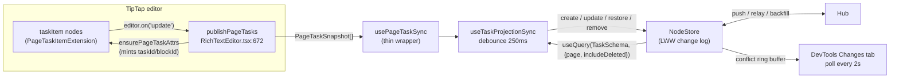
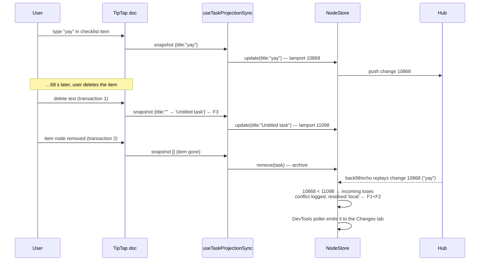
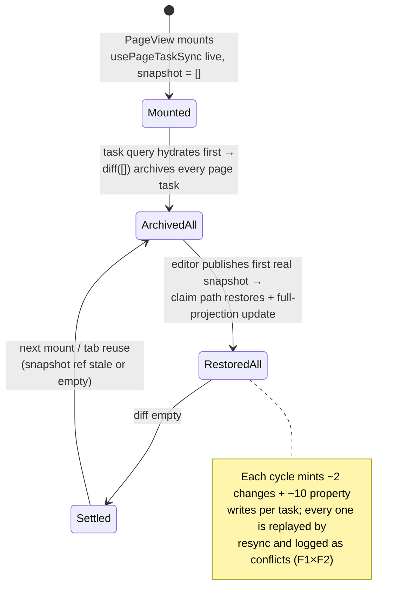

# Checklist → Task Projection Churn And The DevTools Conflict Flood

## Problem Statement

Adding checklist items to a page, checking them off, and then deleting them
leaves the DevTools **Changes** tab flooding with `store:conflict` events.
The user-visible symptoms:

1. Two checklist items were created, checked off, then deleted.
2. The Changes tab now fills with conflicts — and the rate *accelerates*
   with every further interaction with checklist items ("recursive broken
   changes").
3. The checklist → Task extraction "fails to update sometimes."

A captured conflict:

```json
{
  "type": "store:conflict",
  "conflict": {
    "nodeId": "task_ecdd726b-6e75-4a2f-8498-4a2b6429864b",
    "key": "title",
    "localValue": "Untitled task",
    "localTimestamp": { "lamport": 11098, "author": "did:key:z6Mkt…Q17Y", "wallTime": 1783715042106 },
    "remoteValue": "yay",
    "remoteTimestamp": { "lamport": 10868, "author": "did:key:z6Mkt…Q17Y", "wallTime": 1783714974276 },
    "resolved": "local"
  }
}
```

Decoding it tells most of the story:

- **Same author DID on both sides** — this is not a two-user conflict. It is
  this device (or another surface signed in as the same identity) fighting
  itself.
- **`localValue: "Untitled task"` is *newer* (lamport 11098) than the real
  title `"yay"` (lamport 10868)** — something locally overwrote the user's
  title with the placeholder *after* the user typed it. The wall-clock gap is
  ~68 s: exactly the "typed the item, then later deleted it" window.
- **The conflict was recorded ~9.5 s after the local write** (event wallTime
  1783715051635) — an *old* change (`"yay"`, 68 s stale) arrived through the
  remote-apply path long after the fact. That is a replay/echo of the
  device's own history, not a live concurrent edit.

## Executive Summary

There is no single recursive bug — there are **four compounding defects**
that together produce the flood, and one of them (§F3) is real data loss:

| # | Defect | Where |
| - | ------ | ----- |
| F1 | The store records a "conflict" on **every** property apply that has any prior timestamp — routine sequential updates, idempotent replays, and echoes of the device's own changes all get logged. Ties (identical stamps, the self-echo case) are *guaranteed* to log `resolved: 'local'`. | `packages/data/src/store/store.ts` (`applyPropertyChangeWithLWW`) |
| F2 | `applyRemoteChange` has **no already-applied short-circuit** (no change-hash dedupe before re-materializing). Every hub redelivery / resync backfill of the device's own history re-applies every change and re-logs F1 conflicts. The in-memory adapter even appends duplicates to the per-node change log. | `store.ts:1569`, `memory-adapter.ts:69`, `node-store-sync-provider.ts:444` |
| F3 | The page→task reconciler faithfully persists **transient editor states**. Deleting a checklist item usually empties its text in one transaction and removes the node in another; the debounced snapshot in between carries `title: 'Untitled task'` (the extraction fallback), which the reconciler writes over the real title before archiving the task. | `packages/editor/src/extensions/page-tasks/index.ts:155-161`, `packages/react/src/hooks/useTaskProjectionSync.ts:301` |
| F4 | The reconciler effect is **live before the editor has ever published a snapshot** (`taskSnapshotsRef` starts `[]`), and the snapshot ref is never reset when `hostId` changes. If the task query hydrates before the editor's first publish, the empty snapshot **archives every task on the page**; the first real snapshot then restores them all via the claim path, which rewrites the *full* projection (~10 properties per task). | `useTaskProjectionSync.ts:191,206-438`, `RichTextEditor.tsx:672-692` |

The "acceleration" the user perceives is F1 × F2 × (F3 + F4): every churn
cycle mints more changes; every resync replays them; every replayed property
apply logs another conflict; and the DevTools poller dumps up to 100
conflicts into the timeline every 2 s (`packages/devtools/src/instrumentation/store.ts:89-106`,
`CONFLICT_POLL_MS: 2_000`, store cap `MAX_CONFLICTS = 200`).

**Recommended fix (summary):** make the store's conflict log mean "actual
concurrent divergence" (F1), short-circuit already-applied changes by hash
(F2), and harden the reconciler with three cheap gates — no writes before
the first editor snapshot, snapshot reset on host change, and a
placeholder-title write guard (F3/F4). Details and code below.

## Current State In The Repository

### The projection pipeline



Key files:

- `packages/editor/src/extensions/page-tasks/index.ts` — extraction.
  `extractTaskBody` falls back to `'Untitled task'` when an item has no text
  (line 155-161). `ensurePageTaskAttrs` mints `taskId`/`blockId` attrs via
  `generateId` and dispatches a doc transaction when missing.
- `packages/editor/src/components/RichTextEditor.tsx:672-692` — publishes a
  snapshot on **every** editor `update` (local typing, remote Y.Doc updates,
  and the attr-fix transactions above), deduped only by a JSON signature.
- `packages/react/src/hooks/useTaskProjectionSync.ts` — the reconciler.
  Diff-based updates for known tasks, claim-or-create (`restore` then full
  `update`) for unknown ids, archive for tasks missing from the snapshot.
  Effect deps include `existingTasks` (the live query), so every store write
  re-runs the diff against `taskSnapshotsRef.current`.
- `apps/web/src/components/PageView.tsx:155,511` and
  `packages/editor/src/components/CanvasInlinePageSurface.tsx:90,205` — two
  distinct surfaces each mount their own reconciler for a page (a page open
  as a tab *and* embedded on a canvas runs two writers).
- `docs/specs/PAGE_TASK_RECONCILIATION.md` — the spec. Invariant 5 says
  "Reconciliation is idempotent: replaying the same snapshot produces no
  writes" — true, but nothing guarantees the *snapshot itself* is a settled
  state (F3) or that a snapshot exists at all before reconciling (F4).

### The store side

- `packages/data/src/store/store.ts:2196-2237` (`applyPropertyChangeWithLWW`)
  — applies one property with LWW, then:

  ```ts
  // Track a conflict whenever an existing timestamp had to be compared.
  if (existingTs) {
    this.conflicts.push({ … resolved: incomingWins ? 'remote' : 'local' })
  }
  ```

  Every second-and-later write to any property is logged as a "conflict",
  local or remote, divergent or identical.
- `packages/core/src/lww.ts:37` — `lwwWins` returns `false` on an exact tie.
  A replayed own change carries the identical stamp, so it *always* loses
  and *always* logs `resolved: 'local'`.
- `store.ts:1569` (`applyRemoteChange`) — verifies hash + signature, then
  applies unconditionally. No "have I already applied change `hash`?" check.
- `packages/data/src/store/sqlite-adapter.ts:541` — `INSERT OR IGNORE` keeps
  the persisted log deduped, but materialization/conflict-logging already
  happened. `packages/data/src/store/memory-adapter.ts:69` doesn't dedupe at
  all: the per-node array grows with every replay.
- `packages/runtime/src/sync/node-store-sync-provider.ts:444` — relayed and
  backfilled changes are applied with no author/self filter (correct for a
  CRDT — state application is idempotent — but it means the conflict log
  must tolerate replays, which today it does not).

### How the captured conflict happened (reconstructed)



### The archive/restore churn cycle (F4)



This race is timing-dependent (250 ms debounce vs. TipTap init + Y.Doc
hydration), which matches "it fails to update *sometimes*" — and cold opens
(exploration 0249's stall) widen the window dramatically.

A second F4 hazard: `taskSnapshotsRef` is module-state per hook instance and
is **not cleared when `hostId` changes**. If a component instance is reused
across page navigation (preview-tab reuse, 0288), there is a debounce-wide
window where the *previous* page's snapshot is reconciled against the *new*
page's task query — the claim path would rewrite `page:` on the old page's
tasks, and the old page's still-mounted reconciler would claim them back:
a genuine two-writer ping-pong.

## External Research

- CRDT literature is unambiguous that **apply must be idempotent under
  redelivery** — "applying a CRDT operation that has already been applied
  will not change the state" is the property that makes echo suppression
  unnecessary *for state* ([CRDT survey — algorithmic techniques](https://mattweidner.com/2023/09/26/crdt-survey-3.html),
  [CRDTs for Mortals notes](https://imfeld.dev/writing/crdts_for_mortals),
  [Third Bit CRDT chapter](https://third-bit.com/dsdx/crdt/)). xNet's state
  layer satisfies this; the *conflict telemetry* layer does not — it has
  side effects (log entries) on redelivery, which is exactly the class of
  bug idempotence is meant to prevent.
- Commercial two-way sync engines (Notion↔Linear bridges) converge on the
  same three defenses we're missing at the projection layer: compare against
  a **settled** normalized model before writing, suppress writes that would
  only restate what the other side already knows, and treat "conflict" as a
  reportable state distinct from routine reconciliation
  ([Unito two-way sync](https://unito.io/integrations/linear-notion/),
  [building a Notion→Linear engine](https://dev.to/zacharysturman/automating-linear-from-notion-2cha)).
- Remove-wins/tombstone designs ([Remove-Win framework](https://arxiv.org/pdf/1905.01403))
  are the standard answer when delete/re-add churn fights LWW; our
  archive-tombstone model already follows this — the problem is upstream
  (we generate the churn ourselves).

## Key Findings

1. **"Conflict" is misnamed in the store.** `applyPropertyChangeWithLWW`
   logs every compared apply. A single ordinary edit to an existing property
   logs `resolved: 'remote'`; every replay of own history logs
   `resolved: 'local'`. The Changes tab therefore reports normal operation
   as conflict, and the volume scales with (writes × redeliveries).
2. **Self-replays are structurally guaranteed to log.** Tie stamps lose
   under `lwwWins` (correct), and `existingTs` always exists for a replay
   (by definition), so *every* redelivered own change logs one conflict per
   property. A claim-path full-projection update touches ~10 properties —
   one deleted-then-restored two-item checklist can seed dozens of conflict
   entries per resync.
3. **The user's title was really clobbered.** `'Untitled task'` at lamport
   11098 over `'yay'` is not display fallback — the reconciler persisted the
   extraction fallback during the delete gesture. Any surface rendering that
   task between the clobber and the archive shows "Untitled task". This is
   the one finding that is data loss, not noise.
4. **Reconciliation can run with no snapshot.** The hook reconciles
   `taskSnapshotsRef.current = []` against a hydrated query if the editor
   hasn't published yet — archive-all → restore-all churn on unlucky mounts.
   The spec's field-authority table says the editor doc is authoritative for
   hosted tasks, but the code treats "no snapshot yet" as "the doc says
   empty".
5. **Two reconcilers can be live for one page** (page tab + canvas-inline
   embed of the same page; or web + electron under the same DID). Same-DID
   fights are invisible in the conflict log's author field.
6. **The DevTools pipeline amplifies visually.** Poll-every-2s × up to 100
   entries per drain, with no grouping — a few hundred replay conflicts
   render as a wall of red.

## Options And Tradeoffs

### F1 — what should the store call a conflict?

| Option | Change | Pros | Cons |
| ------ | ------ | ---- | ---- |
| A1. Log only when the incoming write **loses** (`resolved: 'local'`) *and* the stamps differ | 3-line predicate | Kills the ordinary-update noise (`resolved:'remote'` entries) and the tie/self-replay noise | Still logs stale replays of own history (the captured case) |
| A2. Log only **divergent concurrency**: values differ *and* authors differ, or same author but neither stamp dominates the other's known history | Predicate + value equality check | Matches user intuition of "conflict"; replays of own superseded writes are silent | Slightly weaker: a genuine lost-update by the same author on two devices is hidden — but same-DID multi-device lost updates *are* interesting |
| A3 (recommended). **A1 + suppress identical stamps + suppress same-author-older-value** (an older own change losing to a newer own change is causal history, not conflict) | ~10 lines | Every case in this incident goes silent; true cross-author conflicts and same-author cross-device races still surface | Needs a golden-vector test so hub/adapters don't drift |

### F2 — replay short-circuit

| Option | Change | Pros | Cons |
| ------ | ------ | ---- | ---- |
| B1 (recommended). `applyRemoteChange` early-returns if `storage.hasChange(change.hash)` before materializing | New adapter method (`SELECT 1 FROM changes WHERE hash=?`; memory: `changesByHash.has`) | Removes replay conflicts *and* redundant materialize/persist/emit work; fixes memory-adapter log duplication as a side effect | One extra point-read per remote change (indexed PK; negligible vs. current re-materialization) |
| B2. Filter self-authored changes in the sync provider | Author check | Cheap | Wrong layer: legitimately needed when restoring own history onto a fresh device; hash dedupe subsumes it |

### F3/F4 — reconciler hardening

| Option | Change | Pros | Cons |
| ------ | ------ | ---- | ---- |
| C1 (recommended). **First-snapshot gate**: no reconciliation (especially no archives) until `handleTasksChange` has been called at least once for the current `hostId`; reset the gate and `taskSnapshotsRef` when `hostId` changes | ~8 lines in the hook | Eliminates mount-race archive-all and cross-page stale-snapshot claims | An intentionally-emptied page still archives fine — the editor *does* publish `[]` after a real deletion |
| C2 (recommended). **Placeholder-title guard**: never overwrite a non-empty existing `title` with the `'Untitled task'` fallback (skip the title key in the diff; other fields still update) | 2 lines | Directly prevents the observed data loss; the fallback remains for genuinely new empty items | A user who truly blanks a title keeps the old one until they type — acceptable (Linear/Notion behave this way) |
| C3. Make deletion atomic in the editor instead (suppress snapshots between the empty-text and node-removal transactions) | ProseMirror plugin work | Fixes the transient at the source | Fragile across gesture types (backspace, selection delete, cut, drag); C2 achieves the invariant cheaply |
| C4. Single-writer election per page (Web Locks, as 0263 did for workers) so page tab + canvas embed can't fight | Larger | Removes the two-writer class entirely | Bigger surface; defer until C1/C2 prove insufficient |
| C5. Claim path writes a diff instead of the full projection | Moderate | Fewer property writes → less replay surface | Claim must still force `page`/`source`; keep full write for those, diff the rest — worth doing but secondary |

### DevTools presentation

| Option | Pros | Cons |
| ------ | ---- | ---- |
| D1 (recommended, after A3). Split the event taxonomy: `store:conflict` (true divergence) vs `store:lww-resolution` (informational, default-collapsed) | Timeline stays honest even if future writers regress | Small devtools UI work |
| D2. Rate-limit/group conflicts per node+key in the timeline | Readability | Hides real storms; do as grouping, not dropping |

## Recommendation

Ship as one PR series (all four are small and independently testable):

1. **Store truthfulness (A3)** — conflict = incoming loses, stamps not
   identical, and not an older own write losing to a newer own write.
2. **Replay short-circuit (B1)** — `hasChange(hash)` early-exit in
   `applyRemoteChange`; add `hasChange` to `NodeStorageAdapter`
   (sqlite: PK lookup; memory: `changesByHash.has`) and stop the memory
   adapter's duplicate appends.
3. **Reconciler gates (C1 + C2 + C5-lite)** in `useTaskProjectionSync`:
   first-snapshot gate keyed to `hostId`, snapshot/gate reset on `hostId`
   change, placeholder-title write guard.
4. **DevTools taxonomy (D1)** so the Changes tab distinguishes real
   conflicts from LWW housekeeping.

Then verify against the user's exact gesture script (create 2 items → check
both → delete both) with the Changes tab open — expected result: a handful
of create/update/delete events, zero conflicts, title never regresses to
"Untitled task".

## Example Code

**A3 — store conflict predicate** (`packages/data/src/store/store.ts`):

```ts
// Record only genuine divergence: the incoming write lost to a different
// concurrent write. Identical stamps are idempotent replays; an older own
// change losing to a newer own change is causal history, not conflict.
if (existingTs && !incomingWins) {
  const identicalStamp =
    existingTs.lamport === newTs.lamport &&
    existingTs.wallTime === newTs.wallTime &&
    existingTs.author === newTs.author
  const ownSupersededHistory = existingTs.author === newTs.author
  if (!identicalStamp && !ownSupersededHistory) {
    this.conflicts.push({ … resolved: 'local' })
    this.trimConflicts()
  }
}
```

(If we also want to surface *lost updates* where a remote write beats a
local one, emit those as a separate `lww-resolution` record when
`incomingWins && values differ`, not as `conflict`.)

**B1 — replay short-circuit** (`applyRemoteChange`, after signature checks):

```ts
// Idempotent redelivery: already in the log ⇒ already materialized.
if (await this.storage.hasChange?.(change.hash)) return
```

**C1/C2 — reconciler gates** (`useTaskProjectionSync.ts`):

```ts
const hasSnapshotForHostRef = useRef<string | null>(null)

const handleTasksChange = useCallback((tasks: TaskProjectionInput[]) => {
  taskSnapshotsRef.current = tasks
  hasSnapshotForHostRef.current = hostId          // gate opens per host
  setRevision((v) => v + 1)
}, [hostId])

// in the effect, before diffing:
if (hasSnapshotForHostRef.current !== hostId) return  // no editor snapshot yet

// in the per-task diff:
const titleIsPlaceholder = task.title === 'Untitled task'
if (existingTask.title !== task.title && !(titleIsPlaceholder && existingTask.title)) {
  updateData.title = task.title
}
```

(The placeholder sentinel should be exported from
`packages/editor/src/extensions/page-tasks/index.ts` rather than duplicated
as a string literal — or better, the extraction should emit `title: null`
for empty items and let *display* layers apply the fallback, which they
already do: `packages/ui/src/composed/tasks/TaskRow.tsx:147` etc.)

## Risks And Open Questions

- **Semver**: A3/B1 touch `@xnetjs/data` (fixed core) — behavior of a
  debug-surface (`getRecentConflicts`) changes; `hasChange` is additive.
  Patch/minor per policy; changesets required.
- **Does the hub actually redeliver own history in normal operation?** The
  captured conflict proves stale own-changes arrive via the remote path, but
  the trigger (reconnect backfill vs. relay echo vs. cursor regression per
  0249's "high-water mark 0" pathology) should be pinned down with a small
  repro before assuming B1 fully silences it. B1 is correct regardless.
- **Preview-tab component reuse**: confirm whether `PageView` remounts per
  `docId` (keyed) or reuses instances — determines how load-bearing the C1
  host-reset is. Either way the reset is safe.
- **Two-writer surfaces** (page tab + canvas embed of the same page): C1/C2
  reduce the blast radius but don't elect a single writer. If fights persist
  in telemetry after this lands, do C4 (Web Locks per `pageId`, pattern from
  exploration 0263).
- **`ensurePageTaskAttrs` id-minting races**: two surfaces hydrating an
  attr-less item can mint different `taskId`s; the loser's Task node is
  orphaned then archived. Not implicated in this incident (items were
  created interactively, attrs minted once) — track separately.
- **Conflict ring-buffer semantics**: `getRecentConflicts` returns
  `slice(-100)` but `clearConflicts` wipes everything — under storms, up to
  half the entries are silently dropped between polls. Moot once A3 lands.

## Implementation Checklist

- [ ] `@xnetjs/data`: narrow `applyPropertyChangeWithLWW` conflict recording
      per A3 (skip identical stamps; skip same-author superseded history;
      only record when incoming loses)
- [ ] `@xnetjs/data`: add `hasChange(hash)` to `NodeStorageAdapter` +
      sqlite/memory/worker-bridge implementations
- [ ] `@xnetjs/data`: `applyRemoteChange` early-returns on already-applied
      hash; memory adapter `appendChange`/`appendChanges` dedupe by hash
- [ ] `@xnetjs/react`: first-snapshot gate + `hostId`-keyed snapshot reset in
      `useTaskProjectionSync`
- [ ] `@xnetjs/react`: placeholder-title write guard (and/or emit
      `title: null` from extraction, fallback moves to display only)
- [ ] `@xnetjs/react`: claim path writes host fields + diffed rest instead of
      the full projection (C5-lite)
- [ ] `@xnetjs/devtools`: split `store:conflict` vs `store:lww-resolution`
      in the event taxonomy + ChangeTimeline rendering (collapsed group)
- [ ] Update `docs/specs/PAGE_TASK_RECONCILIATION.md`: add "no reconciliation
      before first editor snapshot" and "placeholder titles never overwrite
      real titles" to the invariants
- [ ] Tests: store golden vectors for the conflict predicate (tie, own-stale,
      cross-author); replay-idempotence test (apply same change twice ⇒ one
      log row, zero conflicts); hook tests for mount race, host switch, and
      the delete-gesture transient (empty-title snapshot between two
      transactions)
- [ ] Changesets for `@xnetjs/data`, `@xnetjs/react`, `@xnetjs/devtools`,
      `@xnetjs/editor` (if extraction signature changes)

## Validation Checklist

- [ ] Repro script (create 2 checklist items → title them → check both →
      delete both) with DevTools open: **zero** `store:conflict` events,
      no `Untitled task` title writes in the change log
- [ ] Kill/restore the hub connection mid-session: backfill replays produce
      no conflict events and no duplicate change-log rows
- [ ] Open a task-bearing page 20× (including cold OPFS opens): no
      archive/restore churn pairs in the change log
- [ ] Page open simultaneously as tab + canvas-inline embed, toggle a
      checkbox in each: converges without oscillating writes
- [ ] Existing suites: `usePageTaskSync.test.tsx`, store LWW golden vectors,
      seed-coverage — green from root vitest config
- [ ] Changes tab under normal editing shows updates/creates only;
      LWW-resolution group stays collapsed and bounded

## References

- `docs/specs/PAGE_TASK_RECONCILIATION.md` — projection invariants
- `docs/explorations/0161_[_]_LINEAR_STYLE_TASKS_AS_A_PORTABLE_CROSS_SURFACE_PRIMITIVE.md` — original task-primitive design
- `docs/explorations/0200_[_]_PORTABLE_PROTOCOL_SPECIFICATION...` / `packages/core/src/lww.ts` — the ONE LWW ordering (§L1.7)
- `docs/explorations/0249_[_]_...COLD_OPEN_STALL...` — change-log bloat & hub high-water-mark pathologies
- `docs/explorations/0263_[_]_WORKER_QUEUE_VS_FIELD...` — Web-Locks single-writer pattern (candidate for C4)
- [CRDT Survey, Part 3: Algorithmic Techniques — Matthew Weidner](https://mattweidner.com/2023/09/26/crdt-survey-3.html)
- [Reading the "CRDTs for Mortals" example code — Daniel Imfeld](https://imfeld.dev/writing/crdts_for_mortals)
- [Conflict-Free Replicated Data Types — Third Bit](https://third-bit.com/dsdx/crdt/)
- [Remove-Win: a design framework for CRDTs (arXiv)](https://arxiv.org/pdf/1905.01403)
- [Unito Linear↔Notion two-way sync](https://unito.io/integrations/linear-notion/) / [building a Notion→Linear sync engine](https://dev.to/zacharysturman/automating-linear-from-notion-2cha) — reconciliation-engine prior art
