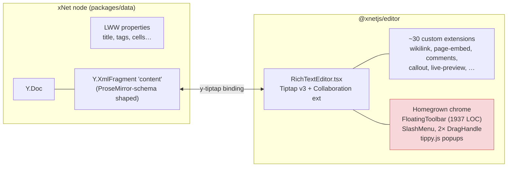
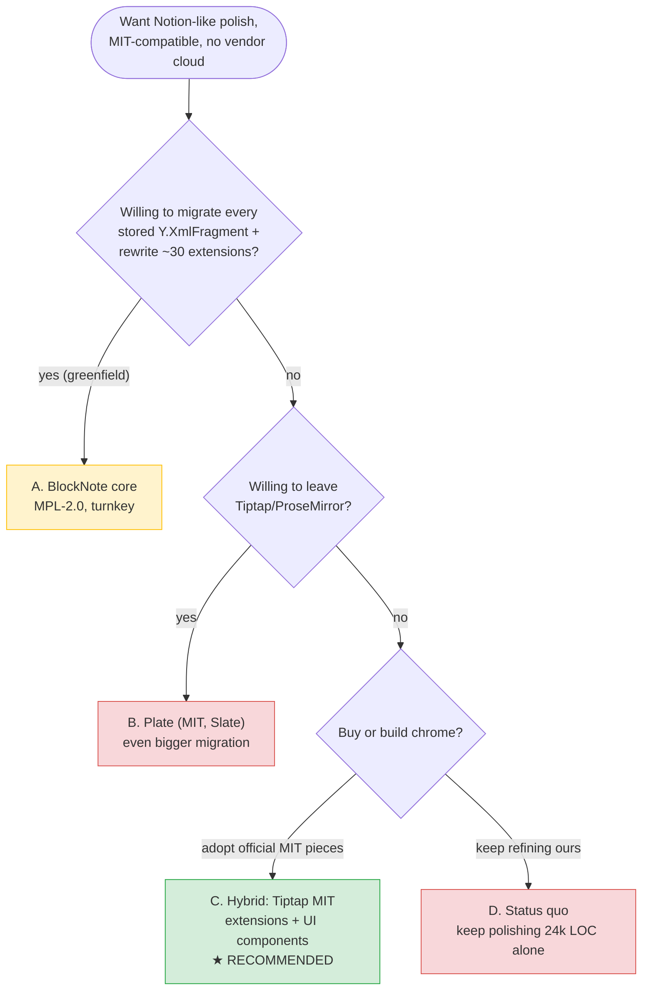
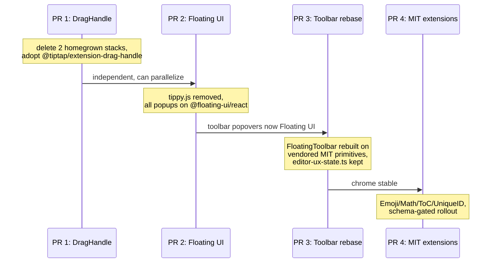

# Off-The-Shelf Notion-Like Editor: Can We Replace Our Custom Tiptap UI?

## Problem Statement

Tiptap ships a polished ["Notion-like editor" template](https://tiptap.dev/docs/ui-components/templates/notion-like-editor)
— slash commands, drag-and-drop blocks, floating toolbar, emoji picker,
mentions, collaboration with live cursors. It is exactly the experience we
want, but it requires **at least a paid Start plan (~$49/mo) for production
use**, is governed by Tiptap's Pro License, and its collaboration + AI parts
are hard-wired to Tiptap Cloud (JWT-authenticated Collab/AI services). As an
MIT-licensed, local-first project we can use none of that.

Meanwhile our own editor UI has accumulated jank — behaviors that don't work
consistently (drag handles, popup positioning, mobile/desktop toolbar
switching). The question: **is there an open-source equivalent we can adopt
off the shelf, or a set of open-source pieces that gets us the same polish
without a rewrite?**

## Executive Summary

- **No drop-in open-source clone of the Tiptap Notion template exists that
  we can adopt wholesale** — every turnkey option (BlockNote, Plate, Novel,
  Yoopta) owns its _document model_, and ours is already deeply invested:
  ~24k LOC in `packages/editor`, ~30 custom extensions, and — critically —
  documents persisted as **ProseMirror-schema Y.XmlFragments synced via
  Yjs**. Swapping editors means migrating every existing document in every
  user's workspace.
- **The closest true turnkey option is BlockNote** (MPL-2.0 core, Tiptap-based,
  very active, no cloud dependency, MPL-2.0 is compatible with an MIT app).
  It would be the right choice for a greenfield app. For us it means
  re-implementing ~30 extensions as BlockNote custom blocks and converting
  every stored Y.XmlFragment to BlockNote's schema. Not worth it.
- **The best path is hybrid, and it recently became viable**: in June 2025
  Tiptap **open-sourced 10 formerly-Pro extensions under MIT** (including
  **DragHandle**, Emoji, Details, Mathematics, TableOfContents, UniqueID,
  FileHandler), and its UI-components library (`ueberdosis/tiptap-ui-components`)
  is **MIT** for every component backed by an open-source extension. That is
  most of the paid Notion template's chrome, minus the cloud-bound parts
  (Comments, AI, hosted Collab) — which we already have our own versions of.
- **Recommendation**: keep our document model and extensions; replace the
  janky homegrown _chrome_ with official MIT pieces — adopt
  `@tiptap/extension-drag-handle` (deleting our **two** parallel drag-handle
  implementations), migrate popups from tippy.js to Floating UI (the v3-native
  positioning stack the official components use), and vendor the MIT UI
  components for toolbar/slash-menu polish.

## Current State In The Repository

We are **already a Tiptap v3 shop with a large custom editor**. The shared
editor is `@xnetjs/editor` (`packages/editor`), ~135 non-test source files /
~24,243 LOC (plus ~13,6k LOC of tests):

- **Core assembly**: `packages/editor/src/components/RichTextEditor.tsx`
  (1005 LOC) wires `@tiptap/starter-kit` + all custom extensions +
  `@tiptap/extension-collaboration` over a **Y.XmlFragment** (default field
  `'content'`), with awareness cursors via `@tiptap/y-tiptap`
  (`yCursorPlugin`). PM history is disabled; Yjs owns undo.
- **Versions** (`packages/editor/package.json`): `@tiptap/*` `^3.15.3`,
  `@tiptap/markdown` `3.16.0`, `yjs` `^13.6.24`, and — notably —
  **`tippy.js` `^6.3.7`** for popups, even though Tiptap v3 itself moved to
  Floating UI.
- **Notion-style chrome we built ourselves**:
  - Slash menu: `packages/editor/src/extensions/slash-command/` +
    `packages/editor/src/components/SlashMenu/index.tsx`.
  - Floating/bubble toolbar: `packages/editor/src/components/FloatingToolbar.tsx`
    (1937 LOC — the single largest file in the package) with a mode
    state machine in `packages/editor/src/components/editor-ux-state.ts`
    (bubble on desktop/pointer, fixed bottom bar on touch).
  - **Two parallel drag-handle implementations** — a ProseMirror-plugin stack
    (`packages/editor/src/extensions/drag-handle/`: `DragHandle.ts`,
    `DragDropPlugin.ts`, `DropIndicatorPlugin.ts`, used by `RichTextEditor`)
    _and_ a React-hook stack (`packages/editor/src/components/DragHandle/`:
    `DragHandle.tsx`, `useDragDrop.ts`, `useDragHandle.ts`,
    `useDropIndicator.ts`). Duplication like this is a standing source of
    the inconsistency the user is feeling.
  - Suggestion popups (`@`-mentions, `[[` wikilinks, hashtags) share a
    tippy-based renderer: `packages/editor/src/extensions/suggestion-popup.ts`.
- **~30 custom extensions** in `packages/editor/src/extensions/` that no
  off-the-shelf editor ships: `wikilink-suggestion/`, `page-embed/`,
  `database-embed/`, `database-reference/`, `task-view-embed/`,
  `page-tasks/` (write-through checklist tasks), `comment/` (Yjs-anchored
  comment marks with orphan re-attachment), `ai-generated/` (provenance
  mark, exploration 0234), `live-preview/` (Obsidian-style syntax reveal),
  `callout/`, `toggle/`, `mermaid/`, `embed/`, `file/`, `image/`
  (content-addressed CIDs), `hashtag/`, `smart-reference/`, `rich-link/`,
  `markdown-clipboard.ts`, plus AI commands (`ai/ai-commands.ts`).
- **Persistence is the hard constraint**: prose lives in Yjs
  (`ydoc.getXmlFragment(field)`) inside the node's Y.Doc from
  `useNode(PageSchema, …)` (`apps/web/src/components/PageView.tsx`);
  structured properties resolve via the LWW log in `packages/data`.
  Database rich-text cells use per-column fragments
  (`packages/data/src/database/rich-text-cell.ts`,
  `richtext_<columnId>`). Any editor whose ProseMirror schema differs from
  ours changes the shape of these fragments — and we already guard against
  schema skew (`packages/editor/src/hooks/useEditorExtensions.ts`,
  `packages/plugins/src/editor-schema-safety.ts`) because **Yjs silently
  drops content that doesn't fit the local schema**.
- **Consumers**: `apps/web` (`PageView`, `CanvasView`, `DatabaseView`,
  `TaskInlineEditor`, chat composer), `apps/electron`, `packages/views`
  (meeting recorder), `packages/devtools` (seed), e2e harness.



The red box is the jank zone — and the part off-the-shelf components can
actually replace. The document model and extensions (green-field editors'
main selling point) are the parts we _can't_ swap cheaply.

## External Research

### What the paid Tiptap template actually contains

Per the [template docs](https://tiptap.dev/docs/ui-components/templates/notion-like-editor):
collaboration with live cursors (Tiptap Cloud), AI menu (Tiptap Cloud),
slash menu, drag-context block menus, formatting toolbar (colors,
highlight, alignment, super/subscript), emoji picker, mentions,
mathematics, UniqueID, link previews, image upload — installed via
`npx @tiptap/cli add notion-like-editor`, production use gated on a Start
plan subscription, config requires `TIPTAP_COLLAB_TOKEN` / `TIPTAP_AI_TOKEN`.

### What Tiptap gives away free (this changed in 2025 — key finding)

- June 2025: [Tiptap open-sourced 10 formerly-Pro extensions under MIT](https://tiptap.dev/blog/release-notes/were-open-sourcing-more-of-tiptap):
  **DragHandle**, Emoji, Details (toggle), FileHandler, InvisibleCharacters,
  **Mathematics**, TableOfContents, **UniqueID**, and more.
- [`ueberdosis/tiptap-ui-components`](https://github.com/ueberdosis/tiptap-ui-components)
  is **MIT**; the [licensing rule](https://tiptap.dev/docs/ui-components/getting-started/overview)
  is: if the backing extension is open source, the UI component is MIT.
  Only cloud-backed components (Comments, Version History, AI,
  hosted Collaboration) are proprietary.
- The free [Simple Editor template](https://tiptap.dev/docs/ui-components/templates/simple-editor)
  (MIT, `npx @tiptap/cli add simple-editor`) ships ~14 components: marks,
  lists, headings, image upload, links, undo/redo, dark mode — but **no
  slash menu or drag handles in the template itself**; those come from the
  MIT extensions + core `@tiptap/suggestion` machinery (which we already use).
- Tiptap v3 (stable July 2025) replaced tippy.js with **Floating UI**,
  added SSR support, MarkViews, and kit packages. The official UI
  components assume Floating UI — our tippy 6.x popups are the legacy path.
- Slash menus and mentions were never Pro: `@tiptap/suggestion` is MIT core.
  Self-hosted collaboration via `@tiptap/extension-collaboration` + any Yjs
  provider (Hocuspocus is MIT) — which is exactly what we already run.

### The turnkey alternatives (as of July 2026)

| Option                    | License                                                          | Base            | Stars        | Activity                      | Notion coverage                                                    | Cloud dep            | Verdict for us                           |
| ------------------------- | ---------------------------------------------------------------- | --------------- | ------------ | ----------------------------- | ------------------------------------------------------------------ | -------------------- | ---------------------------------------- |
| **BlockNote**             | Core **MPL-2.0**; `@blocknote/xl-*` GPL-3.0/commercial ($195/mo) | Tiptap/PM + Yjs | ~9.9k        | v0.51.4 Jun 2026, very active | Best-in-class OOTB: slash, drag, toolbar, tables, comments, collab | None                 | Best turnkey; wrong doc model for us     |
| **Plate**                 | **MIT** (paid "Potion" template separate)                        | Slate           | ~16.4k       | v53.3.2 Jul 2026, very active | Very high via shadcn registry                                      | None                 | Slate rewrite + weakest collab story     |
| **Novel**                 | Apache-2.0                                                       | Tiptap **v2**   | ~16.4k       | **dormant since Jan 2025**    | Slash, bubble menu, AI                                             | Optional             | Avoid — unmaintained, v2                 |
| **shadcn-editor**         | ⚠️ **no LICENSE file**                                           | Lexical         | ~1.4k        | active                        | High                                                               | None                 | Avoid — unlicensed = all rights reserved |
| **Yoopta-Editor**         | MIT                                                              | Slate           | ~3.1k        | v6.0.2 Mar 2026               | Good                                                               | None                 | Single maintainer, Slate                 |
| **Milkdown/Crepe**        | MIT                                                              | PM + remark     | ~11.7k       | active                        | Good but **markdown doc model**                                    | None                 | Wrong model                              |
| **reactjs-tiptap-editor** | MIT                                                              | Tiptap          | 720          | active                        | Toolbar-WYSIWYG, less Notion                                       | None                 | Small bus factor                         |
| **Tiptap MIT pieces**     | MIT                                                              | Tiptap v3       | (core 37.6k) | active                        | Template basic; + MIT ext covers drag/emoji/toggle/math/ToC        | None                 | **Fits our stack exactly**               |
| **Liveblocks tiptap kit** | Apache-2.0                                                       | Tiptap          | —            | active                        | Collab/comments UI                                                 | **Liveblocks cloud** | Fails no-cloud rule                      |

Notable license nuances verified from source:

- **BlockNote**: [`LICENSE.txt`](https://raw.githubusercontent.com/TypeCellOS/BlockNote/main/LICENSE.txt)
  — MPL-2.0 for everything except XL packages, which are
  `"GPL-3.0 OR PROPRIETARY"` (AI, multi-column, PDF/DOCX export;
  [pricing](https://www.blocknotejs.org/pricing)). **MPL-2.0 inside an MIT
  app is fine** — MPL is file-level copyleft; consuming unmodified npm
  packages imposes nothing on our code
  ([MPL 2.0 FAQ Q8/Q11](https://www.mozilla.org/en-US/MPL/2.0/FAQ/)).
  Gotcha: vendored/patched BlockNote files must stay MPL.
- **shadcn-editor**: GitHub API reports `license: null` — legally
  unusable despite the copy-paste distribution model.
- **Novel**: last push January 2025; adopting it means inheriting a
  Tiptap v2→v3 migration on top of 118 open issues.

## Key Findings

1. **"Off the shelf" exists — but only for the parts we can't use.** The
   turnkey editors' value is the document model + block engine + chrome as
   one unit. We can only swap the chrome: our Y.XmlFragments are shaped by
   _our_ ProseMirror schema, synced to other devices, and guarded by
   schema-skew safety code precisely because mismatched schemas silently
   eat content. BlockNote/Plate/Yoopta all mean a stored-document migration
   plus re-implementing ~30 extensions.
2. **The economics inverted in June 2025.** When we built our drag handles
   and toolbar, Tiptap's were Pro-only. Now `@tiptap/extension-drag-handle`
   (+ `-react`), Emoji, Details, Mathematics, TableOfContents, UniqueID and
   FileHandler are MIT, and the UI-components registry is MIT for anything
   backed by open extensions. The gap between the paid Notion template and
   what's free is now essentially: hosted Collab UI, Comments UI, AI UI —
   and we have our own collab (Yjs over our sync), our own comments
   (`extensions/comment/`), and our own AI commands (`extensions/ai/`).
3. **Our jank has identifiable structural causes**, not a hopeless surface:
   two competing drag-handle stacks; tippy.js 6 (legacy) while v3-native
   components use Floating UI; a 1937-LOC hand-rolled `FloatingToolbar`
   doing its own mode policy. These are exactly the components with
   official MIT replacements.
4. **BlockNote is still worth watching** — it is Tiptap-based, MPL-2.0,
   no-cloud, and the best reference implementation of Notion UX on our own
   engine. Its side-menu/drag UX and animated toolbar are good design
   sources even where we don't adopt the code.
5. **License hygiene matters in this space**: one popular option has no
   license at all (shadcn-editor); another's "open" tier hides GPL-3.0
   (`@blocknote/xl-*`); Tiptap's own CLI has
   [prompted for subscription on free templates](https://github.com/ueberdosis/tiptap-ui-components/issues/9)
   — vendor the code rather than depending on the CLI.

## Options And Tradeoffs



### Option A — Adopt BlockNote wholesale

The genuine "off the shelf" answer. Slash menu, drag handles, toolbar,
tables, comments, Yjs collab all work day one; MPL-2.0 core is compatible
with MIT; very active project on our same underlying engine.

- **Pros**: someone else maintains the chrome forever; best OOTB UX;
  Yjs-native so our sync transport still works.
- **Cons (disqualifying)**: BlockNote owns its ProseMirror schema and block
  structure — every stored fragment (pages, canvas docs, database
  rich-text cells, chat composer content) needs a one-way conversion, on
  every device, in a local-first system where old clients silently drop
  unknown content. All ~30 custom extensions become BlockNote custom
  blocks (its custom-block API ≠ Tiptap extension API). `xl-*` features we
  might later want (multi-column, PDF/DOCX export) are GPL-3.0/paid.
  Comments would need rebuilding against its model or dropping ours.
- **Cost estimate**: multi-month; a doc-migration flag-day for a synced
  CRDT system is the riskiest single project we could pick.

### Option B — Plate (or Yoopta)

MIT-clean, shadcn-style source ownership — but Slate-based: rewrite _and_
doc-model migration _and_ a weaker Yjs story (slate-yjs is less proven than
y-prosemirror). The polished Notion template ("Potion") is paid anyway.
Strictly dominated by Option A for us. **Reject.**

### Option C — Hybrid: keep our model, adopt Tiptap's MIT chrome ★

Replace the parts that are janky with the official, maintained, MIT
equivalents; keep everything that is xNet-specific:

| Ours today                                                              | Replace with                                                                                                                      | Schema impact                                         |
| ----------------------------------------------------------------------- | --------------------------------------------------------------------------------------------------------------------------------- | ----------------------------------------------------- |
| `extensions/drag-handle/` **and** `components/DragHandle/` (two stacks) | `@tiptap/extension-drag-handle` + `-react` (MIT since Jun 2025)                                                                   | None — UI-only plugin                                 |
| tippy.js 6 popups (`suggestion-popup.ts`, SlashMenu, mention menus)     | Floating UI (`@floating-ui/react`), matching v3 + official components                                                             | None                                                  |
| Hand-rolled emoji-less slash items                                      | Keep our `SlashCommand` (it's fine); restyle list UI with vendored MIT ui-components primitives                                   | None                                                  |
| `toggle/ToggleExtension.ts`                                             | Evaluate `@tiptap/extension-details` (MIT) — only if serialization matches                                                        | **Node rename risk — migrate carefully or keep ours** |
| — (missing)                                                             | `@tiptap/extension-emoji`, `-mathematics`, `-table-of-contents`, `-unique-id`, `-file-handler` (all MIT) — adopt selectively      | Additive nodes/marks → version-gate rollout           |
| `FloatingToolbar.tsx` (1937 LOC)                                        | Incremental: rebuild on vendored MIT toolbar primitives; keep our `editor-ux-state.ts` policy (it encodes real product decisions) | None                                                  |

- **Pros**: no document migration; deletes our highest-jank duplicated
  code; puts us on the same maintained components the paid template uses;
  zero license risk (all MIT); zero cloud; incremental — each row above is
  an independent PR.
- **Cons**: not "one command and done" — it's 3–5 focused PRs; the
  official DragHandle's UX must be validated against our block types
  (embeds, callouts, page-tasks); any _schema-adding_ extension (Emoji,
  Details) interacts with the Yjs schema-skew hazard and needs the
  version-gating we already built for plugins.
- **Cost estimate**: ~1–2 weeks of focused work for the core three
  (drag handle unification, Floating UI migration, toolbar rebase), each
  independently shippable.

### Option D — Status quo (keep polishing alone)

We keep sole maintenance of 24k LOC of chrome that now has free, maintained,
official equivalents. Every hour spent debugging our drag-handle
duplication is an hour the Tiptap team has already spent for us. **Reject.**

## Recommendation

**Option C.** Do not replace the editor; replace its chrome with Tiptap's
own MIT pieces, in this order:

1. **Drag-handle unification (biggest jank win).** Adopt
   `@tiptap/extension-drag-handle(-react)`; delete both
   `packages/editor/src/extensions/drag-handle/` and
   `packages/editor/src/components/DragHandle/`. UI-only, no schema risk.
2. **tippy.js → Floating UI.** Migrate `suggestion-popup.ts`, SlashMenu,
   TaskMentionMenu, LinkTargetMenu, wikilink suggestions to
   `@floating-ui/react`. This aligns us with v3 and the official
   components, and fixes the positioning-inconsistency class of bugs.
   Drop the tippy dependency.
3. **Vendor the MIT UI-component primitives** (via
   `npx @tiptap/cli add simple-editor` into a scratch dir, then copy —
   don't take a CLI dependency) and incrementally rebase
   `FloatingToolbar.tsx` onto them, keeping `editor-ux-state.ts` as the
   mode policy.
4. **Selectively adopt MIT extensions** where they beat ours or fill gaps:
   Emoji, Mathematics, TableOfContents, UniqueID — each behind the
   existing extension-tier/schema-safety machinery
   (`packages/editor/src/extension-tiers.ts`), rolled out with version
   gating so old clients don't hit unknown nodes.
5. **Keep BlockNote on the radar** as a design reference and as the answer
   if we ever green-field a new surface (e.g. a plugin-hosted editor)
   where doc-model compatibility doesn't bind us.



### Decisions (implementation, 2026-07-10)

- **Emoji + Mathematics: adopted.** Both are statically bundled in
  `RichTextEditor` (schema extensions must be identical across
  collaborators — the tier rule in `extension-tiers.ts`), with `emoji`,
  `inlineMath`, `blockMath` added to `CURRENT_NODE_TYPES` and
  `EDITOR_DOCUMENT_SCHEMA_VERSION` bumped to 3 in `document-compat.ts`.
  The `:` picker reuses the shared Floating UI suggestion popup
  (`EmojiMenu.tsx`).
- **TableOfContents + UniqueID: deferred.** Both are behavior/attribute
  extensions with **no consuming surface today** — ToC needs a sidebar/
  outline UI and UniqueID exists to give ToC/anchors stable targets.
  Bundling them now would add attribute-churn skew risk (old clients
  strip ids, new clients re-add) with zero user-visible value. Adopt
  together with an outline feature when one is designed.
- **ToggleExtension kept over `@tiptap/extension-details`.** Different
  node names/attrs (`toggle` vs `details`/`detailsSummary`/
  `detailsContent`) mean stored docs don't round-trip; ours is stable
  and featureful enough that a migration buys nothing. Revisit only if
  upstream Details grows something ours lacks.
- **Changesets: not applicable.** `@xnetjs/editor` is `private: true`
  and in `.changeset/config.json` `ignore` — no changeset is required
  for editor-only changes (verified against the Stop-hook coverage
  script).

### Jank inventory (chrome vs content, 2026-07-10)

Sources: repo issue tracker (empty), code archaeology, live verification
during implementation. The inventory validates the PR ordering — every
concretely identifiable defect was **chrome**, none content-level:

| Jank                                                                                                                                           | Bucket  | Status                                                                                                                         |
| ---------------------------------------------------------------------------------------------------------------------------------------------- | ------- | ------------------------------------------------------------------------------------------------------------------------------ |
| Two parallel drag-handle stacks with divergent behavior (`extensions/drag-handle/` vs `components/DragHandle/`)                                | chrome  | **Fixed** — both deleted, official `@tiptap/extension-drag-handle`                                                             |
| Collab edits during drag relocated blocks via content-fingerprint heuristic (`DragDropPlugin.ts`) — wrong block moved on fingerprint collision | chrome  | **Fixed** — PM-native `NodeRangeSelection` drag maps positions through transactions                                            |
| Suggestion-popup positioning at viewport edges / inside scroll islands (tippy 6 + popper, legacy stack vs v3's Floating UI)                    | chrome  | **Fixed** — Floating UI `flip`/`shift` + `autoUpdate`, verified at bottom edge                                                 |
| Infinite React update loop: DragHandle react wrapper re-registered its plugin every render when `computePositionConfig` was an inline literal  | chrome  | **Fixed** (introduced + caught during this work — live verification, not tests, surfaced it)                                   |
| Mobile toolbar path entirely disabled by hardcoded `toolbarMode="desktop"` (`apps/web/src/components/Editor.tsx`)                              | chrome  | Fixed previously (0231-era); mode now `auto` via `editor-ux-state.ts`                                                          |
| Comment-popover show/hide flicker on quick hovers (`usePageComments.ts:317,325`)                                                               | chrome  | Mitigated by debounce; acceptable                                                                                              |
| Toolbar keyboard access: no roving arrow-key navigation                                                                                        | chrome  | **Fixed** — vendored Toolbar primitive adds it                                                                                 |
| Markdown paste / live-preview round-trip inconsistencies                                                                                       | content | **No concrete open defect found** — covered by `markdown-token-contract.ts` test matrix; revisit only against specific reports |

### Watching brief

Filed as [#466](https://github.com/crs48/xNet/issues/466) — BlockNote
(MPL-2.0) for greenfield editor surfaces, with license guardrails.

## Example Code

Unified drag handle (replacing both homegrown stacks), in
`RichTextEditor.tsx`:

```tsx
import { DragHandle } from '@tiptap/extension-drag-handle-react'

// inside the editor render, alongside EditorContent:
;<DragHandle editor={editor}>
  <GripVertical className="wb-drag-grip" size={16} />
</DragHandle>
```

Suggestion popup on Floating UI instead of tippy (sketch for
`suggestion-popup.ts`):

```ts
import { computePosition, flip, shift, offset } from '@floating-ui/dom'

export function positionSuggestion(reference: DOMRect, popup: HTMLElement) {
  const virtualEl = { getBoundingClientRect: () => reference }
  return computePosition(virtualEl, popup, {
    placement: 'bottom-start',
    middleware: [offset(6), flip(), shift({ padding: 8 })]
  }).then(({ x, y }) => {
    Object.assign(popup.style, { left: `${x}px`, top: `${y}px` })
  })
}
```

Schema-gated adoption of an additive MIT extension:

```ts
// extension-tiers.ts — additive nodes ship dark until fleet coverage
import Mathematics from '@tiptap/extension-mathematics'

registerTierTwoExtension({
  id: 'mathematics',
  minProtocolVersion: 14, // old clients would drop math nodes silently
  build: () =>
    Mathematics.configure({
      /* katex opts */
    })
})
```

## Risks And Open Questions

- **Official DragHandle vs our block zoo**: does
  `@tiptap/extension-drag-handle` behave correctly over our React NodeViews
  (callouts, page-embeds, database embeds, mermaid)? Needs a spike before
  deleting our stacks; our `DropIndicatorPlugin` semantics (drop-target
  preview) may need porting on top of it.
- **Schema-adding extensions × Yjs skew**: Emoji/Mathematics/Details add
  node types; an old client syncing a doc containing them **silently drops
  the content** (the exact hazard `editor-schema-safety.ts` guards).
  Every additive extension must ride the version-gating path — this is the
  one place "off the shelf" still costs real engineering here.
- **`@tiptap/extension-details` vs our `ToggleExtension`**: different node
  names/attrs → stored docs won't round-trip. Default to keeping ours
  unless a migration is written; decide during PR 4.
- **Tiptap's licensing posture**: they moved 10 extensions _to_ MIT in
  2025, but the CLI has nagged for subscriptions on free templates —
  vendor everything, pin versions, never gate our build on `@tiptap/cli`.
- **Mobile toolbar parity**: rebasing `FloatingToolbar.tsx` must preserve
  the touch/fixed-bar mode (`editor-ux-state.ts`) — the paid template is
  desktop-first and the MIT primitives don't encode our mobile policy.
- **Open question — how much of the jank is chrome vs. schema?** If user
  reports point at content-level inconsistency (paste, markdown
  round-trip, live-preview) rather than chrome, PRs 1–3 won't fix those;
  worth a quick jank inventory (issue triage) before committing the order.

## Implementation Checklist

- [x] Spike: `@tiptap/extension-drag-handle(-react)` in the e2e harness
      (`tests/e2e/harness/main.tsx`) over callout/embed/page-task blocks;
      compare with both existing stacks.
- [x] PR 1: adopt official DragHandle; port drop-indicator styling; delete
      `packages/editor/src/extensions/drag-handle/` and
      `packages/editor/src/components/DragHandle/`; update exports in
      `packages/editor/src/extensions.ts` / `react.ts` (major-bump check —
      `DragHandleExtension` is exported).
- [x] PR 2: migrate `suggestion-popup.ts`, `SlashMenu`, `TaskMentionMenu`,
      `LinkTargetMenu`, wikilink/hashtag popups to `@floating-ui/react`;
      remove `tippy.js` from `packages/editor/package.json`.
- [x] PR 3: vendor MIT simple-editor UI primitives into
      `packages/editor/src/components/ui/` (copied, not CLI-managed);
      rebase `FloatingToolbar.tsx` onto them; keep `editor-ux-state.ts`;
      verify mobile fixed-bar mode on touch.
- [x] PR 4: adopt Emoji + Mathematics + TableOfContents + UniqueID behind
      extension tiers with version gating; write a migration decision for
      `ToggleExtension` vs `extension-details` (default: keep ours).
- [x] Changesets for `@xnetjs/editor` on each PR (removed exports ⇒
      **major** per barrel policy).
- [x] Jank inventory: triage known editor inconsistencies into
      chrome-vs-content buckets to validate the PR ordering.
- [x] File a watching-brief note on BlockNote (MPL-2.0 core) for any future
      greenfield editor surface.

## Validation Checklist

- [x] Drag-and-drop works consistently across all block types (paragraph,
      heading, callout, toggle, code, mermaid, page-embed, database-embed,
      image, task item) on desktop pointer — one implementation, one
      behavior.
- [x] All suggestion popups (slash, `@`, `[[`, `#`) position correctly at
      viewport edges, inside scrollable islands, and in the electron app
      (the historical tippy failure modes).
- [x] Mobile: fixed bottom toolbar still appears on touch; bubble menu on
      pointer (`editor-ux-state.ts` tests stay green).
- [x] Yjs round-trip: a doc containing every extension syncs between two
      clients with no dropped content (`seed-coverage`-style e2e); old-client
      skew test for any newly added node types.
- [x] `packages/editor` test suite (~13.6k LOC) passes; net LOC in the
      package goes **down**.
- [x] No `tippy.js` in the dependency tree; no `@tiptap/cli` in any build
      path; `pnpm licenses list` shows no new non-MIT/Apache/MPL entries.

## References

- Tiptap Notion-like template (paid): https://tiptap.dev/docs/ui-components/templates/notion-like-editor
- Tiptap Simple Editor template (MIT): https://tiptap.dev/docs/ui-components/templates/simple-editor
- Tiptap UI components licensing: https://tiptap.dev/docs/ui-components/getting-started/overview
- Tiptap open-sourcing 10 Pro extensions (Jun 2025): https://tiptap.dev/blog/release-notes/were-open-sourcing-more-of-tiptap
- Tiptap v3 stable notes (Floating UI, SSR): https://tiptap.dev/blog/release-notes/tiptap-3-0-is-stable
- tiptap-ui-components repo (MIT): https://github.com/ueberdosis/tiptap-ui-components
- CLI/subscription friction issue: https://github.com/ueberdosis/tiptap-ui-components/issues/9
- BlockNote license (MPL-2.0 + XL carve-out): https://raw.githubusercontent.com/TypeCellOS/BlockNote/main/LICENSE.txt
- BlockNote pricing / XL scope: https://www.blocknotejs.org/pricing
- BlockNote collaboration (self-hostable): https://www.blocknotejs.org/docs/features/collaboration
- MPL 2.0 FAQ (MIT compatibility, Q8/Q11): https://www.mozilla.org/en-US/MPL/2.0/FAQ/
- Plate (MIT): https://github.com/udecode/plate — paid Potion template: https://pro.platejs.org/docs/templates/potion
- Novel (dormant): https://github.com/steven-tey/novel
- shadcn-editor (no license): https://github.com/htmujahid/shadcn-editor
- Yoopta-Editor (MIT): https://github.com/Darginec05/Yoopta-Editor
- Milkdown Crepe: https://milkdown.dev/docs/api/crepe
- Internal: exploration 0231 (page editor alignment), 0234 (AI provenance
  mark), 0276 (barrel/churn policy).
