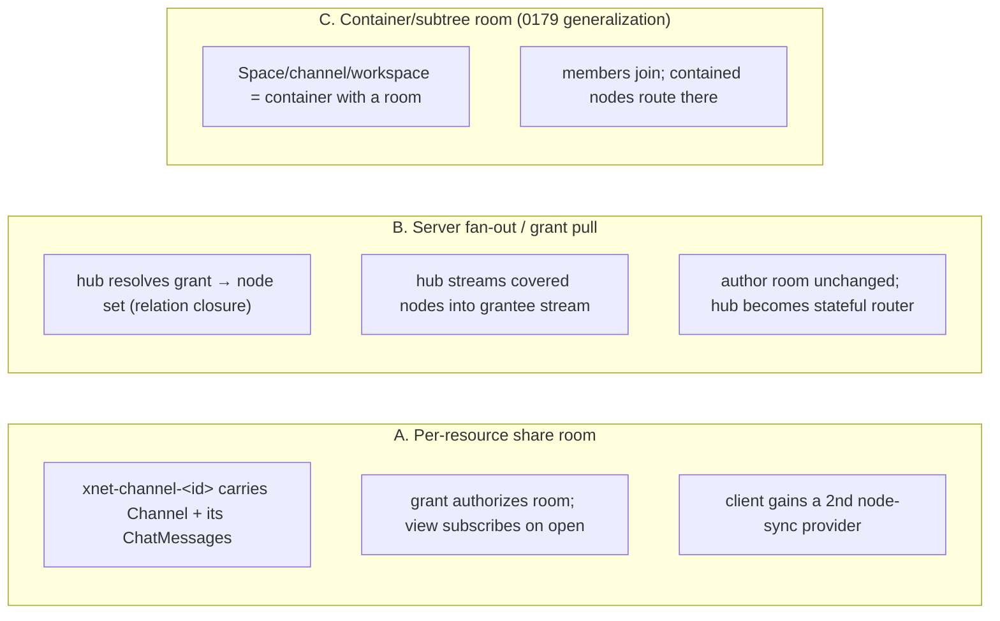

# Sharing Non-Doc-Room Nodes: Channels And Workspaces That Actually Sync

## Problem Statement

Share links now _accept_ `channel` and `workspace` doc types (PR #457), and
the link → interstitial → claim → route flow all work. But when a second
identity opens a shared channel link, they land on an **empty "untitled"
channel** — the original's name and messages never arrive. The same latent
gap affects **workspace** (bench) shares.

The reason is structural, not a bug in the share code: **pages and channels
sync over two completely different transports, and only one of them is
grant-aware.**

- A **page/database/canvas/dashboard** is a Yjs **doc-room** (`xnet-doc-<id>`).
  A share grant authorizes _that room_, and opening `/doc/<id>` subscribes to
  it — so the content flows across identities. This is why page sharing works.
- A **channel** (and its **messages**, and a **workspace bench**) is a plain
  `NodeStore` node. Plain nodes sync over the **node-change relay**, which uses
  **one room per client, keyed on the client's own DID**
  (`nodeSyncRoom = authorDID`). There is no per-channel room, and a recipient's
  client only ever subscribes to _its own_ DID room. A grant on the channel's
  id authorizes a resource that **no transport ever delivers**.

This exploration captures the requirements and designs a real fix: delivering
the nodes covered by a share grant (a channel's `Channel` node + its
`ChatMessage` children; a workspace bench node + what it references) to the
grantee, with ongoing sync, correct role semantics, and revocation.

## Executive Summary

- **Root cause (verified in code):** the node-change relay is a
  single-author-room broadcast. `NodeStoreSyncProvider` is a singleton bound to
  `nodeSyncRoom = authorDID` (`packages/react/src/context.ts:334`,
  `packages/runtime/src/sync/sync-manager.ts:471`,
  `node-store-sync-provider.ts:195`). The hub only maps `xnet-doc-*` topics back
  to a shareable resource (`packages/hub/src/ws/authorize.ts:32`). Nothing
  carries a plain node from one author's room into a grantee's store.
- **The fix is a new transport for grant-covered plain nodes.** Three shapes
  are viable: **(A) a per-resource "share room"** the grant authorizes and the
  view subscribes to (mirrors the proven doc-room model); **(B) server-side
  fan-out / grant-scoped pull** where the hub delivers grant-covered nodes into
  the grantee's stream; **(C) a container/subtree room** generalizing the 0179
  Space cascade.
- **Recommendation: Option A, generalized into a reusable "share room" for any
  shareable container (channel now; workspace and Space next), phased.** It
  reuses the exact mechanism pages already prove in production (a resource-keyed
  room + grant authorization + subscribe-on-open), keeps the hub stateless per
  message, and composes with the existing grant-index and Space-cascade authz.
  Option B is the fallback if per-message multi-room routing proves too costly.
- **Scope reality:** this is a hub + client sync change touching relay room
  routing, the client's single-room assumption, the comms write path
  (`sendMessage` must publish into the channel's share room), and the claim
  flow (subscribe on claim). Workspaces add a transitive-content question that
  v1 should scope down (share the bench; referenced docs still need their own
  shares).
- **Interim:** because #457's channel entry points ship a broken experience,
  they should be hidden behind a flag (or reverted) until Phase 1 lands — see
  Risks.

## Current State In The Repository

### Two transports, one of them grant-aware

```mermaid
flowchart TD
    subgraph Page["PAGE share — WORKS"]
      P1[claim grant on docId] --> P2["/doc/&lt;id&gt; opens Yjs doc"]
      P2 --> P3["subscribe room xnet-doc-&lt;id&gt;"]
      P3 --> P4["hub: topicToResource strips prefix → &lt;id&gt;"]
      P4 --> P5{grant on &lt;id&gt;?}
      P5 -- yes --> P6[doc body + meta sync ✅]
    end
    subgraph Chan["CHANNEL share — BROKEN"]
      C1[claim grant on channelId] --> C2["/channel/&lt;id&gt; local useQuery only"]
      C2 --> C3["node changes live in AUTHOR-DID room"]
      C3 --> C4["recipient subscribes only to THEIR OWN DID room"]
      C4 --> C5[Channel node never arrives]
      C5 --> C6["channelLabel → 'untitled', empty feed ❌"]
    end
```



- **Doc-room path (works):** `packages/react/src/hooks/useNode.ts:824` opens a
  Yjs doc with `room: xnet-doc-<id>`. The hub authorizes that room by
  `topicToResource` (`packages/hub/src/ws/authorize.ts:32`) →
  `listGrantedDocIds` / `canAccessNode` (`authorize.ts:137,150`).
- **Node-relay path (single-author-room):**
  - `nodeSyncRoom = hubOptions?.nodeSyncRoom ?? authorDID ?? 'default'`
    (`packages/react/src/context.ts:334`).
  - One provider per client: `new NodeStoreSyncProvider(nodeStore, nodeSyncRoom)`
    (`packages/runtime/src/sync/sync-manager.ts:471`), bound to `this.room` and
    subscribing/requesting only that room (`node-store-sync-provider.ts:195`,
    `requestSync`).
  - The hub relays and serves changes **by room**:
    `NodeRelayService.handleNodeChange(msg.room, …)` and
    `handleSyncRequest` return `getNodeChangesSince(room, …)`
    (`packages/hub/src/services/node-relay.ts`), each gated by
    `auth.can('hub/relay', room)`.

### What a channel and its messages actually are

- `Channel` schema `xnet://xnet.fyi/Channel@1.0.0`,
  `authorization: spaceCascadeAuthorization()`, `document: undefined` (a plain
  node, not a Yjs doc) — `packages/data/src/schema/schemas/channel.ts`.
- `ChatMessage` `xnet://xnet.fyi/ChatMessage@1.0.0`, each message is its own
  node with a `channel` relation back to the channel
  (`packages/data/src/schema/schemas/chat-message.ts`;
  `authorization: spaceCascadeAuthorization('channel')`).
- Reads: `useChannels()` = `useQuery(ChannelSchema, { orderBy … })` (queries
  **all** local Channel nodes) and `useChannelMessages(id)` =
  `useQuery(ChatMessageSchema, channelHistoryQuery(id))`
  (`apps/web/src/comms/hooks.ts:60,68`). So a synced channel _would_ appear —
  it just never syncs.
- Writes: `sendMessage` creates a `ChatMessage` with `channel: channelId`
  (`apps/web/src/comms/ChannelChat.tsx`; `packages/comms/src/chat/chat-service.ts`).
  `createChannel` is only called from `ChatsPanel` / `RoomSection` / `TagView`
  — **never on the channel route or claim path**, confirming no node is created
  on view; the "untitled" is the `channelLabel` fallback
  (`apps/web/src/comms/comms-utils.ts:94`).

### What #457 shipped (plumbing only)

- Hub accepts `docType: 'channel'` / `'workspace'` in `SHARE_DOC_TYPES`
  (`packages/hub/src/routes/share-links.ts`).
- Client unions + `docRouteFor('channel') → /channel/$channelId` and the
  `/share` web-fallback map (`apps/web/src/lib/share-links.ts`,
  `apps/web/src/routes/share.tsx`).
- Entry points: Share button in `ChannelView`, action in `ChatsPanel`, per-row
  button in `WorkspaceSwitcher`.
- Authz: `ChatMessage@` added to `COMMENT_SCHEMA_PREFIXES`
  (`packages/hub/src/services/share-access.ts`) so a comment-role grantee _may
  post_ — but only once the room actually reaches them, which is the missing
  piece.

### The grant model already resolves the resource — it's delivery that's missing

`authorize.ts` authorizes a room by resource: capability →
`listGrantedDocIds(did)` → `shareAccess.canAccessNode(did, resource)` (Space
cascade, 0179). This means **if** channel nodes traveled in a resource-keyed
room, the existing grant machinery would already authorize it. The gap is
purely that plain nodes don't travel in such a room and no client subscribes to
one.

## External Research

- **Matrix** models every conversation as a **room** with its own event graph
  and per-room membership/ACLs; clients sync rooms they're joined to. This is
  the closest analogue to "per-resource share room" (Option A): the room _is_
  the unit of sharing and sync. (matrix.org/docs — rooms & membership.)
- **Slack/Discord** treat a channel as a first-class membership object; the
  server fans out messages to current members (Option B shape). Delivery is
  server-mediated by membership, not by the author's personal stream.
- **Local-first CRDT sync (Yjs `y-websocket`, Automerge `sync`)** is
  per-document-room by default; sharing a sub-collection means giving it its own
  document/room. This is exactly why xNet's _pages_ already share and its
  _channels_ don't — the app put channels in a per-author stream instead of a
  per-channel room.
- **Figma/Notion "share a page vs share a workspace"** distinguish sharing a
  single object (deliver that object) from sharing a container (deliver the
  container + resolve access to descendants). Workspaces here are the container
  case and, like those products, need an explicit decision about transitive
  content (share the shell vs. cascade to every referenced doc).
- Takeaway: the industry split maps cleanly onto our Options — **room-per-
  resource (Matrix/CRDT)** vs **server fan-out by membership (Slack)**. xNet
  already runs the room-per-resource model for docs, which argues for extending
  it rather than introducing a second paradigm.

## Key Findings

1. **The node-relay is single-room and DID-keyed.** Cross-identity delivery of
   any plain node — not just channels — is unsupported today. Workspaces, and
   arguably any future "share this record," hit the same wall.
2. **The grant/authz layer is already resource-keyed and would compose.** A
   resource-keyed room (`xnet-<kind>-<id>`) drops straight into
   `topicToResource` + `listGrantedDocIds` + Space cascade with minimal change.
3. **Messages are a stream of child nodes, not a document.** Whatever transport
   we pick must carry _both_ the container node and an open-ended, growing set
   of child nodes (`ChatMessage` where `channel == id`), including new ones
   posted after the claim.
4. **Reads are already room-gated** (`handleSyncRequest` checks
   `auth.can('hub/relay', room)`), so a grant that authorizes the share room
   gives read access for free — no separate read-authz system needed.
5. **The owner's "list all my channels" relies on the author room.**
   `useChannels()` queries all local Channel nodes, which arrive today via the
   author-DID room. Any redesign must preserve the owner seeing their own
   channels without subscribing to N per-channel rooms.
6. **DM channels are special** (deterministic id from member DIDs,
   `chat-service.ts` `dmChannelId`) — sharing a DM is semantically odd and
   should be excluded from v1.

## Options And Tradeoffs



| Dimension | A. Per-resource room | B. Server fan-out / pull | C. Container room |
| --- | --- | --- | --- |
| Reuses proven doc-room model | ✅ strong | ⚠️ new verb | ✅ (A generalized) |
| Hub statefulness | Low (route by room) | High (grant→grantee delivery, closure) | Medium |
| Client change | Multi-room node sync (today single-room) | Small (new subscription/pull) | Multi-room |
| Ongoing messages | Natural (post into room) | Natural (fan-out on write) | Natural |
| Owner's channel list | Needs care (dual-room) | Unchanged | Needs care |
| Workspace transitive content | Explicit per-resource rooms | Closure computed server-side | Container covers subtree |
| Authz reuse | ✅ topicToResource + grant | ⚠️ new path | ✅ Space cascade |
| Biggest risk | Per-message multi-room routing + owner list | Hub complexity, fan-out cost, dedup | Same as A + container modeling |

### A. Per-resource share room (recommended, generalized)

Give a shareable container its own node room, e.g. `xnet-channel-<id>`
(generalizable to `xnet-share-<id>`). Relay the `Channel` node and every
`ChatMessage` with `channel == id` into that room. On `/channel/<id>` (and on
claim), the client opens a **second, resource-scoped** `NodeStoreSyncProvider`
for that room — exactly analogous to `acquireDoc` opening `xnet-doc-<id>` for a
page. The grant authorizes the room via the existing `topicToResource` +
`listGrantedDocIds` path.

- **Pros:** one paradigm (rooms), reuses authz verbatim, hub stays per-message
  stateless, ongoing messages "just work" (write into the room).
- **Cons:** the client currently assumes a single node room — needs a small
  multi-provider capability. The relay must route a change into the channel
  room based on its schema/relation. The owner must still see their channels in
  `useChannels()` (keep publishing the `Channel` node to the author room too, or
  have the owner auto-subscribe to their channel rooms).

### B. Server-side fan-out / grant-scoped pull

Keep the author room; on claim, the recipient asks the hub for "all nodes under
grant resource X," and the hub — authorized by the grant — returns the `Channel`
+ its `ChatMessage` closure and pushes future covered changes into the
grantee's stream.

- **Pros:** no client multi-room work; naturally handles transitive closure
  (good for workspaces); author write path unchanged.
- **Cons:** the hub becomes a stateful grant-router (must know, per write, which
  grantees a node reaches, and compute relation closures); a genuinely new sync
  verb and delivery model; higher risk of dedup/ordering bugs across the
  author-room and the fan-out stream.

### C. Container/subtree room (0179 generalization)

Model every shareable container (Space, channel, workspace) uniformly: a
container has a room, members join it, and nodes beneath it route there. This is
essentially Option A elevated to a first-class "container sync" concept and
unified with Space membership.

- **Pros:** one concept for Spaces + channels + workspaces + future containers;
  cleanest long-term.
- **Cons:** biggest upfront modeling (what "contained" means per type; how
  membership maps to rooms); most code churn. Best as the _destination_ that
  Phase 1 (Option A for channels) evolves toward.

## Recommendation

**Adopt Option A, but implement it as a general "share room" seam so it becomes
Option C over time. Phase it:**

1. **Phase 1 — Channels.** Add `xnet-channel-<id>` share rooms. Relay routes the
   `Channel` node and `ChatMessage` children into the room; `sendMessage`
   publishes into it; the claim/route subscribes the grantee (a second
   node-sync provider). The owner keeps their list by continuing to publish the
   `Channel` node to their author room _and_ the share room (dual-publish), or by
   auto-subscribing owners to their own channel rooms. Gate the #457 channel
   entry points behind this landing.
2. **Phase 2 — Workspaces.** Deliver the bench (`xnet:Workspace`) node via the
   same share-room mechanism so the layout materializes. Explicitly scope out
   transitive content in v1: the bench appears; nodes it references still need
   their own shares (or a follow-up "cascade grants to referenced nodes"
   decision).
3. **Phase 3 — Generalize to containers (Option C).** Fold Space membership,
   channels, and workspaces into one "container room" abstraction and retire the
   per-type special-casing.

Rationale: it reuses the exact model already proven in production for pages
(resource-keyed room + grant authorization + subscribe-on-open), keeps the hub
stateless per message, and composes with the grant-index and Space-cascade authz
that already exist — the lowest-risk path to a correct, incremental fix. Option
B's server-mediated fan-out is the fallback if per-message multi-room routing
proves too expensive at scale.

## Example Code

Room naming + client subscription (sketch):

```ts
// packages/runtime/src/sync/rooms.ts (new)
export const channelShareRoom = (channelId: string) => `xnet-channel-${channelId}`

// On /channel/<id> or on claim: open a second node-sync provider for the room,
// mirroring how a page acquires xnet-doc-<id>. This is the piece the app lacks
// today — the singleton NodeStoreSyncProvider is bound only to the author room.
const provider = new NodeStoreSyncProvider(nodeStore, channelShareRoom(channelId))
provider.attach(connection) // grant authorizes the room via topicToResource
```

Relay routing (hub) — a change for a channel/message lands in the channel room,
not just the author room:

```ts
// packages/hub/src/services/node-relay.ts (routing sketch)
const shareRoomFor = (change: SerializedNodeChange): string | null => {
  const schema = change.payload.schemaId ?? change.schemaId
  if (schema?.startsWith('xnet://xnet.fyi/Channel@')) return `xnet-channel-${change.nodeId}`
  if (schema?.startsWith('xnet://xnet.fyi/ChatMessage@')) {
    const channelId = change.payload.properties?.channel as string | undefined
    return channelId ? `xnet-channel-${channelId}` : null
  }
  return null
}
// append to the share room (in addition to / instead of the author room),
// so a grantee subscribed to xnet-channel-<id> receives it.
```

Write path — post into the channel room:

```ts
// packages/comms/src/chat/chat-service.ts (sendMessage)
// today: creates a ChatMessage node in the author's stream.
// change: ensure the created node is published to channelShareRoom(channelId)
// so grantees receive it in real time (and is authorized by their grant).
```

`topicToResource` already resolves the room to the grant resource — for a
channel room we strip `xnet-channel-` the same way `xnet-doc-` is stripped
(`packages/hub/src/ws/authorize.ts:32`), so `listGrantedDocIds` / Space cascade
authorize it unchanged.

## Risks And Open Questions

- **Owner's channel list.** `useChannels()` queries all local `Channel` nodes.
  If channels move to per-channel rooms, the owner must still see all of theirs
  without joining N rooms. Options: dual-publish the `Channel` node to the author
  room too, or auto-subscribe owners to their channel rooms. Needs a decision.
- **Message fan-out volume.** A busy channel is a high-write room; every message
  now routes to a room every member subscribes to. Confirm the relay + storage
  handle per-room message volume (indexing `node_changes` by room already
  exists).
- **Backfill of existing channels.** Channels created before this change have
  no share-room history. Claiming an old channel needs the owner's client (or a
  migration) to (re)publish the `Channel` + messages into the room, or a
  server-side backfill from the author room.
- **Workspace transitive content.** A bench references docs/channels by id.
  v1 delivers the bench node only; referenced content still needs its own
  shares. Decide whether a workspace share should _cascade_ grants to referenced
  nodes (powerful but a broad access surface) — likely a separate exploration.
- **Revocation semantics.** Disabling a link / removing a grant stops _future_
  room access; already-synced messages remain in the ex-grantee's local store
  (same as any local-first share). Document this expectation.
- **DM channels.** Deterministic-id DMs between two DIDs should be excluded from
  sharing (or share-links disabled for `kind: 'dm'`).
- **Presence/awareness rooms** (`useRoomSession`) are separate from node rooms
  and already work per-room; confirm they key off the same channel id.
- **Read-only vs comment vs write.** With the room delivered, `share-access.ts`
  already lets `comment` post `ChatMessage@` and `read` observe; verify a
  `read` grantee cannot post and a `write` grantee can edit the `Channel` node.
- **Multi-hub / federation.** If the channel owner and grantee are on different
  hubs, the share room must resolve on the issuing hub (the claim endpoint) —
  consistent with how cross-hub doc claims already switch hubs
  (`decideClaimDestination`).

## Implementation Checklist

- [ ] Add a `channelShareRoom(id)` (generalizable `shareRoom(kind, id)`) helper
      and teach `topicToResource` to strip the new prefix(es).
- [ ] Hub relay: route `Channel` and `ChatMessage` (by `channel` relation)
      changes into the channel share room; keep/adjust author-room publication
      for the owner's list.
- [ ] Client: support a second, resource-scoped `NodeStoreSyncProvider` (lift
      the single-`nodeSyncRoom` assumption in `sync-manager.ts`).
- [ ] Subscribe on `/channel/<id>` and on claim (mirror `acquireDoc` for pages),
      so the grantee pulls the channel room.
- [ ] Comms write path: publish new `ChatMessage` nodes into the channel share
      room; ensure `createChannel` publishes the `Channel` node there.
- [ ] Verify grant authorization for the channel room via the existing
      `listGrantedDocIds` / Space-cascade path; add a hub test.
- [ ] Phase 2: deliver `xnet:Workspace` bench nodes via the same mechanism;
      land the recipient on the bench.
- [ ] Interim: gate/hide the #457 channel (and workspace) share entry points
      until Phase 1 is verified, so no one hits the empty-channel flow.
- [ ] Backfill path for channels created before share rooms existed.
- [ ] Exclude `kind: 'dm'` channels from share-link generation.
- [ ] Changelog + (no publishable package if hub/web only) / changeset as
      applicable.

## Validation Checklist

- [ ] Identity A creates a channel, posts messages, shares a link; Identity B
      claims it and sees the **original name + full message history**.
- [ ] A posts a new message after B claimed → it appears for B in real time.
- [ ] B with a **comment** grant can post a message but cannot rename/edit the
      channel; a **read** grant can do neither; a **write** grant can edit the
      channel node.
- [ ] Revoking B's grant stops new messages from syncing to B (history already
      synced may remain locally — documented).
- [ ] A still sees all of A's own channels in the sidebar (owner list intact).
- [ ] A pre-existing channel (created before this change) shares correctly
      (backfill works).
- [ ] Workspace (Phase 2): B claims a bench link and the layout materializes;
      referenced docs behave per the scoped v1 decision.
- [ ] No stray "untitled" channel is created on the claim/route path.
- [ ] Hub tests: the channel share room authorizes for a grantee and rejects a
      non-grantee; `read` cannot post, `comment` can.

## References

- `packages/react/src/context.ts:334` — `nodeSyncRoom = authorDID` (the single
  per-client node room).
- `packages/runtime/src/sync/sync-manager.ts:471` — one `NodeStoreSyncProvider`
  per client; `node-store-sync-provider.ts:195` — subscribes only `this.room`.
- `packages/hub/src/services/node-relay.ts` — `handleNodeChange` /
  `handleSyncRequest` are per-room, gated by `auth.can('hub/relay', room)`.
- `packages/hub/src/ws/authorize.ts:32` — `topicToResource` (only `xnet-doc-*`);
  `:137,150` — grant-index + Space-cascade authorization.
- `packages/react/src/hooks/useNode.ts:824` — the doc-room subscription
  (`xnet-doc-<id>`) that makes page sharing work.
- `packages/hub/src/routes/share-links.ts` — `SHARE_DOC_TYPES` (now incl.
  `channel`/`workspace`); `packages/hub/src/services/share-access.ts` —
  role→actions + `ChatMessage@` comment allowlist.
- `apps/web/src/routes/share.tsx` — `docRouteFor` / `getWebFallbackPath`
  (channel → `/channel/$channelId`).
- `apps/web/src/comms/hooks.ts:60,68` — `useChannelMessages` / `useChannels`;
  `apps/web/src/comms/comms-utils.ts:94` — the `'untitled'` fallback.
- `packages/data/src/schema/schemas/channel.ts`,
  `chat-message.ts` — `Channel` / `ChatMessage` schemas (`document: undefined`,
  `spaceCascadeAuthorization`).
- Prior art: exploration 0179 (Spaces unified sharing / container cascade),
  0290 (share-link failure modes), 0200 (portable protocol / node-change log),
  PR #457 (channel/workspace docType plumbing).
