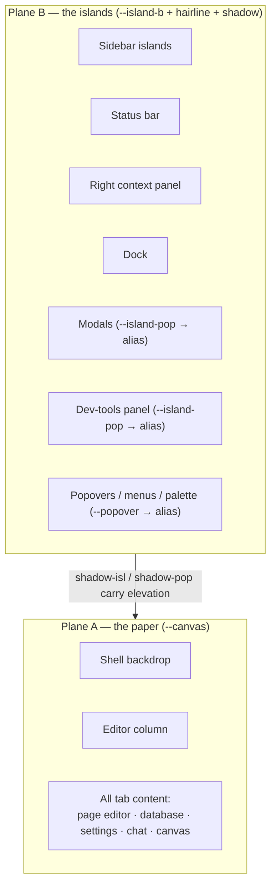
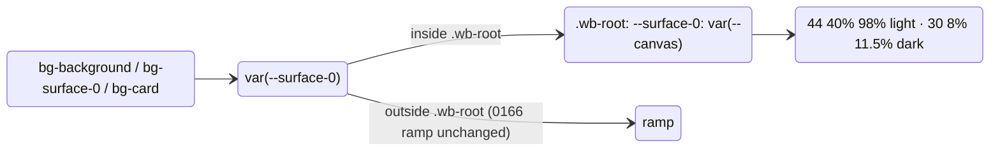

# Workbench Background Plane Consistency — One Surface, One Island Fill

## Problem Statement

The Floating Islands shell (0286/0287) promises a single warm "paper" surface
with chrome floating on top as islands. In practice the illusion breaks in two
ways:

1. **Tab content doesn't match the backdrop.** The shell backdrop and the
   editor column paint `bg-canvas`, but the view roots rendered inside the
   tabs — page editor, database view, settings panel, chat, and others — paint
   `bg-surface-0`, `bg-surface-1`, `bg-secondary`, or `bg-background`. None of
   those resolve to the same color as `--canvas`, so every tab sits in a
   subtly (light mode) or visibly (dark mode) different rectangle instead of
   blending into the one surface everything is supposed to sit on.
2. **Overlays don't match the primary islands.** The left sidebar islands,
   bottom status bar, right context panel, and dock all fill with
   `bg-island-b`. But modals and the dev-tools panel fill with
   `bg-island-pop` (a deliberately different step introduced in 0287), and
   the whole popover family (menus, selects, context menus, command palette)
   fills with `bg-popover` (≈ `surface-0`). Three different fills for "a thing
   floating above the workbench."

Goal: audit every background in light and dark mode and converge on a
two-plane system — one color for the base surface (backdrop + all tab
content), one color for every island (chrome islands, modals, dev tools,
floating menus).

## Executive Summary

- The divergence is **structural, not accidental**: `.wb-root` in
  `packages/ui/src/theme/tokens.css` defines `--canvas` at `44 40% 98%`
  (light) / `30 8% 11.5%` (dark) but keeps `--surface-0` at a *different*
  value (`44 38% 97.5%` / `30 8% 13%`). Since `--background`, `--card`, and
  `--popover` all alias `--surface-0`, every consumer of those tokens is
  guaranteed to miss the canvas by 0.5 lightness points in light and 1.5 in
  dark — dark mode is where users notice.
- Overlays split three ways: `island-b` (93% / 7%), `island-pop` (88% / 15%),
  and `popover`→`surface-0` (97.5% / 13%). The user's ask collapses this to
  `island-b` everywhere.
- The fix is mostly **token aliasing inside `.wb-root`** (≈10 lines in
  `tokens.css`), not a class sweep: alias `--surface-0 → --canvas` and
  `--island-pop → --island-b`, and point `--popover` at `--island-b`. That
  instantly aligns every `bg-background`/`bg-surface-0`/`bg-card` view root,
  the Modal primitive, the dev-tools panel, and all floating menus.
- A small class sweep remains for view roots that paint `bg-surface-1` /
  `bg-secondary` (MapView, PluginsPanel, PanelViewHost, DatabaseView header)
  and for `DatabaseView.tsx`'s hardcoded `bg-white dark:bg-gray-900` popovers,
  which bypass tokens entirely.
- Elevation stops being carried by fill color and is carried by the existing
  shadow tokens (`--isl-shadow` vs `--pop-shadow`) plus hairline borders —
  the same doctrine 0166 already applies to structure ("structure felt, not
  seen").

## Current State In The Repository

### Token source of truth

All values live in `packages/ui/src/theme/tokens.css`. The Floating Islands
scope is `.wb-root` (light: lines ~381–402; dark via the descendant selector
`.dark .wb-root` at ~404–425 — dark comes from ThemeProvider on `<html>`, so
`.wb-root.dark` alone never matches on desktop). The mobile shell adds a
dark-only delta in `apps/web/src/styles/globals.css:37–42`
(`data-wb-shell='mobile'`).

Resolved values inside `.wb-root`:

| Token | Light | Dark | Consumed by |
| --- | --- | --- | --- |
| `--canvas` / `--island` | `44 40% 98%` | `30 8% 11.5%` | shell backdrop, editor column, dock pills |
| `--island-b` | `40 22% 93%` | `30 8% 7%` | sidebar islands, status bar, right panel, dock, dev-tools toggle |
| `--island-pop` | `40 22% 88%` | `30 8% 15%` | Modal, dev-tools panel, floating menus, What's New |
| `--surface-0` (= `--background`, `--card`, `--popover`) | `44 38% 97.5%` | `30 8% 13%` | most view roots, popover family |
| `--surface-1` | `42 26% 95%` | `32 8% 10%` | MapView, PluginsPanel, PanelViewHost |
| `--surface-2` (= `--secondary`, `--muted`) | `40 20% 92.5%` | `32 8% 8%` | DatabaseView header, hover washes |

The Tailwind mapping lives in `packages/ui/tailwind.config.js:25–34`:
`bg-canvas → hsl(var(--canvas, var(--surface-0)))`,
`bg-island-b → hsl(var(--island-b, var(--surface-1)))`,
`bg-island-pop → hsl(var(--island-pop, var(--popover)))` — so outside
`.wb-root` these classes gracefully fall back to the 0166 ramp.

Key structural fact: `.wb-root` overrides `--surface-0/1/2`, `--popover`,
`--card`, `--island*` — but **not** `--background`, `--secondary`, or
`--muted`. Those are defined once in `:root` as `var(--surface-*)` aliases
(tokens.css:67, 88, 91) and re-resolve per element, so they inherit the
wb-root values transitively. This is why aliasing at the `--surface-*` level
propagates everywhere.

### Where each surface actually paints (audit results)

**Shell chrome — consistent, the reference implementation:**

- Backdrop: `bg-canvas` — `apps/web/src/workbench/FloatingFrame.tsx:49`
- Editor column: `bg-canvas` — `FloatingFrame.tsx:60` (deliberately not an
  island; "the document reads as the brightest, most-forward plane")
- Sidebar islands: `bg-island-b` — `apps/web/src/workbench/SidebarIslands.tsx:47`
- Right context island: `bg-island-b` via the `ISLAND` const —
  `FloatingFrame.tsx:30,68`
- Status bar island: `bg-island-b` — `FloatingFrame.tsx:78`
- Dock: `bg-island-b` — `apps/web/src/workbench/FloatingDock.tsx:33,96,160`
- Dev-tools toggle island: `bg-island-b` —
  `apps/web/src/workbench/DevToolsIsland.tsx:25`
- Tab strip + content frame: `bg-canvas` when `tabVariant === 'pill'`
  (the floating shell), else `bg-surface-0` —
  `apps/web/src/workbench/EditorArea.tsx:227` (also `:335`)

**Tab content roots — the plane-A mismatch:**

| View | Class | File |
| --- | --- | --- |
| Page editor | `bg-surface-0` | `apps/web/src/components/PageView.tsx:485` |
| Settings tab | `bg-surface-0` | `apps/web/src/routes/settings.tsx:85` |
| Settings (composed) | `bg-background` | `packages/ui/src/composed/SettingsView.tsx:156` |
| Chat channel | `bg-surface-0` | `apps/web/src/comms/ChannelView.tsx:170` (+ `ThreadPane.tsx:98`) |
| Database header | `bg-secondary` | `apps/web/src/components/DatabaseView.tsx:464` |
| Canvas | `bg-background` | `CanvasView.tsx` |
| Map / Plugins | `bg-surface-1` | `MapView`, `PluginsPanel` |
| Panel host (side slots) | `bg-surface-1` | `PanelViewHost.tsx:126,141` |
| Person/Tag/Space/Marketplace | `bg-surface-0` | various |

None use `bg-canvas`. The inner `<main>` of `ViewHost.tsx:67` and
`EditorArea.tsx:176` is transparent — the shell *already* expects views not
to need their own base paint.

**Overlays — the plane-B split:**

- Modal primitive: `bg-island-pop shadow-pop` —
  `packages/ui/src/primitives/Modal.tsx:71,231`
- Dev-tools panel: `bg-island-pop shadow-pop` —
  `packages/devtools/src/panels/Shell.tsx:440` (docstring at `:6` says "the
  same recipe the app's Modal and hover panels use" — internally consistent
  with 0287, but 0287's "a step darker than the chrome islands" is exactly
  what the user now wants removed)
- Floating shell menus: `bg-island-pop` —
  `apps/web/src/workbench/FloatingMenus.tsx`, `mobile-overlays.tsx`,
  `apps/web/src/whats-new/WhatsNewButton.tsx:89`
- Popover family: `bg-popover` (= `surface-0`) —
  `packages/ui/src/primitives/Popover.tsx:51,125,173`, `Menu.tsx:40,156,328`,
  `ContextMenu.tsx:53,98,279`, `Select.tsx:90,198`, `Command.tsx:27`,
  `composed/CommandPalette.tsx:306`, `ColorPicker.tsx:60`, `DatePicker.tsx:149`
- Sheet: `bg-background` — `packages/ui/src/primitives/Sheet.tsx:59`

**Token bypasses (hardcoded palette classes):**

- `apps/web/src/components/DatabaseView.tsx:700,778,849` —
  `bg-white dark:bg-gray-900` dialogs; `:746,806` — `bg-gray-50
  dark:bg-gray-800` hovers; plus a `focus:border-blue-400`. The only raw
  palette backgrounds found in workbench content.
- `apps/web/src/components/PageView.tsx:688–689` — inline rename dialog uses
  `bg-popover` + `bg-black/20` scrim instead of the Modal recipe.

### How the mismatch resolves per mode

```mermaid
flowchart LR
    subgraph light ["Light mode (.wb-root)"]
        LC["canvas 98%<br/>backdrop + editor"]
        LS0["surface-0 97.5%<br/>tab roots, popovers"]
        LS1["surface-1 95%<br/>Map, panel host"]
        LB["island-b 93%<br/>sidebar, status bar"]
        LS2["surface-2 92.5%<br/>DB header"]
        LP["island-pop 88%<br/>modals, devtools"]
    end
    LC -.:"Δ0.5 barely visible":.- LS0
    LS0 -.:"Δ2.5 visible":.- LS1
    LB -.:"Δ5 clearly split":.- LP
```

```mermaid
flowchart LR
    subgraph dark ["Dark mode (.dark .wb-root)"]
        DP["island-pop 15%<br/>modals, devtools (lightest!)"]
        DS0["surface-0 13%<br/>tab roots, popovers"]
        DC["canvas 11.5%<br/>backdrop + editor"]
        DS1["surface-1 10%"]
        DS2["surface-2 8%"]
        DB["island-b 7%<br/>sidebar, status bar (darkest)"]
    end
    DP -.:"Δ8 pts — modal vs island":.- DB
    DS0 -.:"Δ1.5 — every tab visibly lighter than backdrop":.- DC
```

In dark mode the split is worst: a tab's content rectangle (13%) floats
lighter than the canvas around it (11.5%), and a modal (15%) is **8 lightness
points** away from the sidebar island (7%) it's supposed to match.

## External Research

- **Material 3** moved dark-mode elevation from shadows to *tonal elevation* —
  lighter surface = higher elevation — and formalized it as a ladder of
  `surface-container-*` tokens ([M3 design tokens](https://m3.material.io/foundations/design-tokens/overview),
  [M3 elevation tokens](https://m3.material.io/styles/elevation/tokens)).
  That is precisely the model 0287 borrowed for `--island-pop` ("in dark,
  elevation reads as a touch lighter"). The user's request is a deliberate
  departure from M3 toward a **flat two-plane** model where elevation is
  carried by shadow and border only. That is legitimate and has strong prior
  art: Linear, Things, and macOS system chrome all use one uniform panel
  fill with shadow-carried elevation.
- Dark-mode design-system guidance stresses keeping the number of distinct
  surface luminances *small and named*, because unnamed near-misses (97.5 vs
  98) are exactly how drift happens ([Muzli dark-mode systems guide](https://muz.li/blog/dark-mode-design-systems-a-complete-guide-to-patterns-tokens-and-hierarchy/),
  [design-tokens for dark mode](https://medium.muz.li/unlocking-the-power-of-design-tokens-to-create-dark-mode-ui-18c0802b094e)).
- Token-architecture write-ups converge on a two-level semantic split that
  matches what we need: a `bg/base` (deepest page surface) vs `bg/surface`
  (anything sitting on top) pair, with components never reaching past the
  semantic layer to raw palette values ([Design System Chronicles — semantic
  colour tokens](https://www.fourzerothree.in/p/semantic-colour-tokens-in-action),
  [Feature-Sliced Design token architecture](https://feature-sliced.design/blog/design-tokens-architecture),
  [UXPin on color consistency](https://www.uxpin.com/studio/blog/color-consistency-design-systems/)).
  `DatabaseView`'s `bg-white dark:bg-gray-900` is the textbook violation this
  architecture exists to prevent.

## Key Findings

1. **The mismatch is defined in one file.** `.wb-root` gives `--surface-0` a
   value 0.5/1.5 lightness points off `--canvas` instead of aliasing it. Every
   downstream consumer (`--background`, `--card`, `--popover`,
   `bg-surface-0`) inherits the miss. There is no evidence the 97.5-vs-98
   split is load-bearing — no component depends on distinguishing canvas from
   surface-0.
2. **Views paint bases they don't own.** `ViewHost`/`EditorArea` already
   provide a painted `bg-canvas` frame; view roots that re-paint
   `bg-surface-0/1`/`bg-secondary` are redundant at best and wrong in the
   floating shell. The architecture wants "hosts paint the base; views are
   transparent."
3. **`--island-pop` is now a bug, not a feature.** It was introduced (0287)
   to differentiate overlays; the design direction has changed to a single
   island fill. The token should survive as an *alias* of `--island-b` so the
   ~7 consumer files need no edits and the decision is one-line reversible.
4. **The popover family is a third, accidental fill.** `--popover` maps to
   `surface-0` inside `.wb-root`, so menus/selects/palettes are near-white
   cards in light mode while modals are clay. Pointing `--popover` at
   `--island-b` inside `.wb-root` puts every floating element on one fill.
   (Outside `.wb-root` — onboarding, public pages — `--popover` keeps its
   0166 ramp value; the change is scoped.)
5. **Only one component hardcodes colors**: `DatabaseView.tsx` (`bg-white`,
   `bg-gray-*`, `border-blue-400`). Everything else is token-clean, which is
   why the token-level fix has such high leverage.
6. **Dark-mode consequence to accept:** with `island-pop → island-b`, modals
   in dark mode become *darker* than the canvas (7% vs 11.5%) instead of
   lighter (15%). Elevation must then be carried entirely by `--pop-shadow`
   and the hairline border. This matches the sidebar's existing look and is
   what the user asked for, but it is the one aesthetic judgment call worth
   eyeballing before merge.

## Options And Tradeoffs

### Option A — Class sweep only

Change every deviating `className` (`bg-surface-0` → `bg-canvas`,
`bg-island-pop` → `bg-island-b`, etc.).

- ✅ Explicit; no token semantics change; per-surface control.
- ❌ ~25 files; misses future drift (the next view written with
  `bg-background` re-breaks it); doesn't fix `bg-background`/`bg-card`
  consumers whose token *value* is still wrong; churns `packages/ui`
  primitives that are correct today (`Modal` already uses the right token).

### Option B — Token aliasing only

Inside `.wb-root` (light + dark + mobile delta): `--surface-0: var(--canvas)`,
`--island-pop: var(--island-b)`, `--popover: var(--island-b)`.

- ✅ ~10 lines in `tokens.css`; fixes all `bg-background`/`bg-surface-0`/
  `bg-card`/`bg-popover`/`bg-island-pop` consumers at once, in both modes,
  including mobile; trivially reversible.
- ❌ Doesn't fix `bg-surface-1`/`bg-secondary` view roots (they're
  legitimately *different* tokens still needed for hover washes and inset
  panels — collapsing them would destroy intra-island contrast); doesn't fix
  the hardcoded `DatabaseView` colors.

### Option C — Hybrid: token aliasing + targeted class fixes + guard (recommended)

Option B, plus: convert the handful of `bg-surface-1`/`bg-secondary` view
roots to transparent (host paints) or `bg-canvas`, replace `DatabaseView`'s
hardcoded palette classes with tokens, and add a zero-tolerance grep gate for
raw palette backgrounds in workbench code so drift can't silently return.

- ✅ Complete fix; smallest diff that is complete; future-proofed; gate is
  decidable-green immediately after the fix (0294 policy: named consumer =
  the lint lane, pass condition = zero matches).
- ❌ Slightly more work than B; the popover recolor is a visible (intended)
  change in light mode that should be screenshot-reviewed.

### Two-plane target model





## Recommendation

Adopt **Option C**. Concretely:

1. In `packages/ui/src/theme/tokens.css` `.wb-root` (both scopes): alias
   `--surface-0: var(--canvas)` (which transitively fixes `--background`,
   `--card`, and the existing `--popover: var(--surface-0)` chain would too —
   but point `--popover: var(--island-b)` instead so the popover family joins
   the island plane) and `--island-pop: var(--island-b)`. Keep `--pop-shadow`
   untouched — it becomes the sole elevation cue for overlays.
2. Convert the `bg-surface-1`/`bg-secondary`/redundant-`bg-surface-0` **view
   roots** to transparent (preferred — `EditorArea`/`ViewHost`/
   `PanelViewHost` hosts paint the base) or `bg-canvas` where the view is
   also used outside a painted host. Intra-view uses of `surface-1/2` (cards,
   hovers, insets) stay.
3. Replace `DatabaseView.tsx` hardcoded `bg-white dark:bg-gray-900` /
   `bg-gray-50 dark:bg-gray-800` / `focus:border-blue-400` with
   `bg-popover` / `hover:bg-accent` / `focus:border-border-emphasis`, and its
   header `bg-secondary` with transparent.
4. Add a repo gate (extend the existing lint lane) failing on
   `bg-(white|black|gray-\d|slate-\d|zinc-\d|neutral-\d|stone-\d)` and inline
   hex/hsl `background` in `apps/web/src`, `packages/ui/src`,
   `packages/devtools/src`, `packages/views/src`, `packages/react/src`
   (scrims like `bg-black/20` excepted via `/\d` opacity suffix allowance —
   or migrate scrims to a `--scrim` token and allow nothing).
5. Screenshot-review light + dark before merge, specifically: modal over a
   page tab in dark mode (now darker-than-canvas, shadow-carried) and a
   dropdown menu in light mode (now clay instead of white).

## Example Code

```css
/* packages/ui/src/theme/tokens.css — .wb-root (light) */
.wb-root {
  --canvas: 44 40% 98%;
  --island: var(--canvas);
  --island-b: 40 22% 93%;
  /* 0299: overlays share the chrome-island fill; --pop-shadow alone
     carries elevation. Kept as an alias so consumers stay untouched. */
  --island-pop: var(--island-b);
  /* 0299: the base plane IS the canvas — no more 97.5-vs-98 near-miss.
     --background/--card follow transitively via :root aliases. */
  --surface-0: var(--canvas);
  --surface-1: 42 26% 95%;
  --surface-2: 40 20% 92.5%;
  /* 0299: floating menus join the island plane. */
  --popover: var(--island-b);
  --card: var(--surface-0);
  /* …hairline/accent/shadows unchanged… */
}

.dark .wb-root,
.wb-root.dark {
  --canvas: 30 8% 11.5%;
  --island: var(--canvas);
  --island-b: 30 8% 7%;
  --island-pop: var(--island-b);
  --surface-0: var(--canvas);
  --surface-1: 32 8% 10%;
  --surface-2: 32 8% 8%;
  --popover: var(--island-b);
  --card: var(--surface-0);
}
```

```tsx
// apps/web/src/components/PageView.tsx:485 — host paints the base
- <div className="flex h-full min-h-0 flex-col bg-surface-0">
+ <div className="flex h-full min-h-0 flex-col">

// apps/web/src/components/DatabaseView.tsx:700 — tokens, not palette
- className="absolute z-50 w-64 rounded-lg border border-border bg-white dark:bg-gray-900 shadow-xl p-2"
+ className="absolute z-50 w-64 rounded-lg border border-hairline bg-popover shadow-pop p-2"
```

## Risks And Open Questions

- **Dark-mode modal inversion.** Modals go from lightest surface (15%) to
  darkest (7%). If the shadow doesn't carry enough elevation on low-quality
  displays, the fallback is to keep `--island-pop` distinct *only in dark*
  — but that re-breaks the user's stated requirement; prefer accepting and
  eyeballing first.
- **Light-mode popover recolor** (white → clay 93%) touches every menu in the
  app. Inputs/hover states inside popovers use `surface-2`/`accent`
  (92.5%/89.5%) which are within 1 point of the new fill — hover affordance
  inside menus needs a contrast check; may need `--accent` nudged darker
  inside `.wb-root`.
- **Views rendered outside a painted host** (storybook, panel embeds, mobile
  sheets): making roots transparent assumes every host paints. `MobileShell`
  and `PanelViewHost` do; storybook decorators may need a `bg-canvas`
  wrapper.
- **`EditorArea`'s non-pill path** (`bg-surface-0` at `:227,:335`) is used by
  other shells; with the alias it matches automatically, so leave the class.
- **Cozy/linear variants** compose on top of `.wb-root`; aliases are
  variant-agnostic (they reference tokens, not values), so they hold — but
  cozy dark should be in the screenshot pass.
- **Publishable-package impact:** `packages/ui` (tokens + possible primitive
  touches) and `packages/devtools` ship to npm — changesets required; this is
  a visual patch/minor, no API change.
- Open question: should `--island` (currently ≡ `--canvas`) be formally
  aliased and documented as "bright chip on an island," or retired? It has
  few consumers (`FloatingDock.tsx:94`, `Modal.tsx` headers, mobile
  overlays); recommend aliasing to `var(--canvas)` and documenting.

## Implementation Checklist

- [x] `tokens.css`: alias `--surface-0: var(--canvas)`, `--island:
      var(--canvas)`, `--island-pop: var(--island-b)`, `--popover:
      var(--island-b)` in `.wb-root` light + dark scopes; update the 0286/0287
      doc-comments to describe the two-plane doctrine.
- [x] `apps/web/src/styles/globals.css` mobile delta: confirm the dark
      mobile overrides still resolve correctly through the new aliases (they
      set `--canvas`/`--island-b` directly, so aliases follow — verify).
- [x] Remove redundant base paints from view roots: `PageView.tsx:485`,
      `routes/settings.tsx:85`, `ChannelView.tsx:170`, `ThreadPane.tsx:98`,
      `SettingsView.tsx:156`, Person/Tag/Space/Marketplace views,
      `MapView`/`PluginsPanel` (`bg-surface-1`), `PanelViewHost.tsx:126,141`.
- [x] `DatabaseView.tsx`: header `bg-secondary` → transparent (`:464`);
      dialogs `bg-white dark:bg-gray-900` → `bg-popover` + `shadow-pop`
      (`:700,778,849`); hovers `bg-gray-50 dark:bg-gray-800` →
      `hover:bg-accent` (`:746,806`); `focus:border-blue-400` →
      `focus:border-border-emphasis`.
- [x] `PageView.tsx:688` rename dialog → Modal primitive or `bg-island-pop
      shadow-pop` recipe.
- [x] `Sheet.tsx:59` `bg-background` → verify it resolves to canvas via alias
      (it will) — or switch to `bg-island-b` if sheets should read as islands.
- [ ] Add hardcoded-background gate to the lint lane (zero matches on raw
      palette background classes in workbench packages); wire as a blocking
      check per 0294 (named consumer: CI lint job; decidable: zero-count).
- [ ] Changesets for `@xnetjs/ui` and `@xnetjs/devtools` (patch).
- [ ] Update `packages/ui/DESIGN_SYSTEM.md` with the two-plane doctrine.

## Validation Checklist

- [ ] Light mode: page editor, database view, settings, chat, canvas tabs all
      pixel-match the backdrop around the islands (eyedropper or
      `preview_inspect` computed `background-color` equality with `.wb-root`).
- [ ] Dark mode: same check — no tab rectangle visible against the canvas.
- [ ] Modal, dev-tools panel, floating menus, command palette, dropdowns,
      context menus, selects all compute the same `background-color` as the
      sidebar island, light and dark.
- [ ] Dark-mode modal still reads as elevated (shadow + hairline) — visual
      sign-off.
- [ ] Menu hover states remain distinguishable on the new island fill
      (APCA/contrast spot-check on `--accent` vs `--island-b`).
- [ ] Cozy and linear variants, true-black OLED, and the mobile shell render
      without regressions (variant screenshot pass).
- [ ] Non-workbench surfaces (onboarding, public share pages, site) are
      unchanged — aliases are `.wb-root`-scoped.
- [ ] Grep gate green: zero raw palette background classes in scoped
      packages.
- [ ] Existing visual-capture CI screenshots (0185) updated and reviewed.

## References

- `packages/ui/src/theme/tokens.css` — token source of truth (`.wb-root`
  scopes)
- `packages/ui/tailwind.config.js:25–34` — island class mapping
- `apps/web/src/workbench/FloatingFrame.tsx` — reference island usage
- `docs/explorations/0286_*` Floating Islands; `0287_*` overlay islands
  (`--island-pop` origin); `0166_*` monochrome ramp doctrine
- [Material 3 design tokens](https://m3.material.io/foundations/design-tokens/overview) ·
  [M3 elevation tokens](https://m3.material.io/styles/elevation/tokens)
- [Dark Mode Design Systems guide (Muzli)](https://muz.li/blog/dark-mode-design-systems-a-complete-guide-to-patterns-tokens-and-hierarchy/)
- [Design tokens for dark mode (Muzli/Medium)](https://medium.muz.li/unlocking-the-power-of-design-tokens-to-create-dark-mode-ui-18c0802b094e)
- [Semantic colour tokens in action (Design System Chronicles)](https://www.fourzerothree.in/p/semantic-colour-tokens-in-action)
- [Design-tokens architecture (Feature-Sliced Design)](https://feature-sliced.design/blog/design-tokens-architecture)
- [Color consistency in design systems (UXPin)](https://www.uxpin.com/studio/blog/color-consistency-design-systems/)
