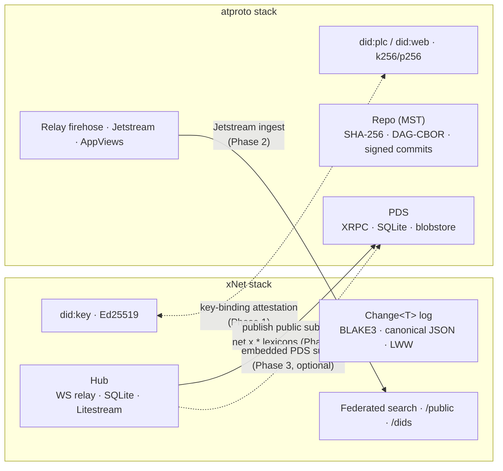
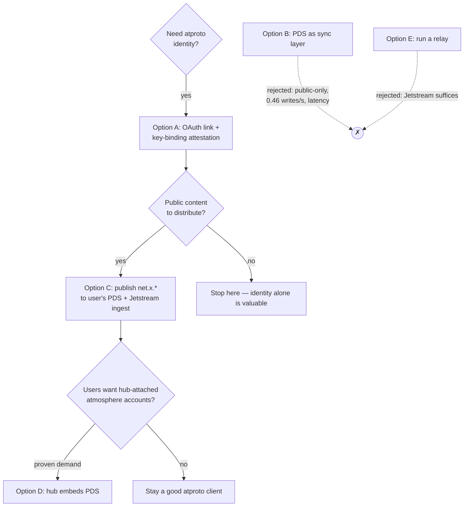
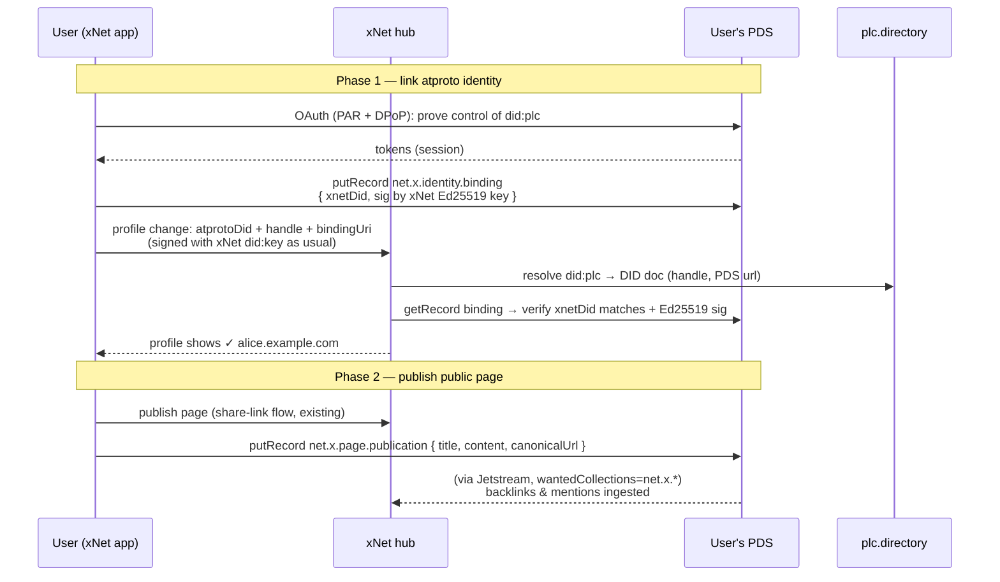

# ATProto Integration — Identity, Sync, And The Hub As A PDS/Relay

## Problem Statement

AT Protocol (atproto, the protocol under Bluesky) has become the largest live
deployment of the ideas xNet is built on: user-owned identities (DIDs), signed
content-addressed data repos, self-hostable personal servers, and an open
federation layer. The questions this exploration answers:

1. **Identity** — can xNet use atproto for identity? "Login with Bluesky,"
   domain-name handles (`alice.example.com`), portable `did:plc` accounts —
   can these become (or augment) xNet identities?
2. **Sync** — could atproto serve as a sync server or an alternative to the
   xNet hub? Users already pay for / run a PDS; could their PDS hold their
   xNet data?
3. **Serving the network** — could the xNet hub or cloud service itself act as
   an AT PDS and/or relay, so an xNet install *is* an atmosphere citizen?

## Executive Summary

**The two protocols are cousins with incompatible organs.** Both are built on
DIDs, signed hash-linked logs, content addressing, and self-hostable personal
servers. But every concrete choice differs: xNet is `did:key` + Ed25519 +
BLAKE3 + canonical JSON + private-by-default E2E-signed LWW log; atproto is
`did:plc`/`did:web` + secp256k1/P-256 + SHA-256/CIDv1 + DAG-CBOR Merkle Search
Trees + **public-only** repos. Neither can impersonate the other's kernel
cheaply — but they compose extremely well at the *edges*.

**Identity: yes, as a bridged layer — not a replacement.** Atproto OAuth
("Login with Bluesky") is a mature, registration-free flow with good client
libraries (`@atproto/oauth-client-browser` / `-node`). But atproto signing
keys are ECDSA (k256/p256) and xNet's entire change log signs with Ed25519
`did:key`s — and `did:key` can never be a `did:plc` rotation key. So the right
model is a **bidirectional key-binding attestation**: the user's atproto DID
publishes a signed record in their PDS saying "this xNet `did:key` is me," and
the xNet profile node records the atproto DID + handle. xNet gains globally
unique, DNS-verified handles (today's `ProfileSchema.handle` is explicitly a
non-unique display slug), account continuity (did:plc rotates keys; `did:key`
cannot — the exact gap exploration 0149 left open), and social proof — without
touching the signing kernel.

**Sync: no — the PDS cannot be the collaborative substrate.** Three hard
blockers: (1) atproto repos are **entirely public** — xNet's private,
E2E-signed workspace data cannot live there; the "permissioned data / spaces"
proposal is a 2026 pre-implementation sketch and even then is server-visible,
never E2EE. (2) Write budget: ~5,000 points/hour per account (~1,666
creates/hr, ≈0.46/s sustained) versus xNet's 40 changes/sec client throttle —
two orders of magnitude short of collaborative editing. (3) Commit-per-write
MST overhead plus multi-second firehose latency. Every serious local-first ×
atproto project (Roomy, Jake Lazaroff's Yjs-over-PDS, Groundmist) converged on
the same shape: **own sync channel for live data; atproto for identity,
discovery, public artifacts, and periodic snapshots**. That shape is exactly
"xNet hub + PDS on the side."

**Hub as PDS: feasible, real leverage, but sequence it last.** The hub already
has the operational shape of a PDS (Hono + SQLite + Litestream, per-DID
subject-only rooms, public read routes, cursor-based backfill ≈
`getRepo`/`subscribeRepos`), and alternative PDS implementations (millipds,
rsky/Blacksky) prove the surface is implementable. Embedding `@atproto/pds`
(or speaking `com.atproto.*` XRPC natively) would make every self-hosted hub a
real atmosphere account host — a genuinely differentiating story ("your hub is
your PDS"). But it's a big lift (MST repo engine, PLC registration, OAuth AS,
service proxying) that only pays off after identity + publishing exist.
**A relay: no.** Relays are cheap (~$34/mo for the whole network) but serve no
xNet need — consume **Jetstream** with a `wantedCollections` filter instead.

**Recommendation: a three-phase bridge, no kernel changes.**
Phase 1 — atproto identity linking (OAuth client + key-binding attestation +
verified handles on profiles). Phase 2 — "Publish to the atmosphere": public
pages/posts written to the user's PDS under xNet lexicons (`net.x.*`), the
existing share-link flow gaining an atproto distribution channel, and hub-side
Jetstream ingestion for backlinks/mentions. Phase 3 (option, demand-gated) —
hub-embedded PDS so self-hosters and the managed cloud fleet host real atproto
accounts. The multi-home replication manifest (0258) already models "route
this Space to that destination" — an atproto PDS becomes one more destination
kind, not a new architecture.

## Current State In The Repository

xNet already has every *concept* atproto has — under different, incompatible
concrete choices. The portable-protocol exploration
([0200](0200_%5Bx%5D_PORTABLE_XNET_PROTOCOL_BOUNDARIES_AND_STANDARD.md))
surveyed atproto's MST/DAG-CBOR design directly and consciously chose a
single-codec BLAKE3/canonical-JSON path.

### Identity kernel — `did:key`, Ed25519, no rotation

- [`packages/identity/src/did.ts`](../../packages/identity/src/did.ts) —
  `createDID()` builds `did:key:z…` from a 32-byte Ed25519 key (multicodec
  `0xed01`, base58btc). `parseDID()` **hard-rejects anything that isn't
  `did:key` with the Ed25519 codec** — `did:web`/`did:plc` throw
  ([`did.test.ts:27`](../../packages/identity/src/did.test.ts)). The type is
  literally `` type DID = `did:key:${string}` ``
  ([`types.ts:12`](../../packages/identity/src/types.ts)).
- [`packages/crypto/src/signing.ts`](../../packages/crypto/src/signing.ts) —
  Ed25519 via `@noble/curves`; X25519 encryption keys derived birationally
  from the signing key; optional post-quantum hybrid (ML-DSA-65) at security
  levels 1–2 ([`hybrid-signing.ts`](../../packages/crypto/src/hybrid-signing.ts)).
- Recovery ([0243](0243_%5Bx%5D_ACCOUNT_VALIDATION_AND_RECOVERY_BINDING_THE_PAYER_TO_THE_PASSKEY.md)):
  recovery phrase → deterministic re-derivation
  ([`recoverable.ts`](../../packages/identity/src/recoverable.ts)), GF(256)
  Shamir guardian shares
  ([`seed-recovery.ts`](../../packages/identity/src/seed-recovery.ts)),
  PIN escrow, and a WorkOS billing-identity ↔ DID binding
  ([`packages/cloud/src/identity/binding.ts`](../../packages/cloud/src/identity/binding.ts)).
  Crucially, **a `did:key` *is* its key** — there is no rotation or account
  continuity if the key must change. Exploration
  [0149](0149_%5B_%5D_IDENTITY_AND_ACCOUNT_RECOVERY.md) (unbuilt) proposes an
  account-root/device-ledger layer to fix exactly this; `did:plc` is a
  production implementation of that idea.
- Profiles: canonical `profile-<did>` node
  ([`packages/data/src/schema/schemas/profile.ts:68`](../../packages/data/src/schema/schemas/profile.ts)),
  public-read / subject-only-write enforced at the hub
  ([`packages/hub/src/ws/authorize.ts:130-143`](../../packages/hub/src/ws/authorize.ts)).
  The `handle` field is **documented as a workspace-local display slug — global
  uniqueness explicitly out of scope**. The `packages/social` importer enum
  already includes `'atproto'` as a source platform.

### The change log — repo-shaped, but not an atproto repo

- [`packages/sync/src/change.ts`](../../packages/sync/src/change.ts) —
  `Change<T>`: content hash `cid:blake3:<hex>` over recursively key-sorted
  canonical JSON, Ed25519 signature over the hash string, `parentHash` chain,
  Lamport + author-DID LWW ordering, `CURRENT_PROTOCOL_VERSION = 3`.
- Conceptually parallel to an atproto repo of signed records — but the hash
  (BLAKE3 vs SHA-256/CIDv1), encoding (JSON vs DAG-CBOR), structure (linear
  per-author chain vs MST), and curve (Ed25519 vs k256/p256) all differ.
  Becoming a PDS means emitting a **second serialization**, not reusing
  `computeChangeHash`.

### The hub — already PDS-shaped operationally

- [`packages/hub/src/server.ts`](../../packages/hub/src/server.ts) — Hono +
  `ws` on one HTTP server; better-sqlite3 storage
  ([`storage/sqlite.ts`](../../packages/hub/src/storage/sqlite.ts)) with
  Litestream → R2 (~1 s RPO). This is the *exact* operational shape of the
  official PDS distribution (Node + SQLite + Caddy + object-storage backup).
- Relay loop ([`services/node-relay.ts:128`](../../packages/hub/src/services/node-relay.ts)):
  verify hash → verify Ed25519 signature against `authorDID` → dedupe by hash
  → append → fan out. Backfill is `node-sync-request(sinceLamport)` →
  `node-sync-response(changes, highWaterMark)` — a cursor-based
  export/subscribe pair spiritually identical to
  `com.atproto.sync.getRepo` + `subscribeRepos`.
- Already-public surfaces: `GET /public/node/:id`, `GET /public/space/:id`
  ([`routes/public.ts`](../../packages/hub/src/routes/public.ts)); DID
  discovery registry `GET /dids/:did`
  ([`routes/dids.ts`](../../packages/hub/src/routes/dids.ts)); hub-signed
  federated search with reciprocal-rank fusion
  ([`services/federation.ts`](../../packages/hub/src/services/federation.ts));
  an opt-in reputation-gated web crawler + sharded FTS index
  ([`services/crawl.ts`](../../packages/hub/src/services/crawl.ts)). Cross-hub
  sharing exists — it just speaks xNet-native formats, not Lexicon/XRPC.
- Protocol-skew defenses (0224): the client halts outbound after 5 structural
  rejections (`INVALID_HASH` breaker,
  [`node-store-sync-provider.ts`](../../packages/runtime/src/sync/node-store-sync-provider.ts)) —
  a reminder that *any* second wire dialect must be versioned deliberately.

### Multi-home routing — the natural seam for "PDS as destination"

[0258](0258_%5B_%5D_MULTI_HOME_SYNC_FEDERATED_HUBS_PEERS_AND_THE_REPLICATION_MANIFEST.md)
made the **Space the replication unit** with `xnet://<did>/space/<id>/`
namespaces:
[`replication-scope.ts`](../../packages/runtime/src/sync/replication-scope.ts)
turns per-Space policies (themselves synced nodes — "manifest as data") into a
routing config, and
[`MultiHubSyncManager.ts`](../../packages/runtime/src/sync/MultiHubSyncManager.ts)
fans rooms out to only the policy-selected hubs. A destination already carries
`url` + `trust` (`'trusted' | 'zero-knowledge'`). **An atproto PDS is one more
destination kind** — with `trust: 'zero-knowledge'` semantics mandatory, since
repos are public.

### The cloud — fleet economics that transfer directly

[`apps/cloud`](../../apps/cloud/src/server.ts) provisions, bills, hibernates,
and health-checks a per-tenant hub fleet (Cloud Run/Fargate + Litestream,
WorkOS ↔ DID binding, Stripe metering). Managed-PDS hosting is the *same*
operational business: 1 GB RAM/20 GB disk per small PDS, SQLite + object
storage. If the hub ever embeds a PDS, the cloud already knows how to run a
fleet of them.

### Stack alignment at a glance

| Layer | xNet | atproto | Compatible? |
|---|---|---|---|
| DID method | `did:key` (Ed25519-only, no rotation) | `did:plc` / `did:web` (rotation, recovery window) | ✗ — bridge via attestation |
| Signing curve | Ed25519 (+ optional ML-DSA hybrid) | secp256k1 / P-256 (ECDSA) | ✗ — keys cannot be shared |
| Hash / addressing | BLAKE3, `cid:blake3:<hex>` | SHA-256, CIDv1 | ✗ |
| Encoding | canonical JSON (sorted keys) | DAG-CBOR | ✗ |
| Log structure | linear per-author hash chain, Lamport LWW | MST of records, signed commits, TID revs | ✗ — second serialization needed |
| Privacy | private by default, E2E-signed, zero-knowledge relay option | **public-only repos** (permissioned "spaces" = 2026 sketch, non-E2EE) | ✗ for private data; ✓ for public artifacts |
| Handles | workspace-local display slug | globally unique DNS-verified domains | ✓ — pure win to adopt |
| Personal server | hub (Hono + SQLite + Litestream) | PDS (Node + SQLite + blobstore) | ✓ — same operational shape |
| Federation | hub-signed federated search, DID registry | relay firehose, Jetstream, AppViews | ✓ — complementary |



## External Research

State of the atmosphere as of mid-2026 (sources in [References](#references);
details flagged where pre-implementation/draft).

### Identity and OAuth

- Atproto blesses exactly two DID methods. **`did:plc`**: DID =
  `did:plc:` + 24 chars of base32(SHA-256(DAG-CBOR genesis op)); a public,
  self-certifying, hash-chained op log at `plc.directory`; 1–5
  priority-ordered **rotation keys** (k256/p256 only) with a **72-hour
  recovery window** in which a higher-priority key can fork history — i.e.
  built-in account recovery, the thing `did:key` structurally lacks.
  **`did:web`**: hostname-bound, for those who own domains.
- A DID document carries the handle (`alsoKnownAs: at://…`, verified
  bidirectionally via DNS TXT `_atproto.<handle>` or
  `/.well-known/atproto-did`), the `#atproto` signing key, and the
  `#atproto_pds` service endpoint.
- **Atproto OAuth** is a profiled OAuth 2.x: `client_id` is a URL to a
  self-hosted client-metadata JSON (no registration anywhere), PAR required,
  **DPoP mandatory** with server nonces, the user's PDS is the authorization +
  resource server, discovery via `/.well-known/oauth-protected-resource`.
  Access tokens <30 min; public clients cap ~2-week sessions; confidential
  clients (`private_key_jwt`) get 180-day refresh tokens. Granular permission
  sets shipped by Spring 2026. Libraries:
  `@atproto/oauth-client-browser` (SPA), `@atproto/oauth-client-node`
  (backend/Electron; needs session+state stores and hosted client metadata),
  `@atproto/identity` (resolution).
- **Identity-only use by a non-atproto app is proven**: Aaron Parecki's
  IndieLogin.com added "Sign in with Bluesky" (Oct 2025) with zero other
  atproto involvement. Main pain: DPoP nonce retry choreography.
- Centralization caveat: `plc.directory` is a single registry (censor/DoS
  risk, not forgery risk). Improving: an independent PLC governance org was
  announced on the Spring 2026 roadmap and PLC gained WebSocket streaming
  (Jan 2026) enabling third-party live mirrors.

### The PDS as a data store

- A repo is an MST of DAG-CBOR records at `<collection NSID>/<record-key>`,
  content-addressed, with signed commits (monotonic TID `rev`), exportable as
  CAR files. **Repos are entirely public** — anyone can
  `com.atproto.sync.getRepo` any account. Deletes leave no tombstone.
- Limits (Bluesky-hosted; self-host configurable): record ~1 MiB CBOR
  (guidance: a few dozen KB); repos sized for single-digit millions of
  records; blobs 50 MB; **writes 5,000 points/hr, 35,000/day per account**
  (create=3/update=2/delete=1 → ~1,666 creates/hr ≈ 0.46/s sustained); a PDS
  may emit 50 evt/s to the relay; default relay policy trusts unknown PDSes
  for ≤100 accounts.
- **Private data**: nothing on-protocol today (Bluesky DMs are a centralized
  sidecar). The July 2026 "permissioned data" proposal (bluesky-social/
  proposals PR #94) sketches non-repo "spaces" with OAuth-scoped ACLs —
  explicitly draft, "likely to change," **server-visible, never E2EE**.
  Building on it now is building on sand; even finished it cannot hold
  xNet's E2E-signed private workspace model except as an untrusted transport.
- **Arbitrary app records are an established pattern**: WhiteWind
  (`com.whtwnd.blog.entry`), Smoke Signal (`events.smokesignal.*`),
  Frontpage, Leaflet, Tangled all store non-Bluesky lexicons in user PDSes.

### Prior art: local-first apps × atproto

Every serious attempt converged on the same architecture:

- **Roomy** (muni.town) — atproto for identity + discovery + snapshot backup
  only; live CRDT sync (Automerge→Loro) over their own WebSocket router;
  CRDT snapshots written to PDSes ~every 5 s as backup; own keyserver for
  encryption (eyeing Ink & Switch Keyhive for real E2EE).
- **Jake Lazaroff's Yjs-over-PDS PoC** — batched updates every 5 s into an
  `updates` collection; verdict: fine for resilient persistence, unusable for
  live editing (latency + public-data exposure).
- **Groundmist** (grjte) — local-first content with one-click *publish* of
  the public subset to the PDS: atproto as distribution, not sync.

### Running PDS/relay infrastructure

- Official PDS distribution: Docker (PDS + Caddy), SQLite-backed, built on
  `@atproto/pds`; 1 GB RAM / 1 core / 20 GB SSD serves 1–20 users;
  auto-announces to the `bsky.network` relay via `requestCrawl`. Gotcha:
  wiping and reinstalling under the same hostname desyncs relay state.
- A custom PDS must speak: `com.atproto.server.*` (or OAuth AS),
  `com.atproto.repo.*` (CRUD + `applyWrites` + `uploadBlob`),
  `com.atproto.sync.*` (`getRepo` CAR export, `getLatestCommit`,
  `subscribeRepos` firehose), identity/PLC ops, `serviceAuth` JWTs, and
  **service proxying** (`atproto-proxy` header forwarding to AppViews).
  Alternative implementations prove feasibility: millipds (Python), rsky
  (Rust, Blacksky — closest to production), bluepds, Cocoon (Go).
- Relays are non-archival since Sync v1.1 and cheap (whole-network reference
  relay ≈ 2 vCPU / 12 GB / ~$34/mo) — but a small app never needs one.
  **Jetstream** (relay-operated simplified JSON WebSocket with
  `wantedCollections`/`wantedDids` filters) is the consumption path: full
  firehose ~232 GB/day → Jetstream ~41 GB/day → filtered streams ~1 GB/day.

## Key Findings

1. **Identity composes; kernels don't.** Atproto keys are ECDSA k256/p256 and
   can never sign xNet's Ed25519 log; xNet `did:key`s can never be `did:plc`
   rotation keys. The bridge is attestation, not key reuse — and it buys xNet
   the three things its identity layer measurably lacks: globally unique
   verified handles, key rotation/account continuity (the unbuilt 0149), and
   an interoperable social identity.
2. **The PDS is a publishing organ, not a sync organ.** Public-only repos +
   ~0.46 writes/s/account + multi-second propagation ≠ collaborative
   workspace sync. xNet's client alone throttles at 40 changes/s. The hub
   is not replaceable by a PDS; the Roomy/Groundmist pattern (own sync +
   atproto edges) is exactly xNet's existing architecture.
3. **The hub is already 70 % of a PDS operationally, 0 % of one
   protocol-wise.** Same runtime shape (Node/SQLite/object-storage backup,
   per-DID subject-only writes, public reads, cursor backfill) — but every
   byte on the wire differs (XRPC/Lexicon/DAG-CBOR/MST/CAR vs
   JSON/BLAKE3/rooms). Embedding is a real project, not an adapter.
4. **"Relay" is the wrong ambition; "Jetstream consumer" is the right one.**
   Nothing in xNet needs a merged full-network firehose. Watching
   `net.x.*` lexicons (and mentions of linked DIDs) via Jetstream gives
   cross-hub discovery for near-zero cost.
5. **The multi-home manifest (0258) is the pre-built integration seam.**
   "Which changes go to which destination" already exists as policy-as-data;
   an atproto PDS slots in as a destination kind with public/snapshot
   semantics rather than requiring new architecture.
6. **Sequencing matters.** Identity linking is small and immediately
   valuable; publishing rides existing share-links (0295/0298) and makes the
   linking meaningful; hub-as-PDS is a heavy, demand-gated bet that both
   prior phases de-risk.

## Options And Tradeoffs

### Option A — atproto as an identity layer (linking + login)

Two sub-modes, not mutually exclusive:

- **A1: Link (recommended first).** Existing xNet identities attach an
  atproto account. OAuth proves control of the atproto DID; a `net.x.identity
  .binding` record in the PDS attests the xNet `did:key`; the xNet profile
  node gains `atprotoDid` + `atprotoHandle` fields, rendered as a verified
  handle. No change to key management, signing, or recovery.
- **A2: Login with atproto (onboarding).** New users sign in via their PDS;
  xNet derives/creates the local `did:key` as today (passkey/recovery-phrase)
  and auto-links. The atproto session also becomes a *recovery signal* for
  the 0243 binding flow (a second custodial-ish anchor besides WorkOS).

| | For | Against |
|---|---|---|
| A1 | Small, additive; verified global handles fix a real gap; social proof; no PDS availability dependency after linking | Two DIDs per person to explain; attestation must be revocable; needs `packages/identity` to *represent* (not verify-sign-with) foreign DIDs |
| A2 | Zero-friction onboarding for the existing Bluesky population; recovery anchor | Login depends on the user's PDS being up; DPoP + confidential-client plumbing in hub/cloud; xNet key custody story must stay clearly separate |

### Option B — atproto as the sync server / hub alternative

Store xNet changes (or Yjs snapshots) in user PDSes; drop or demote the hub.

**Rejected.** Public-only repos violate xNet's privacy model outright;
encrypted-blob dumping into public repos is rate-limited (~0.46 writes/s),
socially frowned upon, bloats the public firehose, and still leaks metadata
(who, when, how much). The permissioned-data proposal is pre-implementation
and never-E2EE. Latency is seconds, not the sub-100 ms xNet targets (0266).
The hub also does things a PDS never will: zero-knowledge encrypted relay,
UCAN room authorization, live presence, WebRTC signaling, query federation.

*Salvageable fragment:* an **encrypted Space snapshot** written to the user's
PDS daily/weekly as a last-resort backup (Roomy's pattern) — viable within
rate limits at low frequency, but should live behind the 0258 manifest as an
explicit destination the user opts into, and only once xNet's snapshot/
compaction primitive exists (it does not today; the change log is the only
canonical form).

### Option C — atproto as a distribution layer ("Publish to the atmosphere")

The public subset — published pages, blog-style posts, public profiles, share
links — mirrored as `net.x.*` lexicon records in the user's PDS. Hub consumes
Jetstream filtered to `net.x.*` for backlinks, mentions, and cross-hub
discovery. Complements the existing public routes (`/public/node/:id`) and
share-link machinery (0290/0295/0298): a share link gains an "also publish to
atproto" toggle; WhiteWind proved the lexicon-blog pattern works.

| For | Against |
|---|---|
| Real network effects: xNet content becomes citable/likeable/followable in the atmosphere; discovery without running any infra; rides existing share-link UX | Requires A first (need an atproto account to write to); public-only — UX must make the public/private boundary unmistakable; lexicon design is a public API commitment (NSID = domain-owned, e.g. `net.x.*` needs the domain) |

### Option D — hub embeds a PDS ("your hub is your PDS")

The self-hosted hub (and each managed cloud tenant hub) also serves
`com.atproto.*`: hosts the user's actual atproto account, repo, and blobs.
xNet's cloud fleet becomes a managed PDS host the way it is a managed hub
host today.

| For | Against |
|---|---|
| Strongest sovereignty story — one server, both protocols; kills the third-party-PDS availability dependency in A2; cloud fleet economics already built (`apps/cloud` provisioning/billing/Litestream); differentiating positioning | Heavy: MST repo engine, DAG-CBOR/CAR, XRPC, OAuth AS role, PLC op handling, relay `requestCrawl` etiquette, service proxying; ongoing spec-tracking burden (sync v1.1, permissioned-data churn); easiest path (embed `@atproto/pds` behind the hub's Caddy/Hono front) still means running a second account system inside the hub; hostname-reinstall desync gotcha |

Verdict: real but **demand-gated** — do it when linked-identity + publishing
usage proves users want their atmosphere presence attached to their hub.

### Option E — run an xNet relay / AppView

**Rejected (relay); deferred (AppView).** A relay serves whole-network
mirroring needs xNet doesn't have; Jetstream covers consumption. A tiny
"xNet AppView" — an index over all public `net.x.*` records network-wide —
is just Option C's Jetstream consumer grown up, and can live inside the
existing crawl/shard-index machinery (`services/crawl.ts`,
`shard-ingest.ts`) if cross-hub public search demands it.



## Recommendation

Adopt the **bridge, don't merge** posture, phased:

**Phase 1 — Identity link (small, ship first).** `@atproto/oauth-client-*`
integration; extend the DID type system to *represent* foreign DIDs
(`AnyDid = XNetDid | AtprotoDid`) without touching signing; bidirectional
binding — `net.x.identity.binding` record in the PDS (atproto side) +
`atprotoDid`/`atprotoHandle`/`atprotoBindingUri` on the profile schema (xNet
side); hub verifies bindings by resolving the DID doc + fetching the record,
caches the verification, renders verified handles. Electron/web use the
browser client; hub/cloud act as the confidential client for long sessions.

**Phase 2 — Publish to the atmosphere.** Design 2–3 lexicons max
(`net.x.page.publication`, `net.x.profile.workspace`, arguably that's it —
lexicons are forever); wire an "also publish to atproto" toggle into the
share-link flow; write-through on publish/update within rate limits; hub
Jetstream consumer for `net.x.*` → backlink/mention nodes. Model the PDS as a
0258 replication destination kind (`kind: 'atproto-pds'`, public-only,
snapshot cadence) so routing stays manifest-as-data.

**Phase 3 (optional, demand-gated) — hub-embedded PDS.** Prototype by
mounting the official `@atproto/pds` alongside the hub behind one hostname
before considering a native implementation. Decide with real Phase-1/2 usage
numbers.

Explicitly **not** doing: replacing `did:key`/Ed25519 (the kernel stays),
storing private workspace data in repos, running a relay, waiting for
permissioned data.



## Example Code

**Lexicon: the key-binding attestation (Phase 1).** Record lives in the
user's PDS at `net.x.identity.binding/self`:

```json
{
  "lexicon": 1,
  "id": "net.x.identity.binding",
  "defs": {
    "main": {
      "type": "record",
      "key": "literal:self",
      "record": {
        "type": "object",
        "required": ["xnetDid", "createdAt", "sig"],
        "properties": {
          "xnetDid": { "type": "string", "description": "did:key:z6Mk… (Ed25519)" },
          "createdAt": { "type": "string", "format": "datetime" },
          "sig": {
            "type": "string",
            "description": "base64 Ed25519 signature by xnetDid over 'xnet-atproto-binding:<atprotoDid>:<xnetDid>:<createdAt>'"
          }
        }
      }
    }
  }
}
```

**Hub-side verification sketch** (new `packages/hub/src/services/atproto-binding.ts`):

```ts
import { IdResolver } from '@atproto/identity'
import { verify } from '@xnetjs/crypto' // Ed25519, packages/crypto/src/signing.ts
import { extractEd25519PubKey } from '@xnetjs/crypto'

const resolver = new IdResolver()

export async function verifyAtprotoBinding(
  atprotoDid: string,
  claimedXnetDid: `did:key:${string}`,
): Promise<{ handle: string; pds: string } | null> {
  const doc = await resolver.did.resolve(atprotoDid)
  if (!doc) return null
  const pds = doc.service?.find((s) => s.id.endsWith('#atproto_pds'))?.serviceEndpoint
  const handle = doc.alsoKnownAs?.[0]?.replace('at://', '')
  if (!pds || !handle) return null
  // Handle must ALSO be verified forward (DNS TXT / .well-known) — resolver does this.

  const res = await fetch(
    `${pds}/xrpc/com.atproto.repo.getRecord?repo=${atprotoDid}` +
      `&collection=net.x.identity.binding&rkey=self`,
  )
  if (!res.ok) return null
  const { value } = await res.json()
  if (value.xnetDid !== claimedXnetDid) return null

  const msg = `xnet-atproto-binding:${atprotoDid}:${claimedXnetDid}:${value.createdAt}`
  const pub = extractEd25519PubKey(claimedXnetDid)
  const ok = verify(new TextEncoder().encode(msg), b64ToBytes(value.sig), pub)
  return ok ? { handle, pds } : null
}
```

**Profile schema additions**
([`packages/data/src/schema/schemas/profile.ts`](../../packages/data/src/schema/schemas/profile.ts)):
`atprotoDid?: string`, `atprotoHandle?: string`, `atprotoBindingUri?: string`
(the `at://` URI of the binding record) — display-layer only until the hub
verification above stamps them; per the mention-picker memory, new person
metadata must be wired into all four mention stacks if the handle should
surface there.

## Risks And Open Questions

- **Two DIDs, one person.** The UX must never suggest the atproto key can
  recover or control xNet data. Binding is a *claim pair*, revocable from
  either side (delete the PDS record / clear the profile fields). What does
  un-linking do to already-published `net.x.*` records?
- **PDS availability as login dependency (A2).** If login-with-atproto is
  offered, a down PDS blocks onboarding — keep passkey/recovery-phrase
  primary; atproto is an *additional* door.
- **Lexicon = forever API.** NSIDs are domain-anchored; committing to
  `net.x.*` (or whichever domain) publishes a schema the atmosphere may build
  on. Version fields from day one; keep the surface tiny.
- **plc.directory centralization.** Acceptable for a linked-identity layer
  (worst case: handles stop resolving; xNet identities unaffected). Track the
  PLC governance handoff; consider mirroring PLC ops for linked DIDs once the
  streaming replicas mature.
- **Permissioned-data churn.** PR #94 "spaces" may eventually offer
  server-ACL'd private records — re-evaluate *transport* (never trust) uses
  then. Anything built on it before implementation is sand.
- **Rate-limit fragility.** Publish flows must batch (`applyWrites`), debounce
  updates, and degrade gracefully on 429 — a busy workspace can burn 1,666
  creates/hr fast if naively mirroring every edit.
- **Key-algorithm drift.** If xNet ever wants its keys *inside* a did:plc
  verification method set, that requires k256/p256 material — a deliberate
  `packages/crypto` extension, not a side effect. Not needed for A–C.
- **Open question:** should the managed cloud offer "we host your atproto
  account" (Phase 3) or "bring your own PDS" only? Fleet economics support
  either; positioning differs (sovereignty vs simplicity).
- **Open question:** encrypted snapshot backup to PDS (Option B fragment) —
  worth it, given it needs a snapshot/compaction primitive xNet doesn't have
  yet, and public encrypted blobs are frowned upon? Default: skip.

## Implementation Checklist

Phase 1 — identity link:

- [ ] Add `AtprotoDid` representation type alongside `did:key` (extend
      `packages/identity/src/types.ts` without loosening `parseDID`'s
      signing-DID guarantees — foreign DIDs are represent-only, never sign)
- [ ] `net.x.identity.binding` lexicon (schema JSON, docs, version field)
- [ ] Client: atproto OAuth via `@atproto/oauth-client-browser` (web/Electron
      SPA path) — link flow writes the binding record via `putRecord`
- [ ] Hub/cloud: confidential OAuth client (`@atproto/oauth-client-node`,
      hosted client-metadata doc, `private_key_jwt`, session/state stores)
- [ ] Hub: `atproto-binding` verification service (resolve DID doc → fetch
      binding record → verify Ed25519 attestation) + cache + revocation check
- [ ] Profile schema: `atprotoDid` / `atprotoHandle` / `atprotoBindingUri`
      fields; verified-handle rendering in profile UI and SelfAvatar
- [ ] Settings UI: link/unlink atproto account; unlink deletes the PDS record
      and clears profile fields
- [ ] Seed: Tier-1 or excluded decision for binding fields
      (`packages/devtools/src/seed/`) per seed-coverage policy

Phase 2 — publish to the atmosphere:

- [ ] Design + freeze `net.x.page.publication` (and at most one more) lexicon
- [ ] Share-link flow: "Also publish to atproto" toggle; write-through on
      publish/update/unpublish with `applyWrites` batching + 429 backoff
- [ ] 0258 manifest: `atproto-pds` destination kind (public-only, explicit
      user opt-in, `trust: 'zero-knowledge'` semantics)
- [ ] Hub: Jetstream consumer (`wantedCollections: ['net.x.*']`) → backlink/
      mention ingestion (feature-flagged, off by default like crawl)
- [ ] Changesets for every publishable package touched (identity, crypto?,
      data, hub, runtime) — bump per diff policy

Phase 3 — demand-gated (do not start without Phase 1+2 usage data):

- [ ] Spike: official `@atproto/pds` mounted beside the hub on one hostname
      (subdomain routing, shared Caddy/TLS), accounts created via hub UI
- [ ] Decision doc: embed vs sidecar vs skip, with fleet cost model from
      `packages/cloud/src/cost`

## Validation Checklist

- [ ] Link flow: an existing xNet user links a real Bluesky account; profile
      shows the DNS-verified handle; hub verification passes; tampered `sig`
      or mismatched `xnetDid` in the binding record fails verification
- [ ] Unlink: PDS record deleted → hub re-verification demotes the handle
      within cache TTL; xNet identity, data, and sync completely unaffected
- [ ] Login-with-atproto (if A2 shipped): fresh onboarding via a *self-hosted*
      PDS (not bsky.social) succeeds; PDS-down scenario falls back cleanly to
      passkey onboarding
- [ ] Publish: a published page appears as a `net.x.page.publication` record
      fetchable via `getRecord` from an unrelated atproto client; updating the
      page updates the record; unpublishing deletes it; a burst of 50 edits
      coalesces into few writes (rate-limit budget respected)
- [ ] Jetstream ingest: a `net.x.*` record created on a *different* PDS
      surfaces as a backlink node on the hub within seconds; non-`net.x.*`
      traffic is not stored
- [ ] Privacy invariant: automated test asserting no private-visibility node
      content can reach any atproto write path (mirror of the
      `/public/*` effective-visibility gate)
- [ ] Kernel untouched: full sync test suite green with atproto features
      enabled and disabled; no changes to `packages/sync/src/change.ts`
      hashing/signing

## References

- Prior explorations:
  [0200 portable protocol](0200_%5Bx%5D_PORTABLE_XNET_PROTOCOL_BOUNDARIES_AND_STANDARD.md) ·
  [0258 multi-home sync](0258_%5B_%5D_MULTI_HOME_SYNC_FEDERATED_HUBS_PEERS_AND_THE_REPLICATION_MANIFEST.md) ·
  [0243 account validation & recovery](0243_%5Bx%5D_ACCOUNT_VALIDATION_AND_RECOVERY_BINDING_THE_PAYER_TO_THE_PASSKEY.md) ·
  [0149 identity & account recovery](0149_%5B_%5D_IDENTITY_AND_ACCOUNT_RECOVERY.md)
- Specs: [atproto DID](https://atproto.com/specs/did) ·
  [Handle](https://atproto.com/specs/handle) ·
  [Repository](https://atproto.com/specs/repository) ·
  [OAuth](https://atproto.com/specs/oauth) ·
  [did:plc](https://web.plc.directory/spec/v0.1/did-plc) ·
  [Lexicon data validation](https://atproto.com/guides/data-validation)
- Roadmaps / proposals:
  [2025 spring protocol roadmap](https://atproto.com/blog/2025-protocol-roadmap-spring) ·
  [Spring 2026 roadmap](https://atproto.com/blog/2026-spring-roadmap) ·
  [Permissioned data proposal (PR #94)](https://github.com/bluesky-social/proposals/pull/94) ·
  [OAuth permission sets (discussion #4437)](https://github.com/bluesky-social/atproto/discussions/4437)
- Operations: [PDS distribution](https://github.com/bluesky-social/pds) ·
  [Rate limits](https://docs.bsky.app/docs/advanced-guides/rate-limits) ·
  [Relay sync v1.1](https://docs.bsky.app/blog/relay-sync-updates) ·
  [$34/mo full-network relay](https://whtwnd.com/bnewbold.net/3lo7a2a4qxg2l) ·
  [Jetstream](https://atproto.com/blog/jetstream) ·
  [Jetstream deep dive](https://jazco.dev/2024/09/24/jetstream/)
- Prior art: [Roomy deep dive](https://blog.muni.town/roomy-deep-dive/) ·
  [Lazaroff: resilient local-first with atproto](https://jakelazaroff.com/words/building-more-resilient-local-first-software-with-atproto/) ·
  [Groundmist](https://whtwnd.com/grjte.sh/3lndb5weupc2r) ·
  [Parecki: IndieLogin × Bluesky OAuth](https://aaronparecki.com/2025/10/11/5/indielogin-bluesky-oauth) ·
  [millipds](https://github.com/DavidBuchanan314/millipds) ·
  [PDS implementation guide (discussion #2350)](https://github.com/bluesky-social/atproto/discussions/2350) ·
  [awesome-lexicons](https://github.com/lexicon-community/awesome-lexicons)
- Libraries: `@atproto/oauth-client-browser` · `@atproto/oauth-client-node` ·
  `@atproto/identity` · `@atproto/api` · `@atproto/pds`
