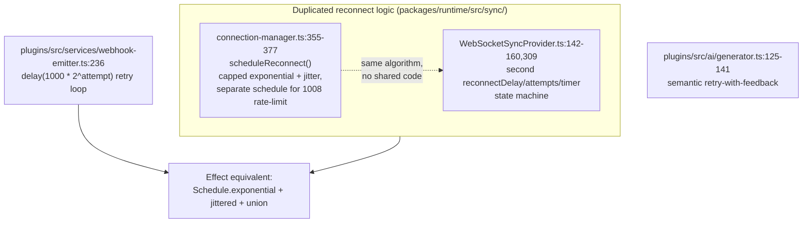
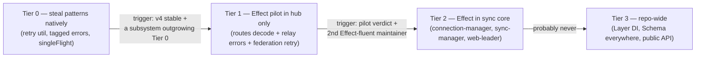
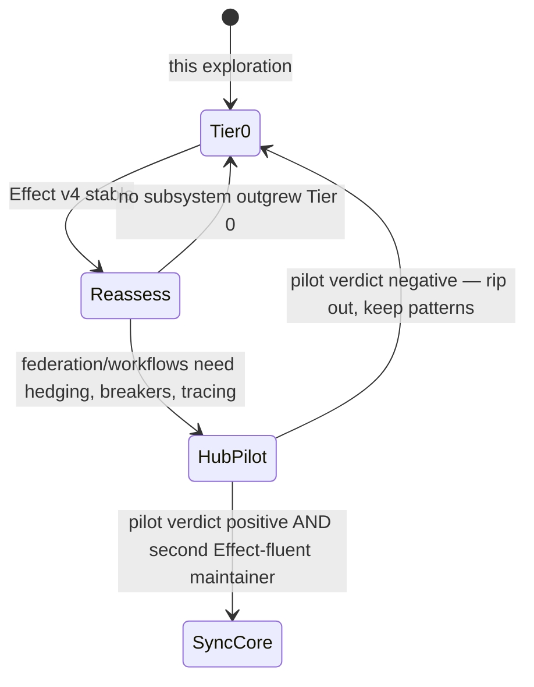

# Effect (effect.website): Where A Typed Effect System Would — And Would Not — Fit xNet

## Problem Statement

[Effect](https://effect.website) markets itself as "the missing standard
library for TypeScript": errors as typed values (`Effect<A, E, R>`),
composable retry policies (`Schedule`), structured concurrency with
interruption, resource scopes, dependency injection (`Layer`/`Context.Tag`),
and a schema/codec system (`Schema`). xNet has hand-rolled every one of
those concerns — some of them more than once. The question this exploration
answers:

1. Which parts of the repo are re-implementing what Effect provides, and how
   well (or badly)?
2. Would adopting Effect — wholesale, incrementally, or as a
   patterns-only influence — make the codebase more reliable, or would it
   trade real complexity for a paradigm tax the team hasn't chosen?
3. If not now, what is the concrete trigger that would change the answer?

## Executive Summary

**Recommendation: do not add Effect as a dependency today. Steal its three
best ideas natively (Tier 0), and define an explicit re-evaluation trigger
tied to Effect v4 going stable.**

The survey found genuine overlap — xNet independently re-implements typed
error codes, exponential-backoff-with-jitter (twice, duplicated),
single-flight promise memoization (four times), cancellation, and boundary
validation. Effect would model all of these better _in isolation_. But four
repo-specific facts flip the cost/benefit:

| Fact                                                                                                                                                                                                                                 | Consequence                                                                                                                                                      |
| ------------------------------------------------------------------------------------------------------------------------------------------------------------------------------------------------------------------------------------ | ---------------------------------------------------------------------------------------------------------------------------------------------------------------- |
| The repo's runtime-dependency posture is deliberately lean — the only large committed runtime dep is `yjs`; there is no fp library anywhere (`grep effect\|fp-ts\|neverthrow` over every `package.json` → zero)                      | Effect is not a library, it's a paradigm; it would become the second "framework-grade" commitment after Yjs and it colonizes every function signature it touches |
| Effect v4 is in **beta** (Feb 2026), a ground-up runtime rewrite with a new package layout; v3 code takes migration work                                                                                                             | Adopting v3 now buys a migration; adopting v4 now buys beta churn                                                                                                |
| `@xnetjs/*` packages are **published libraries** — Effect types in public signatures would force Effect onto every consumer (peer-dependency and API-surface blast radius; root-barrel policy makes API surface a reviewed contract) | Internal-only adoption requires an "Effect firewall" at every package boundary, which forfeits much of the value                                                 |
| The duplicated/fragile async code is concentrated in ~5 files (sync-manager, two reconnect providers, web-leader, hub relay), not smeared across the repo                                                                            | A targeted native refactor (~300 lines of shared utilities) captures most of the reliability win at ~2% of the adoption cost                                     |

The three ideas worth stealing natively now:

1. **`Schedule` → one shared `retry/backoff` utility** replacing the two
   duplicated reconnect implementations and the webhook emitter's loop.
2. **`Data.TaggedError` → a repo-wide tagged-error convention** formalizing
   what `NodeRelayError.code` already does by hand.
3. **Single-flight → one `singleFlight(map, key, fn)` helper** replacing four
   hand-rolled `Map<key, Promise>` memoizations.

Re-evaluation trigger: Effect v4 stable **and** a concrete server-side
subsystem (hub federation/health, or a future workflow engine) whose retry/
timeout/tracing needs outgrow the native utilities. The hub is the right
pilot host — Node-only, not published for browser consumers, already
Hono-based (Effect's `@effect/platform` interoperates with Hono).

## Current State In The Repository

The survey below is what makes this question non-hypothetical: xNet already
_has_ an effect system — it is just untyped, duplicated, and hand-rolled.

### Errors: 91 thrown `Error` subclasses, some with hand-rolled tags

There is no Result/Either type anywhere; every error crosses boundaries by
throw. The richest errors already carry a string-literal-union discriminant —
i.e. they are `Data.TaggedError` written by hand:

- `packages/hub/src/services/node-relay.ts:52` — `NodeRelayError` with
  `code: 'UNAUTHORIZED' | 'MISSING_SCOPE' | 'INVALID_CHANGE' |
'INVALID_SIGNATURE' | 'INVALID_HASH' | 'REPLAY_REJECTED' |
'QUOTA_EXCEEDED' | 'STORAGE_FULL'` plus `action`/`resource` context.
- `packages/data/src/store/permission-error.ts:6` (`PermissionError`),
  `packages/data/src/schema/lens.ts:79` (`MigrationError`),
  `packages/sync/src/yjs-authorized-sync.ts:314` (`AuthorizedYjsError`),
  `packages/hub/src/services/schemas.ts:305` (`SchemaError`), and ~86 more.
- The one tagged-union-result in the repo:
  `packages/sync/src/serializers/types.ts` —
  `DeserializeResult<T> | DeserializeError`.

The failure mode of throw-based errors shows up where fallibility is policy:
`packages/query/src/federation/router.ts:114-119` swallows peer failures
with a bare `catch {}` so a slow peer can't fail a federated query — correct
behavior, but invisible in the type system and indistinguishable from an
accidental swallow.

### Retry/backoff: the same algorithm, hand-rolled twice (plus two more)



`connection-manager.ts` is the reference: manual attempt counter, timer
handle, jitter, and a distinct backoff branch for hub `1008` policy-violation
closes vs ordinary drops — exactly the composition
`Schedule.exponential(...).pipe(Schedule.jittered)` unioned with a
rate-limit schedule. `WebSocketSyncProvider.ts` re-implements the same thing
in parallel; they drift independently.

### Concurrency/cancellation: AbortController + four single-flight maps + Web Locks

- **Cancellation**: `AbortController` in 20+ files (hub unfurl/federation,
  telemetry transport, plugins process manager, `useRemoteSchema`, …).
- **Single-flight ("convoy" fixes)** — the same pattern independently
  invented four times:
  - `packages/react/src/hooks/useNode.ts:223` — `pendingFlushes` map so a
    remount awaits the prior unmount's flush.
  - `packages/react/src/hooks/useQuery.ts:254` — once-per-shape dedupe.
  - `packages/data/src/store/sqlite-adapter.ts:373` —
    `compiledQueryDiagnosticsMemo` in-flight promise memo (the 0271 boot
    convoy fix), with deliberate no-memo-on-failure semantics.
  - `packages/data/src/schema/registry.ts:60` — `loadingPromises` for lazy
    schema loads.
- **Leadership + resource handoff**:
  `packages/sqlite/src/adapters/web-leader.ts` — Web-Locks leader election
  for multi-tab SQLite, MessagePort handoff, in-flight follower calls
  rejected (not hung) on leader death. A bespoke `Scope`-with-finalizers
  protocol, and one of the most correctness-critical files in the repo.
- **The crown jewel of async complexity**:
  `packages/runtime/src/sync/sync-manager.ts` (1,338 lines) — offline queue
  draining, per-room provider refcounting, teardown races ("never re-arm
  after teardown", `:407`).

### Validation: homegrown schema registry; hub boundary is `typeof` ladders

- The content-type system is a custom JSON-LD-flavored registry
  (`packages/data/src/schema/types.ts:86`, `registry.ts:58`, ~40 built-in
  schemas) whose `validate()` accumulates `ValidationError[]` — an
  applicative-validation shape that maps directly onto Effect `Schema`'s
  `ParseResult`, but it is domain infrastructure (versioning, `migrateFrom`,
  CRDT `document` types, authorization) that no off-the-shelf codec library
  replaces.
- Hub **request** validation, by contrast, is manual:
  `packages/hub/src/utils/validation.ts` exports only `isRecord`/
  `toStringArray`, and routes like
  `packages/hub/src/features/form-inbox.ts:137-143` do long
  `typeof body.viewId !== 'string'` ladders returning 400s. This is the one
  place a decode-at-the-boundary library (Effect `Schema`, or plain Zod)
  would visibly delete code today.

### DI: options-bag factories + React context; duck-typing to break cycles

Services compose via `create*(options)` factories
(`createConnectionManager`, `createSyncManager`) and React context
(`packages/react/src/context.ts:275-312`). `packages/sdk/src/client.ts:19-24`
duck-types its telemetry parameter "to avoid circular dependency on
@xnetjs/telemetry" — structurally the problem `Context.Tag` solves, but a
recurring annoyance rather than a crisis.

### Dependency posture

No `effect`, `fp-ts`, `neverthrow`, `ts-results`, or `purify-ts` anywhere in
49 packages + 5 apps (Zod appears only as a transitive dep of codegen
tooling). Runtime deps are deliberately minimal; `yjs` is the one big
committed runtime dependency. Adopting Effect would be the repo's first
fp-runtime and its second framework-grade commitment.

## External Research

### What Effect is (and what changed in 2026)

- Effect models computations as `Effect<Success, Error, Requirements>`:
  errors and dependencies in the type, structured concurrency with
  interruption, `Schedule` for retry/repeat policy composition
  (exponential, jittered, `union`/`intersect`), `Scope` for resource
  finalization, `Layer` for DI, `Schema` for decode/encode with accumulated
  parse errors, built-in OpenTelemetry tracing/metrics
  ([effect.website](https://effect.website),
  [Schedule docs](https://effect.website/docs/scheduling/introduction/)).
- **Effect v4 beta** (launched 2026-02-18) is the important inflection:
  rewritten fiber runtime, unified package system, and dramatic bundle
  improvements — a minimal Effect+Stream+Schema program dropped from ~70 kB
  to ~20 kB, with ~20× faster streams/batching claimed
  ([v4 beta announcement](https://effect.website/blog/releases/effect/40-beta/),
  [InfoQ coverage](https://www.infoq.com/news/2026/04/effect-v4-beta/),
  [beta recap](https://effect.website/blog/effect-v4beta-launch-to-may-recap/)).
  Migration from v3 is real work
  ([Maglione's migration notes](https://www.sandromaglione.com/newsletter/my-effect-v4-beta-migrations)).
- Effect's own [Myths page](https://effect.website/docs/additional-resources/myths/)
  concedes ~25 kB gzipped core (v3), argues tree-shaking friendliness and
  that app code often gets _smaller_, and pitches a 10–20-function starter
  vocabulary. There is also `Micro`, a reduced-footprint variant.
- On validation specifically, Effect maintains its own
  [Schema-vs-Zod comparison](https://github.com/Effect-TS/effect/blob/main/packages/effect/schema-vs-zod.md):
  combinator style tree-shakes better than Zod's method chaining (Zod's
  answer is `zod/mini` at ~1.9 kB gzipped).

### Adoption experience — the honest picture

- The learning curve is consistently reported as steep: fibers, layers,
  causes, defects, and schedules land at once; `yield*` generator style is
  alien to most TS developers; stack traces need re-learning
  ([Rob Bertram's first impressions](https://robbertram.com/blog/effect-ts-first-impressions/),
  [production write-up](https://www.buildmvpfast.com/blog/effect-ts-functional-programming-typescript-production-2026)).
- The documented organizational failure mode is directly relevant to a
  ~solo-maintained repo: Effect spreads via one enthusiastic senior
  engineer, and the Effect-ified subsystem becomes that person's domain — a
  bus-factor concentration in a paradigm nobody else chose. (For xNet, an
  open-source project soliciting contributions, this generalizes to a
  **contributor-onboarding tax**: every contributor to an Effect-ified
  package must know Effect.)
- Effect is viral by design: an `Effect`-returning function is only
  ergonomic to call from other Effect code. Incremental adoption is
  possible (`Effect.runPromise` at boundaries) but every boundary crossing
  costs wrapping/unwrapping and loses the typed-error benefit.

### Prior art: Effect in local-first sync engines

The strongest pro-Effect data point for xNet specifically:
[LiveStore](https://livestore.dev/) — Johannes Schickling's (Prisma founder)
local-first, event-sourced, reactive-SQLite sync engine — is built
end-to-end on Effect, and he credits it for taming exactly the class of
problems xNet's sync stack has (reconnect policy, structured teardown,
typed protocol errors, devtools introspection)
([Sync different talk](https://www.youtube.com/watch?v=nyPl84BopKc),
[localfirst.fm landscape](https://www.localfirst.fm/landscape/livestore)).
This proves the pairing works. It also illustrates the commitment level:
LiveStore is Effect _all the way down_ — it was architected on Effect from
day one, not retrofitted onto a 49-package monorepo with a published API
surface.

## Key Findings

1. **The overlap is real but concentrated.** Effect-shaped problems cluster
   in ~5 files (two reconnect providers, sync-manager, web-leader, hub
   relay/routes) plus a repeated single-flight micro-pattern. This cuts both
   ways: Effect would genuinely help there — and a targeted native refactor
   can capture most of the same win.
2. **The duplicated reconnect logic is the single clearest defect** this
   exploration surfaced, independent of Effect:
   `connection-manager.ts` and `WebSocketSyncProvider.ts` maintain parallel
   backoff state machines that drift.
3. **Errors already want tags.** `NodeRelayError.code` and the
   `DeserializeOutcome` union show the codebase converging on tagged errors
   organically; a convention (plus a tiny base class) formalizes it with
   zero dependencies.
4. **Timing is bad for wholesale adoption.** v3 means migrating to v4 later;
   v4 is beta. The rational move for a non-adopter is to wait for v4 stable
   and re-look — the bundle/perf story improves materially.
5. **Published-library surface is the structural blocker.** `@xnetjs/*` is
   consumed by third parties; Effect types in public signatures export the
   paradigm to consumers, and hiding Effect behind Promise facades at every
   barrel forfeits typed errors and interruption exactly where consumers
   would benefit.
6. **The hub is the only natural pilot host** if appetite ever materializes:
   Node-only, server-side, no React, no browser bundle, already the home of
   the most protocol-shaped errors, and its route validation is the repo's
   weakest boundary today.

## Options And Tradeoffs



### Option A — Adopt Effect wholesale (Tier 2–3 now)

- **For**: best-in-class modeling of everything §Current State catalogs;
  LiveStore proves the local-first fit; OpenTelemetry tracing lines up with
  the 0210 consent/observability spine; deletes four categories of
  hand-rolled infrastructure.
- **Against**: paradigm tax on every future contributor; viral types across
  49 packages and the _published_ API surface (semver majors across the
  fixed core); v4-beta churn or v3→v4 migration; violates the repo's lean
  posture; bus-factor risk documented in the wild; the Yjs interop boundary
  (event-emitter world) would need adapters everywhere.
- **Verdict**: rejected. The cost lands repo-wide; the benefit lands in five
  files.

### Option B — Bounded pilot now (Tier 1)

- **For**: hub is structurally ideal (Node-only, unpublished-to-browsers,
  Hono-compatible); real learning before commitment.
- **Against**: still lands the learning curve and a beta (or
  soon-to-be-legacy v3) dependency; the hub is production infrastructure
  (demo hub on Railway) — the wrong place to learn a new runtime's failure
  modes; nothing is currently _blocked_ on Effect.
- **Verdict**: deferred, not rejected — this is the designated first step if
  the trigger fires.

### Option C — Adopt only Effect `Schema` for boundary validation

- **For**: hub `typeof` ladders are the visibly weakest validation; codecs
  are less viral than the Effect runtime.
- **Against**: `Schema` still pulls the `effect` core; if xNet ever wants a
  standalone validator, `zod` (or `zod/mini`) is the boring, non-viral
  choice — and the interesting validation logic (content-type registry,
  versioning, migration) is domain code that stays homegrown either way.
- **Verdict**: rejected as an Effect on-ramp; noted as a future standalone
  question ("adopt a request-validation library for the hub") that should
  be decided on its own merits.

### Option D — Steal the patterns, skip the dependency (Tier 0) ✅

- **For**: fixes the actual defects found (duplicated backoff, ad-hoc
  single-flight, informal error tags) with ~300 lines of shared, dependency-
  free utilities; zero onboarding tax; zero API-surface impact beyond
  additive exports; keeps the option value — utilities shaped like
  `Schedule`/`TaggedError` make a _later_ Effect migration nearly
  mechanical.
- **Against**: hand-rolled utilities are still hand-rolled — no interruption
  semantics, no fiber supervision, no free tracing; doesn't help the
  sdk/telemetry duck-typing wart (left as-is; it's an annoyance, not a bug).
- **Verdict**: **recommended.**

## Recommendation

Execute Tier 0 as a small implementation PR, and write the re-evaluation
trigger down so it isn't vibes:

1. **`@xnetjs/core` (or `runtime`) gains a `retry` module** — a
   `Schedule`-inspired policy object (`exponential`, `jittered`, `capped`,
   `union`) driving both sync reconnect providers and the webhook emitter.
   Collapsing the two reconnect implementations onto it is the acceptance
   test: `WebSocketSyncProvider` should lose its private
   `reconnectDelay/reconnectAttempts/reconnectTimer` trio entirely.
2. **A `TaggedError` base + convention** — `class NodeRelayError extends
TaggedError('NodeRelayError')<{...}>`-style ergonomics without the
   dependency: a tiny base class ensuring `_tag`, structural `code`, and
   `cause` chaining; migrate `NodeRelayError` and `PermissionError` as the
   exemplars, document the convention, don't campaign the other 89.
3. **A `singleFlight` helper** in `@xnetjs/core` — subsuming the four
   `Map<key, Promise>` sites, preserving the sqlite-adapter's
   no-memo-on-failure semantics as an option.
4. **Record the trigger** (in this doc's checkbox lifecycle): reconsider
   Tier 1 when **(a)** Effect v4 is stable, **and (b)** a server-side
   subsystem concretely outgrows Tier 0 (e.g. hub federation health needs
   hedged requests + per-peer circuit breakers + tracing), **and (c)**
   there's more than one maintainer willing to own the paradigm.



## Example Code

What Tier 0 looks like, deliberately shaped so a later Effect migration is a
find-and-replace rather than a redesign.

**Retry policy (replaces both reconnect loops):**

```ts
// packages/core/src/retry/policy.ts — no dependencies
export interface RetryPolicy {
  /** Delay in ms before the given 1-based attempt, or null to give up. */
  delayFor(attempt: number): number | null
}

export const exponential = (baseMs: number, factor = 2): RetryPolicy => ({
  delayFor: (attempt) => baseMs * factor ** (attempt - 1)
})

export const capped = (p: RetryPolicy, maxMs: number): RetryPolicy => ({
  delayFor: (a) => {
    const d = p.delayFor(a)
    return d === null ? null : Math.min(d, maxMs)
  }
})

export const jittered = (p: RetryPolicy, ratio = 0.5): RetryPolicy => ({
  delayFor: (a) => {
    const d = p.delayFor(a)
    return d === null ? null : d + Math.floor(Math.random() * d * ratio)
  }
})
```

```ts
// connection-manager.ts, after — the 1008-vs-drop branch becomes policy selection
const reconnectPolicy = jittered(capped(exponential(reconnectDelay), maxReconnectDelay))
const rateLimitPolicy = jittered({ delayFor: () => rateLimitBackoffMs })

const policy = policyViolation ? rateLimitPolicy : reconnectPolicy
const backoff = policy.delayFor(reconnectAttempts)
if (backoff !== null)
  reconnectTimer = setTimeout(() => {
    reconnectTimer = null
    void doConnect()
  }, backoff)
```

**The Effect equivalent (what Tier 1 would replace it with), for contrast:**

```ts
const reconnect = Effect.retry(
  connect,
  Schedule.exponential('1 second').pipe(Schedule.jittered, Schedule.upTo('2 minutes'))
)
```

**Tagged errors (formalizes `NodeRelayError.code`):**

```ts
// packages/core/src/errors/tagged.ts
export abstract class TaggedError<Tag extends string> extends Error {
  abstract readonly _tag: Tag
  constructor(message: string, options?: { cause?: unknown }) {
    super(message, options)
    this.name = new.target.name
  }
}

// exhaustiveness at catch sites:
export const isTagged = <T extends string>(e: unknown, tag: T): e is TaggedError<T> =>
  e instanceof TaggedError && e._tag === tag
```

**Single-flight (subsumes the four Map<key, Promise> sites):**

```ts
// packages/core/src/async/single-flight.ts
export function singleFlight<K, V>(
  inflight: Map<K, Promise<V>>,
  key: K,
  fn: () => Promise<V>,
  opts: { memoizeFailure?: boolean } = {}
): Promise<V> {
  const existing = inflight.get(key)
  if (existing) return existing
  const p = fn()
  inflight.set(key, p)
  if (!opts.memoizeFailure)
    p.catch(() => {
      inflight.delete(key)
    })
  p.then(() => {
    /* keep or clear per call-site policy */
  })
  return p
}
```

## Risks And Open Questions

- **Does Tier 0 under-deliver on `sync-manager.ts`?** The 1,338-line
  teardown-race problem is a _structured concurrency_ problem, and no small
  utility gives you fibers and interruption. Mitigation: the 0294 on-touch
  rewrite list already targets `sync-manager.test.ts`; treat any future
  sync-manager restructuring as a fresh data point for the Tier 1 trigger.
- **Retry-policy utility scope creep.** The moment it grows `union`,
  `intersect`, cron, and hedging, we're maintaining a worse `Schedule`.
  Guard: if the policy module exceeds ~150 lines, that _is_ the trigger
  firing — stop and reassess Tier 1 instead of growing it.
- **Zod-for-hub remains open.** Option C rejected Effect `Schema` as an
  on-ramp, but the hub's `typeof` ladders are still the weakest boundary;
  a standalone `zod/mini` (or similar) decision is out of scope here.
- **v4 timeline risk.** If v4 stabilization drags into 2027, the trigger may
  never fire — which is an acceptable outcome, not a failure of this plan.
- **Changeset impact of Tier 0**: new exports from `@xnetjs/core` land in a
  scoped sub-barrel per the 0276 policy (`core/src/retry/index.ts` etc.),
  minor bump, one grouped root re-export block.

## Implementation Checklist

- [x] Add `packages/core/src/retry/` policy module (exponential, capped,
      jittered, fixed) with unit tests (fake timers, property tests via
      `fast-check` for monotonicity/cap invariants).
- [ ] Refactor `packages/runtime/src/sync/connection-manager.ts`
      `scheduleReconnect()` onto the policy module, preserving the 1008
      rate-limit branch behavior exactly (golden tests on the delay
      sequences before/after).
- [ ] Refactor `packages/runtime/src/sync/WebSocketSyncProvider.ts` onto the
      same module; delete its private backoff state.
- [ ] Migrate `packages/plugins/src/services/webhook-emitter.ts` retry loop
      onto the policy module.
- [ ] Add `packages/core/src/errors/tagged.ts` (`TaggedError` base,
      `isTagged` guard); migrate `NodeRelayError` and `PermissionError` as
      exemplars; document the convention in `CLAUDE.md` or a short ADR.
- [ ] Add `packages/core/src/async/single-flight.ts`; migrate the four
      call sites (`useNode.ts:223`, `useQuery.ts:254`,
      `sqlite-adapter.ts:373` with `memoizeFailure: false`,
      `schema/registry.ts:60`).
- [ ] Export new modules via scoped sub-barrels + one grouped root
      re-export block (0276 policy); write the changeset (minor for `core`,
      patch for `runtime`/`plugins`/`react`/`data`).
- [ ] Record the Tier 1 re-evaluation trigger as a dated note in this doc
      when Tier 0 merges.

## Validation Checklist

- [ ] Delay-sequence golden tests prove reconnect behavior is unchanged for
      both providers (ordinary drop and 1008 rate-limit paths).
- [ ] `grep -rn "reconnectAttempts\|Math.pow(2, attempt\|2 \*\* (reconnect"`
      over `packages/` finds only the shared policy module.
- [ ] Boot-convoy behavior intact: sqlite-adapter diagnostics still
      single-flight and still drop failed memo entries (existing tests +
      manual seed-heavy boot in the web app).
- [ ] Sync soak: multi-tab open/close + hub restart cycle shows no
      reconnect storms and no orphaned timers (DevTools Changes tab quiet —
      the 0296 flood litmus).
- [ ] `NodeRelayError` catch sites in clients still match on `code`
      (unchanged wire behavior); typecheck passes repo-wide.
- [ ] Bundle check: no new runtime dependency appears in any
      `package.json` / `pnpm-lock.yaml` diff.

## References

- [Effect — homepage](https://effect.website)
- [Effect — Myths (bundle size, learning curve, tree-shaking)](https://effect.website/docs/additional-resources/myths/)
- [Effect — Schedule module docs](https://effect.website/docs/scheduling/introduction/)
- [Effect v4 Beta announcement](https://effect.website/blog/releases/effect/40-beta/)
- [Effect v4 Beta: Rewritten Runtime, Smaller Bundles — InfoQ](https://www.infoq.com/news/2026/04/effect-v4-beta/)
- [Effect v4 beta recap (Feb–May 2026)](https://effect.website/blog/effect-v4beta-launch-to-may-recap/)
- [Sandro Maglione — My Effect v4 beta migrations](https://www.sandromaglione.com/newsletter/my-effect-v4-beta-migrations)
- [Effect Schema vs Zod (official comparison)](https://github.com/Effect-TS/effect/blob/main/packages/effect/schema-vs-zod.md)
- [Rob Bertram — Learning Effect: first impressions](https://robbertram.com/blog/effect-ts-first-impressions/)
- [Effect-TS in production (2026 write-up)](https://www.buildmvpfast.com/blog/effect-ts-functional-programming-typescript-production-2026)
- [LiveStore — local-first data layer built on Effect](https://livestore.dev/)
- [Johannes Schickling — Sync different: event sourcing in local-first apps](https://www.youtube.com/watch?v=nyPl84BopKc)
- [LiveStore on the Local-First Landscape](https://www.localfirst.fm/landscape/livestore)
- [zod/mini (bundle-size answer to combinator-style codecs)](https://zod.dev/packages/mini)
