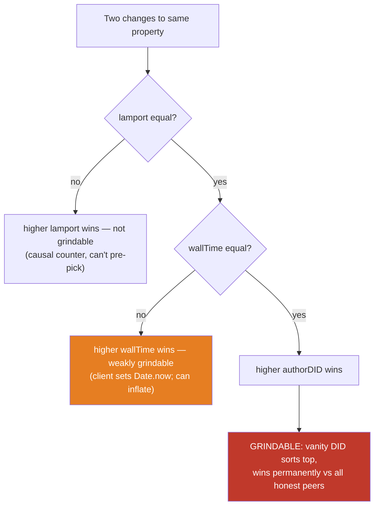
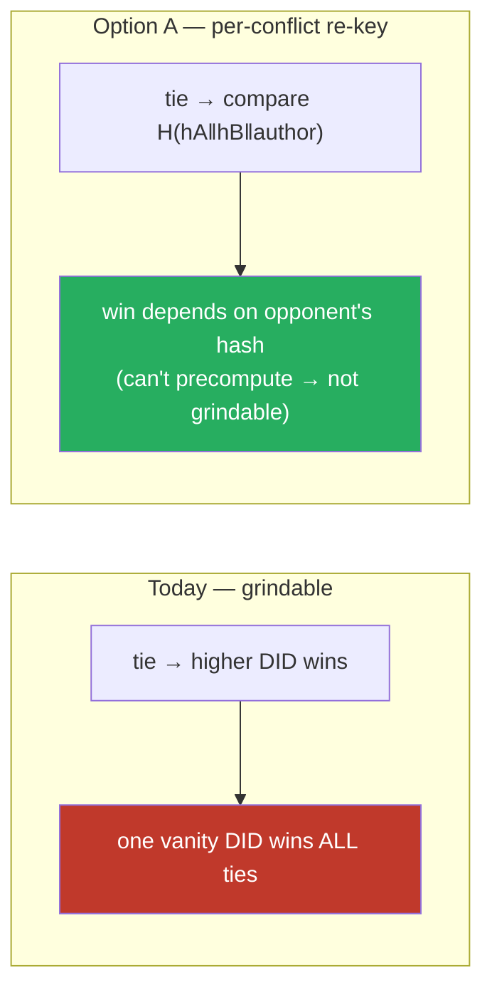
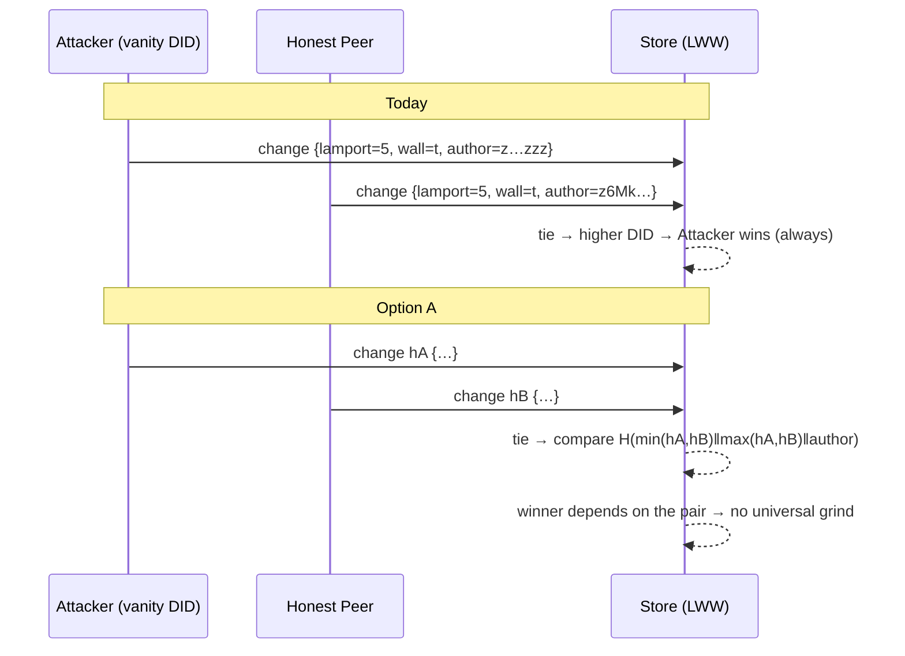

# Hash Grinding Mitigation — When Winning A Tie Is A Brute-Force Problem

## Problem Statement

xNet converges concurrent edits with a deterministic Last-Write-Wins (LWW)
comparator. When two changes touch the same property with the same logical
time, the protocol falls through a fixed tie chain and, at the very bottom,
**picks a winner by comparing the author's DID by UTF-16 code units — "higher
DID wins"** (`docs/specs/protocol/02-data-model.md` §7,
`packages/core/src/lww.ts`).

A DID is not a random opaque token. It is
`did:key:` + `base58btc(0xed01 ‖ Ed25519-public-key)` — a **deterministic,
attacker-chosen function of a keypair the attacker generates for free**
(`packages/identity/src/did.ts`). So an attacker can *grind keypairs* until
their DID sorts maximally, then use that one identity to **win every future
concurrent-write conflict against every honest peer, forever**. This is a
classic hash-grinding attack: brute-force an input until the derived value
lands in a winning equivalence class. The target just happens to be the DID,
not the change hash.

The same "grind the input until the derived value sorts/places how I want"
pattern recurs in two more places:

- **Yjs `clientID`** — a free-form integer the client picks; Yjs's internal
  CRDT breaks concurrent same-position insert ties by *higher clientID*, and
  xNet's attestation layer binds but does **not constrain** the value
  (`packages/sync/src/clientid-attestation.ts`).
- **The shard-rebalancer consistent-hash ring** — a hub operator controls
  their own `hubDid`, and shard ownership is decided by
  `blake3(hubDid)` truncated to **32 bits**; grinding a hubDid to land just
  after a target shard is trivial (`packages/hub/src/services/shard-rebalancer.ts`).

Goal: characterize the grinding attack surface precisely, decide how much of
it actually matters, and recommend concrete mitigations that preserve
deterministic convergence (the whole point of the tie-break) without handing a
permanent structural advantage to whoever spent an afternoon grinding a vanity
key.

## Executive Summary

- **The convergence layer never tie-breaks on a content hash.** Every ordering
  decision — per-property LWW, change application order, fork branch selection
  — bottoms out on `authorDID` compared by code units
  (`packages/core/src/lww.ts:29`, `packages/sync/src/chain.ts:20`,
  `packages/sync/src/clock.ts`). The change hash (BLAKE3 over canonical JSON,
  `packages/sync/src/change.ts:195`) is used only for identity, dedup, chain
  linkage, and as the signing target — never for ordering. So the textbook
  "grind `change.hash` to win a tie" attack has **no site**. The real target
  moved to the DID.
- **The DID tie-break is grindable and the win is permanent.** Ties require
  equal `{lamport, wallTime}`, which is realistic for genuinely concurrent
  offline edits (`wallTime` is `Date.now()` millisecond granularity). A vanity
  DID that sorts near the top of the code-unit order (base58 favors a
  trailing-`z` grind) wins the fall-through tie against essentially all honest,
  randomly-distributed DIDs. Cost is ~58× per favorable leading base58
  character after the fixed `z6Mk` prefix — a handful of characters (minutes to
  hours of keygen) buys a near-universal win. There is **no author-cost, no
  registration-order, no reputation** term to blunt it.
- **This is a known class with known answers.** Automerge and Yjs tie-break on
  `actorId`/`clientId` and are grindable in exactly the same way when identity
  is free; Cassandra's "lexically larger value wins" is grindable by *content*.
  Kleppmann's *Making CRDTs Byzantine Fault Tolerant* (PaPoC 2022) — a system
  model almost identical to xNet's — is the strongest prior art: use content
  hashes for **identity/dedup only**, and derive **order from provably-shared
  causal state**, never from an attacker-choosable field.
- **Keyed hashing (SipHash/HMAC) — the obvious first idea — is ruled out.**
  Content addressing requires every peer to recompute the same hash from public
  bytes; a shared secret known to all verifiers (including attackers) provides
  zero grinding resistance. Worth stating so the reader doesn't reach for it.
- **Recommendation (layered, mostly cheap):** (1) keep the deterministic
  tie-break but **re-key the final tie on a per-conflict hash the attacker
  cannot pre-compute** — `H(changeHashA ‖ changeHashB)`-style symmetric
  comparison — so no fixed identity wins *all* ties; (2) **cap the value of
  winning a tie** by preferring "both survive / flag conflict" over silent
  clobber where the data model allows it (already partly true — LWW is
  per-property); (3) treat the **32-bit shard ring** as a birthday-grindable
  surface and widen it / salt it with non-operator-controlled entropy; (4)
  **constrain the Yjs clientID** to be derived from the DID rather than
  free-chosen; (5) document the residual Sybil/identity-cost gap explicitly
  rather than pretending signatures close it. None of this requires a consensus
  layer or breaks local-first offline operation.

## Current State In The Repository

### The one LWW comparator (final tie = author DID)

`packages/core/src/lww.ts` is the single source of truth (exploration 0276
collapsed three prior copies into it). The comparator:

```ts
export function compareLwwStamps(a: LwwStamp, b: LwwStamp): number {
  if (a.lamport !== b.lamport) return a.lamport - b.lamport
  if (a.wallTime !== b.wallTime) return a.wallTime - b.wallTime
  // UTF-16 code-unit order (not localeCompare) for deterministic convergence.
  return a.author < b.author ? -1 : a.author > b.author ? 1 : 0
}
```

`lwwWins(incoming, existing)` is `compareLwwStamps(...) > 0` — **the higher
author DID wins the final tie**. The same rule is emitted into SQLite via
`lwwUpdateGuardSql` (`... AND excluded.authorColumn > table.authorColumn`,
BINARY collation = code units), so the DB path and the JS path agree. The
spec pins this in `docs/specs/protocol/02-data-model.md:191-199` and the golden
vector `conformance/vectors/lww/0004-tie-author-case-codeunit.json` locks it
(lowercase `did:key:zaaa` beats uppercase `did:key:zAAA`).

There is **no hash tiebreak after the author**: two changes with identical
`{lamport, wallTime, author}` compare equal (`0`).

### The same author tiebreak in fork choice and replay

`packages/sync/src/chain.ts:20` re-implements the comparator over `Change<T>`
and uses it in three ordering-sensitive spots:

- `getForks` (`:245`) sorts a fork point's children by `compareChangeOrder`,
  then designates `children[0]` as `branch1` — **which branch is "first" is
  decided by author DID** on a `{lamport, wallTime}` tie.
- `topologicalSort` (`:271`) orders replay by the same comparator.
- `packages/sync/src/clock.ts` `serializeTimestamp` builds
  `${padded16(time)}-${author}` — a lexical sort key ending in the DID.

### How the change hash is computed (and why it is *not* the target)

`packages/sync/src/change.ts`:

- `computeChangeHash` (`:195`) → `blake3` (via `packages/crypto`) over
  `JSON.stringify(sortObjectKeys(unsigned))`, returned as
  `cid:blake3:<hex>`. Fields hashed: `id, type, payload, parentHash,
  authorDID, wallTime, lamport` (+ `protocolVersion` when ≥1, + batch fields).
- `signChange` (`:228`) Ed25519-signs the **hash string bytes**.
- `recomputeChangeHash`/`verifyChangeHash` (`:340`/`:373`) detect tampering.

The hash flows into `parentHash` (chain linkage), the signature target, and
dedup (`packages/hub/src/services/node-relay.ts:181` `hasNodeChange`,
`node-store-sync-provider.ts` "deduped by hash"). **Never into ordering.**

> **Spec drift to fix in passing:**
> `docs/explorations/0200_[x]_PORTABLE_XNET_PROTOCOL_BOUNDARIES_AND_STANDARD.md:144`
> still says `hash: ContentId // SHA-256 over canonical change bytes`. The
> implementation is **BLAKE3 over canonical JSON**, not SHA-256 over raw bytes.
> Worth correcting so the protocol spec matches shipping behavior.

### The real grind target: the DID

`packages/identity/src/did.ts:14`:

```ts
export function createDID(publicKey: Uint8Array): DID {
  const prefixed = new Uint8Array(ED25519_PREFIX.length + publicKey.length)
  prefixed.set(ED25519_PREFIX)                 // 0xed01 multicodec
  prefixed.set(publicKey, ED25519_PREFIX.length)
  const encoded = base58btc.encode(prefixed)   // 'z' multibase prefix
  return `did:key:${encoded}` as DID
}
```

`generateKeyBundle` (`packages/identity/src/keys.ts:43`) mints a fresh random
keypair with **no cost and no rate limit**. Because `0xed01` is fixed, every
Ed25519 DID starts `did:key:z6Mk`; the *rest* is a base58 encoding of the
public key and is fully attacker-searchable. To win the code-unit tie an
attacker wants the characters after the prefix to be as high as possible
(base58btc's alphabet ends in `z`).

### Two more grind sites

- **Yjs clientID** — `packages/sync/src/clientid-attestation.ts` header (`:4`)
  admits clientIDs "have no cryptographic binding." The module *binds*
  clientId→DID via a signed attestation but never constrains the *value*;
  `validateClientIdOwnership` (`:656`) even returns `true` when no binding
  exists. An attacker sets `clientId = 0xFFFFFFFF` to win Yjs internal insert
  races, independent of the envelope LWW.
- **Shard ring** — `packages/hub/src/services/shard-rebalancer.ts:12`:
  `hashToUint32(hubDid) = blake3(hubDid).getUint32(0)` — **32 bits**,
  attacker-chosen input. `buildRing`/`pickHost` place a shard on the first ring
  host with `hash ≥ shardHash`. Grinding a `hubDid` to land immediately after a
  target `shard:N` hash deterministically captures that shard — a targeted
  data-placement / shard-eclipse primitive with no mitigation.

### Low-risk / non-issues

- Node IDs are `nanoid` (`packages/data/src/schema/node.ts:200`) — random, not
  hash-derived, and never used for convergence ordering.
- Fractional sort keys (`packages/data/src/database/fractional-index.ts`) are
  user-authored *positions* compared by code units — an attacker can pick their
  own row position, but that is "choose where you sit," ordinary CRDT behavior,
  not hash grinding.
- The hub's row *display* sort uses `id.localeCompare` on nanoid
  (`packages/hub/src/storage/memory.ts:61`) — presentation only, not
  convergence.

### Where ties actually happen



Note the middle rung too: `wallTime` is a client-supplied `Date.now()`
(`packages/sync/src/change.ts:149`) with no upper bound enforced at the relay.
An attacker can simply set `wallTime` far in the future to win the *second*
rung without even reaching the DID tie — a cheaper "grind" that doesn't need a
vanity key at all. Any DID mitigation that ignores the `wallTime` rung leaves
the easier attack open.

## External Research

### This is the CRDT actor-id tie-break, and it is a known-grindable pattern

| System | Tie-break on | Grindable when… | Notes |
|---|---|---|---|
| **xNet (today)** | `authorDID` (code units) | identity is free | DID = f(keypair), free to mint |
| **Automerge** | `(counter, actorId)`, larger actorId wins | actorId self-assigned | same shape as xNet |
| **Yjs / YATA** | `(clientId, counter)`, higher clientId wins | clientId self-assigned | xNet inherits this internally |
| **Cassandra LWW** | timestamp, then **lexically larger value** | attacker pads payload | grindable by *content*, not just identity |
| **Riak (DVV)** | *no deterministic winner* | — | keeps siblings, pushes conflict to app |
| **Kleppmann BFT-CRDT** | causal Lamport check vs `before(u)` | — | order tied to provably-shared state |

The load-bearing insight from the literature: **tie-breaking on a field the
writer can mint for free is grindable regardless of whether that field is
called a hash, an actorId, or a DID.** Riak sidesteps it (don't pick a winner —
keep siblings); Kleppmann defeats it (make the valid range of the ordering key
a function of shared causal history, not attacker choice).

### Kleppmann, *Making CRDTs Byzantine Fault Tolerant* (PaPoC 2022)

Architecturally the closest prior art to xNet (signed, hash-chained, DID-ish,
per-op). Key points:

- **Content hash = operation ID, for identity only.** `id = H(update)`. A
  Byzantine node cannot change the ID without changing the bytes and becoming a
  distinguishable update — this makes duplicate-ID equivocation *structurally
  impossible*. xNet already does this (change hash as identity).
- **Order is handled separately and explicitly, never by comparing hashes.**
  For CRDTs needing a causally-consistent total order, take the max ID among an
  update's causal predecessors — computed via `before(u)`, the transitive
  predecessor set reachable through predecessor hashes, *provably identical on
  any two correct nodes* — and require the new ID to be exactly one greater (a
  Lamport timestamp). Invalid updates are rejected identically everywhere.
- **Signatures answer "who," hashes answer "same update," neither establishes a
  fair order.** Explicitly: signing is optional for consistency; it does not
  make concurrent ordering unbiasable.
- Cautionary neighbor: **Merkle-CRDTs** (Sanjuán 2020) get the hash-graph dedup
  benefit but, per Kleppmann, "do not address the problem of Byzantine nodes
  creating invalid operations" — a half-measure to name.

### Cost model (vanity-address math, directly transferable)

Grinding a derived value to match `k` chosen leading characters costs ~`B^k`
tries where `B` is the alphabet size — 58 per base58 char, 16 per hex nibble,
2 per bit. This is the exact economics of Bitcoin vanity addresses and git
vanity commit hashes (grind the committer-date/trailer for leading zeros). For
xNet: an attacker doesn't need a *specific* DID, only one that sorts above the
victim(s). Grinding even ~4–6 favorable leading base58 chars
(`58^5 ≈ 6.6×10^8`, minutes–hours on commodity hardware) yields a DID that
out-sorts virtually every randomly-distributed honest DID.

### Adjacent classes (for framing, mostly ruled out)

- **Hash-flooding DoS → SipHash.** The sibling attack (grind inputs to collide
  in hash-table buckets) is fixed by *keyed* hashing. **This does not transfer:**
  content addressing needs every peer to recompute the hash from public bytes,
  so any key that all verifiers hold is a key the attacker holds. Keyed hashing
  is structurally ruled out for the change hash / DID — state this explicitly.
- **Truncated-hash birthday grinding.** A hash truncated to `n` bits is
  collision-grindable in ~`2^(n/2)` work — a 64-bit ID falls in seconds on a
  cloud box. **Directly relevant to the 32-bit shard ring** (`2^16` work to
  place a shard — trivial). Any adversarial bucket/shard target needs ≥128 bits.
- **PoS randomness grinding / VRFs / commit-reveal.** Machinery for *unbiasable
  randomness* (leader election, lotteries). Heavier than a deterministic LWW
  tie-break needs — relevant only if xNet ever derives a *random* selection
  (e.g. relay/shard assignment) from a signer-influenced value. "Available but
  overkill" for the LWW case; worth keeping in mind for the shard ring.

## Key Findings

1. **The change hash is not an ordering input — good.** No `change.hash`
   tie-break exists to attack. The grinding surface is the *DID*, plus two
   peripheral sites (Yjs clientID, shard ring).
2. **The DID tie-break gives a permanent, universal advantage for a one-time
   cost.** Grind once, win all concurrent-write conflicts against all honest
   peers forever. This is the highest-severity finding.
3. **The `wallTime` rung is a cheaper, key-free grind** (unbounded client
   `Date.now()`), and any fix must address it or the DID fix is moot.
4. **The 32-bit shard ring is birthday-trivially grindable by a hub operator**
   for targeted shard capture.
5. **Yjs clientID is unconstrained**, letting an attacker win internal
   document-CRDT insert races independent of the envelope LWW.
6. **Keyed hashing is ruled out**; the answer is either *don't pick a winner
   from a groundable field* (per-conflict re-keying, or siblings) or *make the
   field costly to mint* (Sybil cost), or both.
7. **Signatures do not help ordering fairness** — they authenticate authorship,
   which the attacker legitimately holds for their own grindable key.

## Options And Tradeoffs

### Option A — Per-conflict re-keyed tie-break (recommended core)

Keep `lamport → wallTime` as-is, but replace the final `authorDID` comparison
with a **symmetric hash of the two competing changes' own hashes**, e.g.
compare `H(min(hA,hB) ‖ max(hA,hB) ‖ authorA)` vs the mirror — a value the
attacker **cannot precompute against unknown future opponents**, because it
depends on the *other* change's hash. No fixed identity wins all ties: whether
you win depends on the specific pair, and the pair includes content you don't
control.



- **Pro:** deterministic and convergent (both peers compute the same
  pair-hash); kills the "grind once, win forever" property; minimal surface
  change (one comparator + one golden vector); no identity-cost machinery.
- **Con:** the change hash includes `authorDID` and `payload`, so an attacker
  who knows a *specific* victim change could still grind their own change's
  content to beat that one specific change — but they cannot grind a *universal*
  winner, and they must grind per-target *after* seeing the victim's change,
  which the LWW value (a per-property last write) rarely justifies. Net: raises
  cost from "one-time universal" to "per-conflict, reactive, low-value."
- **Con:** requires both change hashes at conflict-resolution time. The store
  has them (`change.hash` is on every `Change`); the materialized per-property
  timestamp (`{lamport, wallTime, author}`) currently does **not** carry the
  hash, so `NodeState`/`PropertyTimestamp` (`packages/data/src/store/types.ts`)
  must also retain the winning change's hash. Modest schema/storage add.

### Option B — Sibling-preserve (Riak DVV style)

On a genuine `{lamport, wallTime}` tie for the same property, **don't pick** —
keep both values as a surfaced conflict (`MergeConflict`, which xNet already
models, per exploration 0296) instead of silently clobbering.

- **Pro:** removes the incentive entirely — winning a tie no longer clobbers,
  so grinding buys nothing. Aligns with "reduce what a tie-break win is worth."
- **Con:** ties must still converge to a *display* order eventually; punts the
  determinism problem to the UI and needs a deterministic-but-unforgeable
  presentation order anyway (falls back to Option A for display). Also changes
  data-model semantics (some call sites assume a single value).
- **Verdict:** good *complement* to A for high-value fields; not a full
  replacement because a total order is still needed somewhere.

### Option C — Identity minting cost (Sybil resistance)

Attach a cost to DID creation (PoW puzzle, or hub-gated registration) so
grinding many keypairs is expensive.

- **Pro:** addresses the root (free identities) and helps the broader Sybil
  surface, not just this tie-break.
- **Con:** heavy, contentious for a self-sovereign local-first system (users
  mint DIDs offline; a mandatory cost breaks that), and S/Kademlia research
  shows PoW-gated node IDs are *insufficient alone* against determined
  attackers. High effort, partial benefit.
- **Verdict:** out of scope as a primary fix; note as a known residual lever.

### Option D — Kleppmann causal-validity ordering

Adopt the `before(u)` discipline: constrain each change's ordering key to be a
function of provably-shared causal predecessors, rejecting out-of-range values.

- **Pro:** strongest, principled; forecloses the class.
- **Con:** a substantial protocol change (predecessor sets, validity checks in
  every apply path) — larger than the problem warrants for xNet's current
  threat model (mostly cosmetic/low-value LWW clobbers, not a financial ledger).
- **Verdict:** the "north star" if xNet ever needs Byzantine-grade convergence;
  overkill now.

### Peripheral fixes (independent of the above)

- **Shard ring (E):** widen `hashToUint32` to ≥128 bits and/or salt the ring
  position with entropy the operator doesn't control (e.g. a coordinator-issued
  epoch nonce), so `blake3(hubDid ‖ epochNonce)` can't be pre-ground. Low
  effort, closes a targeted-placement primitive.
- **Yjs clientID (F):** derive `clientId` deterministically from the DID
  (e.g. first 53 bits of `blake3(did)`) instead of a free integer, and reject
  attested bindings whose clientId ≠ the derived value. Removes the
  "pick 0xFFFFFFFF to win insert races" grind. Note residual: the derived value
  is itself a (weak) function of the grindable DID — acceptable once Option A
  removes the DID's ordering advantage.
- **`wallTime` bound (G):** reject changes whose `wallTime` exceeds
  `now + skew` at the relay (`node-relay.ts` already validates hash/sig/quota —
  add a bounded-future check). Closes the key-free middle-rung grind.

## Recommendation

Adopt a **layered fix, smallest-first**, sequenced so each layer is independent
and shippable:

1. **Option A (per-conflict re-keyed tie-break)** as the core convergence
   change — it removes the "grind once, win forever" property with a single
   comparator change and a golden vector, no new subsystems. Carry the winning
   change hash in `PropertyTimestamp`.
2. **Fix G (bound `wallTime`)** in the same change set — cheap, and required or
   the middle rung stays open.
3. **Fix E (widen + salt the shard ring)** — independent, low-risk, closes a
   distinct operator-level primitive.
4. **Fix F (derive Yjs clientID from DID)** — independent, removes the
   document-CRDT insert-race grind.
5. **Document the residual Sybil/identity-cost gap** (Option C) and the
   Kleppmann north-star (Option D) in the protocol spec's security section, and
   **correct the SHA-256→BLAKE3 spec drift** noted above. Do *not* build C or D
   now.

This keeps deterministic convergence, preserves offline/local-first operation
(no consensus, no mandatory identity cost), and turns a permanent universal
advantage into, at worst, a low-value reactive per-conflict nuisance.



## Example Code

Core comparator change (`packages/core/src/lww.ts`), sketch:

```ts
export interface LwwStamp {
  lamport: number
  wallTime: number
  author: string
  /** Content hash of the change that set this stamp (Option A tiebreak). */
  changeHash: string
}

/** Symmetric, pair-dependent final tiebreak: not precomputable vs unknown
 *  opponents, so no fixed identity wins all ties. Deterministic on both peers. */
function pairTiebreak(a: LwwStamp, b: LwwStamp): number {
  // Order-independent framing so both peers hash the same bytes.
  const [lo, hi] = a.changeHash < b.changeHash ? [a, b] : [b, a]
  const keyLo = hashHex(utf8(`${lo.changeHash}|${hi.changeHash}|${lo.author}`))
  const keyHi = hashHex(utf8(`${lo.changeHash}|${hi.changeHash}|${hi.author}`))
  // Whichever side's key is larger wins; map back to (a,b) sign.
  const winnerIsLo = keyLo > keyHi
  const loIsA = lo === a
  return winnerIsLo === loIsA ? 1 : -1
}

export function compareLwwStamps(a: LwwStamp, b: LwwStamp): number {
  if (a.lamport !== b.lamport) return a.lamport - b.lamport
  if (a.wallTime !== b.wallTime) return a.wallTime - b.wallTime
  if (a.changeHash === b.changeHash) return 0 // identical change → true tie
  return pairTiebreak(a, b)
}
```

Relay `wallTime` bound (`packages/hub/src/services/node-relay.ts`, near the
existing hash/sig checks):

```ts
const MAX_FUTURE_SKEW_MS = 5 * 60_000
if (change.wallTime > Date.now() + MAX_FUTURE_SKEW_MS) {
  throw new NodeRelayError('INVALID_CHANGE',
    `wallTime too far in the future (${change.wallTime})`)
}
```

Shard ring widening (`packages/hub/src/services/shard-rebalancer.ts`):

```ts
// 128-bit ring position, salted with a coordinator epoch nonce the operator
// cannot choose, so blake3(hubDid) can't be pre-ground to a target shard.
const ringPosition = (hubDid: string, epochNonce: string): bigint => {
  const digest = hash(encoder.encode(`${epochNonce}:${hubDid}`), 'blake3')
  return bytesToBigIntBE(digest.subarray(0, 16)) // 128 bits
}
```

## Risks And Open Questions

- **SQLite path parity.** `lwwUpdateGuardSql` encodes the tie-break in SQL. A
  pair-dependent hash tiebreak (Option A) cannot be expressed as a simple column
  `>` comparison; either the guard must call a SQLite application-defined
  function computing `pairTiebreak`, or the LWW decision must move fully into
  application code before the write. Needs a design decision — the golden-vector
  conformance suite (exploration 0200) must keep JS and SQL paths equal.
- **Golden vectors are a wire contract.** Changing the tie-break rule changes
  `conformance/vectors/lww/0003`/`0004` outputs — this is a **protocol change**.
  Per repo Changesets policy, a changed hash/protocol contract is a **major**
  bump for `@xnetjs/core` and the fixed core set, regardless of commit prefix.
- **Migration / mixed-fleet convergence.** Old and new clients would compute
  different winners during rollout — a convergence hazard. Needs
  `protocolVersion` gating (the change already carries `protocolVersion`) and a
  documented cutover, or the tie-break keyed on `protocolVersion` so peers only
  apply the new rule when both changes are new-version.
- **`PropertyTimestamp` size.** Adding `changeHash` to every per-property
  timestamp grows materialized state; measure against the query-perf budgets
  (explorations 0264/0266). A truncated hash here would *reintroduce* a grind
  surface — keep it full-width.
- **Is the win even worth defending?** LWW is per-property; many conflicts are
  cosmetic. The honest framing: this is a **latent structural unfairness**, not
  an active exploit, and the recommended fixes are cheap enough to be worth it
  regardless — but Option A's storage cost should be weighed against the
  low real-world value of a per-property tie win.
- **Open:** does any consumer rely on the *current* "higher DID wins"
  determinism for a user-visible behavior (e.g. a stable author-priority)? Audit
  before changing.

## Implementation Checklist

- [ ] Correct the spec drift: `docs/explorations/0200_*` and
      `docs/specs/protocol/06-*` — BLAKE3 over canonical JSON, not SHA-256 over
      raw bytes.
- [x] Add `changeHash` to `LwwStamp` and `PropertyTimestamp`
      (`packages/core/src/lww.ts`, `packages/data/src/store/types.ts`).
- [x] Implement `pairTiebreak` and gate it behind `protocolVersion` so mixed
      fleets converge (`packages/core/src/lww.ts`).
- [ ] Thread the winning change hash into `applyPropertyChange`/`shouldReplace`
      (`packages/data/src/store/store.ts:2216-2264`).
- [ ] Decide + implement the SQLite path: application-defined function or
      move-LWW-to-app-code; keep it byte-equal to JS
      (`packages/core/src/lww.ts` `lwwUpdateGuardSql`, adapters).
- [ ] Mirror the comparator in `packages/sync/src/chain.ts` and
      `packages/sync/src/clock.ts` (fork branch selection, replay order).
- [ ] Bound `wallTime` at the relay (`packages/hub/src/services/node-relay.ts`).
- [ ] Widen + salt the shard ring to ≥128 bits with a coordinator epoch nonce
      (`packages/hub/src/services/shard-rebalancer.ts`).
- [ ] Derive Yjs `clientId` from the DID and enforce it in attestation verify
      (`packages/sync/src/clientid-attestation.ts`).
- [ ] Add/replace golden vectors for the new tiebreak
      (`conformance/vectors/lww/`), update `0003`/`0004`, add a
      "pair-dependent tiebreak is not grindable" vector.
- [ ] Write a Changeset: **major** for `@xnetjs/core` (+fixed core set) —
      changed convergence contract; patch/minor for hub/shard/clientid fixes as
      the diff dictates.
- [ ] Add a Security Considerations section to the protocol spec documenting
      the residual Sybil/identity-cost gap (Option C) and the Kleppmann
      causal-validity north-star (Option D).

## Validation Checklist

- [ ] Golden-vector conformance suite passes and JS ⇆ SQLite paths produce
      identical winners for every vector (extends exploration 0200 harness).
- [ ] Property test (fast-check, per exploration 0272 reliability lane):
      **no single fixed DID wins > (1/n + ε) of random pairwise ties** across a
      large random change population — i.e. the "universal winner" property is
      gone.
- [ ] Grinding simulation: generating `10^6` vanity DIDs yields **no** DID that
      beats a fixed honest change in the new tiebreak more often than chance.
- [ ] Convergence test: shuffle-and-replay a change set with concurrent
      same-property writes across ≥3 orders → identical `NodeState` every time.
- [ ] Mixed-version test: old-rule and new-rule clients converge (rule is
      `protocolVersion`-gated; no split-brain).
- [ ] Relay rejects `wallTime > now + skew` and accepts within skew.
- [ ] Shard-ring test: grinding `10^4` hubDids cannot deterministically capture
      a chosen shard once the epoch nonce is unknown at grind time.
- [ ] Yjs test: an attested binding with a clientId ≠ `derive(did)` is rejected;
      insert races resolve by the DID-derived clientId.
- [ ] Query-perf budgets (0264/0266) unregressed after adding `changeHash` to
      per-property timestamps.

## References

**Codebase**
- `packages/core/src/lww.ts` — the one LWW comparator (final tie = author DID)
- `packages/sync/src/chain.ts`, `packages/sync/src/clock.ts` — fork/replay order
- `packages/sync/src/change.ts` — BLAKE3 change hash, sign/verify
- `packages/identity/src/did.ts`, `packages/identity/src/keys.ts` — DID derivation, free keygen
- `packages/sync/src/clientid-attestation.ts` — unconstrained Yjs clientID
- `packages/hub/src/services/shard-rebalancer.ts` — 32-bit consistent-hash ring
- `packages/data/src/store/store.ts` (`applyPropertyChange`/`shouldReplace`), `types.ts`
- `packages/hub/src/services/node-relay.ts` — relay validation seam
- `docs/specs/protocol/02-data-model.md` §7 — LWW spec; `conformance/vectors/lww/0004-*`

**Prior art**
- Kleppmann, *Making CRDTs Byzantine Fault Tolerant* (PaPoC 2022) — https://martin.kleppmann.com/papers/bft-crdt-papoc22.pdf
- Kleppmann & Howard, *Byzantine Eventual Consistency…* — https://arxiv.org/abs/2012.00472
- Automerge conflict resolution — https://automerge.org/docs/reference/documents/conflicts/
- Yjs / YATA — https://docs.yjs.dev/
- Cassandra LWW tie-break — https://arpitbhayani.me/blogs/cassandra-writes/
- Riak Dotted Version Vectors — https://gsd.di.uminho.pt/members/vff/dotted-version-vectors-2012.pdf
- Merkle-CRDTs (Sanjuán 2020) — https://arxiv.org/abs/2004.00107
- SipHash (why keyed hashing is ruled out) — https://cr.yp.to/siphash/siphash-20120918.pdf
- Truncated-hash birthday grinding — https://lemire.me/blog/2019/12/12/are-64-bit-random-identifiers-free-from-collision/
- Bitcoin vanity-address cost model — https://www.spark.money/tools/bitcoin-vanity-address-guide
- Git vanity commit grinding / SHAttered — https://shaddy.dev/notes/git-collisions/ , https://github.blog/news-insights/company-news/sha-1-collision-detection-on-github-com/
- Ethereum RANDAO last-revealer / stake grinding — https://arxiv.org/pdf/2403.09541
- Unbiasable VRFs (key-grinding) — https://eprint.iacr.org/2024/435.pdf
- S/Kademlia PoW-node-ID insufficiency / eclipse — https://arxiv.org/html/2505.01139
