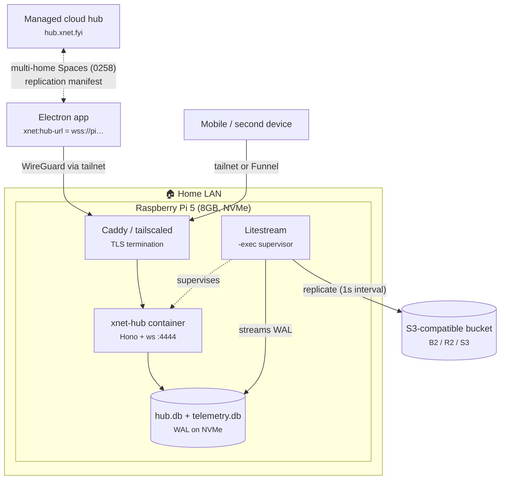
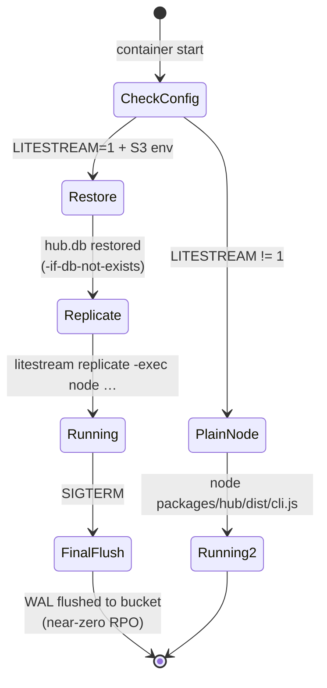

# Running an xNet Hub on a Raspberry Pi

## Problem Statement

xNet's pitch includes "self-host your hub on a $5/month VPS"
(`site/src/components/sections/Hubs.astro`). But the most local-first hosting
target of all — a Raspberry Pi on the user's own shelf — is nowhere in our
docs, installer, or CI. The hub guide
(`site/src/content/docs/docs/guides/hub.mdx`) covers Railway, Fly, and generic
VPS Docker; it never mentions ARM, home networks, CGNAT, SD-card wear, or how
a Pi hub coexists with the managed cloud hub.

This exploration answers: **does the hub actually run well on a Pi today, what
breaks, what hardware/network/backup setup should we recommend, and what small
repo changes make "hub on a Pi" a first-class, documented path?**

## Executive Summary

The hub is a near-ideal Pi workload and most of the plumbing already exists:

- The hub is a **single Node process** (Hono HTTP + `ws` WebSocket on one
  port, default 4444) backed by **better-sqlite3** in WAL mode. Its managed
  reference deployment runs in a **512 MB Fly VM** (`packages/hub/fly.toml`),
  so a 4–8 GB Pi has generous headroom.
- The release pipeline **already publishes multi-arch images**
  (`linux/amd64,linux/arm64`) to `ghcr.io/crs48/xnet-hub`
  (`.github/workflows/hub-release.yml:52`), and the Litestream entrypoint is
  arch-aware (`packages/hub/Dockerfile:106-121`). **The Docker path works on a
  Pi 4/5 with 64-bit OS today, unmodified.**
- The **native (non-Docker) path is currently fictional**: the guide's
  `npx @xnetjs/hub` and the systemd unit's
  `/opt/xnet-hub/node_modules/@xnetjs/hub` both require an npm package, but
  `@xnetjs/hub` is `private: true` (`packages/hub/package.json:52`) and is not
  published.
- Three self-host gotchas surfaced that bite hardest on small hardware: the
  **disk watchdog only runs in demo mode**
  (`packages/hub/src/server.ts:168-171`), the **CRDT change log has no
  per-user quota** (exploration 0291), and the deployed web app's **CSP
  `connect-src` blocks arbitrary hub hostnames** (`apps/web/index.html:9`) —
  only Electron/self-built clients can point at `wss://my-pi` freely.

**Recommendation:** bless one hardware profile (Pi 5 · 8 GB · NVMe SSD kit ·
official PSU + active cooler, ≈$150), one software path (Docker compose with
the published arm64 image, Litestream to any S3-compatible bucket), and one
networking default (Tailscale; Funnel or Caddy+port-forward for public
access). Then land the small repo fixes: Pi-aware installer, a "Raspberry Pi"
section in the hub guide, a non-demo disk watchdog, and a decision on
publishing `@xnetjs/hub` to npm.

## Current State In The Repository

### The hub is one small process

`packages/hub/` is "signaling, sync relay, backup, and query server"
(`packages/hub/package.json:4`). One Hono app and one
`WebSocketServer({ server: httpServer })` share a single port
(`packages/hub/src/server.ts:783`). Services: WebRTC signaling, Yjs sync
relay + NodeStore relay, backup/files with per-DID quota, FTS5 query, share
links, and opt-in federation/crawl/shards. The AI route is a thin forwarder to
xNet Cloud, mounted only when `XNET_CLOUD_URL` + tenant secrets are set
(`packages/hub/src/features/ai-forwarder.ts:9-15`) — **dormant on a Pi; no
local inference**.

Config (`packages/hub/src/config.ts`, defaults `packages/hub/src/types.ts:97-115`):

| Env | Default | Notes |
| --- | --- | --- |
| `PORT` / `HUB_PORT` | `4444` | single HTTP+WS port |
| `HUB_DATA_DIR` | `./xnet-hub-data` | SQLite DBs + `blobs/` + `files/` |
| `HUB_STORAGE` | `sqlite` | or `memory` (tests) |
| `HUB_AUTH` | `true` | UCAN bearer tokens, no cookies |
| `HUB_PUBLIC_URL` / `HUB_APP_URL` | — | share-link rendering |
| quotas | 1 GB/DID, 50 MB blob, 1000 conns | `types.ts:100-104` |

No TLS in-process — a reverse proxy (Caddy) or tunnel terminates TLS.

### Storage: three SQLite files, WAL, Litestream-ready

`createSQLiteStorage` opens `hub.db` with `journal_mode=WAL`,
`synchronous=NORMAL`, `busy_timeout=5000`
(`packages/hub/src/storage/sqlite.ts:780-828`); `telemetry.db` and
`billing.db` are separate files so their writes don't contend on the main
write lock (`packages/hub/src/telemetry/store.ts:4-7`,
`packages/hub/src/services/billing-store.ts:103-106`). Under `LITESTREAM=1`,
`wal_autocheckpoint=0` hands checkpointing to Litestream
(`packages/hub/src/storage/litestream.ts:15-17`). There's even a WAL-recovery
path for `SQLITE_IOERR_SHMSIZE` on constrained volumes
(`sqlite.ts:673-814`) — battle scars from Railway that transfer directly to
small-disk Pis.

`litestream-entrypoint.sh` is explicitly documented as the **self-host
durability path** (exploration 0288): point `R2_*`/`LITESTREAM_*` env at *any*
S3-compatible store, restore-on-boot, then `litestream replicate -exec` for
near-zero RPO.

### Deployment assets and their Pi-readiness

| Asset | State on a Pi |
| --- | --- |
| `packages/hub/Dockerfile` | ✅ builds for arm64; Litestream download maps `TARGETARCH=arm64` correctly |
| `ghcr.io/crs48/xnet-hub:latest` | ✅ multi-arch — `hub-release.yml` builds `linux/amd64,linux/arm64` on every release (v0.11.1 published 2026-07-12) |
| `docker-compose.hub.yml` + `Caddyfile.example` | ✅ works as-is (hub + Caddy sidecar) |
| `install-hub.sh` | ⚠️ Debian/Ubuntu-only Docker install — Raspberry Pi OS **is** Debian, so it nearly works, but it doesn't check for 64-bit OS or warn about SD-card data dirs |
| `systemd/xnet-hub.service` | ❌ `ExecStart` points at `/opt/xnet-hub/node_modules/@xnetjs/hub/dist/cli.js`, which nothing can install — `@xnetjs/hub` is `private: true`, unpublished |
| `site/.../guides/hub.mdx` `npx @xnetjs/hub` | ❌ same reason — the package isn't on npm |
| `hub-image.yml` CI | ⚠️ amd64-only smoke boot; the arm64 image is QEMU-cross-built and **never booted in CI** |

### Client-side: pointing an app at a Pi hub

- Web: `apps/web/src/lib/hub-url.ts` — `VITE_HUB_URL` build-time default,
  localStorage override via Settings → Network.
- Electron: `apps/electron/src/renderer/lib/hub-url.ts` — key `xnet:hub-url`,
  default `ws://localhost:4444`, `#hub=<url>` boot override.
- CORS is a non-issue: the hub uses wildcard `cors()` because auth is bearer
  tokens, never cookies (`packages/hub/src/server.ts:147-152`).
- **CSP is the issue**: `apps/web/index.html:9` `connect-src` allows only
  `ws://localhost:*`, `ws://127.0.0.1:*`, and `https://hub.xnet.fyi` /
  `https://*.xnet.fyi`. The deployed web app cannot connect to
  `wss://pi.my-tailnet.ts.net`. Electron and self-built web apps are fine.
- Multi-home (exploration 0258, core merged in #365): the replication
  manifest routes Spaces to destinations — the intended model for "private
  Space homes on my Pi, shared Space homes on the cloud hub".

### Resource footprint levers

- `NodePool` holds up to **500 warm Y.Docs** in RAM, LRU-evicted
  (`packages/hub/src/pool/node-pool.ts:47,171-174`). This is the main memory
  lever and it is **not env-configurable** — constructor option only.
- `/health` already exposes rss/heap, warm-doc counts, connections, storage
  bytes, and backup freshness (`packages/hub/src/server.ts:403-436`);
  Prometheus `/metrics` is there too. Monitoring a Pi needs zero new code.
- The **disk watchdog** (30 s scan, sheds relay writes at 90 % of `maxBytes`;
  `packages/hub/src/services/disk-watchdog.ts`) is instantiated **only when
  `config.demo`** (`server.ts:168-171`). A normal self-host hub will happily
  fill its disk until SQLite starts throwing.
- Exploration 0291's finding still applies: the `node_changes` append-only
  log has **no per-user quota** — the 1 GB/DID default only gates
  backup/file uploads. Disk headroom on a Pi must assume unbounded CRDT
  growth until that lands.

## External Research

### Hardware fit (2025–2026 pricing; volatile — recheck before publishing)

| Board | CPU / RAM | Verdict |
| --- | --- | --- |
| **Pi 5 (8 GB)** | 4× Cortex-A76 @ 2.4 GHz | **Recommended.** ~$80 board; official M.2 HAT+ SSD kit $40–55; 27 W PSU $12; Active Cooler $5 → **≈$140–160 total** |
| Pi 5 (16 GB) | same | Overkill; $305 amid the 2026 RAM-price surge |
| Pi 4 (4/8 GB) | 4× Cortex-A72 @ 1.8 GHz | Works (USB 3 SSD instead of NVMe); weak value at 2026 prices |
| Pi Zero 2 W | 4× A53, **512 MB** | Not viable as a primary hub — no headroom for V8 heap + WS buffers, microSD-only storage |

**Storage is the real decision, not CPU.** SD cards have weak wear-leveling,
no TRIM, and fail under 24/7 fsync-heavy database loads; a USB/NVMe SSD
delivers ~3,400 fsyncs/s and ≥4× the random-4K writes of premium microSD
(jamesachambers benchmarks). Every "Nextcloud on a Pi" guide lists SD-card
installs as the documented failure mode. WAL reduces fsync frequency but the
checkpoint stream still chews cheap cards. **NVMe via the official M.2 HAT+ is
the default; SD-only setups need log2ram/zram/`noatime` and should be treated
as demo-grade.**

### Software on ARM64

- Node ships official `linux-arm64` builds; NodeSource debs cover Pi OS
  64-bit. (Repo spread: engines `>=20`, Dockerfile `node:22-alpine`, `.nvmrc`
  23 — all fine on arm64.)
- **better-sqlite3 ships arm64 prebuilds** for both glibc (`linux-arm64`) and
  musl (`linuxmusl-arm64`) — verified against v12 release assets; ABI lines
  for Node 22/24 are covered, so `npm install` needs no compiler on Pi OS
  64-bit. 32-bit `linux-arm` has **no** prebuilds → require a 64-bit OS.
- **Litestream ships `linux-arm64` .deb/.tar.gz** (plus armv6/armv7); its own
  marketing runs it on a Pi Zero. Replicas: S3, R2, **Backblaze B2** (official
  guide), GCS, SFTP, or a second local path. Known gotcha (0258 HA memory):
  `VACUUM` invalidates Litestream's WAL lineage — restart generations around
  it.

### Getting traffic to a home Pi

| Option | E2E to the Pi? | CGNAT-proof? | Notes |
| --- | --- | --- | --- |
| **Tailscale (private tailnet)** | ✅ WireGuard | ✅ | Simplest; `tailscale cert` issues real LE certs for `pi.tailnet.ts.net`; MagicDNS names |
| **Tailscale Funnel (public)** | ✅ TLS terminates **on the Pi** (official docs; SNI relay) | ✅ | Ports 443/8443/10000 only; `ts.net` names only; undisclosed bandwidth caps |
| **Cloudflare Tunnel** | ❌ TLS terminates at CF edge (by design) | ✅ | Free, arm64 `cloudflared`, WebSockets fine; **100 MB per-request upload cap** — near our 50 MB `maxBlobSize`, watch multi-part growth |
| Port-forward + DDNS + Caddy | ✅ | ❌ dead on CGNAT ISPs | The classic path; increasingly blocked on fiber/5G ISPs |
| VPS + rathole/frp (TCP passthrough) | ✅ if passthrough | ✅ | ~$5/mo VPS defeats the point unless you need a stable public anycast-ish IP |

Since hub auth is bearer-token and sync payloads are application-encrypted,
Cloudflare's edge termination leaks metadata/headers rather than documents —
but Tailscale preserves E2E outright, so it wins on principle for a
local-first product.

### Reliability practice (well-trodden Pi canon)

- Official **27 W PSU** — without a detected 5 A supply, Pi 5 firmware caps
  USB at 600 mA and can brown out an attached SSD.
- **Active Cooler**: Pi 5 soft-throttles at 80 °C; the $5 cooler holds
  sustained full load at ~60 °C. An idle Node relay runs silent.
- systemd `Restart=always` + BCM **hardware watchdog**
  (`RuntimeWatchdogSec`) + Debian `unattended-upgrades`.
- Power draw: **~3 W idle** → **≈$8/year** electricity. Against a $60/yr VPS,
  a $150 Pi build pays for itself in ~2.5–3 years; comparable ARM VPSes
  (Hetzner CAX11) have weaker per-core CPUs than the Pi 5's A76.

### Prior art

PocketBase (Go + SQLite) sustains 10k+ realtime connections on a 2-vCPU/4 GB
ARM VPS weaker than a Pi 5 — the standard proof that one-node SQLite serves
real traffic on small ARM (no *published* on-Pi numbers exist; extrapolate,
don't cite). Nextcloud-on-Pi consensus: Pi 5 8 GB + NVMe is "genuinely
comfortable for a small family" — and our hub is far lighter than Nextcloud.
Syncthing and Home Assistant establish 24/7 ARM self-hosting as boring,
solved territory.

## Key Findings

1. **Docker on a Pi works today.** Multi-arch images publish on every release;
   the Litestream entrypoint handles arm64; `docker-compose.hub.yml` + Caddy
   run unmodified on Raspberry Pi OS 64-bit. Nothing in the hot path is
   amd64-specific.
2. **The native path is advertised but impossible.** `npx @xnetjs/hub` (in
   the shipped guide) and `systemd/xnet-hub.service` both presuppose an npm
   package that `private: true` prevents from existing.
3. **The arm64 image has never booted anywhere in CI.** `hub-image.yml` smoke
   tests amd64 only; arm64 is QEMU-cross-compiled and shipped blind.
4. **Self-host hubs have no disk guard.** The watchdog + eviction machinery
   from 0291 is demo-mode-only, and the CRDT log is unbounded per-user — the
   worst combination for a 256 GB NVMe card that nobody is paging.
5. **The deployed web app can't reach a Pi hub** (CSP `connect-src`). Electron
   is the natural first client for a home hub; the web app needs either a CSP
   change, a documented limitation, or a `*.xnet.fyi` device-DNS story.
6. **Sizing is comfortable.** 512 MB (Fly) is the proven floor; 500 warm docs
   is the main RAM lever (not yet env-tunable); `/health` + `/metrics` already
   expose everything a Pi dashboard needs.
7. **Tailscale is the right default exposure**, preserving E2E and dodging
   CGNAT; Funnel covers the public-share-link case without opening ports.

## Options And Tradeoffs

### A. Docker compose on Pi OS 64-bit (published arm64 image) — recommended

- **Pros:** works today; identical bits to the smoke-tested amd64 image;
  Litestream + Caddy included; `install-hub.sh` is 90 % of the way there.
- **Cons:** Docker layer on a small board (modest overhead); image updates are
  manual (`docker compose pull`) until we document Watchtower or similar.

### B. Native Node + systemd (publish `@xnetjs/hub` to npm)

- **Pros:** no container overhead; better-sqlite3 arm64 prebuilds make
  `npm install` toolchain-free; the hardened systemd unit already exists;
  most "appliance-like" result.
- **Cons:** requires a **publishing decision** — hub is currently private and
  outside the changesets `fixed` core; its workspace deps (`@xnetjs/sync`,
  `@xnetjs/data`, …) are published, so it's feasible but adds a release
  surface (and the Stop-hook/changeset workflow) to a fast-moving server.

### C. Pi-image / one-card appliance (pre-baked OS image)

- **Pros:** the Home-Assistant-style dream; zero-CLI setup.
- **Cons:** a whole build+update pipeline (pi-gen, A/B updates) for an
  audience we haven't measured. Premature before A ships and gets usage.

### D. Status quo (VPS-only docs)

- **Cons:** leaves the most local-first deployment mode undocumented while
  the marketing page sells self-hosting; the broken `npx` line stays in the
  shipped guide.

### Exposure sub-decision (orthogonal)

Default **Tailscale private**; document **Funnel** for public share links and
**Caddy + port-forward** for users with real public IPs. Mention Cloudflare
Tunnel with the E2E caveat rather than recommending it.



Boot durability lifecycle (already implemented in `litestream-entrypoint.sh`):



## Recommendation

Ship **Option A now** (document + harden the Docker path for Pi), take a
decision on **Option B** (npm publish) as a follow-up, and defer C.

Concretely, the blessed recipe to document:

1. **Hardware:** Pi 5 8 GB + official SSD kit (NVMe) + 27 W PSU + Active
   Cooler (≈$150). Pi 4 + USB-SSD as the budget variant. SD-only = demo-grade,
   say so explicitly.
2. **OS:** Raspberry Pi OS **64-bit** Lite (32-bit has no better-sqlite3
   prebuilds and halves usable RAM anyway).
3. **Hub:** `install-hub.sh` → compose (`ghcr.io/crs48/xnet-hub:latest`,
   arm64 layer) with `LITESTREAM=1` + a B2/R2 bucket.
4. **Network:** Tailscale; `tailscale cert` for the `ts.net` HTTPS name;
   Funnel only if public share links must resolve outside the tailnet.
5. **Client:** Electron Settings → Network → `wss://pi.<tailnet>.ts.net`
   (web-app CSP limitation documented until fixed).

And the repo changes that make it honest (checklist below): Pi-aware
installer, always-on disk watchdog, `HUB_MAX_WARM_DOCS` env, an arm64 boot
smoke in CI, guide section, and removing/fixing the `npx @xnetjs/hub` claim.

## Example Code

Pi-aware additions to `install-hub.sh` (arch + OS + storage checks):

```bash
# ── Raspberry Pi / ARM sanity checks ─────────────────────
ARCH="$(uname -m)"
if [ "$ARCH" = "armv7l" ] || [ "$ARCH" = "armv6l" ]; then
  echo "32-bit ARM OS detected. The hub needs a 64-bit OS (arm64/aarch64)."
  echo "Reinstall Raspberry Pi OS (64-bit) and re-run."
  exit 1
fi
if [ "$ARCH" = "aarch64" ]; then
  ROOT_DEV="$(findmnt -no SOURCE /opt 2>/dev/null || findmnt -no SOURCE /)"
  case "$ROOT_DEV" in
    /dev/mmcblk*)
      echo "⚠ Data dir is on an SD card. SQLite under sync load wears SD"
      echo "  cards out; an NVMe/USB SSD is strongly recommended."
      echo "  (Continuing anyway — consider log2ram + high-endurance card.)"
      ;;
  esac
fi
```

Always-on disk watchdog (today demo-only, `packages/hub/src/server.ts:168`):

```ts
// server.ts — run the watchdog whenever we know the volume budget, not
// only in demo mode. HUB_DISK_LIMIT lets a Pi self-hoster cap usage at,
// say, 80% of the SSD instead of discovering SQLITE_FULL at 3am.
const diskLimit = config.demo
  ? config.demoConfig.diskLimitBytes
  : toNumber(process.env.HUB_DISK_LIMIT)
if (diskLimit) {
  diskWatchdog = createDiskWatchdog({ dataDir: config.dataDir, maxBytes: diskLimit })
  diskWatchdog.start()
}
```

Warm-doc pool sizing for small RAM (`packages/hub/src/pool/node-pool.ts:47`):

```ts
this.maxWarmDocs =
  options?.maxWarmDocs ?? toNumber(process.env.HUB_MAX_WARM_DOCS) ?? 500
```

Compose override a Pi user drops next to `docker-compose.hub.yml`:

```yaml
# docker-compose.override.yml — Pi profile
services:
  hub:
    environment:
      - LITESTREAM=1
      - LITESTREAM_PATH=hubs/my-pi
      - R2_ENDPOINT=${S3_ENDPOINT}      # any S3-compatible store (0288)
      - R2_BUCKET=${S3_BUCKET}
      - R2_ACCESS_KEY_ID=${S3_KEY_ID}
      - R2_SECRET_ACCESS_KEY=${S3_SECRET}
      - HUB_DISK_LIMIT=200000000000     # 200 GB of a 256 GB NVMe
      - HUB_MAX_WARM_DOCS=200           # 4 GB-Pi comfort margin
    deploy:
      resources:
        limits:
          memory: 1g
```

## Risks And Open Questions

- **Unbounded CRDT log on finite disk** (0291): until per-user sync quotas
  exist, a Pi hub's only defenses are the (currently demo-only) watchdog and
  bucket-side Litestream retention. The watchdog fix is the cheap mitigation;
  the quota is the real one.
- **arm64 image is shipped untested.** QEMU cross-builds occasionally produce
  arch-specific native-module breakage (better-sqlite3 is rebuilt from source
  in the Alpine image — musl arm64). A boot smoke under QEMU in
  `hub-release.yml` is slow (~minutes) but catches this class entirely.
- **CSP decision for the web app**: allow user-configured `connect-src` via a
  service-worker/proxy? Document Electron-only? Or offer managed device DNS
  under `*.xnet.fyi`? Needs a product decision; this exploration only flags it.
- **Publishing `@xnetjs/hub`** adds a public API surface + changeset burden to
  a fast-iterating server. Alternative: publish a meta-package or a
  single-file `pkg`-style binary later; short-term, delete the `npx` line
  from the guide instead of pretending.
- **Home upload bandwidth** is the real performance ceiling for remote sync
  (typical 10–40 Mbit up), not the Pi. Set expectations in the guide.
- **Tailscale Funnel bandwidth caps are undisclosed** — fine for share links,
  unknown for heavy blob sync.
- **2026 RAM-price volatility**: quoted hardware totals drift; the guide
  should link a parts list, not hardcode prices.

## Implementation Checklist

- [ ] `install-hub.sh`: add arm64/32-bit-OS detection and SD-card warning
      (example above); mention Raspberry Pi OS in the header comment.
- [ ] Hub guide (`site/src/content/docs/docs/guides/hub.mdx`): add a
      "Raspberry Pi (home hub)" section — blessed hardware profile, 64-bit OS
      requirement, compose + Litestream-to-B2 recipe, Tailscale/Funnel/Caddy
      exposure table with the E2E notes, power/cooling/watchdog basics, and
      the web-app CSP limitation.
- [ ] Remove or fix the `npx @xnetjs/hub` quick-start in the guide (package
      is unpublished); decide on Option B (npm publish) as a separate issue.
- [ ] Make the disk watchdog available outside demo mode via
      `HUB_DISK_LIMIT` (`packages/hub/src/server.ts:168-171`).
- [ ] Expose `HUB_MAX_WARM_DOCS` through config → `NodePool`
      (`packages/hub/src/pool/node-pool.ts:47`).
- [ ] Fix `systemd/xnet-hub.service` `ExecStart` (or its docs) to match a
      path that can actually exist (compose-managed or future npm install).
- [ ] Add an arm64 boot smoke to `hub-release.yml` (QEMU: build arm64 layer,
      `docker run --platform linux/arm64`, probe `/health`).
- [ ] Document `docker compose pull`-based updates (or Watchtower) for
      unattended Pi image refresh.
- [ ] File the CSP `connect-src` product decision for custom hub hosts in the
      deployed web app (`apps/web/index.html:9`).

## Validation Checklist

- [ ] `docker run --platform linux/arm64 ghcr.io/crs48/xnet-hub:latest` (QEMU
      or real Pi) boots, `/health` returns `status: ok` with sqlite storage.
- [ ] On a physical Pi 5 (8 GB, NVMe): compose stack up; Electron client
      pointed at `wss://<pi>` syncs a workspace both directions; `/health`
      `memory.rss` stays under ~500 MB with a seeded workspace.
- [ ] Litestream drill on the Pi: write data → destroy `hub.db` → restart
      container → data restored from bucket; `/health` backup freshness
      (`lastSyncMs`) stays current during writes.
- [ ] Kill-power test: hard power-cut mid-sync on NVMe; hub restarts clean
      (WAL recovery) with no `SQLITE_CORRUPT`.
- [ ] `HUB_DISK_LIMIT` set low → watchdog sheds relay writes with
      `STORAGE_FULL` instead of crashing SQLite.
- [ ] Tailscale path: MagicDNS name + `tailscale cert` TLS; second device on
      the tailnet syncs; Funnel serves a `/s/...` share link publicly.
- [ ] Installer on a fresh Raspberry Pi OS 64-bit Lite image completes
      end-to-end with only the documented prompts.

## References

- Repo: `packages/hub/README.md`, `packages/hub/Dockerfile`,
  `packages/hub/docker-compose.hub.yml`, `packages/hub/install-hub.sh`,
  `packages/hub/systemd/xnet-hub.service`,
  `packages/hub/litestream-entrypoint.sh`, `packages/hub/fly.toml`,
  `packages/hub/src/config.ts`, `packages/hub/src/types.ts`,
  `packages/hub/src/storage/sqlite.ts`,
  `packages/hub/src/services/disk-watchdog.ts`,
  `packages/hub/src/pool/node-pool.ts`, `apps/web/index.html`,
  `apps/electron/src/renderer/lib/hub-url.ts`,
  `.github/workflows/hub-release.yml`, `.github/workflows/hub-image.yml`,
  `site/src/content/docs/docs/guides/hub.mdx`
- Explorations: 0178 (Litestream), 0187 (telemetry.db split), 0255 (cloud
  go-live), 0258 (multi-home sync / replication manifest), 0288 (self-host
  Litestream durability), 0291 (demo quota/eviction/disk watchdog)
- Raspberry Pi: [Pi 5](https://www.raspberrypi.com/products/raspberry-pi-5/) ·
  [M.2 HAT+](https://www.raspberrypi.com/products/m2-hat-plus/) ·
  [SSD kits](https://www.raspberrypi.com/news/raspberry-pi-ssds-and-ssd-kits/) ·
  [27W PSU](https://www.raspberrypi.com/products/27w-power-supply/) ·
  [thermals](https://www.raspberrypi.com/news/heating-and-cooling-raspberry-pi-5/) ·
  [2026 power draw](https://raspberry.tips/en/raspberrypi-tutorials/raspberry-pi-power-consumption-update-2026-all-models-compared)
- Storage: [SD corruption (Hackaday)](https://hackaday.com/2022/03/09/raspberry-pi-and-the-story-of-sd-card-corruption/) ·
  [SSD vs microSD benchmarks](https://jamesachambers.com/raspberry-pi-3b-microsd-vs-ssd-speed-benchmarks/) ·
  [reduce SD writes](https://www.dzombak.com/blog/2024/04/pi-reliability-reduce-writes-to-your-sd-card/)
- ARM64 software: [better-sqlite3 releases (arm64 prebuilds)](https://github.com/WiseLibs/better-sqlite3/releases) ·
  [Litestream releases (arm64)](https://github.com/benbjohnson/litestream/releases) ·
  [Litestream on B2](https://litestream.io/guides/backblaze/)
- Networking: [Tailscale Funnel](https://tailscale.com/kb/1223/funnel) ·
  [Tailscale HTTPS certs](https://tailscale.com/docs/how-to/set-up-https-certificates) ·
  [Cloudflare Tunnel TLS/privacy analysis](https://pluggie.io/blog/cloudflare-tunnel-tls-privacy) ·
  [Tunnel 100MB upload cap](https://community.cloudflare.com/t/maximum-upload-limit-for-cloudflare-tunnel-free-plan/432510) ·
  [CGNAT workarounds](https://www.xda-developers.com/cgnat-port-forwarding-workarounds/) ·
  [rathole](https://github.com/rathole-org/rathole)
- Prior art: [PocketBase FAQ / ARM benchmarks](https://pocketbase.io/faq/) ·
  [Nextcloud on Pi sizing](https://selfhosting.sh/apps/nextcloud/raspberry-pi/)
