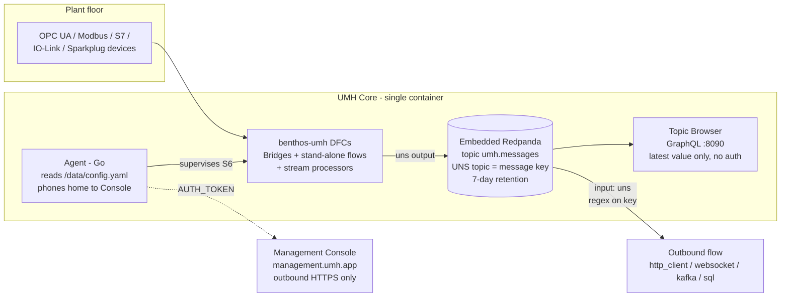
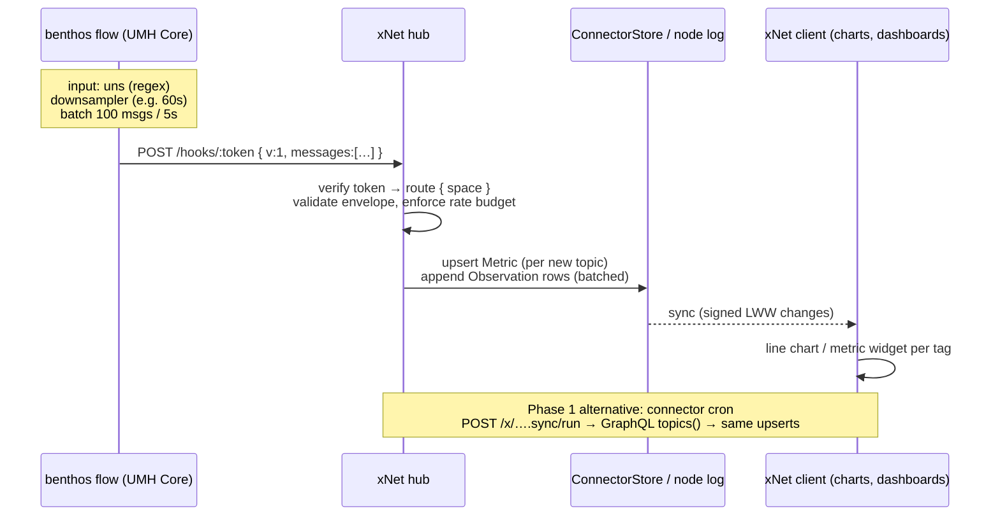
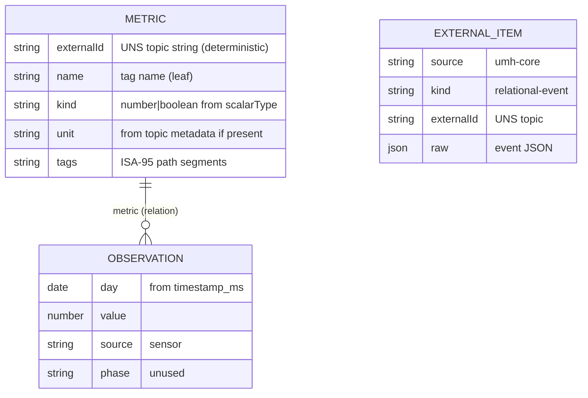

# Connecting To UMH Core

## Problem Statement

United Manufacturing Hub's **UMH Core** is a single-container industrial data
hub: it ingests plant-floor signals (OPC UA, Modbus, S7, IO-Link, Sparkplug…)
through benthos-umh pipelines and publishes them into a **Unified Namespace
(UNS)** — an ISA-95-shaped topic tree backed by an embedded Redpanda broker.
Factories standardizing on UMH have a live, well-structured feed of every tag
in the plant.

xNet has no way to see any of it. We have a mature, capability-governed
integration fabric (connectors, actions, webhook inboxes — exploration 0213),
schemas that already model metrics and observations (exploration 0180), and
charts/dashboards to render them — but **zero MQTT/Kafka/streaming ingest code
anywhere in the repo**. This exploration asks: what is the right way to connect
an xNet workspace to a UMH Core instance, so that plant tags become queryable,
chartable, shareable xNet nodes — without pretending xNet is a historian?

## Executive Summary

- **UMH Core's supported integration surfaces are narrow and HTTP-shaped**,
  which is good news for us. The two sanctioned paths are (a) the **Topic
  Browser GraphQL API** on port 8090 (namespace tree + latest value per topic,
  no history, no auth, CORS-configurable) and (b) an **outbound benthos flow**
  (`input: uns` → any standard Benthos output such as `http_client`). Direct
  Kafka consumption of the embedded Redpanda is explicitly discouraged; there
  is **no MQTT broker in Core** (that's Classic / roadmap).
- **xNet's existing seams cover both paths with almost no new machinery**: a
  `defineConnector` poll connector maps 1:1 onto the GraphQL API, and the
  generic webhook inbox (`POST /hooks/:token`) is a ready-made target for a
  benthos `http_client` push flow. Secrets ride the hub broker (`scopedEnv`),
  egress rides the closed-by-default `network` capability.
- **The hard constraint is rate, not transport.** Every xNet datapoint is a
  signed, hash-chained LWW node (protocol 0200). A plant line emits orders of
  magnitude more samples than that model should absorb. The design therefore
  pushes **downsampling to the UMH side** (benthos-umh ships a `downsampler`
  processor) and treats xNet as a *latest-value mirror + curated low-frequency
  history*, never a historian. The plan docs already commit us to this stance
  ("xNet doesn't replace Kafka/Flink for telemetry",
  `docs/plans/plan00Setup/15-enterprise-scale.md`).
- **Recommendation: a two-phase hybrid.** Phase 1 is a pull connector
  (`dev.xnet.connector.umh-core`) that polls GraphQL:8090 to discover the
  namespace and mirror latest values into `Metric`-per-tag nodes — shippable
  entirely on today's framework. Phase 2 adds the push lane: a documented
  benthos stand-alone flow (downsample → batch → `http_client` POST) landing in
  a UMH-aware webhook route that appends `Observation` rows, unlocking sparkline
  history and dashboards.

## Current State In The Repository

### Integration fabric (all HTTP, all capability-governed)

| Seam | Where | Shape |
| --- | --- | --- |
| Pull connectors | `packages/plugins/src/connectors/define-connector.ts` | `defineConnector({ id, capabilities: { schemaWrite, network }, sync: { schemas, cadence, pull(ctx) } })`; `ctx` provides broker-scoped `env`, host-allowlisted `fetch`, guarded `store.create/get/update`, target `space` |
| Connector hub half | `packages/hub/src/features/connectors.ts` | `connectorSyncFeature` mounts authed `POST /x/<id>.sync/run`; generic over an injected `run` |
| Outbound actions | `packages/plugins/src/actions/define-action.ts` + `actions/runner.ts` | schema-change/schedule/manual triggers; every fetch passes `assertPublicUrl` (SSRF) + `assertNetwork` |
| Generic webhook inbox | `packages/hub/src/features/webhook-inbox.ts` | `POST /hooks/:token`, token-is-credential, route carries `{ space, schema?, label? }`, `deliver()` is the app-wired node write — **the most direct push seam** |
| Signed provider webhooks | `packages/hub/src/features/webhook-integrations.ts` | HMAC verify → pure normalizer → `ExternalItem` writes (Stripe/Sentry/PagerDuty prior art) |
| Secret broker | `packages/hub/src/features/broker.ts` | `scopedEnv(env, allow)` projects process env to a feature's declared `secrets` (exact keys or `PREFIX_*` globs) |
| Catalog / consent | `apps/web/src/plugins/first-party-catalog.ts`, `registry/first-party.json` | 15 first-party entries drive the install-consent gate + settings form |
| Protocol-compat prior art | `packages/slack-compat/src/` | pure normalize/verify library + thin hub feature — the pattern for any "speak protocol X" layer |

### Data model & rendering (time series already has a home)

- `packages/data/src/schema/schemas/metric.ts` — **Metric**: the definition of
  a measured variable (`kind`, `unit`, `polarity`, `target`, `schedule`). The
  natural analog of a UMH **tag**.
- `packages/data/src/schema/schemas/observation.ts` — **Observation**: one
  datapoint (`metric` relation, `day`, `value`, `source: manual|sensor|import`).
  The analog of a UMH **sample**; `sensor` source already exists.
- `packages/data/src/schema/schemas/external-item.ts` — the generic sync
  receiver used by the API-key connectors.
- Rendering: `packages/charts/` (`ChartTypeRegistry`, line/area builtins),
  `packages/dashboard/src/widgets/` (`chart-widget`, `metric-widget`,
  `streak-heatmap-widget`), database views in `packages/data/src/database/` +
  `packages/views/`.

### What does not exist

- **No MQTT/Kafka/AMQP client code anywhere.** Repo-wide search returns only
  design-doc mentions (0213 lists MQTT as a planned T3 connector; the
  enterprise-scale plan names an "event streaming bridge" as future work).
- **No streaming/high-frequency ingest path.** Every ingest is request/response
  HTTP; the sync WebSocket (`packages/hub/src/ws/`) is CRDT transport, not
  external feed ingest.
- The per-datapoint unit of storage is a **signed, hash-chained `Change`**
  (`packages/sync/src/change.ts`, protocol v3, hybrid Ed25519 + ML-DSA). This
  is deliberately heavyweight — wrong tool for raw tag streams.
- Naming caveat: `packages/data-bridge` is an *internal* off-main-thread query
  bridge (comlink workers), nothing to do with external systems. A UMH bridge
  should not reuse that name.

## External Research

All facts below from official UMH docs (docs.umh.app) and the
united-manufacturing-hub GitHub org, current as of July 2026. Roadmap items are
flagged.

### UMH Core in one diagram



Key facts:

- **One container, S6-supervised processes**: Go agent, benthos-umh, embedded
  Redpanda. Config is a single hot-reloaded `/data/config.yaml`, two-way synced
  with the cloud Management Console. Min 2 vCPU / 4 GB / 40 GB.
- **All UNS data lives in one physical Kafka topic `umh.messages`**; the
  logical UNS topic string is the Kafka *message key*; consumers filter by
  regex on the key. Docs explicitly discourage exposing raw Redpanda to
  external clients (bypasses bridge-side schema validation).
- **UNS topic convention**:
  `umh.v1.<enterprise>.<site>.<area>.<line>.<machine>.<data_contract>[.<virtual_path>].<name>`
  — up to 5 ISA-95 location levels (enterprise required), contracts start with
  `_` (`_raw`, `_pump_v1`, …). Example:
  `umh.v1.acme.chicago.packaging.line1.filler._raw.speed`.
- **Time-series payload is strict**: `{"timestamp_ms": 1733904005123, "value": 23.4}`
  (number/boolean/string; no extra keys; one sensor value per topic).
  Relational payloads are arbitrary JSON with `timestamp_ms`.
- **Topic Browser GraphQL API** (port 8090, default-enabled): `topics(filter, limit)`
  and `topic(topic)` queries; `Event` = `TimeSeriesEvent { producedAt,
  numericValue, scalarType }` | `RelationalEvent { json }`. **Latest event
  only — no history, no subscriptions, no pagination, currently no auth**;
  `corsOrigins` configurable.
- **No MQTT broker in Core** (Classic bundles HiveMQ). An MQTT façade plug-in
  over Redpanda is announced roadmap, not shipped.
- **REST endpoints** `POST /api/v1/ingest` and `GET /api/v1/uns/tree` appear
  only in the Core-vs-Classic FAQ tied to the roadmap `umh-core-API` plugin —
  treat as unshipped.
- **benthos-umh** (Apache-2.0) ships custom inputs (`opcua`, `modbus`,
  `s7comm`, `ethernet-ip`, `sensorconnect`, `sparkplug`, `uns`), processors
  (`tag_processor`, `nodered_js`, **`downsampler`**, `topic-browser`), outputs
  (`uns`, `snowflake_put`) — plus all standard Benthos components
  (`http_client`, `mqtt`, `kafka`, `sql`, `websocket`).
- **Doctrine: "data enters and exits the UNS exclusively through bridges."**
  There is no webhook subsystem; an outbound stand-alone flow with
  `http_client` *is* the webhook.
- **History**: Core is a router + 7-day buffer + latest-value cache, **not a
  historian**. Persistence today = your own TimescaleDB fed by a bridge
  (Historian plug-in is roadmap).
- **Licensing**: UMH monorepo and benthos-umh are Apache-2.0. **No official
  JS/TS client library exists** — plain `fetch` against GraphQL is the norm.

## Key Findings

1. **The two systems meet naturally over HTTP.** UMH's sanctioned egress is a
   benthos `http_client` output; xNet's sanctioned ingress is the webhook inbox
   and connector `fetch`. No Kafka client, no MQTT client, no new transport
   dependency needed in xNet for a fully supported integration.
2. **Discovery and streaming are different problems with different best
   answers.** The GraphQL API is perfect for *discovery* (browse the namespace,
   mirror latest values, low frequency) and useless for *history* (latest event
   only). The benthos push flow is perfect for *continuous samples* and
   requires per-instance config on the UMH side.
3. **Rate discipline must live on the UMH side.** benthos-umh's `downsampler`
   processor + Benthos batching mean the flow can emit, say, 1 sample/min/tag
   in batches of 100 — turning a firehose into something the signed LWW node
   model can absorb. xNet should *also* enforce a server-side budget (reject or
   coalesce over-rate deliveries), but the primary throttle belongs in the flow
   config we hand to users.
4. **The schema fit is unusually good.** UMH tag → `Metric` node (unit, kind
   from `scalarType`); UMH sample → `Observation` node (`source: 'sensor'`);
   the ISA-95 location path maps onto tags/space naming. Relational (non
   time-series) UNS events map onto `ExternalItem` like every other connector.
5. **Auth is the weak spot on the UMH side.** GraphQL:8090 has *no auth* and
   the push flow has whatever auth we put in the `http_client` headers. The
   xNet webhook-inbox token-is-credential model fits exactly; for GraphQL the
   connector's host allowlist plus network-level placement (VPN/tailnet to the
   edge box) is the honest story. This also means the connector will typically
   target a **private address** — `assertPublicUrl`'s SSRF rejection of
   RFC-1918 hosts is designed for untrusted plugin egress and would block a
   LAN UMH box; the connector's `ConnectorFetch` path (host allowlist, not
   public-URL assertion) is the right lane, and that distinction needs a test.
6. **Nothing about this requires the hub to run near the plant.** A benthos
   flow can POST across the internet to a cloud hub. But the *pull* connector
   polling GraphQL does need network reach to port 8090, which usually means
   the hub sits on the same tailnet/VPN as the UMH box — or the user runs a
   local hub (the self-host story we already have). The devkit loopback daemon
   (`:31416`) is available as a dev-machine bridge but is deliberately
   loopback-only; it is not the production path.

## Options And Tradeoffs

### A. Pull connector polling Topic Browser GraphQL (xNet-side)

`defineConnector` with `network: ['<umh-host>:8090']`, cadence
`{ everyMs: 60_000 }`, `pull(ctx)` querying `topics(filter)` then upserting.

- ✅ Ships entirely on today's framework; ~1 file + catalog entry.
- ✅ Namespace discovery for free (`topics` query) — the UX of "browse your
  plant and pick tags" falls out of it.
- ✅ No UMH-side config needed beyond `-p 8090` and `corsOrigins`/network reach.
- ❌ Latest value only — polling can never reconstruct history between polls.
- ❌ Poll cadence floor (connector cadence model) means seconds-to-minutes
  latency; fine for dashboards, wrong for "live".
- ❌ Needs network reach into the plant (VPN/tailnet or local hub).

### B. Push via benthos stand-alone flow → webhook inbox (UMH-side)

A documented `dataFlow` snippet users paste into their UMH config:
`input: uns` (regex on selected tags) → `downsampler` → batch →
`http_client` POST to `https://<hub>/hooks/<token>`.

- ✅ UMH's own recommended egress pattern ("exits exclusively through bridges").
- ✅ Continuous samples → real history in xNet; works across the internet
  (edge → cloud hub) with no inbound firewall holes on the plant side.
- ✅ Downsampling/batching happens at the source, protecting the LWW log.
- ✅ Webhook inbox already exists; token-is-credential matches the trust model.
- ❌ Requires the user to edit UMH config (or use the Management Console) —
  more setup friction than an xNet-side toggle.
- ❌ The generic inbox's `deliver()` currently lands generic nodes; a UMH-aware
  route/normalizer is needed to produce `Observation` rows keyed to the right
  `Metric` (and to enforce a rate budget).
- ❌ Payload is whatever the flow sends — we must publish and validate a strict
  envelope (versioned), since there's no HMAC signing on the UMH side unless
  we template it into the flow headers.

### C. Direct Kafka consumer in the hub (kafkajs on `umh.messages`)

- ✅ Full-fidelity stream, replay within 7-day retention, consumer groups.
- ❌ **Explicitly discouraged by UMH docs** for Core (bypasses bridge-side
  validation; no supported external-listener config for embedded Redpanda).
- ❌ First streaming dependency in the repo (kafkajs), long-lived stateful
  consumer loop in the hub, ops burden (offsets, rebalancing) — a large step
  for the least-supported path.
- ❌ Firehose lands on us; every protective measure has to be ours.

### D. MQTT (over WebSockets) — not viable for Core today

No broker in Core; the MQTT façade plug-in is roadmap. Bring-your-own-broker +
bridge devolves into option B with extra moving parts. Revisit if/when the
plug-in ships (it would enable *browser-direct* subscriptions, which none of
the other options give us).

### E. Local bridge process via the devkit daemon (`:31416`)

Hosting a subscriber in the loopback-only dev daemon. Useful for a demo on a
laptop next to a test UMH instance; wrong shape for production (single-user,
loopback, pairing-token). Not pursued beyond possibly a devtools demo.

### Comparison

| | A: GraphQL pull | B: benthos push | C: direct Kafka | D: MQTT | E: devkit |
| --- | --- | --- | --- | --- | --- |
| Supported by UMH | ✅ documented | ✅ doctrine | ❌ discouraged | ❌ n/a in Core | n/a |
| xNet code needed | connector only | inbox route + normalizer | kafka client + daemon | — | — |
| History | ❌ latest only | ✅ continuous | ✅ + 7d replay | — | — |
| Discovery UX | ✅ `topics()` | ❌ | ⚠️ scan keys | — | — |
| Rate safety | ✅ inherent (poll) | ✅ downsample at source | ❌ ours to build | — | — |
| Setup friction | low (network reach) | medium (UMH config) | high | — | low |
| Latency | poll cadence | seconds (batch window) | sub-second | — | — |

## Recommendation

**Hybrid, phased: A then B.** They compose rather than compete — A gives
discovery and a zero-UMH-config on-ramp; B gives history and production-grade
flow. Both stay inside each system's supported surface.

**Phase 1 — `dev.xnet.connector.umh-core` (pull).** A first-party connector in
`packages/plugins/src/connectors/umh-core.ts` mirroring the RSS/API-key
patterns: config fields `endpoint` (the GraphQL URL) and `topicFilter` (regex,
default `umh\.v1\..+`); `pull` runs `topics(filter)`, upserts one `Metric` per
time-series topic (deterministic external id = the UNS topic string; unit/kind
from `scalarType` + metadata) and one `ExternalItem` per relational topic, and
records latest values as `Observation` rows at most once per poll. Catalog
entry in `apps/web/src/plugins/first-party-catalog.ts` + `registry/first-party.json`.

**Phase 2 — UMH webhook route (push).** A `umh-inbox` variant of the webhook
inbox: same token model, but a versioned envelope
(`{ v: 1, messages: [{ topic, timestamp_ms, value }] }`), a pure normalizer
(slack-compat pattern: `normalizeUnsBatch()` in a small dependency-free module)
mapping topics → the same deterministic `Metric` ids Phase 1 uses, a
**server-side rate budget** (per-token samples/min; coalesce or 429 above it),
and a copy-paste **benthos flow template** in the docs/settings UI with
`downsampler` + batching + an `Authorization: Bearer <token>` header baked in.

Explicit non-goals: xNet is not a historian (7-day-buffer replay, TimescaleDB
parity, sub-second live views are out); no direct Kafka; no write-back to the
UNS in v1 (a future `defineAction` could publish xNet events *into* the UNS via
a UMH ingest bridge, but write paths into plant namespaces deserve their own
exploration).

### Target architecture



### Data mapping



Open modelling question (see Risks): `Observation.day` is date-grained; UNS
samples are millisecond-grained. Either extend `Observation` with an optional
timestamp property (schema version bump) or introduce a sibling
`SensorReading` schema — decide during Phase 1 implementation against real
chart requirements.

## Example Code

Phase 1 connector sketch (mirrors `connectors/rss.ts` / `api-connectors.ts`):

```ts
// packages/plugins/src/connectors/umh-core.ts
export interface UmhCoreConnectorOptions {
  /** Topic Browser GraphQL endpoint, e.g. http://umh-edge.tailnet:8090/graphql */
  endpoint: string
  /** Regex over UNS topics; defaults to everything under umh.v1 */
  topicFilter?: string
}

export function buildUmhCoreConnector(opts: UmhCoreConnectorOptions) {
  const host = new URL(opts.endpoint).host
  return defineConnector({
    id: 'dev.xnet.connector.umh-core',
    name: 'UMH Core (Unified Namespace)',
    capabilities: {
      schemaWrite: [METRIC_SCHEMA, OBSERVATION_SCHEMA, EXTERNAL_ITEM_SCHEMA],
      network: [host],
    },
    sync: {
      schemas: [METRIC_SCHEMA, OBSERVATION_SCHEMA, EXTERNAL_ITEM_SCHEMA],
      cadence: { everyMs: 60_000 },
      async pull(ctx) {
        const res = await ctx.fetch(opts.endpoint, {
          method: 'POST',
          headers: { 'content-type': 'application/json' },
          body: JSON.stringify({
            query: `{ topics(filter: ${JSON.stringify(opts.topicFilter ?? 'umh\\.v1\\..+')}) {
              topic metadata { key value }
              lastEvent {
                ... on TimeSeriesEvent { producedAt numericValue scalarType }
                ... on RelationalEvent { json }
              } } }`,
          }),
        })
        // per topic: upsert Metric (externalId = topic), append one
        // Observation for lastEvent if newer than the stored high-water mark
      },
    },
  })
}
```

Phase 2 benthos flow template (published in docs/settings UI, pasted into UMH's
`/data/config.yaml` or the Management Console):

```yaml
dataFlow:
  - name: xnet-bridge
    desiredState: active
    dataFlowComponentConfig:
      benthos:
        input:
          uns:
            umh_topic: 'umh\.v1\.acme\.plant1\..+' # tags to mirror
        pipeline:
          processors:
            - downsampler: {} # rate discipline at the source
        output:
          http_client:
            url: https://hub.example.com/hooks/<TOKEN>
            verb: POST
            headers: { content-type: application/json }
            batching: { count: 100, period: 5s }
```

## Risks And Open Questions

- **Rate abuse / log bloat.** Even downsampled, 500 tags × 1/min ≈ 720k
  observations/day if misconfigured. The server-side budget (per-token
  samples/min + per-space cap) is mandatory, not optional; also consider
  retention (auto-prune `Observation`s older than N days per connector space) —
  echoes of the 0249 cold-open lesson about unbounded change logs.
- **`Observation.day` granularity** (date vs ms) — schema decision above; a
  property addition is a minor bump, a new schema is additive. Either way the
  Tier-2 seed auto-covers or `seed-manifest.ts` needs a look
  (`packages/devtools/src/seed/`).
- **SSRF vs LAN targets.** Connector fetch must allow the private-address UMH
  host that its allowlist names, while action/unfurl paths keep rejecting
  RFC-1918. Verify the two code paths really are distinct and add a regression
  test before shipping.
- **No auth on GraphQL:8090.** We should document the network-placement
  expectation loudly (tailnet/VPN/local hub) and never proxy the endpoint
  through the hub unauthenticated.
- **Envelope drift.** UMH payload contracts are versioned (`umh.v1.…`); our
  inbox envelope must be too (`v: 1`), and the normalizer pure + golden-vector
  tested (0200 house style) so UMH-side changes surface as test failures, not
  silent data corruption.
- **Unverified/roadmap UMH surfaces**: `POST /api/v1/ingest`,
  `GET /api/v1/uns/tree`, the MQTT façade plug-in, the Historian plug-in. Do
  not build against them; revisit MQTT-over-WS for browser-direct live views
  when it ships.
- **Write-back (xNet → UNS)** deliberately deferred: publishing into a plant
  namespace has safety implications (UMH's own "write flows coming soon" is
  still maturing) and deserves its own exploration.
- **Demo/test story.** UMH Core needs 2 vCPU/4 GB — fine for CI-adjacent
  docker, but the connector unit tests should run against a stub GraphQL
  server + recorded fixtures, not a live container (0294 lane policy).

## Implementation Checklist

Phase 1 — pull connector:

- [ ] `packages/plugins/src/connectors/umh-core.ts`: `buildUmhCoreConnector`
      (GraphQL `topics()` poll → `Metric`/`Observation`/`ExternalItem` upserts,
      deterministic external ids = UNS topic strings, latest-value high-water
      mark).
- [ ] Decide `Observation` timestamp granularity (extend schema vs sibling
      `SensorReading`); implement + changeset accordingly.
- [ ] Unit tests with a stubbed GraphQL endpoint + fixture payloads (time
      series and relational events; malformed `scalarType`; empty namespace).
- [ ] Export from the connectors sub-barrel (`packages/plugins/src/index.ts`
      grouped block — sub-barrel policy 0276) + changeset (`minor` on
      `@xnetjs/plugins`; lockstep core if schemas change).
- [ ] Catalog entry in `apps/web/src/plugins/first-party-catalog.ts` +
      `registry/first-party.json` (config fields: endpoint, topic filter;
      capabilities preview).
- [ ] Seed coverage: confirm Tier-2 auto-covers any new schema or extend
      `seed-manifest.ts`.
- [ ] SSRF/LAN regression test: connector fetch reaches an RFC-1918 allowlisted
      host; action fetch still refuses it.

Phase 2 — push lane:

- [ ] Pure normalizer module (`normalizeUnsBatch`: envelope v1 → typed
      messages; golden-vector tests) — slack-compat pattern.
- [ ] UMH-aware webhook route on the inbox (`schema`-tagged route or dedicated
      feature): validate envelope, enforce per-token rate budget, batch node
      writes.
- [ ] Retention/prune policy for connector-space `Observation`s.
- [ ] Benthos flow template (downsampler + batching + bearer header) rendered
      in the connector settings UI with the live token, plus docs page.
- [ ] End-to-end soak test: replayed UNS fixture stream at budget and 10×
      budget (assert coalesce/429 path).

- [ ] Dashboard starter: a seeded "Plant overview" example (line chart +
      metric widgets bound to seeded UMH-style metrics).
- [ ] Docs: integration guide (network placement, no-auth-on-8090 warning,
      Management Console vs config.yaml setup paths).

## Validation Checklist

- [ ] Against a real UMH Core container (or recorded fixtures from one), the
      Phase 1 connector materializes one `Metric` per time-series topic with
      correct unit/kind, and re-running sync is idempotent (LWW upsert, no
      duplicates).
- [ ] Latest values appear in a line chart / metric widget within one poll
      cadence of changing on the UMH side.
- [ ] Phase 2 flow template pasted into a UMH instance delivers batched
      observations end-to-end; history renders across hub restarts.
- [ ] Over-budget replay is coalesced/rejected without corrupting the change
      log; hub memory/CPU stay flat during the 10× soak.
- [ ] Revoking the inbox token immediately 404s deliveries; rotating it from
      settings resumes flow.
- [ ] Connector consent screen accurately previews capabilities (network host,
      schema writes) before install.
- [ ] `seed-coverage.test.ts` green; changeset coverage hook green; no root
      barrel churn beyond the one grouped line.

## References

- UMH docs: <https://docs.umh.app/> · [Core vs Classic FAQ](https://docs.umh.app/umh-core-vs-classic-faq) · [Configuration reference](https://docs.umh.app/reference/configuration-reference) · [Topic Browser GraphQL](https://docs.umh.app/reference/http-api/topic-browser-graphql.md) · [Unified Namespace / topic convention](https://docs.umh.app/usage/unified-namespace.md) · [Data flows](https://docs.umh.app/usage/data-flows.md)
- benthos-umh: [GitHub (Apache-2.0)](https://github.com/united-manufacturing-hub/benthos-umh) · [uns input](https://docs.umh.app/benthos-umh/input/uns-input) · [uns output](https://docs.umh.app/benthos-umh/output/uns-output)
- UMH monorepo: <https://github.com/united-manufacturing-hub/united-manufacturing-hub> (Apache-2.0; contains `umh-core/`)
- In-repo prior art: exploration 0213 (integration catalog — lists MQTT as
  planned T3), 0196 (connectors), 0189 (feature modules / secret broker),
  0198 (slack-compat), 0180 (Metric/Observation), 0200 (portable protocol /
  golden vectors), 0249→0260 (change-log bloat lessons),
  `docs/plans/plan00Setup/15-enterprise-scale.md` (telemetry non-goals).
