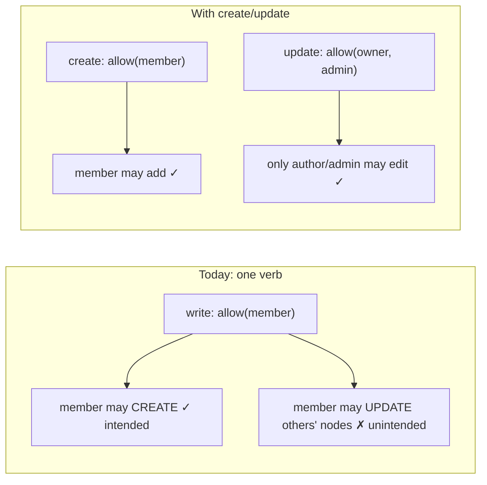
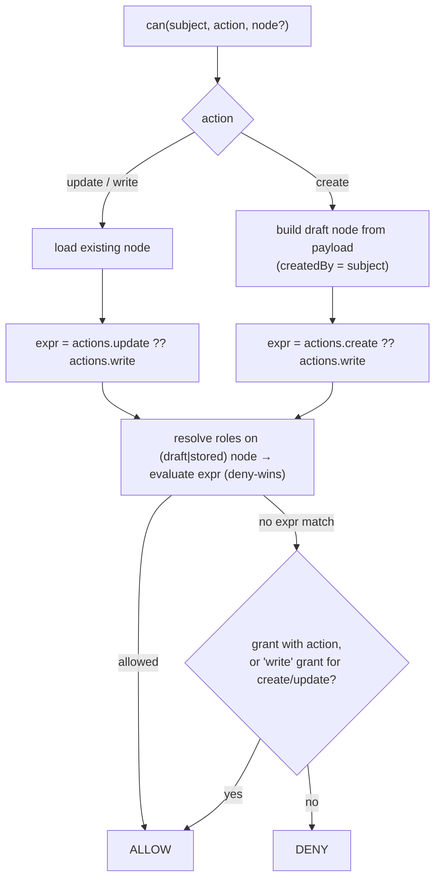
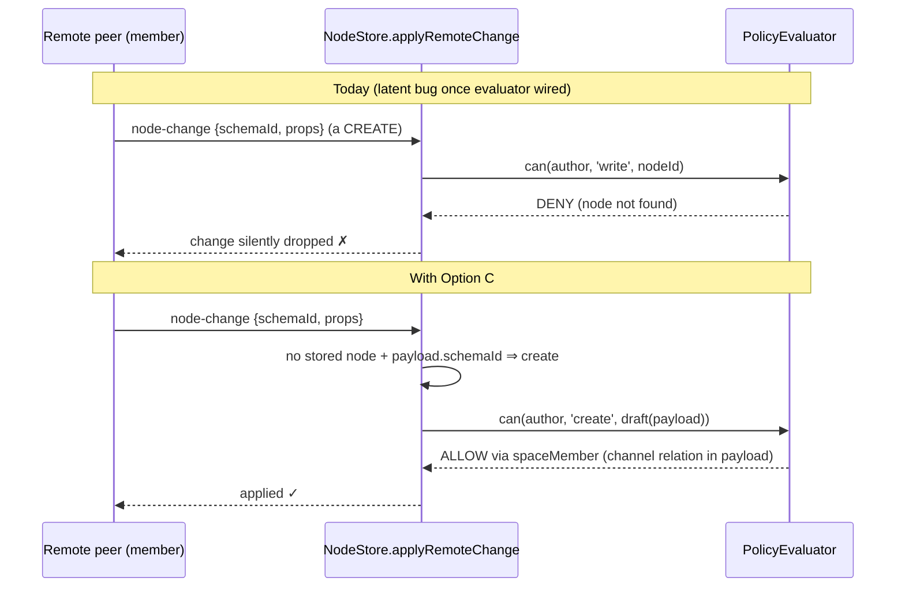

# Splitting `write` Into `create` And `update` — Schema Authorization CRUD Coverage

## Problem Statement

Schema authorization (explorations 0085/0181/0192) speaks five actions:

```
action ∈ { read, write, delete, share, admin }
```

`read`, `delete`, and `share` map cleanly onto CRUD-and-beyond, but **`write`
conflates two operations with different security semantics: creating a node
that does not exist yet, and updating a node that does.** The question this
exploration answers: does the system actually support CRUD-granular policy,
and should `write` be broken into `create` and `update` — or at least extended
so those refinements can be expressed?

## Executive Summary

- **Today `write` is checked for both `store.create()` and `store.update()`**,
  and the create-time check is **vacuous for the creator role**: it evaluates
  against a phantom node whose `createdBy` is the caller, so any schema whose
  `write` expression includes `owner` (all 44 built-in authorized schemas do)
  allows anyone to create.
- This makes two common policies **inexpressible**:
  1. **Author-owned content in shared containers** — "anyone in the channel may
     post a message; only the author may edit it." `ChatMessage` uses
     `spaceCascadeAuthorization('channel')`, whose `write` includes
     `spaceMember` — so by declared policy **any member may edit anyone else's
     message**. Chat _behaves_ correctly today only because enforcement is
     partial (see Current State).
  2. **Contributor roles** — "may add tasks to this space and edit their own,
     but not rewrite others'." The forum/issue-tracker default.
- There is also a **latent fail-closed bug**: the remote-change path maps
  every non-delete change to `write` on the _existing_ node; for a remote
  **create** the node doesn't exist, and the evaluator denies missing nodes —
  so the day the `DefaultPolicyEvaluator` is wired into sync, collaborator
  creates get silently rejected.
- Prior art is unambiguous: Firestore split `write` into
  `create`/`update`/`delete` for exactly this reason; SQL grants
  `INSERT`/`UPDATE` separately; Kubernetes RBAC has `create`/`update`/`patch`;
  Zanzibar-family systems authorize creation **on the container**, never on
  the not-yet-existent object.
- **Recommendation: additive refinement with fallback (Option C).** Keep
  `write` as the coarse action; add optional `create` and `update` actions
  that default to the schema's `write` expression when absent. Evaluate
  `create` against the **draft node** built from the create payload — which
  makes container-relation roles (`role.relation('space', …)`) meaningfully
  gate admission, because the draft's `space`/`channel` relation is already in
  the payload. No schema migration required; schemas opt in one at a time.

## Current State In The Repository

### Action vocabulary

- `packages/core/src/auth-types.ts:25` —
  `AUTH_ACTIONS = ['read', 'write', 'delete', 'share', 'admin']`; `AuthAction`
  is the checked-action type everywhere.
- `packages/core/src/permissions.ts:26` — legacy duplicate
  `Capability = 'read' | 'write' | 'delete' | 'share' | 'admin'` with
  `STANDARD_ROLES` (`editor` = read+write).
- The **normative protocol spec** pins the same set:
  `docs/specs/protocol/04-authorization.md` §1. The conformance `authz`
  vectors (`conformance/vectors/authz/`) pin **expression evaluation only**
  (`{expression, roles, isAuthenticated} → {allowed}`) — action names do not
  appear in the vectors, so extending the vocabulary does not invalidate them.

### Where `write` is checked

| Path              | Site                                                                             | Action                         | Node passed to evaluator                                      |
| ----------------- | -------------------------------------------------------------------------------- | ------------------------------ | ------------------------------------------------------------- |
| `store.create()`  | `packages/data/src/store/store.ts:237,255`                                       | `write`                        | **phantom**: `{ schemaId, createdBy: authorDID, properties }` |
| `store.update()`  | `packages/data/src/store/store.ts:431,461`                                       | `write`                        | existing node                                                 |
| batch/transaction | `packages/data/src/store/store.ts:2397-2425`                                     | `write` (create + update legs) | phantom / stored                                              |
| remote sync       | `packages/data/src/store/store.ts:1608-1621` + `inferActionFromChange` (`:2429`) | `write` unless `deleted`       | **none** — evaluator loads from storage                       |

Three structural observations:

1. **Create is self-authorized.** The phantom node's `createdBy` is the caller
   (`store.ts:253-263`), so `role.creator()` always resolves, and every preset
   (`packages/data/src/auth/presets.ts`) and the Space cascade
   (`packages/data/src/schema/schemas/space-authorization.ts`) put `owner` in
   `write`. The create-time check can only bite via `fieldRules` or a schema
   that deliberately excludes the creator from `write`.
2. **Update is the only real `write`.** For an existing node the check runs
   against stored `createdBy`/properties — this is the meaningful half.
3. **Remote creates fail closed.** `inferActionFromChange` returns
   `write`; the evaluator (`packages/data/src/auth/evaluator.ts:470-477`)
   denies when the node can't be loaded. A remote create's node is not in
   storage yet, so once an evaluator is attached to a syncing store,
   collaborator creates are rejected as unauthorized. (Today the
   `DefaultPolicyEvaluator` is exported but not yet constructed in the app —
   the coverage test `packages/data/src/schema/schemas/authorization-coverage.test.ts`
   explicitly says "the day the evaluator is wired in".)

### The evaluator is action-name agnostic — but default-deny

`packages/data/src/auth/evaluator.ts:527-531`: `auth.actions[input.action]`
is a plain string-keyed lookup; a missing expression is a **deny**
(`DENY_NO_ROLE_MATCH`). So naively checking `can({ action: 'create' })`
against today's schemas (which only define `write`) would deny everything —
any split needs an explicit fallback rule.

Field rules are also gated on the literal action: `evaluator.ts:696` skips
field-level checks unless `input.action === 'write'`.

### Everything else that speaks the vocabulary

- **Hub grant vocabulary** — `read | comment | write | share | admin`
  (`packages/data/src/auth/hub-policy.ts`, `spaceRoleGrantActions` in
  `packages/data/src/schema/schemas/space.ts:168-179`). Note `comment` is
  precedent for **refining** an action (a hub-only refinement of `read`)
  without a protocol break.
- **Hub write enforcement** —
  `packages/hub/src/services/share-access.ts:184-206`
  (`canWriteNodeChange`/`canWriteYjs`): `write`-status grantees relay
  node-changes; `comment` grantees only for comment schemas. No
  create/update distinction; a `comment` grantee _creating_ a Comment and
  _editing someone else's_ Comment are the same check.
- **Grant nodes** — `packages/data/src/schema/schemas/grant.ts:17` stores
  `actions` as a JSON text array; the parser
  (`packages/data/src/auth/store-auth.ts:555-563`, `isAuthAction`) **silently
  drops unknown action strings** — old clients treat a `create`-bearing grant
  as granting nothing. Fail-closed, which is the safe direction.
- **UCAN bridge** — `packages/hub/src/auth/capabilities.ts` maps hub actions
  (`hub/relay`, `notify/push`, …) onto `AuthAction`; UCAN itself uses
  free-form slash commands (the spec's example vocabulary is literally
  `/crud/create`, `/crud/update`), so the token layer is already
  granular-ready.
- **Validation** — `packages/data/src/auth/validate.ts:249`
  `mutationActions = ['write', 'delete', 'share']` (PUBLIC-on-mutation
  guard) would need the new actions.
- **Reflection/UI** — `packages/data/src/auth/permission-matrix.ts` renders
  one row per action in canonical `AUTH_ACTIONS` order;
  `packages/react/src/hooks/useCanEdit.ts:58` and `useCan.ts:64` check
  `action: 'write'`.
- **44 schemas** declare `authorization` blocks (mostly via `presets.*` or
  `spaceCascadeAuthorization()`), guarded by the 0192 coverage test.

### The expressiveness gap, concretely

`spaceCascadeAuthorization()` (`space-authorization.ts:84-108`):

```ts
actions: {
  read:   allow('owner', 'spaceOwner', 'spaceAdmin', 'spaceMember', 'spaceCommenter', 'spaceViewer'),
  write:  allow('owner', 'spaceOwner', 'spaceAdmin', 'spaceMember'),
  delete: allow('owner', 'spaceOwner', 'spaceAdmin'),
  share:  allow('owner', 'spaceOwner', 'spaceAdmin')
}
```

`ChatMessage` (`packages/data/src/schema/schemas/chat-message.ts:64`) and
`Comment` (`comment.ts:122`) adopt this cascade. Declared policy therefore
says a `spaceMember` may **edit anyone's chat message or comment**. The
intended semantics — _members may add; only the author may modify_ — cannot
be written down, because there is exactly one verb for both.



## External Research

| System                           | Vocabulary                                                       | `write` split?                                                                                                                                                                                                                                                                                                                                | Creation authorized on…                                                                                                                                               |
| -------------------------------- | ---------------------------------------------------------------- | --------------------------------------------------------------------------------------------------------------------------------------------------------------------------------------------------------------------------------------------------------------------------------------------------------------------------------------------- | --------------------------------------------------------------------------------------------------------------------------------------------------------------------- |
| **Firestore rules**              | `get`,`list` / `create`,`update`,`delete`                        | Yes — `allow write` is shorthand for all three; docs: "your app may want to enforce different conditions on document creation than on document deletion." `create` fires for nonexistent docs, `update` for existing; `resource` (current data) vs `request.resource` (incoming) enables field-locking idioms only expressible with the split | the incoming document (path + payload)                                                                                                                                |
| **PostgreSQL GRANT**             | `SELECT`,`INSERT`,`UPDATE`,`DELETE`,…                            | Yes — independently grantable, per-column for INSERT/UPDATE; append-only ingestion = INSERT-only                                                                                                                                                                                                                                              | the table (container)                                                                                                                                                 |
| **Zanzibar / SpiceDB / OpenFGA** | relations/permissions                                            | n/a                                                                                                                                                                                                                                                                                                                                           | **the container** — tuples need an existing object id, so `can_create_document` lives on the folder (`editor from parent`); create+tuple-write happen as a dual write |
| **AWS IAM (Dynamo/S3)**          | `PutItem`/`UpdateItem`; `s3:PutObject`                           | Conflated — `PutObject` covers create _and_ overwrite; create-only needed request-level conditions (`attribute_not_exists`, `If-None-Match: *` added 2024). A cautionary tale                                                                                                                                                                 | the resource ARN                                                                                                                                                      |
| **Kubernetes RBAC**              | `get,list,watch,create,update,patch,delete`                      | Yes — three separate mutation verbs                                                                                                                                                                                                                                                                                                           | the resource type within a namespace (container)                                                                                                                      |
| **Matrix**                       | power levels per event type                                      | n/a                                                                                                                                                                                                                                                                                                                                           | **the room** — sending any (state) event gated by sender power level in the container                                                                                 |
| **DXOS / Automerge auth**        | space/group membership                                           | n/a                                                                                                                                                                                                                                                                                                                                           | **the space/group** — creating your own doc is unconditionally self-authorized; admission into the shared container is the controlled act                             |
| **UCAN 1.0**                     | free-form commands; example vocab `/crud/create`, `/crud/update` | resource-defined                                                                                                                                                                                                                                                                                                                              | resource-defined                                                                                                                                                      |
| **HTTP/REST**                    | `POST` vs `PUT` vs `PATCH` (RFC 9110/5789)                       | Yes — the protocol layer itself splits it                                                                                                                                                                                                                                                                                                     | collection URI (POST-to-container)                                                                                                                                    |
| **OWASP BOPLA/Mass-Assignment**  | —                                                                | Root cause named: "the same data model utilised for various CRUD operations without granular authorization checks"; fix = per-operation schemas/checks                                                                                                                                                                                        | —                                                                                                                                                                     |

Two consistent lessons:

1. Every mature _policy_ system separates create from update; systems that
   conflated them (S3, DynamoDB) had to bolt on request-level conditions
   later.
2. In relationship/local-first systems, **create is a container question**.
   Creating a node under your own key needs nobody's permission; what needs
   permission is _admission into the shared container_ — exactly xNet's Space
   membership model. xNet has a structural head start here: content schemas
   already carry their container relation (`space`, `channel`, `target`) in
   the create payload, so a draft-node evaluation can resolve container roles
   without any new machinery.

## Key Findings

1. **CRUD support today is 3-of-4.** Read, delete (and share/admin) are
   distinct; create and update share one verb, and the create half of the
   check is vacuous for creator-inclusive policies — i.e. **effectively
   unenforced locally**, and **wrongly enforced (fail-closed) remotely** once
   the evaluator reaches the sync path.
2. **The vocabulary is extensible in place.** `actions` is serialized as a
   string-keyed record (`SerializedAuthorization`,
   `packages/core/src/auth-types.ts:151-157`); the evaluator looks actions up
   by name; conformance vectors don't enumerate actions. Adding `create`/
   `update` is _additive_ — the risky part is only the **default** for
   schemas that don't declare them, and the **remote create** evaluation
   path.
3. **Fail-closed compatibility comes for free on grants** (unknown actions
   are dropped by old parsers) and **fallback keeps old schemas working**
   (absent `create`/`update` → use `write`).
4. **The hub can lag.** Hub share-status is a projection
   (`SCHEMA_ACTION_TO_HUB`); mapping both new actions to hub `write`
   initially is exactly the `comment`-refinement precedent in reverse, and
   the parity tests in `hub-policy.test.ts` keep the projection honest.
5. **Zanzibar-style container-level creation** (`Space.actions.createChild`)
   is the theoretically cleanest model but requires cross-schema evaluation
   ("which schema may I create _where_?") that nothing else in the evaluator
   needs yet. The draft-node trick gets ~90% of the value from the content
   schema side.

## Options And Tradeoffs

### Option A — Status quo, document the semantics

Keep `write` covering both; document that create is self-authorized and rely
on hub share-status + encryption recipients for admission control.

- ✅ Zero work.
- ❌ ChatMessage/Comment declared policy stays wrong (members may edit
  others' messages the day enforcement lands); contributor roles remain
  inexpressible; remote-create fail-closed bug remains latent.

### Option B — Hard split: replace `write` with `create` + `update`

Remove `write` from `AUTH_ACTIONS`; migrate all schemas, grants, hub mapping,
spec, UI.

- ✅ Cleanest end state, no aliasing rules.
- ❌ Breaking change across 44 schemas, the Grant wire format, the normative
  spec §1, hub vocabulary, and every existing serialized authorization block
  in user data. A protocol-major for a refinement. Rejected.

### Option C — Additive refinement with `write` fallback (recommended)

Add `create` and `update` to `AUTH_ACTIONS`. Semantics:

- A schema MAY declare `create` and/or `update`. **When absent, each falls
  back to the schema's `write` expression** — existing schemas behave
  identically.
- `can({ action: 'write' })` remains valid and means "may mutate the existing
  node" (i.e. it is checked as `update`-with-fallback). Callers migrate to
  the precise verbs over time.
- `store.create()` checks `create`; `store.update()` checks `update`.
- **Create evaluates against the draft node** (schemaId + payload properties
  - `createdBy = author`) — as today, but now a schema can _choose_ an
    expression that excludes `owner` and requires a container role, which the
    draft's relation properties can resolve (e.g.
    `create: allow('spaceMember')` on ChatMessage → membership resolved through
    the `channel` relation in the payload).
- **Remote path**: a change with `payload.schemaId` and no stored node is a
  create → evaluate `create` against the draft built from the payload;
  otherwise `update` against the stored node. Fixes the latent deny.
- A grant carrying `write` satisfies both `create` and `update` checks; new
  grants may carry the granular actions.

- ✅ No migration, opt-in per schema, fixes the remote-create bug, expresses
  both missing policies, spec change is additive (minor), old clients
  fail closed on granular grants.
- ❌ Three-verb aliasing must be specified precisely (fallback table below)
  or implementations will diverge; hub stays coarse until a follow-up.

### Option D — Container-level creation (Zanzibar-style)

`Space`/`Channel` declare what may be created inside them
(`createChild: { schemas: [...], expr }`); creation is checked on the
container only.

- ✅ Theoretically correct home for admission control; single choke point.
- ❌ Needs container discovery per schema (which property is "the"
  container?), cross-schema policy evaluation, and answers for
  container-less nodes. Large evaluator change; defer. Option C's draft-node
  relation resolution is the pragmatic approximation, and C does not
  foreclose D later (a `createChild` on the container can compose with
  `create` on the content schema as AND).

### Fallback semantics (Option C, normative once adopted)

| Checked action                        | Expression used                     |
| ------------------------------------- | ----------------------------------- |
| `create`                              | `actions.create` ?? `actions.write` |
| `update`                              | `actions.update` ?? `actions.write` |
| `write` (legacy callers)              | same row as `update`                |
| `read` / `delete` / `share` / `admin` | unchanged, no fallback              |

Deny-wins composition is unchanged; `fieldRules` apply to `create`, `update`,
and legacy `write` checks (today: `write` only, `evaluator.ts:696`).





## Recommendation

Adopt **Option C**. Concretely:

1. Extend `AUTH_ACTIONS` to
   `['read', 'create', 'update', 'write', 'delete', 'share', 'admin']` with
   the fallback table above, in both `auth-types.ts` and the legacy
   `permissions.ts` `Capability`.
2. Implement fallback + draft-node create evaluation in
   `DefaultPolicyEvaluator`; route `store.create()`/`update()`/batch/remote
   paths to the precise verbs (`inferActionFromChange` distinguishes create
   by `payload.schemaId` + absent stored node).
3. Fix the two motivating schemas first: `spaceCascadeAuthorization()` gains
   an option (or a sibling `spaceContributorAuthorization()`) producing
   `create: allow(members)`, `update: allow('owner', admins)`; apply to
   `ChatMessage` and `Comment`.
4. Update spec `04-authorization.md` §1 additively (actions list + fallback
   rule) and add authz vectors for the fallback; per the 0300 lesson, check
   the conformance kernels and charter-ledger claims before merging.
5. Hub: map `create`/`update` → hub `write` in `SCHEMA_ACTION_TO_HUB`
   (parity-tested); granular hub enforcement (e.g. comment-style
   "append-only" share status) is a follow-up exploration.
6. `validate.ts`: add `create`/`update` to the PUBLIC-on-mutation guard;
   `permission-matrix.ts` renders the new rows automatically from
   `AUTH_ACTIONS` order; add `useCanCreate`-style hook only when a UI needs
   it (avoid speculative surface — sub-barrel policy applies).

Explicitly **not** doing now: removing `write` (keep indefinitely as the
coarse verb), container-side `createChild` (Option D, future exploration),
hub vocabulary expansion.

## Example Code

```ts
// packages/core/src/auth-types.ts
export const AUTH_ACTIONS = [
  'read',
  'create', // refinement of write: node does not exist yet
  'update', // refinement of write: node exists
  'write',  // coarse verb; expression fallback for create/update
  'delete',
  'share',
  'admin'
] as const

// packages/data/src/auth/evaluator.ts — expression selection
function actionExpression(
  actions: Record<string, AuthExpression | undefined>,
  action: AuthAction
): AuthExpression | undefined {
  if (action === 'create') return actions.create ?? actions.write
  if (action === 'update' || action === 'write') return actions.update ?? actions.write
  return actions[action]
}

// packages/data/src/schema/schemas/space-authorization.ts — contributor cascade
export function spaceContributorAuthorization(relationName = 'space'): AuthorizationDefinition {
  const cascade = spaceCascadeAuthorization(relationName)
  return {
    ...cascade,
    actions: {
      ...cascade.actions,
      // any member may add content to the space…
      create: allow('spaceOwner', 'spaceAdmin', 'spaceMember'),
      // …but only the author (or space admins) may modify it afterwards
      update: allow('owner', 'spaceOwner', 'spaceAdmin')
    }
  }
}

// packages/data/src/store/store.ts — precise verbs
await this.assertAuthorized({ subject, action: 'create', nodeId: id, node: draft, patch: options.properties })
await this.assertAuthorized({ subject, action: 'update', nodeId: id, patch: options.properties })

private inferActionFromChange(change: NodeChange, stored: NodeState | null): AuthAction {
  if (change.payload.deleted === true) return 'delete'
  if (!stored && change.payload.schemaId) return 'create'
  return 'update'
}
```

## Risks And Open Questions

- **Grant-satisfaction rule**: a `write` grant satisfying `create`+`update`
  is proposed; should a `create`-only grant also satisfy legacy `write`
  checks from old callers? Proposed: no (fail closed) — old callers checking
  `write` on an existing node mean update.
- **Draft-node role resolution cost**: membership/relation resolvers walk the
  graph from payload relations; a malicious create payload can point at any
  container. That's fine (the check _should_ run against the claimed
  container — you must actually be a member of it), but resolver depth limits
  must apply to drafts identically.
- **Upsert paths**: `applySingleNodeWrite` fast path uses `requireExisting`
  to distinguish — verify importers (`getExistingNodeIds` routing,
  `store.ts:326`) always know which leg they're on.
- **Space-less containers** (found during implementation): the contributor
  cascade's `create` requires a membership rung resolved through the
  container relation. A `Channel` with no `space` set (e.g. a DM) resolves no
  rungs, so once the evaluator is wired into the local write path nobody can
  post to it under the declared policy. Comment sidesteps this with a
  `targetOwner` role (the target node's own author may always comment);
  ChatMessage will need an analogous channel-participant role (or DM channels
  need a home space) before local enforcement is switched on.
- **Yjs document bodies**: page-content edits relay via `canWriteYjs`, which
  has no per-node create/update notion — document-body granularity is out of
  scope here (hub follow-up).
- **Spec versioning**: additive actions + fallback should be a spec _minor_
  (no wire-format change, unlike 0300's v4 tiebreak) — confirm the charter
  ledger treats the action list as extensible before claiming so.
- **`comment` unification**: hub `comment` is "read + may create Comment
  nodes" — with `create` in the schema vocabulary, `comment` could eventually
  be _derived_ (`Comment.create: allow(commenters)`) instead of special-cased
  in `canWriteNodeChange`. Follow-up.

## Implementation Checklist

- [x] `packages/core/src/auth-types.ts`: add `create`/`update` to
      `AUTH_ACTIONS`; document fallback semantics on the type; mirror in
      `permissions.ts` `Capability`/`ALL_CAPABILITIES`/`STANDARD_ROLES`.
- [x] `packages/data/src/auth/evaluator.ts`: `actionExpression()` fallback;
      draft-node evaluation for `create`; extend field-rule gate
      (`:696`) to `create`/`update`/`write`; cache-key audit (action is
      already part of the key).
- [x] `packages/data/src/store/store.ts`: `create()`/`update()`/
      `assertAuthorizedBatch`/`applySingleNodeWrite` use precise verbs;
      `inferActionFromChange(change, stored)` distinguishes remote creates;
      remote create evaluates against draft-from-payload.
- [x] `packages/data/src/auth/store-auth.ts`: `isAuthAction` accepts new
      actions; grant matching treats `write` ⊇ {`create`,`update`}.
- [x] `packages/data/src/auth/validate.ts`: PUBLIC-on-mutation guard covers
      `create`/`update`; warn when a schema defines `create`/`update` _and_
      relies on `write` fallback ambiguously (lint-level).
- [x] `packages/data/src/auth/hub-policy.ts`: `SCHEMA_ACTION_TO_HUB` maps
      `create`/`update` → `write`; parity tests updated.
- [x] `spaceContributorAuthorization()` (or option on the cascade); adopt for
      `ChatMessage` and `Comment`; audit the other 42 authorized schemas for
      which cascade they want (default: unchanged).
- [x] Spec `docs/specs/protocol/04-authorization.md` §1/§7: action list,
      fallback table, draft-node create rule; new authz conformance vectors
      for fallback (`create` absent → `write` used; `create` present →
      `write` ignored).
- [x] React hooks: `useCanEdit` checks `update`; add creation checks where
      composers need them (chat composer, task quick-add) — new surface via
      the hooks sub-barrel per 0276 policy.
- [x] Changesets: `@xnetjs/core` + `@xnetjs/data` **minor** (additive API);
      confirm no serialized-format change ⇒ not major.
- [x] Evaluator/store/adversarial tests: contributor semantics (member
      creates ✓, member edits other's node ✗, author edits own ✓); remote
      create allow/deny; fallback equivalence property test (schema without
      granular actions behaves byte-identically to today).

## Validation Checklist

- [x] All existing auth tests pass unmodified (fallback preserves behavior).
- [x] New test: schema with `create: allow('spaceMember')` (no `owner`) —
      non-member create denied locally _and_ via `applyRemoteChange`.
- [x] New test: `ChatMessage` with contributor cascade — member A cannot
      update member B's message; B can; spaceAdmin can.
- [x] Remote-create regression test: evaluator wired into a syncing store;
      collaborator create in a shared space applies (fails on `main` today).
- [x] `hub-policy.test.ts` parity green with the new projection.
- [x] Conformance `authz` vectors green in all kernels; new fallback vectors
      added and green.
- [x] Permission matrix panel renders `create`/`update` rows for a schema
      declaring them, and omits them (showing `write`) otherwise.

## References

- `packages/core/src/auth-types.ts`, `packages/core/src/permissions.ts`
- `packages/data/src/auth/{evaluator,validate,hub-policy,presets,store-auth,permission-matrix}.ts`
- `packages/data/src/store/store.ts` (create/update/batch/remote paths)
- `packages/data/src/schema/schemas/{space-authorization,chat-message,comment,grant,space}.ts`
- `packages/hub/src/services/share-access.ts`, `packages/hub/src/auth/capabilities.ts`
- `docs/specs/protocol/04-authorization.md`, `conformance/vectors/authz/`
- Explorations: 0085 (unified authz API), 0181 (Spaces cascade), 0192
  (coverage & enforcement audit), 0300 (protocol-bump ripple lesson)
- Firestore rules structure/conditions:
  <https://firebase.google.com/docs/firestore/security/rules-structure>,
  <https://firebase.google.com/docs/firestore/security/rules-conditions>
- PostgreSQL GRANT: <https://www.postgresql.org/docs/current/sql-grant.html>
- Zanzibar paper: <https://www.usenix.org/system/files/atc19-pang.pdf>;
  OpenFGA parent-relation modeling:
  <https://openfga.dev/docs/modeling/building-blocks/object-to-object-relationships>
- Kubernetes RBAC verbs:
  <https://kubernetes.io/docs/reference/access-authn-authz/rbac/>
- AWS conditional writes (create-vs-overwrite retrofit):
  <https://docs.aws.amazon.com/AmazonS3/latest/userguide/conditional-writes.html>
- Matrix power levels: <https://spec.matrix.org/v1.16/rooms/v12/>
- UCAN spec (crud command vocabulary): <https://github.com/ucan-wg/spec>
- OWASP mass assignment (per-operation authorization):
  <https://owasp.org/API-Security/editions/2019/en/0xa6-mass-assignment/>
