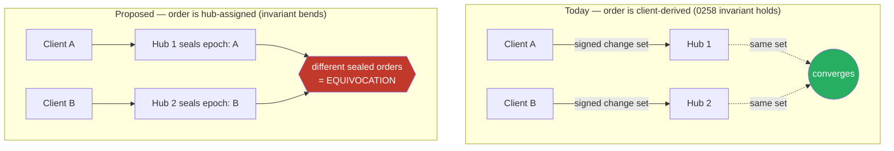

# Epoch-Resolved Hub Arbitration — An Optional Finality Layer Against Hash Grinding

> Companion to [`0305_[x]_HASH_GRINDING_MITIGATION.md`](0305_[x]_HASH_GRINDING_MITIGATION.md).
> 0305 established the attack (grind a vanity DID that wins every LWW tie) and
> recommended a client-side per-conflict re-keyed tiebreak. This doc explores a
> **different, heavier mitigation the user asked about specifically**: let hubs
> assign an unforgeable arrival order, sealed per epoch, and arbitrate conflicts
> with it. The two are complementary, not exclusive — see Recommendation.

## Problem Statement

xNet resolves concurrent writes with a deterministic Last-Write-Wins comparator
whose final tiebreak is the author's DID compared by code units
(`packages/core/src/lww.ts:29`). Because a DID is a free, attacker-chosen
function of a keypair (`packages/identity/src/did.ts`), an attacker grinds a
vanity keypair that sorts to the top and **wins every concurrent-write tie
against every honest peer, permanently, for a one-time cost** (0305).

The tiebreak is grindable *because its input is something the attacker controls
and can precompute offline.* The idea under study here removes that property:
have a party the attacker does **not** control — a hub — assign the ordering
input. A hub sees writes as they arrive; it can stamp each with a monotonic
sequence the attacker cannot predict or pre-grind, batch those stamps into
**epochs**, and **sign a sealed order** at each epoch boundary. Conflict
resolution then consults the hub-sealed order instead of (or above) the
grindable DID.

The hard constraint — and the reason this is an *exploration*, not a
slam-dunk — is that **hubs are optional in xNet.** Convergence today is a pure
function of the signed change *set*; order is derived client-side and no hub is
required. Multi-home sync (0258) leans on this so hard it is stated in bold:
"replicating to two hubs cannot diverge state… **This is the single most
important fact in this document.**" Making a hub-assigned order load-bearing for
convergence *inverts that invariant* and reintroduces exactly the divergence
0258 depends on being impossible. So the real question is not "can a hub
arbitrate?" (trivially yes) but **"can hub arbitration be an optional finality
layer that strengthens ordering when present, without breaking offline,
hub-less, or multi-hub convergence when absent or in conflict?"**

## Executive Summary

- **The arrival-order primitive already exists, half-built.** The hub stamps
  every change with `received_at` and, for share rooms, a monotonic
  `AUTOINCREMENT seq` (`packages/hub/src/storage/sqlite.ts:338,358`). That seq
  is unforgeable and not attacker-controlled — but it is unsigned, exists only
  for share rooms, and is a *delivery cursor* never consulted by `lwwWins`. The
  mitigation is to (a) assign an epoch/seq on **every** room at append time,
  (b) **sign** an epoch seal, and (c) feed the sealed order into the comparator.
- **The signed-hub-document template already exists.** `hub-policy-offer.ts`
  canonicalizes and signs a hub document with a hub key
  (`signHubPolicyServiceOffer`) — the exact pattern an epoch seal follows. But
  it is off the sync path, and the sync path's hub identity is a **placeholder
  `did:key:hub`** (`packages/hub/src/server.ts:198`) and hub→client sync
  messages are **unsigned plain JSON**. Real hub identity + signed sync messages
  are prerequisites.
- **This is Bayou with a cryptographic seal.** Bayou (SOSP 1995) is the closest
  precedent: offline replicas accept tentative writes; a non-mandatory primary
  assigns each a Commit Sequence Number; committed-before-tentative ordering
  plus undo/replay reconciles. xNet's twist is to make the CSN an **epoch-batched,
  hub-signed, hash-chained seal** so the arbiter is *accountable*, borrowing
  Certificate Transparency / CONIKS signed-tree-heads (each epoch commits to the
  prior epoch's hash → a fork is a self-signed contradiction).
- **The two structural gaps dominate the design.** (1) **Equivocation**: rooms
  are multi-homed by default, hub identity is a placeholder, and any hub can
  seal a different order to different peers or censor by refusing to seal.
  Detection (not prevention) is the achievable bar, via seal-chaining + gossip
  (CT/CONIKS/Trillian-witness lineage; SUNDR/Depot fork-consistency). (2)
  **Offline finality gap**: a hub-less or offline-concurrent write has *no*
  epoch until a hub seals it, so grinding is only mitigated for **sealed changes
  on hub-connected rooms** — unsealed edits still fall through to the grindable
  DID order. This makes arbitration a **strengthening layer, never a
  correctness dependency.**
- **Recommendation:** treat this as a **long-horizon, opt-in finality layer**,
  and ship 0305's cheap client-side re-keyed tiebreak first as the baseline that
  protects the offline/hub-less case. Model the seal on Bayou's
  tentative-vs-committed states and CONIKS's chained-STR; make it strictly
  optional per Space; require the unbuilt replication manifest (0258) to name a
  single arbitrating hub per Space; and add passive gossip of the last seal hash
  over existing sync traffic so equivocation is at least *detectable*. Do **not**
  make convergence depend on it.

## Current State In The Repository

### Convergence is a pure function of the change set (the invariant we'd bend)

`docs/explorations/0258_..._MULTI_HOME_SYNC...md:88-89` states it plainly:
replicating to two hubs cannot diverge state, because whoever holds the same
change set converges via signed, hash-chained, deterministic LWW. Order is
**derived client-side, never assigned by a hub.** Epoch arbitration makes a
hub-assigned order matter for convergence — the central tension of this doc.

### Two monotonic cursors exist; only one is hub-assigned

- **Author/doc rooms** page on the **client-authored** `lamport_time`
  (`packages/hub/src/storage/sqlite.ts:1186` `ORDER BY lamport_time ASC,
  lamport_author ASC`; `getHighWaterMark` = `MAX(lamport_time)`). The only
  hub-assigned column on `node_changes` is `received_at DEFAULT
  (unixepoch('now')*1000)` (`:338`) — wall-clock, **not monotonic, not exposed,
  not used for ordering.**
- **Share rooms** (channels/workspaces, 0298) have the real thing — a per-hub
  monotonic arrival sequence:

  ```sql
  CREATE TABLE node_change_rooms (
    seq INTEGER PRIMARY KEY AUTOINCREMENT,   -- packages/hub/src/storage/sqlite.ts:358
    room TEXT NOT NULL,
    hash TEXT NOT NULL,
    UNIQUE(room, hash)
  );
  ```

  Assigned on `addChangeToRoom` (`INSERT OR IGNORE`, `:1204`), consumed by
  `getRoomChangesSince` (`ORDER BY r.seq ASC`, returns `highWaterMark = max
  seq`, `:1207`). It is **persisted but just a DB counter — unsigned, not part
  of any envelope, resets on DB restore, and is a delivery cursor `lwwWins`
  never sees.** This is the closest existing analogue to an epoch order.

### The single append site — where an epoch stamp + seal would attach

`packages/hub/src/services/node-relay.ts` `handleNodeChange` (`:128-230`)
validates capability → `verifyChangeHash` → DID → `verifyChange` (sig) →
mentions → dedup → storage-full → quota → **`appendNodeChange` (`:215`)** →
`fanOutToShareRoom` (`:223`). Line 215 is where a hub would assign a monotonic
epoch/seq under a per-room lock and where an epoch boundary would produce a
signed seal. Note there is **no `wallTime` upper-bound check** here today (0305
fix "G") — an epoch stamp assigned at append time naturally supersedes the
grindable `wallTime` rung. `appendNodeChange` currently returns `void`
(`interface.ts:485`); it would need to return the assigned epoch/seq.

### Where LWW actually decides (the arbitration site)

`packages/data/src/store/store.ts` `applyPropertyChangeWithLWW` (`:2208`) builds
`newTs: PropertyTimestamp = { lamport, author, wallTime }` and calls
`shouldReplace` (`:2263`) → `lwwWins` from core. `PropertyTimestamp`
(`packages/data/src/store/types.ts:68`) and `LwwStamp`
(`packages/core/src/lww.ts:19`) carry **only** `{ lamport, author, wallTime }` —
no hash, no epoch, no hubDid. To arbitrate by epoch these must gain an `epoch`
(+ `hubDid`/seal ref) field, and `compareChangeOrder` must consult it — but
**gated**, because epoch is absent offline (below).

### Client trusts exactly one hub-assigned value today

`packages/runtime/src/sync/node-store-sync-provider.ts`: the **persisted** sync
cursor advances *only* on the hub high-water mark (`:565`, comment `:680`), and
a rollback guard (`:531-557`) treats `highWaterMark < lastSyncedLamport` as a
partial hub rollback. This is the one place the client already trusts a
hub-assigned monotonic value for correctness — a precedent for trusting a
hub-assigned epoch, and the only existing defense against hub monotonicity
violations (it detects a mark going *backwards*, not equivocation).

### Precedents to extend, not invent

- **Signed hub document:** `packages/abuse/src/hub-policy-offer.ts` —
  `SignedHubPolicyServiceOffer` with `hubDID`, `canonicalize…`,
  `…SigningBytes`, `signHubPolicyServiceOffer(offer, signingKey)`,
  `isSignedHubPolicyServiceOffer`. The seal envelope's template. (HTTP/policy
  plane, not sync.)
- **Signed checkpoint:** `packages/core/src/snapshots.ts:17` — `Snapshot {
  stateVector, compressedState, timestamp, creatorDID, signature, contentId }`.
  A signed, content-addressed state-at-a-point — nearest thing to a checkpoint,
  but author-signed and compaction-oriented, not hub-authoritative.
- **Real hub identity:** exists only in the federation/shard subsystem
  (`hub_did` in `federation_peers`/`shard_hosts`, UCAN `aud` check in
  `auth/ucan.ts:100`). The sync-path hub is `did:key:hub` placeholder
  (`server.ts:198`), and the shard ring already treats `hubDid` as
  **grindable** (0305, `shard-rebalancer.ts` `blake3(hubDid)` 32-bit) — epoch
  arbitration that trusts `hubDid` inherits that Sybil surface unless hub
  identity is pinned.

### Multi-hub reality = the equivocation surface

`packages/runtime/src/sync/MultiHubSyncManager.ts` fans a publish to **all**
hubs a namespace routes to (default = full mirror to every configured hub). A
room can be served by N hubs simultaneously; each independently runs
`handleNodeChange` and would assign its **own** epoch order → direct
equivocation. The `ReplicationPolicy`/manifest that could name a canonical
arbitrating hub per Space is, per 0258, "~80% built, 0% wired" and is itself
synced data subject to the same LWW it would arbitrate (bootstrap circularity).



## External Research

### Bayou (SOSP 1995) — the structural precedent

Offline replicas accept **tentative** writes at any time. One replica per
collection is **primary** and assigns each write a permanent **Commit Sequence
Number (CSN)**; *all committed writes order before all tentative writes*, and
CSNs define the definitive total order. Anti-entropy is pairwise gossip — CSN
knowledge diffuses transitively, no requirement to reach the primary directly.
When newly-arrived committed writes land before a peer's tentative writes, the
peer **undoes and replays** its tentative writes on the committed prefix
(structurally a `git rebase`). xNet's proposal ≈ Bayou + (epoch batching, a
signed/hash-chained CSN). Gap Bayou leaves open and xNet must close: Bayou's CSN
is **unsigned** and assumes a trusted primary — no grinding/equivocation model.

### Certificate Transparency / CONIKS / Trillian — accountable seals

- **CT (RFC 6962):** a log periodically emits a **Signed Tree Head** (signed
  root hash + size + time); a **consistency proof** shows each new STH is an
  append-only superset of the last. The xNet epoch seal ≈ an STH over the
  epoch's changes.
- **CONIKS (ePrint 2014/1004):** each epoch's **Signed Tree Root includes the
  hash of the previous epoch's STR** — a hash chain of epochs. Exactly the
  "seal chained to prev seal → a fork is a provable contradiction" design.
  Clients/auditors gossip STRs; two different signed STRs for the same epoch =
  irrefutable equivocation proof, and the observer *whistleblows* by
  broadcasting both.
- **Trillian / Sigsum witnesses:** independent **witnesses** countersign a
  checkpoint only after verifying its consistency proof; N cosignatures make
  split-view require colluding with a witness quorum. Sigsum frames security as
  a **threshold assumption**, not full BFT — the right mental model for an
  *optional* layer.

### SUNDR / Depot — detect (not prevent) a lying coordinator

- **SUNDR (OSDI 2004):** an untrusted server can only achieve **fork
  consistency** — if it hides one user's change from another, "those two users
  will never again see each other's changes unless they communicate directly,"
  at which point exchanged signed histories expose the fork. You can't *prevent*
  a fork, only *detect* it once forked views reconverge — which maps precisely
  onto xNet's offline-tolerance: an equivocating hub is discoverable when two
  forked devices next sync (directly or transitively).
- **Depot (OSDI 2010):** Fork-Join-Causal consistency tolerates Byzantine
  clients *and* servers; correct nodes keep making progress and **rejoin**
  forked branches once they observe each other's signed updates, with explicit
  faulty-node eviction. More directly applicable than SUNDR because it treats a
  fork as *evidence + self-heal*, not a terminal liveness failure.

### Ordering-service epochs — the batch mechanism

- **Hyperledger Fabric orderer:** batches txns into **blocks** via
  `BatchSize`/`BatchTimeout` (Raft-backed); orderers order but **don't validate
  semantics** — peers validate after. xNet's "time/count epoch close" *is*
  `BatchTimeout`/`BatchSize`; "hub assigns order, LWW semantics run on top" *is*
  the orderer/peer split.
- **Calvin (SIGMOD 2012):** a sequencing layer stamps txns into **epochs**;
  replicas replay the epoch order deterministically. Clean precedent for
  "epoch batching → deterministic global order replayed identically."
- **Corfu / Reflect:** the sequencer is an **optimization in front of a safety
  mechanism that doesn't strictly need it** (Corfu can reconstruct the next
  position by replaying the tail). Reflect linearizes purely by **arrival time**
  with no semantic understanding of the payload — almost exactly the proposed
  hub role.

### Residual attacks a sequencer does *not* stop (MEV / order-fairness lit)

Once a hub arbitrates, grinding is dead (the tiebreak input is arrival order the
attacker can't precompute), but: the **hub operator** can still front-run/favor
writes within an epoch (it sees all before sealing); a **network-privileged
attacker** can win races by submitting first / delaying rivals; and **multiple
hubs** can disagree. Order-fairness research (Themis, Aequitas, FairDAG) exists
because naive single-leader sequencing doesn't remove *these*. Practical
takeaway: keep the **value of winning a tie economically small** (an LWW
property overwrite is low-value) rather than chasing full elimination, which
needs the heavy BFT machinery the optionality constraint rules out.

> The exact "grind a DID to win LWW ties" attack is not named in prior
> literature; it is a composition of documented **git-vanity-hash grinding**
> and documented **LWW tiebreak-by-replica-ID**. The security argument for
> arbitration is a synthesis, and the combination it proposes — Bayou-style
> optionality + CT/CONIKS accountability over a CRDT/LWW relay — appears to be
> genuinely unoccupied design space.

## Key Findings

1. **The arrival-order primitive is half-present** (`received_at`, share-room
   `seq`) but unsigned and off the convergence path. Building on it is
   evolution, not greenfield.
2. **The signed-seal envelope is a known pattern in-repo** (`hub-policy-offer`)
   and needs porting to the sync path plus a real hub keypair.
3. **Arbitration inverts the 0258 convergence invariant.** It can only be an
   *optional* layer; convergence must still hold with no hub, an offline hub, or
   a lying hub.
4. **Offline finality gap is unavoidable.** Grinding is mitigated only for
   *sealed* changes on hub-connected rooms; unsealed/offline-concurrent edits
   still fall through to the grindable DID order — so 0305's client-side fix is
   still needed as the floor.
5. **Equivocation is the dominant risk, and prevention is out of reach** without
   trusted hardware (A2M) or BFT; the achievable bar is **detection** via
   chained seals + gossip (CT/CONIKS/SUNDR/Depot).
6. **Multi-home + placeholder hub identity** means "the" epoch order isn't
   well-defined until a canonical arbitrating hub per Space is named (the
   unbuilt manifest) and hub identity is a real, pinned key.
7. **Re-resolution on seal arrival** (Bayou undo/replay) is new machinery: the
   store applies once today; a property whose winner changes when a later seal
   lands must be re-resolved.

## Options And Tradeoffs

### Option A — No hub arbitration; ship 0305's re-keyed tiebreak only

Keep order client-derived; kill grinding with the per-conflict pair-hash from
0305.

- **Pro:** preserves the 0258 invariant intact; cheap; protects offline/hub-less
  fully; no equivocation surface, no hub identity work.
- **Con:** doesn't give *finality* — there's no authoritative "this is the
  order" moment, which arbitration uniquely provides (useful beyond grinding:
  billing/audit ordering, tamper-evident history).
- **Verdict:** the **baseline floor**. Everything below is additive to it.

### Option B — Tentative/committed epochs (Bayou + CONIKS seal) — the full design

Hub assigns an epoch/seq at append; at epoch close (`BatchTimeout`/`BatchSize`)
it signs a seal chained to the prior seal. Changes are **tentative** (ordered by
local fallback = 0305's rule) until sealed, then **committed** (ordered by
epoch). On seal arrival, re-resolve affected properties (undo/replay).

```mermaid
stateDiagram-v2
  [*] --> Tentative: local write / relayed, unsealed
  Tentative --> Tentative: converge by fallback order (0305 rule)
  Tentative --> Committed: hub epoch seal arrives (signed, chained)
  Committed --> Committed: order fixed by epoch; grinding irrelevant
  Tentative --> Orphaned: hub never seals (offline / hub-less)
  Orphaned --> Committed: a later hub seals it
  Orphaned --> Orphaned: stays converged by fallback forever
```



- **Pro:** removes grinding for sealed changes; adds finality + tamper-evident
  order; degrades to Option A's rule when unsealed → offline still works.
- **Con:** the most machinery — seal envelope + hub keypair + signed sync
  messages + comparator gating + store re-resolution + manifest-named arbiter +
  equivocation detection. Re-resolution is a correctness-sensitive new path.
- **Verdict:** the **north-star** if xNet wants finality; sequence it in stages.

### Option C — Seal for *evidence only*, never for arbitration

Hub signs epoch seals (chained, gossiped) as a **tamper-evident audit log** of
what it saw and when, but LWW ordering stays client-derived (Option A rule). The
seal proves history/integrity and catches equivocation, but doesn't decide
conflicts.

- **Pro:** keeps the 0258 invariant fully intact (order still client-derived);
  no re-resolution path; gets accountability/audit + a deterrent (grinding still
  *works* but is now *on the record*). Much cheaper than B.
- **Con:** doesn't actually stop grinding — it only makes a grinder auditable.
  Value depends on there being a consumer for the audit trail.
- **Verdict:** a strong **middle rung** — most of B's accountability, little of
  its risk. Good if the goal is deterrence + auditability over hard prevention.

### Option D — Arbitrate, but only for opt-in "high-integrity" Spaces

Per-Space flag: a Space may declare a canonical arbitrating hub and require
sealed order; ordinary Spaces stay on Option A. Scopes the equivocation/finality
complexity to Spaces that ask for it (e.g. a shared ledger, governance data).

- **Pro:** confines the invariant-bend to Spaces that opt in; ordinary
  local-first Spaces are untouched; aligns with 0258's Space-as-security-boundary.
- **Con:** two convergence modes to maintain and test; the manifest that carries
  the flag is itself synced data (bootstrap circularity).
- **Verdict:** the right **packaging** for B — arbitration as a Space capability,
  not a global protocol change.

### Comparison

| | A: re-keyed tiebreak | B: full epochs | C: evidence-only seal | D: opt-in Spaces |
|---|---|---|---|---|
| Stops grinding | yes (all cases) | yes (sealed only) | no (audits it) | yes (opt-in Spaces) |
| 0258 invariant | intact | bent | intact | bent per-Space |
| Offline works | fully | fallback | fully | fully (non-opt-in) |
| Equivocation risk | none | high (mitigated by gossip) | low (detect-only) | scoped |
| Re-resolution path | no | yes | no | yes (opt-in) |
| Cost | low | high | medium | high |

## Recommendation

**Layer, don't choose.** Sequence:

1. **Ship Option A (0305's re-keyed tiebreak) first** as the floor that protects
   every case including offline/hub-less. Grinding should not wait on the hub
   machinery.
2. **Add Option C (evidence-only chained seal)** next: give the sync-path hub a
   **real keypair** (retire `did:key:hub`), port the `hub-policy-offer`
   signing pattern to a new signed `EpochSeal` message, chain each seal to the
   prior (CONIKS-style), and **gossip the last seal hash over existing sync
   traffic** so equivocation is detectable. This buys accountability and finality
   *without* bending the 0258 invariant or adding a re-resolution path.
3. **Offer Option B behind Option D's per-Space opt-in** only if/when a concrete
   need for *authoritative* order appears (ledger, governance, billing). Require
   the replication manifest to name **one** arbitrating hub per such Space,
   implement Bayou tentative→committed re-resolution, and treat unsealed changes
   as converging by the Option A rule. Keep the **value of winning a tie small**
   and add per-writer rate limiting / minimum epoch duration to blunt the
   residual within-epoch front-running the hub operator and network-privileged
   attackers retain.

Net: grinding is killed cheaply and universally by A; C makes any residual
misbehavior *accountable*; B/D provide *finality* for the few Spaces that need
it, scoped so the local-first majority never pays for it. This matches the
prior-art sweet spot (Bayou optionality + CT/CONIKS accountability) while
stopping short of the BFT/A2M hard-non-equivocation the optionality constraint
rules out.

```mermaid
sequenceDiagram
  participant A as Client A
  participant B as Client B
  participant H as Arbiting Hub (real key)
  participant W as Peers (gossip)
  A->>H: change hA (tentative locally)
  B->>H: change hB (tentative locally)
  Note over H: epoch N closes (BatchTimeout/Size)
  H->>H: order = arrival(hA,hB); seal_N = sign(hubKey, {epoch:N, order, hash(seal_{N-1})})
  H-->>A: EpochSeal N
  H-->>B: EpochSeal N
  A->>A: verify sig+chain; commit order; re-resolve if winner changed
  A->>W: gossip hash(seal_N)
  W->>W: two different seal_N hashes ⇒ provable equivocation
```

## Example Code

Signed, chained epoch seal (new `packages/hub` module; envelope modeled on
`packages/abuse/src/hub-policy-offer.ts`):

```ts
export interface EpochSeal {
  room: string
  epoch: number                 // monotonic per room
  hubDid: DID                   // REAL hub key, not did:key:hub
  /** Ordered change hashes committed in this epoch (arrival order). */
  order: string[]
  /** CONIKS-style chain: BLAKE3 of the previous seal's signing bytes. */
  prevSealHash: string | null
  sealedAt: number
}

export function epochSealSigningBytes(s: EpochSeal): Uint8Array {
  // Canonical (sorted-key) JSON, same discipline as computeChangeHash.
  return new TextEncoder().encode(JSON.stringify(canonicalize(s)))
}

export function signEpochSeal(s: EpochSeal, hubKey: Uint8Array): SignedEpochSeal {
  return { seal: s, signature: sign(epochSealSigningBytes(s), hubKey) }
}

/** A verifier holding seal N-1 can prove a fork: two valid seals, same
 *  {room, epoch}, different order ⇒ irrefutable equivocation by hubDid. */
export function detectEquivocation(a: SignedEpochSeal, b: SignedEpochSeal): boolean {
  return a.seal.room === b.seal.room &&
         a.seal.epoch === b.seal.epoch &&
         JSON.stringify(a.seal.order) !== JSON.stringify(b.seal.order)
}
```

Comparator gating (`packages/core/src/lww.ts`) — epoch above the fallback, but
only when **both** sides are sealed (else fall back to 0305's rule so unsealed
and offline changes still converge):

```ts
export interface LwwStamp {
  lamport: number
  wallTime: number
  author: string
  changeHash: string          // for 0305 fallback tiebreak
  epoch?: { hubDid: string; epoch: number; index: number } // present iff sealed
}

export function compareLwwStamps(a: LwwStamp, b: LwwStamp): number {
  // Sealed order wins ONLY when both sides are sealed by the same arbiter.
  if (a.epoch && b.epoch && a.epoch.hubDid === b.epoch.hubDid) {
    if (a.epoch.epoch !== b.epoch.epoch) return a.epoch.epoch - b.epoch.epoch
    if (a.epoch.index !== b.epoch.index) return a.epoch.index - b.epoch.index
  }
  if (a.lamport !== b.lamport) return a.lamport - b.lamport
  if (a.wallTime !== b.wallTime) return a.wallTime - b.wallTime
  return pairTiebreak(a, b) // 0305: not grindable, no universal winner
}
```

## Risks And Open Questions

- **The 0258 invariant.** Option B/D make a hub order load-bearing; the exact
  degradation rule (unsealed = Option A order; sealed order only among same-hub
  seals) must be proven to re-converge when a seal arrives late, is absent, or
  conflicts. Golden vectors must cover tentative→committed transitions.
- **Re-resolution correctness.** When a seal changes a property's winner, the
  store must undo/replay deterministically (Bayou undo-log). `store.ts:2208`
  applies once today — this is a new, correctness-sensitive path; interacts with
  materialized `NodeState.timestamps` and query caches (0264/0266 budgets).
- **Equivocation is only *detectable*, not preventable** without A2M/BFT. Gossip
  reveals a fork only once forked views reconverge (SUNDR caveat) — a hub can
  split two peers who never resync. Acceptable for an optional layer; must be
  stated, not hidden. What is the response to a proven equivocation — evict the
  hub (Depot), warn the user, both?
- **Hub identity is a grindable placeholder.** `did:key:hub` must become a real
  pinned key per hub; and since `hubDid` feeds the 32-bit shard ring (0305), the
  hub-identity work should land with that fix or inherit its Sybil surface.
- **Manifest bootstrap circularity.** The `ReplicationPolicy` that names the
  arbitrating hub is itself synced LWW data (0258) — how is *it* arbitrated?
  Likely must be author-pinned/owner-signed, not LWW-resolved.
- **Residual within-epoch attacks.** A malicious hub or network-privileged
  attacker can still front-run inside an epoch. Mitigate by keeping tie-win
  value low + rate limiting + minimum epoch duration; do not claim elimination.
- **Latency vs. finality.** Bigger epochs = stronger batching but slower
  finality; `BatchTimeout`/`BatchSize` tuning per Space. Offline users see only
  tentative order for a long time.
- **Is finality even wanted?** If the only goal is stopping grinding, Option A
  alone suffices and B/C/D are unnecessary. This doc exists to answer the user's
  specific "hubs as arbiters" question — the honest conclusion is that
  arbitration's *unique* value is finality/auditability, not grinding defense
  (A already covers that).

## Implementation Checklist

Baseline (do first, from 0305):
- [ ] Ship 0305's per-conflict re-keyed tiebreak (Option A) as the floor.

Evidence-only seal (Option C):
- [ ] Give the sync-path hub a real keypair; retire `did:key:hub`
      (`packages/hub/src/server.ts:198`); surface `hubDid` in the handshake.
- [ ] Add a signed `EpochSeal` type + canonicalize/sign/verify, modeled on
      `packages/abuse/src/hub-policy-offer.ts`.
- [ ] Assign a monotonic per-room epoch/seq at append
      (`node-relay.ts:215`; extend `node_changes` or a new `room_epochs` table;
      `appendNodeChange` returns the assigned value).
- [ ] Emit a chained seal at epoch close (`BatchTimeout`/`BatchSize`); persist
      seals; expose a `getEpochSeal(room, epoch)` fetch.
- [ ] Sign hub→client sync messages (new `ws/guards.ts` guard + handler); client
      verifies hub identity.
- [ ] Gossip the last seal hash over existing anti-entropy; add
      `detectEquivocation`; define the response to a proven fork.
- [ ] Bound `wallTime` at the relay (0305 fix G) alongside epoch stamping.

Full arbitration behind opt-in Spaces (Options B + D), only if finality is needed:
- [ ] Per-Space `arbitration` flag + canonical `arbitratingHubDid` in the
      replication manifest (0258); make the manifest owner-signed, not LWW.
- [ ] Add `epoch` to `LwwStamp`/`PropertyTimestamp`; gate it above the fallback,
      same-hub-only (`core/src/lww.ts`, `data/store/types.ts`).
- [ ] Implement tentative→committed re-resolution (undo/replay) in
      `store.ts:2208` and the sync apply path.
- [ ] Per-writer rate limiting + minimum epoch duration to blunt within-epoch
      front-running.
- [ ] Changeset: **major** for `@xnetjs/core` (comparator/convergence contract);
      minor/patch for hub seal + gossip per the diff.

## Validation Checklist

- [ ] Convergence with no hub: hub-less room converges identically to today
      (Option A rule) — 0258 invariant preserved for non-arbitrated Spaces.
- [ ] Tentative→committed: a property's winner may change exactly once when a
      seal arrives, then is stable; shuffle-and-replay yields identical final
      `NodeState`.
- [ ] Late/absent seal: an orphaned tentative change converges by fallback and
      stays converged if never sealed.
- [ ] Grinding simulation on a **sealed** room: a vanity DID gains no advantage
      once epoch order is authoritative.
- [ ] Equivocation detection: two conflicting seals for the same `{room, epoch}`
      are flagged by `detectEquivocation`; gossip surfaces a fork once two forked
      peers resync.
- [ ] Seal chain integrity: rewriting epoch N invalidates every later seal;
      verifiers reject a broken `prevSealHash` chain.
- [ ] Hub signature: clients reject seals not signed by the Space's pinned
      `arbitratingHubDid`; reject the `did:key:hub` placeholder.
- [ ] Multi-hub: an arbitrated Space with two hubs sealing different orders is
      detected, not silently divergent.
- [ ] Query-perf budgets (0264/0266) unregressed after adding epoch fields +
      re-resolution.
- [ ] `wallTime` bound rejects far-future stamps.

## References

**Codebase**
- `packages/hub/src/storage/sqlite.ts` — `received_at` (`:338`), `node_change_rooms.seq` (`:358`), lamport ordering (`:1186`)
- `packages/hub/src/services/node-relay.ts:128-230` — append/validate seam
- `packages/hub/src/storage/interface.ts:484-508` — cursor/seq APIs
- `packages/runtime/src/sync/node-store-sync-provider.ts:531-573,680` — hub-mark-trusted cursor + rollback guard
- `packages/runtime/src/sync/MultiHubSyncManager.ts` — multi-home fan-out (equivocation surface)
- `packages/data/src/store/store.ts:2208-2265`, `types.ts:68` — LWW apply site + `PropertyTimestamp`
- `packages/core/src/lww.ts:19-34` — comparator; `packages/core/src/snapshots.ts:17` — signed checkpoint
- `packages/abuse/src/hub-policy-offer.ts` — signed-hub-document template; `packages/hub/src/server.ts:198` — `did:key:hub` placeholder
- `docs/explorations/0258_..._MULTI_HOME_SYNC...md:88` — the convergence invariant; `docs/explorations/0305_[x]_HASH_GRINDING_MITIGATION.md` — the attack + Option A

**Prior art**
- Bayou (Terry et al., SOSP 1995) — https://people.eecs.berkeley.edu/~brewer/cs262b/update-conflicts.pdf
- Certificate Transparency (RFC 6962) — https://datatracker.ietf.org/doc/html/rfc6962
- CONIKS (Melara et al., ePrint 2014/1004) — https://eprint.iacr.org/2014/1004.pdf
- Trillian verifiable logs / witnesses — https://transparency.dev/articles/logs-a-verifiable-transport-layer/ , https://github.com/transparency-dev/witness
- Sigsum — https://git.sigsum.org/sigsum/plain/doc/design.md
- SUNDR (Li et al., OSDI 2004) — https://www.usenix.org/legacy/event/osdi04/tech/full_papers/li_j/li_j.pdf
- Depot (Mahajan et al., OSDI 2010) — https://cs.nyu.edu/~mwalfish/papers/depot-osdi10-extendedversion.pdf
- Hyperledger Fabric ordering — https://hyperledger-fabric.readthedocs.io/en/latest/orderer/ordering_service.html
- Calvin (Thomson et al., SIGMOD 2012) — https://blog.acolyer.org/2019/03/29/calvin-fast-distributed-transactions-for-partitioned-database-systems/
- Corfu — https://www.cs.yale.edu/homes/mahesh/papers/corfumain-final.pdf ; Reflect — https://rocicorp.dev/blog/ready-player-two ; Replicache — https://doc.replicache.dev/concepts/how-it-works
- A2M (Chun et al., SOSP 2007) — https://www.read.seas.harvard.edu/~kohler/class/08w-dsi/chun07attested.pdf ; BFT2F — https://www.scs.stanford.edu/~jinyuan/bft2f.pdf
- Order-fairness / MEV survey — https://arxiv.org/pdf/2407.19572
