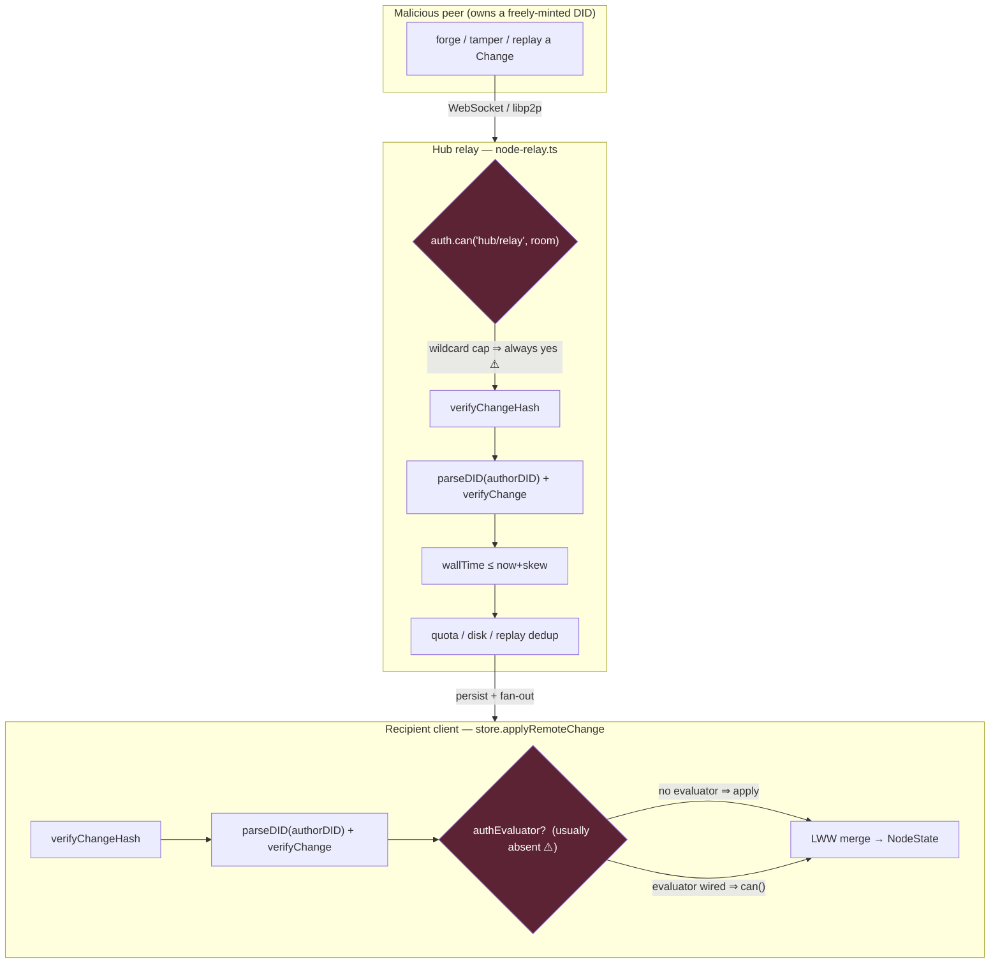
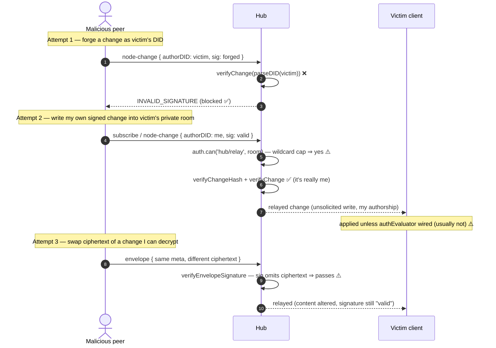

# Security Of Node And Change Flow: Hashing, Signing, DIDs, And Injection Surfaces

> Status: exploration `[_]` (unimplemented). Numbered 0307 because 0304–0306 are
> claimed by in-flight work in parallel worktrees (schema-authz CRUD split, the
> 0300→0305 hash-grinding renumber, and the epoch-arbitration companion at 0306).

## Problem Statement

xNet is a local-first system where every piece of state is the fold of an
append-only log of **signed `Change` records** that flow peer-to-peer and through
a relay **hub**. Any participant can mint an identity for free and emit changes.
The question this exploration answers: **where, as a change or node travels from
an attacker's keyboard into another user's materialized state, can bad data be
injected — and what actually stops it today?**

We trace the full path — DID formation, content hashing, Ed25519 signing, the
per-author hash chain, LWW conflict resolution, the Yjs document envelope, the
hub trust boundary, and the authorization tiers — and separate **what is
cryptographically prevented** from **what is only prevented by a caller
remembering to call the right function** or **by a config flag being left at its
default**.

## Executive Summary

The **authenticity** story is strong and the **authorization** story is weak.

- ✅ **Authorship cannot be forged.** A `did:key` *is* an Ed25519 public key
  ([`did.ts:28`](../../packages/identity/src/did.ts)), the change hash covers
  `authorDID` + `payload`, and the signature covers the hash. Both production
  ingest paths verify hash **and** signature with the key parsed from the DID
  ([`store.ts:1579`](../../packages/data/src/store/store.ts),
  [`node-relay.ts:170`](../../packages/hub/src/services/node-relay.ts)).
  `createdBy` is taken from the *verified* author, never from client payload.
- ✅ **The hub is not a dumb pipe for the change log.** It re-verifies every
  node-change before persisting or fanning out, bounds `wallTime`, rate-limits,
  and quotas.
- ⚠️ **Authorization is effectively absent in two tiers.** The schema-level
  `authEvaluator` is optional and unwired in prod
  ([`store.ts:1608`](../../packages/data/src/store/store.ts)), and the hub's
  grant/Space/deny checks are **dead code for any standard client**, because
  clients self-issue a wildcard UCAN (`{with:'*', can:'hub/*'}`) that
  short-circuits them ([`authorize.ts:146`](../../packages/hub/src/ws/authorize.ts),
  [`use-hub-auth-token.ts:10`](../../packages/react/src/provider/use-hub-auth-token.ts)).
  Cross-user confidentiality rests **entirely on end-to-end encryption**, not on
  access control.
- ⚠️ **Several "validation" primitives don't validate.** `verifyIntegrity`'s
  signature check only asserts the field is non-empty
  ([`integrity.ts:204`](../../packages/sync/src/integrity.ts)); `validateChain`
  never checks signatures ([`chain.ts:84`](../../packages/sync/src/chain.ts));
  the handler registry and `AuthorizedYjsSyncProvider` can apply data without a
  real crypto gate. They are safe only because the *specific* prod callers wire
  the real checks separately.
- ⚠️ **Encryption envelope signatures don't cover the ciphertext**
  ([`envelope.ts:167`](../../packages/crypto/src/envelope.ts)), UCANs have no
  revocation or replay defense, the PQ key registry is in-memory-only, and a
  latent SQL-injection sits in an unwired query handler.

None of these is a remote authorship-forgery hole. The theme is: **identity is
authenticated, but "may this authenticated identity do this?" is mostly
unanswered, and a handful of look-alike helpers invite an integrator to skip the
one check that matters.**

## Current State In The Repository

### The signed-change kernel

The normative byte contract lives in
[`docs/specs/protocol/01-primitives.md`](../specs/protocol/01-primitives.md) and
[`02-data-model.md`](../specs/protocol/02-data-model.md); the reference
implementation is [`packages/sync/src/change.ts`](../../packages/sync/src/change.ts):

```
DID       = "did:key:z" + base58btc( 0xED01 || ed25519_pubkey )   // did.ts:14
hash      = "cid:blake3:" + hex( blake3( canonicalJSON(unsigned) ) )   // change.ts:195
signature = ed25519_sign( utf8(hash), signingKey )                // change.ts:228
```

`canonicalJSON` recursively sorts object keys and drops `undefined`
([`change.ts:173`](../../packages/sync/src/change.ts)). The hash covers `id`,
`type`, `payload`, `parentHash`, `authorDID`, `wallTime`, `lamport`, the batch
fields, and (for v1+) `protocolVersion`. `CURRENT_PROTOCOL_VERSION = 4`
([`change.ts:23`](../../packages/sync/src/change.ts)) — note the spec prose still
says `3` in a few places (drift worth fixing).

### The trust boundaries a change crosses



The two dark boxes are the gaps: the hub capability gate is trivially satisfied
by a self-issued wildcard token, and the client schema gate is usually not
present at all. Everything else in the chain is real cryptographic verification.

### What actually stops forgery (the strong core)

- **Author binding.** `parseDID` extracts the raw Ed25519 key from the DID
  ([`did.ts:28`](../../packages/identity/src/did.ts)); both `verifyChange`
  callers pass `parseDID(change.authorDID)`
  ([`store.ts:1589`](../../packages/data/src/store/store.ts),
  [`node-relay.ts:188`](../../packages/hub/src/services/node-relay.ts)). You
  cannot sign as a DID whose key you don't hold.
- **`createdBy` provenance.** Materialization reads `createdBy`/`updatedBy` from
  the verified `change.authorDID`, not from `payload.properties`
  ([`store.ts:1956`](../../packages/data/src/store/store.ts)), so the `creator`
  role resolver ([`auth-types.ts:302`](../../packages/core/src/auth-types.ts))
  keys off cryptographically-bound authorship.
- **Grinding-resistant LWW.** The pre-v4 "highest DID wins" tiebreak was
  grindable; v4 replaces it with `blake3(author‖property‖value)`
  ([`lww.ts:60`](../../packages/core/src/lww.ts), exploration 0300), and the hub
  bounds `wallTime` so the middle rung can't be ground either
  ([`node-relay.ts:197`](../../packages/hub/src/services/node-relay.ts)).
- **Hub re-verification.** The hub is authoritative on the change log: a change
  is persisted and rebroadcast **only** after hash+signature succeed
  ([`node-relay.ts:152-272`](../../packages/hub/src/services/node-relay.ts)), so
  a malicious client cannot poison other clients' change-log data via the relay.
- **DoS envelope.** Per-connection rate limits (100 msg/s, 3-strike close),
  5 MB message cap, max-connection cap
  ([`middleware/rate-limit.ts`](../../packages/hub/src/middleware/rate-limit.ts)),
  Yjs size/rate limits + peer scoring
  ([`yjs-limits.ts`](../../packages/sync/src/yjs-limits.ts),
  [`yjs-peer-scoring.ts`](../../packages/sync/src/yjs-peer-scoring.ts)), per-DID
  quota, disk watchdog shedding, and a content-abuse layer with per-DID write
  budgets ([`packages/abuse/src/public-write-budget.ts`](../../packages/abuse/src/public-write-budget.ts)).

### Where the gaps are (the weak edges)

**1 — Authorization, tier by tier.**

- *Schema level (client ingest).* `authEvaluator` is optional; with none wired
  (the default) a remote change is applied after signature+hash only
  ([`store.ts:1608`](../../packages/data/src/store/store.ts)).
  `inferActionFromChange` only ever returns `write`/`delete`, never `create`
  ([`store.ts:2429`](../../packages/data/src/store/store.ts)); if the evaluator
  *were* wired, a remote create would load a null node and be denied — which is
  precisely the "create check is vacuous / fails closed once wired" state from
  exploration 0304.
- *Hub level (the only cross-user gate).* Session DID is authenticated
  ([`auth/ucan.ts:76`](../../packages/hub/src/auth/ucan.ts)), but
  `authorizeRoomAction` returns `allowed` the moment a UCAN capability matches
  ([`authorize.ts:146`](../../packages/hub/src/ws/authorize.ts)), and the
  production client presents `{with:'*', can:'hub/*'}`
  ([`use-hub-auth-token.ts:10`](../../packages/react/src/provider/use-hub-auth-token.ts)).
  That wildcard matches every action on every resource
  ([`capabilities.ts:52`](../../packages/hub/src/auth/capabilities.ts)), so the
  grant-index, Space-cascade, and share-deny checks below it are dead code for a
  normal client. Net: an authenticated user can `subscribe`/`node-sync-request`
  and relay `node-change`s into **any room id they can name**, including other
  users' private rooms. `canWriteNodeChange`/`canWriteYjs` also fail *open* when
  no grant record exists ([`share-access.ts:184`](../../packages/hub/src/services/share-access.ts)).
  Confidentiality therefore rests on E2E encryption, not authz.

**2 — UCAN capability tokens.** Root self-issuance has no trust anchor: when
`prf.length === 0`, `validateProofChain` returns valid immediately
([`ucan.ts:108`](../../packages/identity/src/ucan.ts)). Delegated (proof-chained)
tokens *are* properly attenuated, but there is **no revocation check**
(`DENY_UCAN_REVOKED` exists as a reason code
[`auth-types.ts:75`](../../packages/core/src/auth-types.ts) but nothing calls it)
and **no replay defense** (no `jti`/nonce), so a captured 24-hour token is
replayable until expiry.

**3 — Look-alike "validators."** Several helpers resemble the real gate but skip
crypto:

| Helper | What it *doesn't* do | Cite |
|---|---|---|
| `verifyIntegrity` | "signature valid" == field is non-empty; no Ed25519 | [`integrity.ts:204`](../../packages/sync/src/integrity.ts) |
| `attemptRepair('recompute-hash')` | overwrites a mismatching hash → can launder tampered payloads | [`integrity.ts:409`](../../packages/sync/src/integrity.ts) |
| `validateChain` | never checks signatures; missing parents & forks pass as valid | [`chain.ts:84`](../../packages/sync/src/chain.ts) |
| handler registry `process` | no hash/sig check; `validate` defaults to `() => valid` | [`handlers/registry.ts`](../../packages/sync/src/handlers/registry.ts) |
| `AuthorizedYjsSyncProvider.handleRemoteUpdate` | no size cap; peer scorer is advisory (never rejects) | [`yjs-authorized-sync.ts:279`](../../packages/sync/src/yjs-authorized-sync.ts) |

These are safe in prod only because `store.applyRemoteChange` and the hub relays
wire the real checks. Any integrator who trusts the primitives is exposed.

**4 — Cryptographic coverage gaps.**

- *Envelope signature omits the ciphertext.* `createSignatureMessage` signs
  metadata (`id`, `schema`, `createdBy`, `recipients`, `publicProps`, and the
  *DIDs* of wrapped keys) but **not** `ciphertext`, `nonce`, or wrapped-key
  *values* ([`envelope.ts:167`](../../packages/crypto/src/envelope.ts)). Any
  content-key holder (any recipient, or anyone for a `PUBLIC` node) can swap the
  encrypted body and the author's signature still verifies. Only AEAD protects
  content against non-holders; the author's signature does not bind it.
- *Change signing is Ed25519-only despite the v4 "hybrid/PQ" label.* `signChange`
  uses `@xnetjs/crypto`'s classical `sign`/`verify`
  ([`change.ts:10`](../../packages/sync/src/change.ts)); the entire
  hybrid/ML-DSA apparatus is dead code relative to `Change<T>`. Every real change
  is Level 0.
- *Unauthenticated key-registry fallback.* For non-Ed25519 (PQ) DIDs, X25519
  keys are fetched over plain HTTP with no signature/pinning
  ([`key-resolution.ts:211`](../../packages/crypto/src/key-resolution.ts)) — a
  compromised registry MITMs envelope key-wrapping for those DIDs.
- *No document/room binding in the signed change.* The hashed field set has no
  `docId`; a validly-signed change is portable and dedup is only by `hash`, so a
  change can be replayed into any context sharing its `parentHash`. The V1 Yjs
  envelope is worse — it signs only `blake3(update)`, replayable into *any* doc
  ([`yjs-envelope.ts:223`](../../packages/sync/src/yjs-envelope.ts)).
- *PQ registry is in-memory only* ([`pq-registry.ts:145`](../../packages/identity/src/pq-registry.ts)),
  so a receiving peer with an empty registry silently cannot verify L1/L2
  signatures.

**5 — Deployment / config footguns.**

- `HUB_ALLOW_UNSIGNED_REPLICATION=true` disables Yjs signature enforcement and
  lets raw updates into the hub's shared doc
  ([`config.ts:127`](../../packages/hub/src/config.ts)).
- `config.auth=false` makes every connection `did:key:anonymous` with wildcard
  caps and skips room authz entirely ([`auth/ucan.ts:24`](../../packages/hub/src/auth/ucan.ts)).
- Global wildcard CORS `app.use('*', cors())` — argued safe because auth is
  token- not cookie-based ([`server.ts:152`](../../packages/hub/src/server.ts)),
  but a permissive default.
- HTTP rate-limit keys on client-supplied `x-forwarded-for`
  ([`middleware/http-rate-limit.ts`](../../packages/hub/src/middleware/http-rate-limit.ts))
  — spoofable unless behind a trusted proxy.

**6 — Latent injection.** `queryDatabaseRows` interpolates client-controlled
column identifiers into SQL (`json_extract(data,'$.${col}')`,
`... as "${col}"`) ([`storage/sqlite.ts:2370`](../../packages/hub/src/storage/sqlite.ts));
values are parameterized but identifiers are not. It is **currently unreachable**
(the handler isn't mounted), but becomes live SQL injection the moment it is
wired. Lower severity: `buildMerkleTree` concatenates child hashes without
leaf/node domain separation ([`hashing.ts:80`](../../packages/core/src/hashing.ts))
— second-preimage-shaped but not on the signed-change path.

**7 — Identity is free (Sybil).** Minting a `did:key` costs nothing. The v4
tiebreak removes the *durable* grinding win but a reactive per-conflict grind
remains (documented in [`02-data-model.md` §7.2](../specs/protocol/02-data-model.md)),
and write-flooding is bounded only by hub quotas + the abuse write-budget layer,
not by identity cost.

**8 — Dev-only crypto still present.** `passkey.ts` self-declares "NO real
security … stores the encryption key alongside encrypted data … dev/testing only"
([`passkey.ts:25`](../../packages/identity/src/passkey.ts)); `serializeKeyBundle`
writes raw private keys as plain JSON
([`keys.ts:62`](../../packages/identity/src/keys.ts)). At-rest key protection is
delegated entirely to the storage layer.

## External Research

- **Kleppmann, *Making CRDTs Byzantine Fault Tolerant* (PaPoC 2022).** Uses
  content hashes for identity/dedup only and derives order from *provably-shared
  causal state* (`before(u)` + a Lamport validity check), foreclosing the
  grinding class entirely. xNet's own spec cites this as the north star it does
  not yet implement ([`02-data-model.md` §7.2](../specs/protocol/02-data-model.md));
  exploration 0301 (epoch-resolved hub arbitration) is the finality layer.
- **UCAN 1.0 spec** and the wider capability literature stress that a
  root/self-issued token is authority *only over resources the issuer already
  owns*; a *relying party* (the hub) must still bind capabilities to a resource
  it controls (here: rooms it stores). xNet mints and accepts `with:'*'`, which
  discards that binding. Compare AT-Protocol's model where the PDS is
  authoritative over a repo and lexicon authority is DNS-anchored — xNet's
  `SchemaIRI` domain authority is reserved for `xnet/1.1`
  ([`02-data-model.md` §4](../specs/protocol/02-data-model.md)).
- **Merkle-tree second-preimage (RFC 6962 / CVE-2012-2459).** Certificate
  Transparency prefixes leaves with `0x00` and internal nodes with `0x01`
  precisely to avoid the leaf/node ambiguity present in `buildMerkleTree`.
- **Signature coverage / AEAD binding.** Standard practice (e.g. sign-then-
  encrypt vs encrypt-then-sign, and the "cryptographic doom principle") says the
  authenticator must cover the ciphertext. xNet's envelope signs plaintext
  metadata but leaves the ciphertext outside the author's signature.
- **Sybil economics in local-first / DIDComm systems.** With free identity,
  the durable defenses are (a) making a win worth little (per-property LWW
  overwrite), (b) rate/quota per writer, and (c) optional identity cost
  (registration / PoW) — which xNet keeps out of scope to preserve offline use.

## Key Findings

1. **Authenticity ≠ authorization.** The system proves *who* wrote a change with
   real cryptography, but almost never enforces *whether they were allowed to*.
   The two enforcement points that should answer that — the client
   `authEvaluator` and the hub capability check — are respectively unwired and
   short-circuited.
2. **The wildcard UCAN is the single highest-leverage weakness.** It is by
   design ([`authorize.ts:107`](../../packages/hub/src/ws/authorize.ts)
   acknowledges it) and it turns an otherwise well-built grant/Space/deny system
   into dead code. Fixing token minting to least-privilege re-activates a large
   amount of already-written authorization logic.
3. **Confidentiality currently *is* encryption.** Because the hub won't stop a
   cross-room subscribe, the only thing protecting a private node's contents is
   that the attacker can't decrypt it — and the envelope signature doesn't even
   cover the ciphertext. Metadata (existence, timing, authorship, `publicProps`)
   leaks to any authenticated peer who names the room.
4. **"Validator" naming is a footgun.** `verifyIntegrity`, `validateChain`, and
   the handler registry read like security gates but aren't. This is a latent
   supply-chain-style risk for anyone building on `@xnetjs/sync` directly.
5. **The strong parts are genuinely strong** and should be preserved as-is:
   DID=key binding, dual hash+signature verification at both prod ingest points,
   `createdBy` provenance, the v4 tiebreak, and hub re-verification of the change
   log.

## Options And Tradeoffs

The gaps span layers; the realistic question is *what to fix first and how hard
to fail*. Three coherent postures:

### Option A — "Encryption is the boundary" (document, don't enforce)

Accept that the hub is a relay and confidentiality is E2E-only; invest in making
that true and legible. Cover the ciphertext in the envelope signature, harden the
key-registry fetch, and loudly document that room-level authz is not enforced.

- **Pros:** smallest change; matches the current `auth-types.ts` philosophy
  ("ability to decrypt IS access control"); preserves offline/serverless P2P.
- **Cons:** leaves unsolicited-write and metadata-leak exposure at the hub;
  "any authenticated user can write into your room" is a surprising default even
  if the bytes are encrypted; doesn't help non-encrypted `publicProps`.

### Option B — "Least-privilege capabilities" (fix the token, re-activate authz)

Stop minting `with:'*'`; mint per-room, per-action UCANs scoped to what the
client actually holds a grant for, add a revocation check and a replay nonce, and
enforce `aud === hubDid`. This re-activates the grant-index/Space-cascade/deny
checks that already exist.

- **Pros:** turns a large body of existing, tested authz code
  ([`authorize.ts`](../../packages/hub/src/ws/authorize.ts),
  [`share-access.ts`](../../packages/hub/src/services/share-access.ts),
  adversarial tests) from dead code into a live gate; closes cross-room
  subscribe/write; revocation actually works.
- **Cons:** clients must learn which capabilities to request (a discovery/UX
  cost); risk of over-tightening and breaking legitimate share flows; needs a
  migration window where hubs accept both token styles.

### Option C — "Wire the schema evaluator + causal validity" (deep, protocol-level)

Wire `authEvaluator` into `store.applyRemoteChange` by default (fixing
`inferActionFromChange` so `create` is a real, non-vacuous decision per 0304),
and move toward Kleppmann-style causal-validity ordering / epoch arbitration
(exploration 0301) so grinding is foreclosed rather than mitigated.

- **Pros:** end-to-end enforcement independent of the hub; strongest long-term
  posture; kills the residual grind.
- **Cons:** largest surface; convergence/perf risk; the `create` decision needs
  a coherent story (a create can't consult a node that doesn't exist yet — needs
  a schema/Space-scoped write permission instead of a node lookup); real project.

These are **not exclusive** — A is table-stakes hygiene, B is the highest
value-to-effort ratio, C is the durable end state.

## Recommendation

**Ship A immediately, B next, stage C behind 0301/0304.**

1. **Now (A — correctness hygiene, low risk):**
   - Extend the envelope signature to cover `ciphertext` + `nonce` + wrapped-key
     values ([`envelope.ts:167`](../../packages/crypto/src/envelope.ts)).
   - Authenticate the key-registry fallback (signed response or pin to the DID),
     or refuse to use an unverified key
     ([`key-resolution.ts:211`](../../packages/crypto/src/key-resolution.ts)).
   - Rename/guard the look-alike validators: make `verifyIntegrity` take a
     key-resolver and actually verify, or rename it `checkStructuralIntegrity`;
     gate `attemptRepair('recompute-hash')` behind an explicit "trusted source"
     flag; document `validateChain` as structural-only.
   - Sanitize (allowlist) column identifiers in `queryDatabaseRows` **before** it
     is ever mounted ([`storage/sqlite.ts:2370`](../../packages/hub/src/storage/sqlite.ts)).
   - Make `HUB_ALLOW_UNSIGNED_REPLICATION` and `auth=false` log a loud
     startup warning and never be the packaged default.

2. **Next (B — the high-leverage fix):** replace the wildcard hub token with
   least-privilege UCANs, add a revocation list check and a per-token nonce, and
   enforce `aud`. This is the single change that converts the hub from an open
   relay into an enforcing one.

3. **Staged (C):** wire `authEvaluator` by default with a real `create`
   decision (0304), and pursue causal-validity/epoch arbitration (0301) for the
   residual grind.

### Attacker's-eye view of the current defenses



Attempt 1 is the one people worry about, and it's solidly closed. Attempts 2 and
3 are the real exposure and map directly onto fixes B and A.

## Example Code

**A — cover the ciphertext in the envelope signature (sketch):**

```ts
// packages/crypto/src/envelope.ts — createSignatureMessage(...)
// BEFORE: metadata only (ciphertext/nonce/wrapped values omitted)
// AFTER: bind the encrypted body and key material into the signed message.
function createSignatureMessage(env: EncryptedEnvelope): Uint8Array {
  const parts = [
    env.version, env.id, env.schema, env.createdBy,
    String(env.createdAt), String(env.updatedAt), String(env.lamport),
    env.recipients.join(','),
    JSON.stringify(sortKeys(env.publicProps)),
    // NEW — authenticate what actually carries the content:
    'cid:blake3:' + hashHex(env.ciphertext),
    'nonce:' + hashHex(env.nonce),
    // wrapped-key *values*, not just recipient DIDs, in canonical order:
    JSON.stringify(canonicalWrappedKeys(env.encryptedKeys)),
  ]
  return new TextEncoder().encode(parts.join('|'))
}
// Bump envelope version; verifiers accept v-old (metadata-only) during migration.
```

**B — mint least-privilege hub capabilities instead of a wildcard:**

```ts
// packages/react/src/provider/use-hub-auth-token.ts
// BEFORE: [{ with: '*', can: 'hub/*' }, { with: '*', can: 'backup/*' }]
// AFTER: scope to the rooms/actions this client actually holds a grant for.
function hubCapabilitiesFor(rooms: RoomGrant[]): Capability[] {
  return rooms.flatMap((g) => [
    { with: `xnet-doc-${g.docId}`, can: g.canWrite ? 'hub/relay' : 'hub/read' },
  ])
}
// and in the hub, require aud + check a revocation list before honoring a token:
if (payload.aud !== config.hubDid) return deny('DENY_WRONG_AUDIENCE')
if (await revocations.has(tokenId(payload))) return deny('DENY_UCAN_REVOKED')
```

**A — make the integrity checker honest about what it proves:**

```ts
// packages/sync/src/integrity.ts
// Require a key resolver so "signature-invalid" means a real Ed25519 failure.
export async function verifyIntegrity<T>(
  changes: Change<T>[],
  resolveKey: (did: DID) => Uint8Array = parseDID, // did:key ⇒ key, self-certifying
): Promise<IntegrityReport> {
  for (const c of changes) {
    if (!verifyChangeHash(c)) report(c, 'hash-mismatch')
    if (!verifyChange(c, resolveKey(c.authorDID))) report(c, 'signature-invalid') // real check
  }
  // …and drop the automatic 'recompute-hash' repair for untrusted input.
}
```

## Risks And Open Questions

- **Migration for B.** Tightening capabilities will break any client still
  presenting a wildcard token. Needs a dual-accept window and telemetry on which
  clients present which scopes before the wildcard is refused.
- **The `create` decision (C/0304).** A create can't consult a node that doesn't
  exist. The right model is probably "may `subject` create schema `S` in
  container/Space `X`?", which needs Space-scoped write grants — larger than a
  one-line evaluator wiring.
- **Does covering the ciphertext break byte-exact conformance?** The envelope
  signing input is pinned by golden vectors
  ([`03-replication.md`](../specs/protocol/03-replication.md)); this is a
  protocol version bump (like 0300's v4) and ripples into the conformance
  kernels — budget for that.
- **Metadata confidentiality.** Even with B, room membership and `publicProps`
  are visible to authorized peers; if that's unacceptable, it's a separate
  private-set-membership problem.
- **Is Ed25519-only acceptable given the v4 "PQ" label?** Either wire the hybrid
  path into `Change<T>` or correct the protocol-version docstring so it doesn't
  overstate the guarantee.
- **Spec/code drift.** `CURRENT_PROTOCOL_VERSION = 4` in code vs `3` in several
  spec passages — reconcile.

## Implementation Checklist

- [ ] Envelope signature covers `ciphertext`, `nonce`, and wrapped-key values;
      bump envelope version; verifiers dual-accept during migration
      ([`envelope.ts:167`](../../packages/crypto/src/envelope.ts)).
- [ ] Authenticate or refuse the key-registry HTTP fallback
      ([`key-resolution.ts:211`](../../packages/crypto/src/key-resolution.ts)).
- [x] `verifyIntegrity` takes a key resolver and performs real Ed25519
      verification; `quickIntegrityCheck` documented as structural-only
      ([`integrity.ts:204`](../../packages/sync/src/integrity.ts)).
- [x] Gate `attemptRepair('recompute-hash')` behind an explicit trusted-source
      flag ([`integrity.ts:409`](../../packages/sync/src/integrity.ts)).
- [x] Document `validateChain`/handler-registry/`AuthorizedYjsSyncProvider` as
      non-authenticating, or add opt-in signature+size enforcement
      ([`chain.ts:84`](../../packages/sync/src/chain.ts),
      [`yjs-authorized-sync.ts:279`](../../packages/sync/src/yjs-authorized-sync.ts)).
- [x] Allowlist column identifiers in `queryDatabaseRows` before it is mounted
      ([`storage/sqlite.ts:2370`](../../packages/hub/src/storage/sqlite.ts)).
- [x] Loud startup warning (and non-default) for `HUB_ALLOW_UNSIGNED_REPLICATION`
      and `auth=false` ([`config.ts:127`](../../packages/hub/src/config.ts),
      [`auth/ucan.ts:24`](../../packages/hub/src/auth/ucan.ts)).
- [ ] Replace the wildcard hub UCAN with least-privilege, per-room capabilities
      ([`use-hub-auth-token.ts:10`](../../packages/react/src/provider/use-hub-auth-token.ts)).
- [ ] Enforce `aud === hubDid` and add a UCAN revocation-list check + per-token
      nonce/`jti` replay guard ([`ucan.ts:104`](../../packages/identity/src/ucan.ts)).
- [ ] Add a document/room binding to the signed change (or the envelope) to close
      cross-context replay, and reject V1 Yjs envelopes on new writes.
- [ ] Add domain separation to `buildMerkleTree` (leaf `0x00` / node `0x01`)
      ([`hashing.ts:80`](../../packages/core/src/hashing.ts)).
- [x] Reconcile `protocolVersion` 4-vs-3 across code and spec; either wire hybrid
      signing into `Change<T>` or correct the "hybrid/PQ" docstring.
- [ ] (Staged, 0304) Wire `authEvaluator` by default with a real `create`
      decision; (0301) causal-validity / epoch arbitration.

## Validation Checklist

- [ ] Adversarial test: authenticated peer B subscribes to and writes a
      `node-change` into peer A's private room; **must be rejected at the hub**
      after B lands (extends `data/src/auth/adversarial.test.ts`).
- [ ] Test: a content-key holder swapping `ciphertext` on a signed envelope
      **fails** signature verification post-fix.
- [x] Test: `verifyIntegrity` returns `signature-invalid` for a change with a
      present-but-garbage signature (currently passes).
- [ ] Test: a replayed UCAN with a used nonce is rejected; a revoked UCAN is
      rejected; a token with `aud !== hubDid` is rejected.
- [ ] Test: a signed change replayed into a different `docId`/room is rejected by
      the new room binding.
- [x] Test: `queryDatabaseRows` rejects a column identifier containing SQL
      metacharacters.
- [ ] Fuzz/property test: `buildMerkleTree` leaf data equal to two child hashes
      no longer collides with an internal node.
- [ ] Golden-vector update for the new envelope signing input; conformance
      kernels re-pinned; changeset with the correct (major) bump for the wire
      change.
- [x] Confirm the strong core is untouched: existing change-signing golden
      vectors and the LWW v4 tiebreak vectors still pass.

## References

- Repo — signed-change kernel: [`packages/sync/src/change.ts`](../../packages/sync/src/change.ts);
  LWW: [`packages/core/src/lww.ts`](../../packages/core/src/lww.ts);
  chain/integrity: [`chain.ts`](../../packages/sync/src/chain.ts),
  [`integrity.ts`](../../packages/sync/src/integrity.ts).
- Repo — identity/DID/UCAN: [`packages/identity/src/did.ts`](../../packages/identity/src/did.ts),
  [`ucan.ts`](../../packages/identity/src/ucan.ts),
  [`key-bundle.ts`](../../packages/identity/src/key-bundle.ts).
- Repo — crypto: [`envelope.ts`](../../packages/crypto/src/envelope.ts),
  [`key-resolution.ts`](../../packages/crypto/src/key-resolution.ts),
  [`hybrid-signing.ts`](../../packages/crypto/src/hybrid-signing.ts).
- Repo — hub trust boundary: [`node-relay.ts`](../../packages/hub/src/services/node-relay.ts),
  [`ws/authorize.ts`](../../packages/hub/src/ws/authorize.ts),
  [`auth/ucan.ts`](../../packages/hub/src/auth/ucan.ts),
  [`storage/sqlite.ts`](../../packages/hub/src/storage/sqlite.ts).
- Repo — client ingest: [`packages/data/src/store/store.ts`](../../packages/data/src/store/store.ts);
  authz model: [`packages/core/src/auth-types.ts`](../../packages/core/src/auth-types.ts),
  [`packages/data/src/auth/`](../../packages/data/src/auth/).
- Repo — abuse/DoS: [`packages/abuse/`](../../packages/abuse/),
  [`packages/sync/src/yjs-limits.ts`](../../packages/sync/src/yjs-limits.ts),
  [`yjs-peer-scoring.ts`](../../packages/sync/src/yjs-peer-scoring.ts).
- Normative spec: [`docs/specs/protocol/01-primitives.md`](../specs/protocol/01-primitives.md),
  [`02-data-model.md`](../specs/protocol/02-data-model.md),
  [`03-replication.md`](../specs/protocol/03-replication.md),
  [`04-authorization.md`](../specs/protocol/04-authorization.md).
- Prior explorations: [0300 hash-grinding mitigation](0300_%5Bx%5D_HASH_GRINDING_MITIGATION.md),
  [0301 epoch-resolved hub arbitration](0301_%5B_%5D_EPOCH_RESOLVED_HUB_ARBITRATION.md),
  [0200 portable protocol](0200_%5Bx%5D_PORTABLE_XNET_PROTOCOL_BOUNDARIES_AND_STANDARD.md),
  0304 schema-authz CRUD split (in-flight), 0192 schema authorization coverage.
- External: Kleppmann, *Making CRDTs Byzantine Fault Tolerant*, PaPoC 2022;
  [UCAN 1.0 spec](https://github.com/ucan-wg/spec); RFC 6962 (Certificate
  Transparency, Merkle leaf/node domain separation); RFC 8032 (Ed25519);
  [did:key spec](https://w3c-ccg.github.io/did-key-spec/).
