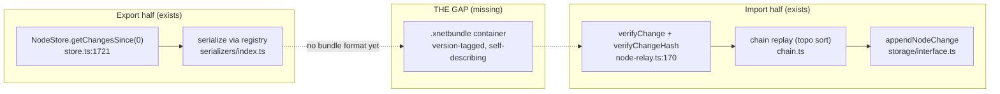
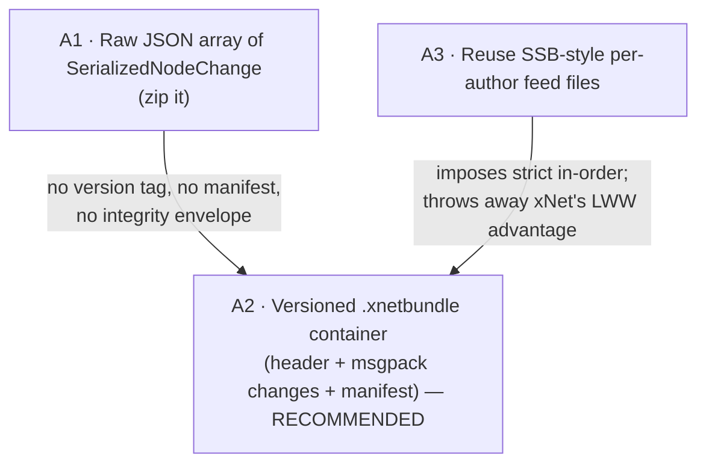
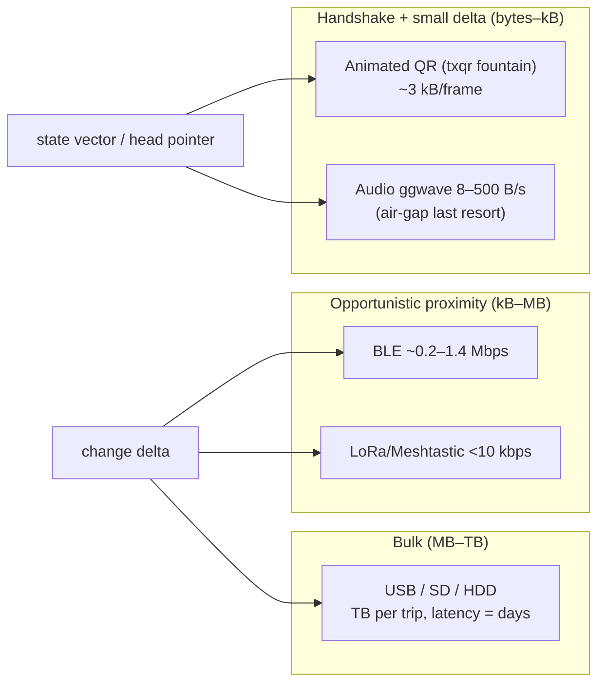
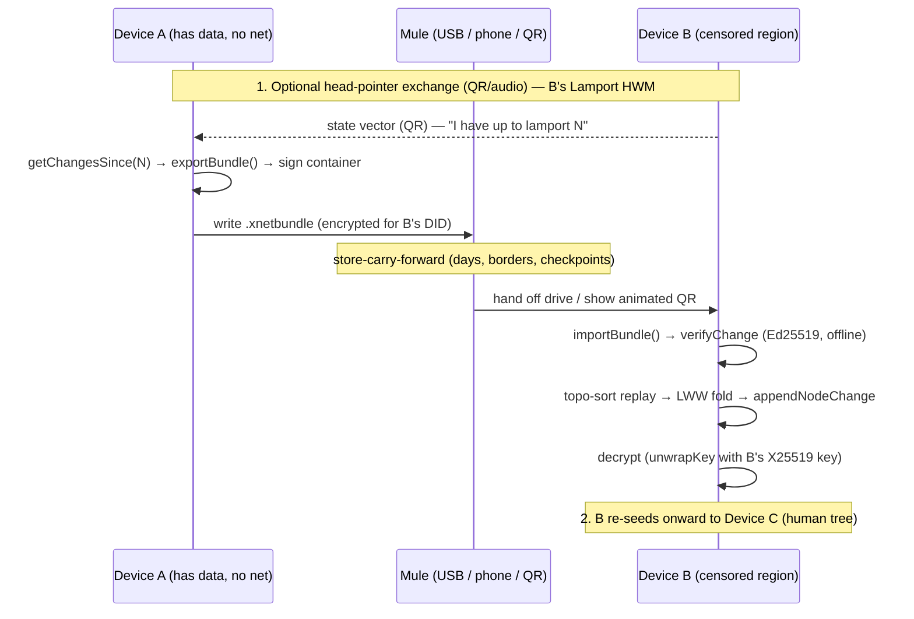
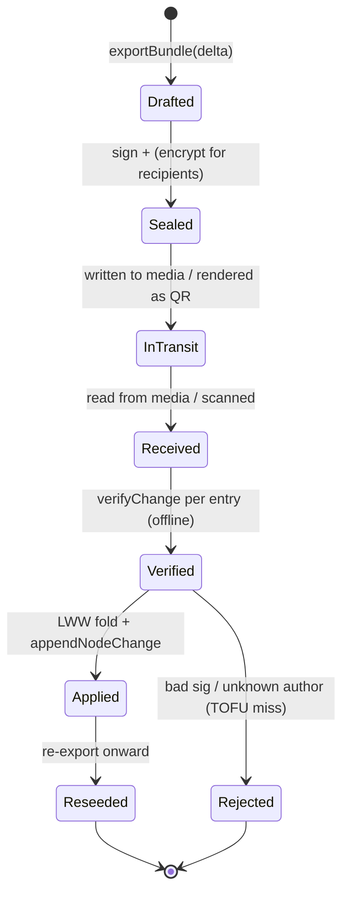

# Data Muleing — Carrying xNet Into Censored And Internet‑Limited Places

## Problem Statement

xNet's whole premise is user‑owned data that syncs peer‑to‑peer through a hub.
But the hub is an *online* rendezvous: today a client reaches its data by opening
a WebSocket to a hub URL ([`WebSocketSyncProvider.ts`](../../packages/runtime/src/sync/WebSocketSyncProvider.ts)).
In the places where user‑owned, un‑censorable data matters *most* — North Korea,
Cuba, Myanmar, Iran, a protest with the cell network cut, a rural clinic with no
backhaul — there is no reachable hub, or reaching one is dangerous. Access Now's
2025 #KeepItOn report counted **313 deliberate internet shutdowns across 52
countries** — at least one somewhere every day of the year.

The question this exploration answers: **can xNet data move without a network at
all — carried on a USB stick, a phone in a pocket, a QR code on a screen, a LoRa
hop across a valley — and still be authenticated, merged, and trusted on the far
side?** This is "data muleing" (sneakernet): store‑carry‑forward by a human or a
short‑range radio instead of the internet. The user's ask is to explore whether
xNet's protocol can serve as the payload for that kind of transport, what code
seams it touches, and what the sharp edges are — especially the ones specific to
operating in hostile, censored jurisdictions.

The thesis, stated up front: **xNet is already 80% of the way there, because its
interop kernel is a signed, hash‑chained, LWW change log — an offline‑verifiable
atom by construction.** The missing 20% is a *bundle format* and a *file/QR
transport binding*, plus an honest reckoning with a tension muleing forces into
the open: a non‑repudiable signed log is the *opposite* of plausibly deniable.

## Executive Summary

- **The change log is a natural sneakernet payload.** A `Change<T>`
  ([`packages/sync/src/change.ts`](../../packages/sync/src/change.ts)) carries its
  own `authorDID`, BLAKE3 `hash`, and Ed25519 `signature`. Because a `did:key`
  *is* an Ed25519 public key ([`did.ts`](../../packages/identity/src/did.ts)),
  **anyone can verify authorship of a carried change with zero network access** —
  no CA, no hub, no online key lookup. That is the hard part of offline data
  exchange, and xNet already has it.
- **The read/write API a bundle needs already exists.** Export is
  `getChangesSince(0)` on the client store
  ([`store.ts:1721`](../../packages/data/src/store/store.ts)) or
  `getNodeChangesSince` on the hub
  ([`storage/interface.ts`](../../packages/hub/src/storage/interface.ts)); import
  is the *same re‑verification path* the hub already runs on every relayed change
  ([`node-relay.ts`](../../packages/hub/src/services/node-relay.ts)), minus the
  socket. The gap is a **self‑describing, protocol‑versioned container** between
  those two ends — there is no `exportBundle()` / `.xnetbundle` today.
- **Confidentiality travels with the data.** Content is E2E‑encrypted with
  per‑recipient wrapped keys ([`envelope.ts`](../../packages/crypto/src/envelope.ts)),
  so a mule bundle is safe to hand to an untrusted courier: they carry ciphertext
  they cannot read. This matters because the hub's *authorization* is weak
  (exploration [0307](0307_[_]_SECURITY_OF_NODE_AND_CHANGE_FLOW.md) — a wildcard
  UCAN neutralizes grant checks); confidentiality has always rested on encryption,
  not access control, and that is exactly the property muleing needs.
- **xNet's merge is order‑independent — a big advantage over SSB.** The far side
  can receive bundles partially, out of order, or twice: LWW convergence
  ([`packages/core/src/lww.ts`](../../packages/core/src/lww.ts)) is commutative and
  idempotent (higher Lamport wins per property, blake3 tiebreak at v4). Unlike
  Secure Scuttlebutt's *strict in‑order* feeds, xNet does not need the whole
  causal history to apply the next change — the closest cousin is Yjs/Automerge
  save‑load merge, not SSB replication.
- **Transport tiering, borrowed from Delay‑Tolerant Networking (RFC 9171).** Use
  **USB/SD/HDD for bulk** (TB per courier trip), **QR / animated‑QR for handshake
  + small deltas** (xNet already ships `qrcode` and a `?payload=` ingestion path),
  **audio (ggwave) as an air‑gapped last resort**, and **BLE/LoRa for opportunistic
  proximity sync**. "Store‑carry‑forward with late transport binding" is the DTN
  frame even though we won't literally implement Bundle Protocol.
- **The recommendation:** build a versioned **`.xnetbundle` signed change‑bundle**
  format in the serializer registry, an **`OfflineBundleProvider`** that exports/
  imports it through the existing verify path, and a **QR fountain** channel for
  no‑media handoff — then confront the two things muleing exposes that online sync
  hides: **non‑repudiation vs. plausible deniability**, and **replica eviction/
  replay** (Kleppmann's open BFT‑CRDT problem). Ship the deniability story as a
  first‑class design constraint, not an afterthought.

## Current State In The Repository

### The atom: a self‑authenticating change

Every mutation is a signed, content‑addressed record
([`packages/sync/src/change.ts`](../../packages/sync/src/change.ts),
`CURRENT_PROTOCOL_VERSION = 4`):

```ts
export interface Change<T = unknown> {
  protocolVersion?: number      // 4
  id: string
  type: string                  // 'node-change'
  payload: T                    // { nodeId, schemaId?, properties, deleted? }
  hash: ContentId               // BLAKE3 over canonical bytes ("cid:blake3:…")
  parentHash: ContentId | null  // causal linkage
  authorDID: DID                // did:key — an Ed25519 public key
  signature: Uint8Array         // Ed25519 over the hash
  wallTime: number
  lamport: LamportTimestamp     // ordering / LWW tiebreak
  batchId?; batchIndex?; batchSize?
}
```

`verifyChange` / `verifyChangeHash` recompute the hash and check the signature
against the key parsed from `authorDID`. **No network, no server, no CA is
required to do this** — the single most important fact for muleing.

### The serialized wire form a bundle would reuse

The hub already flattens changes for storage/relay as `SerializedNodeChange`
([`storage/interface.ts:257`](../../packages/hub/src/storage/interface.ts),
mirrored in [`node-store-sync-provider.ts:73`](../../packages/runtime/src/sync/node-store-sync-provider.ts)):

```ts
type SerializedNodeChange = {
  id; type; hash; room; nodeId; schemaId?
  lamportTime; lamportAuthor; authorDid; wallTime
  parentHash; payload; signatureB64; protocolVersion?
  batchId?; batchIndex?; batchSize?
}
```

A version‑aware **serializer registry**
([`packages/sync/src/serializers/index.ts`](../../packages/sync/src/serializers/index.ts),
`v1..v4`) already round‑trips these and auto‑detects incoming wire versions — the
natural home for an `.xnetbundle` container envelope.

### Export and import already exist as separate halves



- **Export source:** `getChangesSince(sinceLamport)` on the client store
  ([`store.ts:1721`](../../packages/data/src/store/store.ts),
  [`sqlite-adapter.ts:616`](../../packages/data/src/store/sqlite-adapter.ts)) or
  `getNodeChangesSince(room, 0)` on the hub.
- **Import sink:** the WS `node-change` handler
  ([`packages/hub/src/ws/handlers/node-change.ts`](../../packages/hub/src/ws/handlers/node-change.ts))
  → `node-relay` re‑verify → `appendNodeChange`. A file/QR import would call the
  *same* verify+append, without the socket.
- **Replay ordering:** [`chain.ts`](../../packages/sync/src/chain.ts) provides
  `topologicalSort` and `compareChangeOrder` (lamport → wallTime → authorDID). The
  final LWW state is order‑independent ([`lww.ts`](../../packages/core/src/lww.ts)),
  but replaying in causal order avoids transient churn.

### The closest existing "carry data without a live socket" primitives

- **Self‑contained share tokens** — `createShareToken()`
  ([`packages/identity/src/sharing/create-share.ts`](../../packages/identity/src/sharing/create-share.ts))
  produces a UCAN‑signed, base64url, **offline‑verifiable** payload; `parse-share.ts`
  decodes + `verifyUCAN` with no server. This is the muleing pattern in miniature.
- **QR ingestion already shipped** — [`apps/web/src/routes/share.tsx`](../../apps/web/src/routes/share.tsx)
  handles `?payload=…` "self‑contained share payloads (QR / P2P form)"; the app
  depends on `qrcode` ([`apps/web/package.json:50`](../../apps/web/package.json))
  and `ShareDialog.tsx` renders share URLs as QR for in‑person handoff.
- **QR identity import** — [`ImportIdentityScreen.tsx`](../../packages/react/src/onboarding/screens/ImportIdentityScreen.tsx)
  has a `SCAN_QR` "scan from another device" flow — a Briar‑style out‑of‑band
  identity transfer, already built.
- **Offline queue** — [`offline-queue.ts`](../../packages/runtime/src/sync/offline-queue.ts)
  persists updates while disconnected and drains in order on reconnect: the
  "hold changes until a transport appears" seam.
- **Encrypted backup** — [`services/backup.ts`](../../packages/hub/src/services/backup.ts)
  is the existing file‑blob export/import precedent (DID `ownershipProof`,
  Ed25519‑signed).
- **Msgpack transport** — the P2P path already length‑prefix‑msgpacks the same
  sync messages ([`packages/network/src/protocols/sync.ts`](../../packages/network/src/protocols/sync.ts),
  `@msgpack/msgpack`) over libp2p `/xnet/sync/1.0.0` — proof the message semantics
  are transport‑independent, which is the whole premise of a mule binding.

### What a mule must carry to *decrypt* (not just verify)

Verification needs only the public `authorDID`. Decryption needs the recipient's
X25519 private key to `unwrapKey`
([`envelope.ts:154`](../../packages/crypto/src/envelope.ts)). So a bundle can be:
(a) **public** (`PUBLIC_CONTENT_KEY`, anyone reads), (b) **wrapped for specific
recipient DIDs** (only they decrypt — safe to hand to any courier), or (c)
**carried with a separately‑muled key**. The envelope format already supports all
three.

## External Research

### Sneakernet in the wild (the demand side is real and large)

| Case | Scale / mechanism | Lesson for xNet |
|---|---|---|
| **Flash Drives for Freedom** (North Korea, HRF) | ~200k USB drives smuggled over ~3 yrs; foot‑crossings, black‑market resale, **balloon** and **drone** drops (FFNK launched 2M+ balloons); a stick sold for ~a week's wages | Human trees, not meshes; content pull is inelastic; **possession is the risk** |
| **El Paquete Semanal** (Cuba) | ~**1 TB/week**, $2–5, compiler → *paquetero* → reseller tree, drive‑to‑drive copy | A weekly TB courier dwarfs any radio; latency (days) is the cost, not bandwidth |
| **Kiwix / ZIM** | `kiwix-serve` re‑hosts a delivered archive to a LAN — a *re‑seeding node* | A mule delivery should be able to **re‑seed** onward peers, not terminate |
| **Bhutan "Rigsum Sherig", RACHEL, Internet‑in‑a‑Box** | teacher‑carried ~25 GB drives; Pi hotspots in 40+ countries | Small‑scale, human‑carried, LAN re‑serve — xNet's actual target shape |
| **Afghanistan "computer kars"** (2021–) | phone shops as human sneakernet nodes, hundreds of TB collectively | Store‑carry‑forward emerges socially wherever backhaul dies |

Access Now #KeepItOn 2025: **313 shutdowns / 52 countries** (Myanmar ~95, India 65),
70 during grave rights abuses. Tanenbaum's epigraph still holds: *"Never
underestimate the bandwidth of a station wagon full of tapes."*

### Delay‑Tolerant Networking (the theory to borrow terminology from)

- **RFC 9171** (Bundle Protocol v7, CBOR) and its predecessor **RFC 5050** (v6):
  *store‑carry‑forward*, *custody transfer*, *late binding* of endpoint IDs.
- **LTP / CBHE** (RFC 7116); reference stacks NASA **ION**, **HDTN**, **µD3TN**.
- We adopt the *vocabulary and mental model* (a bundle a node holds and forwards
  opportunistically; the same logical peer reachable via USB today, LoRa tomorrow)
  without implementing literal BP — xNet's CRDT log is the payload, DTN is the
  carrier metaphor.

### Offline‑first sync systems (prior art, with cautionary tales)

| Project | Transport | Design point relevant to xNet |
|---|---|---|
| **Briar / Bramble** | Bluetooth, Wi‑Fi, **USB/removable media**, Tor | **QR contact verification** to defeat MITM; delay‑tolerant transport switching — the shipped implementation of exactly our handshake need |
| **Secure Scuttlebutt** | LAN gossip + optional "pub" relays | Per‑identity **append‑only signed feed**, **strict in‑order** replication — the *stricter* cousin; its Meta‑Feeds/partial‑replication retrofit is the map out of that corner |
| **Automerge** | any reliable in‑order transport; **save/load `.automerge` files** | Git‑like offline commit + file merge is the muleing‑relevant path (not the streaming protocol); binary history ~30% overhead |
| **Yjs** | any | Updates **commutative + idempotent**; `Y.mergeUpdates()` compacts; **state vectors** let one side compute a minimal one‑way diff — the model for QR‑carried deltas |
| **Hypercore/Dat** | Hyperswarm; droppable to disk | **Sparse replication**: verify/fetch arbitrary sub‑ranges against a signed Merkle tree without the full log |
| **Bridgefy** | BLE/Wi‑Fi mesh | **Cautionary tale** — marketed for protests, *broken twice* academically (no auth, social‑graph leak, mesh DoS). Do **not** reinvent protest‑grade mesh casually |
| **Syncthing** | LAN/relay; manual removable media | Formal **"untrusted device"** encrypted‑sync mode — but issue #8920 showed an untrusted device leaking trusted peers via the introducer. Authz edge cases bite |

### Security prior art specific to censored contexts

- **Offline authenticity without a server** — Web‑of‑Trust / PGP fingerprint
  verification over an out‑of‑band channel (the `openpgp4fpr:` QR scheme); Briar's
  Bramble Handshake is the shipped TOFU‑via‑QR analog. xNet's `did:key` + QR
  exchange (`ImportIdentityScreen` already does this) is the same pattern.
- **Plausible deniability** — Rubberhose (1997) → modern deniable encryption
  (steganography + hidden volumes); *Wink: Deniable Secure Messaging*
  (arXiv:2207.08891). **Direct tension:** a signed hash‑chained log is
  non‑repudiable *by construction* — it proves who wrote what. In a hostile
  jurisdiction that is a feature for provenance and a liability for the carrier.
- **Metadata leakage** — even fully encrypted mesh leaks a social graph via
  timing/proximity/packet size (the *unfixed* half of the Bridgefy break). "Who
  synced with whom, when, over what channel" is attacker‑visible unless obscured.
- **Replay / eviction on CRDT logs** — Kleppmann, *Making CRDTs Byzantine Fault
  Tolerant* (PaPoC'22): hash graphs + signatures make forking/equivocation
  *detectable*, but **evicting a malicious replica and undoing already‑propagated
  damage is explicitly unsolved**. A malicious mule re‑injecting an old,
  already‑revoked bundle is precisely this open problem. (See also arXiv:2011.06488
  on Matrix's event graph.)

## Key Findings

1. **Offline authenticity is already solved.** `did:key` = Ed25519 pubkey; hash
   covers author+payload; signature covers hash; both ingest paths verify. A mule
   bundle is verifiable with nothing but the bytes on the stick.
2. **The missing piece is a container, not a mechanism.** Export
   (`getChangesSince`), serialize (registry), and import (`node-relay` verify +
   `appendNodeChange`) all exist. Only the self‑describing, version‑tagged
   `.xnetbundle` envelope between them is absent.
3. **xNet merges out of order — unlike SSB.** LWW is commutative/idempotent, so
   partial, duplicated, or reordered bundle delivery converges. This is a
   *material* advantage: sneakernet is lossy and unordered by nature.
4. **Confidentiality is decoupled from the carrier.** Per‑recipient wrapped keys
   mean an untrusted courier carries ciphertext. Given 0307's weak authorization,
   encryption is the *only* real confidentiality boundary anyway — which happens
   to be exactly right for muleing.
5. **Protocol version must ride inside the bundle.** A mule hop can span months and
   version gaps; `negotiation.ts` handshakes assume a live peer. The bundle must
   be self‑describing (`conformance/vectors/replication/0004-protocol-version-bundle.json`
   already models a version‑tagged bundle).
6. **Non‑repudiation vs. deniability is the defining tension.** The log's greatest
   strength (proof of authorship) is a carrier's greatest risk in a hostile
   jurisdiction. This needs an explicit design answer, not a footnote.
7. **Signatures are Ed25519‑only today.** The hybrid PQ path
   ([`hybrid-signing.ts`](../../packages/crypto/src/hybrid-signing.ts)) is *not*
   wired into `Change<T>` (tracked in 0307). For high‑threat, long‑latency
   muleing, harvest‑now‑verify/decrypt‑later is a real concern to name.
8. **A delivery should re‑seed, not terminate.** Kiwix's `kiwix-serve` lesson: the
   receiving device should be able to re‑export onward bundles, turning each mule
   drop into a new distribution root (the human‑tree topology El Paquete proves out).

## Options And Tradeoffs

### A. Bundle format



- **A1 — Zipped JSON.** Trivial, but no self‑description, no version negotiation,
  no manifest of what's inside, weak integrity story. Fine for a hack, wrong for a
  standard.
- **A2 — Versioned `.xnetbundle` container (recommended).** A small self‑describing
  header (`{ magic, bundleVersion, protocolVersion, createdAt, authorDID,
  scope, count, contentHash, sig }`) + the changes (msgpack, reusing the serializer
  registry) + an optional key‑wrap block for encrypted content + an optional
  manifest (node/schema ids, Lamport range). Signed over the whole payload so the
  bundle *itself* is tamper‑evident, independent of the per‑change signatures.
  Model it on `createShareToken`'s self‑contained base64url payload and the
  `backup.ts` blob precedent.
- **A3 — SSB‑style feed files.** Would import SSB's strict‑order constraint and
  discard xNet's order‑independent merge. Reject.

### B. Delta computation — how does the mule know what to carry?

- **B1 — Full dump (`getChangesSince(0)`).** Simplest; a fresh device gets
  everything. But a 318k‑row log (the cold‑open stall from
  [0249](0249-cold-open-stall.md)) is a huge bundle. Good for first seed, wasteful
  for updates.
- **B2 — Lamport high‑water delta (recommended default).** The receiver's last
  Lamport (or a compact per‑author vector) is exchanged first — over QR/audio if
  no media — and the sender exports only `getChangesSince(hwm)`. This is exactly
  Yjs's **state‑vector diff**, one‑way and connectionless. The receiver's state
  vector fits in a QR code; the delta rides USB.
- **B3 — Scoped by replication scope.** Reuse
  [`replication-scope.ts`](../../packages/runtime/src/sync/replication-scope.ts) so
  a bundle carries only a chosen Space/room subtree — essential for selective,
  low‑risk muleing (carry only the clinic's records, not the whole workspace).

### C. Transport binding (tiered, per DTN)



- **C1 — File only.** `.xnetbundle` written to disk / USB. Covers 90% of real
  muleing (El Paquete, Flash Drives for Freedom are all file‑on‑media). Ship first.
- **C2 — QR (static + animated fountain).** Reuse the `qrcode` dep and `?payload=`
  path. Static QR ≤ ~2.9 kB (a state vector, a head pointer, a tiny delta).
  Animated **txqr**‑style **fountain coding** (Luby transform) for larger deltas —
  the receiver needs "enough" frames, not every frame in order, which matches lossy
  camera capture. Great for no‑media, in‑person handoff.
- **C3 — Audio (ggwave).** 8–500 B/s. Only for signaling/head‑pointer exchange
  when there is no camera and no port — genuine air‑gap fallback.
- **C4 — BLE / LoRa.** Opportunistic proximity delta sync. **Heed Bridgefy:** any
  mesh feature must ship with real auth (we have it — signed changes) and must not
  leak the contact graph. LoRa is text/telemetry‑class (<10 kbps) — head pointers
  and micro‑deltas only.

### D. Trust bootstrap for a *new* peer met offline

- **D1 — TOFU via QR (recommended).** Two devices exchange `did:key` fingerprints
  by QR at first contact (Briar's shipped model; `ImportIdentityScreen` already
  scaffolds it), then trust‑on‑first‑use for subsequent bundle verification.
- **D2 — Web‑of‑Trust delegation.** Carry UCAN delegation chains
  ([`ucan.ts`](../../packages/identity/src/ucan.ts)) so a trusted mule vouches for a
  key. Offline‑verifiable, but UCAN has no offline revocation (0307) — a revoked
  delegation can be replayed by a malicious carrier.
- **D3 — Out‑of‑band only.** Rely purely on humans knowing each other. Weakest
  against MITM; fine for tiny trusted groups.

### E. The deniability posture (the hard one)

- **E1 — Do nothing.** Signed log stays fully non‑repudiable. Best provenance,
  *worst* for a carrier caught with it — the bytes prove exactly who dissented.
- **E2 — Encrypted‑at‑rest bundle + deniable container (recommended floor).**
  Bundle body is ciphertext with no plaintext author metadata in the header;
  optionally stored in a hidden/again‑encrypted volume so its *existence* is
  deniable. The signatures still exist *inside* once decrypted (provenance
  preserved for legitimate recipients) but a seized drive reveals only random
  bytes. Reference: Rubberhose lineage, *Wink* (arXiv:2207.08891).
- **E3 — Ephemeral/repudiable authorship mode.** A separate, unsigned or
  group‑signed "deniable cache" layer distinct from the authoritative signed log.
  Large design surface; a genuine open research question (it fights the whole
  point of the protocol). Flag, don't build yet.

## Recommendation

Adopt **A2 + B2 + C1→C2 + D1 + E2**: a versioned, signed **`.xnetbundle`**
container; **Lamport‑high‑water delta** as the default (full dump only for first
seed); **file transport first, QR fountain second**; **TOFU‑via‑QR** trust
bootstrap; and **encrypted‑at‑rest bundles with a deniable‑existence option** as
the security floor for hostile jurisdictions.

Concretely, three deliverables:

1. **`@xnetjs/sync` bundle codec** — `exportBundle(changes, opts)` /
   `importBundle(bytes)` in the serializer registry, producing/parsing a
   self‑describing, protocol‑versioned, signed container. Encryption‑agnostic:
   carries whatever `NodeContentCipher` the changes already have.
2. **`OfflineBundleProvider`** in `packages/runtime/src/sync/` — a
   `BaseSyncProvider` ([`provider.ts`](../../packages/sync/src/provider.ts))
   subclass (mirroring `offline-queue.ts`) that, given a file or scanned QR payload,
   runs the **exact same** verify+replay+append path as the WS `node-change`
   handler. One import code path, two triggers (socket vs. mule).
3. **A muling UX** — "Export for offline transfer" (→ file or QR) and "Import
   offline bundle" (→ file picker or camera) wired to the existing
   `ShareDialog`/`ImportIdentityScreen` surfaces, plus a *re‑seed* affordance so a
   received bundle can be re‑exported onward (the Kiwix lesson).

### End‑to‑end flow



### Bundle lifecycle



### Phasing

1. **Phase 1 — Codec + full‑dump file export/import** behind a Labs flag. Proves
   offline verify+merge on a `:memory:` round‑trip. No UX polish.
2. **Phase 2 — Lamport‑delta + QR fountain** for no‑media handoff; wire into
   `ShareDialog` / `ImportIdentityScreen`; scoped export via `replication-scope`.
3. **Phase 3 — Encrypted‑at‑rest + deniable‑existence** container option; TOFU‑QR
   trust bootstrap doc; re‑seed affordance.
4. **Phase 4 (research)** — replica eviction/replay defenses (Kleppmann BFT‑CRDT),
   PQ‑hybrid change signatures, metadata‑graph obfuscation. Track as XPPs, do not
   block Phases 1–3.

## Example Code

### The bundle container (illustrative)

```ts
// packages/sync/src/bundle.ts
export const XNET_BUNDLE_MAGIC = 'XNBDL'

export interface BundleHeader {
  magic: typeof XNET_BUNDLE_MAGIC
  bundleVersion: 1
  protocolVersion: number       // CURRENT_PROTOCOL_VERSION at export time
  createdAt: number
  authorDID: DID                // who assembled the bundle (not the change authors)
  scope?: { room?: string; spaceId?: string }
  lamportRange: { from: number; to: number }
  count: number
  contentHash: ContentId        // BLAKE3 over the serialized change block
  signature: string             // Ed25519(contentHash) by authorDID — bundle-level tamper-evidence
}

export function exportBundle(
  changes: NodeChange[],
  opts: { authorSeed: Uint8Array; scope?: BundleHeader['scope'] },
): Uint8Array {
  const serialized = changes.map(serializeNodeChange)      // reuse registry (v4)
  const block = msgpackEncode(serialized)
  const contentHash = createContentId(block)               // packages/core/src/hashing.ts
  const header: BundleHeader = {
    magic: XNET_BUNDLE_MAGIC, bundleVersion: 1,
    protocolVersion: CURRENT_PROTOCOL_VERSION,
    createdAt: /* injected — no Date.now in pure core */ opts.now,
    authorDID: didFromSeed(opts.authorSeed),
    scope: opts.scope,
    lamportRange: lamportBounds(changes),
    count: changes.length,
    contentHash,
    signature: toBase64(sign(parseContentId(contentHash).digest, opts.authorSeed)),
  }
  return msgpackEncode({ header, block })
}
```

### Import reuses the existing verify path — no new trust code

```ts
// packages/runtime/src/sync/offline-bundle-provider.ts (sketch)
export async function importBundle(bytes: Uint8Array, store: NodeStore) {
  const { header, block } = msgpackDecode(bytes)
  assert(header.magic === XNET_BUNDLE_MAGIC, 'not an xNet bundle')

  // 1. Bundle-level integrity (tamper-evidence over the whole carrier payload)
  assertBundleSignature(header, block)                      // Ed25519 over contentHash

  // 2. Per-change authenticity — THE SAME calls the hub makes on every relay
  const serialized: SerializedNodeChange[] = msgpackDecode(block)
  const verified = serialized
    .map(deserializeNodeChange)
    .filter((c) => verifyChangeHash(c) && verifyChange(c))  // sync/change.ts — offline, Ed25519

  // 3. Replay in causal order; LWW makes partial/dup/out-of-order safe
  for (const c of topologicalSort(verified)) {
    await store.appendChange(c)                             // idempotent LWW upsert
  }
  return { accepted: verified.length, rejected: serialized.length - verified.length }
}
```

The point: **import introduces no new cryptographic trust surface.** It calls
`verifyChange` / `verifyChangeHash` / `topologicalSort` — the identical primitives
[`node-relay.ts`](../../packages/hub/src/services/node-relay.ts) already runs.
A mule bundle is "the hub relay path, minus the socket."

### State vector as a QR payload (Yjs‑style one‑way diff request)

```ts
// receiver → sender, over a single static QR (≤ ~2.9 kB)
interface OfflineSyncRequest {
  v: 1
  did: DID                 // who is asking (for recipient key-wrapping the reply)
  hwm: number              // highest Lamport already held
  scope?: string           // room / space to limit the reply
}
// sender computes getChangesSince(hwm) within scope → exportBundle → media/animated-QR
```

## Risks And Open Questions

- **Non‑repudiation vs. deniability (the defining risk).** A seized drive of
  signed changes can prove a carrier's associations in a hostile jurisdiction.
  Encrypted‑at‑rest (E2) hides content and header metadata but the signatures
  remain *inside*. A truly deniable authorship mode (E3) fights the protocol's
  core guarantee. **Open:** is xNet's censored‑region story "own your data with
  strong provenance" (accept non‑repudiation) or "communicate deniably" (a
  different product)? These pull in opposite directions and must be chosen, not
  finessed.
- **Replica eviction & replay (Kleppmann's open problem).** A malicious mule can
  re‑inject old, revoked, or equivocating bundles. LWW makes *stale* replays mostly
  harmless (they lose on Lamport), but **evicting a bad author and undoing
  already‑propagated damage is unsolved in the literature.** No drop‑in fix; treat
  as research, and at minimum make forking/equivocation *detectable* via the hash
  chain.
- **Possession of the tool itself is a risk.** Distinct from message content: the
  app binary, a `.xnetbundle` file's magic bytes, a distinctive BLE/LoRa signature,
  or an app‑store listing can all be incriminating (cf. Russia's 2024 ban on even
  *sharing information* about circumvention tools). **Open:** should bundles be
  format‑indistinguishable from random/other files? Should there be a "panic"
  wipe?
- **Metadata / social‑graph leakage.** "Who muled to whom" is visible via
  proximity, timing, and the DIDs inside a bundle even when content is encrypted.
  This is the *unfixed* half of the Bridgefy break. Bundle headers should minimize
  plaintext DID exposure; proximity transports need contact‑graph hygiene.
- **Ed25519‑only signatures.** No PQ protection on change signatures yet
  (`hybrid-signing.ts` unwired, per 0307). Long‑latency muleing widens the
  harvest‑now window. Decide whether high‑threat bundles require the hybrid tier
  before Phase 3.
- **Bundle size for first seed.** A full `getChangesSince(0)` can be the 318k‑row
  log (0249). Need `Y.mergeUpdates`‑style compaction / snapshotting for the Yjs
  document bodies and a "seed snapshot vs. incremental delta" distinction.
- **Schema resolution offline.** A change references `xnet://authority/Name@ver`;
  if the receiver lacks that schema and can't reach its authority, the node is
  data‑without‑meaning. **Open:** bundle the needed schema nodes alongside the
  changes (schemas are just nodes) — a self‑contained bundle carries its own schemas.
- **Yjs document bodies vs. structured changes.** The structured node log mules easily;
  the Yjs `documentContent` blobs ride as opaque `SignedYjsEnvelope` bytes
  ([`yjs-envelope.ts`](../../packages/sync/src/yjs-envelope.ts)) — commutative and
  idempotent, so safe, but sizing/compaction differs. Bundle must carry both.
- **Idempotency at the store.** Import must be a true LWW upsert (deterministic ID
  → upsert, the seed pattern from
  [devtools seed](../../packages/devtools/src/seed/README.md)); re‑importing the
  same bundle must be a no‑op. Verify against `appendChange` semantics.

## Implementation Checklist

- [ ] Add `packages/sync/src/bundle.ts`: `BundleHeader`, `exportBundle`,
      `importBundle`, `assertBundleSignature`, reusing the serializer registry and
      `@msgpack/msgpack`; inject `now`/randomness (no `Date.now` in pure core).
- [ ] Register a `.xnetbundle` container version in
      [`serializers/index.ts`](../../packages/sync/src/serializers/index.ts) with
      auto‑detection, so future bundle versions negotiate like wire versions do.
- [ ] Add `exportBundle`/`importBundle` convenience methods to the client store
      over `getChangesSince` and `appendChange`
      ([`store.ts`](../../packages/data/src/store/store.ts)).
- [ ] Implement `OfflineBundleProvider` in `packages/runtime/src/sync/` as a
      `BaseSyncProvider` that runs `verifyChange`+`verifyChangeHash`+`topologicalSort`
      +`appendChange` (the node‑relay path, socket‑free).
- [ ] Lamport high‑water delta: `OfflineSyncRequest` type + `getChangesSince(hwm)`
      export; scope via [`replication-scope.ts`](../../packages/runtime/src/sync/replication-scope.ts).
- [ ] Self‑contained schemas: include referenced schema nodes in the bundle when
      the receiver may lack them.
- [ ] File transport: "Export for offline transfer" / "Import offline bundle" in
      `ShareDialog.tsx` (download + file picker).
- [ ] QR transport: static QR for state vectors/small deltas (reuse `qrcode`);
      animated **txqr‑style fountain** decode for larger deltas; wire the `?payload=`
      ingestion in [`share.tsx`](../../apps/web/src/routes/share.tsx) to bundles.
- [ ] TOFU‑via‑QR trust bootstrap: extend
      [`ImportIdentityScreen`](../../packages/react/src/onboarding/screens/ImportIdentityScreen.tsx)
      to exchange + pin peer DIDs.
- [ ] Re‑seed affordance: a received bundle can be re‑exported onward (Kiwix lesson).
- [ ] Encrypted‑at‑rest bundle option with minimized plaintext header metadata;
      document a deniable‑existence (hidden‑volume) storage recipe.
- [ ] Golden vector: a `conformance/vectors/bundle/*.json` round‑trip
      (export → carry → import → identical LWW state), generated from the TS impl.
- [ ] Changeset: new public `@xnetjs/sync` surface (`exportBundle`/`importBundle`)
      is a **minor**; if it changes any existing serialized wire shape, **major**.

## Validation Checklist

- [ ] A bundle exported on Device A imports on Device B **with no network**, and B
      reaches byte‑identical `NodeState` for the carried nodes.
- [ ] **Offline authenticity:** a bundle whose signatures were tampered is rejected
      per‑change; an untampered bundle from an unknown DID is quarantined pending
      TOFU, not silently applied.
- [ ] **Order independence:** importing the bundle's changes shuffled, split into
      halves, and duplicated all converge to the same state (idempotent LWW).
- [ ] **Delta correctness:** `getChangesSince(hwm)` + import equals a full‑dump
      import for the same target state, at a fraction of the bytes.
- [ ] **Scope:** a Space‑scoped bundle carries only that subtree's changes and
      schemas; nothing outside leaks.
- [ ] **QR fountain:** an animated‑QR delta decodes from a lossy camera capture
      missing/reordering frames (fountain "enough frames" property holds).
- [ ] **Encrypted‑at‑rest:** a seized bundle reveals no plaintext author DIDs or
      node content; only holders of the recipient X25519 key decrypt.
- [ ] **Re‑seed:** Device B re‑exports a bundle that Device C imports to the same
      state (human‑tree replication works transitively).
- [ ] **Version skew:** a v4 bundle imported by a v4 reader succeeds; a bundle from
      an unsupported future `protocolVersion` is refused cleanly (self‑description
      works without a live handshake).
- [ ] **Idempotency:** re‑importing an already‑applied bundle is a no‑op (no churn,
      no duplicate changes, no conflict flood — cf. [0296](0296-checklist-task-conflict-flood.md)).

## References

### xNet repository (source of truth)
- Signed change + verify — [`packages/sync/src/change.ts`](../../packages/sync/src/change.ts)
- Serializer registry (v1–v4) — [`packages/sync/src/serializers/index.ts`](../../packages/sync/src/serializers/index.ts)
- Hash‑chain + topo sort + order — [`packages/sync/src/chain.ts`](../../packages/sync/src/chain.ts)
- LWW convergence — [`packages/core/src/lww.ts`](../../packages/core/src/lww.ts); hashing/CID — [`packages/core/src/hashing.ts`](../../packages/core/src/hashing.ts)
- Change log read/write — [`packages/data/src/store/store.ts`](../../packages/data/src/store/store.ts) (`getChangesSince`), [`packages/data/src/store/sqlite-adapter.ts`](../../packages/data/src/store/sqlite-adapter.ts)
- Hub re‑verify + storage port — [`packages/hub/src/services/node-relay.ts`](../../packages/hub/src/services/node-relay.ts), [`packages/hub/src/storage/interface.ts`](../../packages/hub/src/storage/interface.ts), [`packages/hub/src/ws/handlers/node-change.ts`](../../packages/hub/src/ws/handlers/node-change.ts)
- Sync providers + offline queue + scope — [`packages/runtime/src/sync/WebSocketSyncProvider.ts`](../../packages/runtime/src/sync/WebSocketSyncProvider.ts), [`offline-queue.ts`](../../packages/runtime/src/sync/offline-queue.ts), [`replication-scope.ts`](../../packages/runtime/src/sync/replication-scope.ts), base [`packages/sync/src/provider.ts`](../../packages/sync/src/provider.ts)
- Identity / crypto (offline verify + encrypt) — [`packages/identity/src/did.ts`](../../packages/identity/src/did.ts), [`packages/crypto/src/signing.ts`](../../packages/crypto/src/signing.ts), [`packages/crypto/src/envelope.ts`](../../packages/crypto/src/envelope.ts), [`packages/crypto/src/hybrid-signing.ts`](../../packages/crypto/src/hybrid-signing.ts)
- Share tokens + QR ingestion + identity scan — [`packages/identity/src/sharing/create-share.ts`](../../packages/identity/src/sharing/create-share.ts), [`apps/web/src/routes/share.tsx`](../../apps/web/src/routes/share.tsx), [`apps/web/src/components/ShareDialog.tsx`](../../apps/web/src/components/ShareDialog.tsx), [`packages/react/src/onboarding/screens/ImportIdentityScreen.tsx`](../../packages/react/src/onboarding/screens/ImportIdentityScreen.tsx)
- Encrypted backup precedent + msgpack transport — [`packages/hub/src/services/backup.ts`](../../packages/hub/src/services/backup.ts), [`packages/network/src/protocols/sync.ts`](../../packages/network/src/protocols/sync.ts)
- Related explorations — protocol boundaries [0200](0200_[x]_PORTABLE_XNET_PROTOCOL_BOUNDARIES_AND_STANDARD.md), change‑flow security [0307](0307_[_]_SECURITY_OF_NODE_AND_CHANGE_FLOW.md), hash grinding [0305](0305_[x]_HASH_GRINDING_MITIGATION.md), cold‑open stall [0249](0249-cold-open-stall.md)

### Sneakernet / offline distribution
- Flash Drives for Freedom — https://flashdrivesforfreedom.org/ · FFNK balloons — https://en.wikipedia.org/wiki/Fighters_for_a_Free_North_Korea
- El Paquete Semanal (ACM SIGCAS) — https://dl.acm.org/doi/10.1145/3209811.3209876 · https://lin-web.clarkson.edu/~jmatthew/publications/ElPaquete.pdf
- Kiwix / ZIM — https://www.kiwix.org/ · RACHEL / World Possible — https://worldpossible.org/ · Internet‑in‑a‑Box — https://internet-in-a-box.org/
- Access Now #KeepItOn 2025 — https://www.accessnow.org/internet-shutdowns-2025/ · xkcd what‑if #31 (FedEx bandwidth) — https://what-if.xkcd.com/31/

### Delay‑Tolerant Networking
- RFC 9171 (Bundle Protocol v7) — https://www.rfc-editor.org/rfc/rfc9171.html · RFC 5050 — https://www.rfc-editor.org/rfc/rfc5050.html · RFC 7116 (LTP/CBHE) · https://en.wikipedia.org/wiki/Delay-tolerant_networking

### Offline‑first sync + CRDT bundle merge
- Briar / Bramble — https://briarproject.org/how-it-works/ · Secure Scuttlebutt — https://ssbc.github.io/scuttlebutt-protocol-guide/ · SSB partial replication audit — https://ssb-ngi-pointer.github.io/
- Automerge binary format — https://automerge.org/automerge-binary-format-spec/ · Yjs document updates / state vectors — https://docs.yjs.dev/api/document-updates · Hypercore DEP‑0002 — https://www.datprotocol.com/deps/0002-hypercore/
- Syncthing untrusted devices — https://docs.syncthing.net/users/untrusted.html · Berty Wesh — https://berty.tech/docs/protocol/

### Physical transports
- QR versions/capacity — https://www.qrcode.com/en/about/version.html · txqr fountain QR — https://github.com/divan/txqr · fountain codes — https://divan.dev/posts/fountaincodes/
- Meshtastic LoRa settings — https://meshtastic.org/docs/configuration/radio/lora/ · ggwave audio modem — https://github.com/ggerganov/ggwave

### Security in censored contexts
- Kleppmann, *Making CRDTs Byzantine Fault Tolerant* (PaPoC'22) — https://martin.kleppmann.com/papers/bft-crdt-papoc22.pdf
- *Breaking Bridgefy* — https://eprint.iacr.org/2021/214.pdf · *Analysis of the Matrix Event Graph* — https://arxiv.org/abs/2011.06488
- Deniable encryption — https://en.wikipedia.org/wiki/Deniable_encryption · *Wink: Deniable Secure Messaging* — https://arxiv.org/abs/2207.08891
- Freedom House on VPN/tool restrictions — https://freedomhouse.org/article/another-door-closes-authoritarians-expand-restrictions-virtual-private-networks · OpenPGP QR fingerprint — https://github.com/ModernPGP/QR
