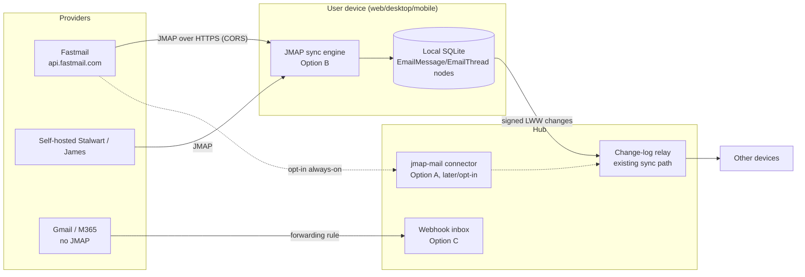
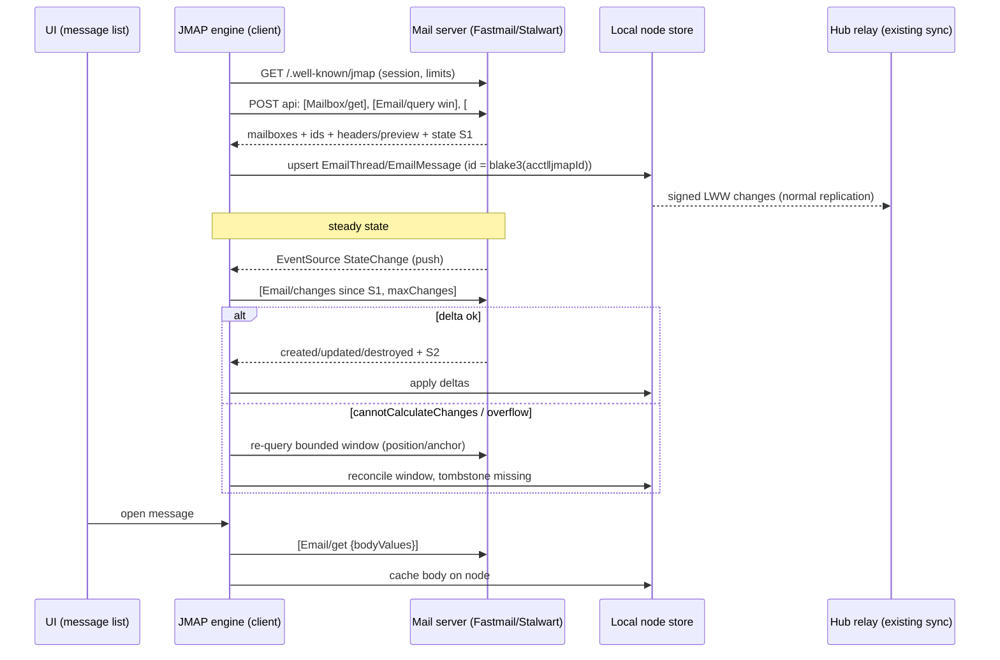
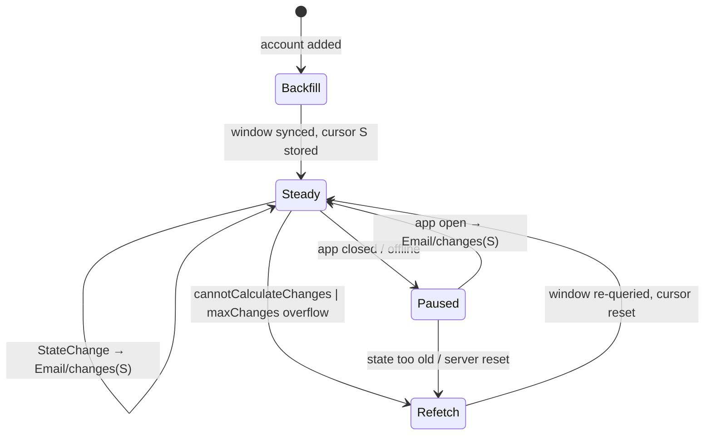

# Using JMAP for Email Sync

## Problem Statement

Email is the largest body of personal/work data that xNet does not touch. We
have connectors for calendars, GitHub, Notion, Airtable, Linear, and RSS, a
generic webhook inbox, and Slack-compat ingress — but no way to bring a
mailbox into a workspace, thread it alongside chat and comments, link messages
to tasks and CRM contacts, or let the agent read and act on mail.

JMAP (JSON Meta Application Protocol, RFC 8620/8621) is the modern open
standard for mail sync: batched JSON-over-HTTPS, first-class delta sync via
state strings, built-in push, blob endpoints for attachments. This exploration
answers three questions:

1. **Should xNet sync email via JMAP?** What does the protocol buy us, who can
   we actually reach with it, and what are the alternatives (IMAP, Gmail API,
   Microsoft Graph, forwarding-based push)?
2. **Where does the JMAP adapter live** — hub-side (the existing
   `defineConnector` pull pattern) or client-side (local-first, the mail never
   transits the hub in plaintext)?
3. **What does JMAP teach xNet's own protocol?** Its session-limits/flood-
   control and state-cursor design are prior art for our sync engine.

## Executive Summary

- **JMAP is the right protocol for the mail it can reach — which is Fastmail
  plus self-hosted servers.** Gmail, Outlook/M365, iCloud, and Yahoo do not
  support JMAP and have announced no plans. Stalwart (Rust, open-source,
  JMAP+IMAP+SMTP+CalDAV in one binary) is the standout self-host server and
  pairs naturally with xNet's self-hosting ethos (an xNet hub and a Stalwart
  server on the same Raspberry Pi is a coherent stack — see exploration 0300).
- **Recommended architecture: a client-side JMAP sync engine, not a hub-side
  connector.** Email is the most sensitive data class we would ever ingest.
  The existing connector pattern (0196) runs `pull` on the hub, so the hub
  sees plaintext. A client-side engine keeps the JMAP token and the plaintext
  on the user's device; mail lands in local SQLite as ordinary signed nodes
  and replicates through the existing change-log sync like any other content.
  Fastmail's JMAP API is CORS-enabled, so even the browser app can talk to it
  directly. Deterministic node IDs (`blake3(accountId ‖ jmapEmailId)`) make
  multi-device pulls idempotent under LWW — the same trick the dev-tools seed
  uses.
- **Thin first slice: read-only.** `Mailbox/get`, `Email/query` + `Email/get`
  (headers/preview only), `Thread/get`, steady-state `Email/changes` delta
  sync, EventSource push while the app is open. Defer send
  (`EmailSubmission`), defer flag write-back, defer attachments-as-blobs.
- **New schemas:** `EmailMessage` + `EmailThread` under
  `packages/data/src/schema/schemas/`, following the `ChatMessage`/`Channel`
  container+message pattern, with a Tier-1 seeder to satisfy seed coverage.
- **Do not block on the connector-scheduler gap.** `ConnectorCadence` is
  declared but nothing executes it today (sync runs only via explicit
  `POST /x/<id>.sync/run`). A client-side engine sidesteps this entirely; a
  hub-side always-on variant can come later, opt-in, for users who accept the
  privacy trade.
- **Reach beyond Fastmail/self-hosted is out of scope for JMAP** and should
  not be faked with abandoned proxies (Fastmail's `jmap-perl` is dead). Gmail
  and M365, if ever wanted, are separate connectors against their native APIs.

## Current State In The Repository

There is **no email/JMAP/IMAP/SMTP protocol code** anywhere in `packages/` or
`apps/` — grepping `jmap|imap|smtp` returns only false positives, and "email"
appears only as a Google Calendar attendee field
(`packages/plugins/src/connectors/calendar.ts:34`). Email sync is greenfield,
but it lands on well-established seams:

### Ingress machinery that already exists

- **Pull connectors** — `packages/plugins/src/connectors/define-connector.ts`.
  A connector bundles a `capabilities` manifest (`secrets` held by the hub
  broker and never shown to the agent; `schemaWrite`; a closed-by-default
  `network` host allowlist), a server-side `sync.pull(ctx)` adapter, and
  optional `agentTools`. `ConnectorSyncContext` hands `pull` a
  broker-`scopedEnv`, a host-allowlisted `guardedFetch`, and a schema-guarded,
  space-stamping `store` (`packages/plugins/src/connectors/sync-runner.ts`).
  The closest analog to copy is the Google Calendar connector
  (`calendar.ts`): broker-held bearer token, single-host egress, REST pull,
  dedup by deterministic node id.
- **Cadence gap** — `ConnectorCadence = 'manual' | 'hourly' | 'daily' |
  { everyMs }` is declared (`define-connector.ts:28`) but **no scheduler
  executes it**. The only trigger is the authed
  `POST /x/<id>.sync/run` endpoint
  (`packages/hub/src/features/connectors.ts`). The hub does run periodic
  services (`disk-watchdog.ts`, `eviction.ts`, `federation-health.ts`,
  `crawl.ts` under `packages/hub/src/services/`), so timers are precedented —
  a generic connector poller just hasn't been built.
- **Webhook inbox** — `packages/hub/src/features/webhook-inbox.ts`:
  unauthenticated `POST /hooks/:token` where the token is the credential,
  materializing into `ExternalItem` nodes by default. This is the existing
  "push email in" seam for forwarding-based ingestion (no JMAP required).
- **Form inbox / quarantine** — `packages/hub/src/features/form-inbox.ts`
  (exploration 0278): anonymous submissions land in a durable quarantine that
  the owner's *signing client* drains into nodes — the hub never writes
  workspace nodes. This trust pattern (server holds ciphertext-ish payloads,
  client materializes) is directly relevant to privacy-preserving mail
  ingestion.
- **Secret broker** — `packages/hub/src/features/broker.ts` (`scopedEnv`,
  exploration 0189): per-feature env allowlists, so a hub-side JMAP token
  would be scoped to the connector and invisible to agents.
- **SSRF guard** — `packages/core/src/utils/ssrf.ts` plus the connector
  egress allowlist in `packages/plugins/src/ecosystem/network-endowment.ts`.

### Where synced mail sits in the data layer

- **Schemas are code objects** in `packages/data/src/schema/schemas/`
  (`defineSchema`), e.g. `chat-message.ts`, `channel.ts`, `comment.ts`,
  `external-item.ts`. `EmailMessage`/`EmailThread` would be two new files
  there, registered in that directory's `index.ts` (sub-barrel policy 0276),
  IRI form `xnet://xnet.fyi/EmailMessage@1.0.0`.
- **Synced mail rides the existing protocol unchanged.** Nodes written by the
  sync engine are ordinary signed LWW change-log entries
  (`packages/sync/src/change.ts`, `chain.ts`, `clock.ts`) that replicate via
  `packages/runtime/src/sync/` and the hub relay — email sync is an ingress
  adapter feeding the existing pipeline, not a protocol change. This mirrors
  the ChatMessage design note in
  `packages/comms/src/chat/chat-service.ts:1-9`.
- **Seed coverage is mandatory** — `packages/devtools/src/seed/`'s
  `seed-coverage.test.ts` asserts every registered, non-excluded schema gets
  ≥1 seeded node. A new `mail.ts` Tier-1 seeder (sibling of `comms.ts`)
  registered in `seed-manifest.ts` gives rich demo threads.

### Relevant prior explorations

- `0196_[x]_AGENT_NATIVE_CONNECTORS_...` — the connector primitive; token
  stays in the hub, agent sees only synced nodes.
- `0213_[x]_INTEGRATION_PLUGIN_CATALOG_...` — where an "email" entry ranks in
  the catalog.
- `0278_[x]_NOTION_STYLE_FORMS.md` — quarantine + client-drain trust model.
- `0302_[_]_CONNECTING_TO_UMH_CORE.md` — precedent for an external-ingestion
  design doc built on the webhook inbox.
- `0160_[_]_LOCAL_FIRST_GOOGLE_WORKSPACE_SYNC.md` — closest prior thinking on
  syncing a mail-adjacent estate (Gmail would go via Google APIs, not JMAP).
- `0200_[x]_PORTABLE_XNET_PROTOCOL_...` — the sync protocol as a standard,
  the frame for "what JMAP teaches us."

## External Research

Research date: 2026-07-13. Full source URLs in References.

### The protocol

JMAP is a family of RFCs: core (RFC 8620, 2019), mail (RFC 8621, 2019),
WebSocket transport (RFC 8887), quotas (RFC 9425), blob management
(RFC 9404), Sieve (RFC 9661), sharing (RFC 9670), contacts (RFC 9610), VAPID
Web Push (RFC 9749, 2025); calendars is in the RFC Editor queue. Core design:

- A **Session object** (`/.well-known/jmap`) advertises capabilities, per-
  account limits, and API/upload/download/EventSource URLs.
- All operations are **batched method calls** in one POST —
  `[["Email/query",…],["Email/get",…]]` — with **backreferences** (`#ids`)
  chaining one method's output into the next *within the same round-trip*.
- Every type has `get / changes / set / query / queryChanges` verbs. `/get`
  returns an opaque **state string**; `/changes` takes it and returns
  created/updated/destroyed ids since. This is delta sync as a first-class
  primitive — no UIDVALIDITY/CONDSTORE/QRESYNC archaeology.
- **Push** via EventSource (SSE) `StateChange` events, Web Push, or WebSocket.
- **Blobs** (raw messages, attachments) live behind dedicated upload/download
  endpoints, outside the JSON tree.
- **Flood control is structural**: the session advertises `maxObjectsInGet`,
  `maxSizeRequest`, `maxCallsInRequest`, etc., and `/changes` takes
  `maxChanges` — a server can never firehose an unbounded response at a
  client. Partial fetch (`Email/get` with a `properties` array) means a list
  view fetches only `threadId`/`subject`/`preview`/`receivedAt`.

### Reach (the hard constraint)

- **Fastmail** runs its entire product on JMAP and exposes a public,
  **CORS-enabled** API (`api.fastmail.com`) with self-serve per-user API
  tokens. OAuth exists but client registration is manual/partnership-gated.
- **Stalwart** (Rust, AGPLv3) is the flagship open-source server — JMAP +
  IMAP + SMTP + CalDAV/CardDAV in one binary; in Oct 2025 it became the first
  server shipping the full JMAP collaboration family (calendars, contacts,
  files, sharing). Apache James (Java) and Cyrus IMAP also implement JMAP
  (James carries a legacy draft dialect alongside RFC 8621 — always confirm
  `urn:ietf:params:jmap:mail` in session capabilities).
- **Gmail, Outlook/M365, iCloud, Yahoo: no JMAP, no announced plans.** The
  sanctioned rich-sync surfaces there are the Gmail API and Microsoft Graph.
- **No maintained bridge exists.** Fastmail's `jmap-perl` JMAP-over-IMAP
  proxy is pre-RFC and effectively abandoned; do not build on it.

### Client libraries and prior art

- **jmap-jam** (TypeScript, ~2 kB gzip, zero deps, typed methods, chaining,
  SSE; actively maintained, v0.13.2 June 2026) is the credible TS choice.
  Linagora's `jmap-client` is explicitly deprecated (draft dialect);
  Fastmail's `jmap-js` is dormant but valuable as cache-architecture prior
  art. JMAP is plain JSON over fetch, so a hand-rolled thin client is also
  realistic — we need perhaps six methods.
- **aerc 0.20+** ships full offline mode for JMAP (local cache + queued
  outgoing ops) — the closest existing "local-first JMAP" exemplar. Fastmail's
  own clients, meli, Ltt.rs, Mailtemi, and Twake Mail round out the field.
  Thunderbird has no shipped JMAP yet (iOS in development, desktop bug open
  since 2016). **mujmap** (JMAP↔notmuch sync) is a real-world delta-sync
  consumer worth reading.

### Offline/caching playbook (the JMAP Client Guide)

Cache objects keyed by id + per-account state string; on reconnect replay
`/changes` with the stored state; if the server returns
`cannotCalculateChanges` or the delta exceeds `maxChanges`, **discard the
cached query window and refetch** — a degraded-but-correct fallback is
designed into the protocol. Two soft spots clients must treat as
optimizations, never dependencies: `queryChanges` (servers may always decline
— the Essential Profile draft tells minimal servers to do exactly that) and
`calculateTotal` (opt-in, may be rejected). Pagination is position/anchor
based, not cursor based. Threading is server-computed, take-it-or-leave-it.

JMAP is **server-authoritative delta sync, not CRDT merge**: state strings
are opaque cursors, conflicts are resolved server-side (`ifInState` gives
compare-and-swap). That makes it a clean *sync boundary* for us to consume —
and a different animal from xNet's own signed LWW log.

## Key Findings

1. **The protocol fit is excellent; the reach is narrow.** JMAP solves
   exactly the problems a sync client has (round-trips, deltas, push, flood
   control), but in 2026 it reaches Fastmail + self-hosted mail only. That is
   not nothing for xNet: the self-hosting audience (0300's Raspberry Pi hub)
   is precisely the audience running Stalwart, and Fastmail is the
   privacy-conscious consumer choice. But a JMAP connector must be framed as
   "email for the open-mail world," not "email support."
2. **Email inverts the connector privacy default.** Calendar/GitHub/Notion
   pulls run on the hub and that's fine; a mailbox is different in kind. A
   hub-side `pull` means the hub operator (us, on managed hubs — cf. the EMR
   exploration's "hosted hub = BA even E2E" finding) processes every message
   in plaintext. Client-side sync keeps token + plaintext on the device and
   is architecturally *simpler* here because Fastmail is CORS-enabled and the
   scheduler gap doesn't apply.
3. **Multi-device pull is already solved by our own idempotency trick.**
   Deterministic node IDs (`blake3(accountId ‖ jmapEmailId)`) + LWW upsert
   mean two devices syncing the same mailbox converge instead of duplicating
   — the dev-tools seed relies on the identical property. Each device keeps
   its own local JMAP state cursor; overlap is harmless.
4. **The steady state is cheap; the backfill is the design problem.** A
   mailbox is 10⁴–10⁶ messages. Syncing *everything* into the change log
   would recreate the 0249 cold-open stall (318k-row `changes` log) inside
   every mail user's workspace. The engine must sync a bounded window
   (e.g. rolling 90 days or N-thousand most recent, plus on-demand fetch for
   older search hits), store bodies lazily, and keep attachments as JMAP
   blob *references* fetched on demand rather than xNet blobs by default.
5. **`Email/changes` is reliable; `Email/queryChanges` is not.** The engine's
   correctness path must be: object-level `/changes` for flags/moves/deletes,
   plus periodic re-query of the bounded window with `position`/`anchor`
   fallback when the server declines query deltas.
6. **JMAP has protocol lessons for xNet** (0200): (a) session-advertised
   limits as structural flood control — our sync handshake could advertise
   `maxChangesPerBatch` the same way; (b) the `cannotCalculateChanges` →
   full-refetch escape hatch is a clean pattern for our replication-scope
   resets; (c) capability-namespaced extensions (`urn:ietf:params:jmap:*`)
   are a tidier versioning story than protocol-wide bumps (0305 showed how a
   protocol bump ripples through four conformance kernels).

## Options And Tradeoffs

### Option A — Hub-side JMAP pull connector (`defineConnector`, calendar.ts pattern)

The by-the-book approach: `defineConnector({ id: 'jmap-mail', capabilities:
{ secrets: ['JMAP_TOKEN'], network: ['api.fastmail.com'], schemaWrite:
[EmailMessage, EmailThread] }, sync: { pull } })`.

- **Pros:** follows the established pattern; always-on sync once a scheduler
  exists; token in the hub broker, never on clients or agents; works for
  headless/agent-driven workspaces.
- **Cons:** hub sees every message in plaintext (managed-hub trust problem);
  blocked on the unbuilt cadence scheduler for anything better than manual
  `POST .../sync/run`; per-user secrets don't fit the current
  process-env broker model well (broker is env-based, i.e. hub-operator
  secrets, not per-user credential vaults); egress allowlist must be
  per-account-configurable for self-hosted servers (current `network` list is
  static per connector definition).

### Option B — Client-side JMAP sync engine (recommended)

A `@xnetjs/mail` (or `packages/comms/src/mail/`) engine that runs in the web,
desktop, and mobile clients: talks JMAP directly (CORS OK on Fastmail;
Stalwart CORS configurable), writes `EmailMessage`/`EmailThread` nodes into
the local store with deterministic IDs, and lets the existing sync layer
replicate them to the user's other devices via the hub as ordinary
(encryptable) signed changes.

- **Pros:** plaintext and token never touch the hub; no scheduler dependency
  (sync on app-open + EventSource push while open); offline reading for free
  (nodes are local); multi-device convergence via LWW; the agent still sees
  mail as nodes, same as Option A.
- **Cons:** no sync while all clients are closed (push notifications for new
  mail would need the hub or RFC 9749 Web Push later); JMAP fetch runs on
  the user's device/network; the browser build must add the JMAP origin to
  CSP `connect-src` (the 0300 finding — CSP blocks custom hosts — applies
  here for self-hosted mail servers).

### Option C — Forwarding-based push (no JMAP)

Use the existing webhook inbox: users set a forwarding rule / SMTP relay that
POSTs inbound mail to `POST /hooks/:token` (or an SMTP-to-webhook service),
landing `ExternalItem`/`EmailMessage` nodes.

- **Pros:** works with *every* provider including Gmail; near-zero new code;
  the "email a workspace" use-case (support inboxes, paper trails) may be the
  higher-demand feature anyway.
- **Cons:** not sync — no backfill, no threads, no read/flag state, no
  folders; inbound only; hub sees plaintext (mitigable with the 0278
  quarantine + client-drain pattern).

### Option D — Skip JMAP; build IMAP or Gmail API connectors for reach

- **Pros:** reaches the mail people actually have.
- **Cons:** IMAP from a browser is impossible (raw TCP) so it forces the
  hub-side privacy problem *and* a far worse protocol (per-folder state,
  MIME parsing, IDLE connection management); Gmail API/Graph mean OAuth app
  review, quotas, and two bespoke connectors. Strictly more work for a worse
  architecture; only justified by demonstrated demand.

### Comparison

| | A: hub connector | B: client engine | C: forwarding | D: IMAP/Gmail |
|---|---|---|---|---|
| Provider reach | JMAP-only | JMAP-only | **all** | all |
| Hub sees plaintext | yes | **no** | yes (mitigable) | yes |
| Backfill + threads + flags | yes | yes | no | yes |
| Blocked on new hub machinery | scheduler | **no** | no | scheduler + OAuth |
| Sync while clients closed | yes | no | yes | yes |
| Effort | M | **M** | S | L–XL |



## Recommendation

**Build Option B — a client-side, read-only JMAP sync engine — as the first
slice, with schemas designed so Option A can be added later as an opt-in
always-on mode.** Ship Option C framing separately if "email a workspace"
demand shows up (the webhook inbox already exists; it needs only docs and a
small mail-parsing shim). Defer Option D until there is concrete Gmail/M365
demand — and when it comes, build it against native APIs, not a JMAP bridge.

Phasing:

1. **Phase 1 (read-only sync):** `EmailMessage` + `EmailThread` schemas; a
   thin JMAP client (evaluate `jmap-jam` first; hand-roll ~six methods if it
   doesn't fit); bounded-window backfill (default: 90 days of `Email/query`
   on the inbox + archive, headers/preview only); steady-state
   `Email/changes` loop with EventSource push while the app is open; bodies
   fetched on message-open and cached on the node; attachments remain JMAP
   blob references. Local per-device state cursors in app storage, not
   synced nodes. Mail surface reuses the existing thread/message UI patterns.
2. **Phase 2 (write-back):** flag/read-state and mailbox moves via
   `Email/set` with `ifInState` compare-and-swap; then send via
   `EmailSubmission` (drafts as local nodes first, submission on explicit
   action).
3. **Phase 3 (always-on, opt-in):** hub-side `jmap-mail` connector for users
   who accept the trade (self-hosted hub + self-hosted Stalwart is the
   natural pairing where hub-sees-plaintext is a non-issue). This is also
   the forcing function to finally build the generic `ConnectorCadence`
   scheduler, which the whole connector catalog needs anyway.





### Schema sketch

```ts
// packages/data/src/schema/schemas/email-message.ts
export const EmailMessageSchema = defineSchema({
  name: 'EmailMessage',
  namespace: 'xnet://xnet.fyi/',
  properties: {
    thread: relation('EmailThread'),
    accountId: text(),          // JMAP account this came from
    jmapId: text(),             // provenance; node id derives from it
    subject: text(),
    from: json(),               // [{ name, email }]
    to: json(),
    receivedAt: date(),
    preview: text(),
    body: text(),               // lazily populated on open
    keywords: json(),           // $seen, $flagged, … (JMAP keywords)
    mailboxIds: json(),
    attachments: json(),        // [{ blobId, name, type, size }] — JMAP refs
    createdBy: createdBy(),
  },
  authorization: /* personal-space owner; see Risks */,
})
```

`EmailThread` is the container (subject, lastMessageAt, messageCount),
mirroring `Channel` ↔ `ChatMessage`.

## Risks And Open Questions

- **Change-log bloat (the 0249 lesson).** Even a 90-day window of a busy
  mailbox is ~10–20k nodes, and every flag flip is a change. Mitigations:
  bounded window with explicit user-controlled widening; coalesce keyword
  updates (don't write `$seen` per message on bulk mark-read — batch);
  consider a dedicated mail Space so replication scope (0258) can exclude
  mail from devices that don't want it. **Open question:** should mail live
  in a per-account Space by default?
- **Authorization shape.** Mail is single-owner data in a collaborative
  system. `spaceContributorAuthorization` is wrong if the mail Space is ever
  shared. Likely needs owner-only create/update (the 0304 create/update
  split helps here). **Open question:** do we need a `personalAuthorization`
  rung?
- **CSP for self-hosted servers.** The web app's `connect-src` must include
  the user's mail origin — the same class of problem as 0300's custom hub
  hosts. Desktop/mobile shells don't have this constraint; the browser story
  may need a CSP-relaxation or proxy answer.
- **Token storage on-device.** The JMAP bearer token needs at-rest protection
  in the client (existing credential handling for AI keys is the precedent).
- **Body/HTML sanitization.** Rendering `htmlBody` is an XSS surface;
  sanitize (or text-only first slice). Remote-image loading is a tracking
  vector — block by default.
- **Multi-device body duplication.** Two devices opening the same message
  both write `body` — identical content, LWW converges, but it's redundant
  change traffic. Acceptable for v1; revisit if noisy.
- **jmap-jam maturity.** Actively maintained but low adoption (~50
  downloads/wk). Mitigation: our usage is ~six methods; wrap it behind our
  own interface so hand-rolling later is a swap, not a rewrite.
- **Does anyone want this?** Fastmail + self-hosted is a real but narrow
  audience. The exploration's honest counter-position: Option C (forwarding
  into the webhook inbox) may capture 80% of the "email in my workspace"
  value for 5% of the effort, across all providers. Phase 1 should be small
  enough that this bet is cheap.

## Implementation Checklist

Phase 1 — read-only sync:

- [ ] Add `EmailMessage` + `EmailThread` schemas in
      `packages/data/src/schema/schemas/` (register via the schema
      sub-barrel; decide the authorization rung first).
- [ ] Tier-1 seeder `packages/devtools/src/seed/seeders/mail.ts` registered
      in `seed-manifest.ts` (threaded demo mailbox) — satisfies
      `seed-coverage.test.ts`.
- [ ] New `mail` module (propose `packages/comms/src/mail/`): thin JMAP
      client wrapper (spike `jmap-jam`; hand-roll if it fights us), typed for
      the six methods we use.
- [ ] Account setup flow: server URL + bearer token, session fetch,
      capability check for `urn:ietf:params:jmap:mail`, token stored with
      existing client credential handling.
- [ ] Backfill: bounded-window `Email/query`+`Email/get` (headers/preview
      properties only), `Thread/get`, deterministic node IDs
      `blake3(accountId ‖ jmapId)`, batched writes.
- [ ] Steady-state loop: per-device state cursor, `Email/changes` with
      `maxChanges`, EventSource push subscription while app is open,
      `cannotCalculateChanges`/overflow → window refetch + tombstone
      reconciliation.
- [ ] Body fetch on message-open; cache on node; sanitize HTML or render
      text-only; block remote images.
- [ ] Mail surface in the workbench (reuse thread/message UI patterns; a
      `SurfaceDef` like the tasks board).
- [ ] CSP: add mail-origin handling to the web app `connect-src` story
      (document the self-hosted limitation if punted).
- [ ] Changeset(s) for touched publishable packages (`data`, `comms`, …).
- [ ] Stand up a local Stalwart in a test harness (docker) for integration
      tests; unit tests use a canned JMAP session/method-response fixture
      (`:memory:` store, no real timers — per the 0294 test policy).

Phase 2 — write-back (separate PR series):

- [ ] `Email/set` keyword write-back with `ifInState`; coalesced bulk ops.
- [ ] Mailbox move/archive/delete.
- [ ] Drafts as local nodes; send via `EmailSubmission`.

Phase 3 — always-on (demand-gated):

- [ ] Generic `ConnectorCadence` scheduler on the hub (benefits all
      connectors).
- [ ] `jmap-mail` hub connector variant with per-user credential storage
      (broker model extension) and per-account egress allowlist.
- [ ] New-mail push notifications (hub-mediated or RFC 9749 VAPID).

## Validation Checklist

- [ ] `seed-coverage.test.ts` green with the new schemas; seed panel shows a
      threaded demo mailbox.
- [ ] Unit: delta-sync state machine — apply `/changes`, overflow → refetch,
      tombstone reconciliation — against fixture responses (no network).
- [ ] Integration: against local Stalwart — backfill a seeded mailbox,
      mutate server-side (new mail, flag change, delete), assert node
      convergence.
- [ ] Idempotency: run backfill twice and from two simulated devices; assert
      zero duplicate nodes and stable change-log growth.
- [ ] Bloat guard: sync a 10k-message window; measure `changes` row count
      and cold-open impact (0249 litmus); confirm bounded-window cap holds.
- [ ] Real-world: sync a Fastmail account from the browser build (CORS,
      CSP) and the desktop build; read mail offline; reopen after 24h and
      confirm delta resume (not re-backfill).
- [ ] Security pass: token at rest, HTML sanitization, remote-image
      blocking, authorization rung denies non-owner writes.

## References

- JMAP core — RFC 8620: https://datatracker.ietf.org/doc/html/rfc8620
- JMAP for Mail — RFC 8621: https://www.rfc-editor.org/rfc/rfc8621
- Spec index (incl. WebSocket 8887, blobs 9404, quotas 9425, sharing 9670,
  VAPID 9749): https://jmap.io/spec/index.html
- JMAP Client Guide (offline caching playbook): https://jmap.io/client/
- Why JMAP: https://jmap.io/why-jmap/ · IETF blog:
  https://www.ietf.org/blog/jmap/
- Essential Profile draft (what minimal servers may skip):
  https://datatracker.ietf.org/doc/html/draft-ietf-jmap-essential-01
- Fastmail API / integration (CORS, tokens):
  https://www.fastmail.com/dev/ ·
  https://www.fastmail.com/for-developers/integrating-with-fastmail/ ·
  https://www.fastmail.com/for-developers/oauth/
- Stalwart Mail Server: https://github.com/stalwartlabs/stalwart · JMAP
  collaboration announcement: https://stalw.art/blog/jmap-collaboration/
- jmap-jam (TS client): https://github.com/htunnicliff/jmap-jam
- jmap-js (Fastmail, dormant, cache prior art):
  https://github.com/jmapio/jmap-js · jmap-perl proxy (abandoned):
  https://github.com/jmapio/jmap-perl
- aerc JMAP offline mode: https://man.archlinux.org/man/aerc-jmap.5.en
- Software list (servers/clients): https://jmap.io/software/
- Julia Evans on building against Fastmail JMAP:
  https://jvns.ca/blog/2020/08/18/implementing--focus-and-reply--for-fastmail/
- Thunderbird JMAP status: https://bugzilla.mozilla.org/show_bug.cgi?id=1322991
  · https://blog.thunderbird.net/2025/12/state-of-the-thunder-14-the-2026-mobile-roadmap/
- Repo: `packages/plugins/src/connectors/define-connector.ts`,
  `packages/plugins/src/connectors/calendar.ts`,
  `packages/hub/src/features/webhook-inbox.ts`,
  `packages/hub/src/features/form-inbox.ts`,
  `packages/data/src/schema/schemas/chat-message.ts`,
  `packages/devtools/src/seed/README.md`; explorations 0160, 0189, 0196,
  0200, 0213, 0249, 0258, 0278, 0300, 0302.
