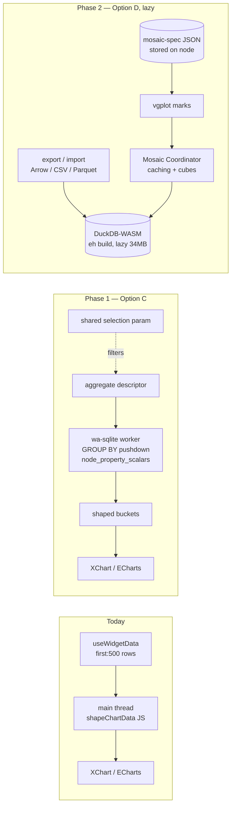
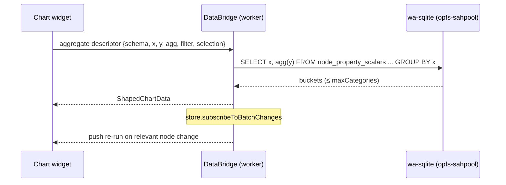

# Integrating With Mosaic Data Visualizations

## Problem Statement

xNet renders charts today with a home-grown ECharts stack
(`@xnetjs/charts` + `@xnetjs/dashboard`). It works, but it has a hard
ceiling baked into its data path: chart widgets load at most ~500 node
rows into the main thread and aggregate them **client-side in JS**
(`shapeChartData()`), with no cross-chart filtering. As workspaces
accumulate metrics, ledger entries, CRM rows, and imported datasets,
that path silently truncates and cannot support "brush one chart,
filter the others" analytics.

[Mosaic](https://idl.uw.edu/mosaic/) (UW Interactive Data Lab, the
Vega/Vega-Lite lineage) is the current state of the art for exactly
this: a `Coordinator` pushes visualization queries **into a database**
(canonically DuckDB-WASM), links charts through shared `Selection`
predicates, and auto-materializes pre-aggregated cubes so crossfilter
interactions over millions of rows resolve in ~1–10 ms. Its plotting
grammar (vgplot) is built on Observable Plot.

Should xNet integrate Mosaic — and if so, as a library, an engine, or
an architecture to borrow from?

## Executive Summary

- **Mosaic the architecture is a strong fit; Mosaic the dependency is a
  conditional fit.** Mosaic's connector interface is genuinely
  pluggable (`query({type: 'json'|'arrow'|'exec', sql})` — JSON is
  first-class, Arrow optional), but the SQL it generates is
  **unconditionally DuckDB dialect**: only one `SQLCodeGenerator`
  implementation exists (`duckDBCodeGenerator`), hardcoded through
  vgplot's transforms (`::TYPE` casts, `TABLESAMPLE … REPEATABLE`,
  `QUALIFY`, `PIVOT`, list literals, spatial functions). Backing Mosaic
  with our existing wa-sqlite engine is a research spike with **no
  known prior art**, not a drop-in.
- **DuckDB-WASM as a second engine is heavy but containable.** The
  wasm binary is 34–39 MB raw (≈10–20 MB compressed) versus our whole
  6 MB workbox precache cap — it must be lazy-loaded and
  precache-excluded, exactly like the existing `@swc/wasm-web` /
  `quickjs-emscripten` lab runtimes. Production is deliberately **not
  cross-origin isolated** (opfs-sahpool doesn't need COOP/COEP), so we
  would run DuckDB's single-threaded `eh` build. The tempting shortcut
  — point DuckDB-WASM at our SQLite file via `sqlite_scanner` — is
  **currently broken in WASM** (duckdb-wasm issue #1972, open).
- **Most xNet datasets don't need DuckDB.** Node data lives in
  `node_property_scalars`, a typed scalar index that wa-sqlite already
  queries with pushdown. Workspace-scale data is thousands to low
  hundreds-of-thousands of rows — SQLite territory, not
  billion-row-flight-data territory.
- **Recommendation: steal the architecture first, adopt the engine
  behind a demand gate.**
  - **Phase 1 (do now):** Mosaic-*style* SQL push-down on our own
    engine — compile `ChartSpec` aggregations into grouped queries the
    existing query compiler executes in the worker, removing the
    500-row cap and main-thread shaping; add a linked
    `Selection`-style dashboard filter param. No new dependencies.
  - **Phase 2 (demand-gated):** real Mosaic + DuckDB-WASM as a
    lazy-loaded **Analytics surface** for file-backed data (imported
    CSV/Parquet, exported node snapshots), registered through the
    existing `chartTypeRegistry` / dashboard-widget / `ViewType`
    seams. Trigger: a user dataset that materially exceeds SQLite
    interactive latency, or the import-parquet feature landing.
  - **Not recommended:** rewriting vgplot's codegen for SQLite
    dialect, or replacing ECharts wholesale.

## Current State In The Repository

### The charting stack (0162 / 0205)

- `packages/charts/src/spec.ts` — library-agnostic `ChartSpec`
  (`{ kind, x, y, series, aggregate, maxCategories }`).
  `shapeChartData()` groups and aggregates **plain JS rows on the main
  thread**. The header comment already anticipates swapping engines:
  "Keeping the spec layer library-agnostic means ECharts can be
  swapped or supplemented."
- `packages/charts/src/registry.ts` — `chartTypeRegistry`, an **open
  kind registry**: plugins contribute `{ kind, name, icon,
  buildOption }` and `resolveChartOption()` dispatches. This is the
  natural insertion seam for a Mosaic-backed kind.
- `packages/charts/src/XChart.tsx` — React wrapper over
  `echarts.init` (selective imports, ~100 KB gz), jsdom fallback.
- `apps/web/src/plugins/charts-extra-plugin.ts` — precedent for
  contributing chart kinds without bundle growth.

### The dashboard runtime

- `packages/dashboard/src/widgets/chart-widget.tsx` — `chart.bar/…`
  widgets; stub config queries **`first: 500`** rows and hands them to
  `XChart`. This cap plus client-side aggregation is the scalability
  ceiling.
- `packages/dashboard/src/runtime/useWidgetData.ts` — descriptor-based
  reactive data (`useSavedView`, refresh `'live' | 'on-open' |
  {intervalMs}`), variable interpolation. Any Mosaic-ish integration
  should slot behind this, not beside it.
- `packages/dashboard/src/registry.ts` — `WidgetRegistry` with trust
  tiers and an SES/iframe sandbox for user widgets.

### Views

- `packages/data/src/database/view-types.ts` — `ViewType = 'table' |
  'board' | 'list' | 'gallery' | 'calendar' | 'timeline' | 'form'`.
  There is **no `'chart'` view** yet.
- `packages/views/src/registry.ts` + `builtins.ts` +
  `ViewRenderer.tsx` — open view registry; the `'form'` view (0278)
  is the model to copy for a `'chart'` view.
- Caveat: `apps/web/src/components/DatabaseView.tsx` bypasses the
  generic `ViewRenderer` (renders `GridSurface` via
  `useGridDatabase`, `addViewTypes` currently `[table, form]`), so a
  chart view needs wiring in both places.

### The data layer Mosaic would sit on

- `packages/sqlite/src/adapters/web.ts` — official
  `@sqlite.org/sqlite-wasm`, **opfs-sahpool** VFS in a worker with a
  leader/reader-pool architecture (0263). `SQLiteAdapter` exposes
  async `query/queryOne/run/exec/queryBatch/transaction`
  (`packages/sqlite/src/adapter.ts`).
- `packages/sqlite/src/schema.ts` — `nodes` +
  `node_properties` (EAV, LWW, CRDT-encoded BLOB values) +
  **`node_property_scalars`** (rebuildable typed scalar index:
  `value_text/value_number/value_boolean` keyed by
  `(schema_id, property_key, node_id)`). The scalar index is the
  analytics-friendly table — no CRDT decoding needed.
- `packages/data/src/store/query.ts` / `query-compiler.ts` /
  `sqlite-adapter.ts` — the query AST already compiles filters to SQL
  with storage pushdown; `node_query_materializations` is existing
  precedent for materialized aggregates.
- Live invalidation is push-based: `store.subscribe` /
  `subscribeToBatchChanges` (`packages/data/src/store/store.ts`) →
  DataBridge → `useSyncExternalStore` (`packages/react/src/hooks/useQuery.ts`).
- **There is no raw-SQL console to piggyback on**: the devtools Data
  tab is a structured `store.query` browser and `SQLitePanel` runs
  only a fixed `PRAGMA database_list`. A "run arbitrary SELECT"
  path is net-new surface with its own authz questions (cf. 0274's
  decision to forbid raw SQL writes).

### Platform constraints

- **CSP** (`apps/web/index.html`): `'unsafe-eval'` already present
  (covers wasm), `worker-src 'self' blob:` OK; DuckDB bundles must be
  **self-hosted** (no CDN fetch without a `connect-src` addition).
- **COOP/COEP**: dev-only by design
  (`apps/web/vite-plugins/coop-coep-headers.ts`) — production static
  hosting is not cross-origin isolated because opfs-sahpool doesn't
  need it. DuckDB-WASM's threaded (`coi`) build therefore won't
  activate in prod; `selectBundle()` falls back to single-threaded
  `eh`. Turning COOP/COEP on in prod would break the CSP-allowed
  cross-origin embeds (YouTube/Figma/… `frame-src`) under
  `require-corp`.
- **PWA cap**: `workbox.maximumFileSizeToCacheInBytes = 6 MB`, `.wasm`
  deliberately excluded from precache, `manualChunks` keeps chunks
  under the cap (`apps/web/vite.config.ts`). Precedent for huge lazy
  wasm: `@swc/wasm-web` (~15 MB), `quickjs-emscripten` (~6.6 MB).
- **Seed data for demos**: `packages/devtools/src/seed/seeders/{metrics,viz,accounting,work}.ts`
  and `seed/builders/dashboard-builder.ts` already emit
  metric/observation time series and dashboards — a chart-view or
  Mosaic demo reuses these.

## External Research

All facts verified against primary sources (repo trees, npm tarballs,
source files) as of 2026-07-13.

### Mosaic architecture

A central **`Coordinator`** proxies all data access. **`Client`s**
(charts, tables, inputs) register via `coordinator.connect(client)`;
the coordinator inspects `client.fields()`, issues SQL, and delivers
results through `client.queryResult()`. **`Param`** is a reactive
scalar; **`Selection`** composes boolean predicate clauses with
resolution strategies (`single`/`union`/`intersect`/`crossfilter`) and
is what links interactions across charts. The coordinator adds query
caching, consolidation (batching), prefetching, and — the headline
optimization — **automatic pre-aggregated materialization**
(FilterGroups / data-cube indexes): when several clients crossfilter
the same table, brushing touches a small pre-computed aggregate
instead of rescanning base rows. Claimed interactive latencies:
~1–10 ms typical over millions–billions of rows (TVCG 2024 paper;
follow-up optimizer paper arXiv:2507.19690).

**vgplot** is not a Plot clone — `@uwdata/mosaic-plot` literally
depends on `@observablehq/plot@^0.6` and d3, replacing Plot's data
loading/transform layer with SQL push-down.

Packages (v0.28.1, June 2026; monthly release cadence, actively
maintained; BSD-3-Clause): `@uwdata/mosaic-core` (coordinator,
connectors), `@uwdata/mosaic-sql` (SQL AST + codegen),
`@uwdata/vgplot` (umbrella), `@uwdata/mosaic-plot`,
`@uwdata/mosaic-inputs`, `@uwdata/mosaic-spec` (JSON/YAML spec →
`astToDOM`/`astToESM`), plus standalone `duckdb-server`
implementations (Python/Rust/Go). Arrow decoding uses
`@uwdata/flechette` (lightweight, not full `apache-arrow`). Note:
`mosaic-core` lists `@duckdb/duckdb-wasm` as a **hard dependency** —
tree-shakeability of the unused wasm connector needs verifying in our
bundler.

### The connector seam — and the dialect catch

```ts
// packages/mosaic/core/src/connectors/Connector.ts (fetched from source)
export interface Connector {
  query(query: ArrowQueryRequest): Promise<Table>            // type: 'arrow'
  query(query: ExecQueryRequest): Promise<void>              // type: 'exec'
  query(query: JSONQueryRequest): Promise<Record<string, unknown>[]> // 'json'
}
// request = { type?: 'arrow'|'json'|'exec', sql: string }
```

Custom connectors are supported
(`coordinator.databaseConnector(mine)`) and **JSON results are
first-class** — no Arrow required. But the SQL *text* Mosaic emits is
DuckDB dialect, unconditionally: `mosaic-sql` has an abstract
`SQLCodeGenerator` with exactly **one** implementation
(`duckDBCodeGenerator`), imported by name inside vgplot transforms
(e.g. `bin.js`). DuckDB-isms include `(x)::TYPE` casts,
`TABLESAMPLE (n ROWS) REPEATABLE(seed)`, `QUALIFY`, `PIVOT … USING`,
list literals `[a,b,c]`, named-arg `UNNEST`, `COLUMNS()` expansion,
and `st_*` spatial functions. (SQLite ≥3.30 does handle `FILTER
(WHERE …)` on aggregates and `CREATE TEMP TABLE … AS`, so simple
grouped aggregates are dialect-compatible.) **No prior art exists of a
non-DuckDB Mosaic backend** — a SQLite code generator is an
unmodeled extension point today.

### DuckDB-WASM realities

- **Size** (measured from the `@duckdb/duckdb-wasm@1.29.0` tarball):
  `duckdb-eh.wasm` 34 MB raw + ~750 KB worker JS (≈10–20 MB
  compressed on the wire — measure our own build before quoting).
  Compare: our whole precache budget is 6 MB/file.
- **Threading**: `coi` (pthreads) build needs COOP/COEP →
  unavailable in our prod; `selectBundle()` silently falls back to
  single-threaded `eh`. Single-threaded DuckDB-WASM still vastly
  outperforms JS-side aggregation.
- **Persistence**: `opfs://` paths now work (Chrome/Edge full,
  Firefox/Safari fall back to memory-only) — browser-uneven; pin the
  exact version and verify (npm `latest` is currently a
  `1.33.1-dev57` prerelease).
- **`sqlite_scanner` is broken in WASM**
  ([duckdb-wasm#1972](https://github.com/duckdb/duckdb-wasm/issues/1972),
  open): the extension loads but fails at query time and can corrupt
  the connection. **Do not plan on ATTACH-ing our OPFS SQLite database
  from DuckDB-WASM.** Ingestion instead goes through
  `registerFileBuffer` + `insertArrowTable` / `insertCSVFromPath` /
  `read_parquet`.

### React integration

No official React wrapper. Maintainer guidance
([discussion #482](https://github.com/uwdata/mosaic/discussions/482)):
instantiate your own `Coordinator` (don't use the singleton), wrap
`plot()`'s imperative DOM element in `ref` + `useEffect`. Best
third-party reference: `@sqlrooms/mosaic` (SQLRooms) with
`useMosaicClient()` and a `VgPlotChart` component. `mosaic-spec`'s
JSON specs + `astToDOM` fit a "spec stored as node content, hydrated
at render" pattern cleanly, though no production example was found.

### Alternatives compared

| Option | Engine | Fit for xNet |
| --- | --- | --- |
| Observable Plot alone | JS arrays | Fine ≤ tens of k rows; no cross-filter optimizer; small dep |
| **Mosaic + DuckDB-WASM** | DuckDB | Best-in-class scale + linked selections; 34 MB wasm, second DB, DuckDB-only dialect |
| Mosaic + custom wa-sqlite connector | our SQLite | Transport trivial, **dialect blocked**; research spike, no prior art |
| Perspective (FINOS) | own WASM engine | Batteries-included pivot/grid widget; not a grammar; another wasm engine |
| dc.js / crossfilter | JS arrays | Legacy; tens-of-k ceiling |
| Vega-Lite + VegaPlus | DuckDB | Same push-down idea, less maintained than Mosaic |
| Evidence / Rill | DuckDB | BI site generators, not embeddable libraries |
| Malloy | compiles to SQL | Semantic layer, different slot entirely |

Licensing is clean throughout: Mosaic BSD-3-Clause, DuckDB-WASM MIT,
Observable Plot ISC.

## Key Findings

1. **The bottleneck Mosaic solves — client-side aggregation over a
   capped row fetch — is real in xNet today**, at
   `chart-widget.tsx` (`first: 500`) + `spec.ts:shapeChartData()`.
   But the *fix* at workspace scale doesn't require DuckDB: our query
   compiler already pushes filters into wa-sqlite; it just doesn't
   push **aggregations**.
2. **Mosaic ≠ DuckDB at the interface, but = DuckDB at the dialect.**
   The connector API would happily call our `SQLiteAdapter.query()`
   and return JSON; the generated SQL wouldn't parse. A SQLite
   `SQLCodeGenerator` is possible but unowned, unmodeled upstream,
   and would still miss DuckDB-only functions vgplot leans on
   (binning helpers, sampling, spatial).
3. **DuckDB-WASM cannot read our database in place** (`sqlite_scanner`
   broken in WASM), so any Mosaic-proper integration is an
   **export/ingest** architecture: snapshot `node_property_scalars`
   (or an imported file) into DuckDB, not live-attach. That makes it
   naturally suited to *analytical* (read-only, point-in-time or
   subscription-refreshed) surfaces, and unsuited to being the
   primary live chart path for small collections.
4. **Every insertion seam already exists**: `chartTypeRegistry` kind
   → dashboard widget → `'chart'` `ViewType` → standalone node type
   (the `DashboardSchema` → `DashboardView` → widgets chain is the
   template). No new registry machinery is needed.
5. **Platform constraints force specific choices**: single-threaded
   `eh` build (no prod COOP/COEP), self-hosted lazy-loaded wasm
   outside the PWA precache (6 MB cap), Chrome-only OPFS persistence
   treated as a cache not a source of truth.
6. **Live reactivity composes**: `store.subscribeToBatchChanges` →
   re-run pushed-down aggregate queries (Phase 1) or re-ingest
   deltas into DuckDB (Phase 2) is push-based and already
   off-main-thread via DataBridge.

## Options And Tradeoffs

### Option A — Adopt Mosaic wholesale with DuckDB-WASM as the chart engine

vgplot renders all charts; DuckDB-WASM becomes the analytics store,
fed by export from `node_property_scalars`.

- ✅ Best interaction scale-out; linked selections free; spec format
  (`mosaic-spec`) is storable content.
- ❌ 34 MB second database for workspaces whose biggest table is 5k
  tasks; duplicate-store consistency problem; ECharts stack (pie
  charts, themes, existing widgets) still needed → two chart systems;
  `mosaic-core`'s hard dep on duckdb-wasm complicates bundling.

### Option B — Mosaic on our wa-sqlite via a custom connector

Implement `Connector` over `SQLiteAdapter`, write a
`SQLiteCodeGenerator`.

- ✅ One database; no wasm download; Mosaic's coordinator/selection
  logic reused.
- ❌ The dialect problem is ours forever: fork-grade maintenance
  against a monthly-release upstream that hardcodes
  `duckDBCodeGenerator` in transforms; vgplot features (binning,
  sampling, spatial) missing SQLite equivalents; **zero prior art**.
  High risk, unbounded scope.

### Option C — Steal the architecture: push-down + selections on the existing stack

No new dependencies. Teach the existing query layer to compile
`ChartSpec` into grouped aggregate SQL executed in the worker
(`SELECT x, series, agg(y) … GROUP BY 1,2`) against
`node_property_scalars`; return shaped buckets (≤ `maxCategories`)
instead of raw rows. Add a Mosaic-`Selection`-style shared filter
param to the dashboard variable system so widgets can crossfilter.

- ✅ Removes the 500-row cap and main-thread shaping for **all**
  existing chart widgets at once; zero bundle cost; works offline,
  all browsers; aligns with existing materialization
  (`node_query_materializations`) and batching (0263) machinery.
- ❌ No pre-aggregated cube optimizer (fine at SQLite scale); ECharts
  remains the renderer (no Plot grammar); crossfilter latency bounded
  by wa-sqlite (adequate to ~10⁵–10⁶ scalar rows with indexes).

### Option D — Demand-gated Mosaic Analytics surface (DuckDB lazy island)

Keep C as the default path; additionally ship a **lazy-loaded**
`mosaic.explore` dashboard widget / `analytics` surface for
*file-backed* data: imported CSV/Parquet, large exported node
snapshots. DuckDB-WASM (`eh` build, self-hosted) loads on first use,
like the SWC/QuickJS lab runtimes; specs stored as node content via
`mosaic-spec` JSON; data ingested via `registerFileBuffer` /
`insertArrowTable`.

- ✅ Real Mosaic where it earns its weight; zero cost for users who
  never open it; clean trust-tier + registry story; spec-as-content
  fits the document model.
- ❌ Two chart systems visible to power users; export/ingest snapshot
  semantics (staleness must be explicit in the UI); ~10–20 MB
  first-open download.



## Recommendation

**Phase 1 now (Option C), Phase 2 behind a dated demand gate
(Option D), never Option B.**

Phase 1 is a straight capability fix with no dependency cost and
benefits every existing chart tile. Phase 2 adopts Mosaic where its
design actually pays — large, columnar, file-shaped data — using the
same demand-gating discipline as 0237 (framework tiers) and 0301
(hub-as-PDS). Trigger for Phase 2: a real workspace dataset where the
Phase-1 pushdown path exceeds ~250 ms p95 per interaction, **or** a
CSV/Parquet import feature landing. Revisit the
custom-connector question (Option B) only if upstream ships a second
`SQLCodeGenerator` — watch `uwdata/mosaic` for dialect pluralization.



## Example Code

Phase 1 — aggregate descriptor replaces row-fetch + JS shaping
(sketch; real work is in the query compiler):

```ts
// packages/data/src/store/aggregate-query.ts (new)
export interface AggregateDescriptor {
  schemaId: string
  x: string                 // property key → value_text bucket
  y?: string                // property key → value_number
  series?: string
  aggregate: 'count' | 'sum' | 'avg' | 'min' | 'max'
  filter?: QueryFilter      // reuses existing AST
  maxCategories?: number    // LIMIT via top-N subquery
}
// compiles to one grouped self-join over node_property_scalars,
// executed by SQLiteAdapter.query() in the worker; returns
// ShapedChartData directly (same shape XChart consumes today).
```

Phase 2 — Mosaic client wrapper, following mosaic discussion #482
(own coordinator, ref + effect):

```tsx
// packages/charts/src/mosaic/MosaicPlot.tsx (new, lazy chunk)
import { Coordinator, wasmConnector } from '@uwdata/mosaic-core'
import { parseSpec, astToDOM } from '@uwdata/mosaic-spec'

let coordinator: Coordinator | undefined
async function getCoordinator() {
  if (!coordinator) {
    coordinator = new Coordinator()
    // self-hosted eh bundle; prod is not crossOriginIsolated
    coordinator.databaseConnector(await wasmConnector())
  }
  return coordinator
}

export function MosaicPlot({ spec }: { spec: object }) {
  const ref = useRef<HTMLDivElement>(null)
  useEffect(() => {
    let disposed = false
    void (async () => {
      const coord = await getCoordinator()
      const { element } = await astToDOM(parseSpec(spec), { coordinator: coord })
      if (!disposed) ref.current?.replaceChildren(element)
    })()
    return () => { disposed = true }
  }, [spec])
  return <div ref={ref} className="h-full w-full" />
}
```

Registration reuses existing seams — a `mosaic.explore` widget beside
`chart-widget.tsx`, and later `viewRegistry.register({ type: 'chart',
… })` in `packages/views/src/builtins.ts` following the `'form'` (0278)
pattern.

## Risks And Open Questions

- **Aggregate pushdown vs. formula/rollup columns** — formula and
  rollup values are computed client-side
  (`packages/data/src/database/rollup-engine.ts`, `formula/`) and are
  not in `node_property_scalars`; Phase-1 charts over computed columns
  either keep the JS path or need materialized computed scalars
  (extend `node_query_materializations`). Scope Phase 1 to stored
  properties first.
- **Selection semantics vs. dashboard variables** — the variables bar
  (`packages/dashboard/src/variables.ts`) is close to Mosaic `Param`;
  crossfilter needs per-widget *exclusion* (each chart filtered by
  everyone else's selection but its own) — design before wiring.
- **`mosaic-core`'s hard dependency on `@duckdb/duckdb-wasm`** — if it
  defeats tree-shaking in our Vite build, Phase 2 must isolate all
  Mosaic imports in the lazy chunk (verify with a bundle analysis
  before committing to the widget).
- **Snapshot staleness in Phase 2** — export/ingest means DuckDB data
  is point-in-time; the Analytics surface must show "as of" and offer
  refresh. Delta re-ingest on `store.subscribe` is an optimization,
  not a baseline.
- **DuckDB-WASM version pinning** — npm `latest` is a dev prerelease;
  pin a stable (`1.29.x` era) and verify OPFS behavior per browser;
  treat DuckDB's OPFS as evictable cache (Chrome-only persistence).
- **Electron parity** — Electron could use native DuckDB via Node
  instead of WASM; deferred, but keep the connector behind an
  interface so the swap stays possible (cf. 0238 parity guard).
- **Authz surface** — an "arbitrary SQL over your workspace" analytics
  panel must stay read-only and workspace-scoped; 0274 forbade raw
  SQL writes and 0307 flagged a latent-SQLi query handler — the
  DuckDB island only ever receives *exported* data, which is the
  safer shape; keep it that way.

## Implementation Checklist

Phase 1 — push-down + selections (no new deps):

- [ ] Add `AggregateDescriptor` + compiler in `packages/data`
      (grouped query over `node_property_scalars`, top-N category
      limit, series split).
- [ ] Wire it through DataBridge with live invalidation via
      `subscribeToBatchChanges` (filter by schema/property keys).
- [ ] Add a `useAggregateQuery` hook in `packages/react` (sub-barrel
      per 0276) and switch `chart-widget.tsx` +
      `saved-view-widget.tsx` counts to it; delete the `first: 500`
      stub cap for chart widgets.
- [ ] Keep `shapeChartData()` as fallback for ad-hoc row props
      (`XChart` API unchanged).
- [ ] Add a shared selection param to dashboard variables
      (`packages/dashboard/src/variables.ts`) with
      per-widget-exclusion crossfilter semantics; bar/pie click +
      brush publishes to it.
- [ ] Benchmarks: seed 100k observations (`seeders/metrics.ts`) and
      assert p95 aggregate query latency in the reliability lane
      (0272).
- [ ] Changesets for `@xnetjs/data` / `@xnetjs/react` (minor);
      `@xnetjs/charts` and `@xnetjs/dashboard` are private.

Phase 2 — demand-gated Mosaic island (open only when triggered):

- [ ] Bundle spike: confirm `@uwdata/mosaic-core`'s duckdb-wasm dep
      isolates into a lazy chunk; self-host `eh` bundle outside PWA
      precache (mirror `@swc/wasm-web` handling in
      `apps/web/vite.config.ts`).
- [ ] `MosaicPlot` wrapper (own `Coordinator`, `astToDOM`) +
      `mosaic.explore` widget (`trustTier: 'first-party'`).
- [ ] Exporter: `node_property_scalars` / imported files → Arrow →
      `insertArrowTable`; "as of" staleness UI + manual refresh.
- [ ] Store `mosaic-spec` JSON as node content (new schema → Tier-2
      seed auto-covers; add Tier-1 seeder only if demoing).
- [ ] `'chart'` `ViewType` in `view-types.ts` + `builtins.ts`
      registration + `DatabaseView.tsx` `addViewTypes` wiring (can
      ship in Phase 1 using the ECharts renderer).

## Validation Checklist

- [ ] Chart over a 50k-row seeded metrics dataset renders correct
      aggregates with no `first: 500` truncation (compare SQL result
      to a JS reference aggregation in a unit test).
- [ ] Main-thread flame: no aggregation work on the UI thread during
      chart refresh (devtools perf panel, 0275 log store clean).
- [ ] Crossfilter: brushing one widget updates siblings, excluding
      itself; p95 interaction < 250 ms at 100k rows.
- [ ] Live update: editing a node property re-renders affected charts
      via push (no polling) within one refresh cycle.
- [ ] Phase 2 only: cold `mosaic.explore` open downloads the wasm
      lazily (network panel), PWA precache size unchanged, app works
      fully offline when the widget was never opened.
- [ ] Phase 2 only: same spec renders identically in Chrome and
      Safari (memory-only DuckDB fallback path).

## References

- Mosaic docs: https://idl.uw.edu/mosaic/ (Why Mosaic, Core, Spec)
- Mosaic repo (v0.28.1, 2026-06): https://github.com/uwdata/mosaic —
  `Connector.ts`, `sql/src/visit/codegen/duckdb.ts`,
  `vgplot/plot/src/transforms/bin.js`
- Mosaic TVCG 2024 paper:
  https://idl.cs.washington.edu/files/2024-Mosaic-TVCG.pdf ;
  selections optimizer: https://arxiv.org/abs/2507.19690
- React guidance: https://github.com/uwdata/mosaic/discussions/482 ;
  SQLRooms integration: https://sqlrooms.org/api/mosaic/
- DuckDB-WASM: https://duckdb.org/docs/current/clients/wasm/ ;
  `sqlite_scanner` WASM breakage:
  https://github.com/duckdb/duckdb-wasm/issues/1972 ;
  OPFS discussion: https://github.com/duckdb/duckdb-wasm/discussions/1444
- Perspective: https://github.com/finos/perspective ; VegaPlus:
  https://github.com/vega/vega-plus
- In-repo: 0162 (ChartSpec), 0205 (chart registry), 0263 (worker
  queue/reader pool), 0264 (read speed), 0266 (query-perf endgame),
  0272 (reliability lane), 0274 (Data tab, raw SQL forbidden), 0276
  (barrel policy), 0278 (form view), 0280 (dashboard slots)
