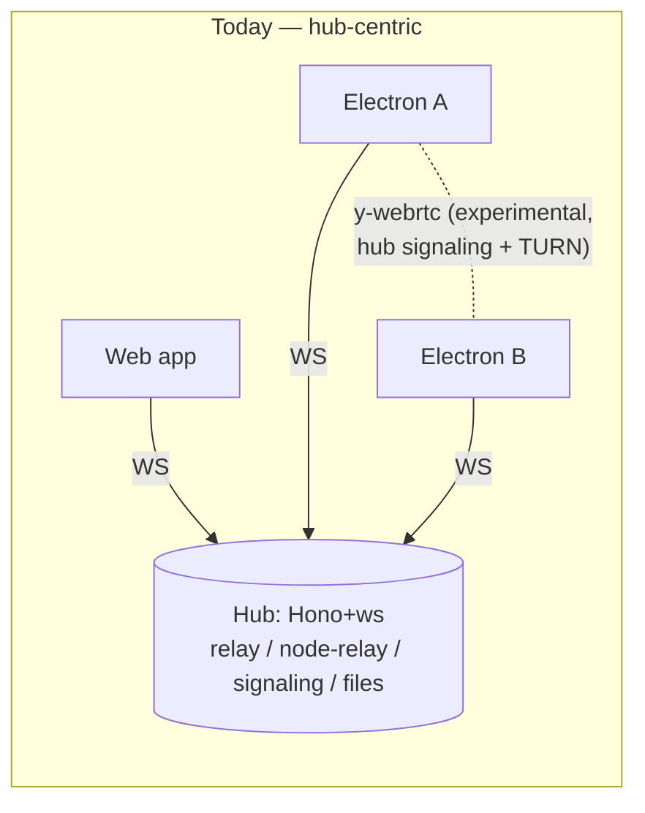
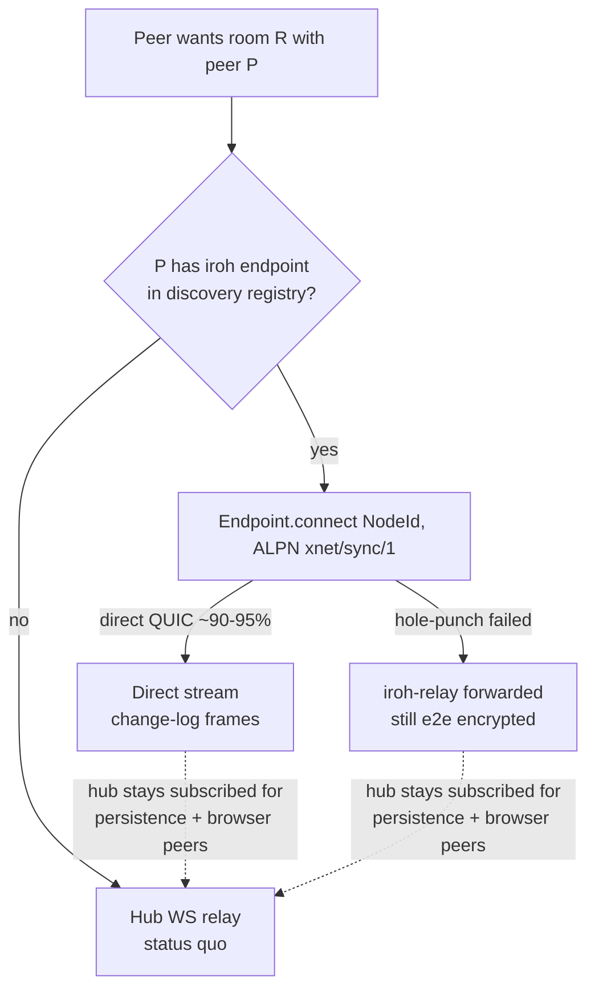
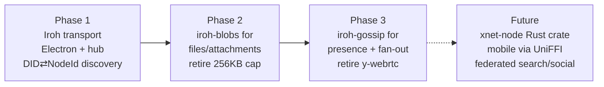
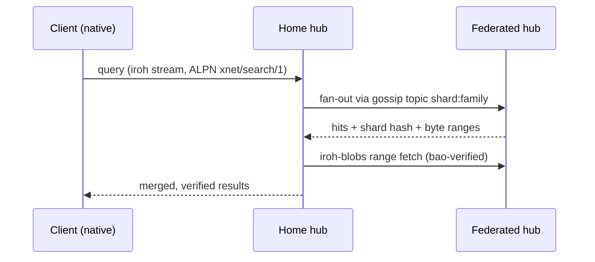

# Iroh Integration — More Real P2P Today, a Substrate for Federated Search & Social Tomorrow

## Problem Statement

xNet's sync is hub-centric: every byte of realtime replication flows through a
WebSocket relay (`packages/hub`). A y-webrtc data-channel path exists but is
experimental, Electron-only, and still depends on the hub for signaling and on
third-party TURN for NAT traversal. Meanwhile the repo carries a *dormant*
libp2p stack (`packages/network/`) that was benched in exploration 0052
because its operational complexity outweighed its benefits.

[iroh](https://iroh.computer) (n0-computer) reached **1.0 in June 2026** with a
stability-committed wire protocol, ~90–95% direct-connection (hole-punch)
success, same-day Node.js bindings, and production deployments (Delta Chat —
the closest architectural cousin to xNet's local-first model). Its primitives
are eerily aligned with xNet's: an iroh `NodeId` **is** an Ed25519 public key
(xNet identity is `did:key` Ed25519); `iroh-blobs` is BLAKE3 content-addressed
transfer (xNet CIDs are `cid:blake3:<hex>`); `iroh-gossip` is topic pub-sub
(xNet sync is room pub-sub).

Questions this exploration answers:

1. Where would iroh plug into the codebase as it exists today, and what does
   it buy us over the hub-WS + y-webrtc status quo?
2. What is realistic per platform (browser vs Electron vs mobile), given that
   browsers cannot do raw UDP/QUIC?
3. How could future *federated* systems — the crawl/search shard fabric and a
   social layer — leverage iroh rather than reinventing transfer, discovery,
   and fan-out?

## Executive Summary

- **Adopt iroh as an additional transport, not a replacement.** The hub stays
  the persistence + browser story; iroh becomes the native-peer story
  (Electron first, mobile later). All three sync seams are already
  injectable interfaces — `ConnectionManager`
  ([connection-manager.ts](../../packages/runtime/src/sync/connection-manager.ts)),
  `HubTransport`
  ([MultiHubSyncManager.ts](../../packages/runtime/src/sync/MultiHubSyncManager.ts)),
  and `SyncProvider` ([provider.ts](../../packages/sync/src/provider.ts), whose
  doc comment already promises transport pluggability).
- **Do not ship iroh to the browser yet.** iroh's WASM story is explicitly
  relay-only alpha (no UDP in the sandbox, no browser npm package). A browser
  running "iroh" today is functionally a WebSocket relay client — which xNet
  already has, hardened. Revisit when n0's Phase 3 (WebTransport/WebRTC
  direct connections) lands.
- **The identity alignment is the strategic prize.** An iroh `NodeId` and an
  xNet DID are both Ed25519 keys. With a signed device-endpoint binding
  (DID ⇄ NodeId), "dial a DID" becomes literal: mention `@alice`, open a QUIC
  stream to her device. No other transport candidate offers this.
- **iroh-blobs is the second wedge.** xNet already computes blake3 CIDs and
  Merkle trees (`packages/core/src/hashing.ts`), but blob sync caps inline
  payloads at 256KB over JSON-base64 WS frames
  (`packages/runtime/src/sync/blob-sync.ts`). iroh-blobs gives verified
  streaming of arbitrarily large content with resumable, range-verifiable
  reads — the correct engine for attachments, avatars, and future media.
- **For federation:** search shards become content-addressed blob collections
  hubs replicate by hash; query fan-out and feed distribution ride
  iroh-gossip topics; hubs remain the store-and-forward + browser gateway.
  This turns "federated xNet" from an HTTPS mesh into a key-addressed swarm
  without changing the portable protocol (the signed hash-chained LWW log in
  `docs/specs/protocol/` is transport-agnostic by design).
- Recommended path: **Option B (native transport ladder) + Option D
  (iroh-blobs)**, staged. Phase 1 is small: an `IrohConnectionManager` in a
  new `packages/network-iroh` using `@number0/iroh` (napi, Node-only — fine
  for Electron utility process and the Node hub), an `'iroh'` endpoint type in
  hub discovery, and a self-hosted `iroh-relay` next to the existing hub.

## Current State In The Repository

### Transport & sync topology today

- **Hub** — [server.ts](../../packages/hub/src/server.ts): Hono HTTP +
  `ws` WebSocketServer on one port. One WS connection multiplexes several
  protocols via [message-router.ts](../../packages/hub/src/ws/message-router.ts):
  - y-webrtc-compatible signaling pub-sub
    ([signaling.ts](../../packages/hub/src/services/signaling.ts));
  - Yjs store-and-forward relay with persistence + late-joiner replay
    ([relay.ts](../../packages/hub/src/services/relay.ts));
  - hash-chained change-log relay with hash/signature/authz verification
    ([node-relay.ts](../../packages/hub/src/services/node-relay.ts));
  - federation, shard routing, crawl, files, keys, DID discovery
    (`packages/hub/src/services/`, `packages/hub/src/routes/`).
- **WebRTC path** —
  [ywebrtc.ts](../../packages/network/src/providers/ywebrtc.ts) wraps
  y-webrtc/simple-peer; wired only in Electron
  ([ipc-sync-manager.ts](../../apps/electron/src/renderer/lib/ipc-sync-manager.ts),
  `transport?: 'ws' | 'webrtc' | 'auto'`). Signaling goes through the hub;
  TURN is Cloudflare. Experimental/opt-in; production sync is hub-WS.
- **Dormant libp2p** — `packages/network/src/node.ts` has a complete
  `createLibp2p` stack (kadDHT, circuit relay, WebRTC transport, custom sync
  protocol) imported by nothing but its own tests. Exploration
  `0052_[_]_LIBP2P_REINTEGRATION.md` documents why it was benched;
  `0027_[x]_LANDSCAPE_ANALYSIS.md` already named iroh "the upgrade path if
  xNet outgrows libp2p/y-webrtc."

### The seams an alternative transport plugs into

1. **`SyncProvider`** ([packages/sync/src/provider.ts](../../packages/sync/src/provider.ts))
   — change-log-level interface, documented as transport-agnostic
   ("WebRTC, WebSocket, etc."). Capability negotiation + high-water-mark
   catch-up live in [negotiation.ts](../../packages/sync/src/negotiation.ts).
2. **`ConnectionManager`** ([packages/runtime/src/sync/connection-manager.ts](../../packages/runtime/src/sync/connection-manager.ts))
   — the multiplexed-room abstraction (`connect/joinRoom/publish/leaveRoom`)
   the whole runtime sync sits on. Today's impl is WS-only;
   `createMultiHubConnectionManager` already fans out to N hubs.
3. **`HubTransport`** ([packages/runtime/src/sync/MultiHubSyncManager.ts](../../packages/runtime/src/sync/MultiHubSyncManager.ts))
   — injected per-hub transport; per-Space routing decided by
   `planReplicationDestinations`
   ([replication-policy.ts](../../packages/sync/src/replication-policy.ts))
   keyed on `xnet://<did>/space/<id>/` namespaces
   ([replication-scope.ts](../../packages/runtime/src/sync/replication-scope.ts)).
4. **Discovery registry** ([discovery.ts](../../packages/hub/src/services/discovery.ts))
   — DID-keyed peer registry whose `ENDPOINT_TYPES` already enumerates
   `websocket | webrtc-signaling | libp2p | http`. Adding `iroh` is one
   union member.

### Primitives already aligned with iroh

| xNet primitive | Where | iroh analogue |
| --- | --- | --- |
| `did:key` Ed25519 identity | [packages/identity/src/did.ts](../../packages/identity/src/did.ts) | `NodeId` = Ed25519 pubkey |
| `cid:blake3:<hex>` content addressing + Merkle trees | [packages/core/src/hashing.ts](../../packages/core/src/hashing.ts), [blob-store.ts](../../packages/storage/src/blob-store.ts) | iroh-blobs (BLAKE3/bao verified streaming) |
| Room pub-sub (`xnet-blob-sync`, doc rooms) | [connection-manager.ts](../../packages/runtime/src/sync/connection-manager.ts), [blob-sync.ts](../../packages/runtime/src/sync/blob-sync.ts) | iroh-gossip topics |
| Signed, hash-chained, transport-agnostic change log | `docs/specs/protocol/`, [packages/sync/src/chain.ts](../../packages/sync/src/chain.ts) | rides any iroh ALPN stream unchanged |
| Rust portable kernel + FFI | [rust/xnet-core/src/ffi.rs](../../rust/xnet-core/src/ffi.rs) | natural home for a native iroh node (UniFFI, like iroh's own bindings) |

### Platform constraints

- **Web (`apps/web`)** — browser sandbox: WebSocket + WebRTC only, no
  UDP/QUIC. Hard constraint.
- **Electron (`apps/electron`)** — Node in main/utility process; sync already
  runs in a utility process. Full UDP. `@number0/iroh` (napi) works here.
- **Expo / Capacitor mobile** — native runtimes; iroh ships stable
  Swift/Kotlin UniFFI bindings as of 1.0. Nothing wired today.
- **Hub (`packages/hub`)** — Node server: `@number0/iroh` works here too, so
  the hub itself can hold an iroh endpoint without any Rust build step.



## External Research

State of iroh, mid-2026 (verified via n0's docs/blog and crates.io):

- **Core**: iroh **1.0 shipped 2026-06-15** (1.0.2 current); wire-protocol
  stability commitment + stable bindings (Rust, Python, Node.js, Swift,
  Kotlin). MIT/Apache-2.0 dual license, MSRV 1.91. Dial-by-Ed25519-key over
  QUIC; direct connection (hole-punch) succeeds ~90–95% of the time, relay
  fallback otherwise; relays are **stateless** packet forwarders (cheap,
  unlike TURN). n0 reports 200M+ endpoints created in 30 days.
- **Protocol crates**: `iroh-blobs` 0.103 and `iroh-gossip` 0.101 are the
  production pair (Delta Chat, Rave at 1M+ concurrent connections/relay,
  Paycode). `iroh-docs` is maintained-but-secondary. **`iroh-willow` is
  stalled at 0.0.1 since Feb 2025** — Willow/Meadowcap reference work moved to
  `earthstar-project/willow-rs`; do not build on it in 2026.
- **Browser/WASM**: compiles via wasm-bindgen but is **relay-only alpha** —
  no UDP from the sandbox, so no hole-punching; all browser traffic rides
  WebSocket-to-relay (still e2e-encrypted). No browser-targeted npm package.
  n0's roadmap Phase 3 (WebTransport with `serverCertificateHashes`, or
  WebRTC, for *direct* browser connections) is exploratory with no date.
- **Node.js bindings**: `@number0/iroh` 1.0.0 (napi-rs), published same day
  as core 1.0 — actively tracked. Full native iroh incl. hole-punching;
  explicitly "not intended for browsers."
- **Discovery**: default is signed Pkarr packets via DNS (`dns.iroh.link`,
  self-hostable; there's even a Cloudflare Worker implementation); opt-in
  BitTorrent Mainline DHT publishing (fully decentralized); mDNS for LAN.
- **Relay ops**: four free n0 public relays (rate-limited, dev-grade);
  `iroh-relay` is open source with allowlist/token auth, released alongside
  core; managed "Iroh Services" from $19/mo (+$0.27/relay/hr, per-endpoint
  overages — a 400-concurrent-endpoint config prices ≈ $218/mo). Cost scales
  with concurrent endpoints, not bandwidth.
- **vs libp2p**: iroh optimizes connection success and API minimalism
  (~95% vs ~70% hole-punch per n0's comparison), accepting mild default
  centralization (n0 relays/DNS — both self-hostable). The iroh founders are
  ex-libp2p contributors; iroh deliberately dropped multistream negotiation
  for QUIC-only. This is precisely the trade 0052 concluded xNet wanted.
- **vs WebRTC**: comparable direct-connection rates natively, far smaller API
  surface, stateless (cheap) relays vs stateful TURN. WebRTC keeps the edge
  *inside browsers* — the one place iroh can't hole-punch today.

## Key Findings

1. **Every seam needed already exists.** `ConnectionManager`, `HubTransport`,
   `SyncProvider`, and the discovery `ENDPOINT_TYPES` union were all built
   injectable. An iroh transport is additive — no protocol change, no schema
   change, no spec change (`docs/specs/protocol/03-replication.md` messages
   are byte payloads that ride any stream).
2. **DID ⇄ NodeId is a first-class strategic fit, with one caveat.** Both are
   Ed25519 keys, so xNet can *bind* them 1:1 — but the identity signing key
   should **not** be reused as the QUIC/TLS endpoint key (cross-protocol key
   reuse). Instead: generate a per-device endpoint key and publish a
   DID-signed binding (`did → [nodeId…]`) through the existing DID-keyed
   discovery registry ([discovery.ts](../../packages/hub/src/services/discovery.ts)).
   That preserves "dial a DID" semantics with clean key hygiene, and mirrors
   how the registry already maps DIDs to typed endpoints.
3. **The browser story is the hub story.** Browsers can't benefit from iroh's
   core value (direct connections) until n0 ships Phase 3. xNet's hub-WS
   path *is* what iroh-in-browser degenerates to — so keep it, and let native
   peers upgrade themselves to direct QUIC. The transport ladder becomes
   `iroh-direct → iroh-relay → hub-WS`, decided per peer pair.
4. **y-webrtc becomes legacy, not load-bearing.** Once native peers have
   iroh, the experimental WebRTC path serves only browser↔browser direct
   sync — which hub relay already covers. Plan to retire it rather than
   maintain three transports (0052's lesson: dormant transports rot).
5. **blob-sync is the weakest link iroh-blobs directly fixes.** 256KB inline
   cap, base64-over-JSON framing, no resumability, no verified partial
   reads ([blob-sync.ts](../../packages/runtime/src/sync/blob-sync.ts)).
   iroh-blobs gives verified streaming with range reads off the same BLAKE3
   hash function xNet already uses. (Caveat: xNet's `cid:blake3:` is the
   plain blake3 root of the content; iroh-blobs uses the standard BLAKE3 root
   too, so hashes should map 1:1 — but xNet's own `buildMerkleTree` chunking
   layout is not bao and would be superseded, not bridged.)
6. **Willow/Meadowcap is not a 2026 dependency.** The capability model most
   relevant to federated social is stalled at n0. xNet's own UCAN + Space
   authz (exploration 0304, `docs/specs/protocol/04-authorization.md`) stays
   the authorization layer; iroh stays transport.
7. **Rust kernel is the long-run home; napi is the short-run one.**
   `rust/xnet-core` is a pure protocol kernel today. Eventually an
   `xnet-node` crate (kernel + iroh + UniFFI) serves Electron, iOS, and
   Android from one implementation — but `@number0/iroh` from npm gets
   Electron and the hub live with zero Rust build infrastructure.

## Options And Tradeoffs

### Option A — Status quo / revive libp2p (`packages/network/`)

Revive the dormant kadDHT + circuit-relay stack.

- ✅ Code exists; DHT is fully decentralized.
- ❌ 0052 already litigated this: config surface, ~70% hole-punch rate,
  transport-negotiation overhead. iroh was built by ex-libp2p people to
  escape exactly this. Reviving it re-buys the problem.

### Option B — Iroh as native transport ladder (Electron + hub first) ⭐

New `packages/network-iroh` exposing an `IrohConnectionManager`
(implements `ConnectionManager`) and an ALPN'd change-log stream protocol.
Hub gains an iroh endpoint (same Node process via `@number0/iroh`) so native
clients can reach the hub over QUIC too; browsers keep WS. Discovery registry
gains `'iroh'` endpoint type + DID→NodeId bindings. Self-host one
`iroh-relay` beside the hub.

- ✅ Direct peer↔peer sync for the platforms that can use it; hub load drops
  to persistence + browser gateway; smallest protocol-risk footprint (byte
  payloads unchanged, signatures/authz verified exactly as today by
  [node-relay.ts](../../packages/hub/src/services/node-relay.ts) logic reused
  peer-side).
- ✅ Incremental: `transport: 'auto'` in Electron settings already exists as a
  concept (`'ws' | 'webrtc' | 'auto'`).
- ❌ New native dependency in Electron packaging (napi prebuilds); relay ops
  (self-hosted `iroh-relay`) join the fleet; two live transports to soak-test.

### Option C — All-in iroh, including browser WASM

- ❌ Browser iroh is relay-only alpha with no npm package: strictly worse
  than the hardened hub-WS path it would replace. Rejected until n0 Phase 3.

### Option D — iroh-blobs first (content transfer wedge) ⭐ (paired with B)

Keep sync on WS; adopt iroh-blobs for attachments/large files between native
peers and hub, replacing the 256KB inline blob-sync for big content.

- ✅ Highest pain-per-effort ratio; hash function already matches; hub
  `files.ts` service becomes a blobs provider.
- ❌ Alone, it doesn't touch realtime sync; needs B's endpoint plumbing
  anyway (same `Endpoint`, different ALPN), which is why it pairs rather
  than stands alone.

### Option E — Rust-first `xnet-node` (kernel + iroh + UniFFI everywhere)

- ✅ One implementation for Electron/iOS/Android; matches iroh's own binding
  strategy; `rust/xnet-core` + `ffi.rs` already point this way.
- ❌ Big build-infra bite (napi or UniFFI plumbing into Electron, mobile CI)
  before any user-visible win. Right *end state*, wrong *first step*.



## Recommendation

**Option B + D, in three phases, with E as the stated end state.**



### Phase 1 — transport (new `packages/network-iroh`)

`IrohConnectionManager` implementing the existing `ConnectionManager`
interface over `@number0/iroh`; rooms map to per-room QUIC streams (Phase 1)
and later gossip topics (Phase 3). Hub hosts an endpoint in-process and
registers it; clients publish DID-signed NodeId bindings to the discovery
registry. Electron `transport: 'auto'` prefers iroh when both sides advertise
it. Self-hosted `iroh-relay` deployed beside the hub (n0's free relays for dev
only).

### Phase 2 — content (iroh-blobs)

Blob transfer between native peers/hub moves to iroh-blobs (`ALPN
iroh-bytes`); `BlobStore` ([blob-store.ts](../../packages/storage/src/blob-store.ts))
gains an iroh provider; hub `files.ts` serves blobs by hash to native clients
(HTTP stays for browsers). The 256KB inline path remains only as the browser
fallback.

### Phase 3 — fan-out (iroh-gossip) and cleanup

Presence/awareness and change broadcast between native peers move to gossip
topics keyed by the Space namespace (`xnet://<did>/space/<id>/` from
[replication-scope.ts](../../packages/runtime/src/sync/replication-scope.ts));
hub joins every topic it homes, as the persistent member (gossip is ephemeral
— the hub's store-and-forward role is unchanged and essential). Retire
y-webrtc.

### How federated search could leverage it (future sketch)

The hub already has federation peers, shard routing, and crawl services
(`federation.ts`, `shard-router.ts`, `index-shards.ts`, `crawl.ts`). On iroh:

- **Shards as blobs.** An index shard build is content-addressed
  (`cid:blake3:` — already true of xNet content) and announced as an
  iroh-blobs hash. Federated hubs replicate shards by hash with verified
  streaming — resumable, integrity-checked by construction, no bespoke
  shard-transfer protocol (`shard-ingest.ts` becomes "fetch hash").
- **Verified partial reads.** bao range-verification means a hub (or a bold
  native client) can fetch *one postings range* of a remote shard and verify
  it against the shard hash without downloading the shard — the primitive a
  distributed query planner needs.
- **Query fan-out over gossip.** A query topic per shard family; hubs
  subscribe for the shards they home; scatter-gather with the existing
  `shard-router.ts` logic, minus the HTTPS mesh config.



### How federated social could leverage it (future sketch)

- **Feeds are gossip topics.** A public feed = gossip topic derived from the
  author's Space namespace; followers' devices/hubs subscribe. Posts are
  ordinary signed changes — the existing chain verification
  ([chain.ts](../../packages/sync/src/chain.ts)) and authz cascade
  (0304/0181) apply unmodified. Hubs persist for offline followers.
- **"Dial a DID."** The DID⇄NodeId binding makes mentions, DMs, and profile
  fetches direct QUIC connections when both ends are native — no server in
  the content path, hub only as offline mailbox (the space-less-channel authz
  gap noted in 0304 must be closed first for DMs).
- **Media rides blobs.** Avatars (0298's data-URLs outgrow themselves),
  images, video — announced by hash, fetched blobs-verified from author,
  their hub, or any follower who has it (natural swarm caching).
- **Fit with ATProto (0301):** unchanged conclusion — identity bridging yes,
  sync no. If xNet ever speaks to ATProto relays it's at the hub layer; iroh
  is the *intra-xNet* substrate underneath, not an ATProto transport.

## Example Code

Phase-1 sketch — the transport drops into the existing seam (illustrative,
not final):

```ts
// packages/network-iroh/src/iroh-connection-manager.ts
import { Endpoint, SecretKey } from '@number0/iroh'
import type { ConnectionManager } from '@xnetjs/runtime' // existing seam

export const XNET_SYNC_ALPN = Buffer.from('xnet/sync/1')

export interface IrohEndpointBinding {
  did: string          // did:key:z6Mk… (Ed25519 identity)
  nodeId: string       // iroh NodeId (separate per-device Ed25519 key)
  sig: string          // DID-signed over (nodeId, expiry) — key hygiene:
  expiresAt: number    // identity key signs the binding, never does TLS
}

export function createIrohConnectionManager(opts: {
  deviceKey: SecretKey                    // per-device endpoint key
  resolveNodeIds: (room: string) => Promise<string[]> // discovery registry
  relayUrl?: string                       // self-hosted iroh-relay
}): ConnectionManager {
  // Endpoint.bind() once per process; rooms multiplex as streams (Phase 1)
  // or gossip topics (Phase 3). Frames are the same byte payloads the
  // WebSocketSyncProvider ships today — protocol spec untouched.
  // hole-punch → direct QUIC; else iroh-relay; else caller falls back to WS.
  ...
}
```

Hub side: the same package, endpoint bound in `createHub`, accepting
`XNET_SYNC_ALPN` connections and feeding frames into the existing
`message-router.ts` dispatch — the verification path
(`node-relay.ts` hash/sig/authz checks) is transport-blind already.

## Risks And Open Questions

- **Key hygiene / binding design.** Reusing the identity Ed25519 key as the
  iroh endpoint key is tempting (DID *is* NodeId) but is cross-protocol key
  reuse (the endpoint key participates in QUIC/TLS handshakes). The
  recommended DID-signed binding adds a lookup hop and a revocation story —
  needs a small spec section (an XPP extension under
  `docs/specs/protocol/xpp/`?).
- **Relay ops & cost.** Self-hosted `iroh-relay` joins the fleet
  (Railway/staging parity, monitoring); n0's managed tier prices by
  concurrent endpoints (≈$218/mo at 400) — fine at current scale, model it
  before any public launch. n0's free relays are rate-limited dev-ware.
- **Electron packaging.** `@number0/iroh` napi prebuilds must survive
  electron-builder for mac/win/linux — the Electron release workflow has
  history with native modules (audiotee breakage, 0283). Budget CI time.
- **Two live transports during transition.** Soak-testing matrix doubles
  (0238's sync-matrix e2e should grow an iroh lane). Mitigation: iroh path
  ships behind `transport: 'auto'` with WS always available.
- **CID ↔ iroh-blobs hash equivalence** needs a conformance check: both are
  BLAKE3 roots, but confirm xNet's `hashContent` output equals iroh-blobs'
  hash for the same bytes (chunking layout differs — bao supersedes
  `buildMerkleTree` for transfer, storage layout unaffected). Add a golden
  vector.
- **Gossip is ephemeral.** Nothing about iroh removes the need for the hub's
  persistence/replay (`relay.ts`, `node-pool.ts`). Any future "hubless" pitch
  must answer offline delivery first.
- **Protocol-crate maturity skew.** Core is 1.0-stable; blobs/gossip are
  0.10x and can still break APIs. Pin exactly; wrap behind our own
  interfaces (which the seams already force).
- **Browser divergence.** Native peers get faster sync than browser peers;
  watch for UX where mixed cohorts (one browser participant) drag a room onto
  the slow path. Per-peer transport (hub for the browser, direct for the
  rest) avoids lowest-common-denominator, but presence semantics must merge.
- Open question: should the **hub's federation mesh** (hub↔hub,
  `federation.ts`) move to iroh first, before client↔client? Hubs are all
  Node, all publicly addressable-ish, zero packaging risk — arguably the
  cheapest real-world soak for the transport.

## Implementation Checklist

Phase 1 — transport:

- [ ] Create `packages/network-iroh` (`@number0/iroh` dep, pinned exact);
      `IrohConnectionManager` implementing `ConnectionManager`;
      `XNET_SYNC_ALPN`
- [ ] Add `'iroh'` to `ENDPOINT_TYPES` in
      `packages/hub/src/services/discovery.ts`; add DID-signed NodeId binding
      record + verification (+ conformance vector under
      `conformance/vectors/identity/`)
- [ ] Hub: bind an iroh endpoint in `createHub`; accept `xnet/sync/1`
      connections and route frames through the existing `message-router.ts`
      verification path
- [ ] Electron: wire iroh into the sync utility process; extend
      `transport: 'ws' | 'webrtc' | 'auto'` preference to prefer iroh in
      `auto`; napi prebuilds through electron-builder CI
- [ ] Deploy self-hosted `iroh-relay` beside staging hub; config plumb
      `relayUrl`
- [ ] Add an iroh lane to the sync-matrix e2e (0238) and a
      `packages/network-iroh` unit suite against fake endpoints
- [ ] Changesets: new package = minor; `hub`/`runtime` additive = minor

Phase 2 — blobs:

- [ ] Golden vector: `hashContent(bytes)` ⇔ iroh-blobs hash equivalence
- [ ] iroh-blobs provider for `BlobStore`; hub `files.ts` serves by hash to
      native clients
- [ ] Route >256KB transfers to blobs when both ends are native; keep WS
      inline path as browser fallback

Phase 3 — gossip + cleanup:

- [ ] Gossip topics keyed by Space namespace; hub joins homed topics as
      persistent member
- [ ] Presence/awareness over gossip between native peers
- [ ] Retire y-webrtc path (`providers/ywebrtc.ts`, Electron `'webrtc'`
      option) once iroh soak is green
- [ ] Decide hub↔hub federation-over-iroh (see open question) and spec the
      XPP extension for the endpoint binding

## Validation Checklist

- [ ] Two Electron peers behind distinct NATs sync a Space with the hub
      **stopped** (direct QUIC, discovery pre-cached) — changes verify and
      converge
- [ ] Same pair with hole-punch artificially blocked → traffic flows via
      self-hosted `iroh-relay`; payloads remain e2e-encrypted (relay sees
      ciphertext only)
- [ ] Mixed room (browser + 2 native): browser stays on hub-WS, natives go
      direct; all three converge; presence merges
- [ ] DID⇄NodeId binding: forged binding (wrong sig) is rejected; expired
      binding forces re-resolution
- [ ] Blob: 50MB file transfers native↔native via iroh-blobs, resumes after
      a mid-transfer kill, and the received bytes hash to the original
      `cid:blake3:` CID
- [ ] Golden vector for hash equivalence passes in both TS and
      `rust/xnet-core` conformance suites
- [ ] Sync-matrix e2e iroh lane green across 3 consecutive nightly soaks;
      hub-WS lane unchanged (no regression for browser cohort)
- [ ] Electron release workflow produces working mac/win/linux builds with
      the napi prebuilds (no audiotee-style native-module breakage)

## References

- iroh 1.0 announcement — https://www.iroh.computer/blog/v1
- iroh FAQ (hole-punch rates, relays) — https://docs.iroh.computer/about/faq
- Browser/WASM status — https://docs.iroh.computer/deployment/wasm-browser-support
  and https://www.iroh.computer/blog/iroh-and-the-web
- Node.js bindings — https://github.com/n0-computer/iroh-js (`@number0/iroh`)
- iroh-blobs (bao verified streaming) — https://docs.iroh.computer/protocols/blobs
- iroh-gossip (HyParView/Plumtree) — https://docs.iroh.computer/connecting/gossip
- iroh vs libp2p — https://www.iroh.computer/blog/comparing-iroh-and-libp2p
- Discovery (Pkarr/DNS, DHT, mDNS) — https://www.iroh.computer/blog/iroh-dns,
  https://docs.iroh.computer/connecting/dht-discovery
- Relay self-hosting — https://github.com/n0-computer/iroh/tree/main/iroh-relay;
  pricing — https://www.iroh.computer/pricing
- Delta Chat realtime channels — https://delta.chat/en/2024-11-20-webxdc-realtime
- Willow/Meadowcap — https://willowprotocol.org/specs/index.html
  (n0's iroh-willow stalled; reference impl at earthstar-project/willow-rs)
- Prior xNet explorations: `0027_[x]_LANDSCAPE_ANALYSIS.md` (iroh named as
  upgrade path), `0052_[_]_LIBP2P_REINTEGRATION.md` (why libp2p was benched),
  `0078_[_]_TRULY_P2P_DISCOVERY_AND_ROUTING.md`,
  `0200_[x]_PORTABLE_XNET_PROTOCOL_BOUNDARIES_AND_STANDARD.md`,
  `0258_[_]_MULTI_HOME_SYNC_FEDERATED_HUBS_PEERS_AND_THE_REPLICATION_MANIFEST.md`
  (Space = replication unit),
  `0301_[_]_ATPROTO_INTEGRATION_IDENTITY_SYNC_AND_HUB_AS_PDS.md`,
  `docs/TRADEOFFS.md` §3–5
