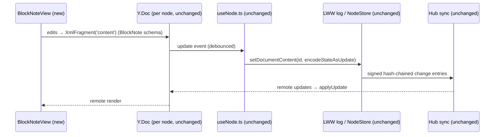
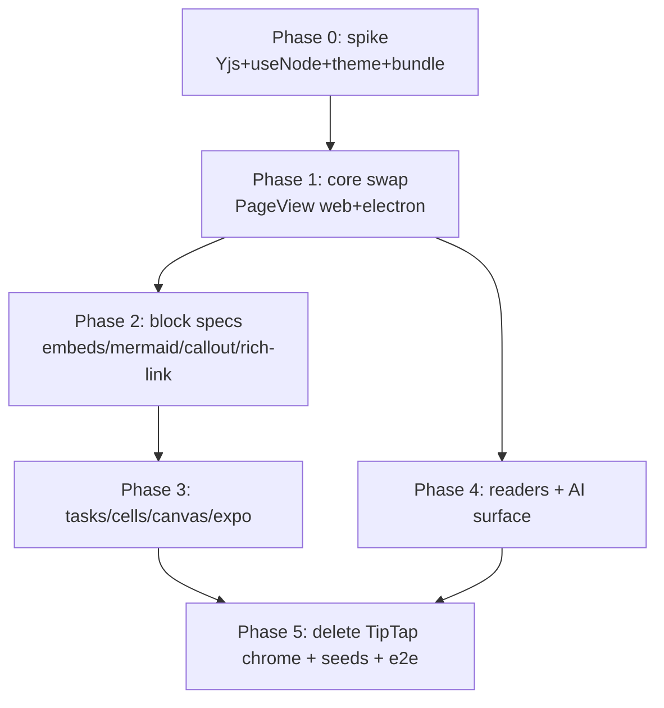

# TipTap → BlockNote Editor Migration

## Problem Statement

The rich-text editor (`packages/editor`, `@xnetjs/editor`) is ~25.7k lines of
source built directly on TipTap v3: a 1,905-line floating toolbar, a 547-line
slash-command palette, a shared suggestion-popup renderer, ~30 custom
nodes/marks, an Obsidian-style live-preview layer, and a hand-rolled markdown
I/O bridge. Most of that UI chrome is exactly what BlockNote ships out of the
box with better UX (Notion-grade slash menu, side menu + drag handle,
formatting toolbar, suggestion-menu framework, tables, comments).

Exploration 0297 evaluated BlockNote and rejected it — **solely because of the
document-migration cost** ("documents persisted as ProseMirror-schema
Y.XmlFragments"). That constraint has now been explicitly waived: the product
is prerelease and stored documents may break. This exploration re-opens 0297's
"watching brief" and plans the actual switch: what BlockNote covers natively,
which custom extensions must be ported, and in what order.

## Executive Summary

- **Do it.** With backwards compatibility waived, the one reason 0297 said no
  is gone. BlockNote (v0.51.x, MPL-2.0 core, actively maintained, ~10k stars)
  is built on TipTap/ProseMirror, so the mental model, the Yjs collab layer,
  and the schema-skew safety rules (0205) all carry over.
- **The storage/sync layer survives untouched.** Documents are per-node
  `Y.Doc`s persisted as update blobs into the LWW log via
  `packages/react/src/hooks/useNode.ts`. BlockNote's collaboration is also
  Yjs-on-ProseMirror (`Y.XmlFragment`). Only the PM schema *inside* the
  fragment changes. `useNode`, the meta bridge, `node-pool`, and the sync
  stack need zero changes.
- **Roughly half the editor package gets deleted, not ported.** Toolbar, slash
  menu, drag handle, suggestion popups, emoji menu, placeholder, toggle,
  image/file upload UI, code-block/heading/blockquote NodeViews → all built-in.
- **What must be ported (the real work):** ~9 custom block specs (embeds ×4,
  mermaid, callout, rich-link card, database-reference, page-tasks behavior),
  ~5 custom inline-content specs (mention, hashtag, wikilink, smart-reference,
  due-date), 1 style spec (AI-provenance mark), 4 suggestion-menu controllers
  (`/`, `@`, `#`, `[[`), the AI markdown surface, and the search/plain-text
  extractors that walk the fragment.
- **What we consciously drop:** the Obsidian-style live-preview /
  markdown-source-mode layer (611 + ~400 LOC) — BlockNote is WYSIWYG-first;
  markdown remains as paste/shortcuts/export only. Old documents stop
  rendering (acceptable per prompt); the devtools seed regenerates demo
  content in the new format.
- **Costs accepted:** ~2–4× editor bundle growth (mitigations below, incl. the
  Shiki grammar trap), MPL-2.0 (fine as a dependency of MIT code), pre-1.0 API
  churn, and *no* GPL/paid XL packages (columns/PDF/AI-XL) — we don't need
  them.

## Current State In The Repository

### The editor package

`packages/editor` (private, not published — no changeset needed): ~135
non-test source files, ~25.7k source + ~13.3k test LOC.

- Single instantiation point:
  `packages/editor/src/components/RichTextEditor.tsx` (1,059 LOC) —
  `useEditor(...)` with StarterKit configured with `undoRedo: false` (Yjs owns
  undo), custom heading/code-block/blockquote NodeViews, Yjs binding via
  `Collaboration.configure({ fragment: ydoc.getXmlFragment('content') })`, and
  cursors via `yCursorPlugin` from `@tiptap/y-tiptap`.
- Drag handle: official MIT `@tiptap/extension-drag-handle-react` + Floating
  UI (adopted in 0297).
- UI chrome: `components/FloatingToolbar.tsx` (1,905),
  `extensions/slash-command/` (547), `extensions/suggestion-popup.ts` (178,
  shared by all `@`/`[[`/`#`/`:` popups), `components/SlashMenu/`,
  `TaskMentionMenu.tsx`, `EmojiMenu.tsx`, `LinkTargetMenu.tsx`.
- Markdown bridge: `@tiptap/markdown` + `markdown-token-contract.ts` (314),
  `markdown-xnet.ts` (217), `markdown-structural-editing.ts` (151),
  `markdown-clipboard.ts` (72), plus a live-preview decoration layer
  (`extensions/live-preview/`, 611) and a markdown `<textarea>` source mode.

### Custom extensions (porting matrix)

| Extension | LOC | Kind | BlockNote disposition |
|---|---|---|---|
| `FloatingToolbar.tsx` | 1,905 | UI | **DELETE** — built-in formatting toolbar |
| `slash-command/` + `SlashMenu/` | 547+ | UI | **DELETE** — built-in slash menu (`getDefaultReactSlashMenuItems` + custom items) |
| `suggestion-popup.ts` | 178 | UI | **DELETE** — `SuggestionMenuController` |
| `EmojiMenu.tsx` + `@tiptap/extension-emoji` | 119 | UI | **DELETE** — built-in `:` emoji picker |
| Drag handle wiring | ~200 | UI | **DELETE** — built-in side menu |
| `HeadingWithSyntax`, `CodeBlockWithSyntax`, `BlockquoteWithSyntax` + NodeViews | ~700 | Node | **DELETE** — built-in (code block gets Shiki highlighting, an upgrade) |
| `toggle/` | 305 | Node | **DELETE** — built-in toggle list item + toggle headings |
| `image/` (CID upload, paste plugin) | 641 | Node | **REPLACE** — built-in image/file blocks + our `uploadFile` hook → blob store CID |
| `file/` (drag-drop upload) | 446 | Node | **REPLACE** — same as image |
| `live-preview/` (syntax reveal) | 611 | PM decorations | **DROP** — feature retired; BlockNote is WYSIWYG-first |
| `markdown-structural-editing` + source mode | ~550 | Behavior | **DROP** — markdown stays as shortcuts/paste/export |
| `keyboard-shortcuts/` | 350 | Behavior | **PORT-LITE** — most defaults built-in; remainder via `_tiptapOptions` keymap |
| `callout/` | 446 | Node+NodeView | **PORT** — `createReactBlockSpec` (inline content + block *children* for nesting) |
| `embed/` (YouTube/Spotify/…) | 1,050 | Node+NodeView | **PORT** — block spec, `content: "none"`; built-in video/audio covers part |
| `database-embed/` | 763 | Node+NodeView | **PORT** — block spec, `content: "none"` |
| `page-embed/` | 478 | Node+NodeView | **PORT** — block spec |
| `task-view-embed/` | 376 | Node+NodeView | **PORT** — block spec |
| `mermaid/` (plugin-contributed) | 500 | Node+NodeView | **PORT** — block spec; keep plugin contribution path |
| `rich-link/` (0295 preview cards) | 328 | Node+NodeView | **PORT** — block spec + paste handler; keep `resolvePreview` |
| `database-reference/` | 223 | Inline | **PORT** — inline content spec |
| `smart-reference/` | 294 | Inline | **PORT** — inline content spec |
| `task-metadata/` (mention, due date) | 369 | Inline | **PORT** — inline content specs (the documented mention pattern) |
| `hashtag/` | 190 | Inline | **PORT** — inline content spec + `#` suggestion controller |
| `Wikilink` mark + `wikilink-suggestion/` | ~475 | Mark+UI | **PORT** — inline content spec (chip) + suggestion controller; `[[` two-char trigger needs custom handling |
| `comment/` (Yjs-anchored marks, orphan re-attach) | 719 | Mark+PM plugin | **DECIDE** — adopt BlockNote's built-in threaded comments with a custom `ThreadStore` backed by xNet comment nodes, or port our mark (open question below) |
| `page-tasks/` (write-through checklist, 0103/0161) | 419 | Behavior | **PORT** — built-in check-list block + `onChange` write-through keyed by block ID (stable IDs make this *easier*) |
| `ai/` commands (0194) | 230 | Commands | **PORT** — reimplement against BlockNote block APIs (not XL-AI) |
| `ai-generated/` provenance mark (0234) | 191 | Mark | **PORT** — `createReactStyleSpec` |
| `document-compat.ts` (schema v3 normalizer) | 522 | Data | **RETIRE** — replaced by "BlockNote schema v4, no legacy support" |
| `extension-tiers.ts` skew guard (0205) | 85 | Safety | **KEEP-ADAPT** — same invariant applies: BlockNote schema (block/inline/style specs) must be statically bundled and identical across collaborators |

Net effect: the DELETE/DROP/REPLACE rows are ~7.5k source LOC (plus their
~5k test LOC) removed outright; the PORT rows shrink because NodeView React
components carry over nearly as-is inside `createReactBlockSpec` render
functions — the boilerplate that disappears is TipTap Node definitions,
`addNodeView`/`ReactNodeViewRenderer`, input rules, and popup positioning.

### Storage & sync (the part that does NOT change)

- Nodes with `document: 'yjs'` carry a per-node `Y.Doc` (guid = node id):
  prose in `getXmlFragment('content')`, structured props mirrored in
  `getMap('meta')`.
- `packages/react/src/hooks/useNode.ts` (1,162 LOC) loads/persists the Y.Doc
  via `store.getDocumentContent` / `setDocumentContent`
  (`Y.applyUpdate` / `Y.encodeStateAsUpdate`), debounced save + unmount flush;
  the **LWW log stores the Yjs update blob**. The editor never touches the log.
- Database rich-text cells: one `Y.XmlFragment` per column, keyed
  `richtext_<columnId>` (`packages/data/src/database/rich-text-cell.ts`).
- Sync: `packages/sync/src/yjs-authorized-sync.ts`,
  `packages/runtime/src/sync/node-pool.ts`, `WebSocketSyncProvider.ts`.

BlockNote's collaboration accepts an explicit `fragment`, so both the
per-node `'content'` fragment and per-cell `richtext_<columnId>` fragments
keep working — the fragment simply holds BlockNote's `blockGroup`/
`blockContainer` PM nodes instead of ours.



### Usage sites

| Surface | Files |
|---|---|
| Page editor | `apps/web/src/components/Editor.tsx` → `PageView.tsx`; Electron mirrors under `apps/electron/src/renderer/components/` |
| Task descriptions | `apps/web/src/components/TaskInlineEditor.tsx` |
| Canvas / database cells | `apps/web/src/components/CanvasView.tsx`, `DatabaseView.tsx` |
| Meetings notes | `packages/views/src/meeting-recorder/MeetingsSurface.tsx` |
| Mobile | `apps/expo/src/components/WebViewEditor.tsx` (separate WebView embedding — rewritten to load the BlockNote bundle) |
| Plugin contribution | `apps/web/src/plugins/mermaid-plugin.ts` via `packages/plugins/src/contributions.ts` (`EditorContribution` types `@tiptap/core` `Extension`) |

Chat composer and comments composer do **not** use TipTap (plain textareas
with their own mention stacks) — out of scope.

### Secondary breakage surface

- **Fragment readers**: `packages/query/src/search/document.ts` (plain-text
  extraction for search), `packages/hub/src/services/search-indexer.ts`,
  `packages/data/src/database/rich-text-cell.ts` `extractPlainText` — must
  learn BlockNote's node names (`blockContainer`, `blockGroup`, etc.).
- **AI surface**: `packages/plugins/src/ai-surface/page-markdown.ts` (411) +
  `service.ts` — reads/writes page content as markdown through the TipTap
  bridge. Re-target to `blocksToMarkdownLossy` / `tryParseMarkdownToBlocks`
  (or better: operate on Block JSON directly for edits).
- **Type-only imports**: `packages/plugins/src/contributions.ts` (TipTap
  `Extension` type in the plugin contribution API — becomes a BlockNote
  block/inline/style-spec contribution shape), `packages/ui/src/utils/linkify.ts`
  (mirrors TipTap autolink policy — re-mirror BlockNote's).
- **Devtools seed**: `packages/devtools/src/seed/docs/*` build PM-JSON docs
  and `seed-render.test.ts` renders them with TipTap — regenerate as Block
  JSON via `@blocknote/server-util` (`ServerBlockNoteEditor`).
- **Vite alias**: `apps/web/vite.config.ts` references `@tiptap`.
- **Tests/e2e**: 66 co-located test files (~13.3k LOC),
  `tests/e2e/src/editor-ux.spec.ts` + `editor-ux-mobile.spec.ts`,
  `RichTextEditor.stories.tsx` (1,481).

### Prior art in-repo

- **0297** (`[x]`): evaluated BlockNote, called it "the closest true turnkey
  option… the right choice for a greenfield app", rejected *only* for
  document-migration cost, and filed a watching brief. This doc executes that
  brief under the new "breaking is fine" constraint.
- **0205**: schema-vs-behavior extension tiers (Yjs skew safety) — the
  invariant transfers verbatim to BlockNote specs.
- **0231/0198**: NodeView-wrapper typography pitfalls — re-audit rhythm after
  the swap since BlockNote owns block DOM structure.

## External Research

BlockNote as of July 2026 (v0.51.4, TypeCellOS/BlockNote, ~10k stars, release
every 1–3 weeks):

- **License**: core packages (`@blocknote/core|react|mantine|shadcn|ariakit|server-util`)
  are **MPL-2.0** — fine to depend on from MIT code (file-level copyleft only
  applies to modifications of BlockNote's own files). **XL packages**
  (`xl-multi-column`, `xl-pdf-exporter`, `xl-docx-exporter`, `xl-ai`, …) are
  **GPL-3.0 or $195/mo commercial** — we use none of them. No multi-column
  layout for us unless we pay or build it.
- **Out of the box**: slash menu, side menu + drag handle, formatting toolbar,
  suggestion-menu framework (mentions are a ~30-line documented recipe),
  placeholders, nested blocks (Tab/Shift-Tab), markdown shortcuts + paste,
  emoji picker, H1–H6, toggle headings + toggle list items, quote,
  bullet/numbered/check lists, code block with Shiki highlighting, **tables**
  (a net-new capability for us), image/video/audio/file blocks with an
  `uploadFile` hook, link editing UI, **threaded comments** (free, requires
  Yjs collab + a `ThreadStore`).
- **Customization**: `createReactBlockSpec` (props limited to scalar
  primitives; `content: "inline" | "none"`), `createReactInlineContentSpec`,
  `createReactStyleSpec`, `BlockNoteSchema.create().extend(...)`,
  `SuggestionMenuController` per trigger character, full component
  replacement, CSS variables on `.bn-root`. View packages: Mantine (default),
  shadcn, Ariakit (lightest/headless-ish). No fully renderer-less mode.
- **Escape hatch**: `_tiptapOptions.extensions` accepts raw TipTap extensions
  (input rules, plugins, keymaps, marks port well); `editor._tiptapEditor` /
  `editor.prosemirrorView` reachable. TipTap *Node* extensions defining their
  own top-level block layout cannot be dropped in — re-express as block specs.
- **Document format**: typed Block JSON (`{id, type, props, content,
  children}`) — the only lossless serialization; HTML and markdown import/
  export are explicitly lossy. `@blocknote/server-util` converts without a DOM.
- **Collab**: Yjs only (fragment configurable); runs fine without collab as an
  uncontrolled component (`initialContent` + `onChange`), but yjs +
  y-prosemirror are hard deps of core either way. We keep Yjs, so moot.
- **Known pain points**: custom blocks cannot contain arbitrary child *blocks*
  (issues #1540/#1368 — nesting only via the standard indented-`children`
  mechanism every block gets); Enter-key quirks in custom blocks (#1551);
  Shiki pulls ~192 KB gz of grammars unless configured with a minimal language
  set (#1487); SSR requires client-only mounting; no controlled mode
  (debounce `onChange`); pre-1.0 breaking changes land regularly (v0.43
  extension-API rework, v0.48 theming rename).
- **Bundle**: `@blocknote/mantine` ≈ 262 KB gz (incl. react+core) vs ~36 KB gz
  bare StarterKit — realistically 2–4× our current editor chunk before
  mitigation. Memory 0297: a >6 MB chunk breaks the PWA build — the editor
  must stay a lazy route-split chunk.

## Key Findings

1. **The 0297 blocker is gone by fiat.** Waiving document compatibility
   converts a data-migration project into a UI-port project. The persisted
   Y.Doc/LWW plumbing is schema-agnostic bytes and doesn't change.
2. **The porting work is leaf content, which BlockNote handles well.** Every
   one of our embeds/cards is `content: "none"` + a React component we already
   have; every chip (mention/hashtag/wikilink/reference) is the documented
   inline-content pattern. The one structural node — callout — maps to inline
   content + indented children (Notion-style), which is a behavior change but
   an acceptable one.
3. **Roughly 7.5k LOC of chrome is deleted, and the deleted code is our
   highest-maintenance code** (FloatingToolbar at 1,905 LOC is the single
   largest file in the package; suggestion popups and slash menu are the
   perennial UX-bug source per 0231/0288 history).
4. **Two features are consciously retired**: Obsidian-style live syntax
   preview and the markdown source mode. BlockNote's model is WYSIWYG with
   markdown shortcuts. If source mode is ever wanted back, it's a
   `blocksToMarkdownLossy` round-trip textarea — explicitly lossy, so it
   should return only with that caveat.
5. **Suggestion triggers**: `/`, `@`, `#`, `:` map 1:1 to
   `SuggestionMenuController`s. The `[[` wikilink trigger is two characters —
   needs a small input-rule shim (via `_tiptapOptions`) that calls
   `editor.openSuggestionMenu("[[")` or rewrites to a single-char internal
   trigger.
6. **Comments can get better, not just ported**: BlockNote ships threaded
   comments UI for free; our 719-LOC Yjs-anchored mark + orphan re-attachment
   could be replaced by implementing their `ThreadStore` interface over xNet
   comment nodes (keeping comment data in the LWW log, not the Y.Doc, so
   comments survive without the doc being open — same property our 0276
   system has).
7. **Schema-skew discipline transfers.** BlockNote specs are the new "schema
   tier": they must be statically bundled and identical across collaborators
   (same silent-drop failure mode under Yjs). `extension-tiers.ts` and
   `packages/plugins/src/editor-schema-safety.ts` adapt rather than die; the
   plugin contribution API (`EditorContribution`) re-types from TipTap
   `Extension` to `{ blockSpecs?, inlineContentSpecs?, styleSpecs?,
   slashMenuItems?, tiptapExtensions? }` with the same skew guard on the spec
   groups.

```mermaid
flowchart LR
    subgraph DELETE["Deleted (~7.5k LOC + tests)"]
      FT[FloatingToolbar 1905]
      SM[slash-command 547]
      SP[suggestion-popup 178]
      EM[EmojiMenu]
      NV[Heading/Code/Quote NodeViews]
      TG[toggle 305]
      IMG[image 641 / file 446]
      LP[live-preview 611]
      MSE[md structural editing]
    end
    subgraph BN["BlockNote built-ins"]
      T1[Formatting toolbar]
      T2[Slash menu]
      T3[SuggestionMenuController]
      T4[Emoji picker]
      T5[Blocks: headings/code/quote/toggle/tables]
      T6[Image/file blocks + uploadFile]
    end
    subgraph PORT["Ported as specs (~4.5k LOC shrinking)"]
      P1[embeds ×4 → block specs]
      P2[mermaid / rich-link / callout → block specs]
      P3[mention/hashtag/wikilink/refs → inline specs]
      P4[ai-generated → style spec]
      P5[page-tasks write-through → onChange by block id]
      P6[comments → ThreadStore over xNet nodes]
    end
    DELETE -->|replaced by| BN
    PORT -->|createReactBlockSpec / InlineContentSpec / StyleSpec| BN
```



## Options And Tradeoffs

### Option A — Full migration to BlockNote (recommended)

Replace `RichTextEditor` with a `BlockNoteView`-based `XNetEditor` in
`packages/editor`, port the spec matrix above, delete the chrome, retire
live-preview/source-mode, regenerate seeds, rewrite editor tests/e2e.

- **Pros**: largest permanent LOC/maintenance reduction; Notion-grade UX for
  free (incl. tables + comments we never built); future features (drag-drop
  polish, a11y, mobile toolbars) arrive upstream; suggestion/menu bugs stop
  being our code.
- **Cons**: 2–4× editor bundle (mitigable); pre-1.0 churn tax; custom-block
  nesting ceiling (callout compromise); MPL/GPL boundary to respect; two
  retired features; every editor test rewritten.

### Option B — Status quo (0297 hybrid, keep TipTap)

- **Pros**: zero cost now; unlimited schema flexibility.
- **Cons**: we keep paying the chrome tax forever (the churn history — 0231,
  0288, four suggestion stacks — shows this is our most defect-dense UI); we
  re-build tables and threaded-comment UI ourselves eventually.

### Option C — Coexistence (BlockNote for pages, TipTap elsewhere)

Ship BlockNote in `PageView` first while task/canvas/database cells stay on
TipTap.

- **Pros**: de-risks the biggest surface first.
- **Cons as an end state**: two editors = two schemas in stored fragments, two
  bundles, double chrome. Only acceptable as a *transition phase inside
  Option A*, not a destination.

### Data handling sub-options (given "breaking is fine")

1. **Abandon** old fragments: new empty BlockNote fragment on first open
   (field key stays `'content'`; stale TipTap-schema XmlFragment content is
   simply never read again — dead CRDT weight per doc, negligible).
   Cheapest; loses existing prerelease content.
2. **Lazy best-effort convert** (recommended, ~1 day): on first open, if the
   fragment is empty but the old TipTap fragment has content, run old-doc →
   markdown (existing `markdown-xnet` exporter, kept temporarily in a
   `legacy-export.ts`) → `tryParseMarkdownToBlocks`. Lossy (embeds/mentions
   degrade to text/links) but preserves the bulk of dogfooding content. Write
   into a **new fragment key `'content-v4'`** so conversion is idempotent and
   the old fragment stays as backup.
3. Full-fidelity converter: not worth it prerelease.

## Recommendation

**Option A, phased, with data sub-option 2**, landed as a stacked series of
PRs (each green, editor behind nothing — the swap is atomic per surface):

1. **Phase 0 — Spike (1 PR, throwaway-ok)**: BlockNote + Yjs against a real
   xNet node through `useNode`; verify fragment wiring, dark theme via
   `.bn-root` CSS vars against workbench tokens (0299 planes), bundle chunking
   (lazy route split; Shiki restricted to our current language set), React
   19/StrictMode status.
2. **Phase 1 — Core swap in `packages/editor`**: new `XNetEditor` (BlockNote,
   Mantine view initially; evaluate shadcn/Ariakit later), schema with
   built-ins only + inline specs (mention/hashtag/wikilink) + suggestion
   controllers; wire `PageView` (web + Electron). Old `RichTextEditor` remains
   in-tree, unused.
3. **Phase 2 — Block specs**: embeds ×4, mermaid (plugin-contributed —
   re-type `EditorContribution`), callout, rich-link, page-tasks
   write-through, AI-provenance style spec, `uploadFile` → CID blob store.
4. **Phase 3 — Remaining surfaces**: TaskInlineEditor, database rich-text
   cells (per-cell fragment), CanvasView cards, MeetingsSurface, Expo WebView
   bundle.
5. **Phase 4 — Readers + AI**: search/plain-text extractors, hub
   search-indexer, `ai-surface/page-markdown` → Block JSON/markdown-lossy,
   `linkify` policy mirror, comments decision (ThreadStore spike).
6. **Phase 5 — Deletion**: remove `RichTextEditor`, FloatingToolbar, slash
   menu, suggestion popups, live-preview, markdown structural editing,
   `document-compat.ts`, all `@tiptap/*` deps except what BlockNote itself
   provides; regenerate devtools seeds; rewrite e2e specs; drop the vite
   alias.



## Example Code

Mention as inline content + `@` menu (replaces `TaskMentionExtension` +
`TaskMentionMenu` + `suggestion-popup`):

```tsx
// packages/editor/src/specs/mention.tsx
import { createReactInlineContentSpec } from '@blocknote/react'

export const Mention = createReactInlineContentSpec(
  {
    type: 'mention',
    propSchema: { did: { default: '' }, label: { default: '' } },
    content: 'none',
  },
  {
    render: ({ inlineContent }) => (
      <span className="xnet-mention" data-did={inlineContent.props.did}>
        @{inlineContent.props.label}
      </span>
    ),
  }
)

// In the editor surface:
<SuggestionMenuController
  triggerCharacter="@"
  getItems={async (query) =>
    (await searchProfiles(query)).map((p) => ({
      title: p.label,
      onItemClick: () =>
        editor.insertInlineContent([
          { type: 'mention', props: { did: p.did, label: p.label } },
          ' ',
        ]),
    }))
  }
/>
```

Yjs wiring against the existing per-node `Y.Doc` (nothing about `useNode`
changes):

```tsx
const editor = useCreateBlockNote({
  schema: xnetSchema, // BlockNoteSchema.create().extend({ blockSpecs, inlineContentSpecs, styleSpecs })
  collaboration: {
    provider,                                  // existing awareness/provider from node-pool
    fragment: ydoc.getXmlFragment('content-v4'),
    user: { name: profile.label, color: presenceColor },
  },
  codeBlock: shikiMinimalSetup,                // only our languages — avoids issue #1487
})
```

Embed card as a void block (the existing React card component drops into
`render`):

```tsx
export const PageEmbed = createReactBlockSpec(
  { type: 'pageEmbed', content: 'none', propSchema: { nodeId: { default: '' } } },
  { render: ({ block }) => <CanvasExternalReferenceCard nodeId={block.props.nodeId} /> }
)
```

## Risks And Open Questions

- **Callout semantics change**: BlockNote custom blocks can't *contain*
  arbitrary blocks (#1540/#1368); callout becomes inline content + indented
  children. Verify our existing callout usage tolerates this (visual nesting
  instead of containment).
- **`[[` trigger**: two-character triggers aren't native; needs an input-rule
  shim. Small but fiddly (IME/mobile).
- **Comments direction**: adopt BlockNote threads + custom `ThreadStore` over
  xNet comment nodes vs. port our mark. The ThreadStore path deletes UI but
  changes anchoring (BlockNote anchors via its own mark in the Y.Doc; our
  0276 system stores threads in the LWW log). Needs a Phase-4 spike; do not
  block the core swap on it.
- **Bundle size**: 262 KB gz base + Mantine + mermaid/KaTeX already-heavy
  chunk. Must stay lazy-split; recheck the PWA >6 MB chunk limit (0297
  gotcha). Consider shadcn/Ariakit views if Mantine weight bites.
- **Pre-1.0 churn**: pin exact versions; budget upgrade time per minor.
  MPL-2.0 means any patches we make to BlockNote files must be upstreamed or
  published — prefer upstream PRs.
- **Mobile**: our mobile floating-toolbar behavior (0289 shell) was custom;
  verify BlockNote's mobile toolbar UX is acceptable on the Expo WebView.
- **AI surface fidelity**: `blocksToMarkdownLossy` drops custom blocks —
  extend with per-spec `toExternalHTML`/markdown mappings so AI edits don't
  silently delete embeds. This is the longest tail (service.ts is 3.6k LOC).
- **Search extraction**: confirm hub indexer (Rust side too, if any) only
  reads plain text via our extractors and not PM node names.
- **KaTeX/math**: `@tiptap/extension-mathematics` has no BlockNote built-in;
  port as an inline spec rendering KaTeX (small, but on the matrix).
- **Presence cursors**: we use `yCursorPlugin` directly with custom rendering;
  BlockNote renders collab cursors itself — verify presence colors/labels
  match the 0298 profile system.

## Implementation Checklist

- [ ] Phase 0: spike branch — BlockNote editor bound to a real node's `Y.Doc`
      via `useNode`, fragment `content-v4`, dark/light theming via `.bn-root`
      vars, lazy chunk + Shiki language allowlist, StrictMode/React-19 check
- [ ] Phase 1: `XNetEditor` in `packages/editor` (BlockNoteView + schema +
      mention/hashtag/wikilink inline specs + `/` `@` `#` controllers + `[[`
      shim); swap `apps/web` `PageView` + Electron `PageView`
- [ ] Phase 1: lazy legacy import — old fragment → markdown → 
      `tryParseMarkdownToBlocks` on first open (idempotent via new fragment key)
- [ ] Phase 2: block specs — `embed`, `database-embed`, `page-embed`,
      `task-view-embed`, `mermaid` (+ re-typed `EditorContribution` in
      `packages/plugins/src/contributions.ts` with skew guard), `callout`,
      `rich-link`, math inline spec; `uploadFile` → CID blob store
- [ ] Phase 2: page-tasks write-through re-keyed to stable block IDs
- [ ] Phase 3: `TaskInlineEditor`, database rich-text cells
      (`rich-text-cell.ts` fragment-per-column), `CanvasView`/`DatabaseView`,
      `MeetingsSurface`, Expo `WebViewEditor` bundle
- [ ] Phase 4: re-target fragment readers (`packages/query/src/search/document.ts`,
      `packages/hub/src/services/search-indexer.ts`,
      `rich-text-cell.ts extractPlainText`) to BlockNote node names
- [ ] Phase 4: AI surface (`packages/plugins/src/ai-surface/page-markdown.ts`,
      `service.ts`) onto Block JSON / lossy markdown with per-spec exporters
- [ ] Phase 4: comments spike — BlockNote `ThreadStore` over xNet comment
      nodes vs. keep 0276 system; decide and implement
- [ ] Phase 4: `packages/ui/src/utils/linkify.ts` re-mirrors BlockNote link
      policy; `ai-generated` provenance style spec
- [ ] Phase 5: delete `RichTextEditor.tsx`, `FloatingToolbar.tsx`,
      `slash-command/`, `suggestion-popup.ts`, `SlashMenu/`, `EmojiMenu`,
      `live-preview/`, markdown structural editing + source mode,
      `document-compat.ts`, old NodeViews, unused `@tiptap/*` +
      `katex`-adjacent deps; drop `@tiptap` vite alias in
      `apps/web/vite.config.ts`
- [ ] Phase 5: regenerate devtools seed docs as Block JSON via
      `@blocknote/server-util`; fix `seed-render.test.ts`; keep
      `seed-coverage.test.ts` green
- [ ] Phase 5: rewrite `tests/e2e/src/editor-ux.spec.ts` +
      `editor-ux-mobile.spec.ts` against BlockNote DOM; new stories replacing
      `RichTextEditor.stories.tsx`
- [ ] Changesets: `packages/plugins` contribution-API change is a **major**
      (exported `EditorContribution` type changes); `packages/editor` is
      private (no changeset); audit `packages/ui`/`packages/data` diffs for
      bump level
- [ ] Update `extension-tiers.ts` → spec-tier guard; adapt
      `packages/plugins/src/editor-schema-safety.ts`

## Validation Checklist

- [ ] Two browser tabs on one doc: concurrent typing converges, cursors show
      correct 0298 profile names/colors, undo is local-only
- [ ] Doc created in web renders identically in Electron and Expo WebView
- [ ] Every ported spec round-trips: create → reload (Y.Doc persist/restore
      via `useNode`) → survives hub sync to a second device
- [ ] Legacy doc with wikilinks/mentions/embeds lazy-converts without crash;
      degraded content is visible text, not silent loss
- [ ] `/`, `@`, `#`, `[[`, `:` menus all open, filter, insert on mobile
      viewport too (`preview_resize` mobile)
- [ ] Search returns hits for text inside new-format docs (query package +
      hub indexer)
- [ ] AI page edit (0194 commands) applies without deleting embeds
- [ ] Seed panel populates demo workspace; `seed-coverage.test.ts` +
      `seed-render.test.ts` green
- [ ] Bundle check: editor chunk lazy, no chunk >6 MB (PWA build passes),
      Shiki grammars limited to allowlist
- [ ] `pnpm -w vitest run` from root green; e2e editor specs green; fallow
      gate green
- [ ] Grep proves zero `@tiptap/` imports outside BlockNote's own tree

## References

- In-repo: `docs/explorations/0297_[x]_OFF_THE_SHELF_NOTION_LIKE_EDITOR.md`
  (prior BlockNote evaluation + watching brief), `0205` (extension tiers),
  `0231` (NodeView typography pitfalls), `0295` (rich-link cards), `0276`
  (page comments), `packages/editor/src/document-compat.ts` (exact current
  schema surface), `packages/react/src/hooks/useNode.ts` (Y.Doc↔LWW bridge)
- BlockNote: https://www.blocknotejs.org/docs · https://github.com/TypeCellOS/BlockNote
  (v0.51.4, June 2026) · pricing/licensing: https://www.blocknotejs.org/pricing
- Custom schemas: https://www.blocknotejs.org/docs/features/custom-schemas/custom-blocks ·
  …/custom-inline-content · suggestion menus:
  https://www.blocknotejs.org/docs/react/components/suggestion-menus
- Collaboration: https://www.blocknotejs.org/docs/features/collaboration ·
  comments: …/collaboration/comments
- Known limits: nesting in custom blocks
  https://github.com/TypeCellOS/BlockNote/issues/1540 ·
  https://github.com/TypeCellOS/BlockNote/issues/1368 · Shiki bundle
  https://github.com/TypeCellOS/BlockNote/issues/1487
- Bundle: https://bundlephobia.com/package/@blocknote/react
