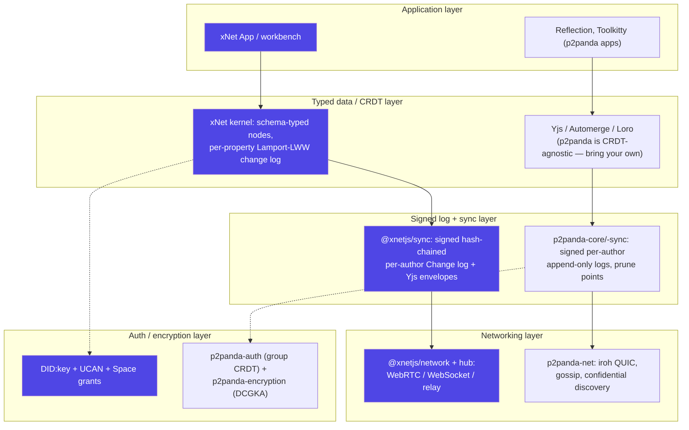
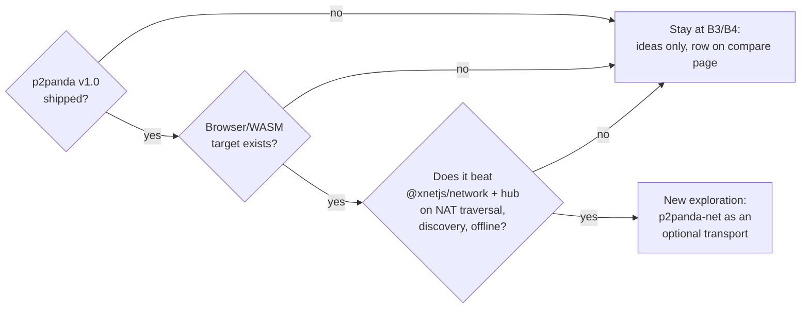

# p2panda: Compare-Page Placement And Integration Potential

## Problem Statement

p2panda (<https://p2panda.org>) is a modular Rust toolkit for building
encrypted, local-first, peer-to-peer applications. It keeps coming up in our
own explorations — 0200 called it "the nearest neighbor to what XNet wants to
be", 0081/0085 studied its access-control CRDT, 0258 cited its append-only
logs and group encryption. Two questions:

1. **Compare page** — should p2panda appear on the marketing compare page
   (`site/src/pages/compare.astro`), and at what tier?
2. **Integration** — should xNet technically integrate any of p2panda
   (crates, protocols, or design ideas)?

## Executive Summary

- **p2panda is already on the compare page** — as a "Worth knowing" *chip* in
  the Protocols layer (`site/src/data/compare.ts:1182`), a deliberate call
  from exploration 0171 ("move Solid/p2panda to chips if the table exceeds
  12 rows"). The real decision is **chip → full row promotion**.
- **Recommendation (a): promote it to a full Protocols-layer row.** Since the
  chip decision, p2panda rewrote itself into 11 modular crates on iroh,
  shipped group encryption (DCGKA/2SM) and decentralized group auth, reached
  v0.7.0 (July 2026, billed as the last breaking change before 1.0), and
  anchored the FOSDEM 2026 "Modal" local-first Linux desktop initiative. It
  is now more comparison-worthy than several existing rows (e.g. Willow,
  which is a spec with alpha implementations). It is *the* project a
  well-informed evaluator will ask about, and it sits at exactly the layer
  where xNet positions itself as "both consumer and provider". One file
  changes: `compare.ts` (add row, delete chip — the build validator enforces
  name uniqueness across both lists).
- **Recommendation (b): do NOT integrate as a dependency today.** The new
  stack is Rust-first with **no browser/WASM story** (the only JS path is an
  experimental, unreleased UniFFI binding for Node.js), pre-1.0 with active
  wire-format churn (CBOR → Postcard in v0.7.0), and its encryption crate is
  still unaudited. For a TypeScript-first framework whose primary runtime is
  the browser, there is nothing to link against. **Mine it for design ideas
  instead** — prune points, header/body split, confidential topic discovery,
  DCGKA group encryption, and the causal-length auth CRDT map directly onto
  open xNet problems (0258 multi-home sync, 0307 security hardening, 0304
  authorization). Revisit as a dependency if p2panda ships v1.0 **and** a
  browser target on top of iroh's WASM work.

## Current State In The Repository

### The compare page

The compare page is single-sourced from
[`site/src/data/compare.ts`](../../site/src/data/compare.ts) (~1,220 lines),
rendered by [`site/src/pages/compare.astro`](../../site/src/pages/compare.astro)
via `site/src/components/compare/{CompareLayerSection,CompareCell,MaturityBadge}.astro`.
There are **no per-entry routes** — one page, five `CompareLayer` sections
(`products`, `frameworks`, `sync`, `substrates`, `protocols`), each with full
`CompareProject` table rows plus a long tail of `Chip`s under "Worth knowing".

The **Protocols & P2P primitives** layer (`compare.ts:1017`) currently has
**11 rows** — xNet, AT Protocol, Nostr, ActivityPub, Matrix, Hypercore/Pear,
Iroh, libp2p, IPFS, Willow, Holochain — compared on
`scope · dataModel · sync · identity · bestFor`, and **8 chips**, the first of
which is:

```ts
{ name: 'p2panda', url: 'https://p2panda.org', note: 'Rust toolkit for encrypted group P2P apps' }
```

Adding a row is a one-file change guarded by
[`site/scripts/validate-compare.ts`](../../site/scripts/validate-compare.ts)
(runs before `astro build`): required fields, `maturity` enum, `https://`
URLs, every column key present in `dims`, **name uniqueness within a layer
across rows AND chips** (so the chip must be removed when the row is added),
and no dangling footnotes. `rowCount`/`chipCount` stat tiles are derived
automatically. The module header mandates: *never state a competitor status
claim without a sourced footnote.*

### Prior p2panda analysis in this repo

- `docs/explorations/0027_[x]_LANDSCAPE_ANALYSIS.md:222-246` — full profile
  (EU-funded, sub-crates, verdict: "p2panda is a library (Rust); xNet is an
  application + SDK (TypeScript)… Don't compete with p2panda/iroh on
  networking — consider using them").
- `docs/explorations/0200_[x]_PORTABLE_XNET_PROTOCOL_BOUNDARIES_AND_STANDARD.md:305`
  — "the nearest neighbor to what XNet wants to be" (modular bytes-level
  protocol on BLAKE3/Ed25519/CBOR).
- `docs/explorations/0081` / `0085` — p2panda's convergent access-control
  CRDT as a reference model for xNet authorization.
- `docs/explorations/0258_..._MULTI_HOME_SYNC.md:272-274` — p2panda/namakemono
  logs + capabilities + group encryption as prior art.
- `docs/explorations/0171_[x]_COMPARE_PAGE_REDESIGN.md:562` — the explicit
  prior decision to hold p2panda at chip tier.
- No references anywhere to `aquadoggo` or `bamboo` (the deprecated stack) —
  our mentions are all of the *new* p2panda, which is the right one.

### xNet's own protocol (the thing being compared)

Normative spec in `docs/specs/protocol/` (L0–L4), reference implementation in
`packages/sync/` (signed `Change<T>`, Lamport clocks, per-author hash chains,
Yjs signed-envelope layer), `packages/crypto/` + `packages/identity/`
(Ed25519, `did:key`), `packages/core/src/lww.ts` (per-property LWW), and
`packages/hub/` + `packages/network/` (relay/transport). Unit of replication:
the **signed, hash-chained, per-author change log**; conflicts resolved by
per-property Lamport-LWW with golden conformance vectors; replication scoped
by Space-containment grants or UCAN `hub/relay` capabilities.

## External Research

### What p2panda is in mid-2026

The project rewrote itself in December 2024, discarding the old monolithic
node (`aquadoggo` — **archived May 2026, unmaintained**), Bamboo logs, GraphQL
API, custom CRDTs, and the AGPL license. The new stack is **~11 modular Rust
crates, MIT OR Apache-2.0**, restarted at v0.1.0:

| Crate | Role |
|---|---|
| `p2panda` | High-level "Node" API (networking + sync + ordering + storage out of the box, v0.6.0+) |
| `p2panda-core` | Operations, per-author append-only logs, Ed25519, BLAKE3 |
| `p2panda-net` | QUIC networking + gossip, **built on iroh** (iroh v1.0.0 as of p2panda v0.7.0) |
| `p2panda-discovery` | Confidential topic discovery (random walk + private set intersection), optional mDNS |
| `p2panda-sync` | Append-only log sync protocols |
| `p2panda-blobs` / `-store` / `-stream` | Blob transfer, persistence traits (SQLite/memory), stream ordering/decryption |
| `p2panda-encryption` | Group encryption: "data encryption" (shared key, PCS) + "message encryption" (Double Ratchet, FS) via X3DH + 2SM from the Weidner et al. 2021 **DCGKA** paper (they evaluated and rejected MLS for decentralized settings) |
| `p2panda-auth` | Decentralized group management: nested groups, `Pull < Read < Write < Manage`, causal-length CRDT membership, pluggable conflict resolver ("strong removal" default) |
| `p2panda-spaces` | Ties groups + encryption to application data (processor landed v0.7.0) |

Key data-model properties: operations are a signed **header + optional body**
(headers sync eagerly, payloads lazily); **prune points** allow garbage
collection without breaking log verifiability; the log layer is explicitly
**CRDT-agnostic** — "bring your own CRDT (Automerge, Yjs, …)". Wire encoding
switched CBOR → **Postcard** in v0.7.0.

### Health, adoption, bindings

- **Cadence**: v0.1.0 (Dec 2024) → v0.4.0 (auth + encryption, Jul 2025) →
  v0.5.0 (net rewrite, Jan 2026) → v0.6.0 (Node API, May 2026) → **v0.7.0
  (Jul 2026)**, billed as "the last big [breaking change] for our core"
  before v1.0. All crates still carry "not yet stable for production"
  warnings.
- **Team & funding**: 3 core people, EU NGI/NLnet grant-funded (the
  encryption/capabilities grant ran to Jul 2025); Open Collective balance is
  negligible. Research-grade scale: ~511 GitHub stars, ~9k downloads of
  `p2panda-core`.
- **Users**: Reflection (GNOME collaborative editor, p2panda + **Loro**),
  Toolkitty (Tauri), Dash Chat, HIRO's rhio (NATS + S3 sync between micro
  data centers). FOSDEM 2026 introduced **Modal**, a collective building a
  local-first Linux desktop on p2panda.
- **Bindings — the crux**: the old `p2panda-js`/`shirokuma` TS SDKs are
  archived with aquadoggo. The new path is `p2panda-ffi` (UniFFI →
  **Node.js**, Python, Go): explicitly experimental, **no published
  releases, no WASM/browser support**. JS apps on p2panda today embed the
  Rust crates natively behind Tauri. iroh itself has an alpha, relay-only
  browser/WASM mode, but p2panda has not built on it.
- **Encryption audit**: a Radically Open Security audit was announced as
  pending in Feb 2025; as of mid-2026 the README still says the crate "has
  not yet received a security audit". Group control messages (membership
  metadata) are unencrypted.

### Where p2panda sits relative to xNet



Both stacks are Ed25519 + BLAKE3 signed per-author append-only logs. The
differences: xNet ships an opinionated typed data model (schema-typed nodes,
per-property LWW, conformance corpus) and a TypeScript/browser-first
runtime; p2panda ships un-opinionated Rust infrastructure (bring your own
CRDT) with stronger networking primitives (iroh QUIC, confidential
discovery, prune-able logs) and a group-encryption story xNet does not yet
have.

## Key Findings

1. **The compare-page question is a promotion question, not an addition
   question.** p2panda is already a chip; the validator will fail on a
   duplicate name if the chip isn't removed when the row is added.
2. **p2panda has materially leveled up since the chip decision (0171).**
   v0.7.0 on iroh 1.0, shipped group encryption + decentralized auth, Modal/
   FOSDEM visibility, and multiple real apps. It now clears the bar that
   Willow (spec + alpha impls) and Holochain already sit above.
3. **It is not a competitor at the CRDT layer.** It belongs in the Protocols
   layer (where its chip already is), framed — as the layer intro says — as
   "potential transports… rather than competitors". A row gives us the
   chance to say precisely that, which the 8-word chip note cannot.
4. **Technical integration is blocked on bindings, not on merit.** No
   browser/WASM target exists or is roadmapped; the UniFFI bindings are
   Node-only, experimental, unreleased. xNet's primary runtime is the
   browser (OPFS + SQLite WASM). Embedding Rust crates would only be
   plausible in the Electron/Capacitor shells, splitting the sync stack in
   two — a non-starter.
5. **The design ideas transfer even though the code doesn't.** Four map
   directly onto open xNet work:
   - **Prune points** → our 318k-row `changes` log cold-open problem (0249)
     and epoch/checkpoint thinking (0306).
   - **Header/body split** (eager headers, lazy payloads) → partial/lazy
     replication for multi-home sync (0258).
   - **DCGKA group encryption** (X3DH + 2SM, MLS rejected for decentralized
     settings) → the E2E-encryption gap noted in 0268/0307; their published
     reasoning is a free literature review.
   - **Causal-length auth CRDT with "strong removal"** → already studied in
     0081/0085; their shipped resolver semantics (concurrent ops by demoted
     members invalidated transitively) are a concrete answer to revocation
     races our UCAN model still hand-waves (0307's wildcard-UCAN finding).

## Options And Tradeoffs

### (a) Compare page

| Option | Pros | Cons |
|---|---|---|
| **A1. Keep as chip** (status quo) | Zero work; table stays at 11 rows | Under-represents the project most likely to be raised by sophisticated evaluators; the chip note ("Rust toolkit…") says nothing about how it relates to xNet |
| **A2. Promote to full Protocols row** ← | One-file change; honest positioning next to Iroh/Willow/Holochain; lets us footnote maturity + audit status accurately; 12 rows is exactly the cap 0171 contemplated | Slightly longer table; needs a sourced footnote to stay within the "no unsourced status claims" rule |
| **A3. New "P2P toolkits" layer** | Room for p2panda + iroh + Hypercore as a family | Over-engineering: three entries don't justify a sixth layer; Iroh/Hypercore already live happily in Protocols |

### (b) Integration

| Option | Pros | Cons |
|---|---|---|
| **B1. Depend on p2panda crates** (net/sync under xNet) | Best-in-class networking (iroh QUIC, hole-punching, confidential discovery); stop maintaining our own transport | **No browser target** — dead on arrival for the primary runtime; pre-1.0 churn (wire format changed last month); would fork the stack between web and native shells |
| **B2. Wire-level interop** (speak p2panda's log/sync protocol) | Federation with the p2panda ecosystem | Their wire format just changed (Postcard) and is pre-1.0; their ecosystem is ~3 apps; xNet's change log is schema-typed LWW, theirs is payload-agnostic — the mapping is lossy in both directions; no demand signal |
| **B3. Design-level idea mining** ← | Zero dependency risk; targets real open problems (prune/epochs 0306, partial sync 0258, group E2EE 0268/0307, revocation semantics 0304/0307); their DCGKA and auth-CRDT write-ups are peer-reviewed-adjacent and free | No code reuse; ideas still need xNet-shaped designs |
| **B4. Wait-and-watch with explicit triggers** ← (alongside B3) | Cheap; revisit exactly when the blockers clear | Requires remembering — hence the trigger list below |

## Recommendation

**Do A2 + B3/B4.**

1. **Promote p2panda from chip to full row** in the Protocols layer of
   `compare.ts`, deleting the chip in the same edit (validator enforces
   this). Maturity `alpha` (crates self-describe as not production-stable;
   real apps exist but are alpha-grade — same tier as Willow), with one
   sourced footnote covering pre-1.0 status, the v1.0 signal, the pending
   encryption audit, and Rust-first/no-browser reality. Bump the layer's
   `lastVerified` to July 2026.
2. **Do not integrate p2panda code.** Record explicit revisit triggers:
   - p2panda v1.0 ships (v0.7.0 was billed as the last core break), **and**
   - a browser/WASM target exists (theirs, or iroh's WASM mode graduating
     from relay-only alpha), **and/or**
   - the `p2panda-ffi` UniFFI bindings get real releases.
3. **Harvest four design ideas** into the explorations where they belong
   (no new code in this exploration): prune points → 0306 epochs;
   header/body split → 0258 partial sync; DCGKA → future E2EE exploration
   (0268/0307 follow-up); strong-removal auth CRDT → 0304/0307 authorization
   follow-up.



## Example Code

The complete change to [`site/src/data/compare.ts`](../../site/src/data/compare.ts)
— add the row after Willow (`:1165`), delete the chip (`:1181-1185`), append
one footnote:

```ts
// In layers[4].projects, after the Willow entry:
{
  name: 'p2panda',
  url: 'https://p2panda.org',
  maturity: 'alpha',
  license: 'MIT / Apache-2.0',
  bestFor: 'Encrypted group P2P apps in Rust — bring your own CRDT',
  dims: {
    scope: 'P2P toolkit (Rust crates)',
    dataModel: 'Signed append-only logs (CRDT-agnostic, prunable)',
    sync: { v: 'iroh QUIC + gossip; pluggable log sync', fn: 'p2panda-status' },
    identity: 'Ed25519 keys + group auth CRDT'
  },
  details: {
    Encryption: 'Group data + message encryption (DCGKA / Double Ratchet)',
    'Browser support': 'None in the new stack (Rust-first; experimental Node.js FFI)'
  },
  footnotes: ['p2panda-status']
},

// Remove from layers[4].chips:
//   { name: 'p2panda', url: 'https://p2panda.org', note: 'Rust toolkit for encrypted group P2P apps' },

// Add to layers[4].footnotes:
{
  id: 'p2panda-status',
  text: 'Pre-1.0: v0.7.0 (July 2026) switched wire encoding to Postcard and was billed by the team as the last major breaking change before 1.0. Networking builds on iroh v1.0. The group-encryption crate documents that it has not yet received a security audit.',
  sourceUrl: 'https://github.com/p2panda/p2panda/releases'
}
```

`rowCount`/`chipCount` update automatically (derived reduces at
`compare.ts:1218-1221`). No component, route, or nav changes needed.

## Risks And Open Questions

- **Maturity label**: `alpha` vs `beta` is a judgement call. Crates say "not
  yet stable for production" (→ alpha), but the stack runs real apps and
  sits on iroh 1.0 (→ beta). Going with `alpha` + footnote; revisit at their
  1.0.
- **Row-count creep**: Protocols goes to 12 rows — exactly the threshold
  0171 set for demoting things to chips. Any 13th row should force a demotion
  conversation, not silently grow the table.
- **Claims go stale fast**: p2panda is releasing roughly quarterly. The
  footnote's "pre-1.0 / unaudited" claims must be re-verified whenever the
  layer's `lastVerified` is refreshed — an audited 1.0 would flip both.
- **Does a row *help* p2panda-curious evaluators choose xNet?** Arguably yes:
  the honest framing is "if you're a Rust team building your own app from
  primitives, use p2panda; if you want a typed knowledge graph with a
  TypeScript SDK and a browser runtime, that's xNet". The `bestFor` cell and
  layer intro carry this.
- **Open question**: should the "Need low-level P2P?" prose card on
  `compare.astro:259-265` (currently Iroh + Hypercore) mention p2panda too?
  Leaning no — the row is enough, and the card is deliberately minimal.

## Implementation Checklist

- [ ] Add the p2panda `CompareProject` row to the Protocols layer in
      `site/src/data/compare.ts` (after Willow), per Example Code.
- [ ] Remove the p2panda entry from that layer's `chips` array (validator
      enforces name uniqueness across rows + chips).
- [ ] Add the `p2panda-status` footnote to the layer's `footnotes` array.
- [ ] Bump the Protocols layer `lastVerified` to `'July 2026'`.
- [ ] Run `node site/scripts/validate-compare.ts` (or the site build) to
      confirm the validator passes.
- [ ] Build the site (`astro build` — note from 0291: dev server can hang,
      verify via full build) and eyeball the Protocols table, "More
      dimensions" expansion, mobile card, and footnote rendering.
- [ ] No changeset needed (site app is not a publishable package); docs-only
      + site PR — check whether `skip-changelog` applies per repo convention.

## Validation Checklist

- [ ] `validate-compare.ts` passes (no duplicate name, no dangling
      footnotes, all `dims` keys present).
- [ ] `/compare` renders 12 Protocols rows; stat tiles reflect the new
      row/chip counts automatically.
- [ ] The p2panda footnote superscript resolves and links to the releases
      page.
- [ ] Every factual cell in the row traces to a source cited in this
      document's References.
- [ ] Revisit triggers recorded here are discoverable: this exploration is
      referenced from any future E2EE/transport exploration that touches
      p2panda.

## References

- p2panda site & rewrite announcement: <https://p2panda.org> ·
  <https://p2panda.org/2024/12/06/p2panda-release.html>
- Monorepo & releases (v0.7.0, Postcard, iroh 1.0):
  <https://github.com/p2panda/p2panda> ·
  <https://github.com/p2panda/p2panda/releases>
- Core data model: <https://docs.rs/p2panda-core/latest/p2panda_core/> ·
  networking: <https://docs.rs/p2panda-net/latest/p2panda_net/>
- Group encryption (DCGKA/2SM, MLS rejection):
  <https://p2panda.org/2025/02/24/group-encryption.html>
- Access control (auth CRDT, strong removal):
  <https://p2panda.org/2025/07/28/access-control.html> ·
  <https://p2panda.org/2025/08/27/notes-convergent-access-control-crdt.html>
- aquadoggo deprecation (archived May 2026):
  <https://github.com/p2panda/aquadoggo>
- Experimental FFI bindings (Node/Python/Go, no browser):
  <https://github.com/p2panda/p2panda-ffi>
- Funding (NLnet/NGI): <https://nlnet.nl/project/P2Panda-groups/> ·
  <https://opencollective.com/p2panda>
- Reflection (GNOME editor on p2panda + Loro):
  <https://github.com/p2panda/reflection> ·
  <https://blogs.gnome.org/tbernard/2025/06/30/aardvark-summer-2025-update/>
- FOSDEM 2026 / Modal:
  <https://fosdem.org/2026/schedule/event/MCVBNK-p2panda-modal-reflection/>
- iroh browser/WASM alpha:
  <https://www.iroh.computer/blog/iroh-0-32-0-browser-alpha-qad-and-n0-future>
- "Why p2panda over iroh" discussion:
  <https://github.com/p2panda/p2panda/issues/963>
- In-repo prior art: `docs/explorations/0027_[x]_LANDSCAPE_ANALYSIS.md`,
  `0081`, `0085`, `0171_[x]_COMPARE_PAGE_REDESIGN…`, `0200_[x]_PORTABLE_XNET_PROTOCOL…`,
  `0258_…MULTI_HOME_SYNC…`; live chip at `site/src/data/compare.ts:1182`.
