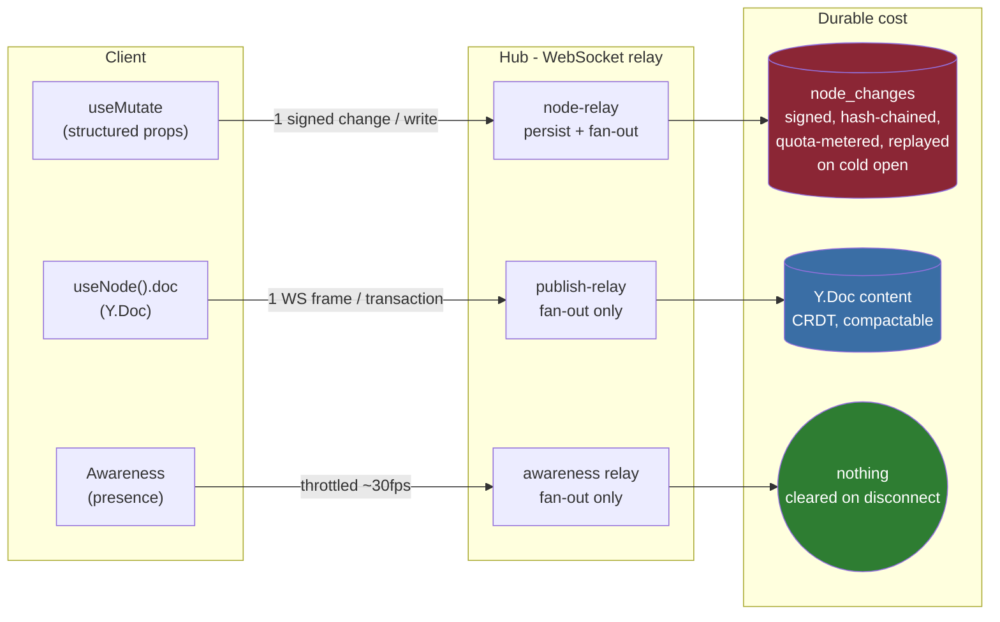
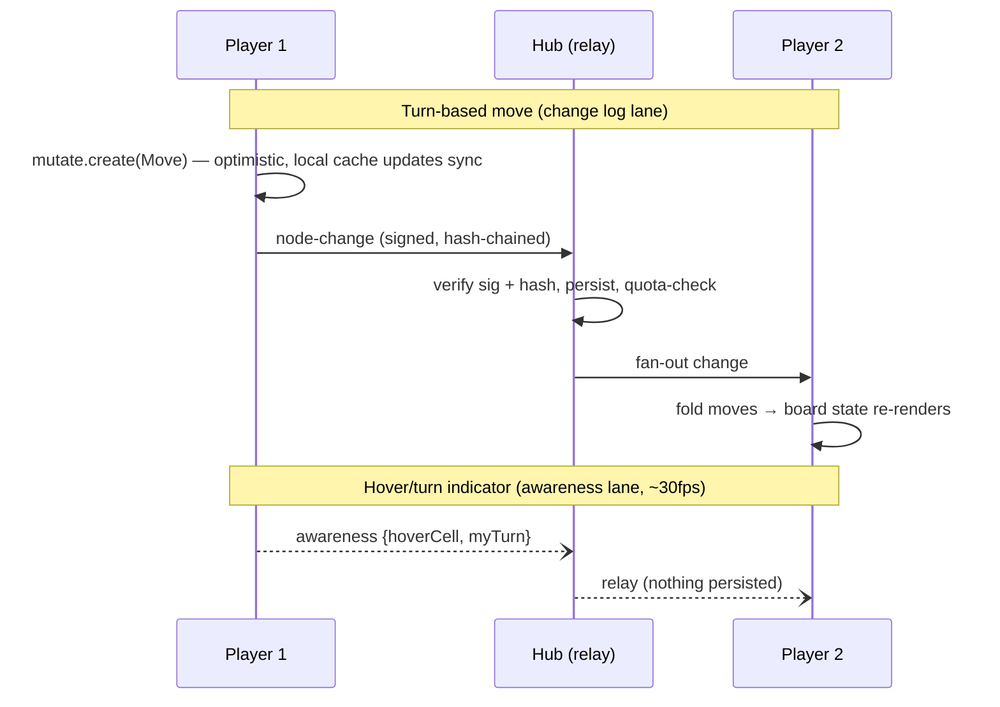
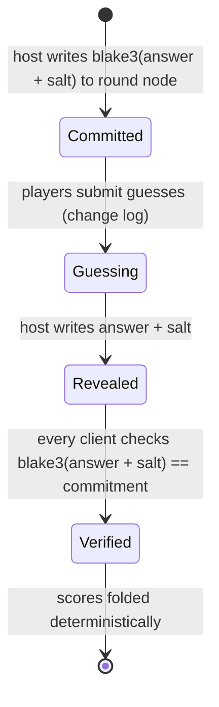

# Realtime Games And Hackathon Demos On xNet

## Problem Statement

xNet sells itself as a local-first sync framework, but every public demo is a
productivity workbench. Sync engines that win developer mindshare do it with
_fun_: PartyKit's drum machine, Liveblocks' paired-iframe examples, InstantDB's
sliding puzzle, Convex's AI Town, tldraw's cursor party. Three questions:

1. **Could we build a realtime game on xNet?** Which genres fit a signed,
   hash-chained, LWW change log — and which physically can't?
2. **What about quick hackathon apps?** What is the time-to-first-synced-write
   today, and what's missing versus Firebase/InstantDB/Convex?
3. **What about a quick collab prototype?** How close are we to a "30-line
   collaborative app" story?

## Executive Summary

**Yes to all three — but only if demos ride the right sync lane.** xNet
multiplexes three logically distinct channels over one hub WebSocket, and they
have radically different cost profiles:

| Lane                                 | API                                              | Persisted?                                               | Fit                                            |
| ------------------------------------ | ------------------------------------------------ | -------------------------------------------------------- | ---------------------------------------------- |
| **Change log** (`node-change`)       | `useMutate` / `client.mutate`                    | Signed, hash-chained, quota-metered rows — forever       | Turn-based _moves_ (low volume, cheat-evident) |
| **Y.Doc sync** (`xnet-doc-<nodeId>`) | `useNode().doc`                                  | Y.Doc content (compactable CRDT), **not** the change log | Board state, strokes, shared canvases          |
| **Awareness**                        | `getAwareness(nodeId)` / `CanvasPresenceManager` | Nothing — cleared on disconnect                          | Cursors, positions, "who's here", live drag    |

Driving a game through `useMutate` at 20 writes/sec would reproduce the
318k-row cold-open stall (exploration 0249) as a self-inflicted wound. Driving
it through Y.Doc + Awareness costs nothing durable and already syncs at one
hub round-trip (~sub-100ms on a local hub, no outbound batching).

The genre boundary is crisp: **discrete, user-paced moves and
last-write-wins-as-the-rule games work today** (turn-based, board, word,
trivia, drawing, pixel canvas, cursor toys). Contested-state action games
(<100ms conflict resolution, rollback netcode) are out of scope — that's
Croquet's deterministic-VM territory, not a state-sync engine's.

The recommendation is a three-tier plan: (1) ship two workbench-plugin game
demos (cursor party + a turn-based board game) that exercise Awareness and
Y.Doc respectively, extracting a reusable `usePresence` hook along the way;
(2) close the hackathon gap with an `examples/minimal-app` starter and a
hosted wipe-daily demo hub room, tldraw-`useSyncDemo`-style; (3) treat the
collab prototype as the marketing artifact: a genuinely small
"collaborative todo in ~40 lines" that becomes the docs quickstart.

## Current State In The Repository

### Sync transport — hub relay, no batching, no P2P

- All sync relays through the hub over one WebSocket.
  `packages/runtime/src/sync/WebSocketSyncProvider.ts` is explicit that,
  unlike y-webrtc, updates are relayed via the signaling server. Message
  types: `sync-step1`/`sync-step2`/`sync-update`/`awareness`.
- **One Yjs transaction = one WebSocket frame.** `_onDocUpdate`
  (`WebSocketSyncProvider.ts:502`) and `setupDocBroadcast`
  (`packages/runtime/src/sync/sync-manager.ts:900`) publish immediately —
  no coalescing, no debounce on the doc path.
- **WebRTC does not really exist.**
  `tests/integration/src/webrtc-signaling.test.ts` is `describe.skip` and
  self-describes as documentation of the handshake, not a feature. Every
  byte bounces through the hub.
- Hub-side rate limit: **100 messages/sec per connection**, 1s window,
  repeated breaches close the socket
  (`packages/hub/src/middleware/rate-limit.ts`, wired in
  `packages/hub/src/server.ts:305`). A naive 60fps broadcaster gets
  disconnected; a throttled 30fps one fits.

### Presence — ephemeral, throttled, but coupled to canvas

- `packages/canvas/src/presence/canvas-presence.ts`
  (`CanvasPresenceManager`) wraps `y-protocols/awareness`: cursor,
  selection, viewport, activity, user identity. Cursor/viewport broadcasts
  are throttled to **~30fps (33ms)**; nothing is persisted; state clears on
  disconnect (`removeAwarenessStates`, `sync-manager.ts:700`).
- `packages/canvas/src/presence/selection-lock.ts` shows Awareness carrying
  _game-shaped_ semantics already: collaborative edit locks with no
  persistence.
- **Gap:** presence is tied to a Y.Doc node room (`xnet-doc-<nodeId>`) and
  the throttle lives inside the canvas package. There is no general
  `usePresence(nodeId)` hook or standalone ephemeral-room API.

### Change log — quota-metered, permanent, grinding-guarded

- Every `useMutate` write becomes a signed, hash-chained `node_changes` row,
  replayed on cold open. The LWW kernel is
  `packages/core/src/lww.ts` (v4 blake3 tiebreak, exploration 0305).
- Hub quotas exist for demo mode: `quotaBytes` per user with
  `QUOTA_EXCEEDED` / `STORAGE_FULL` rejection
  (`packages/hub/src/services/node-relay.ts:84,246`), 24h idle eviction
  (exploration 0291).

### App-building surface

- **Boot:** `createXNetClient` (`packages/runtime/src/client.ts:100`) —
  minimal required input is `authorDID` + `signingKey`; storage defaults to
  memory; sync is opt-in via `sync: { signalingUrl }` (default
  `ws://localhost:4444`).
- **Identity is zero-friction:** `generateIdentity()`
  (`packages/identity/src/did.ts`, re-exported by `@xnetjs/sdk`) mints a
  DID:key + Ed25519 keypair synchronously. No account, no server. Passkeys
  and recovery (0243) are optional layers on top. Foot-gun: the SDK's
  `createClient` (`packages/sdk/src/client.ts`) returns _identity only_,
  not a store.
- **Schema in one call:** `defineSchema`
  (`packages/data/src/schema/define.ts:95`) + property builders +
  `document: 'yjs'` for an attached collaborative doc. Authz is one line
  via `presets.publicRead()` etc. (`packages/data/src/auth/presets.ts`);
  the coarse `write` action cascades to `create`/`update` (0304). Omitting
  authz triggers legacy-mode warnings and the CI coverage test.
- **React:** `useNode` (`packages/react/src/hooks/useNode.ts`) returns
  `{ data, doc, update, syncStatus, peerCount, presence }` — most of a
  multiplayer session UI in one hook. `useMutate` is optimistic/local-first
  (synchronous local cache, background sync).
- **Hub one-liner:** `npx xnet-hub start --port 4444` (with `--no-auth` for
  anonymous local demos and `--demo` for quota'd public ones)
  (`packages/hub/src/cli.ts`, `packages/hub/README.md`). Docker/Railway/Fly
  deploy paths exist (0300).
- **Join flow:** deterministic rooms (`channelShareRoom(id)` →
  `xnet-channel-${id}`, `packages/runtime/src/sync/node-store-sync-provider.ts:68`)
  plus UCAN share links with fragment secrets
  (`packages/identity/src/sharing/create-share.ts`) — a URL can carry the
  whole invitation.
- **Ship-into-workbench:** `packages/plugins` `ViewContribution`
  (`packages/plugins/src/contributions.ts`) docks a React component into
  the workbench layout tree; `examples/xnet-plugin-template/` scaffolds
  one. `@xnetjs/labs` (0180) can publish sandboxed code nodes as live
  extensions (`publishLabAsExtension`).
- **Gaps:** no `examples/minimal-app`, no `create-xnet-app` scaffold, no
  hosted throwaway demo room, `registry/community.json` is empty.

### The three lanes, visually



**Rule of thumb for every demo below:** intentional, low-volume, worth-auditing
events → change log. Shared mutable state → Y.Doc. High-frequency ephemera →
Awareness.

## External Research

### What sync-engine vendors demo with

- **PartyKit** leads with toys: multiplayer drum machine (Tone.js + Yjs),
  falling-sand game, cursor party, YouTube watch parties
  ([examples gallery](https://docs.partykit.io/examples/)); the community
  Partyworks framework ships Connect4/RPS/tic-tac-toe.
- **Liveblocks** sells with paired iframes so you _see_ two users at once
  ([liveblocks.io/examples](https://liveblocks.io/examples)) — whiteboard
  and spreadsheet flagships.
- **InstantDB** ships a drop-in `<Cursors>` component and a collaborative
  sliding-tile puzzle
  ([presence docs](https://www.instantdb.com/docs/presence-and-topics)).
- **Convex** got a16z-scale attention with AI Town
  ([convex.dev/ai-town](https://www.convex.dev/ai-town)).
- **tldraw** runs a hosted demo backend (`useSyncDemo`) whose data is wiped
  daily — zero-friction trial with an explicit non-durability contract
  ([announcing tldraw sync](https://tldraw.substack.com/p/announcing-tldraw-sync)).
- **Croquet/Multisynq** is the only "no-netcode action games" path, and it
  achieves it by bit-identical replicated simulation, not state merge — a
  different architecture, not an upgrade path from LWW.

### Latency tolerance by genre

Claypool & Claypool's canonical result: latency sensitivity ∝ precision ×
deadline of the player action. Turn-based/board/word/trivia play fine at
250ms+; RTS-style play tolerates seconds. Drawing games ship stroke events
over plain websockets at ~100ms perceived delay. Cursors are conventionally
throttled at 30–100ms (Liveblocks defaults to 100ms, floor 16ms). Below
~100ms _contested-state_ resolution you need rollback or an authoritative
tick server ([SnapNet rollback explainer](https://www.snapnet.dev/blog/netcode-architectures-part-2-rollback/)).

**Practical rule for xNet:** LWW state sync is comfortable wherever a move is
a discrete, user-paced event. Once two players contest the _same_ state
within one RTT continuously, it stops being our genre.

### Presence best practice

Uniform across Yjs/Liveblocks/InstantDB: **two channels, never one.** Yjs
awareness is explicitly not stored in the Y.Doc and evicts peers after 30s of
silence; Liveblocks separates Presence (ephemeral, TTL'd) from Storage;
InstantDB separates rooms/topics from the persisted graph. High-frequency
updates go through the ephemeral channel throttled at 30–100ms; only
intentional changes hit the durable log. xNet already has exactly this shape —
it just isn't packaged as a public API.

### What makes a backend hackathon-fast

Recurring checklist from BaaS comparisons: (1) zero-signup start
(InstantDB provisions a DB without an account), (2) one-call auth —
Firebase's _anonymous auth_ is the killer feature, (3) realtime by default,
not opt-in, (4) single-binary/single-file boot (PocketBase), (5) generous
free tier, (6) AI-legibility — docs written for coding agents
(llms.txt, MCP). xNet already has (1) via `generateIdentity()` and (3) via
`useQuery`/`useNode`; it's missing the scaffold, the hosted playground, and
the agent-legible quickstart.

### Killer-demo anatomy

One Million Checkboxes (built in 2 days, 650M checks in 2 weeks) and r/place
share five ingredients: (a) trivially compact shared state (a bitfield);
(b) a per-user rate limit that _creates_ the social dynamic; (c) zero
onboarding — the URL is the whole game; (d) **LWW is semantically correct** —
"last pixel wins" is the rule, not a bug; (e) headroom for emergent behavior.
Ingredient (d) is the design key for xNet: pick games where our merge
semantics _are_ the game rules.

### Modeling turn-based games on LWW

- **Never** store the board as one register or turn order as a mutable
  field — LWW silently drops causally-later-but-lower-timestamp writes.
- **Move log as append-only entities** works perfectly: each move is a new
  immutable node; board = deterministic fold over moves. On xNet, moves are
  _already signed and hash-chained_ — cheat-evident game history for free.
  This is the one game workload where the persisted change log is a
  feature, not a tax.
- **Conflict as mechanic:** simultaneous moves at the same seq are detected
  at fold time and resolved by an explicit deterministic rule; xNet's v4
  blake3 tiebreak (0305) already gives deterministic same-timestamp order.
- **What LWW can't give:** hidden information (everyone syncs everything —
  secret words need commit-reveal: store `blake3(answer‖salt)` up front,
  reveal at round end) and server-enforced legality (validate at fold;
  illegal moves render as no-ops).

## Key Findings

1. **The platform is two-thirds of a PartyKit already.** Hub relay,
   per-node Y.Doc rooms, throttled Awareness, deterministic share rooms,
   instant DID identity, optimistic React hooks. Nothing about a
   turn-based/board/drawing/cursor demo requires new infrastructure.
2. **The persisted change log is the wrong lane for realtime state and the
   perfect lane for moves.** 20 Hz game state through `useMutate` re-creates
   the 0249 cold-open stall; ~60 signed moves per chess game is negligible
   _and_ buys provable, tamper-evident history no competitor demo has.
3. **Presence needs one extraction, not an invention.**
   `CanvasPresenceManager` has the right semantics (ephemeral, 30fps
   throttle, disconnect eviction) but lives in `packages/canvas` and is
   canvas-shaped. A generic `usePresence<T>(nodeId)` in `@xnetjs/react`
   is a small, high-leverage refactor.
4. **Hackathon time-to-first-synced-write is ~15 lines of code but ~0 lines
   of documentation.** `generateIdentity()` → `defineSchema` →
   `createXNetClient` → `npx xnet-hub start --no-auth` works today; nobody
   outside this repo could discover it. No starter, no hosted playground,
   no agent-legible quickstart.
5. **The genre boundary protects us from over-promising.** Turn-based,
   board, word, trivia, drawing, pixel-canvas, cursor-toy: in scope.
   Physics, shooters, fighting games: out of scope, permanently, by
   architecture — and that's fine; it's the same boundary Liveblocks,
   InstantDB, and Yjs live behind.
6. **Rate limits shape the design, pleasantly.** 100 msgs/sec/connection
   with socket-close enforcement means demos must throttle to ≤30fps —
   which is also the industry-standard presence cadence. The constraint and
   the best practice coincide.

## Options And Tradeoffs

### Where does a demo live?

| Option                                                  | What it is                                                                   | Pros                                                                                    | Cons                                                                                         |
| ------------------------------------------------------- | ---------------------------------------------------------------------------- | --------------------------------------------------------------------------------------- | -------------------------------------------------------------------------------------------- |
| **A. Workbench plugin** (`ViewContribution`)            | Game/board docks into the existing app; identity, sync, storage all provided | Fastest to working multiplayer; demos the plugin story too; ships via marketplace       | Players need the workbench open; demo is invisible outside our app                           |
| **B. Standalone mini-app** (`createXNetClient` + React) | Tiny Vite app, URL-joinable, share-link invite                               | The PartyKit/tldraw pattern; URL _is_ the game; doubles as the missing starter template | Must hand-wire provider/identity today (no scaffold); needs a hosted hub with wipe policy    |
| **C. Lab node** (`@xnetjs/labs`)                        | Game as sandboxed code node, published as extension                          | Most "xNet-native" story (code as content, P2P-synced program)                          | Labs is exploration-stage (0180); sandbox limits (iframe rung) add friction for a first demo |

### Which game first?

| Candidate                                                                | Lane usage                                                         | Effort                                  | Demo power                                                                            |
| ------------------------------------------------------------------------ | ------------------------------------------------------------------ | --------------------------------------- | ------------------------------------------------------------------------------------- |
| **Cursor party** (cursors + emoji bursts on a shared page)               | Awareness only                                                     | Tiny (~1 day once `usePresence` exists) | Table-stakes; the paired-iframe "wow"                                                 |
| **Turn-based board game** (Connect Four or tic-tac-toe)                  | Change log for moves (signed!), Awareness for hover/turn indicator | Small                                   | Unique angle: _cryptographically provable game history_ — no competitor demo has this |
| **Pixel place** (shared pixel board, per-user cooldown)                  | One Y.Doc `Y.Map` cell→color; cooldown client-side + fold-time     | Small-medium                            | Viral pattern; LWW-as-rule; stress-tests Y.Doc fan-out                                |
| **Drawing game** (skribbl-style: strokes + guesses + commit-reveal word) | Y.Doc strokes, chat channel guesses, change-log round records      | Medium                                  | Shows all three lanes in one app; reuses existing chat/channels                       |
| **Trivia/quiz party**                                                    | Change log answers, Awareness buzzer                               | Small                                   | Reuses forms (0278); good for meetups                                                 |

The board game and pixel place are the strongest seconds after cursor party:
one shows off the signed log, the other the Y.Doc fan-out, and both are
famous, legible formats.

### Move storage for turn-based games: change log vs Y.Doc

- **Change log (recommended for moves):** each move =
  `mutate.create(MoveSchema, …)`. Signed, ordered (lamport + v4 tiebreak),
  cheat-evident, quota-negligible at human move rates. Fold to board state
  in a selector.
- **Y.Doc (recommended for boards/strokes):** contested cells, strokes,
  piece positions during drag. Compactable, off the audit log, but
  unsigned-per-op — fine where provenance doesn't matter.
- **Anti-pattern:** board-as-one-JSON-property via `useMutate.update` —
  LWW clobbers concurrent moves _and_ bloats the log. Never do this; say so
  loudly in the demo README because it's the first thing a hackathon
  participant will try.



### Hidden information (word/card games)



Everyone syncs everything, so secrets must be commitments — a constraint, but
also a demo: "the game _proves_ the host didn't change the word."

## Recommendation

Three tiers, in order, each shippable independently:

**Tier 1 — extract the primitive, ship two plugin demos (1–2 weeks).**
Extract `usePresence<T>(nodeId)` into `@xnetjs/react` (generic Awareness
hook: typed state, 30fps throttle, disconnect eviction — the
`CanvasPresenceManager` semantics minus the canvas shape; land it in a
`hooks/` sub-barrel per the 0276 barrel policy). Then build **Cursor Party**
(Awareness only) and **Connect Four** (signed move log + fold + Awareness
turn indicator) as workbench plugins via `ViewContribution`, seeded into the
demo workspace. These prove both ephemeral lanes and give the marketplace its
first fun entries.

**Tier 2 — the hackathon kit (1–2 weeks, parallelizable).**
`examples/minimal-app`: a Vite + React + `@xnetjs/sdk` starter under 60
lines that boots identity → schema → client → `useQuery`, with
`npx xnet-hub start --no-auth` in the README, plus a share-link join flow.
Add a wipe-daily `--demo` room on the public hub (tldraw `useSyncDemo`
pattern, quotas already exist per 0291) so the starter works with zero
infrastructure. Write the quickstart agent-legibly (llms.txt-style, single
copy-pasteable page) — in 2026 the first "user" of a hackathon quickstart is
a coding agent.

**Tier 3 — the collab prototype as marketing (few days).**
A standalone "collaborative todo + live cursors in ~40 lines" page on the
site with two embedded iframes side by side (the Liveblocks trick), backed
by the demo hub room. This is the artifact that answers "what is xNet?"
faster than any docs page.

Defer: pixel place (do it as the follow-up viral swing once Tier 2's hosted
room exists to absorb traffic), drawing game (wants the chat-channel reuse
polish), anything requiring WebRTC/P2P or rollback (out of scope by
architecture).

## Example Code

Tier 2's starter, based on the real API surface today:

```tsx
// main.tsx — a collaborative todo in ~40 lines
import { generateIdentity } from '@xnetjs/identity'
import { createXNetClient } from '@xnetjs/sdk'
import { defineSchema, text, checkbox } from '@xnetjs/data'
import { presets } from '@xnetjs/data'
import { XNetProvider, useQuery, useMutate } from '@xnetjs/react'

const Todo = defineSchema({
  name: 'Todo',
  namespace: 'xnet://demo.todo/',
  properties: {
    title: text({ required: true }),
    done: checkbox({})
  },
  authorization: presets.publicRead() // satisfies the 0192/0304 cascade
})

const { identity, privateKey } = generateIdentity() // instant DID, no signup

const client = await createXNetClient({
  authorDID: identity.did,
  signingKey: privateKey,
  identity,
  sync: {
    signalingUrl: 'ws://localhost:4444', // npx xnet-hub start --no-auth
    nodeSyncRoom: `xnet-demo-${location.hash.slice(1) || 'lobby'}`
  }
})

function App() {
  const todos = useQuery(Todo)
  const { create, update } = useMutate()
  return (
    <ul>
      {todos.data?.map((t) => (
        <li key={t.id} onClick={() => update(Todo, t.id, { done: !t.done })}>
          {t.done ? '✅' : '⬜'} {t.title}
        </li>
      ))}
      <button onClick={() => create(Todo, { title: 'New todo' })}>+</button>
    </ul>
  )
}
```

Tier 1's presence hook, sketched against the existing Awareness plumbing:

```ts
// @xnetjs/react — usePresence: generic, throttled, ephemeral
export function usePresence<T extends Record<string, unknown>>(
  nodeId: string,
  initial: T,
  opts?: { throttleMs?: number } // default 33ms — under the hub's
): {
  // 100 msg/s limit with headroom
  peers: Array<{ clientId: number; did: string; state: T }>
  setState: (patch: Partial<T>) => void // throttled broadcast
}
// Semantics lifted from CanvasPresenceManager (packages/canvas/src/presence/
// canvas-presence.ts): nothing persisted, peers evicted on disconnect.
```

And the Connect Four move fold — the pattern the demo README teaches:

```ts
const Move = defineSchema({
  name: 'C4Move',
  namespace: 'xnet://demo.connect4/',
  properties: {
    gameId: text({ required: true }),
    column: number({ required: true }), // 0..6
    seq: number({ required: true }) // client-claimed turn number
  },
  authorization: presets.publicRead()
})

// Board is NEVER stored — it's a deterministic fold over signed moves.
// Simultaneous claims of the same seq: lamport + v4 blake3 tiebreak (0305)
// gives every client the same order; the loser's move folds as a no-op.
function foldBoard(moves: C4Move[]): Board {
  return sortByChangeOrder(moves).reduce(applyIfLegal, emptyBoard())
}
```

## Risks And Open Questions

- **Hub fan-out under a viral demo.** One room, N clients ⇒ O(N²) relay
  frames for Awareness. r/place survived on cooldowns and CDN snapshots;
  our pixel-place follow-up needs the same (per-user cooldown is also the
  fun). The Tier 1/2 demos are small-room (2–8 players) and safe.
- **Anonymous writes vs. hub auth.** `--no-auth` is loudly marked unsafe
  for open networks (`packages/hub/src/config.ts:148`). The hosted demo
  room needs the `--demo` quota path plus either anonymous-capability
  scoping or throwaway-DID registration — the exact wildcard-UCAN weakness
  0307 flagged sits adjacent to this. Scope demo rooms to demo storage.
- **Space-less rooms and the 0304 gotcha.** Demo rooms that aren't Spaces
  may resolve no create rungs once the auth evaluator is wired locally
  (memory: 0304's DM caveat). `presets.publicRead()` covers today's
  behavior; re-verify when 0307's evaluator wiring lands.
- **`useNode` unsubscription and Y.Doc lifecycle** for short-lived game
  rooms — do docs get released when the last player leaves? Needs a check
  before the hosted room ships (relates to `node.acquire` fire-and-forget,
  0188).
- **Seq-claiming in the move log** trusts clients to claim turn numbers;
  fold-time legality checks make cheating _visible_ (signed!) but not
  _impossible_. Fine for demos; say so honestly in the README.
- **Does `nodeSyncRoom` alone give a joinable session** without a share
  token when the hub enforces auth? The deterministic-room + UCAN
  share-link path exists; the starter must pick the simplest flow that
  works against the hosted demo room.

## Implementation Checklist

> **Implementation note (2026-07-13).** At implementation time the demos were
> redirected (user decision) from workbench plugins to a **hosted standalone
> app** (`apps/demos`, deployed to GitHub Pages at `xnet.fyi/demos/` alongside
> the site and web app) — the URL-is-the-invitation form is the better public
> artifact, and nothing about the lane architecture changes. `usePresence`
> takes the `Awareness` instance (from `useNode().awareness`) rather than a
> nodeId — same capability, composes instead of duplicating `useNode`'s
> acquisition. The plugin/`ViewContribution` variants and the marketplace
> listing remain future work if in-workbench games are wanted; the dev-tools
> seed item does not apply (demo schemas live in `apps/demos`, not the
> workbench registry). Deep signature re-verification was scoped down to a
> signed-authorship move log (change-level signature APIs aren't exposed to
> app hooks today).

Tier 1 — primitive + hosted game demos:

- [x] Extract `usePresence<T>(awareness)` into `packages/react/src/hooks/`
      (named grouped export from the root barrel per 0276), semantics from
      `CanvasPresenceManager`; changeset: minor for `@xnetjs/react`.
- [x] Unit-test throttle, eviction-on-disconnect, and that no `node_changes`
      rows are produced (regression guard for the lane rule).
- [x] Build **Cursor Party** (hosted demo, `apps/demos`): shared room node,
      cursors + emoji bursts via `usePresence`.
- [x] Build **Connect Four** (hosted demo, `apps/demos`): `C4Move` schema,
      fold-based board (order-independence + conflict determinism unit
      tested), Awareness hover indicator, signed move-log panel.

Tier 2 — hackathon kit:

- [x] Create `examples/minimal-app/` (Vite + React, <60 lines of app code,
      copied not workspace-linked, matching `examples/` convention).
- [x] Point demos at the hosted demo hub and document the non-durability
      contract tldraw-style (rooms are ad-hoc on `hub.xnet.fyi`, which
      already runs `--demo` quotas + idle eviction per 0291 — nothing to
      "add"; the sandbox contract is stated on the demos home, the site
      page, and the minimal-app README).
- [x] Fix/document the SDK entry foot-gun: `createClient` jsdoc + README
      now point at `createXNetClient` / `<XNetProvider>` and
      `examples/minimal-app` (a `createDemoClient()` helper was judged not
      worth a new API surface).
- [x] Write the agent-legible quickstart: docs quickstart gained a
      "Go multiplayer in two commands" section (room-string join flow),
      `examples/minimal-app/README.md` is the copy-pasteable single page,
      and both flow into the auto-generated `llms-full.txt`.
- [x] Decide and document the simplest join flow (deterministic room vs
      share link) against the hosted demo room.

Tier 3 — collab prototype page:

- [x] Build the ~40-line collaborative todo + cursors demo.
- [x] Embed as paired iframes on a site page (`site/src/pages/`), backed by
      the demo hub room.
- [x] Link it from the landing page and the quickstart.

Hosting (added at implementation time — the user-requested deliverable):

- [x] Deploy `apps/demos` to GitHub Pages at `/play/` via
      `deploy-site.yml`, next to the site (root) and web app (`/app/`).

## Validation Checklist

(Evidence gathered at implementation time against a local hub +
locally-assembled Pages tree; production-dependent checks are listed under
Post-deploy follow-ups.)

- [x] `usePresence` produces zero persisted writes and survives sustained
      cursor traffic: unit tests pin the throttle to ≤ ~30 broadcasts/sec
      and prove the hook's only mutation surface is `setLocalState`
      (`usePresence.test.tsx`); a live two-client 30fps cursor stream ran
      without a rate-limit disconnect, with remote cursors rendering
      cross-client.
- [x] Connect Four: the fold caps a full game at ≤ 42 applied moves
      (≤ ~50 change-log rows); order-independence and same-seq conflict
      determinism unit-tested (`fold.test.ts`); a played board survived a
      client reload and reconstructed from the replayed signed move log.
      (Deep signature re-verification was scoped down to a signed-authorship
      move log — see the implementation note.)
- [x] Cold-open: no 0249 exposure by construction — demos run as a separate
      app with their own storage; nothing writes the workbench's change log.
- [x] `examples/minimal-app`: fresh copy outside the repo → `npm install`
      (published packages, 4s) → build in 2s; app boots against the public
      demo hub with zero local infrastructure. (`@xnetjs/hub` turned out
      NOT to be on npm — the starter was repointed at the public hub with a
      Docker one-liner for self-hosting.)
- [x] Paired-iframe site demo verified on the assembled Pages tree: a todo
      created in frame one arrived in frame two in ≤250ms; live cursor
      crossed frames; mobile viewport stacks and dark mode renders.

Post-deploy follow-ups (need production):
- Hosted demo room quota rejection (`QUOTA_EXCEEDED`) and eviction observed
  in the wild; an abusive 60fps client is disconnected, not the room.
- A coding agent given only the quickstart page produces a working synced
  app (dogfood the AI-legibility claim).

## References

- `packages/runtime/src/sync/WebSocketSyncProvider.ts`,
  `packages/runtime/src/sync/sync-manager.ts` — transport, no-batching,
  awareness relay
- `packages/canvas/src/presence/canvas-presence.ts` — 30fps throttled
  ephemeral presence (extraction source)
- `packages/hub/src/middleware/rate-limit.ts`,
  `packages/hub/src/services/node-relay.ts` — 100 msg/s limit, demo quotas
- `packages/core/src/lww.ts` — LWW kernel + v4 blake3 tiebreak (0305)
- `packages/data/src/schema/define.ts`, `packages/data/src/auth/presets.ts`
  — one-call schemas + authz presets (0192/0304)
- `packages/react/src/hooks/useNode.ts` — doc + peerCount + presence hook
- `packages/plugins/src/contributions.ts`, `examples/xnet-plugin-template/`
  — plugin demo path; `packages/labs/` — Lab-as-extension path (0180)
- Explorations: 0249 (cold-open stall / log bloat), 0276 (LWW module +
  barrel policy), 0291 (demo quotas/eviction), 0304 (authz cascade),
  0305 (tiebreak), 0307 (authz weaknesses adjacent to demo rooms)
- PartyKit examples — https://docs.partykit.io/examples/
- Liveblocks examples (paired iframes) — https://liveblocks.io/examples
- InstantDB presence/topics — https://www.instantdb.com/docs/presence-and-topics
- Convex AI Town — https://www.convex.dev/ai-town
- tldraw sync + demo backend — https://tldraw.substack.com/p/announcing-tldraw-sync
- Yjs awareness protocol — https://github.com/yjs/y-protocols/blob/master/PROTOCOL.md
- SnapNet, rollback netcode — https://www.snapnet.dev/blog/netcode-architectures-part-2-rollback/
- Claypool & Claypool, "Latency and player actions in online games" —
  https://www.researchgate.net/publication/220427777
- One Million Checkboxes — https://eieio.games/blog/one-million-checkboxes-data-and-code/
- r/place engineering — https://www.fastly.com/blog/reddit-on-building-scaling-rplace
- CRDT game-state sync in P2P VR — https://arxiv.org/html/2503.17826v1
