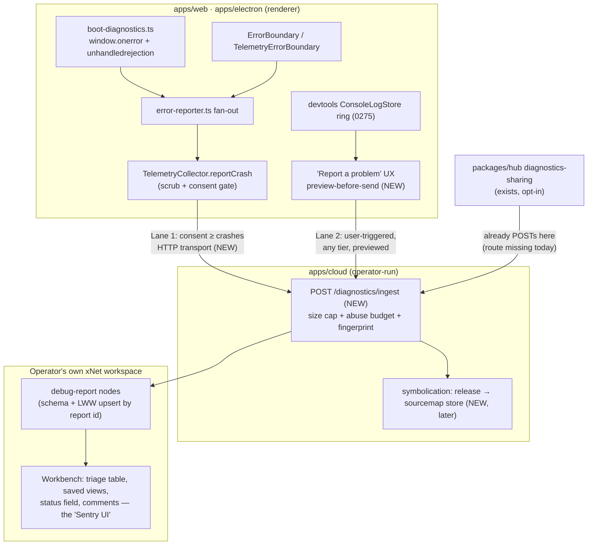
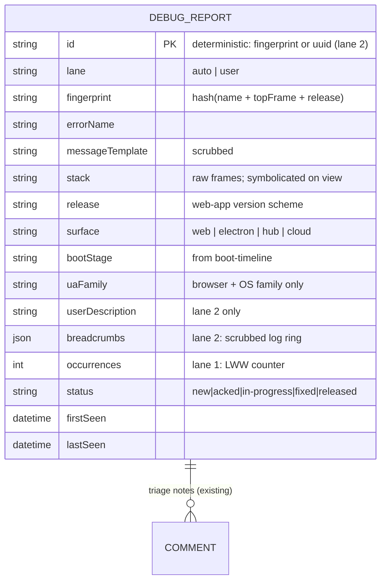
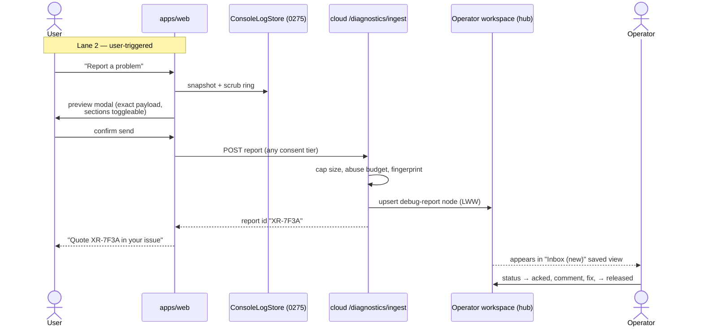
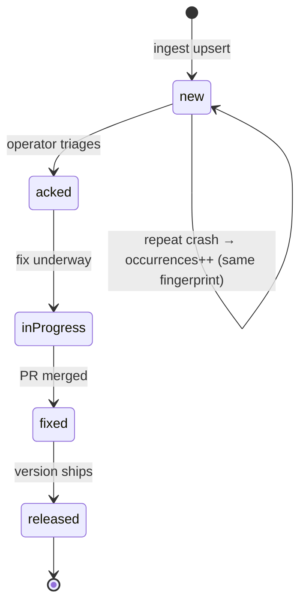

# First-Party Error Telemetry And A Debug-Report Console (The "Own Sentry" Question, Settled)

> Status: EXPLORATION
> Date: 2026-07-13
> Related: [[0210_ERROR_MONITORING_PRIVACY_ANALYTICS_AND_CONSENT_ACROSS_SURFACES]]
> (implemented — this doc is its sequel),
> [[0187_HUB_HOSTED_TELEMETRY_STORE_AND_ANALYTICS_DASHBOARD]] (implemented),
> [[0275_DEVTOOLS_LOG_PERSISTENCE]] (implemented — the breadcrumb source),
> [[0233_SELF_HOSTING_BUILD_CONSOLE]] (the xNet-in-xNet precedent),
> [[0303_STRUCTURED_ERRORS_TAGGEDERROR]] (error taxonomy).

## Problem Statement

Four questions, asked together:

1. **How are we logging errors today** in the demo/web app and in the cloud?
2. **What can we add** to improve telemetry and debugging?
3. **Should we integrate Sentry?**
4. Can we stay **privacy-preserving** while letting users who *want to* share
   debug and error/crash data — including building **our own Sentry-alternative
   UX** to process custom telemetry reports, given the unique nature of the
   product?

Exploration 0210 (implemented) built the consent spine and wired every seam.
What it deliberately deferred — "pick a vendor, mint a DSN" — is exactly the
decision this doc makes. The answer changes shape now that we're explicitly
willing to build our own processing UX: the question is no longer *"Sentry or
GlitchTip?"* but *"do we need the Sentry protocol at all, and where should
reports land so a solo operator can actually triage them?"*

## Executive Summary

- **Error logging today is a well-built pipeline that dead-ends before any
  human can see it.** The web app has global handlers, a consent-gated
  fan-out reporter, scrubbing, a settings panel, and a first-run banner (all
  from 0210). The cloud has a structured JSON logger, request logging, and a
  global `app.onError`. But: **no `@sentry/*` SDK is installed anywhere**,
  both DSN variables are unset, the first-party crash collector stores
  reports **locally only** (no HTTP transport ever ships them), and the hub's
  opt-in diagnostics-sharing feature forwards to a cloud ingest route **that
  does not exist**. Every road is paved; none reaches a destination.

- **Verdict on Sentry: don't integrate it.** Keep the dormant CDN/dynamic
  seams as a documented escape hatch, but do not mint a DSN or install SDKs.
  Reasons: (a) the SDK's default posture is *send-everything, devs opt out
  via `beforeSend`* — the exact inverse of our consent-first, review-before-
  send UX; (b) `@sentry/browser` is a 27–45 KB gzip client tax for
  capabilities we've mostly rebuilt; (c) self-hosting Sentry is 16 GB RAM /
  20+ containers; (d) a third-party error SaaS is off-brand for a product
  whose pitch is "we can't read your data." If we ever want a Sentry-shaped
  backend, **Bugsink** (single container, SQLite) or **GlitchTip** (MIT,
  Sentry-SDK compatible) are the proven small-footprint options — that
  escape hatch is real and stays open precisely because our seams are
  vendor-neutral.

- **Build the missing middle, not a Sentry clone.** Three pieces are absent:
  (1) a **transport** from the client's already-consent-gated crash collector
  to an ingest endpoint; (2) the **ingest endpoint** itself (which the hub
  feature already tries to POST to); (3) a **triage surface** where the
  operator reads, groups, and resolves reports. Grouping, fingerprinting,
  and a report detail view are a weekend of code on top of what exists —
  symbolication is the only genuinely hard part, and server-side source-map
  resolution is a solved pattern.

- **The triage console should be xNet itself.** This is the "unique nature of
  our product" card: xNet *is* a local-first data workspace with schemas,
  tables, saved views, comments, and tasks. Debug reports become **nodes in
  an operator workspace** (`debug-report` schema), synced to the operator's
  own hub. The workbench then gives us for free what Sentry sells: filterable
  tables (by release, browser, fingerprint), status workflows (new → acked →
  fixed), comments/mentions for triage, and dashboards. We dogfood the
  platform on our own production pain — the same move as the 0233
  self-hosting build console.

- **Two lanes, borrowed from the best prior art** (Firefox, Signal, KDE,
  Home Assistant — see External Research):
  - **Lane 1 — automatic crash pings** (consent tier ≥ `crashes`): tiny,
    fully structured, allowlisted fields only (no free text), scrubbed,
    fingerprinted, rate-limited. What 0210 designed; we add the transport.
  - **Lane 2 — user-triggered debug reports** ("Report a problem"): the user
    explicitly composes a report bundling the boot timeline, the scrubbed
    devtools log ring (0275), system info, and their own description — and
    **sees the exact payload before sending** (Firefox's preview-before-send,
    Signal's submit-debug-log). Because it's user-initiated, it works at any
    consent tier, and it's the lane that actually debugs the hard cases.



## Current State In The Repository

Everything below was verified against the tree at time of writing.

### Demo / web app (`apps/web`) — capture: strong; export: none

- **Global handlers exist and run before React mounts.**
  [apps/web/src/lib/boot-diagnostics.ts](../../apps/web/src/lib/boot-diagnostics.ts)
  installs `window.addEventListener('error')` + `('unhandledrejection')`,
  stamps `window.__xnetBootError` with the furthest boot stage from
  [boot-timeline.ts](../../apps/web/src/lib/boot-timeline.ts), and
  `installBootFallback()` paints an actionable "xNet couldn't start" screen if
  `#root` is still empty after 12 s. Wired in
  [main.tsx](../../apps/web/src/main.tsx) before storage boot (0210 P0).
- **A vendor-neutral fan-out reporter exists.**
  [apps/web/src/lib/error-reporter.ts](../../apps/web/src/lib/error-reporter.ts)
  (active only when `VITE_XNET_TELEMETRY === 'on'`) fans each failure to
  (a) the first-party `TelemetryCollector.reportCrash(...)` and (b) a Sentry
  adapter gated on `consent.allowsTier('crashes')`.
- **The Sentry adapter is a seam, not an integration.**
  [apps/web/src/lib/sentry.ts](../../apps/web/src/lib/sentry.ts) injects the
  CDN loader only if `VITE_SENTRY_DSN` is set (`sendDefaultPii: false`,
  `beforeSend: scrubTelemetryData`). No `@sentry/*` appears in any
  `package.json`; `WEB_SENTRY_DSN` / `CLOUD_SENTRY_DSN` are unset repo
  variables. **All Sentry paths are no-ops today.**
- **Consent spine is one source of truth** (0210 P3):
  `ConsentManager` tiers `off → local → crashes → anonymous → identified`
  ([packages/telemetry/src/consent/](../../packages/telemetry/src/consent/)),
  app singleton [consent.ts](../../apps/web/src/lib/consent.ts), the
  "Privacy & Diagnostics" panel in
  [settings.tsx](../../apps/web/src/routes/settings.tsx), first-run
  [ConsentBanner.tsx](../../apps/web/src/components/ConsentBanner.tsx), and a
  "what we know about you" mirror that enumerates/purges the local collector.
- **Gap — the top-level React boundary is mute.** `<ErrorBoundary>` at
  [App.tsx:367](../../apps/web/src/App.tsx) passes **no `onError`**, so render
  errors it catches only `console.error` and never reach `error-reporter`.
  The purpose-built `TelemetryErrorBoundary`
  ([packages/telemetry/src/hooks/TelemetryErrorBoundary.tsx](../../packages/telemetry/src/hooks/TelemetryErrorBoundary.tsx))
  is still unused by `apps/web` — noted in 0210 and still true.
- **Gap — crash reports never leave the device.** `reportCrash` stores to the
  local IndexedDB buffer; the "real HTTP transport" was 0210 P3's deferred
  item and remains unbuilt. There is **no ingest URL, ever, for app crashes.**
- **Breadcrumbs exist but aren't attached in-app**: the devtools
  `ConsoleLogStore` provider-lifetime ring + sessionStorage "Preserve log"
  (0275, [packages/devtools/src/core/log-store.ts](../../packages/devtools/src/core/log-store.ts))
  and the boot timeline are exactly the breadcrumb sources a report needs.
- **Gap — no user-facing report UX at all.** No "Report a bug", no "Copy
  debug info", no diagnostics export anywhere in `apps/web`, `packages/
  devtools`, or `apps/electron`.

### Cloud control plane (`apps/cloud`) — logging: done; ingest: missing

- **Structured JSON logger** ([logger.ts](../../apps/cloud/src/logger.ts),
  zero-dep, `LOG_LEVEL`-aware), **request logging middleware** and a **global
  `app.onError`** returning a clean 500
  ([server.ts](../../apps/cloud/src/server.ts)) — all shipped by 0210 P1,
  with tests ([error-handling.test.ts](../../apps/cloud/src/error-handling.test.ts)).
- **Sentry bridge is dormant**: [sentry.ts](../../apps/cloud/src/sentry.ts)
  dynamically imports `@sentry/node` only if both the SDK and `SENTRY_DSN`
  exist; neither does.
- **Operational metrics ≠ error tracking**: the SLI engine, fleet health, and
  k-anon usage rollups ([observability/](../../apps/cloud/src/observability/),
  `/status.json`, the public `/open` dashboard) answer "is the service up?",
  not "what exception did user X hit?".
- **Gap — no diagnostics ingest route.** Nothing in `apps/cloud` handles
  `POST /diagnostics/*`. See next bullet for why that matters.

### Hub (`packages/hub`) — the forwarder with no destination

- The opt-in **diagnostics-sharing feature is fully implemented** (0210 P4):
  [packages/hub/src/features/diagnostics-sharing.ts](../../packages/hub/src/features/diagnostics-sharing.ts)
  is off unless both `XNET_DIAGNOSTICS_URL` + `XNET_DIAGNOSTICS_SECRET` are
  set, hashes the sender DID, hard-caps reports at `MAX_REPORT_BYTES = 8_000`,
  and forwards to the upstream with `x-internal-secret`. **But the upstream
  route it POSTs to was never built** — the feature is a plug with no socket.
- **Gap — the hub itself logs ad-hoc**: no structured logger, no global
  `app.onError` in [server.ts](../../packages/hub/src/server.ts); per-route
  `try/catch` + `console.*` only. It does have `/health`, `/ready`,
  `/health/badge`, Prometheus `/metrics`, and the first-party
  `POST /telemetry/ingest` (0187) with DID hashing.

### Electron (`apps/electron`) — effectively unmonitored

- **No `crashReporter`, no `@sentry/electron`, no `uncaughtException`
  handler.** The only signal is a boot-trace `unhandledRejection` stderr line
  in [main/index.ts](../../apps/electron/src/main/index.ts) feeding the CI
  smoke gate. Renderer/main/data-process logging is ad-hoc `console.*`.

### Error taxonomy

- `TaggedError` ([packages/core/src/errors/tagged.ts](../../packages/core/src/errors/tagged.ts),
  0303) has two production subclasses (`PermissionError`, `NodeRelayError`).
  Tagged errors are narrowed at catch sites but **never routed to any
  central reporter** — there is no error→telemetry interceptor.

### Summary table

| Surface | Capture | Scrub/consent | Transport off-device | Triage UI |
|---|---|---|---|---|
| Web app | ✅ global handlers, reporter fan-out | ✅ spine + scrubber | ❌ none (local buffer only) | ❌ none |
| Cloud | ✅ logger + `onError` | n/a (operator's own) | ❌ Sentry seam dormant | ❌ (logs only) |
| Hub | ⚠️ ad-hoc console | ✅ DID hashing, 8 KB cap | ⚠️ forwards to a route that doesn't exist | ✅ own 0187 dashboard (hub-local) |
| Electron | ❌ nearly nothing | ❌ | ❌ | ❌ |

## External Research

### Sentry: what adopting it would actually mean

- Self-hosted Sentry needs **4 cores / 16 GB RAM minimum** and runs 20+
  containers (Kafka, ClickHouse, Snuba, Relay, Postgres, Redis…)
  ([develop.sentry.dev/self-hosted](https://develop.sentry.dev/self-hosted/)).
  Non-starter for a solo operator.
- The JS SDK is **~27 KB gzip core, ~45 KB with tracing, ~83 KB with replay**
  ([bundlephobia](https://bundlephobia.com/package/@sentry/browser)) — a real
  tax on a PWA already fighting a >6 MB-chunk limit (0297 gotcha).
- SDK privacy controls are good but **opt-out-shaped**: `sendDefaultPii`
  defaults off, and `beforeSend`/`beforeBreadcrumb` let you scrub or drop
  ([docs](https://docs.sentry.io/platforms/javascript/data-management/sensitive-data/)) —
  but the model is "capture everything, filter on the way out," the inverse
  of consent-first.
- License is **FSL** (source-available, converts to Apache-2.0 after 2 years)
  ([sentry blog](https://blog.sentry.io/introducing-the-functional-source-license-freedom-without-free-riding/)).
- The **envelope wire protocol is simple** — newline-delimited JSON, one
  `POST /api/{project}/envelope/` endpoint
  ([spec](https://develop.sentry.dev/sdk/foundations/envelopes/)) — which is
  why minimal ingest-only servers exist
  ([Urgentry](https://urgentry.com/guides/fundamentals/what-is-a-sentry-envelope/):
  single Go binary + SQLite).

### Lightweight Sentry-compatible alternatives (the escape hatches)

| Project | Footprint | SDK compat | License |
|---|---|---|---|
| [GlitchTip](https://glitchtip.com/) | ~512 MB–1 GB, few containers | full (swap DSN) | MIT |
| [Bugsink](https://www.bugsink.com/) | **1 container, SQLite**; ~30 events/s on 2 vCPU/4 GB | full (swap DSN) | Polyform Shield |
| [Telebugs](https://telebugs.com/) | 1–2 GB | full | commercial one-time |
| [HyperDX](https://www.hyperdx.io/) / LGTM stack | ClickHouse / multi-component | OTel, **not** Sentry | MIT / AGPL mix |

The existence of Bugsink/GlitchTip proves a small Sentry-shaped backend is a
solved problem — and therefore that keeping our **vendor-neutral seams** (not
the protocol) is the only compatibility we need to preserve.

### Consent-first crash reporting prior art (the patterns we're stealing)

- **Firefox** — automatic submission **off by default**; after a crash the
  user reviews the report (with a checkbox to strip the page URL) and decides;
  `about:crashes` lists unsent local reports
  ([docs](https://support.mozilla.org/en-US/kb/crash-report),
  [crashreporter source docs](https://firefox-source-docs.mozilla.org/toolkit/crashreporter/crashreporter/)).
  → **preview-before-send, per-field strip toggles, local queue.**
- **Signal** — "Submit Debug Log" is entirely **user-triggered**: redact
  client-side, upload, hand the user a `debuglogs.org/<key>` URL they paste
  into an issue ([support](https://support.signal.org/hc/en-us/articles/360007318591-Debug-Logs-and-Crash-Reports)).
  Cautionary tale: their regex redaction has shipped real leaks
  ([Signal-Desktop#2869](https://github.com/signalapp/Signal-Desktop/issues/2869),
  [Signal-iOS#2540](https://github.com/signalapp/Signal-iOS/issues/2540)).
  → **user-triggered reports + report-ID handoff; and: allowlist structured
  fields, don't regex free text.**
- **KDE KUserFeedback** — discrete numbered tiers (disabled → basic system →
  usage → detailed) plus a policy that **forbids unique identifiers outright**
  ([repo](https://github.com/KDE/kuserfeedback)). → matches our tier spine;
  adopt "no unique IDs" as a hard rule for Lane 1.
- **Home Assistant** — crash reporting and usage analytics are **separate
  toggles**, everything off by default
  ([docs](https://www.home-assistant.io/integrations/analytics/)).
  → keep Lane 1 and analytics independently toggleable (we already do).
- **VS Code** — `off / crash / error / all` telemetry levels
  ([docs](https://code.visualstudio.com/docs/configure/telemetry)) — the
  industry-normal shape of our existing tiers.
- **Aptabase** — privacy-first app analytics: no fingerprinting, daily-rotated
  salt; AGPL server + MIT SDKs
  ([repo](https://github.com/aptabase/aptabase)); they repurpose the event
  pipe for Tauri panic capture
  ([blog](https://aptabase.com/blog/catching-panics-on-tauri-apps)).

### Scrubbing and symbolication techniques

- **Single auditable redaction hook** right before serialization (the
  `beforeSend` pattern), built on `structuredClone()` + a recursive
  **field allowlist** — not regex blocklists over free text (Signal's lesson).
  Datadog's [scrubbing-rule catalog](https://docs.datadoghq.com/logs/guide/commonly-used-log-processing-rules/)
  is a good defense-in-depth regex set for the log-ring lane.
- **Source maps stay server-side**: upload maps at deploy time keyed by
  release, strip `sourceMappingURL`/`.map` from the served bundle, and
  symbolicate in the console on demand
  ([Sentry](https://docs.sentry.io/platforms/javascript/sourcemaps/),
  [PostHog](https://posthog.com/docs/error-tracking/stack-traces)). (Our code
  is open source, so this is hygiene rather than secrecy — but it keeps served
  bundles lean and stack handling uniform.)
- **Electron minidumps are a real PII hazard** — Crashpad memory snapshots can
  contain env vars, paths, and in-memory form fields including passwords
  ([arXiv: Crashing Privacy](https://arxiv.org/pdf/1808.01718)). A minidump
  cannot be meaningfully redacted client-side. Electron's
  `crashReporter.start({ uploadToServer: false })` exists as a
  capture-locally-review-later primitive
  ([docs](https://www.electronjs.org/docs/latest/api/crash-reporter)), but
  **v1 should skip native dump capture entirely** and stay at the JS level
  where we control the payload shape.

## Key Findings

1. **0210 finished the hard, principled work (consent, scrubbing, gating) and
   stopped exactly at the vendor decision.** Nothing needs re-architecting;
   the pipeline needs a destination.
2. **Three concrete dead-ends today:** crash reports buffer locally with no
   transport; the hub diagnostics forwarder POSTs to a nonexistent cloud
   route; both DSN variables are unset so the Sentry seams no-op. Plus two
   mute capture points: the top-level `ErrorBoundary` (no `onError`) and
   Electron (nothing at all).
3. **Sentry's value decomposes into parts we mostly have or don't want.**
   Capture + scrubbing + consent: built. Grouping + triage UI: our product
   can natively host. Symbolication: a bounded server-side feature.
   Alerting: a webhook. The one thing we'd truly buy — the SDK's maturity —
   comes bundled with an opt-out posture and 30–80 KB we don't want.
4. **The product is the console.** Debug reports as nodes in an operator
   workspace turn triage into the same tables/views/comments users already
   have — dogfooding that also pressure-tests schemas, sync, and views with
   real operational data (the 0233 xNet-in-xNet move).
5. **Two lanes beat one:** tiny structured automatic pings (tier ≥ `crashes`)
   for *fleet* visibility, and rich user-triggered previewed reports for
   *depth*. All prior art that users trust separates these.
6. **User-triggered reports are consent-tier-independent** — an explicit
   "send this report" click *is* the consent for that payload, which is why
   Signal's flow works at zero ambient telemetry. The preview modal is what
   makes that claim honest.

## Options And Tradeoffs

### Option A — Mint a Sentry (SaaS, EU) DSN and activate the 0210 seams

- **Pros:** hours of work; best-in-class symbolication/grouping/alerts.
- **Cons:** third-party processor for a "we can't read your data" brand; CDN
  script + SDK weight; per-event pricing; FSL SaaS dependency; the custom
  debug-report lane still has to be built separately anyway.

### Option B — Self-host a Sentry-compatible backend (Bugsink/GlitchTip)

- **Pros:** proven small footprint (1 container for Bugsink); real SDKs; the
  dormant seams work unchanged (set DSN, done).
- **Cons:** another service to run and secure; the UI is theirs, not ours —
  no workspace integration; still inherits SDK-culture defaults client-side;
  Lane 2 (previewed user reports) is still custom work on top.

### Option C — First-party ingest + a plain admin page in the cloud dashboard

- **Pros:** smallest total system; everything ours; no new client deps.
- **Cons:** we'd hand-build tables, filtering, saved views, statuses, and
  comments — i.e., re-implement a worse version of our own product beside it.

### Option D — First-party ingest + **xNet-native triage workspace** (recommended)

- **Pros:** ingest is one route + one schema; the workbench already provides
  the triage UI (tables, filters, saved views, status fields, comments);
  reports sync to the operator's hub like any other data — same durability,
  same access control; deep dogfooding; zero third parties; the story
  ("we built our error console *inside* xNet") is itself marketing.
- **Cons:** a new registered schema (seed-coverage + authz obligations);
  report-detail ergonomics (stack rendering, symbolication) need a small
  custom surface; grouping/fingerprinting logic is ours to write and tune;
  no off-the-shelf alerting (add a webhook later).

| | A: Sentry SaaS | B: Bugsink/GlitchTip | C: admin page | D: xNet-native |
|---|---|---|---|---|
| Client weight | +27–45 KB | +27–45 KB (SDK) or none | none | none |
| Server burden | none | 1+ containers | tiny | tiny (reuses hub) |
| Triage UI quality | excellent | good | poor (hand-built) | good (it's the product) |
| Brand/privacy fit | weak | ok | strong | **strongest** |
| Lane 2 (previewed reports) | still custom | still custom | custom | custom (shared) |
| Escape hatch kept | is the hatch | is the hatch | yes (seams) | yes (seams) |

## Recommendation

**Option D, phased; keep the Sentry seams dormant as the documented escape
hatch.** Do not install `@sentry/*`; do not mint DSNs.

### Phase 0 — close the capture gaps (no new product surface)

Wire the mute points into the existing reporter: `onError` on the top-level
`ErrorBoundary` (or swap in `TelemetryErrorBoundary`); Electron main-process
`uncaughtException`/`unhandledRejection` → structured stderr + the renderer's
existing reporter; give the hub the cloud's zero-dep JSON logger pattern and
a global `app.onError`. Skip native minidumps entirely (research above).

### Phase 1 — the ingest route + Lane 1 transport

`POST /diagnostics/ingest` on the cloud: verifies `x-internal-secret` (hub
lane) or accepts anonymous app crash pings with strict caps (reuse the hub's
8 KB bound), abuse-budgeted, computes a **fingerprint**
(`hash(errorName + topAppFrame + release)`), and upserts a `debug-report`
node into the operator workspace via the operator's hub (deterministic ID →
LWW upsert, the dev-tools seed pattern — repeat crashes bump a counter
instead of flooding). Client side: a small HTTP transport in
`@xnetjs/telemetry` that ships `reportCrash` payloads when
`VITE_XNET_TELEMETRY === 'on'` **and** tier ≥ `crashes`, batched, capped,
with the ingest origin added to the app CSP `connect-src` (the 0300 gotcha).
Lane 1 payloads are **allowlisted structured fields only** — no free text, no
unique IDs (the KDE rule): error name/message-template, stack, release, boot
stage, UA family, consent tier.

### Phase 2 — Lane 2: "Report a problem" with preview-before-send

An entry point in Settings → Privacy & Diagnostics, in the boot-failure
screen, and in the error-boundary fallback. It composes: user description +
boot timeline + `lastBootPhase()` + scrubbed `ConsoleLogStore` ring (0275) +
app version + system info. The modal shows the **exact JSON payload**
(collapsible sections, per-section include/exclude checkboxes — Firefox's
URL-checkbox generalized). On send: same ingest route, returns a short
**report ID** the user can paste into a GitHub issue (Signal's handoff).
Works at any consent tier because the send is itself the consent.

### Phase 3 — the console: `debug-report` schema + triage workspace

Define the schema (fields below), register it with authz (0192/0304
obligations) and either a Tier-1 seeder or a `SEED_EXCLUDED_SCHEMA_IDS`
entry (it's operator-facing meta-infrastructure → exclusion is right).
Triage lives in ordinary workbench views: "Inbox (new)", "By release",
"By fingerprint" saved views; a status field (`new → acked → in-progress →
fixed → released`); comments for investigation notes. Add one custom
report-detail panel for stack rendering.



### Phase 4 (later, on demand) — symbolication + alerting

Deploy workflow uploads source maps keyed by release to the cloud (private
store); the report-detail panel symbolicates server-side on view; strip
`.map` files from the served bundle. Alerting = a webhook on first-seen
fingerprints (the 0213 `defineAction` machinery already exists).





## Example Code

### Cloud ingest route (Phase 1, sketch)

```ts
// apps/cloud/src/diagnostics.ts
const MAX_REPORT_BYTES = 8_000 // mirror the hub's cap

app.post('/diagnostics/ingest', async (c) => {
  const raw = await c.req.text()
  if (raw.length > MAX_REPORT_BYTES) return c.json({ error: 'too_large' }, 413)
  if (!(await budget.allow('diagnostics', clientKey(c)))) return c.json({ error: 'rate_limited' }, 429)

  const report = parseReport(raw) // zod: allowlisted fields only; unknown keys stripped
  const fingerprint = blake3(`${report.errorName}${topAppFrame(report.stack)}${report.release}`)
  const id = report.lane === 'auto' ? `dr-${fingerprint}` : `dr-${crypto.randomUUID()}`

  await opsWorkspace.upsert('debug-report', id, {
    ...report, fingerprint,
    occurrences: report.lane === 'auto' ? increment() : 1,
    lastSeen: now(), status: keepExisting('new'),
  })
  return c.json({ id: shortId(id) })
})
```

### Lane 1 transport, gated exactly like the rest of the spine

```ts
// packages/telemetry/src/sync/crash-transport.ts (new)
export function attachCrashTransport(collector: TelemetryCollector, ingestUrl: string) {
  collector.onCrashReport(async (report) => {
    if (!consent.allowsTier('crashes')) return          // ambient lane needs the tier
    await fetch(`${ingestUrl}/diagnostics/ingest`, {
      method: 'POST',
      body: JSON.stringify(toAllowlistedPayload(report)), // structured fields only
      keepalive: true,                                    // survives page unload
    }).catch(() => { /* never let telemetry break the app */ })
  })
}
```

### Preview-before-send bundle (Phase 2, shape)

```ts
// apps/web/src/lib/debug-report.ts (new)
export async function composeDebugReport(userDescription: string) {
  return {
    lane: 'user' as const,
    userDescription,
    release: APP_VERSION,
    surface: 'web' as const,
    bootStage: lastBootPhase(),
    uaFamily: uaFamilyOnly(navigator.userAgent),   // "Chrome 137 / macOS", nothing more
    breadcrumbs: scrubTelemetryData(consoleLogStore.snapshot()), // 0275 ring, scrubbed
    lastError: window.__xnetBootError ?? null,
  }
  // The modal renders THIS object verbatim; each top-level key has an
  // include-checkbox. What the user sees is byte-for-byte what is sent.
}
```

## Risks And Open Questions

- **Scrubbing fragility (the Signal lesson).** Lane 2 ships log lines —
  free text. Mitigations: the 0275 ring is already scrubbed on snapshot; run
  the telemetry scrubber again at compose time; show the user everything;
  cap retention server-side. Accept that Lane 2 is "user consented to this
  exact payload," not "provably PII-free."
- **Anonymous ingest abuse.** A public POST endpoint invites junk. Size cap +
  `@xnetjs/abuse` budgets + fingerprint-dedup make floods cheap to absorb;
  consider requiring a proof-of-work token or the app's release hash if it
  becomes real.
- **New-schema obligations.** `debug-report` must pass schema-authz coverage
  (0192/0304) and the seed-coverage test — exclusion via
  `SEED_EXCLUDED_SCHEMA_IDS` is the right call (operator meta-infrastructure,
  0276-style). Registering it only in the operator/ops context (not every
  user workspace) is an open design question — does a schema shipped in
  `@xnetjs/plugins` leak into user-facing "new node" pickers?
- **Operator workspace as PII sink.** Reports concentrate in one workspace;
  set a retention policy (auto-archive `released` after N days) and document
  it in the privacy policy (which 0210 already updated for opt-in crash
  reporting — verify wording covers user-triggered reports).
- **CSP.** The ingest origin must be in the app CSP `connect-src` (0300
  taught us the CSP silently blocks unlisted origins).
- **Electron parity.** Renderer inherits the web pipeline, but main-process
  and data-process crashes need their own path (stderr → local file →
  attach to next Lane 2 report is the cheap v1). Native minidumps stay out.
- **When does the escape hatch trigger?** If fingerprint volume or
  symbolication cost outgrows the workspace model, Bugsink (1 container)
  behind the same ingest URL is the fallback — the client contract
  (our JSON, our routes) shouldn't change either way.

## Implementation Checklist

- [x] **P0:** Pass `onError` from the top-level `ErrorBoundary` in
  [App.tsx](../../apps/web/src/App.tsx) into `error-reporter` (or swap in
  `TelemetryErrorBoundary`).
- [ ] **P0:** Electron main: `process.on('uncaughtException'/'unhandledRejection')`
  → structured stderr + local crash file in `userData`.
- [ ] **P0:** Hub: adopt the zero-dep JSON logger pattern + global
  `app.onError` in [packages/hub/src/server.ts](../../packages/hub/src/server.ts)
  (changeset: patch, `@xnetjs/hub`).
- [ ] **P1:** `POST /diagnostics/ingest` in `apps/cloud` — secret-or-anon
  lanes, 8 KB cap, abuse budget, zod allowlist, fingerprint, short report ID;
  this is also the missing socket for
  [diagnostics-sharing.ts](../../packages/hub/src/features/diagnostics-sharing.ts).
- [ ] **P1:** Crash transport in `@xnetjs/telemetry` (consent ≥ `crashes`,
  batched, `keepalive`, fail-silent); wire in
  [error-reporter.ts](../../apps/web/src/lib/error-reporter.ts); add ingest
  origin to CSP `connect-src`; env-gate to official builds only.
- [ ] **P1:** Fingerprint + occurrence-count upsert into the operator
  workspace (deterministic node IDs, LWW).
- [ ] **P2:** `composeDebugReport()` + preview-before-send modal (per-section
  checkboxes, byte-for-byte payload display); entry points in Settings,
  boot-failure screen, and `ErrorFallback`; report-ID handoff UI.
- [ ] **P2:** Re-scrub the 0275 log ring at compose time; add a
  deliberately-PII-laden fixture test for the composed payload.
- [ ] **P3:** `debug-report` schema + authz rungs + `SEED_EXCLUDED_SCHEMA_IDS`
  entry; ops-workspace saved views (Inbox / By release / By fingerprint);
  status field lifecycle; report-detail panel with stack rendering.
- [ ] **P3:** Retention: auto-archive `released` reports after N days;
  privacy-policy wording check for user-triggered reports.
- [ ] **P4:** Deploy-time source-map upload keyed by release; strip `.map`
  from served bundles; server-side symbolication in the detail panel.
- [ ] **P4:** First-seen-fingerprint webhook alert (reuse 0213 actions).
- [ ] Document the Bugsink/GlitchTip escape hatch + the dormant Sentry seams
  in the hub/cloud ops guide; explicitly record the "no `@sentry/*` SDK"
  decision.

## Validation Checklist

- [ ] Forcing a boot failure in the hosted demo (tier ≥ `crashes`) produces a
  `debug-report` node with the failing stage, release, and UA family in the
  operator workspace within a minute.
- [ ] The same failure at tier `off` sends **zero** network calls to the
  ingest (asserted by test), yet "Report a problem" still works and its
  payload matches the preview byte-for-byte.
- [ ] A PII-laden fixture (emails, DIDs, paths, tokens in logs) composes into
  a report with all patterns scrubbed; unknown fields are stripped by the
  ingest zod allowlist.
- [ ] Repeat identical crashes dedupe into one node with `occurrences`
  incrementing — no flood.
- [ ] An enabled hub's diagnostics-sharing POST now lands (the dead-end is
  closed); a default hub still exposes no `/diagnostics/report` route.
- [ ] Oversized (>8 KB) and rapid-fire submissions get 413/429; the abuse
  budget doesn't starve real sync traffic.
- [ ] Self-hosted and PR-preview builds emit no telemetry network calls at
  all (existing 0210 invariant still green).
- [ ] Electron main-process crash leaves a local crash file that attaches to
  the next user-triggered report.

## References

- [docs/explorations/0210_[x]_ERROR_MONITORING_PRIVACY_ANALYTICS_AND_CONSENT_ACROSS_SURFACES.md](0210_%5Bx%5D_ERROR_MONITORING_PRIVACY_ANALYTICS_AND_CONSENT_ACROSS_SURFACES.md) — the implemented predecessor.
- [apps/web/src/lib/boot-diagnostics.ts](../../apps/web/src/lib/boot-diagnostics.ts),
  [error-reporter.ts](../../apps/web/src/lib/error-reporter.ts),
  [sentry.ts](../../apps/web/src/lib/sentry.ts),
  [consent.ts](../../apps/web/src/lib/consent.ts) — the wired seams.
- [packages/telemetry/src/](../../packages/telemetry/src/) — consent spine,
  scrubber, `CrashReport` schema, `TelemetryErrorBoundary` (unused).
- [packages/hub/src/features/diagnostics-sharing.ts](../../packages/hub/src/features/diagnostics-sharing.ts) —
  the forwarder awaiting its socket; [packages/hub/src/routes/telemetry.ts](../../packages/hub/src/routes/telemetry.ts) — 0187 ingest.
- [apps/cloud/src/logger.ts](../../apps/cloud/src/logger.ts),
  [server.ts](../../apps/cloud/src/server.ts) — cloud logging/onError.
- [packages/devtools/src/core/log-store.ts](../../packages/devtools/src/core/log-store.ts) — 0275 breadcrumb ring.
- Sentry: [self-hosted requirements](https://develop.sentry.dev/self-hosted/),
  [envelope protocol](https://develop.sentry.dev/sdk/foundations/envelopes/),
  [sensitive-data scrubbing](https://docs.sentry.io/platforms/javascript/data-management/sensitive-data/),
  [FSL](https://blog.sentry.io/introducing-the-functional-source-license-freedom-without-free-riding/),
  [bundle size](https://bundlephobia.com/package/@sentry/browser).
- Alternatives: [GlitchTip](https://glitchtip.com/), [Bugsink](https://www.bugsink.com/),
  [Telebugs](https://telebugs.com/), [Urgentry envelope notes](https://urgentry.com/guides/fundamentals/what-is-a-sentry-envelope/),
  [GlitchTip vs Sentry vs Bugsink](https://www.bugsink.com/blog/glitchtip-vs-sentry-vs-bugsink/).
- Prior art: [Firefox crash reports](https://support.mozilla.org/en-US/kb/crash-report),
  [Signal debug logs](https://support.signal.org/hc/en-us/articles/360007318591-Debug-Logs-and-Crash-Reports),
  [KDE KUserFeedback](https://github.com/KDE/kuserfeedback),
  [Home Assistant analytics](https://www.home-assistant.io/integrations/analytics/),
  [VS Code telemetry levels](https://code.visualstudio.com/docs/configure/telemetry),
  [Aptabase](https://github.com/aptabase/aptabase) +
  [Tauri panic capture](https://aptabase.com/blog/catching-panics-on-tauri-apps).
- Hazards: [Crashing Privacy — leaked crash reports (arXiv)](https://arxiv.org/pdf/1808.01718),
  [Electron crashReporter](https://www.electronjs.org/docs/latest/api/crash-reporter),
  [Signal redaction leak #2869](https://github.com/signalapp/Signal-Desktop/issues/2869).
- Techniques: [Sentry source maps](https://docs.sentry.io/platforms/javascript/sourcemaps/),
  [Datadog scrubbing rules](https://docs.datadoghq.com/logs/guide/commonly-used-log-processing-rules/).
