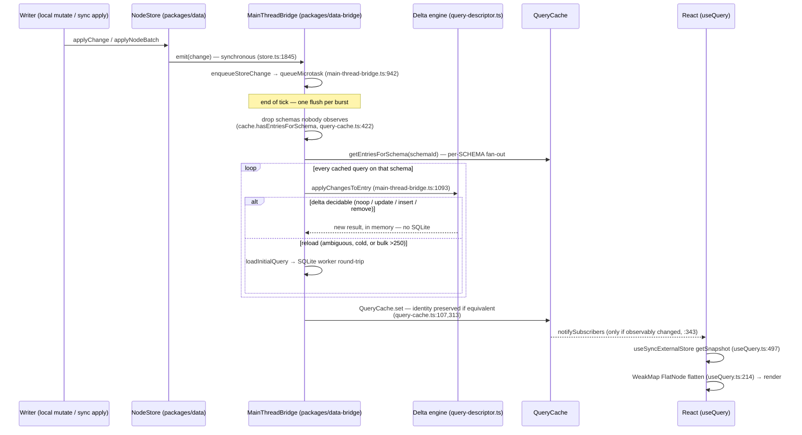
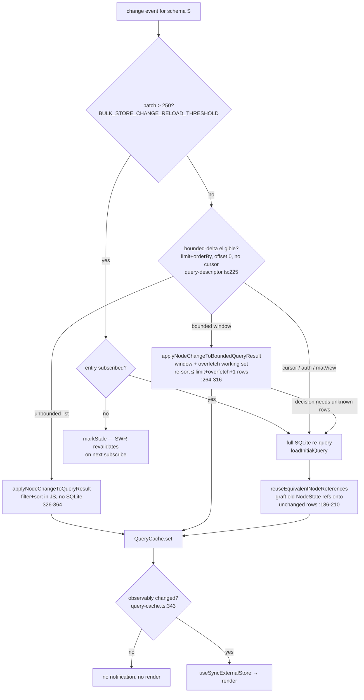
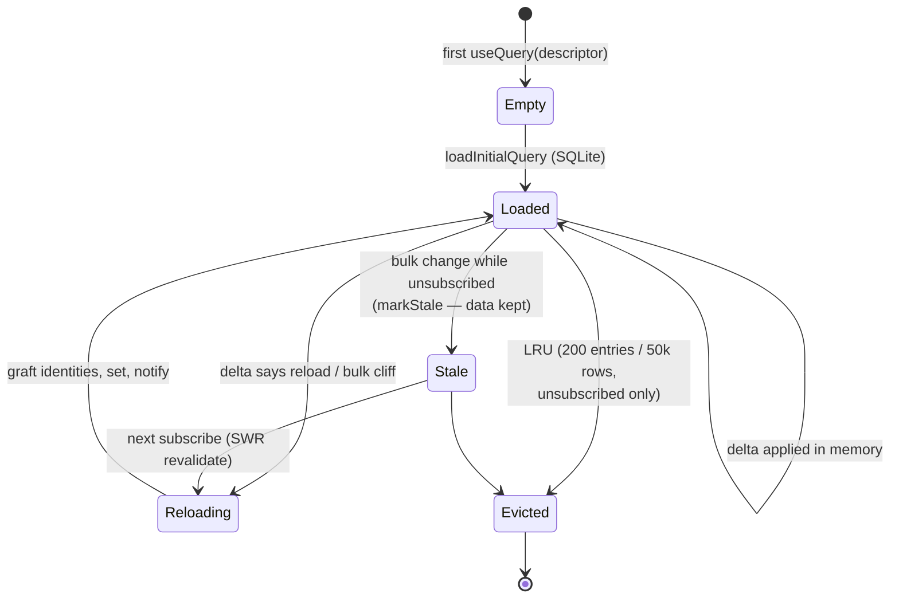

# useQuery Live Reactivity: How It Works, Where It's Slow, And Whether Materialized Views Help

> Status: exploration `[_]` — not yet implemented.
> Lineage: this is the fifth query-perf exploration. It builds on
> [[0163]]/[[0164]] (delta engine, worker topology), 0182 (`USEQUERY_USEMUTATE_PERFORMANCE_FRONTIER`),
> 0262/0263 (worker queue, SWR cache), 0264 (read-speed levers, aggregated
> hydration), and 0266 (`QUERY_PERF_ENDGAME` — recovered from git
> `7705a1851`; the doc is not checked out in this tree). Where those docs
> answered "how fast is one query", this one answers "how does a *change*
> become a *render*, and what does that cost at fleet scale".

## Problem Statement

Three questions, asked directly:

1. **How is live React reactivity implemented in `useQuery`?** What is the
   exact path from a data change (local mutation or synced change) to a React
   re-render?
2. **How might it be improved** to be more efficient and performant?
3. **Do materialized views help** with live query performance?

The short answers: (1) a change-event pipeline with an in-memory delta engine
that is already more sophisticated than most of the field; (2) yes — but the
leverage is in *invalidation precision* and *activating built-but-disabled
machinery*, not in rendering micro-optimizations; (3) mostly **no** as built —
xNet already has SQLite-side materialized-view tables with zero production
opt-in, and the reason they don't pay is instructive: a materialization is
only as good as the precision of its invalidation.

## Executive Summary

- **The reactivity path is: store emit (sync) → bridge microtask coalescing →
  per-schema fan-out over cached queries → per-node delta application in JS →
  identity-preserving cache write → `useSyncExternalStore` → WeakMap-cached
  row flattening → render.** Unchanged rows keep referential identity end to
  end; no-op changes are suppressed before React ever sees them.
- **xNet already implements what the industry calls "differential watch
  queries" plus IVM-lite.** Compared with cr-sqlite, PowerSync, PGlite,
  Drizzle, and LiveStore — all of which re-run the full SQL on any write to a
  dependent table — xNet's bounded-window delta engine
  (`packages/data-bridge/src/query-descriptor.ts`) maintains most live results
  *in memory without touching SQLite at all*. The field's "upgrade path"
  (commit coalescing, result diffing, structural sharing, read-set scoping) is
  already shipped here.
- **The residual costs are structural, and they are all invalidation-shaped:**
  1. **Candidate selection is per-schema.** Every change to a schema visits
     *every* cached query on that schema, even queries whose `where` provably
     cannot match the changed node. Cost scales with (queries on schema ×
     changes), and hot schemas (`task`, `message`) host dozens of hooks.
  2. **A bulk cliff at 250 changes** converts every subscribed query on the
     affected schemas into a full SQLite reload + full snapshot serialization
     across the worker boundary — discarding the delta engine exactly when it
     would help most.
  3. **A reload tail**: cursor-paginated, authorization-filtered, and
     custom-property-sorted queries never enter the delta path; each matching
     edit re-executes them, and the custom-sort case is a full-schema JS
     scan-and-sort because adaptive indexing ships disabled.
  4. **Snapshot granularity**: data and metadata share one snapshot object, so
     metadata-only updates can wake data-only readers (0182's one unchecked
     item).
- **Materialized views: retire the SQLite-side machinery, keep the in-memory
  one.** `node_query_materializations` (~400 lines) is invalidated per-schema
  on any write — so it can never beat the in-memory SWR cache that has the
  same invalidation granularity and no I/O. The industry data agrees: no
  production system does IVM over arbitrary SQL client-side; the two that do
  real IVM (Zero, TanStack DB) restricted their query language to make it
  tractable, and re-run-with-diffing wins for small windowed results
  (PGlite's and PowerSync's explicit guidance, Riffle's measured finding).
  xNet's query descriptors *are* a restricted IR — which is why the in-memory
  delta engine works — and that engine **is** the materialized view. The
  investment should go into making its invalidation more precise, not into
  persisting it.

Recommended path (detail in [Recommendation](#recommendation)): **(P1)**
predicate-aware candidate selection in `QueryCache`; **(P2)** soften the bulk
cliff; **(P3)** close the reload tail by activating property-sort pushdown and
pushing down cursors (0266's top items — activation, not construction);
**(P4)** split data/metadata snapshots; **(P5)** delete the unused
materialized-view tables.

## Current State In The Repository

### The full path, verified



### 1. The hooks — `packages/react/src/hooks/`

- **`useQuery.ts`** subscribes via `useSyncExternalStore`
  (`useQuery.ts:497-501`) to a subscription object from
  `bridge.query(schema, options)` (`useQuery.ts:452-470`). The subscription
  key is the **canonical serialized query descriptor**
  (`serializeQueryDescriptor`) — schemaId + where + orderBy + limit/offset/
  cursor + spatial/search/mode/source — not a table or node id. The hook
  memoizes on this key and reuses the previous descriptor object when the key
  is unchanged, so inline filter literals don't churn identity
  (`useQuery.ts:426-470`).
- **Identity stability**: a module-level `WeakMap<NodeState, FlatNode>`
  (`useQuery.ts:214-225`) means an unchanged row always flattens to the same
  object; the list `useMemo` returns the previous *array* when every element
  kept identity (`useQuery.ts:513-545`) — memoized children skip re-render.
- **`useInfiniteQuery.ts`** is a thin wrapper (`useInfiniteQuery.ts:140`) that
  models the loaded region as one growing `limit + orderBy` window (no
  cursors) precisely so it stays on the bounded-delta fast path — the 0182
  "live window" reframe.
- **`useMutate.ts`** uses a subscribe-on-read pending model
  (`useMutate.ts:268-303`): components that never read `isPending` pay zero
  re-renders per mutation. Reactivity from writes comes back through the
  store→bridge→cache path, not through the mutate hook.

### 2. Invalidation fan-out — `packages/data-bridge/`

Two parallel implementations share the machinery: `main-thread-bridge.ts`
(**production default**) and `worker/data-worker-host.ts` (the worker runtime,
still flag-gated behind `xnet:runtime`). Both hold a **`QueryCache`**
(`query-cache.ts`): `Map<serializedDescriptor, CacheEntry>` where each entry
carries `data`, an optional bounded `workingSet`, subscribers, `schemaId`,
`metadata`, and a `stale` flag.

**Granularity: per-schema candidate selection, then per-node predicate-aware
delta application.**

- The store emits change events synchronously (`store.ts:1845-1870`).
- The bridge coalesces them into **one microtask flush**
  (`enqueueStoreChange` → `queueMicrotask(flushStoreChanges)`,
  `main-thread-bridge.ts:942-981`). No rAF/timer — end-of-tick.
- **Read-set scoping** (0263): schemas with no cached queries are dropped
  before any work (`cache.hasEntriesForSchema`,
  `main-thread-bridge.ts:964-972`).
- **Fan-out**: `handleStoreChangeSet` groups events by schema and visits
  **every** entry from `cache.getEntriesForSchema(schemaId)`
  (`main-thread-bridge.ts:990-1011`) — regardless of whether the changed node
  could match each query's `where` or window. There is no node→query or
  predicate→query index.
- **Per-entry delta**: `applyChangesToEntry` → `applyChangeToEntryState`
  (`main-thread-bridge.ts:1093-1219`) dispatches into the delta engine.

### 3. The delta engine — `query-descriptor.ts` (IVM-lite)



Key properties:

- **Most live updates never touch SQLite.** Unbounded lists are maintained
  fully in JS; bounded windows keep an overfetch buffer
  (`BOUNDED_QUERY_OVERFETCH`) so inserts/removals inside the window re-sort a
  handful of rows.
- **SQLite re-runs happen only when**: the delta is ambiguous (`reload`), the
  entry was never loaded, or the burst exceeds
  `BULK_STORE_CHANGE_RELOAD_THRESHOLD = 250`
  (`main-thread-bridge.ts:99`).
- **Identity survives even reloads**: `reuseEquivalentNodeReferences` deep-
  compares and grafts previous `NodeState` references onto unchanged rows;
  `QueryCache.set` preserves the previous *array* identity when nothing
  changed and suppresses notification entirely (`query-cache.ts:107-112,
  313-347`). A 1000-change sync burst produces roughly one render per
  subscribed query whose result actually changed — not 1000.

### 4. The execution layer below — `packages/sqlite`, `packages/data`

When a reload does happen, its cost profile (0263/0264 lineage, verified):

- **Topology**: main thread → Comlink → data worker → Comlink port → SQLite
  worker (wa-sqlite, OPFS SAH pool — inherently single-connection/serial).
  **Two structured-clone boundaries** per result set
  (`packages/data-bridge/src/worker/port-sqlite-adapter.ts`); follower tabs
  add a third hop via the SharedWorker router
  (`packages/sqlite/src/adapters/web-leader.ts`, `web-router-worker.ts`).
- **Storage shape**: EAV — `nodes` + `node_properties(node_id, property_key,
  value BLOB /* JSON text */)` + a rebuildable typed sidecar
  `node_property_scalars` for planning (`packages/sqlite/src/schema.ts:30-79`).
- **The hot path is good**: the fused one-RPC CTE
  (`packages/data/src/store/query-compiler.ts:448-477`) pushes scalar
  equality filters through the typed sidecar's partial indexes and hydrates
  via `json_group_object` (aggregated hydration, default **on**,
  `packages/data/src/store/sqlite-adapter.ts:429`) — one row per node, one
  RPC, then two `JSON.parse` per node (`hydration.ts:130-136`).
- **The fallback path is bad**: any non-scalar `where`, FTS/spatial, or — by
  default — **any `orderBy` on a custom property** returns `null` from the
  compiler and falls to `listNodesOptimized` + full JS filter and
  `[...nodes].sort()` (`packages/data/src/store/query.ts:687-716`). Custom-
  property sort pushdown exists but is gated behind
  `adaptiveIndexingEnabled = false` by default
  (`sqlite-adapter.ts:249`).
- **Statement cache**: LRU of 64 prepared handles keyed by exact SQL text
  (`packages/sqlite/src/adapters/stmt-cache.ts:24`); the query builders pad
  parameter arities into buckets to stay on it. Identical concurrent reads
  are coalesced in the worker scheduler
  (`packages/sqlite/src/adapters/worker-scheduler.ts:203-238`).
- **The `changes` log is not on the read path.** Reads hit
  `nodes`/`node_properties`/sidecars only; the log (318k rows in 0249's
  trace) backs sync/history and is pruned by superseded-change compaction.

### 5. Materialized views: already built, never adopted

The schema has a real persisted-materialization facility:
`node_query_materializations` + `node_query_materialized_ids`
(`packages/sqlite/src/schema.ts:101-127`) — ordered id-lists per query
descriptor with `invalidated_at` / `auth_fingerprint`, read via
`queryMaterializedView` (`sqlite-adapter.ts:1948`). Two facts decide its
fate:

1. **It is invalidated per-schema on any write**
   (`UPDATE … SET invalidated_at`, `sqlite-adapter.ts:1665,1792`) — exactly
   the same granularity as the in-memory `QueryCache`, which additionally
   costs no I/O, no serialization, and already survives across subscriptions
   (SWR + warm-start snapshot seeding, `main-thread-bridge.ts:191-243`).
2. **Nothing in production opts in** — 0266 measured zero usage and
   recommended retiring the ~400 lines.

A materialization one level *below* an equally-coarse cache is dead weight:
every write to the schema invalidates both, and the cache answers first.

### 6. Cache-entry lifecycle (for reference)



### 7. What prior explorations already settled

| Doc | Status | Verdict relevant here |
| --- | --- | --- |
| 0182 frontier | `[_]` | React-side items done (descriptor reuse, memoized mutate, live window); **open: field-granular result subscription** (`0182:488`). Warns: don't flip the worker default before closing the reload tail. |
| 0263 worker queue | `[x]` | Topology validated vs field; read coalescing ahead of field; Web-Locks leadership shipped. |
| 0264 read speed | `[x]` | Aggregated hydration default-on; fused CTE; flagged EAV row-multiplication and arity padding. |
| 0266 endgame | `[_]` (git only) | "Gains are **activation, not construction**": adaptive indexes + property-sort pushdown built/tested/**off**; worker runtime built/**off**; cursor pagination is the last unpushed shape; retire materialized views; **stopping rule**: warm reads already in the 0–16 ms class, sub-100 ms work is invisible. |

## External Research

Full sourcing in [References](#references). The field, arranged by
invalidation granularity:

| Granularity | Systems | Mechanism |
| --- | --- | --- |
| Any table write → re-run | Drizzle/expo-sqlite | `addDatabaseChangeListener`, no coalescing, no diffing — the community-pain baseline |
| Table-set → re-run | cr-sqlite/vlcn, PowerSync, PGlite live, LiveStore | commit/update hooks + dependency extraction (`tables_used`, `EXPLAIN` opcodes, JS parse) |
| Region (table+rowid+column) | GRDB `ValueObservation` | statement-compilation introspection → `DatabaseRegion`; update-hook events intersected at runtime |
| Read-set / object | Convex, Realm, Core Data | runtime read tracking; per-object notification |
| True IVM (delta propagation) | Zero (ZQL), TanStack DB (d2ts), Materialize, Feldera/DBSP | dataflow operators over change streams |

Findings that matter for xNet:

- **Re-run-on-table-change is the industry default and is "good enough" when
  results are windowed, indexed, and commit-coalesced** (PowerSync's explicit
  position; PGlite ships plain re-run as the default tier; Riffle measured
  local SQLite queries at "a few hundred microseconds" and found their real
  bottleneck was **worker round-trip serialization**, not query execution).
  xNet is already past this tier — the delta engine avoids most re-runs
  entirely.
- **The 2025 wave of "incremental/differential watch queries"** (PowerSync)
  is: re-run anyway, then deep-compare / row-diff (`keyBy`/`compareBy`) to
  suppress no-op emissions and preserve row references. PGlite's
  `incrementalQuery` diffs in-database via a temp table to shrink the
  WASM→JS transfer — the win is serialization, not execution. xNet's
  `reuseEquivalentNodeReferences` + notification suppression is this exact
  technique, already shipped.
- **GRDB's region tracking is the highest-leverage non-IVM upgrade**: rowid-
  precise skipping for point queries, table-level degradation for scans.
  Notably, xNet is in a *better* position than GRDB: change events already
  carry node id, schema, and changed property keys — no authorizer/EXPLAIN
  introspection needed. The missing piece is only an *index from predicate to
  query* on the cache side.
- **True IVM requires restricting the query language.** Zero built ZQL
  (relational IR, TTL'd materialized pipelines); TanStack DB uses d2ts
  (DBSP-style differential dataflow; 0.7 ms to update one row in a sorted
  100k collection). Nobody does IVM over arbitrary SQL client-side. xNet's
  query descriptor is already a restricted IR — which is exactly why its
  in-memory delta engine works. The marginal value of graduating to full
  dataflow IVM is low while windows are ≤ a few hundred rows.
- **SQLite has no native materialized views**; the trigger-maintained summary
  table is the standard pattern, with a real correctness surface (UPDATE
  triggers must subtract OLD/add NEW; bulk paths bypass triggers and corrupt
  silently; every write pays the tax). pg_ivm shows the same trade-offs. The
  qualitative guidance everywhere: worth it only for expensive aggregations
  over large bases, read-often / written-rarely.
- **React side**: `useSyncExternalStore` demands a referentially-stable
  `getSnapshot` (xNet: versioned combined snapshot, correct); TanStack
  Query's `replaceEqualDeep` structural sharing is the analog of xNet's
  identity grafting; uSES opts external-store updates out of time-slicing —
  an accepted cost industry-wide. A signals graph (LiveStore/Riffle) would
  mainly buy dedupe of shared intermediate computations, which the shared
  `QueryCache` entry per descriptor already provides.

## Key Findings

1. **xNet's reactivity stack is ahead of the open-source field at every tier
   it has shipped** — microtask commit-coalescing, read-set scoping,
   in-memory delta maintenance, result diffing with identity grafting,
   notification suppression, SWR + warm-start, shared entries per descriptor.
   The industry's standard "upgrade path" is already implemented.
2. **The one tier nobody shipped here is predicate-aware candidate
   selection.** Fan-out visits every query on a schema per change
   (`getEntriesForSchema`). With N hooks on a hot schema and M changes/sec,
   the delta engine runs N×M times; most invocations conclude `noop`. The
   change event already contains everything needed to skip them (node id,
   changed keys, old/new values); the cache just doesn't index its entries by
   predicate.
3. **The bulk cliff inverts the design's own strengths.** At >250 changes,
   every subscribed query on the schema reloads via SQLite and re-serializes
   full snapshots across two worker boundaries — during sync bursts, i.e.
   precisely when the system is busiest. The threshold is fixed, blind to
   entry count, window size, and whether the burst even intersects each
   query's predicate.
4. **The reload tail is an activation problem, not a research problem**
   (0266): property-sort pushdown and adaptive indexes are built, tested, and
   off; cursor pagination is the last unpushed shape
   (`sqlite-adapter.ts:4047`); auth-filtered queries still bypass compiled
   SQL (`store.ts:722`).
5. **Materialized views, as built, cannot help** — same invalidation
   granularity as the in-memory cache, plus I/O, minus adoption. They would
   only start to pay if invalidation became *finer* than the cache's — at
   which point the same precision applied to the cache yields the same win
   without persistence. The narrow exception: trigger-or-changelog-maintained
   **summary tables** for known-hot aggregates (counts/rollups over large
   bases), which are a different animal from per-query materializations.
6. **Metadata/data snapshot fusion causes avoidable renders** — 0182's one
   unchecked box. A `pageInfo` or source-status tick wakes every `data`-only
   reader of that query.

## Options And Tradeoffs

### A. Predicate-aware candidate selection in `QueryCache` (recommended)

Index cache entries by their scalar equality predicates:
`Map<schemaId, Map<propertyKey, Map<canonicalValue, Set<CacheEntry>>>>`, plus
a residual set per schema for entries with non-indexable predicates
(non-scalar `where`, FTS, spatial, no `where` at all). On change, candidates =
residual ∪ entries whose indexed predicate matches the changed node's old
**or** new value (both, so moves in/out of a result set invalidate both
sides). The delta engine then runs on a fraction of entries.

- **Pro**: attacks the only cost that scales multiplicatively
  (queries × changes); pure JS, no schema/protocol change; the change event
  already carries changed keys and values; degrades gracefully (residual set
  = today's behavior).
- **Con**: index maintenance on entry add/evict; canonicalizing values for
  map keys (reuse the descriptor serializer's scalar canonicalization);
  `where` operators beyond equality (ranges, `in`) need either bucketing by
  key-only (skip value match) or residual treatment. Correctness risk if the
  index and entries drift — needs a parity test mirroring `auditQueryParity`.

### B. GRDB-style region tracking at the store layer

Track (schema, node-id) read sets per query and intersect with write sets.

- **Pro**: rowid-precision for point lookups (`useNode`-style `id` queries).
- **Con**: mostly redundant here — descriptor predicates give equivalent or
  better precision via Option A without runtime read tracking; point-lookup
  entries are cheap to index as a special case of A (`where {id}` bucket).
  Not worth separate machinery.

### C. Soften the bulk cliff

Make the reload-vs-delta decision **per entry**, not per burst: estimate delta
cost as `changes × log(window)` vs reload cost (RPC + rows × hydrate); apply
deltas when the entry's window is small even for large bursts, and only
reload entries whose predicates intersect many changes. At minimum, filter
the burst per entry through Option A's index *before* counting it against the
threshold.

- **Pro**: sync bursts stop nuking every query on hot schemas; composes with
  A (a 1000-change burst that touches one query's predicate reloads one
  query).
- **Con**: the 250 threshold also protects against O(burst × entries) JS
  work; a per-entry cost model needs benchmarks
  (`packages/data-bridge/benchmarks/query-performance.bench.ts` extends
  naturally). Keep a hard ceiling.

### D. Close the reload tail (activation + cursor pushdown)

Enable adaptive-index property-sort pushdown by default (0266 P2); push
cursor (`after`) descriptors into SQL (0266 P3); B1 auth pre-filter for
authorized lists (0182 #3).

- **Pro**: converts the worst class (full-schema JS scan+sort per edit) into
  indexed SQL; prerequisite for ever flipping the worker runtime default
  (0182's sequencing warning).
- **Con**: adaptive indexing adds write-side index maintenance and per-query
  telemetry writes; needs the 0266-planned rollout care. Cursor pushdown
  touches the conformance surface (ordering/tiebreak semantics must match JS
  exactly — parity audit exists for this).

### E. Field-granular snapshots (data vs metadata)

Split the combined snapshot into independently-versioned `data` and
`metadata` snapshots; `useQuery` subscribes to what the caller destructures
(or expose `useQueryData`/`useQueryMetadata`).

- **Pro**: 0182's open item; kills metadata-tick renders on data-only
  readers; small, contained in `useQuery.ts` + `query-cache.ts`.
- **Con**: API subtlety — the combined object must stay coherent for callers
  that read both; uSES needs one subscription per snapshot consumed.

### F. SQLite-side materialized views / triggers / true IVM (rejected, with one carve-out)

Persisted per-query id-lists: **delete** (~400 lines, 0266 P5) — dominated by
the SWR cache at equal granularity. Trigger-maintained per-query views:
rejected — SQLite triggers can't see the delta engine's predicate logic,
every write pays, bulk import paths corrupt silently. Full dataflow IVM
(d2ts-style): rejected for now — windows are small, the delta engine already
covers the shapes that matter, and pipeline state has real lifetime cost
(Zero needs TTLs).

**Carve-out**: if profiling ever shows hot *aggregates* (unbounded counts,
rollups over large bases — e.g. badge counts), maintain **summary tables fed
by the existing change log** (application-layer, like FTS is maintained
today, `schema.ts:295`) rather than SQL triggers — the change log is already
the single choke point for writes, and the FTS precedent shows the pattern
works here.

### G. Signals-graph rework of the React layer (rejected)

LiveStore-style reactive graph. Rejected: the shared `CacheEntry` per
descriptor already dedupes; identity preservation already gives render
cutoff; uSES tearing-safety is worth keeping; migration cost across every
hook consumer is large for a win the WeakMap flatten already banks.

## Recommendation

Work the invalidation ladder top-down; measure with the existing bench
harness before/after each phase. Respect 0266's stopping rule — the target is
CPU/render work under sync load and tail latencies, not warm-read
micro-gains that are already sub-perceptual.

1. **P1 — Predicate-aware candidate selection (Option A)** in `QueryCache`,
   with old+new value matching, residual fallback, and a drift parity test.
   Expected: delta-engine invocations per change drop from
   |queries-on-schema| to |actually-affected| on hot screens.
2. **P2 — Per-entry bulk decision (Option C)**, gated on P1's index so burst
   size is counted per entry. Keep a hard ceiling; extend
   `query-performance.bench.ts` with a 1k-burst × 30-queries scenario.
3. **P3 — Reload-tail activation (Option D)**: flip property-sort pushdown
   per 0266's plan, push down cursors, then re-evaluate flipping
   `xnet:runtime` (0182's sequencing).
4. **P4 — Snapshot split (Option E)** to close 0182's last box.
5. **P5 — Retire `node_query_materializations`** (0266 P5) once P1 lands, so
   "materialized views" has one owner: the in-memory cache. Keep the
   change-log-fed summary-table pattern in the back pocket for aggregates.

Direct answer to the materialized-view question: **they don't help as
persisted per-query artifacts — the in-memory delta-maintained window already
is one, and precision of invalidation, not persistence of results, is what
live-query performance is made of here.**

## Example Code

Sketch of P1 (candidate index inside `QueryCache`; names illustrative):

```ts
// query-cache.ts — maintained on entry insert/evict
interface PredicateIndex {
  // schemaId → propertyKey → canonicalScalar → entries filtering on it
  byEquality: Map<string, Map<string, Map<string, Set<CacheEntry>>>>;
  // entries per schema whose predicates we can't index (FTS, spatial,
  // non-scalar where, operator predicates, no where at all)
  residual: Map<string, Set<CacheEntry>>;
}

function candidatesFor(
  index: PredicateIndex,
  change: NodeChangeEvent, // has schemaId, nodeId, changedKeys, old/new scalars
): Set<CacheEntry> {
  const out = new Set(index.residual.get(change.schemaId) ?? []);
  const bySchema = index.byEquality.get(change.schemaId);
  if (!bySchema) return out;
  for (const key of change.changedKeys) {
    const byValue = bySchema.get(key);
    if (!byValue) continue;
    // old AND new value: a row leaving one result set and entering another
    // must invalidate both sides.
    for (const v of [change.oldScalar(key), change.newScalar(key)]) {
      for (const e of byValue.get(canonicalScalar(v)) ?? []) out.add(e);
    }
  }
  // Point-lookup fast path: `where { id }` entries bucket under the id key,
  // giving GRDB-region precision for free.
  return out;
}
```

`flushStoreChanges` then replaces `getEntriesForSchema(schemaId)` with
`candidatesFor(...)` per change group, and the bulk threshold (P2) counts
`changes ∩ entry` rather than the raw burst.

## Risks And Open Questions

- **Index/entry drift** in P1 would silently freeze queries. Mitigate: a
  debug-mode parity sweep (run both selection paths, diff) piggybacking on
  the existing `auditQueryParity` pattern; property-based test with
  fast-check (0272 lane).
- **Operator predicates** (`gt/lt/in/contains`): key-only bucketing (invalidate
  on any change to that key) is safe and still narrows fan-out; verify the
  descriptor's predicate vocabulary in `query-descriptor.ts` before deciding
  how much lands in residual.
- **Does the delta engine dominate profiles at all?** The fan-out cost is
  inferred from structure, not yet measured on a real workspace. First step
  of P1 is a counter (`deltaInvocations`, `noopRatio`) in the existing
  telemetry buffer — if noop ratio is low, P1's win shrinks and P3 should
  lead.
- **Bulk cost model** (P2) needs calibration per platform (web worker vs
  Electron) — reload RPC cost differs by an order of magnitude.
- **Cursor pushdown conformance**: SQL ordering must byte-match the JS
  comparator (collation, tiebreak — see the sortKey code-unit invariant);
  the parity audit must cover `after` shapes before default-on.
- **0271's in-flight dedupe doc** isn't in this tree; the two dedupe layers
  found (worker read coalescing, remote-load map) may not be the full story —
  reconcile when that branch lands.

## Implementation Checklist

- [ ] P1: add `deltaInvocations`/`noop` counters to the telemetry buffer;
      capture a baseline on a seeded workspace (Seed panel) under a synthetic
      sync burst.
- [ ] P1: implement `PredicateIndex` in `packages/data-bridge/src/query-cache.ts`
      (insert/evict maintenance, canonical scalar keys, residual fallback).
- [ ] P1: route `flushStoreChanges` / `handleStoreChangeSet` candidate
      selection through the index in **both** bridges (`main-thread-bridge.ts`,
      `worker/data-worker-host.ts`).
- [ ] P1: parity sweep test (index selection vs full per-schema fan-out) +
      fast-check property test.
- [ ] P2: per-entry bulk decision — count intersecting changes per entry via
      the index; benchmark 1k-burst × 30-queries in
      `packages/data-bridge/benchmarks/query-performance.bench.ts`.
- [ ] P3: enable property-sort pushdown (adaptive indexes) per 0266's rollout
      notes; verify with the parity audit.
- [ ] P3: compile cursor (`after`) descriptors to SQL
      (`sqlite-adapter.ts:4047` exclusion); extend parity audit to cursor
      shapes.
- [ ] P3: re-evaluate flipping `xnet:runtime` (worker bridge) once reload
      tail is closed; re-run the 0182 regression scenario first.
- [ ] P4: split data/metadata snapshot versions in `query-cache.ts` +
      `useQuery.ts`; check off 0182's field-granular item.
- [ ] P5: delete `node_query_materializations` / `node_query_materialized_ids`
      machinery (schema stays additive — drop code paths, leave tables to a
      later schema migration) — changeset: **major** if any exported surface
      (`materializedView` descriptor field) is removed.
- [ ] Changesets for every publishable package touched
      (`data-bridge`, `data`, `sqlite`, `react` are fixed-core lockstep).

## Validation Checklist

- [ ] Baseline vs P1: delta-engine invocations per change on a seeded
      workspace with ≥30 live queries on one schema drop by >5× with
      unchanged query results (parity sweep green).
- [ ] P2: a 1000-change sync burst touching one query's predicate causes
      exactly one reload (was: reload of every subscribed query on the
      schema); frame time during burst measured before/after.
- [ ] P3: `orderBy` on a custom property produces a compiled-SQL plan
      (`plan.strategy` ≠ `list-fallback`) on a 10k-node schema; p95 reload
      latency for that shape drops accordingly.
- [ ] P4: a metadata-only tick (source status) re-renders zero `data`-only
      consumers (React profiler assertion in
      `packages/react/src/hooks/useTasks.perf.test.tsx` style).
- [ ] No regression in `query-performance.bench.ts`,
      `bridge-bench.test.ts`, `sqlite-node-store.bench.ts`.
- [ ] All conformance/parity suites green (SQL/JS agreement, incl. cursor
      shapes if P3's pushdown lands).

## References

**Repository** (paths verified in this worktree):
`packages/react/src/hooks/useQuery.ts`, `useInfiniteQuery.ts`, `useMutate.ts` ·
`packages/data-bridge/src/main-thread-bridge.ts`, `query-cache.ts`,
`query-descriptor.ts`, `worker/data-worker-host.ts`, `worker-bridge.ts`,
`worker/port-sqlite-adapter.ts`, `utils/debounce.ts` ·
`packages/data/src/store/query-compiler.ts`, `hydration.ts`, `query.ts`,
`sqlite-adapter.ts`, `store.ts` ·
`packages/sqlite/src/schema.ts`, `adapters/{worker-scheduler,stmt-cache,web,web-proxy,web-leader,web-router-worker,reader-pool}.ts`,
`diagnostics.ts` ·
`packages/data-bridge/benchmarks/query-performance.bench.ts` ·
Prior docs: `docs/explorations/0182_*`, `0262_*`, `0263_*`, `0264_*`,
`0266_*` (git `7705a1851`), `0249_*`/`0260_*` (cold-open, upstream of this).

**External**:
vlcn "The March to Reactivity" <https://vlcn.io/blog/the-march-to-reactivity> ·
cr-sqlite reactivity design <https://github.com/vlcn-io/cr-sqlite/discussions/309> ·
SQLite commit hooks <https://sqlite.org/c3ref/commit_hook.html> ·
SQLite authorizer (read-set extraction) <https://sqlite.org/c3ref/set_authorizer.html> ·
SQLite session extension <https://sqlite.org/sessionintro.html> ·
PGlite live queries (incremental temp-table diff) <https://pglite.dev/docs/live-queries> ·
PowerSync watch queries <https://docs.powersync.com/client-sdks/watch-queries> ·
PowerSync incremental/differential watch <https://releases.powersync.com/announcements/introducing-incremental-and-differential-watch-queries-for-javascript> ·
PowerSync on SQLite state management <https://www.powersync.com/blog/local-first-state-management-with-sqlite> ·
Drizzle expo live query <https://github.com/drizzle-team/drizzle-orm/blob/main/drizzle-orm/src/expo-sqlite/query.ts> (pain: <https://github.com/drizzle-team/drizzle-orm/discussions/5135>) ·
GRDB ValueObservation / DatabaseRegion <https://github.com/groue/GRDB.swift/blob/master/GRDB/Core/DatabaseRegion.swift> ·
Riffle essay + UIST'23 (serialization > execution) <https://riffle.systems/essays/prelude/>, <https://groups.csail.mit.edu/sdg/pubs/2023/riffle-uist-23.pdf> ·
LiveStore reactivity <https://docs.livestore.dev/reference/reactivity-system/> ·
Zero / ZQL IVM <https://zero.rocicorp.dev/docs/queries>, <https://github.com/rocicorp/mono> ·
TanStack DB (d2ts differential dataflow) <https://tanstack.com/db/latest/docs/overview> ·
Convex read-set model <https://docs.convex.dev/understanding/> ·
DBSP (Feldera) VLDB'23 <https://docs.feldera.com/vldb23.pdf> ·
pg_ivm <https://github.com/sraoss/pg_ivm> (critique <https://www.epsio.io/blog/pg-ivm>) ·
Materialize IVM <https://materialize.com/blog/ivm-database-replica/> ·
Simulating materialized views in SQLite <https://www.hisqlboy.com/blog/simulating-materialized-views-sqlite> ·
wa-sqlite benchmark caveats <https://github.com/rhashimoto/wa-sqlite/discussions/23> ·
useSyncExternalStore <https://react.dev/reference/react/useSyncExternalStore> ·
TanStack Query `replaceEqualDeep` <https://github.com/TanStack/query/blob/main/packages/query-core/src/utils.ts> ·
TkDodo on render optimizations <https://tkdodo.eu/blog/react-query-render-optimizations>
