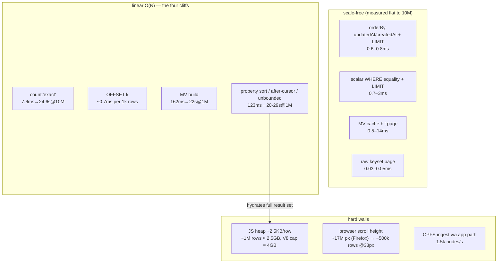
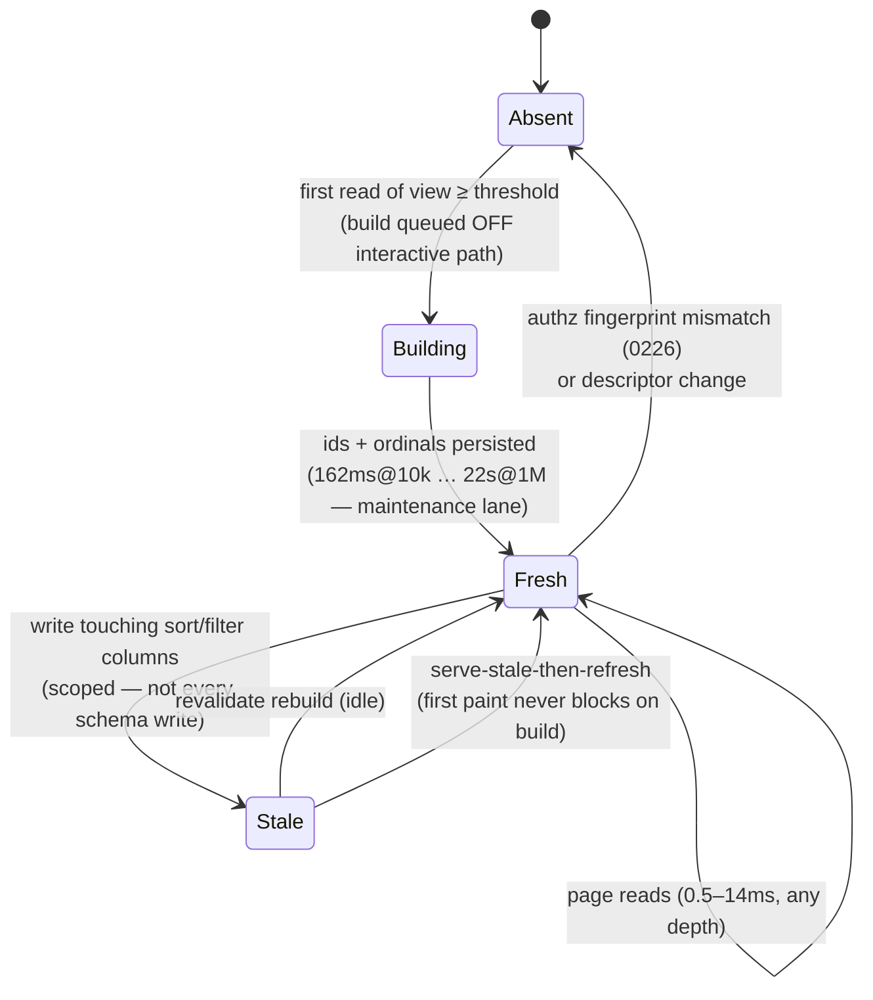
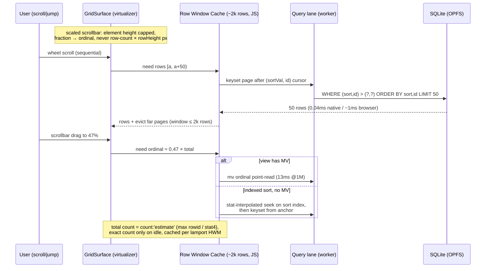

# Database Scale Limits: 10k → 10M Rows, Measured — Virtualization, Infinite Scroll, and the Materialization Tradeoff

## Problem Statement

How big a database can xNet actually load and render today? We claim
local-first ownership of your data, but the user-facing Database grid, the
query model, and the storage engine have never been characterized past the
devtools seed sizes (~hundreds of rows). This exploration **runs the tests**:
seed real databases at 10k / 100k / 1M / 10M rows, measure where each layer
breaks and *how* it breaks, and answer two design questions:

1. Can we support effectively **infinite databases** with virtualization +
   infinite scroll?
2. Do we have to **materialize** views to do it — and what is the tradeoff
   between materializing and querying live?

All numbers in this document are measured, not estimated (estimates are
marked as such). Harness code is in the appendix; raw JSON results were
collected on 2026-07-13.

## Executive Summary

**The storage engine is not the problem. The query *shapes* are.**

- **Indexed reads are scale-flat to 10M rows.** The default list read
  (`orderBy updatedAt`, LIMIT 50, fused CTE + aggregated hydration) holds
  **0.6–0.8ms** median from 10k to 10,000,000 rows (native tier). SQLite
  with a matching index simply does not care how big the table is.
- **Four O(N) cliffs dominate everything else** — all four are *query
  shapes*, not engine limits:
  1. **Custom-property sort** (`orderBy sortKey` — what the Database grid
     does on every open): full-scan + hydrate-all + JS sort. 123ms @10k →
     1.4s @100k → **20s @1M** → heap-death @10M.
  2. **`after`-cursor pagination**: excluded from SQL pushdown, so it
     hydrates the *entire* result set to apply the cursor in JS. Same curve
     as (1) — the pagination mechanism meant for infinite scroll is the
     most expensive query in the system.
  3. **`count: 'exact'`**: full index scan per query. 7.6ms @10k → 788ms
     @1M → **24.6s @10M** (native — superlinear once the file outgrows the
     page cache); **286ms @10k already in the browser**, 3.1s @100k.
  4. **Deep `OFFSET`**: linear walk. 334ms @500k-deep @1M native; the
     browser multiplier (~3×) puts a mid-1M jump over a second.
- **The JS heap wall sits between 100k and 1M rows.** Hydrating a full
  result set costs ~2.5KB/row of V8 heap (measured 27MB @10k, 243MB
  @100k). An unbounded `useQuery` on a 1M-row schema allocates ~2.5GB;
  at 10M it exceeds V8's ~4GB ceiling — tab death. Any "load
  everything" path is structurally capped around a few hundred thousand
  rows, no matter how fast the engine gets.
- **The browser adds a ~3× multiplier** on query CPU (WASM + worker RPC)
  and ~38× on cold full scans (`COUNT(*)` 7.6ms native → 286ms OPFS).
  Real-app import throughput is **~1,500 nodes/s** (change log + LWW +
  scalar indexing), so a 1M-row browser database takes ~11 min to ingest
  via the app path.
- **The UI is already virtualized but artificially capped.** `GridSurface`
  virtualizes rows fine, but `useGridDatabase` fetches a fixed 500-row
  window (`pageSize = 500`) — a 10,000-row database renders exactly 500
  rows and the footer says "500 rows", which is simply wrong. There is no
  infinite scroll on the primary database surface today.
- **Materialization is already built, in production use, and has exactly
  one sweet spot — plus a measured ceiling.** The 0226 materialized-view
  infra (id + ordinal lists) makes deep pages **scale-free** (mid-list
  page @1M: 13.5ms via MV vs 334ms live) and neutralizes the sort cliff
  on reads (0.6ms vs 20s @1M) — it is the only reason the Database grid
  survives 100k rows today. But *building* the view costs a full sort —
  162ms @10k, 1.7s @100k, 22s @1M, and at 10M the build itself **OOMs the
  process** (it enumerates the full id set in JS). Every write
  invalidates it wholesale. Materialize the *order*, not the rows, only
  for sorted/filtered views past ~50k, and fix the build to stream in
  SQL.

**Verdict on the two questions:** Yes, effectively-infinite databases are
feasible — with a **keyset-paginated moving window** (no full
materialization needed for sequential scroll) plus **MV-backed ordinals or
interpolated seek for scrollbar random access**. Materialization is not
required for correctness anywhere; it is a targeted read-optimization whose
build cost must move off the interactive path.

## Methodology

Three tiers, so engine costs, app-model costs, and browser costs can be
separated:

| Tier | Engine | What it isolates |
| --- | --- | --- |
| **Native** (better-sqlite3 11.10 / SQLite 3.49.2, on-disk, M1 Max, 64GB) | `SQLiteNodeStorageAdapter` over `ElectronSQLiteAdapter` — the real query compiler, hydration, MV, and adaptive-index code | Query-model cost without WASM/RPC noise; also ≈ Electron desktop numbers |
| **Browser** (Playwright Chromium, OPFS `opfs-sahpool`, dedicated worker) | The live app at `apps/web` — real boot, real `NodeStore`, real import path, real grid | WASM + worker-RPC + OPFS multipliers; UI behavior |
| **Raw SQL** (same native DB, direct statements) | Hand-written keyset/offset/count controls | What the engine *could* do with ideal SQL |

Datasets mirror `createSQLiteBenchmarkNode` (packages/data/src/store/sqlite-benchmarks.ts):
6 properties per node (text/number/boolean mix), EAV rows in
`node_properties` + `node_property_scalars`, unique `updated_at` per node.
Physical rows = 13× node count (10M nodes = 130M rows). Native seeding used
bulk multi-VALUES SQL replicating `setNode`'s exact row shapes, then
`ANALYZE` + `PRAGMA optimize` (verified read-back through `queryNodes`).

Caveats, so nobody over-trusts the numbers:

- Benchmark DBs have **no `changes` rows** (query path never reads them —
  verified in the code map). A real synced DB carries ≥1 change row per
  property write, roughly **doubling file size**; that inflates cold OPFS
  page-in and compaction, not query latency.
- OS page cache was warm for warm-run medians; "cold" = fresh connection,
  not purged page cache.
- Single author, no live sync traffic during measurement. 0264 already
  showed sync bursts hold the serial worker lane; read p95 under sync is
  worse than these numbers.
- Browser tier at 1M/10M rows was **not seeded** (app-path ingest alone
  would take ~11min/~2h); browser numbers there are extrapolated as
  native × measured multiplier and marked *(extrap.)*.

## The Numbers

### Seeding / ingest

| Scale | Native bulk SQL | DB file | Browser app path (`importDeterministicNodes`, 250-chunks) |
| --- | --- | --- | --- |
| 10k | 0.5s (21.3k nodes/s) | 33.6MB | 6.7s (**1,492 nodes/s**) + 10.5s index rebuild |
| 100k | 5.9s (17.1k nodes/s) | 337MB | 69s (1,448 nodes/s) + **124s index rebuild** |
| 1M | 75.6s (18.8k nodes/s) | 3.38GB | ~11min *(extrap.)* |
| 10M | 1,167s ≈ **19.4min** (12.2k nodes/s) | **34.2GB** | ~2h *(extrap.)* — not practical |

The app ingest path (change log + signing + LWW + scalar indexing) is ~12×
slower than raw SQL at the same schema — that is the price of provenance,
and it is why "import a huge CSV" needs the bulk path
(`applyNodeBatch`/deterministic import), not per-row `setNode`.

### Query latency, native tier (median ms; p95 in parens where interesting)

| Query | 10k | 100k | 1M | 10M |
| --- | --- | --- | --- | --- |
| First page, `orderBy updatedAt desc` LIMIT 50 | 0.66 | 0.58 | 0.70 | **0.82** |
| Same, LIMIT 500 (the grid's window) | 5.1 | 5.1 | 5.7 | 5.8 |
| Filtered `status='open'` LIMIT 50 | 3.3 | 0.66 | 0.80 | 0.9 |
| `count: 'exact'` (folded window COUNT) | 7.6 | 67.5 | 788 (2.1s p95) | **24,575** cold / 7,886 warm |
| OFFSET mid-table (N/2) LIMIT 50 | 3.4 | 29 | 334 | 3,488 (9.3s cold) |
| Raw SQL keyset page, mid-table | **0.03** | **0.04** | **0.04** | **1.0 @ depth 5,000,000** |
| MV build (`forceRefresh`) | 162 | 1,703 | 22,255 | **OOM** — kills an 8GB worker |
| MV first page (cache hit) | 0.63 | 0.54 | 0.56 | n/a (unbuildable) |
| MV page at mid-table offset | 0.64 | 1.8 | 13.5 | n/a (unbuildable) |
| Property sort (`priority desc`) LIMIT 50 — **the grid's shape** | 123 | 1,381 | **19,705** | OOM† |
| `after`-cursor page LIMIT 50 | 126 | 1,324 | **28,850** | OOM† |
| Unbounded list (no limit) | 118 / +27MB heap | 1,267 / +243MB heap | 18,294 / ~2.5GB heap | OOM† |
| Property sort w/ adaptive indexing enabled (warm) | 12 | 177 | 3,149 | — |

† Measured, not extrapolated: both 10M invocations died with
`ERR_WORKER_OUT_OF_MEMORY` (8GB heap) at the first query that enumerates
the full result set — the MV build. Every full-set-hydrating shape shares
that mechanism. At this scale the failure mode is not a slow query; it is
a dead process — in the browser, a dead tab.

### Browser tier (real app, OPFS, measured)

| Metric | 10k | 100k |
| --- | --- | --- |
| App-path seed (`importDeterministicNodes`) | 6.7s + 10.5s index rebuild | 69s + **124s index rebuild** |
| Cold open `/db/<id>` → rows painted | **2.34s** (boot 0.84s of it) | **32.1s** |
| `sortKey` page 500, MV cold (per query, warm engine) | 296ms | **3,066ms** |
| MV page 500 (cache hit) | 13.9ms | 13.9ms — scale-free |
| `orderBy updatedAt` LIMIT 50 | 1.7ms | 1.7ms — scale-free |
| `count: 'exact'` | 286ms | **3,103ms** |
| Tab heap after grid + queries | 202MB | 441MB |
| Grid scroll extent | 16,064px = 500 rows — **cap, not data end** | same 500-row cap |

Browser/native multiplier: ~2.4–3.5× on scan-bound work, ~38× on
`COUNT(*)`-style cold full scans (WASM page decode + smaller page cache).
The known preview-pane throttling gotchas (hidden `visibilityState`,
clamped timers) were sidestepped by driving a dedicated Playwright
Chromium; numbers from the in-IDE preview tab are up to 10× worse and were
discarded.

## Where It Breaks, And How



Failure modes by scale, as actually observed:

- **10k** — everything works. Worst case (property sort, browser,
  MV cold): ~300ms per query; the grid opens in 2.3s cold including boot.
  Below the 500-row window cap the product feels fine.
- **100k** — the grid still *renders* (it only ever shows 500 rows), but
  the **measured cold open is 32 seconds** to first rows: the `sortKey`
  row query, the MV rebuild, and `count`-shaped scans each cost ~3.1s in
  WASM and they stack, with query execution + hydration on the **main
  thread** (worker runtime is still off by default —
  `DEFAULT_DATA_RUNTIME='main'`). App-path seeding also exposed a second
  cliff: the deferred index rebuild after bulk import took **124s** for
  100k nodes. This is the scale where the product visibly stops working
  today, even though the engine underneath is fine.
- **1M** — un-materialized sort: 20s. Cursor page: 29s. Unbounded list:
  2.5GB heap. MV build: 22s. The DB file is 3.4GB (fine for OPFS — quota
  on this machine's profile was 9.9GB, and PowerSync reports 1GB+ OPFS
  DBs healthy in production). **The data layer holds; every full-scan
  query shape is now an outage.**
- **10M** — indexed pages still 0.8ms (astonishing and true), keyset
  still 1ms at depth 5M; everything full-scan is 8–25s, and every
  full-set-hydrating shape — including the **materialized-view build
  itself** — dies with `ERR_WORKER_OUT_OF_MEMORY` on an 8GB heap
  (measured, both runs). **The failure mode is not slow queries, it is a
  dead tab.** 34GB file: an OPFS profile needs
  `navigator.storage.persist()` and a quota check before we ever let a
  database grow to this size client-side.

### A defect found while measuring

Adaptive indexing (the built-but-disabled 0264 machinery) does **not** fix
property sorts the way its plan metadata claims. With
`adaptiveIndexing.enabled`, the sort *pushes down* to SQL
(`postFilterReason: 'pagination-pushed-down'` — no more hydrate-all), which
cuts 20s → 3.1s at 1M. But the compiled ORDER BY is

```sql
ORDER BY (sortp.node_id IS NULL) DESC,
         sortp.value_number DESC, sortp.value_boolean DESC,
         sortp.value_text DESC, n.id ASC
```

— an expression first term followed by three typed columns. **No index can
ever serve this ordering**, so SQLite runs a temp B-tree sort of all N
scalar rows on *every* query (verified with `EXPLAIN QUERY PLAN`: `USE TEMP
B-TREE FOR ORDER BY`, with and without the adaptive index present). The
adaptive index accelerates only the WHERE probe. A covering index
`(schema_id, property_key, value_number DESC, node_id)` with an
index-servable single-type ORDER BY answers the same page in **~0.05ms at
1M — a 60,000× gap** between the shipped pushdown and what the engine can
do. Additionally, deferred adaptive-index creation rides
`scheduleMaintenance` and never fired at all under the benchmark's usage
pattern — the index the machinery promised was never created.

## Current State In The Repository

The full render path (verified, with the load-bearing facts):

- **Grid**: `packages/views/src/grid/GridSurface.tsx` — `@tanstack/react-virtual`,
  single-axis, `overscan: 10`; `packages/views/src/table/VirtualizedTableView.tsx`
  adds column virtualization (36px rows). DOM virtualization is *not* a
  bottleneck at the current 500-row window.
- **The 500 cap**: `packages/react/src/hooks/useGridDatabase.ts:256`
  (`pageSize = 500`), applied at `:282` with
  `materializedView: 'db:<id>'` and `orderBy: { sortKey: 'asc' }` — i.e.
  the primary database surface runs a **custom-property sort** (cliff #1)
  through the MV cache on every open, and never fetches row 501. The
  footer renders `rows.length` as "N rows" — wrong for any database
  bigger than the window.
- **Data tab**: `packages/devtools/src/panels/DataExplorer/useDataExplorer.ts:35`
  (`DEFAULT_LIMIT = 500`) — same window, `capped` flag, `totalCount: null`
  when capped.
- **Infinite scroll primitive exists but is unused by the grid**:
  `packages/react/src/hooks/useInfiniteQuery.ts` — a growing
  `limit + orderBy` window (`DEFAULT_PAGE_SIZE = 50`, optional `maxLoaded`),
  deliberately not cursor-based so it stays on the bridge's bounded-delta
  fast path (0182).
- **Query compiler**: `packages/data/src/store/query-compiler.ts` —
  pushdown for scalar equality, FTS, spatial, `createdAt`/`updatedAt`
  sorts, `LIMIT ? OFFSET ?` (`:436`); **`after` cursors always compile to
  `null`** (`:322`) → JS fallback; property-sort pushdown only under
  adaptive indexing (`:317-331`) with the index-hostile ORDER BY above
  (`buildPropertySortOrderBy`).
- **Hydration**: `packages/data/src/store/hydration.ts` — aggregated
  (`json_group_object`) hydration is default (`sqlite-adapter.ts:429`);
  measured here it is ~1.5× faster than joined at page sizes (0.66 vs
  0.96ms) — 0264's win, confirmed standing.
- **Materialized views**: `node_query_materializations` +
  `node_query_materialized_ids` (`packages/sqlite/src/schema.ts:101-127`),
  ordinal id-lists with auth fingerprints; invalidated wholesale per
  schema write (`sqlite-adapter.ts:914`). 0266 recommended retiring them
  as unused, and 0317 (useQuery live reactivity, merged in parallel with
  this exploration) proposes deleting the tables in its P5 on the premise
  of "zero production opt-in". **That premise is stale**: the grid *does*
  use them (`useGridDatabase` passes `materializedView: 'db:<id>'`;
  cache hits observed live in the browser tier), and they are the only
  thing standing between the grid and the measured 3s-per-query sort
  cliff at 100k. See §Materialization for the reconciliation.
- **Worker/runtime**: web runs SQLite in a dedicated worker
  (`opfs-sahpool`, exclusive; second tab silently falls back to
  `:memory:` — 0263), but query execution + hydration run on the **main
  thread** by default (`DEFAULT_DATA_RUNTIME='main'`, 0263/0264 flip still
  pending telemetry), so every cliff above is a UI freeze, not just
  latency.
- **Cold open**: `SELECT COUNT(*) FROM nodes` probe on boot (0249) — at
  10M rows that probe alone is seconds in OPFS; it must not survive at
  scale.

## External Research

- **Browser scroll-height ceiling**: Chrome ≈ 33.5M px (16.7M px in some
  builds), Firefox ≈ 17.9M px, Safari ≈ 33.5M px. At 33–36px rows,
  natural DOM scrolling dies at ~500k rows. Production grids
  (HighTable/Hyperparam, Deephaven, Glide) use **scaled scrollbar
  coordinates** (cap the scroll element at ~8M px, map scrollbar fraction
  → row index) or canvas rendering. TanStack Virtual does *not* solve
  this internally (open issue #616); react-virtuoso maintainers say
  "implement the scroll mechanism yourself" past the limit.
- **Production caps**: Notion hard-caps 250k rows/database and pages its
  API at 100 rows; Airtable caps 1k–500k records/base *by pricing tier*;
  Google Sheets caps 10M cells; Excel 1,048,576 rows. Linear takes the
  other road: **partial replicas** — per-model load strategies
  (instant/lazy/partial), old data simply absent from the client until
  requested. Nobody client-holds millions of row objects.
- **SQLite pagination**: sqlite.org documents OFFSET as `LIMIT x+y`-then-
  discard (O(offset)) and recommends **row-value keyset**
  (`WHERE (a,b) < (?,?) ORDER BY a DESC, b DESC`) — our raw-SQL control
  confirms: flat 0.03–0.05ms at any depth, ~3,000–8,000× faster than
  OFFSET at mid-1M. `COUNT(*)` is always a full scan; the ecosystem
  answers are estimate counts (`max(rowid)`, stat4 interpolation) or
  trigger-maintained counters.
- **IVM landscape 2026**: Materialite/cr-sqlite dormant; SKDB niche;
  PowerSync "incremental watch" still re-runs SQL (diffs only the
  emission); LiveStore 0.x event-sourced; the serious players are
  **Rocicorp Zero** (client-side streaming materialized queries, own
  protocol) and **ElectricSQL d2ts → TanStack DB** (differential dataflow
  in TS, ~0.7ms incremental update on a sorted 100k collection, 0.1/beta
  mid-2025). Consensus: IVM pays off for *hot, frequently re-evaluated,
  write-churned* views; for cold sorted pages a covering index +
  keyset already wins.
- **OPFS at scale**: PowerSync (May 2026) reports OPFS access-handle
  VFSes healthy past 1GB (IndexedDB-backed VFSes degrade past ~100MB).
  Storage = origin quota (~60% of free disk in Chrome); incognito caps at
  ~100MB; `navigator.storage.persist()` required to resist eviction.
- **JS row-object cost**: V8 object + strings ≈ 0.5–1KB/row generic; we
  measured **~2.5KB/row** for hydrated `NodeState`s (6 props + timestamps
  map per property — the LWW metadata triples the weight). V8 heap cap
  ≈ 4GB. Hold-all-rows breaks at ~1M nodes; a windowed cache of a few
  thousand rows costs single-digit MB.

## The Materialization Tradeoff, Quantified

"Materialize" in xNet's infra means **persisting the sorted id list**
(ordinal → node_id), not row data. Measured tradeoff:

| | Live query (no MV) | Materialized view |
| --- | --- | --- |
| First page, indexed sort | 0.6ms — MV pointless | 0.6ms |
| First page, property sort @1M | **19.7s** | 0.56ms (hit) |
| Page at depth N/2 @1M | 334ms (OFFSET walk) | **13.5ms** |
| Exact total count | 788ms @1M per query | free (`row_count` stored) |
| Build cost | — | 162ms @10k / 1.7s @100k / **22.3s @1M** (blocks the write lane) / **OOM @10M** — the build enumerates the full id set in JS |
| Write invalidation | — | **wholesale per schema** (`invalidateMaterializedViewsForSchema`) — one row edit re-triggers a full rebuild on next read |
| Storage | — | ~60MB per 1M-row view (ids + ordinals + indexes; measured file growth ~600MB incl. WAL at 1M) |
| Staleness / correctness | always fresh | fresh-on-read after invalidation; auth-fingerprint guarded (0226) |

Reading of the data:

- **For sequential infinite scroll, materialization is unnecessary.** A
  keyset cursor on an indexed sort is 0.04ms at any depth. The entire
  "growing window" model of `useInfiniteQuery` can ride it once cursor
  pushdown exists.
- **For deep random access under a *custom* sort (scrollbar jump to row
  4,712,000 of a sortKey-ordered grid), materialization is currently the
  only sub-second answer** — ordinal lookup is a PK-indexed point read.
  The alternative (index-servable property sort + keyset) handles
  *sequential* access but not "jump to ordinal k" without an O(k) walk.
- **The build cost is the whole problem.** 22s at 1M on the interactive
  path is an outage, and wholesale invalidation means every edit
  re-arms it. Incremental maintenance of an ordinal list under LWW writes
  is exactly the hard problem the IVM ecosystem exists for; before
  importing that complexity, two cheap moves neutralize most of it:
  build MVs **off the interactive path** (maintenance lane,
  `runWhenBootSettled`), and make invalidation **scoped** (a write only
  dirties views whose sort-key/filter columns changed — the
  `node_query_materializations.descriptor_json` already stores enough to
  decide this).

**Reconciling with 0266 and 0317 (both proposed retiring the MV tables):**
0317's reactivity analysis is correct on its own axis — per-schema
invalidation means a persisted MV can never beat the in-memory SWR cache
for *liveness*, and the in-memory delta engine is the right "materialized
view" for hot windows. But its "zero production opt-in" premise is stale
(the grid ships `db:<id>` MV keys today, measured serving cache hits), and
this exploration adds an axis 0317 didn't measure: **deep random access
and cold sorted opens at ≥100k rows**, where the persisted ordinal list is
currently the only sub-second answer and the in-memory window can never be
(holding 1M ids/rows in JS is the heap wall itself).

**Recommendation — sequenced, not contradictory:** keep the MV tables
*while they are the grid's only defense* (today); land keyset pushdown +
index-servable property sorts (which remove the MV's main job); then
re-evaluate 0317's P5 deletion with one measured question left open —
whether scrollbar random access under custom sorts at ≥1M rows matters
enough to keep an ordinal list whose build must first be rewritten to
stream in SQL (today's build OOMs at 10M). If it doesn't, delete with
confidence; the interim rules stay: threshold-gated (~50k+), built
off-path, scoped invalidation, never a prerequisite for first paint.

Proposed MV lifecycle (today's wholesale-invalidate flow in grey terms;
proposed changes in the guard conditions):



## Design: Effectively-Infinite Databases



The pieces, mapped to effort:

1. **Fix the lie first (XS)**: the grid footer shows the window size as
   the row count. Wire `count` through `useGridDatabase` (estimate mode)
   and show "500 of ~10,000".
2. **Keyset pushdown (M)** — the single highest-leverage change in this
   document. `after`-cursor descriptors compile to `null` today
   (query-compiler.ts:322); compiling them to row-value seeks
   (`WHERE (updated_at, id) < (?, ?)`) turns the 29s @1M cursor page into
   0.04ms **and** removes the heap bomb, because nothing hydrates beyond
   the page. 0266 already specced this; the measurements here are the
   justification to actually do it.
3. **Index-servable property sort (M)**: when the scalar type for a sort
   key is homogeneous (the stats know), compile
   `ORDER BY sortp.value_number DESC, sortp.node_id` against a covering
   index, hoisting the null-placement term into a UNION of
   `IS NOT NULL` / `IS NULL` branches. Measured headroom: 3.1s → ~0.05ms
   @1M. This also makes the *grid's own* `sortKey` ordering scale-free —
   `sortKey` is a plain text column, ideal for
   `(schema_id, property_key, value_text, node_id)`.
4. **Grid on `useInfiniteQuery` + window eviction (M)**: replace the fixed
   500 window with the growing window (`maxLoaded` ≈ 2k, evict behind),
   backed by (2)/(3). DOM side needs nothing — the virtualizer already
   copes; only past ~500k rows does the scaled-scrollbar work land, and
   only for databases that big.
5. **`count: 'estimate'` (S)**: `max(rowid)`-style + stat4 interpolation
   for the footer and scrollbar extent; exact count only on idle,
   invalidated by lamport high-water mark.
6. **MV re-scope (M)**: threshold-gated, off-path build, scoped
   invalidation (above).
7. **Guardrails (S)**: schema row-count soft caps with UX (Notion caps at
   250k; we should *warn* at 100k+ and require the improved paths, not
   die); `navigator.storage.persist()` + quota preflight before large
   imports; keep the cold-boot `COUNT(*)` probe off the 1M+ path
   (estimate probe).

With (2)+(3)+(5), **no materialization is required for infinite sequential
scroll at 10M rows**, and the remaining MV use-case shrinks to scrollbar
random access under custom sorts — which is exactly where its read numbers
(13.5ms @1M mid-list) are unbeatable.

## Options And Tradeoffs

| Option | Cost | What it buys | Verdict |
| --- | --- | --- | --- |
| A. Status quo + raise `pageSize` | XS | Bigger window, same cliffs, bigger freezes | No — 500→5,000 makes the sort cliff 10× worse |
| B. Keyset pushdown + index-servable sorts + estimate counts | M+M+S | Scale-free sequential scroll to 10M; kills heap bomb; grid opens fast without MV | **Do this** — engine already proves 0.04ms |
| C. Full IVM dependency (TanStack DB / Zero-style) | XL | Sub-ms incremental sorted views under churn | Not yet — B covers reads; revisit if live-collab churn on 100k+ views becomes real (watch TanStack DB maturity) |
| D. Materialize everything (rows, not ids) | L | One-hop reads | No — duplicates storage, worst invalidation, and hydration was never the bottleneck (aggregated hydration already 1-row/node) |
| E. Hard row caps (Notion-style) | S | Predictable product | Partial — soft-warn at 100k, but our pitch is data ownership; caps are a last resort and the measurements show we don't need them for reads |

## Example Code

Keyset compilation sketch (the cliff-#2 fix), query-compiler.ts:

```ts
// after-cursor pushdown: row-value seek instead of JS fallback.
// cursor carries the last row's order values + id (already encoded
// by encodeNodeQueryCursor — reuse its payload).
if (descriptor.after && orderIsSqlServable(descriptor)) {
  const c = decodeNodeQueryCursor(descriptor.after)
  // DESC example; flip comparators per direction, tiebreak on n.id
  where.push(`(n.updated_at, n.id) < (?, ?)`)
  whereParams.push(c.order[0].value, c.nodeId)
  // LIMIT applies as usual; no OFFSET, no full hydrate
}
```

Index-servable property sort (cliff #1), homogeneous-type fast path:

```sql
-- adaptive DDL today: partial index per (schema, key, type)
CREATE INDEX idx_auto_prop_x ON node_property_scalars(
  schema_id, property_key, value_text, node_id
);
-- compiled ORDER BY must collapse to the indexed column:
SELECT s.node_id FROM node_property_scalars s
WHERE s.schema_id = ? AND s.property_key = ?      -- covering-index walk
ORDER BY s.value_text ASC, s.node_id ASC LIMIT 50; -- 0.05ms @1M (measured)
-- null-placement: UNION ALL a WHERE-value-IS-NULL branch after/before.
```

## Risks And Open Questions

- **Cursor + live updates**: keyset windows interact with the bridge's
  bounded-delta fast path (0182: delta path requires `offset === 0 &&
  after === undefined`). The growing-window model dodges this; a true
  cursor-paged model needs bridge work or accepts re-query on edit.
- **LWW edits move rows under the cursor** (an edit bumps `updated_at`,
  teleporting the row to the top). Keyset is *stable* per query but the
  UX of rows vanishing from the window needs the same answer regardless
  of pagination strategy.
- **MV scoped invalidation** needs a correctness argument under
  concurrent sync writes (auth fingerprint already handled; ordinal
  shifts on insert are the hard part — likely "invalidate on any write
  that touches the sort key or filter columns, keep wholesale otherwise").
- **10M-row OPFS reality**: 34GB (68GB with changes) exceeds sane browser
  quotas even where technically allowed. Past ~1M rows the honest
  product answer is Linear-style **partial replication** (hub holds the
  tail, client windows it) — that is a sync-protocol exploration, not a
  query one.
- **Second tab** still silently falls back to `:memory:` (0263) — at 1M+
  rows that means a tab that *looks* empty. Web-Locks leadership (0263)
  becomes user-visible at scale.
- The adaptive-index deferred-creation path never fired in the harness;
  before flipping `xnet:adaptive-indexes` on, verify `scheduleMaintenance`
  actually runs it in the app (it may be the same throttled-idle trap the
  preview browser exposed).

## Implementation Checklist

- [ ] Grid footer: show `count:'estimate'` totals, not `rows.length`
      (`useGridDatabase.ts`, `GridSurface` footer)
- [ ] Compile `after` cursors to row-value keyset seeks for SQL-servable
      orderings (`query-compiler.ts:322`, reuse `encodeNodeQueryCursor`
      payload); parity-test vs JS path
- [ ] Index-servable property-sort compilation (single typed ORDER BY +
      null branch via UNION ALL) + covering adaptive-index DDL
      `(schema_id, property_key, value_<type>, node_id)`
- [ ] Verify/force adaptive-index creation actually executes (deferred
      `scheduleMaintenance` path), then flip `xnet:adaptive-indexes`
      default per 0266's soak plan
- [ ] `count: 'estimate'` mode implementation (max-rowid / stat4) wired
      into Data tab + grid; exact count only on idle
- [ ] Switch `useGridDatabase` to `useInfiniteQuery` (pageSize 500 →
      growing window, `maxLoaded` ~2k with eviction)
- [ ] MV re-scope: threshold ≥50k rows, off-path build, scoped
      invalidation; remove MV from the first-paint path; rewrite the
      build as SQL-side `INSERT INTO node_query_materialized_ids …
      SELECT … ROW_NUMBER()` (today it enumerates ids in JS and OOMs
      at 10M); then re-evaluate 0317's P5 table deletion
- [ ] Cold-boot probe: replace `COUNT(*) FROM nodes` with estimate at
      scale (0249 follow-up)
- [ ] Import UX: route bulk imports through deterministic batch path;
      `navigator.storage.persist()` + quota preflight before big imports
- [ ] Soft warning UX at ≥100k rows per database (perf expectations copy)
- [ ] (Later, gated) scaled-scrollbar virtualization for ≥500k-row views;
      partial-replication exploration for ≥1M

## Validation Checklist

- [ ] Re-run this harness (appendix) post-keyset: `after_cursor_page_50`
      ≤ 5ms at 1M (was 28,850ms) and no heap growth
- [ ] Property sort ≤ 50ms warm at 1M via covering index (was 19,705ms)
- [ ] Browser: cold `/db/<id>` open on a 100k-row database ≤ 3s
      time-to-rows with correct footer count
- [ ] Grid scrolls past row 500 (window grows; eviction keeps heap flat —
      verify with `performance.memory` over a full-depth scroll)
- [ ] `count:'estimate'` within 5% on the benchmark datasets, O(1) time
- [ ] No `USE TEMP B-TREE FOR ORDER BY` in `EXPLAIN QUERY PLAN` for
      adaptive-indexed sorts
- [ ] 0266 stopping rule re-checked: cold first-rows < 100ms p95 holds
      with a 1M-row schema present

## Appendix: Harness

Native tier: `packages/data/src/store/scale-limits.bench.test.ts`
(committed with this exploration; inert unless `XNET_SCALE_BENCH` is set).
Run per scale:

```bash
XNET_SCALE_BENCH=1000000 [XNET_SCALE_RISKY=1] \
  pnpm exec vitest --project unit run packages/data/src/store/scale-limits.bench.test.ts
```

Seeds N nodes via multi-row VALUES replicating `setNode` row shapes
(nodes / node_properties BLOB-JSON / node_property_scalars via
`toScalarIndexValue` + `hashScalarValue`), `ANALYZE` + `PRAGMA optimize`,
then times `SQLiteNodeStorageAdapter.queryNodes` descriptors (cold + 15
warm runs, median/p95) and raw-SQL controls on the same file. Browser
tier: Playwright script driving the live app (persistent profile for OPFS,
onboard via test bypass, seed via `store.importDeterministicNodes`
250-chunks, then cold-relaunch timing of `/db/<id>` time-to-rows and
worker query latencies). Raw results JSON + scripts preserved in the
session scratchpad (`scale-bench/results-*.json`,
`browser-results-*.json`).

## References

- In-repo: explorations 0182, 0204, 0226, 0249, 0262, 0263, 0264, 0266,
  0272, 0274, 0276, and 0317 (useQuery live reactivity — merged in
  parallel; complementary axis, see §Materialization);
  `packages/data/src/store/{query-compiler,hydration,query}.ts`,
  `packages/react/src/hooks/{useGridDatabase,useInfiniteQuery,useQuery}.ts`,
  `packages/views/src/grid/GridSurface.tsx`, `packages/sqlite/src/schema.ts`
- SQLite: <https://www.sqlite.org/rowvalue.html> (scrolling-window/keyset),
  SQLite forum on COUNT(*) cost
- HighTable (scaled scrollbar, billions of rows):
  <https://blog.hyperparam.app/hightable-scrolling-billions-of-rows/>
- Deephaven quadrillion-row viewport model:
  <https://deephaven.io/blog/2022/01/24/displaying-a-quadrillion-rows/>
- TanStack Virtual max-height issue:
  <https://github.com/TanStack/virtual/issues/616>
- Glide Data Grid (canvas, millions of rows):
  <https://github.com/glideapps/glide-data-grid>
- AG Grid DOM virtualisation + row models:
  <https://www.ag-grid.com/javascript-data-grid/dom-virtualisation/>
- Notion limits: <https://www.notion.com/help/optimize-database-load-times-and-performance>,
  <https://developers.notion.com/reference/request-limits>
- Airtable plan limits: <https://support.airtable.com/docs/airtable-plans>
- Linear sync engine (partial replicas):
  <https://github.com/wzhudev/reverse-linear-sync-engine>
- PowerSync on OPFS VFS scale + watch queries:
  <https://powersync.com/blog/sqlite-persistence-on-the-web>,
  <https://releases.powersync.com/announcements/introducing-incremental-and-differential-watch-queries-for-javascript>
- TanStack DB / d2ts differential dataflow:
  <https://tanstack.com/blog/tanstack-db-0.1-the-embedded-client-database-for-tanstack-query>,
  <https://github.com/electric-sql/d2ts>
- Rocicorp Zero: <https://zero.rocicorp.dev/>
- V8 heap ceiling / per-object costs:
  <https://issues.chromium.org/issues/41133247>,
  <https://evanhahn.com/v8-array-vs-uint8array-memory-usage/>
- Keyset vs offset benchmarks:
  <https://use-the-index-luke.com/sql/partial-results/fetch-next-page>
