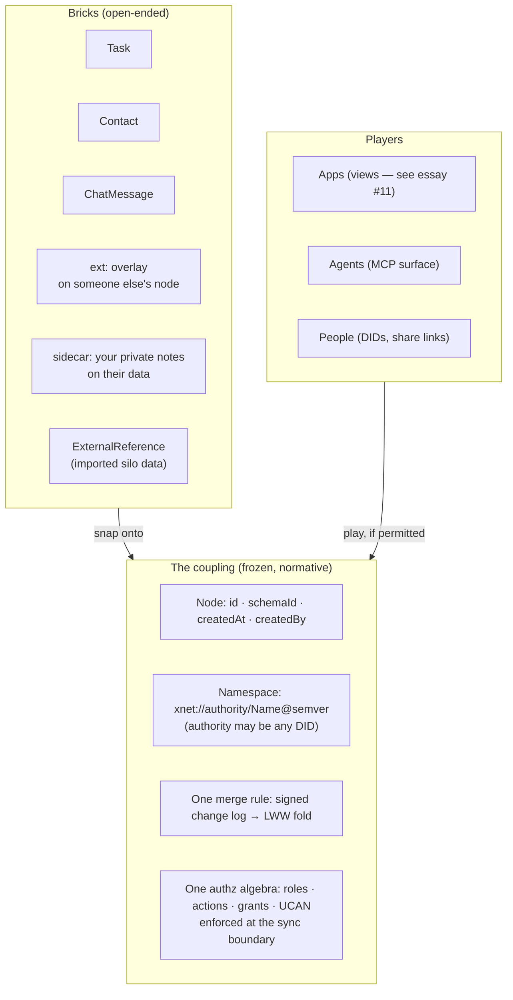

# Blog Post: LEGO for All Data on the Web

> The genius of the 1958 brick was never the brick. It was the coupling.

## Problem Statement

The user wants a blog post framing xNet as **LEGO for all data on the web**:
a universal namespace for any and all data that syncs peer-to-peer and
preserves strong access controls and permissions — *you control who and what
gets to play with your legos*. The brief asks three questions the essay must
answer in order:

1. **What new forms of software, tooling, and interaction does a universal,
   composable, permissioned data substrate enable?**
2. **How were we limited by prior siloed, non-composable forms of data on
   the internet?**
3. **What limits still remain, even in xNet?** (The honest section — the one
   that buys credibility for the other two.)

The hard constraint is series overlap. The blog already has fourteen essays,
and two of them own adjacent ground:

- **#10, "The Workshop and the Walled Garden"** owns *moddability* and
  capability-scoped third-party code.
- **#11, "The Vault and the View"** owns the *vertical* axis: apps as
  disposable views over a durable data substrate, the Codd→Solid→local-first
  lineage, and the AI-cheap-views inversion.

This essay must therefore claim the **horizontal axis**: not "the app is a
view over the data" but "**every datum can snap to every other datum**" —
the connection standard itself. LEGO is the right metaphor precisely because
LEGO's genius is not the brick (any company can mould plastic) but the
**frozen coupling geometry** — the stud-and-tube interface patented on
28 January 1958 — plus the *System of Play*: every set, every theme, every
decade, one interface. A brick moulded in 1958 still snaps to a brick moulded
today. And, crucially for this essay, the metaphor's neglected half:
**clutch power is friction, not weld**. Bricks hold firmly *and come apart
by hand*. That is what permissions are — composability with consent.

The failure mode to avoid: a breathless "everything connects to everything"
manifesto. The Semantic Web already wrote that one, and §"External Research"
below documents where it went. Every claim needs a repo receipt, and the
limits section needs real teeth.

## Executive Summary

- **The essay's spine: the coupling, not the brick.** xNet's answer to "what
  is the stud geometry of data?" is concrete and citable: every node has
  exactly four universal fields (`id`, `schemaId`, `createdAt`, `createdBy`,
  per [docs/specs/protocol/02-data-model.md](../specs/protocol/02-data-model.md));
  every schema lives in one namespace
  (`xnet://authority/Name@semver` — the `SchemaIRI`,
  [packages/data/src/schema/node.ts](../../packages/data/src/schema/node.ts));
  every mutation is a signed change folded by one merge rule (LWW with a
  grinding-resistant tiebreak,
  [packages/core/src/lww.ts](../../packages/core/src/lww.ts)); every
  access decision runs one authorization algebra declared *on the data
  itself* ([docs/specs/protocol/04-authorization.md](../specs/protocol/04-authorization.md)).
  Four frozen interfaces. Everything else — schemas, views, apps, agents —
  is a brick that snaps onto them.
- **The namespace is genuinely universal, not aspirational.** The
  `SchemaIRI` authority can be `xnet.fyi` (the ~60 built-in schema modules:
  pages, tasks, CRM, ledger, chat, canvas…), a domain, or *any DID* —
  `xnet://did:key:z6Mk…/Recipe@1.0.0` means anyone can mint types without
  asking anyone. Identity is `did:key` (self-sovereign), content addressing
  is BLAKE3 `cid:`s, and foreign data gets landing schemas
  (`ExternalReference`, `feed-item`, importers, the Slack-compat package) so
  even other people's silos become bricks.
- **The permissions half is the differentiator.** Prior "LEGO for software"
  essays (and prior universal-data attempts) skip the question the user's
  brief centres: *who gets to play?* xNet's answer has three interlocking
  mechanisms, all data-native: schema authorization blocks with roles,
  actions, and deny-wins expressions; `Grant` nodes and UCAN delegation
  chains (attenuable capabilities — hand someone three bricks, not the
  crate); and E2E encryption where **the ability to decrypt is the access
  control** — per-recipient key wraps in
  [packages/crypto/src/envelope.ts](../../packages/crypto/src/envelope.ts).
  Enforcement happens at the sync boundary, so the rules travel with the
  data, not with any app.
- **Question 1 (what it enables) has live receipts:** cross-schema relations
  (`relation` properties point at *any* node); sidecars — your private
  annotations riding on data you don't own
  ([packages/data/src/schema/sidecar.ts](../../packages/data/src/schema/sidecar.ts));
  overlays — extending someone else's schema without permission or forking
  ([packages/data/src/schema/extension.ts](../../packages/data/src/schema/extension.ts));
  agents as first-class players via the MCP surface
  ([packages/cli/src/commands/mcp.ts](../../packages/cli/src/commands/mcp.ts))
  and capability-scoped connectors
  ([packages/plugins/src/connectors/define-connector.ts](../../packages/plugins/src/connectors/define-connector.ts));
  and the user-side network effect: every datum you add makes *all* your
  tools better, instead of making one platform's moat deeper.
- **Question 2 (how we were limited) is a documented history**, not
  editorialising: mashup-era APIs opened (Flickr 2004) and then slammed shut
  once graphs became the asset — Facebook's Friends API (30 April 2015),
  Twitter's free API (9 February 2023, ~a week's notice), Reddit's
  $0.24/1k-call pricing that killed Apollo (2023). Below the API layer:
  Plaid built a company on screen-scraping bank logins because no first-class
  data-sharing primitive existed; GDPR Article 20 grants a right to
  portability but no format, so "portability" means a ZIP file no other
  software can parse. Copy-paste remains the web's only universal connector.
- **Question 3 (remaining limits) is the essay's credibility engine.** Six
  honest limits, each with a receipt: reading is copying (no revocation of
  what's been seen — clutch power holds, it doesn't imprison); schema
  agreement is social, not technical (lenses make disagreement *cheap*, they
  don't make coordination free); frozen interfaces have a real maintenance
  bill (the protocol-v4 tiebreak change rippled through four conformance
  kernels); a generic substrate pays a performance tax the silo never pays
  (our own query-perf sagas are the invoice); somebody still hosts the relay
  (Moxie's "people do not want to run their own servers" is conceded, hub as
  optional relay is the answer, economics still real); and moderation /
  discovery in a permissioned p2p world remains per-space and unsolved at
  network scale.
- **Recommendation:** ship blog post #15 as **"Clutch Power"** — bricks that
  hold *and* come apart — cold-opening on the 1958 patent and a 68-year-old
  brick snapping onto a new set, closing on the difference between a weld
  and a grip. `.astro` page + `posts[]` entry, tags
  `['essay', 'protocol', 'decentralization', 'philosophy']`, authors
  `['crs48', 'claude']`, ~14 min read, en-GB, vendored assets only.

## Current State In The Repository

### The four frozen interfaces (the essay's "stud geometry")

| LEGO | xNet | Receipt |
| --- | --- | --- |
| One brick footprint | Four universal node fields: `id`, `schemaId`, `createdAt`, `createdBy` | [docs/specs/protocol/02-data-model.md](../specs/protocol/02-data-model.md) §1; [packages/data/src/schema/node.ts](../../packages/data/src/schema/node.ts) |
| One catalogue of parts | `SchemaIRI = xnet://authority/Name@semver`; authority may be a DID | [02-data-model.md](../specs/protocol/02-data-model.md) §4; `parseSchemaIRI` in [node.ts](../../packages/data/src/schema/node.ts) |
| One way bricks join | Signed, hash-chained `Change` log folded by LWW (+ BLAKE3 tiebreak, protocol v4) | [packages/sync/src/change.ts](../../packages/sync/src/change.ts); [packages/core/src/lww.ts](../../packages/core/src/lww.ts) |
| One rule for whose hands | Authorization declared on schemas/nodes, evaluated identically everywhere, enforced at the sync boundary | [docs/specs/protocol/04-authorization.md](../specs/protocol/04-authorization.md); [packages/data/src/auth/evaluator.ts](../../packages/data/src/auth/evaluator.ts) |

The protocol spec ([docs/specs/protocol/00-overview.md](../specs/protocol/00-overview.md))
is normative and layered (L0 primitives → L1 data model → L2 replication →
L3 authorization), with golden vectors in `conformance/vectors/` so an
independent implementation in another language can prove it moulds
compatible bricks — that *is* the System of Play, stated as RFC-2119
conformance clauses.

### The namespace, end to end

- **Identity:** `did:key` over Ed25519
  ([packages/identity/src/did.ts](../../packages/identity/src/did.ts);
  type in [packages/core/src/auth-types.ts](../../packages/core/src/auth-types.ts)).
  Names are minted, not granted.
- **Content:** `cid:blake3:…` content ids
  ([packages/core/src/content.ts](../../packages/core/src/content.ts),
  [hashing.ts](../../packages/core/src/hashing.ts)).
- **Nodes:** opaque nanoid ids, ~126 bits
  ([packages/data/src/schema/node.ts](../../packages/data/src/schema/node.ts)).
- **Schemas:** `SchemaRegistry` singleton
  ([packages/data/src/schema/registry.ts](../../packages/data/src/schema/registry.ts))
  lazy-loading ~60 built-in schema modules from
  [packages/data/src/schema/schemas/](../../packages/data/src/schema/schemas/)
  — Page, Task, the full CRM set, ledger accounts, Channel/ChatMessage,
  Canvas, Map, Meeting. (Blog phrasing: "dozens of built-in schemas";
  the raw registry map holds 168 IRI entries but many are versioned
  aliases — don't quote that number.)
- **Property vocabulary** (the stud *types*): `text`, `number`, `relation`,
  `person` (a DID), `rollup`, `formula`, `file`, … in
  [packages/data/src/schema/types.ts](../../packages/data/src/schema/types.ts).
  `relation` is the load-bearing one for the essay: it can point at any node
  of any schema — a CRM deal can relate to a chat message can relate to a
  canvas.
- **Groups/boundaries:** Spaces (`xnet://xnet.fyi/Space@1.0.0`,
  [space.ts](../../packages/data/src/schema/schemas/space.ts)) nest, carry a
  `private|unlisted|public` dial, and act as the security boundary the
  cascade inherits from.

### The permissions machinery ("who plays with your legos")

- **Actions** `read, create, update, write, delete, share, admin`, with
  create/update as refinements of write (exploration 0304) — spec
  [04-authorization.md](../specs/protocol/04-authorization.md) §1.
- **Roles + expressions:** four role-resolver kinds (`creator`, `property`,
  `relation`, `membership`), deny-wins expression AST, presets
  (`private()`, `publicRead()`, `spaceCascadeAuthorization()`) in
  [packages/data/src/auth/presets.ts](../../packages/data/src/auth/presets.ts).
- **Grants + UCAN:** `Grant` nodes
  ([grant.ts](../../packages/data/src/schema/schemas/grant.ts)) with
  issuer/grantee/resource/actions/expiry/revocation; UCAN 1.0 delegation
  chains in [packages/identity/src/ucan.ts](../../packages/identity/src/ucan.ts).
  Attenuation is the "hand over three bricks, not the crate" beat.
- **E2E encryption as read control:** per-recipient X25519 key wraps,
  XChaCha20-Poly1305 payloads
  ([packages/crypto/src/envelope.ts](../../packages/crypto/src/envelope.ts));
  a `PUBLIC` sentinel recipient unifies the public/private code paths.
  For an unauthorised party the brick *physically doesn't snap*.
- **Share links:** the link's private key rides in the URL fragment (never
  sent to servers), claimed as a UCAN delegation —
  [packages/identity/src/sharing/link-delegation.ts](../../packages/identity/src/sharing/link-delegation.ts).
- **Enforcement point:** the hub authorizes every `subscribe`/`publish`
  before relaying ([docs/specs/protocol/03-replication.md](../specs/protocol/03-replication.md) §6;
  [packages/hub/src/server.ts](../../packages/hub/src/server.ts)).

### The composability surfaces (question 1's receipts)

- **Overlay / sidecar / promote** (exploration 0188): extend anyone's
  schema without forking (`ext:` keys,
  [extension.ts](../../packages/data/src/schema/extension.ts)); attach your
  *own* private data to nodes you don't own, under your own authz
  ([sidecar.ts](../../packages/data/src/schema/sidecar.ts), deterministic
  `sidecarId`); graduate an overlay into a core property via a lens
  ([lens-builders.ts](../../packages/data/src/schema/lens-builders.ts)).
- **Cross-version coexistence:** bidirectional lenses after Cambria, additive
  minor versions, unknown-field round-tripping —
  [docs/specs/protocol/05-schema-evolution.md](../specs/protocol/05-schema-evolution.md).
  This is the "1958 brick still snaps in 2026" mechanism, stated normatively.
- **Views:** `table|board|list|gallery|calendar|timeline|form` as first-class
  nodes ([packages/data/src/database/view-types.ts](../../packages/data/src/database/view-types.ts))
  — one sentence in the essay, then a pointer to #11 (its territory).
- **Hooks:** `useQuery`/`useMutate`/`useCan`
  ([packages/react/src/hooks/](../../packages/react/src/hooks/)) — one
  sentence, pointer to #8 ("The Tip of the Hook").
- **Agents as players:** `xnet mcp serve` exposes the workspace to any MCP
  client over stdio or hardened loopback HTTP
  ([packages/cli/src/commands/mcp.ts](../../packages/cli/src/commands/mcp.ts));
  connectors contribute `agentTools`
  ([packages/plugins/src/agent-tools.ts](../../packages/plugins/src/agent-tools.ts));
  the devkit bridge sits on port 31416
  ([packages/devkit/src/bridge.ts](../../packages/devkit/src/bridge.ts)).
  (Two ports: 31416 = devkit bridge, 31415 = agent/MCP local API — don't
  conflate in the essay.)
- **Connectors:** `defineConnector` requires declared `schemaWrite` IRIs and
  an explicit `network` host allowlist — capabilities enforced, closed by
  default; the runner stamps the target `space` so the cascade holds
  ([define-connector.ts](../../packages/plugins/src/connectors/define-connector.ts)).
- **Foreign bricks:** CSV/JSON import-export
  ([packages/data/src/database/import/](../../packages/data/src/database/import/)),
  Slack-compat ([packages/slack-compat/src/](../../packages/slack-compat/src/)),
  landing schemas `ExternalReference`/`external-item`/`feed-item`. JMAP email
  is exploration-stage only (0308, `[_]`) — do not claim it as shipped.

### Overlap audit against the existing series

| Essay | Its claim | #15's distinct claim |
| --- | --- | --- |
| #11 The Vault and the View | Vertical: apps are disposable views; data is the heirloom | Horizontal: **data snaps to data**; the coupling standard + permissions |
| #10 Workshop / Walled Garden | Third-party *code* is safe when scoped | One paragraph hand-off for plugin scoping; #15 focuses on *data-to-data* and *person-to-person* composition |
| #8 The Tip of the Hook | The developer surface (hooks) | Cited, not re-explained |
| #7 The Loom You Can Read | The change log internals | Cited, not re-explained |
| #12 Timeout | Presence/absence semantics | Untouched |
| #2 Data Should Work Like Soil | Ecology metaphor for the substrate | Different metaphor family; no mechanism overlap |

The seam: #11 argued the data should outlive the app. #15 argues the data
should *compose* — with other data, other people, and other people's
software — and that composition without permission control is how you get
strip-mined (the lesson of the open-API era).

## External Research

(Verified by web research during this exploration; URLs in References.)

### The metaphor's load-bearing facts

- LEGO patented the **stud-and-tube** coupling on **28 January 1958**; the
  hollow tubes under the top studs are what create **clutch power** — grip
  strong enough to hold a model together, gentle enough that a child can
  take it apart. Bricks moulded in 1958 still interlock with current
  production: one frozen interface, seven decades of compatible parts, the
  "System of Play."
- The sceptic's rebuttal exists and should be pre-empted, not dodged:
  "LEGO as a Metaphor for Software Reuse — Does the Data Stack Up?"
  (Safety Dave, 2021) argues software recombines far less cleanly than
  bricks because interfaces evolve. Exactly — which is why the essay's
  centre of gravity is the *frozen* interface set (four universal fields,
  one merge rule) plus a *specified* evolution mechanism (additive minors,
  lenses), not vibes about modularity.
- Trademark note: "LEGO" is a fiercely defended trademark. Editorial,
  nominative use is fine; the LEGO Group's own style guidance prefers
  "LEGO bricks" over "Legos." Recommended: title avoids the mark
  ("Clutch Power"), body uses "LEGO bricks" for the metaphor with plain
  nominative references, no logos or set imagery in the hero.

### The lineage of universal-data attempts (question 2's history)

- **Unix pipes** — McIlroy's 1964 memo, Thompson's 1973 `|`; "expect the
  output of every program to become the input to another, as yet unknown,
  program" (published 1978). Composability's clearest historical win — for
  *streams of bytes* between programs one user already trusts. No namespace,
  no permissions, no sync: the trivial case, and still the high-water mark.
- **Xanadu (1960–2014)** — Nelson's docuverse and transclusion: universal
  addressing proposed, never shipped at scale; *Wired* (1995) called it the
  longest-running vaporware in computing. Lesson: a universal namespace
  without a working substrate is a manifesto.
- **OpenDoc vs OLE (1992–1997)** — compound documents; died when it required
  every vendor to rewrite apps around a shared substrate that the platform
  incumbent had no reason to bless. Lesson: composability must arrive
  *inside* software people already want (a lesson local-first re-learned and
  xNet inherits).
- **Semantic Web / RDF (2001–~2010)** — Berners-Lee's agents-reasoning-over-
  the-web vision; stalled on the economics of annotation, ontology
  coordination, and a steep stack. By 2006 Berners-Lee himself pivoted to
  "Linked Data" — less ontology, more data. Its afterlife (schema.org,
  Wikidata) fed the Knowledge Graph — i.e. recentralised one layer up.
- **The open-API era and its shutdown** — Flickr's REST API (Aug 2004)
  begat mashup culture; then platforms discovered the graph was the asset:
  Facebook Friends API closed 30 April 2015; Twitter ended free API access
  9 February 2023 with roughly a week's notice; Reddit's 2023 pricing
  ($0.24/1k calls, ~$2M/month for Apollo) killed the third-party clients
  and triggered the subreddit blackout. An API is a drawbridge: composability
  at the platform's pleasure, revocable at a week's notice.
- **RSS** — ubiquitous by the late 2000s, Google Reader killed 1 July 2013;
  survives as podcasting's unmediated backbone. Proof that open composability
  can *persist* where no single owner can revoke it.
- **Screen-scraping economy** — Mint (2006) and Plaid (2013) built on users
  handing over bank passwords for HTML scraping, because no first-class
  data-sharing primitive existed. The market priced the missing primitive
  at billions.
- **GDPR Article 20** — a right to portability with no format; studies of
  real-world requests document widespread partial/incomplete responses.
  Portability without composability is a ZIP file.

### The contemporary cohort (and the gap xNet aims at)

- **Solid** — pods with per-resource ACLs; stewardship moved to the Open
  Data Institute in October 2024; Project Liberty integration talks
  disclosed March 2025. Alive, enterprise/pilot-stage; still fighting the
  OpenDoc adoption problem.
- **ATProto / Bluesky** — the closest thing to a shipped universal
  namespace: user repos (PDS) + Lexicon, a federated schema registry under
  reverse-DNS authorities. But the firehose model is **public-by-default**;
  private data / auth scopes are still at the proposal/working-group stage.
  The sharpest available proof that *a shared namespace and user-controlled
  permissions are different features*, and most shipped systems have only
  the first. This is xNet's precise differentiation and deserves a full
  paragraph.
- **IPFS/IPLD** — content addressing solves integrity/durability, not
  access control or liveness.
- **Matrix / ActivityPub** — working federation; scoped to chat/social;
  moderation per-instance with defederation as the only (blunt) lever.
- **Local-first (Ink & Switch, Onward! 2019)** — the seven ideals; ideal #5
  (longevity) and #7 (user control) are this essay's ancestors. #11 already
  owns this citation; #15 references it once.
- **CRDTs** — Yjs (~920k weekly downloads) vs Automerge (~85k): the merge
  machinery is commoditising; the differentiators have moved up-stack to
  namespace + authz — convenient framing for why xNet's spec spends its
  normativity on L1/L3.
- **UCAN** — delegable, attenuable capability tokens; the "hand over three
  bricks, not the crate" mechanism, shipped in xNet.
- **Google Zanzibar (USENIX ATC 2019)** — relationship-tuple authz backing
  Drive/Photos/YouTube: >2 trillion ACL checks, 95% under 10ms. Existence
  proof that fine-grained relationship-based authorization works at
  planetary scale — *inside one company's fence*. The open problem xNet
  takes on is the same semantics with nobody owning the graph, which is
  why L3's decision semantics are normative (two implementations must reach
  identical allow/deny on the same graph).

### Honest-limits research (question 3's backbone)

- **Reading is copying.** No cryptographic scheme prevents a legitimate
  reader from copying decrypted data out of the system. Capability systems
  mitigate confused-deputy delegation abuse; they cannot un-show something.
  Revocation stops *future* reads only. The essay must say this plainly —
  it is also the metaphor's grace note: clutch power grips, it doesn't weld,
  and a system that promised weld-strength control over shared data would
  be promising DRM.
- **Ontology coordination is social.** No single party can model the world;
  competing ontologies recreate silos (semantic-web literature's own
  finding; schema.org absorbing GoodRelations in 2012 is the rare
  convergence). Lenses/overlays make disagreement cheap; they do not make
  agreement free.
- **Moderation/discovery in p2p** — per-instance moderation with
  defederation as the only lever is documented as structurally weak
  (Carnegie 2025; ACM "Will Admins Cope?"). xNet's spaces are the
  moderation boundary today; network-scale discovery and abuse handling are
  open.
- **Hosting economics** — someone pays to keep bytes available; p2p storage
  networks need proof-of-storage machinery consumer systems don't build.
  xNet's stance: local replica primary, hub as optional paid relay.
- **The frozen-interface bill** — LEGO froze one physical coupling and
  iterates everything else. Protocols pay for that continuously: xNet's own
  protocol-v4 LWW tiebreak change (hash-grinding mitigation, exploration
  0305) rippled through four conformance kernels and the serializer
  registry. Freezing the interface is a standing engineering commitment,
  not a one-time patent.

## Key Findings

1. **The essay's fresh contribution is the second half of the metaphor.**
   "LEGO for software" is a worn trope; every prior use is about
   modularity. None is about *clutch power* — the grip that holds without
   welding, i.e. composability that preserves the owner's ability to take
   the model apart, refuse a hand, or leave the table. Framing permissions
   as a *property of the coupling itself* (authz declared on data, enforced
   at sync, encryption as the snap) is the argument the sources don't make.
2. **ATProto is the perfect foil.** It shipped the universal namespace and
   proved demand; its public-by-default firehose shows namespace ≠
   permissions. One respectful paragraph does more differentiation work
   than any amount of silo-bashing.
3. **The three brief questions map cleanly onto essay movements** —
   (2) history first (silos → drawbridge APIs → scraping → ZIP-file
   portability), (1) then what the coupling enables (with repo receipts),
   (3) then the six honest limits. History-first keeps it from reading as
   a product pitch.
4. **Every enabling claim has a shipped receipt** except JMAP email
   (exploration-stage) and anything security-sensitive from exploration
   0307 (see Risks). The essay should only claim what's on `main`.
5. **The series' fact-check discipline applies** (exploration 0247): all
   dates and quotes above came from live web verification during this
   exploration; re-verify any *new* quote added at draft time. en-GB prose,
   `.astro` page, vendored hero, nothing third-party on the page.

## Options And Tradeoffs

### Framing options

| Option | Shape | Pros | Cons |
| --- | --- | --- | --- |
| **A. Coupling-first** ("the stud, not the brick") | 1958 patent → the four frozen interfaces → what snaps on → who gets to play → limits | Distinct from #10/#11; mechanism-rich; metaphor earns its keep | Needs discipline to keep LEGO from becoming a gimmick |
| B. History-first polemic | Silo era → API betrayals → xNet | Emotionally strong openings (Apollo's death) | Overlaps #11's Google Reader cold open; angrier than the series' register |
| C. "New software" catalogue | Lead with what becomes possible | Concrete, optimistic | Reads as a feature tour; weakest thesis |
| D. Permissions-first ("who plays") | Lead with consent/control | The freshest half | Buries the composability half the user's brief leads with |

**A, with B compressed into one movement and D as the essay's second act.**
The brief's three questions become acts 2, 1→3 ordering inside frame A
(history as act one, enablement as act two, limits as act three).

### Title options

| Title | Notes |
| --- | --- |
| **"Clutch Power"** ✅ | The metaphor's payload in two words: grip without weld = composability with consent. Avoids the trademark in the title. Series-compatible (cf. "Timeout", "Weights You Can Hold") |
| "The Stud and the Tube" | Series pair-form; the tube (hidden half, = permissions) is elegant but the phrase reads oddly cold |
| "A Box of Bricks" | Warm but generic; weak on the permissions half |
| "Bricks That Still Snap" | Good backwards-compat hook; misses permissions |

### Cold-open options

1. **The 1958 patent + the 68-year-old brick** ✅ — a brick moulded the
   year before the moon race still snaps onto a set bought this morning;
   what was patented was not a brick but a *coupling*; pivot: the web never
   patented its coupling for data.
2. Apollo-app shutdown day (2023) — strong but angry, and #11 already
   cold-opened on a platform death (Google Reader).
3. A child's brick bin — every set ever bought, one bin, everything
   combines — warm, but slower to the thesis.

## Recommendation

Write **blog post #15, "Clutch Power"**, framing A:

1. **Cold open:** 28 January 1958 — the stud-and-tube patent. The genius
   was never the brick; it was the coupling — and the grip that holds
   firmly yet yields to a child's fingers. Sixty-eight years of parts,
   one interface. Then the turn: the web never standardised a coupling for
   *data* — so every app moulded bricks that only fit its own set.
2. **Act one — the bin we never got** (question 2): silos as sets that
   don't combine; the API era as drawbridges (Flickr 2004 → Facebook 2015 /
   Twitter 2023 / Reddit 2023); Plaid pricing the missing primitive in the
   billions; GDPR's ZIP-file portability; copy-paste as the web's only
   universal connector. One paragraph nods to Xanadu/OpenDoc/Semantic Web:
   universal data has been proposed for sixty years; what was always
   missing was a shipped coupling *with a permission model*.
3. **Act two — the coupling** (question 1): the four frozen interfaces
   (universal node fields, `xnet://` SchemaIRI namespace anyone — even a
   DID — can mint into, one merge rule, one authz algebra), then what
   snaps on once they exist: relations across schemas; overlays on data you
   don't own; sidecars carrying *your* private notes on *their* nodes;
   lenses letting a 2026 client edit a 1958 document; agents as
   first-class players through the MCP surface; connectors that turn Slack
   exports and CSVs into bricks. Then the second half: **who gets to
   play** — authorization as data (grants are nodes that sync like
   everything else), UCAN attenuation (three bricks, not the crate),
   encryption as the snap itself, share links whose secret never touches a
   server, enforcement at the sync boundary so the rules travel with the
   data. The user-side network effect closes the act: in a silo, your data
   compounds the platform's moat; on a common coupling, it compounds *your*
   toolbox.
4. **Act three — what the coupling cannot do** (question 3): six limits,
   plainly. Reading is copying — revocation stops future reads, never past
   ones, and anything stronger would be DRM, which the grip deliberately
   isn't. Schema agreement stays social — lenses cheapen disagreement, they
   don't abolish coordination. Frozen interfaces bill forever — the
   protocol-v4 ripple as receipt. Generic substrates pay a performance tax
   — our query-perf sagas as invoice. Somebody hosts — Moxie conceded, hub
   as optional relay, economics not hand-waved. Moderation and discovery
   are per-space, unsolved at network scale.
5. **Close:** the difference between a weld and a grip. A weld is a
   platform: strong, permanent, and you don't get to take it apart. A grip
   is a protocol: it holds because the geometry is right, and it lets go
   because the bricks are yours. Build accordingly.

Mechanics: `site/src/pages/blog/clutch-power.astro` + `posts[]` entry in
[site/src/data/blog.ts](../../site/src/data/blog.ts), tags
`['essay', 'protocol', 'decentralization', 'philosophy']`, authors
`['crs48', 'claude']`, bespoke vendored hero (abstract stud-grid motif —
no LEGO imagery), one Mermaid diagram, one `CodeFigure`, ~14 min read,
en-GB, changelog fragment via `scripts/changelog/new.mjs`, `skip-changelog`
not applicable (site change → Changelog Check applies; no changeset — site
is not a publishable package).



```mermaid
sequenceDiagram
  participant O as Owner (DID)
  participant H as Hub (relay)
  participant G as Guest (DID)
  O->>O: create node (E2E encrypted,<br/>key wrapped per recipient)
  O->>H: publish signed change
  Note over H: no grant for Guest →<br/>not relayed; no key → no snap
  O->>G: share link (secret in URL fragment)
  G->>H: claim → UCAN delegation (attenuated: read only)
  H-->>G: relay changes for that resource
  G->>G: unwrap key, decrypt — the brick snaps
  O->>O: revoke grant
  Note over G: future changes stop.<br/>What was already read is already copied —<br/>the grip is not a weld.
```

## Example Code

The essay's central exhibit — composition across ownership boundaries
without forking or asking (real APIs from
[extension.ts](../../packages/data/src/schema/extension.ts) /
[sidecar.ts](../../packages/data/src/schema/sidecar.ts)):

```typescript
// Their brick: a Contact node someone else created and governs.
// Your stud: an overlay attribute in your authority's namespace,
// riding on the node, syncing and merging like any property.
await mutate.update(contactId, {
  [extKey('yourapp.example', 'vip')]: true
})

// Your private brick on their public one: a sidecar — a separate
// node with ITS OWN authorization (they never see your notes),
// deterministically addressed so every device finds the same one.
const noteId = sidecarId('yourapp.example', contactId)
await mutate.create(SidecarSchema, {
  id: noteId,
  target: contactId,        // relation → any node, any schema
  body: 'Met at the 1958 patent anniversary. Buys bricks in bulk.'
})
```

## Risks And Open Questions

- **Do not publish security specifics from exploration 0307.** The audit
  found real authorization gaps (wildcard-UCAN handling, unwired
  `authEvaluator` paths). The essay's limits section must stay at design
  level ("enforcement is only as strong as the relay's evaluation, and we
  are still hardening it") and must not describe unfixed weaknesses or
  their mechanics. Check 0307's remediation status at draft time; if the
  gaps are closed, a "we audited ourselves and fixed X" line is *stronger*
  than silence.
- **Trademark.** Nominative use of "LEGO" is fine; keep it out of the
  title (done — "Clutch Power"), use "LEGO bricks" in prose, vendored
  abstract hero only, no sets/logos/minifigures. Do not title the post
  "Legos for Data."
- **Metaphor fatigue.** The series already runs on extended metaphors
  (looms, furnaces, soil). Guard: the metaphor must earn each appearance by
  mapping to a mechanism (coupling→node fields, catalogue→SchemaIRI,
  clutch→permissions, 1958-brick→lenses); cut any paragraph where it's
  only decoration.
- **Overlap discipline.** #11 owns apps-as-views and the local-first canon;
  #10 owns plugin scoping; #8 owns the hooks; #7 owns the log internals.
  #15 links each once and never re-argues. The overlap-audit table above is
  the contract.
- **Overclaim watch.** "Universal namespace" is true of the *protocol*;
  network-scale claims (discovery, a public schema commons, cross-org
  authority resolution beyond `xnet/1.0`'s rules) are roadmap. Keep verbs
  honest: the coupling is shipped; the worldwide bin of bricks is the bet.
- **Performance receipts without self-sabotage.** Cite "our query
  performance work" generically; don't quote raw cliff numbers from
  exploration 0318 (internal measurements of unreleased paths).
- Open question for draft time: does the essay show one small end-to-end
  "two apps, one datum, one permission grant" narrative vignette (a CRM
  and a chat app sharing a Contact)? Likely yes — it dramatises question 1
  in 150 words — but cut if length exceeds ~15 min read.

## Implementation Checklist

- [x] Re-verify at draft time: 0307 remediation status (gates how the
      hardening limit is phrased); JMAP still exploration-only; the ~60
      built-in schema-module count.
- [x] Write `site/src/pages/blog/clutch-power.astro` following series
      conventions (Byline, SeriesNav, Mermaid, CodeFigure, `tok-*`
      helpers, `prose` body, en-GB, nothing third-party).
- [x] Bespoke vendored hero under `site/src/components/blog/` — abstract
      stud-grid motif, no LEGO trade dress.
- [x] Add the `posts[]` entry in `site/src/data/blog.ts` (slug
      `clutch-power`, tags
      `['essay','protocol','decentralization','philosophy']`, authors
      `['crs48','claude']`, honest `readingMinutes`).
- [x] Body structure per Recommendation: cold open (1958 patent) → the bin
      we never got → the coupling & who gets to play → six limits → the
      weld and the grip.
- [x] Every mechanism claim carries its repo receipt (paths as listed in
      Current State); external dates/quotes only from the verified set in
      External Research; any new quote re-verified against the live source
      (0247 discipline).
- [x] `CodeFigure` uses the real `extKey`/`sidecarId` APIs (no invented
      fields); Mermaid diagrams adapted from this exploration.
- [x] Cross-link essays #7, #8, #10, #11 once each; link the protocol spec
      (`docs/specs/protocol/`) as the "System of Play" receipt.
- [x] Changelog fragment via `scripts/changelog/new.mjs`; no changeset
      (site is not a publishable package).
- [ ] Conventional commits, header ≤72 chars; PR to `main`; let CI run
      (no `--admin`); merge-commit per repo policy.

## Validation Checklist

- [ ] Site build passes (verify via full build — astro dev has hung on
      some pages before); post renders with hero, byline, diagrams, code
      figure in light and dark.
- [ ] Post appears on `/blog` index and in `rss.xml`; `seriesNeighbors`
      links #14 ↔ #15 correctly.
- [ ] Network tab clean — no third-party requests on the page.
- [ ] Fact pass: every date (1958, 2015, 2023, 2013, 2004, 2019, 2024)
      matches the sources in References; every repo path in the essay
      exists on `main` at publish time.
- [ ] Security pass: nothing in the limits section describes an unfixed
      vulnerability or its mechanics (0307 check).
- [ ] Trademark pass: no "Legos", no LEGO imagery, nominative references
      only.
- [ ] Overlap pass: a reader of #10/#11 finds a new argument in every
      section (the coupling framing, the ATProto foil, the clutch-power
      permissions half, the six limits).

## References

- LEGO stud-and-tube patent (28 Jan 1958) — <http://www.brickfetish.com/timeline/1958.html> ·
  <https://www.lego.com/en-us/history/articles/d-the-stud-and-tube-principle>
- Safety Dave, _LEGO as a Metaphor for Software Reuse_ (2021) —
  <https://safetydave.net/lego-as-a-metaphor-for-software-reuse-does-the-data-stack-up/>
- Doug McIlroy / Unix pipes history —
  <https://www.igoroseledko.com/blog-post/the-pipe-doug-mcilroys-one-line-philosophy-made-real/>
- Project Xanadu — <https://en.wikipedia.org/wiki/Project_Xanadu>
- Why OpenDoc failed — <https://instadeq.com/blog/posts/why-opendoc-failed-and-then-failed-3-more-times/>
- Berners-Lee, _Linked Data_ design note — <https://www.w3.org/DesignIssues/LinkedData.html>
- Facebook Friends API shutdown (2015) — <https://techcrunch.com/2015/04/28/facebook-api-shut-down/>
- Twitter free-API shutdown (2023) — <https://www.engadget.com/twitter-shutting-off-free-api-prepare-174340770.html>
- Reddit API pricing / Apollo (2023) — <https://www.nationalworld.com/lifestyle/tech/reddit-blackout-subreddits-private-api-changes-explained-apollo-app-shutdown-4178555>
- TechCrunch, _Social networks are getting stingy with their data_ (2024) —
  <https://techcrunch.com/2024/02/09/social-network-api-apps-twitter-reddit-threads-mastodon-bluesky/>
- RSS history — <https://twobithistory.org/2018/12/18/rss.html>
- Solid → ODI stewardship (Oct 2024) — <https://en.wikipedia.org/wiki/Solid_(web_decentralization_project)>;
  Project Liberty talks — <https://techcrunch.com/2025/03/10/open-web-initiatives-project-liberty-and-solid-could-be-teaming-up/>
- ATProto & Lexicon — <https://docs.bsky.app/docs/advanced-guides/atproto>;
  private-data gap — <https://github.com/bluesky-social/atproto/discussions/2350> ·
  <https://github.com/bluesky-social/proposals/blob/main/0011-auth-scopes/README.md>
- Ink & Switch, _Local-first software_ (2019) — <https://www.inkandswitch.com/essay/local-first/>
- UCAN — <https://docs.storacha.network/concepts/ucan/>
- Google Zanzibar (USENIX ATC 2019) — <https://en.wikipedia.org/wiki/Google_Zanzibar>
- Confused deputy — <https://en.wikipedia.org/wiki/Confused_deputy_problem>
- Plaid / screen scraping — <https://www.bai.org/banking-strategies/from-screen-scraping-to-open-banking/>
- GDPR Art. 20 portability in practice — <https://academic.oup.com/idpl/article-abstract/9/3/173/5529345>
- "You're the product" origin (Lewis, 2010) — <https://quoteinvestigator.com/2017/07/16/product/>
- Fediverse moderation limits — <https://carnegieendowment.org/research/2025/03/fediverse-social-media-internet-defederation?lang=en> ·
  <https://dl.acm.org/doi/fullHtml/10.1145/3543507.3583487>
- Decentralized storage economics — <https://www.sciencedirect.com/science/article/pii/S2667295224000424>
- Repo: [docs/specs/protocol/](../specs/protocol/) (L0–L3 + conformance),
  [packages/data/src/schema/](../../packages/data/src/schema/) (node, registry,
  extension, sidecar, lens-builders),
  [packages/data/src/auth/](../../packages/data/src/auth/),
  [packages/identity/src/](../../packages/identity/src/) (did, ucan, sharing),
  [packages/crypto/src/envelope.ts](../../packages/crypto/src/envelope.ts),
  [packages/core/src/lww.ts](../../packages/core/src/lww.ts),
  [packages/sync/src/change.ts](../../packages/sync/src/change.ts),
  [packages/hub/src/server.ts](../../packages/hub/src/server.ts),
  [packages/plugins/src/connectors/define-connector.ts](../../packages/plugins/src/connectors/define-connector.ts),
  [packages/cli/src/commands/mcp.ts](../../packages/cli/src/commands/mcp.ts);
  explorations 0188, 0200, 0247, 0281 (essay #11), 0304, 0305, 0307
