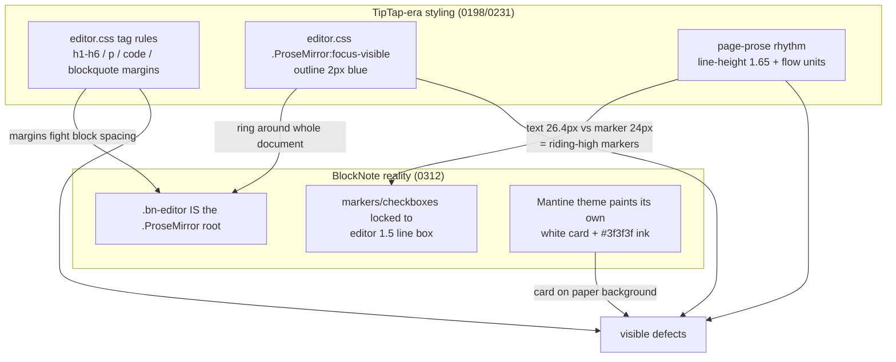

# BlockNote Visual Polish: Legacy Editor CSS Cleanup

## Problem Statement

The 0312 TipTap → BlockNote migration swapped the editor engine but left the
TipTap-era styling layers in place. Rendering every element on a fresh page
and screenshotting it surfaced three visible defects:

1. **Misaligned list markers and checkboxes** — bullets, list numbers, and
   to-do checkboxes all sat visibly high relative to their text lines.
2. **Wrong background color** — the document rendered as a white
   rounded-corner card floating on the page's warm paper background (and a
   near-black card in dark mode) instead of sitting on the page.
3. **Blue focus border** — clicking into the document drew a 2px blue
   outline around the entire editable surface.

## Executive Summary

All three defects were lingering TipTap-era CSS interacting badly with
BlockNote's DOM, plus BlockNote's own Mantine theme default:

- The **misalignment** came from `.page-prose .ProseMirror { line-height: 1.65 }`
  (the 0198 rhythm system) overriding BlockNote's text line-height while its
  list markers/checkboxes stay geometry-locked to the editor's own 1.5 line
  box — text lines grew to 26.4px, markers stayed at 24px, so every marker
  rode high. Measured after the fix: **checkbox-to-first-line delta 0.0px**.
- The **background** was BlockNote's Mantine theme default
  (`--bn-colors-editor-background: #fff` / near-black in dark, radius 8px) —
  the editor painted its own card because nothing told it the page provides
  the paper.
- The **blue border** was `.ProseMirror:focus-visible { outline: 2px solid … }`
  in `packages/editor/src/styles/editor.css` — a 0231-era a11y rule written
  when `.ProseMirror` was an inner node. In BlockNote, `.bn-editor` *is* the
  ProseMirror root, and contenteditable elements match `:focus-visible` even
  for pointer focus, so the whole document got the ring on every click.

The fix: rewrite `editor.css` down from 727 to ~230 lines (delete the entire
TipTap typography/taskList/live-preview/drag-handle/comment-mark layers, keep
the token + caret/selection accessibility contract, add a BlockNote surface
adoption section), shrink the `page-prose` block from ~120 lines of rhythm
rules to font-size + gutter + caret breathing room, and style the previously
bare page-embed chip. Verified in light and dark, focused and unfocused.

## Current State In The Repository

Before this change, two style layers still assumed the TipTap DOM:

- `packages/editor/src/styles/editor.css` (727 lines): tag-level typography
  (`h1–h6` with Tailwind margins, `ul/ol/li`, `p { margin-block }`,
  `code/pre/blockquote`), `ul[data-type='taskList']` checkbox geometry,
  live-preview `.md-syntax` animation classes, `.xnet-drag-handle`,
  `.xnet-suggestion-popup`, `.collaboration-cursor__*`, comment-mark
  highlight classes, and the `.ProseMirror:focus-visible` outline. In the
  BlockNote DOM (`.bn-block-group > .bn-block-outer > .bn-block >
  .bn-block-content`) the list/taskList selectors go dead, but the tag rules
  (`h1–h6`, `p`, `code`, `pre`, `blockquote`) and the focus outline still
  match BlockNote's inner elements and fight its layout.
- `apps/web/src/styles/globals.css` `page-prose` block (~120 lines): the
  0198 em-based rhythm system — flow units between siblings, "space
  precedes" heading margins with `:has()` NodeView-wrapper piercing, list
  indents, and `lh`-unit checkbox centring — all keyed to the old DOM. The
  root `line-height: 1.65` was the marker-misalignment culprit; the rest was
  mostly dead weight with occasional misfires.
- BlockNote's surface itself: `@blocknote/mantine` themes paint
  `--bn-colors-editor-background` (white/near-black) with an 8px radius and
  `--bn-colors-editor-text: #3f3f3f` — none of which match the xNet page
  (warm paper, ink `#111`/`#ededed`).
- `packages/editor/src/blocknote/specs/page-embed.tsx` rendered a bare
  `xnet-page-embed` button with no styles (icon crammed against the title)
  because its class had CSS only in the deleted TipTap NodeView era.



## External Research

- BlockNote theming: the editor surface colors come from CSS variables
  (`--bn-colors-editor-background`, `--bn-colors-editor-text`, …) declared by
  the view package's theme on `.bn-container` — overridable at equal
  specificity by declaring later in the cascade
  (https://www.blocknotejs.org/docs/react/styling-theming/themes).
- `:focus-visible` on contenteditable: per the CSS selectors spec and
  browser behavior, editable elements match `:focus-visible` whenever
  focused, regardless of input modality — so a focus ring on the editor root
  shows on every mouse click, unlike buttons. The conventional pattern for
  document editors (Notion, Google Docs, BlockNote's own demos) is **no
  ring on the document surface**; the caret is the focus indicator, and
  high-contrast/forced-colors media queries reinstate outlines for users
  who opt in at the OS level.
- BlockNote derives marker/checkbox geometry from the editor's font size
  and its internal line height; overriding `line-height` from outside
  desynchronizes text lines from marker boxes (the exact class of bug seen
  here). Sizing should flow through `font-size` only.

## Key Findings

1. **One root override caused all the misalignment.** `line-height: 1.65`
   on `.page-prose .ProseMirror` grew text line boxes to 26.4px while
   BlockNote's `::before` markers and checkbox wrappers stayed at the
   editor-native 24px. Removing the override snapped every marker to its
   line: measured checkbox-center vs first-line-center delta went from
   ~+2.5px to **0.0px**, and bullet/number markers now share the exact
   line-height (24px/24px) of their text.
2. **The focus ring rule was doing the opposite of its intent.** Written for
   keyboard-navigation a11y on an inner node, it now decorated the whole
   document on pointer focus. The caret + selection colors (which the
   stylesheet's pinned accessibility contract keeps) are the focus
   indicators; explicit outlines remain in the `prefers-contrast: high` and
   `forced-colors: active` blocks for users who ask for them.
3. **The background needed a variable override, not a repaint.** Setting
   `--bn-colors-editor-background: transparent` +
   `--bn-colors-editor-text: rgb(var(--editor-foreground))` on
   `.xnet-editor .bn-container` (declared after the imported BlockNote
   styles, so the equal-specificity override wins in the cascade) fixes both
   themes at once and leaves BlockNote's menus/toolbars themed normally.
4. **~500 lines of editor.css were dead or harmful.** Everything keyed to
   the TipTap DOM (taskList geometry, live-preview syntax classes, drag
   handle, suggestion popup, collaboration cursor labels, comment marks,
   db-comment hover) had zero matching elements — except the tag-level
   typography and the focus ring, which matched and misfired. The rewrite
   keeps: theme tokens (pinned by `editor-css.test.ts`), base
   caret/selection/selected-node rules, the inline chip styles the 0312
   specs actually use (`data-wikilink`, `data-task-mention`, `data-hashtag`,
   `data-ai-generated`), and the a11y media blocks.
5. **The AI-provenance style spec had no matching CSS** — the old rule
   targeted `.xnet-ai-generated-mark` but the 0312 spec renders
   `[data-ai-generated]`. The rewrite re-keys the dashed-underline
   disclosure to the attribute the spec emits.

## Options And Tradeoffs

### Background fix

- **A (chosen): override BlockNote CSS variables, scoped to `.xnet-editor`** —
  one declaration fixes light + dark, menus stay themed, no fork of
  BlockNote's theme object in JS.
- B: pass a custom `theme` object to `BlockNoteView` — works but moves
  styling into JS props, duplicates the light/dark split, and overrides more
  than needed.

### Alignment fix

- **A (chosen): stop overriding what BlockNote derives** — page sets
  `font-size` (the one knob BlockNote scales from) and nothing else.
  Sacrifices the bespoke 0198 rhythm (flow units, "space precedes"
  headings) in favor of BlockNote's own spacing.
- B: port the rhythm system to the BlockNote DOM (`.bn-block-outer` margins,
  marker `::before` line-height matching) — preserves the 0198 look but
  re-creates the standing risk of fighting upstream geometry on every
  BlockNote upgrade, for a spacing difference that is barely perceptible at
  16px.

### Focus ring

- **A (chosen): remove the always-on ring; keep caret/selection as focus
  indicators; keep opt-in outlines under `prefers-contrast: high` and
  `forced-colors`** — matches every mainstream document editor.
- B: switch to `:focus-visible` with a keyboard-only polyfill class — extra
  machinery for a surface where the caret already communicates focus.

## Recommendation

Ship Option A on all three (done in this exploration's implementation):
`editor.css` rewritten to the BlockNote-era contract, `page-prose` reduced
to font-size + gutter + caret breathing room, page-embed chip styled with
the same utility-class approach as the other 0312 spec cards.

## Example Code

The BlockNote surface adoption block (now in
`packages/editor/src/styles/editor.css`):

```css
/* Declared after the imported @blocknote styles so the equal-specificity
   override wins in the cascade, for BOTH color schemes. */
.xnet-editor .bn-container {
  --bn-colors-editor-background: transparent;
  --bn-colors-editor-text: rgb(var(--editor-foreground));
}

.xnet-editor .bn-editor {
  background-color: transparent;
  border-radius: 0;
}
```

The whole remaining `page-prose` document contract
(`apps/web/src/styles/globals.css`):

```css
.page-prose .ProseMirror {
  --page-pad-x: 2rem; /* symmetric gutter, shared with the page title */
  font-size: var(--font-prose-size);
  padding-bottom: 20vh;
}

.page-prose .ProseMirror.tiptap {
  padding-left: var(--page-pad-x);
  padding-right: var(--page-pad-x);
}
```

## Risks And Open Questions

- **Other surfaces inherit the same editor.css** (canvas inline pages,
  task editor, meetings). They previously got the TipTap tag typography as
  their base; now they get BlockNote defaults. Spot-checks look right, but
  canvas-inline density may want its own smaller `font-size` later.
- **The 0198 rhythm identity is retired**, not ported. If the bespoke
  "space precedes headings" rhythm is missed, Option B above documents the
  port path (BlockNote block-outer margins) — a deliberate follow-up, not a
  regression fix.
- The Electron renderer shares `@xnetjs/editor` styles but has its own
  globals; it never had the web `page-prose` rules, so it only gains fixes.
- `editor-css.test.ts` pins the caret/selection/selected-node contract and
  passes against the rewrite; it does not (and should not) pin the deleted
  TipTap rules.

## Implementation Checklist

- [x] Render every block type (headings, paragraph, lists, checkboxes,
      quote, code, table, callout, mermaid, page embed, rich link, mention/
      hashtag/wikilink/math chips) on a fresh page and screenshot
- [x] Remove `.ProseMirror:focus-visible` outline (the blue border); keep
      `prefers-contrast: high` and `forced-colors` outlines
- [x] Add BlockNote surface adoption: transparent editor background, square
      corners, ink-token text color, both themes
- [x] Delete TipTap-era layers from `editor.css`: tag typography, taskList
      geometry, live-preview `.md-syntax`, drag handle, suggestion popup,
      collaboration cursor labels, comment marks, db-comment hover,
      placeholder rules (BlockNote provides its own)
- [x] Re-key the AI-provenance underline to `[data-ai-generated]` (the
      selector the 0312 style spec actually emits)
- [x] Reduce `page-prose` to font-size + gutter + bottom padding; drop the
      `line-height: 1.65` override that misaligned every marker
- [x] Style the page-embed chip (utility classes, hover, full-width card)
- [x] `editor-css.test.ts` + editor package suite green (17 files, 84 tests)

## Validation Checklist

- [x] Light mode screenshot: no white card — document sits on the paper;
      bullets, numbers, and checkboxes centered on their lines
- [x] Dark mode screenshot: transparent surface, ink-token text, aligned
      markers
- [x] Focused editor shows no outline (`outline-color` computes transparent,
      no box-shadow); caret + selection still visible
- [x] Measured checkbox-center vs first-text-line-center delta = 0.0px;
      bullet marker and text line-heights equal (24px/24px)
- [x] Editor package tests green including the pinned CSS accessibility
      contract
- [ ] CI required checks green on the PR (editor-ux drives the same page in
      Chromium desktop + mobile)

## References

- In-repo: `packages/editor/src/styles/editor.css` (rewritten),
  `apps/web/src/styles/globals.css` (`page-prose`),
  `packages/editor/src/blocknote/specs/page-embed.tsx`,
  `docs/explorations/0312_[x]_TIPTAP_TO_BLOCKNOTE_EDITOR_MIGRATION.md`,
  `0198` (rhythm system now retired), `0231` (origin of the focus ring and
  checkbox-centring rules), `0299` (background plane conventions)
- BlockNote theming: https://www.blocknotejs.org/docs/react/styling-theming
