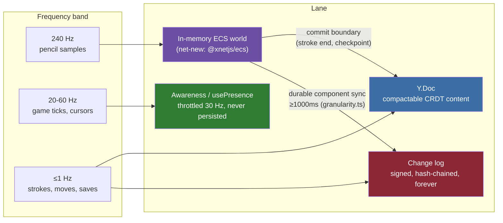
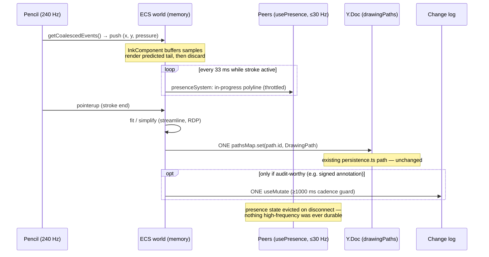
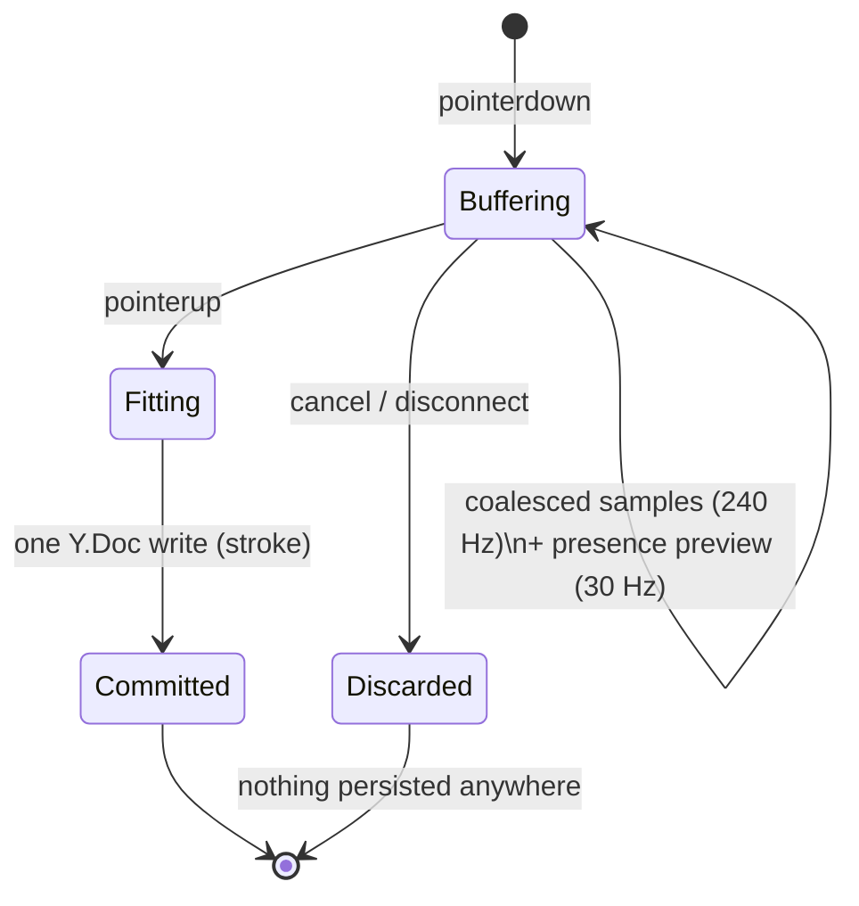

# Entity Component System On xNet: High-Frequency State And Wire Trade-offs

## Problem Statement

Should xNet adopt an Entity Component System (ECS)? And what are the
performance trade-offs of using xNet's data layer to store *every* Apple
Pencil draw event (240 Hz), per-frame game mechanics (20–128 Hz ticks), or
any other high-frequency stream — both at rest (the signed, hash-chained
change log) and over the wire (the hub WebSocket relay)?

Three sub-questions:

1. **The "E" and "C"** — does xNet's node/schema/property model already give
   us entities and components, and what would a real ECS add?
2. **The write path** — what does one change *cost* (crypto, SQLite fan-out,
   permanence), and at what frequency does that cost become a cliff?
3. **The wire** — what does one change cost to transmit, how do the existing
   throttles and rate limits bound frequency, and how does that compare to
   what game netcode and multiplayer canvases actually ship?

## Executive Summary

**xNet is already half an ECS — it has entities and components, but no
systems, and its component store is a durability ledger, not a frame
buffer.** A node is an entity; its schema-typed properties are components
with per-property LWW registers (`packages/core/src/lww.ts`); relation
includes are the "fetch all components of an entity" join. What ECS adds —
archetype iteration over tens of thousands of entities per frame — is
precisely what the change-log write path can never do, *by design*.

The arithmetic is decisive. One `useMutate` write costs: one canonical-JSON
serialize + one BLAKE3 change hash + one BLAKE3 tiebreak key per property +
one Ed25519 signature (~0.2 ms), a fan-out to ~6 SQLite tables (change row +
5 indexes, `node_properties`, scalars, FTS, materialized-view invalidation),
one WebSocket frame carrying ~500–600 bytes of envelope around a
~40-byte payload, and **one permanent row replayed on cold open**. At Apple
Pencil rates (240 Hz) that is 864k rows/hour — reproducing the measured
318k-row / multi-second cold-open stall (explorations 0249/0254/0260) in
**~22 minutes of drawing**. The wire is disqualified even sooner: the client
throttles node-changes to 40 msg/s and the hub closes sockets above
100 msg/s — a single 240 Hz stream is 6× over the hub cap before a second
user says anything.

The repo already codifies the answer as an *enforced rule*:
`packages/unreal/src/granularity.ts` — **"if it belongs in a save file it can
sync to xNet; if it belongs in a netcode packet it must not"** — with a hard
1000 ms cadence floor. And exploration 0314 built the three-lane model
(change log / Y.Doc / Awareness) that every production multiplayer system
(Figma, tldraw, Liveblocks) independently converged on: durable channel for
low-frequency property-granular LWW state, ephemeral channel for
high-frequency input, never crossed.

**Recommendation: don't put an ECS in the core; put the core under an ECS.**
Ship `@xnetjs/ecs` as a periphery package wrapping an in-memory archetype ECS
(koota for React ergonomics, bitECS for raw throughput), where xNet is the
*save file* and the ECS world is the *frame state*, connected by explicit
commit-boundary systems that write durable components at ≤1 Hz through the
existing granularity guard. For the pencil specifically: coalesced 240 Hz
samples buffer in memory, the in-progress stroke previews to peers via
`usePresence` at 30 Hz, and exactly **one** durable write happens per stroke
— which is what `packages/canvas/src/drawing/` already does today.

## Current State In The Repository

### The node model is a proto-ECS (entities ✓, components ✓, systems ✗)

- **Entity** ⇢ a node: `nodes` table row + stable id
  (`packages/sqlite/src/schema.ts`).
- **Component** ⇢ per-property LWW registers: `node_properties` has PK
  `(node_id, property_key)` with `lamport_time`, `updated_by`, `tiebreak_key`
  per property (`packages/sqlite/src/schema.ts:40`) — conflict resolution is
  per-(entity, component), exactly Figma's model. The single LWW kernel is
  `packages/core/src/lww.ts` (`compareLwwStamps` at `:91`, v4
  grinding-resistant tiebreak `computeLwwTiebreakKey` at `:68`).
- **Component query / join** ⇢ `QueryASTRelationInclude` in `@xnetjs/data`
  (`packages/data/src/store/query-ast.ts`) — relation traversal is how
  "all components of an entity" and "all entities with component X" resolve.
- **Closest existing ECS-shaped code**: the social graph lenses
  (`packages/social/src/lenses/graph-lenses.ts`) define typed
  roles/relationship-kinds over `SocialActor/Content/Interaction/…` schemas
  and query them by shape — entities-by-archetype in spirit. Scene-graph
  spatial primitives live in `packages/canvas-core/src/` (camera,
  coordinates, connectors). There is **no first-class ECS naming anywhere in
  product code** — this would be net-new.
- **Systems** — the per-frame iterate-all-entities-with-components loop —
  have no substrate. The store is not iterable at frame rate: reads cross a
  worker boundary and the reactivity pipeline is schema-granular (below).

### What one change costs (the write path, end to end)

One public mutation (`NodeStore.update`, `packages/data/src/store/store.ts`,
~`:440`) produces exactly one `Change` and pays:

| Stage | Cost | Where |
| --- | --- | --- |
| Auth check | evaluator per node | `packages/data/src/auth/evaluator.ts` |
| Parent-hash fetch | 1 read on the hot write path | `store.ts:1879` → `storage.getLastChange` |
| Canonical JSON | recursive key sort + stringify | `packages/sync/src/change.ts:201` |
| Change hash | 1 × BLAKE3 (32 B) | `computeChangeHash`, `change.ts:201` |
| Tiebreak keys | 1 × BLAKE3 **per property** (protocol v4) | `packages/core/src/lww.ts:68` |
| Signature | 1 × Ed25519 (64 B), target <0.2 ms sign / <0.5 ms verify | `signChange`, `change.ts:234`; targets in `packages/crypto/src/benchmark.test.ts:10` |
| Change append | 1 permanent `changes` row + **5 index updates** | `sqlite-adapter.ts:548`; indexes `schema.ts:262` |
| Projection | `nodes` upsert + per-property `node_properties` upsert (LWW guard) + `node_property_scalars` + FTS5 + MV invalidation | `_setNodeInternal`, `packages/data/src/store/sqlite-adapter.ts:838-919` |
| Forever cost | row is replayed on cold open; only superseded rows are prunable | `pruneSupersededChanges`, `sqlite-adapter.ts:653` (0254) |

The change is not a delta-compressed sample; it is a **notarized document**:

```ts
// packages/sync/src/change.ts:39 — the interop kernel (protocol v4)
interface Change<T> {
  id: string                    // nanoid
  payload: T                    // { nodeId, schemaId?, properties }
  hash: ContentId               // "cid:blake3:<64 hex>" — 75 chars
  parentHash: ContentId | null  // hash chain
  authorDID: DID
  signature: Uint8Array         // Ed25519, 64 bytes (88 chars base64)
  wallTime: number
  lamport: LamportTimestamp
}
```

### What one change costs on the wire

- **One change = one WebSocket frame.** `publishChange`
  (`packages/runtime/src/sync/node-store-sync-provider.ts:672`) sends
  `{ type: 'node-change', room, change }` immediately — no coalescing. The
  `batchId/batchIndex` fields group atomic transactions, not wire frames.
- **Envelope ≈ 500–600 bytes before payload**: `serializeChange` (`:694`)
  carries the 75-char hash, 75-char parent hash, 88-char base64 signature,
  the author DID *twice* (`lamportAuthor` + `authorDid`, ~55 chars each),
  ids, timestamps, and JSON syntax. A pencil point payload
  `{x, y, pressure}` is ~40 bytes — a **~15:1 envelope-to-payload ratio**.
  Netcode ships the same information in 3–6 bytes (see External Research).
- **Throttles bound the ceiling**: client outbound node-changes capped at
  **40 msg/s** (`MAX_SENDS_PER_WINDOW`, `node-store-sync-provider.ts:22`);
  hub closes the socket above **100 msg/s per connection**
  (`packages/hub/src/middleware/rate-limit.ts`, wired `server.ts:305`);
  Y.Doc lane sends one frame per transaction with no debounce
  (`WebSocketSyncProvider.ts:502`, `sync-manager.ts:900`); heavy-resync
  warns at 5000 changes / 250 ms. Every byte relays through the hub —
  WebRTC is a skipped test, not a feature.

### The three lanes (0314) — the escape hatches already exist

| Lane | API | Persisted? | Frequency ceiling |
| --- | --- | --- | --- |
| Change log | `useMutate` | Signed, hash-chained, quota-metered, forever | ~1 Hz by convention; 1000 ms enforced floor for connectors |
| Y.Doc | `useNode().doc` | CRDT content, compactable, **not** the change log | 1 frame/transaction; batch your transactions |
| Awareness | `usePresence` / `CanvasPresenceManager` | Nothing — evicted on disconnect | 30 Hz throttle default (33 ms), floor ~16 ms |

- `packages/react/src/hooks/usePresence.ts` (from 0314/PR #494) is explicit
  in its docstring: broadcast high-frequency state *"WITHOUT touching the
  persisted hash-chained change log … nothing is written to `node_changes`
  (the 0249 cold-open lesson)"*. Leading+trailing coalescing, default 33 ms.
- Canvas presence throttles cursor/viewport to ~30 fps
  (`packages/canvas/src/presence/canvas-presence.ts`);
  `selection-lock.ts` already carries game-shaped semantics (ephemeral edit
  locks) on this lane.

### Drawing already does the right thing — one stroke, one write

- A stroke is **one `DrawingPath`** — `{ id, points: PressurePoint[],
  smoothed?, strokeWidth, strokeColor, opacity, timestamp }`
  (`packages/canvas/src/drawing/types.ts:25`). Points are buffered locally
  during the gesture and persisted **once, on stroke-end**, as a single
  Y.Map entry: `persistCanvasDrawingPath` →
  `doc.transact(() => pathsMap.set(path.id, path))`
  (`packages/canvas/src/drawing/persistence.ts:51`). The Y.Doc lane, not the
  change log.
- The chunking machinery (`packages/canvas/src/chunks/chunked-canvas-store.ts`)
  is spatial-grid chunking of canvas *objects* for infinite-canvas
  progressive load — not a draw-event buffer. Frame monitoring exists in
  `packages/canvas/src/performance/`.

### The durability boundary is already an enforced rule

`packages/unreal/src/granularity.ts` (exploration 0200, Unreal bridge) is the
load-bearing statement of policy, enforced at connector build time:

> "If it belongs in a save file it can sync to XNet; if it belongs in a
> netcode packet it must not."

- `MIN_SYNC_INTERVAL_MS = 1000` (`granularity.ts:29`) — hard floor;
  `assertDurableCadence` throws `GranularityError` below it; the docstring
  names the reason: "a 60 fps frame is ~16 ms; even a 10 Hz tick is 100 ms
  and must never drive CRDT writes."

### The read side would melt too (0317)

Even ignoring writes, ECS-style hot components would break the reactivity
pipeline as it stands:

1. **Per-schema fan-out**: every change to a schema visits *every* cached
   query on that schema (`packages/data-bridge/src/query-descriptor.ts`,
   exploration 0317). A hot "Position" component-as-schema would wake every
   subscriber on every entity's movement.
2. **The 250-change cliff**: above 250 changes in a burst, every subscribed
   query on affected schemas falls back to a full SQLite reload + full
   snapshot serialization across the worker boundary — the delta engine is
   discarded exactly when a game tick needs it most.
3. Materialized views don't rescue this: the tables exist
   (`node_query_materializations`, `schema.ts:101`) with zero production
   opt-in, because a materialization is only as good as its invalidation
   precision (0317's conclusion). The in-flight scale measurements
   (exploration 0318, unmerged) reinforce the shape: indexed point reads
   stay flat (~0.8 ms at 10M rows) while sorts, counts, and offsets are the
   O(N) cliffs — the change *log* and full scans are the problem, not keyed
   lookups.

### The frequency cliff, quantified

At 240 Hz (Apple Pencil sample rate) through `useMutate`:

- **Crypto**: 240 × (~0.2 ms sign + hash + canonical JSON) ≈ 5–10% of a
  core doing nothing but notarizing pencil samples.
- **Storage**: 864,000 permanent rows/hour. The measured cold-open stall
  (0249: `sinceLamport: 318066`, two full-log deserializes at ~3.1 s each
  with `JSON.parse` per row, 0254/0260) is reproduced by **~22 minutes** of
  drawing. At ~600 B/row on the wire and in quota, that's also
  **~500 MB/hour** of hub quota per drawing user.
- **Wire**: 240 msg/s vs a 40 msg/s client throttle — the outbound queue
  grows without bound; if it didn't, the hub's 100 msg/s cap closes the
  socket. This isn't a tuning problem; it's a category error, and
  `granularity.ts` already says so.



## External Research

### JS/TS ECS libraries (candidates for the runtime tier)

| Library | Architecture | min+gz | Notes |
| --- | --- | --- | --- |
| **bitECS** v0.4 | SoA TypedArrays | 5.7 KB | Fastest iteration (~335k ops/s packed-5 in noctjs/ecs-benchmark, ~3× object libs); v0.4 adds **observers + a serialization module** (SoA snapshots + add/remove tracking) explicitly for network sync. Weakness: entity churn (add/remove). |
| **koota** (pmndrs) | Trait/archetype, React-first | 10.7 KB | The only ECS designed as *React state management* (`useTrait`, `useQuery` hooks) — closest in spirit to `@xnetjs/react`. Pre-1.0. |
| **miniplex** | Plain-object AoS | 3.7 KB | Best DX, entities are POJOs (maps directly onto node data); ~3× slower iteration. |
| **becsy** | Hybrid OO + ArrayBuffer, worker multithreading | 25.6 KB | Heaviest; multithreading is the differentiator. |
| ecsy | Object | — | Abandoned; 40× slower; historical only. |

### There is no ECS-over-CRDT prior art — the space split three ways

Searches found **no established ECS-over-CRDT library**. Existing systems
split into:

- **ECS + bespoke server relay**: Javelin (`@javelin/net` — TS ECS with
  built-in server-authoritative replication; self-reports ~2.5M entities
  iterated per 16 ms frame), bitECS v0.4 serializers. Not CRDT.
- **CRDT docs with object ergonomics**: SyncedStore (POJO proxy over Yjs),
  Automerge/Yjs — document-shaped, not ECS-shaped.
- **Deterministic replicated computation**: Croquet/Multisynq — no state
  sync at all; a reflector orders input events and identical deterministic
  VMs replay them. The one model where "store every input event" is the
  design — and it requires perfect determinism, which JS floats and
  iteration order make brutal (Fiedler's lockstep caveats).

An ECS whose durable component store is an LWW change log appears to be
genuinely novel territory; the nearest cousin is Figma's per-(object,
property) LWW — which is exactly xNet's `node_properties` model.

### What production multiplayer actually does (the convergent split)

- **Figma**: conflict unit is (object, property), LWW, explicitly *not*
  CRDTs ("with a central server the decentralization machinery is
  overhead"); undo is client-side inverse ops, not a sync concern;
  **presence rides a separate ephemeral path** from document edits.
- **tldraw sync**: one Durable Object per room; document records persisted;
  **`instance_presence` records are never persisted**; conflicts resolved by
  client rebase (undo local → apply server → replay local).
- **Excalidraw**: E2E-encrypted relay (server can't read content — the
  xNet-relevant precedent); per-element `version` + random `versionNonce`
  tiebreak (element-level LWW); only newer versions broadcast.
- **Liveblocks**: Storage (durable, conflict-free) vs Presence (ephemeral,
  expiring) is a first-class API boundary.

Every one of them independently arrived at xNet's 0314 lane split.

### Game netcode numbers (what "over the wire" costs when done for real)

- **Gaffer On Games taxonomy**: deterministic lockstep (send inputs only) /
  snapshot interpolation / state sync (input + state, no determinism
  required). Snapshot-compression case study: 901 cubes at 60 snapshots/s =
  17.37 Mbps raw (40.125 B/object) compressed to **~15 kbps at rest** via
  smallest-three quaternions (128→29 bits), ~2 mm position quantization
  (96→50 bits), and **delta-vs-acked-baseline** (avg 26.1 bits/changed
  position — ~3–6 *bytes* where xNet's envelope alone is ~500).
- **Quake 3**: no reliable packets; server keeps a 32-snapshot ring buffer
  per client and sends deltas against the last *acked* snapshot; loss makes
  the delta base older, nothing breaks.
- **Overwatch (GDC 2017)**: strict ECS chosen *to make netcode tractable*;
  server-authoritative, client predicts everything by default; fixed 16 ms
  command frames (7 ms tournament).
- **GGPO/rollback**: inputs-only P2P; CPU (re-simulation) is the price of
  bandwidth. The universal pattern: **unreliable transport +
  delta-vs-acked-baseline for state; a reliable ordered channel only for
  discrete events**. xNet's change log is the second channel, never the
  first.

### Apple Pencil and how drawing apps persist ink

- Pencil scans at **240 Hz** (touch 120 Hz, display 60–120 Hz) — UIKit
  delivers one `touchesMoved` per frame and exposes intermediates via
  `coalescedTouches(for:)`; `predictedTouches(for:)` gives ~1 frame of
  look-ahead that is **drawn, then discarded and replaced** — an explicit
  ephemeral/durable split at the input layer. Web equivalents:
  `getCoalescedEvents()` / `pointerrawupdate`.
- **PencilKit does not persist samples**: `PKStrokePath` is a uniform cubic
  **B-spline whose stored points are fitted control points**, not the 240 Hz
  event stream. Apple durably stores the curve, not the events.
- **perfect-freehand** (tldraw's ink) stores the raw `(x, y, pressure)`
  input array and derives the outline polygon at render time, with a
  `streamline` smoothing option; hosts typically decimate
  (Ramer-Douglas-Peucker) before persisting.

### CRDT metadata overhead (for calibration)

Ed25519 signature 64 B; BLAKE3 hash 32 B — xNet's fixed envelope floor is
~128 B of crypto material before payload or JSON syntax. For comparison:
Automerge 2.0 columnar text ≈ 4–6 B/char (40–60% overhead); Fugue reference
≈ 23 B/char in memory; production rule-of-thumb ≈ 2–3× metadata-to-data.
xNet's per-change overhead on a 40-byte payload is ~15×, because the
envelope buys *authenticity and audit*, not just convergence — which is why
it must be spent on save-file events, not netcode packets.

## Key Findings

1. **xNet already has E and C.** Node = entity; per-property LWW registers =
   components (`node_properties` PK `(node_id, property_key)`); relation
   includes = component joins. Figma's celebrated model *is* this model.
   What's missing is only the S — frame-rate systems iteration — and that
   belongs in memory, not in SQLite behind a worker boundary.
2. **The change log is disqualified from high-frequency duty by arithmetic,
   and the repo already knows it.** ~128 B crypto floor + ~500 B envelope on
   a ~40 B payload (~15:1), ~0.2 ms sign, 6-table write fan-out, 5 index
   updates, and a permanent replayed-on-boot row — 240 Hz reproduces the
   318k-row cold-open stall in ~22 minutes and ~500 MB/hour of quota.
   `granularity.ts` enforces the boundary (1000 ms floor);
   0314's lane model provides the alternatives.
3. **The wire is bounded by design**: 1 change = 1 frame, 40 msg/s client
   throttle, 100 msg/s hub cutoff. Real netcode ships deltas against acked
   baselines at 3–6 bytes over unreliable transport; a signed hash-chained
   envelope is structurally the wrong tool — it is the *reliable events
   channel* in the standard two-channel pattern, and it's a good one.
4. **Nobody has built ECS-over-CRDT** — prior art splits into ECS+server
   relay (Javelin), CRDT documents (Yjs/Automerge), and deterministic
   replay (Croquet). The viable hybrid is layering: in-memory ECS world for
   frames, presence for peers' views of frames, CRDT/log for outcomes.
5. **Even Apple doesn't store pencil events.** PencilKit persists fitted
   B-spline control points; predicted touches are drawn and thrown away.
   The durable unit of ink is the *stroke*, post-fit — exactly what
   `packages/canvas/src/drawing/persistence.ts` does (one Y.Map entry per
   stroke, on stroke-end).
6. **The read side confirms the write side**: per-schema query fan-out and
   the 250-change bulk cliff (0317) mean hot components-as-schemas would
   stampede every subscriber. ECS reads must be in-memory queries over the
   world, with xNet reactivity reserved for durable checkpoints.

## Options And Tradeoffs

### Option A — ECS in the core: component = schema, entity = node, systems over the store

Make the change log the component store; systems run `useQuery`-shaped scans
per tick.

- ✅ One data model, full audit of every state transition, time travel for
  free.
- ❌ Every finding above: write-path arithmetic (2), wire caps (3), read
  fan-out (6). A 20 Hz game with 50 entities = 1000 changes/s = 25× the
  client throttle and a cold-open death spiral. Croquet-style event
  sourcing without Croquet's deterministic VM gives you the log *and*
  divergence.
- **Verdict: rejected.** This is the strawman the granularity guard exists
  to kill.

### Option B — ECS as a runtime layer: xNet is the save file (recommended)

`@xnetjs/ecs`: an in-memory archetype ECS world (koota's React hooks over
bitECS-class storage) hydrated *from* nodes, with explicit commit-boundary
systems writing *back* at save-file cadence.

- Entity ↔ node id mapping; durable components hydrate from
  `node_properties`; frame components (velocity, interpolation targets,
  in-progress stroke points) exist only in the world.
- A `presenceSystem` broadcasts designated components at ≤30 Hz via
  `usePresence`; a `commitSystem` writes durable components through
  `useMutate`/Y.Doc at ≥1000 ms or on discrete events (stroke end, move
  made, match over), passing the same cadence assertion as
  `packages/unreal/src/granularity.ts`.
- ✅ Frame-rate iteration where it belongs (memory); audit/ownership/sync
  where they belong (log); no protocol changes; periphery package
  (independent versioning, no core risk); matches how Overwatch used ECS —
  as the *organizing structure that makes the network boundary legible*.
- ❌ Two sources of truth between commits (mitigated: the world is
  authoritative for ephemera *by definition*, like predicted touches);
  hydration cost on entity-heavy worlds; a new package to maintain.

### Option C — a fourth lane: typed high-frequency component streams

Extend Awareness into a first-class "frame lane": typed component-delta
messages, optional server-side ring buffer (Quake-style last-N snapshots)
for late joiners, delta-vs-acked-baseline encoding, msgpack framing (the
libp2p path already speaks length-prefixed msgpack —
`packages/network/src/protocols/sync.ts`).

- ✅ Principled netcode: late-join catch-up without persistence, real delta
  compression, unlocks contested-state games beyond what Awareness offers.
- ❌ A protocol surface (new message types, hub relay work, conformance
  vectors per 0200); rate-limit renegotiation; and 0314's demo tiers
  haven't yet exhausted the two ephemeral lanes we have.
- **Verdict: defer** until Option B hits the Awareness ceiling (e.g. a demo
  needs >30 Hz or late-join snapshots). Design notes captured here so the
  door stays open.

### Option D — wire batching for the change log (orthogonal, cheap)

Coalesce multiple `node-change` messages into one WebSocket frame in
`publishChange` (the Y.Doc lane already effectively batches per
transaction), and/or msgpack the envelope.

- ✅ Helps bulk operations (imports, seeds, checklist floods per 0296)
  regardless of ECS; envelope shrinks ~30–40% with binary encoding.
- ❌ Does nothing for the fundamental frequency mismatch (a 15:1 envelope at
  40 msg/s batched into frames is still a ledger, not a tick stream);
  touches the sync protocol (conformance kernels, 0305 lesson: protocol
  bumps ripple).
- **Verdict: worthwhile independent follow-up, not an ECS enabler.**

### The stroke lifecycle, end to end (Option B applied to the Pencil)





## Recommendation

Adopt **Option B now, D opportunistically, C deferred**:

1. **Name the model.** Add a short docs page ("Entities, components, and
   lanes") canonizing: node = entity, per-property LWW = durable component,
   presence field = frame component, and the frequency table from this doc.
   Half the value of ECS is vocabulary that makes the network boundary
   legible (the Overwatch lesson).
2. **Ship `@xnetjs/ecs` as a periphery package** (independent versioning,
   like `cli`/`trust`): koota-style world with `useEcsWorld(nodeQuery)`
   hydration, `presenceSystem` (usePresence-backed, 33 ms default), and
   `commitSystem` gated by the same cadence assertion as
   `granularity.ts` — refactor `assertDurableCadence` into `@xnetjs/core`
   or `@xnetjs/data` so both consumers share it.
3. **Prove it with the 0314 demo tier**: the drawing-game demo (strokes +
   presence + change-log rounds) is the perfect ECS showcase — three lanes,
   one world.
4. **Do not** raise the presence floor, batch the change log as an ECS
   workaround, or add per-frame anything to `changes`. The cliff numbers in
   this doc are the regression tests' rationale.

## Example Code

```ts
// packages/ecs/src/world.ts (sketch) — xNet as save file, world as frame state
import { createWorld, trait } from 'koota'

// Durable component: hydrated from node_properties, committed back on cadence
export const Position = trait({ x: 0, y: 0 })          // durable
export const Velocity = trait({ dx: 0, dy: 0 })        // frame-only
export const Ink = trait({ points: [] as PressurePoint[] }) // frame-only

export function createXNetWorld(client: XNetClient, opts: { room: string }) {
  const world = createWorld()

  // Hydrate: one entity per node, durable traits from properties
  const nodes = client.store.query({ schema: 'game.piece' })
  for (const n of nodes) world.spawn(Position({ x: n.properties.x, y: n.properties.y }), NodeRef(n.id))

  // Frame lane: designated traits broadcast via presence, never persisted
  const presence = createPresence(client, opts.room, { throttleMs: 33 })
  const presenceSystem = () =>
    presence.setState({ pieces: world.query(Position, Moving).map(snapshotOf) })

  // Save-file lane: durable traits commit through the granularity guard
  const commitSystem = throttleToCadence(1000 /* MIN_SYNC_INTERVAL_MS */, () => {
    for (const e of world.query(Position, Dirty))
      client.mutate.update(e.get(NodeRef).id, { x: e.get(Position).x, y: e.get(Position).y })
  })

  return { world, systems: [presenceSystem, commitSystem] }
}
```

```ts
// The pencil pipeline (web): 240 Hz in, 30 Hz preview, 1 write out
canvas.addEventListener('pointermove', (e) => {
  for (const s of e.getCoalescedEvents())      // all 240 Hz samples this frame
    ink.points.push({ x: s.offsetX, y: s.offsetY, pressure: s.pressure })
  presence.setState({ inProgress: ink.points }) // internally throttled to 33 ms
})
canvas.addEventListener('pointerup', () => {
  const path = fitStroke(ink.points)            // streamline / simplify
  persistCanvasDrawingPath(doc, path)           // ONE Y.Doc write (existing API)
  ink.points = []                               // 240 Hz history: gone, like Apple's predicted touches
})
```

## Risks And Open Questions

- **Divergence between world and store**: if a commit system crashes
  mid-game, frame state is lost by design — is that acceptable for every
  target genre? (For turn-based: yes, moves are in the log. For action
  demos: the loss window is one checkpoint interval.)
- **Hydration scale**: `useEcsWorld` over a 10k-entity query pays the
  worker-boundary snapshot cost once per mount; needs the 0317 delta path
  to stay incremental afterwards. Measure before promising >1k entities.
- **koota pre-1.0 / bitECS churn**: pin and wrap; the trait API surface we
  expose should be ours, not the library's (swap-ability).
- **Late joiners in ephemeral games**: without Option C's ring buffer, a
  reconnecting player sees presence only going forward. Y.Doc checkpoint
  state covers board games; fast games need C eventually.
- **Undo**: Figma's lesson — undo is client-side inverse ops, not a sync
  concern. An ECS `undoSystem` should target the *durable* lane only.
- **Where does `assertDurableCadence` live** after extraction — `core`
  (fixed-version lockstep) or `data`? Lockstep core means a major-ripple
  risk on change (0305 lesson).
- **Is a fourth lane inevitable?** If demos keep hitting the 30 Hz/no-replay
  ceiling, C stops being deferrable — the design sketch here should become
  its own exploration before any protocol work.

## Implementation Checklist

- [ ] Extract `assertDurableCadence` / `MIN_SYNC_INTERVAL_MS` from
      `packages/unreal/src/granularity.ts` into a shared module and
      re-export from `unreal` (no behavior change).
- [ ] Write the "Entities, components, and lanes" docs page (frequency
      table, lane mapping, the 22-minute/318k-row arithmetic) and link it
      from `usePresence` and `useMutate` docs.
- [ ] Scaffold `@xnetjs/ecs` (periphery, independent versioning): world
      wrapper, `NodeRef` trait, `useEcsWorld` hydration from a node query.
- [ ] Implement `presenceSystem` on `usePresence` (33 ms default, configurable
      down to 16 ms) and `commitSystem` gated by the shared cadence guard.
- [ ] Port the drawing-game demo (0314 tier 1) onto `@xnetjs/ecs` — strokes
      via existing `persistCanvasDrawingPath`, guesses via presence, rounds
      via change log.
- [ ] Add a regression test asserting no `node_changes` rows are produced
      by presence/frame systems during a simulated 60 s @ 240 Hz input run
      (extends 0314's lane-rule guard).
- [ ] (Orthogonal, Option D) Prototype node-change wire coalescing behind a
      flag in `publishChange`; measure envelope savings on the seed import
      path before touching protocol conformance.
- [ ] File the Option C "frame lane" design sketch as a future exploration
      stub if/when a demo hits the Awareness ceiling.

## Validation Checklist

- [ ] 60 s of synthetic 240 Hz pencil input produces exactly N `changes`
      rows where N = number of strokes (not samples) — verified by test.
- [ ] Presence preview holds ≤30 msg/s per client under continuous drawing
      (hub rate-limit headroom ≥3×) — verified against
      `packages/hub/src/middleware/rate-limit.ts` limits in an integration
      run.
- [ ] `useEcsWorld` hydration of 1k entities completes <100 ms after the
      store snapshot arrives; per-frame `world.query` iteration of 10k
      entities <1 ms (bitECS-class), measured in a benchmark in
      `packages/ecs`.
- [ ] Cold open of a workspace after a 1-hour drawing session shows no
      growth in `changes`-table replay time vs baseline (the anti-0249
      guarantee).
- [ ] The drawing-game demo runs three lanes concurrently with no
      `GranularityError` and no hub disconnects across a 10-minute
      4-player session.
- [ ] Changeset present for any publishable-package touch (`@xnetjs/ecs`
      will be new-publishable; `unreal` re-export is patch).

## References

### xNet repository

- `packages/core/src/lww.ts` — the single LWW kernel (v4 tiebreak)
- `packages/sync/src/change.ts` — change hash/sign (`:201`, `:234`)
- `packages/data/src/store/sqlite-adapter.ts` — append + 6-table projection
  (`:548`, `:838`), compaction (`:653`)
- `packages/sqlite/src/schema.ts` — `changes` table + 5 indexes (`:130`,
  `:262`), `node_properties` (`:40`)
- `packages/runtime/src/sync/node-store-sync-provider.ts` — 1 change/frame,
  40 msg/s throttle, envelope serialization (`:672`, `:694`, `:22`)
- `packages/hub/src/middleware/rate-limit.ts` — 100 msg/s cutoff
- `packages/react/src/hooks/usePresence.ts` — the ephemeral lane hook
- `packages/canvas/src/drawing/{types,persistence}.ts` — stroke = one write
- `packages/unreal/src/granularity.ts` — the save-file/netcode-packet rule
- `packages/network/src/protocols/sync.ts` — msgpack framing precedent

### Prior explorations

- 0314 — realtime games, the three-lane model, `usePresence` extraction
- 0249 / 0253 / 0254 / 0260 — the 318k-row cold-open series + compaction
- 0317 — useQuery reactivity, per-schema fan-out, 250-change cliff
- 0305 — v4 tiebreak, protocol-bump ripple lesson
- 0200 — portable protocol spec (Change kernel); Unreal bridge (granularity)
- 0296 — checklist conflict flood (bulk-write pathology precedent)

### External

- bitECS v0.4 (observers + serialization): https://github.com/NateTheGreatt/bitECS
- koota (pmndrs, React-first ECS): https://github.com/pmndrs/koota
- miniplex: https://github.com/hmans/miniplex · becsy: https://github.com/LastOliveGames/becsy
- ECS benchmark suite: https://github.com/noctjs/ecs-benchmark ·
  survey: https://www.webgamedev.com/code-architecture/ecs
- Javelin (ECS + net protocol): https://github.com/3mcd/javelin
- Figma multiplayer (property LWW, presence split):
  https://www.figma.com/blog/how-figmas-multiplayer-technology-works/
- tldraw sync (never-persisted presence records): https://tldraw.dev/docs/sync
- Excalidraw E2E collab: https://plus.excalidraw.com/blog/building-excalidraw-p2p-collaboration-feature
- Liveblocks storage vs presence: https://liveblocks.io/docs/ready-made-features/multiplayer/sync-engine/liveblocks-storage
- Croquet/Multisynq (deterministic replay): https://docs.multisynq.io/essentials/sync
- Gaffer On Games — networked physics series (lockstep / snapshots / state
  sync / snapshot compression): https://gafferongames.com/categories/networked-physics/
- Quake 3 netcode: https://fabiensanglard.net/quake3/network.php
- Overwatch ECS + netcode (GDC 2017): https://www.gdcvault.com/play/1024001/-Overwatch-Gameplay-Architecture-and
- GGPO rollback: https://www.ggpo.net/ ·
  https://www.snapnet.dev/blog/netcode-architectures-part-2-rollback/
- Apple coalesced touches: https://developer.apple.com/documentation/uikit/touches_presses_and_gestures/handling_touches_in_your_view/getting_high-fidelity_input_with_coalesced_touches
- Apple predicted touches: https://developer.apple.com/documentation/uikit/touches_presses_and_gestures/handling_touches_in_your_view/minimizing_latency_with_predicted_touches
- PencilKit `PKStrokePath` (B-spline control points):
  https://developer.apple.com/documentation/pencilkit/pkstrokepath-swift.struct
- `getCoalescedEvents()`: https://developer.mozilla.org/en-US/docs/Web/API/PointerEvent/getCoalescedEvents
- perfect-freehand: https://github.com/steveruizok/perfect-freehand
- Automerge 2.0 (columnar overhead): https://automerge.org/blog/automerge-2/
- CRDT benchmarks: https://github.com/dmonad/crdt-benchmarks
- Ed25519 (RFC 8032): https://www.rfc-editor.org/rfc/rfc8032 ·
  BLAKE3: https://github.com/BLAKE3-team/BLAKE3
