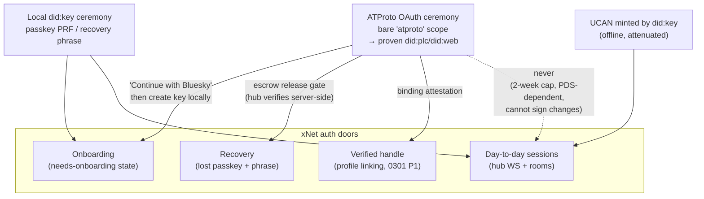

# Sign In With ATProto — Bluesky And Any PDS As An Authentication Door

## Problem Statement

Can xNet support **authentication via AT Protocol** — "Sign in with Bluesky,"
and really sign-in with *any* PDS (self-hosted, third-party, or Bluesky's)?

Exploration
[0301](0301_%5B_%5D_ATPROTO_INTEGRATION_IDENTITY_SYNC_AND_HUB_AS_PDS.md)
answered the broad ATProto question (identity: yes as a bridge; sync: no;
hub-as-PDS: demand-gated) and sketched "Login with atproto" as sub-option A2
in two sentences. This exploration goes deep on exactly that sub-option:

1. What does "auth" even *mean* for xNet, where identity is a locally held
   Ed25519 `did:key` and the hub has no account store — just UCAN tokens
   minted by the user's own key?
2. Which of xNet's real auth jobs can an ATProto OAuth flow actually do:
   onboarding? day-to-day sessions? account recovery? handle verification?
3. Does the flow genuinely work against **any** PDS, or only bsky.social?
4. Where should the OAuth client live — browser SPA, Electron, hub, cloud —
   and what does each placement cost?

## Executive Summary

**Yes to the door, no to the keys.** ATProto OAuth is a mature, stable,
registration-free OAuth 2.1 profile (PAR + DPoP + PKCE, `client_id` is a URL
to self-hosted metadata) whose *design center* is per-user discovery: the
client resolves each user's handle → DID → DID document → PDS → authorization
server at login time. Nothing is hardcoded to Bluesky, so "any PDS" is the
default behavior, not an extension. The reference PDS distribution has shipped
the authorization-server role since late 2024. The one honest caveat:
alternative PDS implementations (Blacksky/rsky, millipds, Cocoon) must
implement the AS side themselves — test before claiming universal support.

**But ATProto OAuth cannot replace xNet's identity — structurally.** The flow
yields exactly one thing: *proven control of an ATProto DID at a moment in
time* (the `sub` of the token response). There is no OIDC `id_token`, and by
design never will be. Meanwhile xNet's entire data model requires an Ed25519
`did:key` that signs every change locally
([`packages/sync/src/change.ts`](../../packages/sync/src/change.ts));
ATProto keys are ECDSA k256/p256 held by the PDS's auth stack, and no ATProto
token can sign an xNet change. So "sign in with Bluesky" can never *be* the
xNet identity — it can only stand at doors where "this human controls
`did:plc:X`" is the thing being checked.

**xNet has exactly three such doors, and ATProto fits all three:**

1. **Onboarding** (`needs-onboarding` boot state) — a "Continue with
   Bluesky" button: handle → OAuth (bare `atproto` scope) → local `did:key`
   created via the existing passkey/phrase machinery → binding auto-written
   (0301 Phase 1's attestation). ATProto supplies the *social* identity;
   the key ceremony stays local and unchanged.
2. **Recovery** — the big prize. Today's escrow recovery
   ([`packages/identity/src/escrow.ts`](../../packages/identity/src/escrow.ts),
   0243) gates on a **WorkOS billing session** — which only paying cloud
   customers have. An ATProto-gated escrow (hub releases the PIN-sealed seed
   only to a session that just proved control of the *bound* ATProto DID)
   gives every Bluesky user a recovery anchor with **no custodial IdP and no
   payment**, and inherits `did:plc`'s own rotation/recovery machinery
   (72-hour recovery window) — the exact continuity story `did:key` lacks
   (0149's open gap).
3. **Verified handles / linking** — 0301 Phase 1, unchanged, and a
   prerequisite for door 2.

**What ATProto explicitly should *not* do: live sessions.** Hub auth stays
UCAN-over-WebSocket minted by the local key
([`packages/hub/src/auth/ucan.ts`](../../packages/hub/src/auth/ucan.ts)) —
it's offline-capable, hub-verifiable without any network fetch, and
capability-attenuated. ATProto public-client sessions cap at ~2 weeks, need
the PDS to be reachable, and authenticate to the *PDS*, not to xNet. Treat
ATProto auth as a **ceremony** (one round trip when linking, onboarding, or
recovering), never as the session substrate. This single framing decision
dissolves most of the integration risk: token lifetimes, DPoP nonce
choreography, and PDS uptime all stop mattering between ceremonies.

**Client placement: browser public client for ceremonies; hub gains two tiny
server roles.** `@atproto/oauth-client-browser` handles web + Electron
(system-browser redirect); the hub adds (a) a handle-resolution helper (so
browsers don't leak login attempts to Bluesky's resolvers, and DNS-TXT handles
work) and (b) the escrow release endpoint that itself verifies the ATProto
proof server-side. A confidential client (180-day+ sessions) is *not needed*
for the ceremony model — skip it until something needs long-lived PDS access.

## Current State In The Repository

What "auth" concretely is in xNet today — the seams an ATProto door would
touch. (Deeper protocol-level state is in 0301; this section is auth-specific.)

### Identity: the key IS the account

- [`packages/identity/src/did.ts`](../../packages/identity/src/did.ts) —
  `createDID()`/`parseDID()`: `did:key` over Ed25519 only; `parseDID`
  hard-rejects every other method. The type is
  `` type DID = `did:key:${string}` ``
  ([`types.ts`](../../packages/identity/src/types.ts), mirrored in
  [`packages/core/src/auth-types.ts:12`](../../packages/core/src/auth-types.ts)).
- The unified entry point apps use is the passkey `IdentityManager`
  ([`packages/identity/src/passkey/index.ts`](../../packages/identity/src/passkey/index.ts)):
  `create`/`unlock`/`resume`/`lock` plus the whole 0243 recovery surface
  (`createRecoverable`, `importRecoveryPhrase`, `createGuardianShares`,
  `recoverViaSyncedPasskey`). WebAuthn PRF → HKDF → deterministic Ed25519
  seed ([`passkey/derive.ts`](../../packages/identity/src/passkey/derive.ts)).
- The web app holds one singleton
  ([`apps/web/src/lib/identity.ts`](../../apps/web/src/lib/identity.ts)) and
  a boot state machine with exactly the states an extra door would plug into:
  `needs-onboarding` → `unlocking` → `authenticated`
  ([`apps/web/src/boot/boot-machine.ts`](../../apps/web/src/boot/boot-machine.ts)).

### Hub auth: UCAN ceremony-free sessions, no account store

- Client mints a 24 h UCAN from its own key
  ([`packages/react/src/provider/use-hub-auth-token.ts`](../../packages/react/src/provider/use-hub-auth-token.ts))
  and sends it as the `xnet-auth.<token>` WebSocket subprotocol
  ([`packages/runtime/src/sync/connection-manager.ts:284`](../../packages/runtime/src/sync/connection-manager.ts)).
- Hub verifies signature-against-issuer-DID with zero external calls
  ([`packages/hub/src/auth/ucan.ts`](../../packages/hub/src/auth/ucan.ts)),
  then authorizes per room
  ([`packages/hub/src/ws/authorize.ts`](../../packages/hub/src/ws/authorize.ts)).
  There is no password, no session table, no IdP — the DID is the account.
  **This property is worth protecting**: any ATProto integration that makes
  day-to-day hub auth depend on a reachable PDS is a regression.

### Recovery: strong crypto, weak *anchors*

0243 shipped the mechanisms — phrase-born DIDs
([`recoverable.ts`](../../packages/identity/src/recoverable.ts)), GF(256)
Shamir guardian shares
([`seed-recovery.ts`](../../packages/identity/src/seed-recovery.ts)), PIN
escrow ([`escrow.ts`](../../packages/identity/src/escrow.ts)) — but the only
*hosted* anchor is the WorkOS billing identity
([`packages/cloud/src/identity/binding.ts`](../../packages/cloud/src/identity/binding.ts),
[`workos.ts`](../../packages/cloud/src/identity/workos.ts)): dual-proof
`bindIdentities` / `recoverPaidAccount` requires a **paying** cloud tenant.
A free-tier user who loses their passkey and their phrase is simply gone.
The escrow envelope itself is IdP-agnostic (`sealEscrow(secret, pin)` —
XChaCha20, PIN-derived key); only the *release gate* is WorkOS-shaped. That
is the precise seam an ATProto anchor slots into.

### Handles: workspace slugs, not identities

`ProfileSchema.handle`
([`packages/data/src/schema/schemas/profile.ts`](../../packages/data/src/schema/schemas/profile.ts))
is an explicitly workspace-local mention slug, validated client-side
([`apps/web/src/comms/comms-utils.ts`](../../apps/web/src/comms/comms-utils.ts)
`isHandleTaken` — "Unique in this workspace"). ATProto handles are globally
unique and DNS-verified — the complement, not a competitor.

### External identity precedent: exactly one, and it's the right template

`WorkOSAuthKitProvider` implements a narrow `BillingIdentityProvider`
interface ([`packages/cloud/src/identity/provider.ts`](../../packages/cloud/src/identity/provider.ts)) —
authorization URL, code exchange, get-user. An ATProto provider is the same
shape with discovery instead of a fixed IdP; the two-identity doctrine
(custodial anchor ≠ data identity, dual-proof binding, challenge-signed DID
proof via `DidChallenge`) transfers verbatim.

### ATProto in the codebase today: nothing auth-shaped

A planned importer stub
([`packages/social/src/importers/registry.ts:196`](../../packages/social/src/importers/registry.ts)),
moderation-lexicon vocabulary alignment
([`packages/data/src/schema/schemas/moderation.ts`](../../packages/data/src/schema/schemas/moderation.ts)),
and permissive `did:` regexes in two schema validators
([`packages/data/src/schema/properties/person.ts:15`](../../packages/data/src/schema/properties/person.ts)).
No `at://`, no PLC, no OAuth. Greenfield.

## External Research

State of ATProto OAuth as of July 2026 (full citations in
[References](#references)):

- **Spec status**: [the OAuth profile](https://atproto.com/specs/oauth) is
  authoritative and stable; Bluesky docs now call OAuth *the* auth path and
  app passwords legacy (deprecated Sept 2024, still functional, no shutoff
  date). Requirements: PAR mandatory, **DPoP mandatory with server nonces**
  (ES256), PKCE S256, `client_id` = HTTPS URL to a self-hosted JSON client
  metadata document — **no registration with anyone**. Loopback
  `http://localhost` client_ids are special-cased for development.
- **Scopes**: the bare **`atproto` scope is identity-only** — no repo access,
  no PDS state touched — and is precisely the "sign-in only" request.
  Granular scopes (`repo:<nsid>`, `rpc:…`, permission sets) shipped Aug 2025;
  `transition:generic`/`transition:email` are deprecated-but-working.
  Requesting only `atproto` insulates a login integration from all scope
  churn.
- **No OIDC, no `id_token`, deliberately**: the deliverable of the flow is
  the `sub` DID in the token response plus DPoP-bound tokens. The
  **critical security step** (spec-mandated): independently resolve the `sub`
  DID's document → find its PDS → resolve that PDS's authorization server →
  **verify it matches the token issuer**. Without this, any malicious PDS
  could assert anyone's DID. The official SDKs perform this check;
  minimal/hand-rolled clients must not skip it.
- **Any PDS**: per-user AS discovery is the design center. bsky.social
  accounts authenticate via the entryway (bsky.social is the AS, not the
  individual mushroom PDS); self-hosted reference PDSes are their own AS.
  Same client code path. Unverified: AS support in non-reference PDS
  implementations.
- **Libraries** (all publishing actively, checked 2026-07-09 on npm):
  `@atproto/oauth-client-browser` 0.4.8 (sessions + DPoP keys as
  non-extractable CryptoKeys in IndexedDB; `client.init()` restores/completes
  redirect; built-in loopback dev mode), `@atproto/oauth-client-node` 0.4.8
  (pluggable state/session stores, confidential-client support),
  `@atproto/oauth-client-expo` 0.1.7, and community
  `@atcute/oauth-browser-client` 4.0.1 (much smaller, localStorage/extractable
  keys, ES256-only — author recommends reference client for production).
- **Identity resolution from browsers**: `plc.directory`,
  `bsky.social/xrpc/...resolveHandle`, and `public.api.bsky.app` all serve
  `Access-Control-Allow-Origin: *` (verified empirically 2026-07-14) — DID
  doc fetches work from SPAs. But **DNS-TXT handle resolution is impossible
  in a browser** and `https://<handle>/.well-known/atproto-did` is not
  CORS-guaranteed on arbitrary domains, so real handle resolution needs an
  XRPC resolver (Bluesky's = privacy leak of who's logging in) — or a
  ~30-line helper on our own hub.
- **Native apps**: `application_type: "native"` in client metadata; custom
  reverse-domain schemes must match the client_id hostname reversed
  (`https://app.xnet.fyi/...` → `fyi.xnet.app:/callback`, single-slash rule);
  metadata must still be hosted at public HTTPS even for desktop apps.
  Historical custom-scheme validation bugs in the PDS are fixed but warrant
  testing against both bsky.social and a self-hosted PDS.
- **Session lifetimes**: public clients ≤2 weeks (rolling single-use refresh
  tokens); confidential clients (`private_key_jwt` + published JWKS) get
  months-to-years. Ceremony-style usage makes this moot.
- **Prior art — identity-only consumption is proven**: IndieLogin.com (Oct
  2025) does "Sign in with Bluesky" with zero other ATProto involvement;
  Frontpage, Smoke Signal, WhiteWind, Tangled, Streamplace all use ATProto
  OAuth as login. **OIDC bridges exist** — AIP ("ATmosphere Authentication,
  Identity and Permission proxy", Rust, production use at
  auth.smokesignal.events) and ATLogin wrap ATProto into a standard OIDC IdP
  — useful as a fallback pattern, not recommended as a dependency (adds a
  trusted third party to an otherwise two-party flow).
- **Centralization**: every `did:plc` resolution goes through plc.directory —
  governance moving to an independent Swiss association (Sept 2025) but still
  one directory. Mitigations: cache DID docs, support `did:web`, mirror PLC
  later.

## Key Findings

1. **"Auth via ATProto" is really three features, not one.** Proving control
   of an ATProto DID is useful at exactly three xNet doors — onboarding,
   recovery, handle verification. It is structurally useless as the signing
   identity (no key custody, wrong curve, no id_token) and strictly worse
   than UCAN as the session mechanism (network-dependent, 2-week cap,
   PDS-audience tokens).
2. **The recovery anchor is the highest-value, most xNet-native piece.**
   The 0243 escrow is already IdP-agnostic crypto with a WorkOS-only release
   gate. Swapping in "prove control of the ATProto DID bound to this
   account" gives free-tier users hosted recovery with no custodial email
   IdP, aligns with self-sovereignty positioning, and outsources key
   rotation to `did:plc`'s built-in 72-hour recovery machinery. WorkOS stays
   for payers; ATProto becomes the everyone-else anchor. Both feed the same
   `sealEscrow` envelope + PIN.
3. **"Any PDS" is true by construction, with one asterisk.** Discovery
   (handle → DID doc → PDS → AS metadata) is per-user and at runtime; the
   same code handles bsky.social, a self-hosted `@atproto/pds`, and future
   hosts, and survives PDS migration (the DID is stable; only the pointers
   move). The asterisk: non-reference PDS implementations may not ship the
   AS role — validate against at least one before marketing "any PDS".
4. **The ceremony framing eliminates the hard operational problems.** No
   stored ATProto refresh tokens, no confidential client, no DPoP-nonce
   choreography outside the ceremony window, no login outage when a PDS is
   down (passkey/phrase remain the primary door — ATProto is an *additional*
   door and can degrade to "link later").
5. **The security-critical step is issuer↔DID-doc verification, and
   placement matters.** For onboarding UX the browser SDK's built-in check
   suffices. For the *escrow release gate* the hub must re-verify
   server-side (resolve DID doc itself, confirm the AS, confirm the binding
   record) — the client is untrusted at that boundary. Never accept a
   client-asserted "I authenticated as did:plc:X".
6. **Handle resolution wants a hub helper anyway.** Browsers can't do DNS
   TXT; using Bluesky's public resolvers leaks every login attempt. A tiny
   hub XRPC-compatible resolver (DNS-over-HTTPS + `.well-known` fetch) fixes
   both and works for users whose handles are DNS-only.
7. **WorkOS gave us the template.** `BillingIdentityProvider` + dual-proof
   `bindIdentities` + `DidChallenge` is exactly the shape an
   `AtprotoIdentityProvider` needs; the two-identity doctrine (anchor ≠ data
   identity) is already institutional.



## Options And Tradeoffs

### Option A — Ceremony-only integration (login door + recovery anchor + linking)

ATProto OAuth used at the three doors; no stored ATProto sessions beyond the
ceremony; UCAN/did:key untouched.

| For | Against |
|---|---|
| Zero regression risk to the offline-first session model; smallest ATProto surface (`atproto` scope only — immune to scope churn); recovery for free-tier users; onboarding funnel from the existing Bluesky population; every piece degrades gracefully when a PDS is down | Re-auth ceremony each time (acceptable — ceremonies are rare); recovery anchor requires the binding to exist *before* the loss event (must be nudged at onboarding/linking time) |

### Option B — ATProto tokens as hub session auth

Hub accepts DPoP-bound ATProto access tokens in place of UCANs.

**Rejected.** The tokens authenticate the user *to their PDS* (audience =
PDS/AS), not to the hub; verifying them requires live resolution of a
third-party server per session; lifetimes ≤30 min force constant refresh
against the PDS; and none of it produces the Ed25519 signatures the change
log requires — a client would still need the local key for every write, so
the "session" would gate nothing real. UCAN verification today is one local
signature check with zero network I/O.

### Option C — OIDC bridge (AIP / ATLogin) instead of native ATProto OAuth

Deploy or depend on an OIDC IdP that proxies ATProto (AIP is production-grade,
Rust, self-hostable).

**Rejected as the path; noted as a pattern.** It reintroduces a trusted third
party into a flow whose whole point is two-party (user's PDS ↔ us), and the
native SDKs are mature enough that the bridge saves little. Worth revisiting
only if some future surface (e.g. a third-party service in the cloud fleet)
can *only* speak OIDC.

### Option D — Where the OAuth client lives

| Placement | Sessions | Complexity | Verdict |
|---|---|---|---|
| **D1: Browser public client** (`@atproto/oauth-client-browser`) in web + Electron renderer | ≤2 weeks (irrelevant for ceremonies) | Low — SDK does DPoP, storage, issuer checks; needs hosted client-metadata JSON + a `/atproto/callback` route | **Adopt** for all ceremony UX |
| **D2: Hub confidential client** (`@atproto/oauth-client-node`, `private_key_jwt`) | months–2 years | Client metadata + JWKS per hub origin; session/state stores; secret management on self-hosted hubs | **Defer** — nothing in the ceremony model needs long-lived PDS access; revisit with 0301 Phase 2 (publishing needs write scopes + durable sessions) |
| **D3: Electron via system browser** (custom scheme `fyi.xnet.app:/callback` or loopback redirect) | as D1 | `shell.openExternal` + `app.setAsDefaultProtocolClient`; metadata hosted on xnet.fyi covers all desktop installs | **Adopt**; test custom-scheme flow against bsky.social *and* a self-hosted PDS (historical validation bugs) |
| **D4: Hub as verifier only** (no OAuth client at all on hub; hub verifies ceremony *results*: DID-doc resolution + binding-record check for escrow release) | n/a | ~1 small service, no secrets | **Adopt** — this is the security-critical piece regardless |

The atcute client is attractive for bundle size but stores extractable keys
in localStorage; given xNet's PWA chunk-size sensitivities (0297: >6 MB chunk
breaks PWA) the right move is lazy-loading the official SDK on the ceremony
routes only, not swapping libraries.

### Option E — Which recovery gate design

| Design | How release works | Tradeoff |
|---|---|---|
| **E1: ATProto-gated escrow (recommended)** | Hub stores `sealEscrow(seed, PIN)` blob keyed to the account's *verified* ATProto binding; release requires (a) fresh server-verified ATProto proof for the bound DID + (b) user's PIN. Mirrors 0243's WorkOS+PIN dual factor exactly. | Hub can never decrypt alone (no PIN); ATProto alone can't either. Requires binding before loss; requires the hub (or cloud) to be reachable. |
| E2: Recovery-phrase-in-PDS | Encrypted phrase stored as a record in the user's own PDS | Repo is public — even encrypted, it advertises "here is a wallet-grade secret"; PDS write scope needed (no longer bare `atproto`); rejected. |
| E3: ATProto as a Shamir guardian | One guardian share held by the hub, released on ATProto proof | Composes with E1 later; more moving parts; not the first ship. |

```mermaid
sequenceDiagram
  participant U as User (new device)
  participant W as Web app (public client)
  participant H as Hub
  participant AS as User's PDS / AS
  participant PLC as plc.directory

  Note over U,AS: Recovery ceremony (Option E1)
  U->>W: "Recover with Bluesky" + enters handle
  W->>H: resolve handle (hub helper: DNS-TXT / .well-known)
  H-->>W: did:plc:X + PDS + AS metadata
  W->>AS: OAuth: PAR + PKCE + DPoP, scope=atproto
  AS-->>W: tokens (sub = did:plc:X)
  W->>W: SDK verifies iss ↔ DID doc (client-side check)
  W->>H: request escrow release { did:plc:X, ceremony proof }
  H->>PLC: independently resolve did:plc:X → DID doc
  H->>AS: verify issuer matches; verify binding record<br/>(net.x.identity.binding ↔ this account's did:key)
  H-->>W: sealed escrow blob (only if bound DID matches)
  U->>W: enters PIN
  W->>W: openEscrow(blob, PIN) → seed → did:key restored
  W->>H: reconnect with fresh UCAN (normal session path)
```

## Recommendation

Adopt **Option A (ceremony-only) + D1/D3/D4 + E1**, sequenced as three
increments on top of 0301 Phase 1 — and treat 0301 Phase 1 (linking +
binding attestation) as the shared foundation, since both the login door and
the recovery anchor depend on the binding existing.

**Increment 1 — Linking (= 0301 Phase 1, unchanged).** OAuth ceremony from
the browser client, `net.x.identity.binding` record in the PDS, profile
fields + hub-side verification service. Ship the hub handle-resolver helper
here (it's needed by every subsequent increment).

**Increment 2 — Login door.** "Continue with Bluesky (or any PDS)" on the
`needs-onboarding` screen: handle → ceremony → then the *existing* passkey
create flow runs unchanged → binding written automatically → profile
pre-filled from the ATProto handle/displayName. New boot state
`atproto-ceremony` between `needs-onboarding` and `unlocking`. Explicit copy:
the Bluesky account does not hold or recover xNet keys *unless* the user also
enables Increment 3.

**Increment 3 — Recovery anchor.** `AtprotoIdentityProvider` implementing the
`BillingIdentityProvider`-shaped interface
(rename/generalize to `RecoveryAnchorProvider`); escrow enrollment UI
("Protect your account with your Bluesky identity + PIN"); hub escrow-release
endpoint doing full server-side verification (DID doc, AS issuer, binding
record, freshness window); dual-proof semantics copied from
`bindIdentities`/`DidChallenge`. WorkOS remains the anchor for paying cloud
tenants; both write the same envelope.

Explicitly not doing: ATProto as session auth (Option B), OIDC bridge as a
dependency (Option C), confidential hub client (defer to 0301 Phase 2),
any write scope beyond bare `atproto`, and any change to
`packages/identity`'s `parseDID` signing guarantees (foreign DIDs are
represent-only, per 0301).

## Example Code

**Client metadata document** (static file, served at
`https://xnet.fyi/oauth/atproto-client.json`; one file covers web + Electron):

```json
{
  "client_id": "https://xnet.fyi/oauth/atproto-client.json",
  "client_name": "xNet",
  "client_uri": "https://xnet.fyi",
  "application_type": "web",
  "grant_types": ["authorization_code", "refresh_token"],
  "response_types": ["code"],
  "redirect_uris": ["https://xnet.fyi/atproto/callback"],
  "scope": "atproto",
  "dpop_bound_access_tokens": true,
  "token_endpoint_auth_method": "none"
}
```

(Electron gets a sibling `application_type: "native"` document with
`"fyi.xnet.app:/callback"` in `redirect_uris`.)

**Ceremony wrapper** (new `apps/web/src/lib/atproto-auth.ts`; lazy-loaded on
ceremony routes only):

```ts
import { BrowserOAuthClient } from '@atproto/oauth-client-browser'

let client: BrowserOAuthClient | undefined

export async function atprotoCeremony(handleOrPdsUrl: string) {
  client ??= await BrowserOAuthClient.load({
    clientId: 'https://xnet.fyi/oauth/atproto-client.json',
    // Hub-hosted resolver: no login-attempt leak to Bluesky infra,
    // and DNS-TXT handles work (browsers cannot query TXT records).
    handleResolver: `${hubHttpBase()}/atproto/resolve`
  })
  // Redirects away; on return, init() completes the code exchange and
  // performs the issuer ↔ DID-document binding check internally.
  await client.signIn(handleOrPdsUrl, { scope: 'atproto' })
}

export async function completeCeremony() {
  client ??= await BrowserOAuthClient.load({ /* as above */ })
  const result = await client.init()
  if (!result?.session) return null
  // The only deliverable we keep: proven control of this DID, now.
  return { did: result.session.did as `did:${'plc' | 'web'}:${string}` }
}
```

**Hub escrow-release gate sketch** (new
`packages/hub/src/services/atproto-recovery.ts`; the server-side re-verification
is the load-bearing part):

```ts
export async function authorizeEscrowRelease(
  atprotoDid: string,
  ceremonyProof: DpopBoundProof, // token + DPoP artifacts from the client
  store: EscrowStore
): Promise<SealedEscrowEnvelope | null> {
  // 1. Independently resolve the DID document (never trust the client).
  const doc = await resolveDidDoc(atprotoDid) // plc.directory or did:web
  if (!doc) return null
  // 2. Confirm the token issuer is the AS that the DID doc's PDS declares.
  const as = await resolveAuthServer(pdsEndpoint(doc))
  if (!(await verifyProofAgainstIssuer(ceremonyProof, as, atprotoDid))) return null
  // 3. The escrow must be bound to exactly this ATProto DID (binding was
  //    verified at enrollment via the net.x.identity.binding record).
  const envelope = await store.getByAtprotoDid(atprotoDid)
  return envelope ?? null
  // Client still needs the PIN: openEscrow(envelope, pin) happens locally.
}
```

**Boot machine extension**
([`apps/web/src/boot/boot-machine.ts`](../../apps/web/src/boot/boot-machine.ts)):

```ts
export type AppState =
  | { status: 'initializing' }
  // ...existing states...
  | { status: 'needs-onboarding'; /* ... */ }
  | {
      // Returned from the OAuth redirect with a proven ATProto DID; the
      // local key ceremony (passkey/phrase) still runs before 'authenticated'.
      status: 'atproto-ceremony'
      atprotoDid: string
      atprotoHandle: string
      intent: 'onboard' | 'link' | 'recover'
    }
  | { status: 'unlocking'; /* ... */ }
```

## Risks And Open Questions

- **Binding-before-loss.** The recovery anchor only helps users who linked
  *before* losing their keys. Mitigate with an onboarding-time default
  ("protect this account with your Bluesky identity?") and a persistent
  settings nudge. Open question: should Increment 2's login door auto-enroll
  escrow (opt-out) or ask (opt-in)? Leaning opt-in with a strong nudge —
  auto-enrolling uploads a sealed secret the user didn't knowingly create.
- **PDS compromise at the recovery gate.** A hostile PDS can authenticate as
  its own hosted users — so a PDS takeover plus a phished/weak PIN equals
  account recovery by an attacker. This is strictly better than the WorkOS
  gate (same shape: IdP compromise + PIN), and `did:plc` rotation lets users
  flee a bad PDS — but the escrow UI must show *which* ATProto DID guards
  recovery and let users revoke/re-bind. PIN hardening (attempt limits,
  KMS-wrap on cloud, delay curve) carries over from 0243.
- **Redirect flow vs local-first PWA.** The OAuth redirect leaves the app; a
  mid-ceremony tab close on the onboarding path must land back in a coherent
  `needs-onboarding` state (the SDK's IndexedDB state store handles resume,
  but our boot machine must tolerate a stale `atproto-ceremony` return).
  Electron custom-scheme handoff needs testing on all three OSes.
- **plc.directory availability.** Both ceremony verification paths (client
  SDK and hub gate) resolve DID docs live. Directory outage ⇒ ceremonies
  fail (sessions unaffected). Acceptable for ceremonies; hub should cache
  DID docs with short TTL and support `did:web` fully so domain-identity
  users bypass PLC entirely.
- **"Any PDS" marketing honesty.** Reference PDS + entryway are proven;
  Blacksky/millipds/Cocoon AS support is unverified. Validate one
  non-reference implementation before the claim goes in copy; degrade with a
  clear error ("your server doesn't support OAuth sign-in yet") otherwise.
- **CSP.** The web app's CSP must allow connects to arbitrary user PDS
  origins during ceremonies (cf. the 0300 finding that web CSP blocks custom
  hubs, and 0252's `*.hf.co` precedent). Ceremony routes may need a relaxed
  `connect-src` or a hub-proxied metadata fetch. Open question: proxy
  everything through the hub (privacy win, availability coupling) vs direct
  from browser (CORS-verified for plc.directory/bsky.social, unknown for
  arbitrary PDSes)?
- **Bundle size.** `@atproto/oauth-client-browser` + deps on ceremony routes
  only, code-split; PWA chunk budget (0297) must be re-checked.
- **Account duality UX.** Same risk as 0301: users must never believe the
  Bluesky account *is* the xNet account. Copy discipline: "sign in" creates a
  local key; "recovery" releases *your* sealed seed; deleting the Bluesky
  account does not touch xNet data (but kills the recovery anchor — warn on
  unlink).

## Implementation Checklist

Foundation (= 0301 Phase 1, tracked there; prerequisites here):

- [ ] 0301 Phase 1 linking shipped (`net.x.identity.binding`, profile fields,
      hub binding verification service)
- [ ] Hub handle-resolver helper: `GET /atproto/resolve?handle=` doing
      DNS-over-HTTPS TXT + `.well-known/atproto-did`, XRPC-compatible response
      (`packages/hub/src/routes/`, feature-flagged)

Increment 2 — login door:

- [ ] Host `oauth/atproto-client.json` (web) + native-variant metadata on
      xnet.fyi; `/atproto/callback` route in the web app
- [ ] `apps/web/src/lib/atproto-auth.ts` ceremony wrapper, lazy-loaded;
      CSP `connect-src` strategy decided and implemented
- [ ] Boot machine: `atproto-ceremony` state + transitions
      (`apps/web/src/boot/boot-machine.ts`, `use-boot-sequence.ts`)
- [ ] Onboarding UI: "Continue with Bluesky (or any PDS)" → handle/PDS-URL
      input → ceremony → existing passkey create → auto-link + profile prefill
- [ ] Electron: system-browser handoff (`fyi.xnet.app:/callback` custom
      scheme), tested macOS/Windows/Linux against bsky.social + self-hosted PDS
- [ ] Bundle check: ceremony chunk code-split, PWA budget respected (0297)

Increment 3 — recovery anchor:

- [ ] Generalize `BillingIdentityProvider` → `RecoveryAnchorProvider`
      (`packages/cloud/src/identity/provider.ts`) without breaking WorkOS path
- [ ] `AtprotoIdentityProvider` (discovery-based; no fixed IdP endpoints)
- [ ] Hub/cloud escrow store keyed by verified ATProto binding + release
      endpoint with full server-side re-verification (DID doc → AS issuer →
      binding record → freshness window) + PIN attempt limits from 0243
- [ ] Enrollment UI (settings + onboarding nudge): seal seed with PIN, upload
      envelope; unlink flow warns about losing the anchor
- [ ] Recovery UI on the unlock screen: "Recover with Bluesky" → ceremony →
      envelope fetch → PIN → `openEscrow` → identity restored → normal UCAN
      session
- [ ] Changesets for every publishable package touched (`identity`, `data`,
      `react` if hooks change; hub/cloud are private — none)
- [ ] Seed-coverage decision for any new schema fields
      (`packages/devtools/src/seed/`)

## Validation Checklist

- [ ] Login door: fresh onboarding via a real bsky.social account *and* a
      self-hosted `@atproto/pds` instance both produce a working local
      `did:key` + verified binding; PDS-down mid-ceremony degrades to the
      passkey path with clear messaging
- [ ] Any-PDS matrix: bsky.social (entryway), self-hosted reference PDS, and
      at least one non-reference implementation documented as pass/fail
- [ ] Issuer-verification red test: a mock AS asserting a `sub` DID whose DID
      doc points elsewhere is rejected by both the browser SDK path and the
      hub escrow gate
- [ ] Recovery e2e: enroll on device A (seal + upload), destroy local state,
      recover on device B via ceremony + PIN → same DID, data resyncs, old
      UCANs still valid; wrong PIN and unbound ATProto DID both fail closed;
      attempt limiting engages
- [ ] Ceremony-only invariant: after any flow completes, no ATProto refresh
      token is required for normal operation — kill the PDS and verify sync,
      unlock, and session renewal all still work
- [ ] Electron custom-scheme round trip on macOS/Windows/Linux
- [ ] Unlink: removing the binding disables the recovery path (envelope
      inaccessible) and the UI warned about it beforehand
- [ ] Kernel untouched: no changes to `packages/sync/src/change.ts` or
      `parseDID` signing guarantees; full sync suite green with the feature
      flag on and off

## References

- Prior explorations:
  [0301 ATProto integration](0301_%5B_%5D_ATPROTO_INTEGRATION_IDENTITY_SYNC_AND_HUB_AS_PDS.md) ·
  [0243 account validation & recovery](0243_%5Bx%5D_ACCOUNT_VALIDATION_AND_RECOVERY_BINDING_THE_PAYER_TO_THE_PASSKEY.md) ·
  [0149 identity & account recovery](0149_%5B_%5D_IDENTITY_AND_ACCOUNT_RECOVERY.md) ·
  [0310 iroh integration (DID⇄NodeId signed binding pattern)](0310_%5B_%5D_IROH_INTEGRATION_FOR_P2P_AND_FEDERATION.md)
- Spec & guides: [ATProto OAuth spec](https://atproto.com/specs/oauth) ·
  [About OAuth](https://atproto.com/guides/about-oauth) ·
  [OAuth patterns](https://atproto.com/guides/oauth-patterns) ·
  [Permission sets](https://atproto.com/guides/permission-sets) ·
  [Identity guide](https://atproto.com/guides/identity) ·
  [Resolving identities](https://docs.bsky.app/docs/advanced-guides/resolving-identities) ·
  [Entryway](https://docs.bsky.app/docs/advanced-guides/entryway)
- Announcements: [OAuth for ATProto](https://docs.bsky.app/blog/oauth-atproto) ·
  [OAuth improvements, June 2025](https://atproto.com/blog/oauth-improvements) ·
  [Auth scopes rollout, Aug 2025](https://github.com/bluesky-social/atproto/discussions/4118) ·
  [Auth scopes proposal 0011](https://github.com/bluesky-social/proposals/blob/main/0011-auth-scopes/README.md) ·
  [PLC directory → Swiss association](https://atproto.com/blog/plc-directory-org) ·
  [App passwords status](https://github.com/bluesky-social/atproto-ecosystem/blob/main/app-passwords.md)
- Libraries: [`@atproto/oauth-client-browser`](https://github.com/bluesky-social/atproto/blob/main/packages/oauth/oauth-client-browser/README.md) ·
  [`@atproto/oauth-client-node`](https://github.com/bluesky-social/atproto/blob/main/packages/oauth/oauth-client-node/README.md) ·
  [atcute](https://github.com/mary-ext/atcute) ·
  [`@atproto/oauth-client-expo`](https://www.npmjs.com/package/@atproto/oauth-client-expo)
- Prior art: [IndieLogin × Bluesky (Parecki, Oct 2025)](https://aaronparecki.com/2025/10/11/5/indielogin-bluesky-oauth) ·
  [AIP OIDC bridge](https://github.com/graze-social/aip) ·
  [ATLogin](https://at.apenwarr.ca/) ·
  [Frontpage tech talk](https://atprotocol.dev/tech-talk-frontpage-link-aggregator/) ·
  [Smoke Signal tech talk](https://atprotocol.dev/tech-talk-smoke-signal-turns-one/) ·
  [ATProto OAuth quickstart](https://whtwnd.com/typonomy.bsky.social/3lc3dxcybd32w) ·
  [Native-app scheme issue #2814](https://github.com/bluesky-social/atproto/issues/2814)
