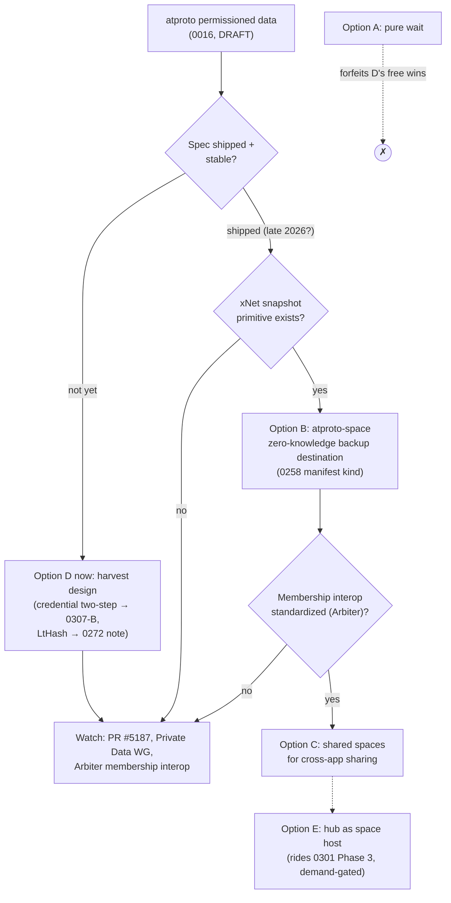
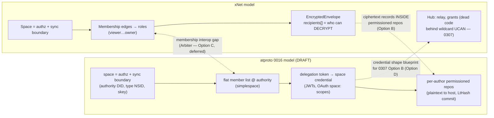

# ATProto Permissioned Private Data ("Spaces") And How It Intersects With xNet

## Problem Statement

Exploration [0301](0301_%5B_%5D_ATPROTO_INTEGRATION_IDENTITY_SYNC_AND_HUB_AS_PDS.md)
dismissed AT Protocol as a home for xNet's private data in one paragraph:
repos are public-only, the "permissioned data" idea was a pre-implementation
sketch, and "building on it now is building on sand." Since then the sand has
been poured into a mold: Bluesky merged a full **permissioned data proposal**
(`0016-permissioned-data`, July 3 2026), published a six-part design diary, and
has a 74-commit reference implementation in flight, with parallel
implementations (Blacksky, Northsky, Habitat) named on the official roadmap
and shipping "expected later in 2026."

The proposal's centerpiece is called — awkwardly for us — a **"space"**: an
authorization and sync boundary with a member list, per-author permissioned
repos, OAuth-scoped credentials, and pull-based sync. xNet's own core privacy
unit is *also* called a **Space** and is *also* the authorization and sync
boundary. This exploration answers:

1. What exactly is atproto planning, in enough detail to design against?
2. Where do the two models converge and where do they structurally conflict?
3. Which of 0301's conclusions change now that private data on atproto is a
   real (draft) design rather than vapor?
4. What should xNet build, borrow, watch, or ignore?

## Executive Summary

**The proposal is convergent evolution with inverted trust.** Atproto spaces
and xNet Spaces independently arrived at the same skeleton: the space is the
unit of membership, authorization, and replication; each author's writes live
in their own per-author log/repo; sync is per-space, not firehose; membership
is a flat list controlled by an authority. But the trust models are mirror
images. Atproto spaces are **"access control, not confidentiality"** — the
proposal is explicit that hosts see plaintext so servers can search, index,
notify, and moderate; E2EE is "out of scope." xNet is the opposite:
per-node XChaCha20 envelopes with X25519 recipient wrapping
([`packages/crypto/src/envelope.ts`](../../packages/crypto/src/envelope.ts))
are the *real* boundary, while the hub's ACL machinery is largely dead code
behind a self-issued wildcard UCAN
([`packages/react/src/provider/use-hub-auth-token.ts:10-16`](../../packages/react/src/provider/use-hub-auth-token.ts),
per [0307](0307_%5B_%5D_SECURITY_OF_NODE_AND_CHANGE_FLOW.md)). Atproto has
authorization without confidentiality; xNet today has confidentiality without
(effective) authorization. Neither can adopt the other's model wholesale —
but each is the missing half of the other.

**What changes vs 0301: the "PDS as destination" option upgrades from
rejected to conditionally interesting.** 0301's Option B (PDS as sync
substrate) was rejected on three grounds: public-only repos, ~0.46 writes/s
rate limits, and latency. Permissioned repos remove the first ground
*partially* (private from the world, **never private from the host**), state
**no record/size limits**, and replace firehose latency with pull-based
`listRepoOps` + push nudges. What survives of the rejection: live
collaborative sync is still out (no private firehose, pull-based eventual
consistency, seconds not sub-100 ms), and xNet content stored in a
permissioned repo must remain **ciphertext** (xNet envelopes over atproto
ACLs — belt over their braces), because a `trust: 'zero-knowledge'`
destination is the only posture consistent with xNet's model. The realistic
near-term use: **encrypted Space snapshot backup and cold-sync into the
user's PDS**, slotting into the 0258 replication manifest as a new
destination kind — the exact seam 0301 pre-identified.

**The most valuable intersection isn't storage — it's design harvest and
positioning.** Three specific harvests: (1) the **delegation-token →
space-credential** two-step (single-use 60 s PDS-minted token exchanged for a
2 h authority-signed credential) is a production-shaped blueprint for
replacing xNet's wildcard UCAN — 0307's Option B ("least-privilege tokens")
with someone else having done the design work. Ironically, the proposal's
author (dholms, a UCAN co-author) rejected UCAN for member lists — "Protocols
are supposed to be boring!" — which is a datapoint xNet should weigh, since
our UCAN deployment degenerated into a wildcard anyway. (2) **LtHash set
commitments** (homomorphic 2048-byte state, add/remove records without
replaying history) are a better anti-entropy/integrity primitive for
unordered sets than xNet's linear per-author chains offer for repair — worth
noting for the 0272 reliability lane, not urgent. (3) The **Germ pattern** —
E2EE app layered on atproto identity, officially blessed, first-party
launched inside Bluesky's app in Feb 2026 — is exactly the positioning slot
xNet should claim for *workspaces*: "the E2EE workspace of the atmosphere,"
using atproto for identity/discovery (0301 Phases 1–2 unchanged) and
eventually permissioned spaces as untrusted encrypted transport.

**Recommendation: watch deliberately, build nothing on the draft, prepare
three seams.** Everything is `[DRAFT]` — the proposal merged but the
implementation PR is unmerged, terminology has churned twice
(namespaces→buckets→spaces), and Bluesky says "later in 2026." Proceed with
0301 Phase 1 (identity link) and Phase 2 (public publishing) unchanged; they
are prerequisites for anything here and unaffected by the draft. Meanwhile:
(a) reserve an `atproto-space` destination kind (zero-knowledge-only) in the
0258 manifest types, (b) adopt the credential two-step shape when doing
0307's wildcard-UCAN replacement, (c) track the proposal + Private Data WG +
the Arbiter group-membership effort, because whoever standardizes group
membership across the atmosphere will define what "sharing an xNet Space
with an atproto contact" means.

## Current State In The Repository

### xNet's private-data primitive: envelope encryption, not ACLs

- [`packages/crypto/src/envelope.ts:54-99`](../../packages/crypto/src/envelope.ts)
  — `EncryptedEnvelope`: XChaCha20-Poly1305 ciphertext, `recipients: DID[]`,
  per-recipient X25519-wrapped content keys, plaintext hub-visible metadata
  (`id`, `schema`, `createdBy`, `lamport`, `publicProps`). Public nodes use
  an all-zeros `PUBLIC_CONTENT_KEY` + `PUBLIC` sentinel recipient — one code
  path, the recipient list is the boundary.
- [`packages/crypto/src/key-resolution.ts:168`](../../packages/crypto/src/key-resolution.ts)
  — X25519 encryption keys derive birationally from the member's Ed25519 DID:
  **adding a member to the recipient set requires no key exchange at all**.
  (PQ DIDs fall back to an unauthenticated hub key-registry fetch — 0307
  flags it.)
- [`packages/crypto/src/envelope.ts:303-327`](../../packages/crypto/src/envelope.ts)
  — `updateEnvelopeRecipients` re-wraps on grant/revoke. Known gap (0307 #4):
  the envelope signature does not cover the ciphertext.

### xNet Spaces: same word, same skeleton as the atproto proposal

- [`packages/data/src/schema/schemas/space.ts:4-15`](../../packages/data/src/schema/schemas/space.ts)
  — "a Space is a SECURITY BOUNDARY"; membership edges; roles
  `viewer→commenter→member→admin→owner`; nesting with inherit-down;
  most-permissive-wins (`effectiveSpaceRole`, `:147-153`).
- [`packages/data/src/auth/recipients.ts:56-114`](../../packages/data/src/auth/recipients.ts)
  — `computeRecipients` folds membership + grant-index into the envelope
  recipient set (and expands DIDs to account devices per 0243). Space
  membership drives *both* hub grants and who-can-decrypt — the unifying
  cascade.
- [`packages/runtime/src/sync/replication-scope.ts:37-48`](../../packages/runtime/src/sync/replication-scope.ts)
  — the Space is the replication unit (`xnet://<did>/space/<id>/`), with
  policies as synced data (0258 "manifest as data") and
  `ReplicaTrust = 'trusted' | 'zero-knowledge'` on destinations —
  **declared but not yet enforced**
  ([`MultiHubSyncManager.ts:55-58`](../../packages/runtime/src/sync/MultiHubSyncManager.ts)).

### xNet's authorization reality: the half atproto has and we don't

Per [0307](0307_%5B_%5D_SECURITY_OF_NODE_AND_CHANGE_FLOW.md), verified
current:

- The standard client still self-issues a **wildcard UCAN**
  ([`use-hub-auth-token.ts:10-16`](../../packages/react/src/provider/use-hub-auth-token.ts)),
  which short-circuits `authorizeRoomAction` at the capability check
  ([`packages/hub/src/ws/authorize.ts:146-158`](../../packages/hub/src/ws/authorize.ts))
  — the grant-index and Space-cascade checks below it are dead code for a
  normal client.
- Share-grant write checks **fail open** when no grant record exists
  ([`packages/hub/src/services/share-access.ts:184-195`](../../packages/hub/src/services/share-access.ts)).
- The schema `authEvaluator` is wired but optional
  ([`packages/data/src/store/store.ts:1608`](../../packages/data/src/store/store.ts));
  default production path runs none.
- Net: "confidentiality currently *is* encryption." 0307's Option B
  (least-privilege tokens, revocation, nonces) is the open recommendation
  this exploration's credential-harvest feeds directly into.

### Existing atproto surface in the repo

Enum-only: platform entry `'atproto'` in
[`packages/social/src/schemas/constants.ts:19`](../../packages/social/src/schemas/constants.ts)
and a `plannedImporter` stub in
[`packages/social/src/importers/registry.ts:195-203`](../../packages/social/src/importers/registry.ts)
(CAR export listed, no adapter). No DID resolver, no Lexicon, no XRPC. 0301's
Phase 1–3 checklists are all unstarted.

## External Research

Status legend: **[SHIPPED]** live in production · **[DRAFT]** published but
explicitly subject to change · **[SPECULATION]** community inference.

### The proposal itself — `0016-permissioned-data` [DRAFT]

Authored by Daniel Holmgren (dholms — Bluesky protocol engineer and,
notably, a UCAN spec co-author). PR #94 opened June 23 2026, merged July 3
2026 into `bluesky-social/proposals`, with the standing caveat that
"details, terminology, and behaviors are all likely to change."

**Data model.**

- A **space** is the authorization *and* sync boundary, identified by
  `(authority DID, space type NSID, space key)`. Space types are declared in
  Lexicon (`"type": "space"`) with an expected `collections` list. Intended
  to scale from personal (bookmarks, mutes) to communities of "millions."
- Data is **not collocated**: each member's records stay on *their own PDS*
  in a **permissioned repo** (one user's records within one space). The
  space is the network-wide aggregation of per-author permissioned repos —
  the reason the earlier "bucket" name died. Addressing:
  `at://{spaceDid}/space/{spaceType}/{skey}/{authorDid}/{collection}/{rkey}`.
- **No MST, no commit chain.** Each permissioned repo is summarized by an
  **LtHash set commitment**: 2048-byte homomorphic state (1024 × uint16
  lanes), records mapped via BLAKE3 XOF and added/subtracted mod 2¹⁶;
  digest = SHA-256(state). Adding/removing a record is O(1) state math, no
  history replay.
- **Deniable commits**: the author signs a context string and binds the
  digest only via `HMAC(HKDF(per-reader ikm, ctx), hash)` — a rebroadcast
  commit cannot *prove* to third parties what the user wrote. A deliberate
  anti-screenshot-receipts property public repos lack.

**Authorization.**

- **One flat member list per space**, controlled by the space authority. On
  the list ⇒ read/sync everything in the space. Write legitimacy is
  app-level (readers validate against the member list), not
  protocol-enforced. Holmgren explicitly rejected UCAN/object-capabilities
  (revocation complexity, token size, unfamiliarity): "Protocols are
  supposed to be boring!"
- Credential flow, all JWTs: PDS mints a single-use **delegation token**
  (`getDelegationToken`, 60 s TTL) → space authority exchanges it for a
  multi-use **space credential** (2 h TTL, authority-signed). Optional
  client attestation via `private_key_jwt` when a space gates on app
  identity.
- Rides the **shipped** OAuth scope grammar
  ([SHIPPED early 2026] — `repo:`/`rpc:`/`blob:` resource families +
  Lexicon-declared permission sets, discussion #4437):
  `space:<spaceType>?authority=…&collection=…&action=read|read_self|create|update|delete&manage=…`.
- The authority can be the user's own DID (personal spaces) or a
  **dedicated DID**, so a shared space can outlive/transfer between users.
  Resolution via DID doc (`#atproto_space` key, `#atproto_space_host`
  service). Baseline every PDS must ship: `com.atproto.simplespace`
  (create/update/delete space, add/remove/list members; policies
  `member-list` | `public` | `managing-app`). Richer membership semantics
  are **explicitly out of scope**.

**Enforcement and the E2EE stance.**

- Enforcement is server-side at the repo host / space host. The proposal is
  blunt: **"access control, not confidentiality"**; hosts see plaintext so
  servers can do search, indexing, notifications, aggregation, moderation.
  E2EE "may be layered on top by an application and is out of scope."
  Diary #1 (Feb 2026) gives the rationale: threat-model split (DMs vs
  forums), server-side features, key-management UX for normal humans, and
  MLS-class protocols capping around 2–10k members vs spaces targeting
  millions.

**Sync.**

- **There is no private firehose** — "permissioned repositories are by their
  nature non-rebroadcastable." Apps pull per-repo (`listRepoOps` op-log
  since a rev, running LtHash comparison; `getRepo` CAR export for full
  recovery), nudged by best-effort push notifications
  (`registerNotify`/`notifyWrite`). Eventual consistency never depends on
  notifications. Apps syncing only private data must still watch the public
  firehose for account/identity events (flagged as friction by bnewbold).
- No record/size limits stated. Deletion of a space is a *signal*; repo
  hosts flag rather than erase. Moderation: labelers join as members;
  labels are records *inside* the space (moderation stays private).

**Implementation status (mid-July 2026).** Reference implementation
`bluesky-social/atproto` PR #5187 (new `@atproto/space` package, PDS
migrations + endpoints) — **Draft, unmerged**, active review. Nothing in
production or sandbox found. Roadmap: "a major focus through the summer,"
shipping "expected later in 2026," with Blacksky, Northsky, and Habitat
running parallel implementations to be converged via the community
**Private Data Working Group**.

### What actually shipped for private state so far

- **Bookmarks** [SHIPPED Sep 2025] — but stored in the Bluesky **AppView**,
  off-protocol, same as mutes and preferences: precisely because the
  protocol has no private data yet.
- **Germ** [SHIPPED] — MLS-based E2EE DMs keyed to atproto identity;
  launched *inside* the Bluesky app Feb 18 2026 (profile badge → E2EE chat;
  Germ cannot decrypt). This is the officially blessed template for E2EE on
  atproto: an application layer above identity, orthogonal to permissioned
  data. Bluesky's own on-protocol E2EE messaging is deferred until after
  shared data, MLS preferred.

### Community signal

- **Group membership is the acknowledged gap.** Zicklag (Roomy/muni.town)
  published the **Arbiter** proposal (Apr 2026): a standardized, DID-bearing
  group-membership service (spaces delegating to spaces, ~8 permission
  tiers) so member lists interoperate across apps — the layer where a
  workspace product's roles would live. Roomy itself still runs private
  data off-protocol (atproto identity + Automerge behind their Leaf server)
  and names missing private data as its "major barrier."
- **Critiques**: custom AppViews aggregating a space need whole-space read
  credentials (privacy tension, tunjid); headless/CI clients can't touch
  spaces without full OAuth (bnewbold); HN skepticism that distributed
  per-PDS storage is redundant when "applications would likely keep a full
  replica" (answered with the portability argument); de-facto
  centralization worries.
- **Northsky's counter-model**: privacy as PDS-level trust domain, arguing
  moderation *requires* plaintext inspection points — the strongest
  articulation of the no-E2EE camp.

## Key Findings

1. **Convergent skeleton, inverted trust.** Space as authz+sync boundary,
   per-author logs, flat member list, pull-per-space sync — both systems.
   But atproto enforces at the host and shows it plaintext; xNet enforces
   with encryption and (today) barely at the host. Composition is natural:
   xNet envelopes *inside* atproto permissioned records gives
   defense-in-depth; atproto's credential discipline *inside* xNet's hub
   gives the authz xNet lacks.
2. **The 0301 Option B rejection narrows but does not fall.** Private-from-
   the-world storage in the user's PDS becomes real; private-from-the-host
   never will ("access control, not confidentiality" is a design position,
   not a gap). Live sync remains out: no private firehose, pull-based
   eventual consistency, plus friction (OAuth-only access, public-firehose
   watching for identity events). What opens up is the **low-frequency
   lane**: encrypted snapshots, cold backup, portable Space export — no
   stated rate/size limits, LtHash-verifiable, migration-aware.
3. **The credential two-step is 0307 Option B, pre-designed.** Single-use
   short-TTL PDS-minted delegation token → scoped, audience-bound,
   authority-signed 2 h credential. Swap "PDS" for "xNet identity layer"
   and "space authority" for "hub grant index" and this is the shape of the
   wildcard-UCAN replacement — including the lesson that the UCAN co-author
   chose boring JWTs + member lists over capabilities for exactly the
   revocation/complexity reasons that left xNet's UCAN deployment
   degenerate.
4. **LtHash set commitments are a genuinely new primitive in this space.**
   O(1) add/remove, order-independent, quantum-resistant-hash-based,
   streaming-verifiable CAR export, plus deniability via per-reader MACs.
   xNet's linear per-author chains give stronger *ordering* guarantees but
   worse *set-repair* ergonomics (anti-entropy today means cursor replay).
   A per-Space LtHash over `(nodeId, changeHash)` would make cross-replica
   divergence detection O(1) — relevant to 0272 reliability and the 0258
   multi-home world where replicas multiply.
5. **The naming collision is a docs problem now and a product problem
   later.** "Share this Space" will mean two different things once xNet
   users also have atproto spaces. Decide vocabulary before Phase 2
   publishing ships user-facing atproto UI.
6. **Identity-first sequencing (0301) is unchanged and now more valuable.**
   Every interaction with permissioned data — delegation tokens, space
   credentials, OAuth scopes — presumes the user has a linked atproto
   identity. Phase 1 is the gate to all of it.

## Options And Tradeoffs

### Option A — Do nothing until it ships (pure watch)

| For | Against |
|---|---|
| Zero cost; draft has churned twice already (namespaces→buckets→spaces); "later in 2026" from a team with long timelines | Forfeits design harvest that is useful *regardless* (credential shape, LtHash); risks the Arbiter/WG defining group-membership interop without workspace-product input; 0258 types get retrofitted later |

### Option B — Encrypted snapshot/backup destination (`atproto-space` in the 0258 manifest)

The user's PDS hosts a personal permissioned space (authority = their own
DID, `read_self`) holding **xNet-encrypted** Space snapshots and/or coarse
change batches. Strictly `trust: 'zero-knowledge'`; the PDS sees envelope
metadata only (and even that can be minimized — `publicProps` stays empty
for private Spaces).

| For | Against |
|---|---|
| Real user value: workspace survives hub loss using infra the user already has; upgrade of 0301's "salvageable fragment" now without public-repo shame or (stated) rate limits; slots into the pre-built 0258 seam; LtHash gives free integrity verification of the backup | Blocked on the spec shipping AND on xNet growing a snapshot/compaction primitive (still absent — change log is the only canonical form); host-visible metadata (who backs up, when, how much) is inherent; encrypted-blob dumping may attract policy friction on hosted PDSes even in private spaces |

### Option C — Shared spaces as cross-app private sharing (interop lane)

Model "share this xNet document with an atproto contact" as a shared
permissioned space (dedicated authority DID) whose members mirror the xNet
Space membership; content stays xNet-encrypted, atproto ACLs gate transport.

| For | Against |
|---|---|
| The only path by which non-xNet atproto apps could ever *see* shared xNet artifacts; aligns with where Roomy/Arbiter are heading — a seat at the group-membership-interop table | Deepest dependency on the least-settled part of the draft (membership semantics explicitly out of scope; Arbiter <3 months old); two membership systems to reconcile (xNet roles vs flat member list — atproto has no viewer/commenter/member gradient); foreign apps see ciphertext unless we also publish plaintext, which reopens the whole trust question |

### Option D — Harvest the design into xNet's own kernel roadmap

No atproto dependency at all: (D1) adopt the delegation-token →
scoped-credential shape for the 0307 wildcard-UCAN replacement; (D2)
per-Space LtHash set commitment for anti-entropy/divergence detection;
(D3) consider per-reader deniable MACs for shared-Space exports.

| For | Against |
|---|---|
| Pays off even if atproto private data slips or changes; D1 re-activates the hub's existing (currently dead) grant/cascade code and is 0307's own top recommendation; D2 is O(1) divergence detection for the multi-replica 0258 world | D1 is real security-critical work regardless of blueprint; D2 adds a second integrity primitive to a kernel that prizes having one; D3 is niche until exports exist |

### Option E — Hub as space host / repo host (extend 0301 Option D)

When the hub eventually embeds a PDS (0301 Phase 3), also implement
`com.atproto.space.*` + `simplespace` so xNet hubs host permissioned repos
for their users.

| For | Against |
|---|---|
| "Your hub is your PDS *and* your private-space host" — maximal sovereignty story; hub already has the operational shape | Inherits everything that made 0301 Phase 3 demand-gated, plus a moving spec on top; zero point before Phases 1–2 exist; parallel implementations (Blacksky et al.) may fragment the surface before convergence |



## Recommendation

**Adopt D + prepare B; keep 0301's phasing as the spine; explicitly defer
C and E.**

1. **Now (no atproto dependency):**
   - When 0307's wildcard-UCAN replacement is scheduled, use the
     delegation-token → scoped-credential shape as the design template:
     short-TTL single-use token minted by the identity layer, exchanged for
     an audience-bound, resource-scoped, revocable credential checked by
     the hub's *existing* `authorizeRoomAction` path (which today is dead
     code below the wildcard match). Member lists + grants over
     capability chains — the "boring auth" lesson.
   - Add a one-page note to the 0272 reliability backlog: per-Space LtHash
     set commitment over `(nodeId, changeHash)` as O(1) cross-replica
     divergence detection. Do not implement until multi-home replicas are
     real.
   - Resolve the vocabulary collision before any user-facing atproto UI:
     recommend rendering theirs as **"atmosphere spaces"** in xNet UI and
     docs, ours stays "Space."
2. **Reserve the seam (cheap, types-only):** add `'atproto-space'` to the
   0258 destination-kind union alongside the 0301-planned `'atproto-pds'`,
   with `trust: 'zero-knowledge'` **mandatory at the type level** for both.
   No behavior. This keeps manifest-as-data forward-compatible and encodes
   the policy decision (never plaintext to atproto hosts) where it can't be
   forgotten.
3. **Watch with named triggers (re-evaluate, don't poll):**
   - PR #5187 merges + a sandbox exists → prototype Option B behind a flag
     *if* the snapshot primitive exists by then; otherwise the snapshot
     primitive becomes the blocker to schedule.
   - Arbiter/WG produces a membership-interop draft with ≥2 implementers →
     assess Option C and take a position (xNet Space roles need a mapping
     story to flat member lists).
   - Bluesky ships spaces to production PDSes → refresh this doc; check
     whether "no rate limits" survived contact with hosting economics.
4. **Positioning (write it into 0316/marketing when Phase 2 lands):** xNet
   is to workspaces what Germ is to DMs — the E2EE layer above atproto
   identity. Atproto's own proposal says E2EE "may be layered on top by an
   application"; that application, for documents and workspaces, should be
   xNet.

What this explicitly does **not** change from 0301: the kernel
(did:key/Ed25519/BLAKE3) stays; no private workspace plaintext ever reaches
an atproto host under any option; live collaborative sync stays on the hub;
no building on the draft before it ships.

```mermaid
sequenceDiagram
  participant App as xNet app
  participant PDS as User's PDS (repo host)
  participant Auth as Space authority (user's own DID)
  participant Hub as xNet hub

  Note over App,Auth: Option B — encrypted Space backup into a personal permissioned space
  App->>PDS: OAuth w/ scope space:net.x.backup?action=create (SHIPPED grammar)
  App->>PDS: getDelegationToken (single-use, 60s)
  App->>Auth: getSpaceCredential(delegation token)
  Auth-->>App: space credential (2h, authority-signed)
  App->>App: snapshot Space → xNet EncryptedEnvelope(s)<br/>(recipients = space members' DIDs, publicProps = {})
  App->>PDS: com.atproto.space applyWrites [ciphertext records]
  PDS-->>PDS: LtHash state += records; signed deniable commit
  Note over PDS: Host sees ciphertext + sizes/timing only
  Note over App,Hub: Live sync path — unchanged
  App->>Hub: node-change (40/s, WS rooms, sub-100ms) — hub remains the collaborative substrate
  Hub-->>PDS: (nothing — zero-knowledge boundary holds)
```



## Risks And Open Questions

- **Everything upstream is a draft.** Two renames already; implementation
  unmerged; "later in 2026" from a team whose private-data estimate was
  "at least a year" in Feb 2025 — and it was. Mitigation: only Option D
  (no dependency) and a types-only seam now.
- **Metadata is the irreducible leak.** Even ciphertext-only Option B shows
  the host record counts, sizes, timing, and the space's existence; the
  member list itself lives plaintext at the authority. For some xNet users
  (0268 EMR-adjacent) that alone is disqualifying — the destination must be
  opt-in per Space, never default.
- **Membership-model impedance.** xNet has graded roles and nested
  inherit-down Spaces; simplespace has a flat list and explicitly
  unspecified richer semantics. Mapping "commenter" into a system where
  read = everything and write-legitimacy is app-level needs design work —
  or waits for Arbiter-style tiers to stabilize.
- **Fragmentation risk.** Blacksky/Northsky/Habitat parallel
  implementations may diverge before the WG converges them; building
  against Bluesky's reference could still mean rework.
- **Policy friction for encrypted blobs.** No stated limits ≠ no limits;
  hosted PDS operators may throttle or prohibit opaque-ciphertext spaces
  once storage costs bite. Self-hosted/hub-embedded PDSes (Option E)
  sidestep this but sit furthest out.
- **Open question:** should xNet's own credential redesign (0307 Option B)
  aim for *wire-level* compatibility with `atproto-space-credential+jwt`
  (so a future hub-as-space-host speaks one credential dialect), or merely
  copy the shape? Leaning shape-only — wire compat marries a moving spec.
- **Open question:** does the snapshot primitive (prerequisite for Option
  B) deserve its own exploration first? It has independent value (compaction
  for the 0249 change-log bloat lineage) and is the actual critical path.
- **Open question:** if deniable commits become the atmosphere norm, do
  xNet's *exports/shares* need an equivalent (per-reader MACs), or is
  non-repudiation actually a feature for workspace audit trails? Likely
  audience-dependent; note and defer.

## Implementation Checklist

Now — no atproto dependency:

- [ ] 0307 Option B design doc references the delegation-token →
      space-credential two-step as its template (short-TTL single-use mint →
      scoped audience-bound credential → existing `authorizeRoomAction`
      grant path enforces; wildcard `HUB_CAPABILITIES` removed)
- [ ] Add `'atproto-space'` (and `'atproto-pds'` from 0301) to the 0258
      `ReplicationDestinationSpec` kind vocabulary, `trust:
      'zero-knowledge'` required at the type level for both; no runtime
      behavior; changeset per policy (runtime is publishable)
- [ ] 0272 backlog note: per-Space LtHash set commitment for O(1)
      cross-replica divergence detection (design sketch only)
- [ ] Vocabulary decision recorded in docs: atproto spaces rendered as
      "atmosphere spaces" in any xNet UI/docs; xNet Space unqualified
- [ ] Add exploration cross-links: 0301 (permissioned-data caveat →
      pointer here), 0307 (Option B template), 0258 (destination kinds)

Trigger-gated — when PR #5187 merges and a sandbox exists:

- [ ] Snapshot/compaction primitive scheduled (own exploration if needed —
      it is the critical path for Option B)
- [ ] Flagged prototype: personal `net.x.backup` space type lexicon;
      snapshot → `EncryptedEnvelope` records via `applyWrites`; restore
      path verifies LtHash state against local set
- [ ] Privacy gate test: no plaintext node content and no non-empty
      `publicProps` can reach any atproto write path for private-visibility
      Spaces (mirror of the `/public/*` effective-visibility gate)

Trigger-gated — when membership interop (Arbiter/WG) has a multi-implementer draft:

- [ ] Position doc: xNet Space roles ↔ flat member list / Arbiter tiers
      mapping; decide Option C go/no-go

## Validation Checklist

- [ ] 0307 Option B ships with scoped credentials and the hub's
      grant-index/Space-cascade branches are exercised by integration tests
      (no longer dead code); a replayed or wildcard token is rejected
- [ ] 0258 manifest types reject an `atproto-*` destination with
      `trust: 'trusted'` at compile time
- [ ] (Post-ship prototype) A Space backed up to a real sandbox PDS
      restores bit-identical on a fresh device with the hub offline; the
      PDS operator's view (DB inspection) contains no plaintext content
      fields
- [ ] (Post-ship prototype) Revoking the OAuth grant / deleting the space
      makes subsequent `listRepoOps` fail while local + hub sync continue
      unaffected
- [ ] Docs: a reader of 0301 + 0322 can state the trust difference in one
      sentence each ("atproto spaces: host sees everything, world doesn't;
      xNet: nobody but recipients, including the host")
- [ ] Re-evaluation triggers are recorded somewhere that gets read
      (exploration index or 0301 checklist), not just in this file

## References

- Prior explorations:
  [0301 atproto integration](0301_%5B_%5D_ATPROTO_INTEGRATION_IDENTITY_SYNC_AND_HUB_AS_PDS.md) ·
  [0307 node/change security](0307_%5B_%5D_SECURITY_OF_NODE_AND_CHANGE_FLOW.md) ·
  [0258 multi-home sync](0258_%5B_%5D_MULTI_HOME_SYNC_FEDERATED_HUBS_PEERS_AND_THE_REPLICATION_MANIFEST.md) ·
  [0304 schema authz CRUD](0304_%5Bx%5D_SPLITTING_WRITE_INTO_CREATE_AND_UPDATE_SCHEMA_AUTHORIZATION_CRUD.md) ·
  [0272 durability & reliability](0272_%5Bx%5D_DURABILITY_RELIABILITY_AND_SCALE_TESTING.md) ·
  [0181 spaces & nested auth](0181_%5B_%5D_SPACES_AS_NESTED_GROUPINGS_AND_SCHEMA_AUTHORIZATION.md)
- Proposal + implementation:
  [0016-permissioned-data](https://github.com/bluesky-social/proposals/tree/main/0016-permissioned-data) ·
  [proposals PR #94](https://github.com/bluesky-social/proposals/pull/94) ·
  [atproto PR #5187 (reference impl, draft)](https://github.com/bluesky-social/atproto/pull/5187) ·
  [0011-auth-scopes](https://github.com/bluesky-social/proposals/blob/main/0011-auth-scopes/README.md) ·
  [Early permission sets (#4437)](https://github.com/bluesky-social/atproto/discussions/4437)
- Design diary (dholms.leaflet.pub): Diary 1 "To Encrypt or Not to
  Encrypt" (Feb 11 2026) · Diary 2 "Buckets" · "Interlude: Spaces" ·
  Diary 3 "Your Bucket, My Data" · Diary 4 "The Big Picture" · Diary 5
  "What's in a Name?" · Diary 6 "Boring Auth" (Jun 5 2026) · "Modeling
  communities on permissioned data"
- Roadmaps: [Spring 2026](https://atproto.com/blog/2026-spring-roadmap) ·
  [Spring 2025](https://atproto.com/blog/2025-protocol-roadmap-spring)
- Community: [Private Data WG](https://atproto.wiki/en/working-groups/private-data) ·
  [WG notes (Feb 2025 sketch)](https://notes.commonscomputer.com/s/atproto-private-data-wg) ·
  [The Arbiter (zicklag)](https://zicklag.leaflet.pub/3mjrvb5pul224) ·
  [Roomy atproto integration issue](https://github.com/muni-town/roomy/issues/454) ·
  [Northsky privacy model](https://chipnick.com/a-model-for-addressing-privacy-on-atproto/)
- Shipped private state:
  [Bookmarks (AppView-side)](https://techcrunch.com/2025/09/08/bluesky-adds-private-bookmarks/) ·
  [Germ × Bluesky launch](https://techcrunch.com/2026/02/18/a-startup-called-germ-becomes-the-first-private-messenger-that-launches-directly-from-blueskys-app/) ·
  [Germ atproto beta](https://www.germnetwork.com/blog/germdm-atproto-now-beta)
